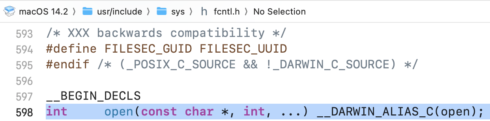

## 네트워크 프로그래밍

네트워크를 통해 기기 간 데이터 송수신이 이루어질 때에는 소켓을 통해 이루어진다. 소켓은 각 `운영체제에서 제공되는 소프트웨어적 장치이다`. 네트워크 프로그래밍은 소켓 기반으로 이루어지기 때문에 소켓 프로그래밍이라고도 부른다. 소켓은 데이터 통신 송수신 방법의 세세한 부분을 래핑하여 추상화한다.

소켓은 전화기에 비유되는데, 수신을 위한 목적과 송신을 위한 목적으로 생성 방법이 구분된다. 소켓 생성시에는 주소정보가 할당된다. 소켓 주소정보는 **IP와 포트번호로 구성된다.**

`socket()`함수가 호출되고 `bind()`함수를 통해 주소 정보가 연결된다. 주소 정보까지 할당이 완료되면 외부로부터 연결 가능한 상태로 세팅해야한다. 해당 역할을 바로 `listen()` 함수가 하게 된다. 해당 함수 호출까지 이루어지면 수신 전용 소켓이 생성된다.

`listen`은 수신 가능한 상태가 되는 것이고, `accept()`함수가 호출되어야 따르릉 울리는 전화기의 수화기를 드는 행위가 이루어지는 것이다.

연결 요청을 허용하는 프로그램을 가리켜 `서버(Server)`라고 한다. 서버는 연결을 요청하는 클라이언트보다 먼저 실행되어야 한다.

위 과정을 거쳐 생성된 소켓을 `서버 소켓`, `리스닝 소켓`이라 한다.

### 정리

1. 소켓은 전화기로 비유할 수 있다.
2. 소켓 생성 (`socket()`)
3. 소켓 주소 할당 (`bind()`), 주소 정보는 IP와 포트번호로 이루어짐
4. 소켓을 네트워크 망에 연결 (`listen()`)
5. 외부 연결을 허용 (`accept()`)

## 리스닝 소켓 (서버 소켓) 생성 코드

```c
void error_handling(char *message);

int main(int argc, char *argv[])
{
	int serv_sock; // 소켓 디스크립터 저장 변수
	int clnt_sock;

	struct sockaddr_in serv_addr;
	struct sockaddr_in clnt_addr;
	socklen_t clnt_addr_size;

	char message[]="Hello World!";

	if(argc!=2){
		printf("Usage : %s <port>\n", argv[0]);
		exit(1);
	}

    // 소켓 생성 함수
	serv_sock=socket(PF_INET, SOCK_STREAM, 0);
	if(serv_sock == -1)
		error_handling("socket() error");
}
```

위 코드에서 `socket()`함수 호출을 통해 소켓이 생성된다. 실제 소켓 생성은 내부 운영체제를 통해 이루어지기 때문에 알 필요가 없고, 리턴되는 값을 통해 소켓을 활용하게 된다. 이때 리턴 값은 소켓을 지칭하는 숫자이며 `파일 디스크립터`, 혹은 `소켓 핸들`이라고 한다.

```c
int main(int argc, char *argv[])
{
    // ...
    serv_sock=socket(PF_INET, SOCK_STREAM, 0);
    if(serv_sock == -1)
        error_handling("socket() error");

    memset(&serv_addr, 0, sizeof(serv_addr));
    serv_addr.sin_family=AF_INET;
    serv_addr.sin_addr.s_addr=htonl(INADDR_ANY);
    serv_addr.sin_port=htons(atoi(argv[1])); // 포트번호

	// 주소값 할당
    if(bind(serv_sock, (struct sockaddr*) &serv_addr, sizeof(serv_addr))==-1 )
        error_handling("bind() error");

	// 소켓 리스닝
    if(listen(serv_sock, 5)==-1)
        error_handling("listen() error");

	// accept로 데이터 송수신 흐름 열기
    clnt_addr_size=sizeof(clnt_addr);
    clnt_sock=accept(serv_sock, (struct sockaddr*)&clnt_addr,&clnt_addr_size);
    if(clnt_sock==-1)
        error_handling("accept() error");

    write(clnt_sock, message, sizeof(message));
    close(clnt_sock);
    close(serv_sock);
    return 0;
}
```

위 코드에서 `struct sockaddr_in serv_addr;`를 볼 수 있는데 소켓주소 구조체 타입 기반으로 서버 주소와 클라이언트 주소에 대한 변수를 선언할 수 있게 된다. `memset`으로 변수를 초기화해준다. 이후 `server_addr.sin_family`부터 이어지는 세 코드동안 주소 정보가 초기화된다.

이후 `bind`함수 호출 시 위에서 생성한 소켓 `파일 디스크립터`, 소켓 주소 정보를 전달한다. 소켓 정보를 `listen`함수에 전달하여 해당 소켓이 네트워크 망에 연결된다.

소켓이 `listen` 호출 뒤 `accept`까지 호출한다. 해당 함수는 호출로 동작이 끝나는 게 아니라 블록되어 대기 시간이 발생하며 이때 외부로부터 연결 요청이 오면 본격적으로 연결이 이루어진다.

## 클라이언트 소켓 생성 코드

클라이언트 소켓의 경우 리스닝 소켓 생성과 마찬가지로 `memset`까지 실행 과정이 동일하다.

```c
int main(int argc, char* argv[])
{
	// ...
	if(connect(sock, (struct sockaddr*)&serv_addr, sizeof(serv_addr))==-1)
		error_handling("connect() error!");

	str_len=read(sock, message, sizeof(message)-1);
	if(str_len==-1)
		error_handling("read() error!");

	printf("Message from server: %s \n", message);
	close(sock);
	return 0;
}
```

클라이언트 소켓 코드에서는 `connect` 함수를 호출하여 리스닝 중인 소켓에 연결을 요청한다. 리스닝 소켓 예제 코드에 `write`이 존재하므로 클라이언트 소켓에서는 서버에서 `write`한 데이터를 읽어들이고 소켓을 종료하게 되는 것이다.

## 실습

```shell
> gcc hello_server.c -o hserver
> gcc hello_client.c -o hclient

> ./hserver 9190
> ./hclient 127.0.0.1 9190
```

위의 클라이언트 & 서버 소스를 기반으로 실행파일을 생성하고 독립된 터미널에서 서버 프로그램을 9190 포트에서 실행한다. 이후 클라이언트 프로그램으로 9190 포트 접속을 요청하면 서버 프로그램 내에 하드코딩 해놓았던 텍스트가 전달된다.

## 리눅스 기반 파일 조작하기

리눅스 계열 OS에서는 연결이 이루어진 뒤에 기본 파일 입출력 함수를 통해 데이터를 주고받는다.

윈도우 운영체제와 리눅스 운영체제는 응용 프로그램 개발을 위한 라이브러리 코드가 존재한다. 이때 파일 입출력을 위한 C 표준 함수는 **해당 라이브러리 코드 내에 존재하는 것이 아니다.** C 표준함수 코드는 컴파일러가 운영체제에 맞게 바이너리 코드로 변환해줌으로써 호환 가능하게 된다.

`ANSI-C`는 C언어 표준을 의미한다. 해당 표준 코드들이 OS상에서 돌아가도록 하기 위해 OS 자체 시스템 라이브러리를 거쳐 최종적인 동작이 이루어진다.

리눅스는 소켓도 파일로 간주하기 때문에 저수준 파일 입출력 함수를 기반으로 데이터 송수신이 가능하다. 소켓 뿐만 아니라 콘솔도 파일로 간주한다.

## 파일 열기

유닉스 계열인 맥OS에서 C open함수 내부를 살펴보면 다음과 같은 화면을 볼 수 있다.



`__DARWIN_ALIAS_C`를 통해 시스템 라이브러리 함수를 호출하게 된다.

### 소스

```c
// 파일 쓰기
int main(void)
{
    int fd;
    char buf[]="Let's go!\n";

    fd=open("data.txt", O_CREAT|O_WRONLY|O_TRUNC);
    if(fd==-1)
        error_handling("open() error!");
    printf("file descriptor: %d \n", fd);

    if(write(fd, buf, sizeof(buf))==-1)
        error_handling("write() error!");

    close(fd);
    return 0;
}
```

1. `int open(const char *path, int flag);`: path에 파일 이름을 전달하고 flag에 파일 오픈 모드를 전달한다.
2. 파일 오픈 모드는 `O_CREATE`, `O_TRUNC`등 여러가지가 존재한다. 위 코드에서는 파일 생성 모드, 쓰기 전용 모드, 기존 데이터 삭제 모드를 적용하게 된다.
3. `ssize_t write(int fd, const void * buf, size_t nbytes)`: fd에는 쓰기 연산을 진행할 파일 디스크립터를 전달한다. buf에는 전송할 데이터 주소값을 전달한다. nbytes에는 전송할 데이터 바이트 수를 전달한다.
    - 함수 호출 성공시 전달한 바이트 수를 반환한다.

```c
// 파일 읽기
int main(void)
{
	int fd;
	char buf[BUF_SIZE];

	fd=open("data.txt", O_RDONLY);
	if( fd==-1)
		error_handling("open() error!");

	printf("file descriptor: %d \n" , fd);

	if(read(fd, buf, sizeof(buf))==-1)
		error_handling("read() error!");

	printf("file data: %s", buf);

	close(fd);
	return 0;
}
```

1. `open`함수에 `O_RDONLY`모드를 전달하며 파일을 생성한다.
2. `ssize_t read(int fd, void *buf, size_t nbytes)`: fd에 파일 디스크립터를 전달한다. buf에 읽어들인 데이터를 저장할 버퍼 사이즈를 전달한다. nbytes에 얼마의 사이즈만큼 읽어들일지 전달한다.
    - 함수 호출 성공 시 수신한 바이트 수를 반환한다.
