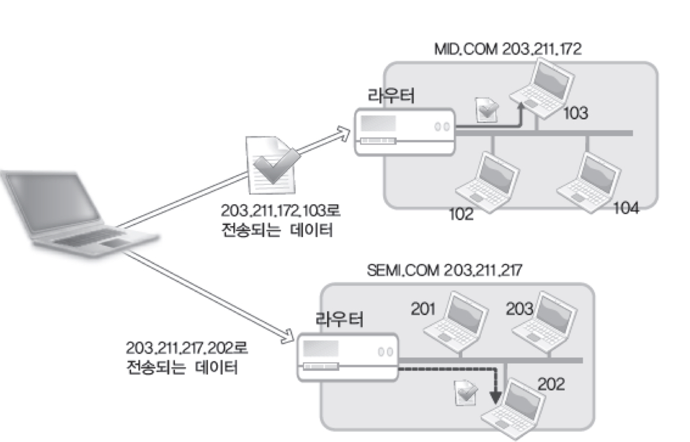

## 인터넷 주소

인터넷 주소는 인터넷 상에서 컴퓨터를 구분하는 목적으로 사용되는 주소이다. IPv4는 4바이트 주소체계이며 IPv6는 16바이트 주소체계이다. (IPv4는 `2^4*8`, IPv6는 `2^16*8`)

인터넷 주소는 네트워크 주소와 호스트 주소로 나뉜다. 네트워크 주소를 통해 라우팅되고, 라우터에 도착 후 호스트 주소를 통해 호스트로 이동한다.

아래 그림에서는 `201.211.172`가 라우터가 되고 마지막 `103`를 통해 진입한다.



IPv4 주소 체계 클래스는 네 가지로 구분된다.

1. 클래스 A: 네트워크 아이디 1바이트 & 호스트 아이디 3바이트
2. 클래스 B: 네트워크 아이디 2바이트 & 호스트 아이디 2바이트
3. 클래스 C: 네트워크 아이디 3바이트 & 호스트 아이디 1바이트
4. 클래스 D: 네트워크 아이디 0바이트 & 호스트 아이디 4바이트

IPv4를 부여받는 집단의 규모에 따라 클래스 결정이 달라진다. 네트워크 아이디는 고정적이기 때문에 호스트를 할당받는 수에 따라 클래스를 지정한다.

IP주소를 참조만 해도 클래스 구분을 할 수 있도록 하기 위해 A, B, C 클래스 첫 번째 바이트 범위가 달라진다.

1. 클래스 A 첫 번째 바이트 범위: 0...127 / 첫 비트가 항상 0으로 시작
2. 클래스 B 첫 번째 바이트 범위: 128...191 / 첫 두 비트가 10으로 시작
3. 클래스 C 첫 번째 바이트 범위: 192...223 // 첫 세 비트가 항상 110으로 시작

## PORT 번호

IP는 컴퓨터를 구분하는 용도로 사용하고 PORT 번호는 소켓을 구분하는 용도로 사용된다. 하나의 프로그램에 둘 이상의 소켓이 존재할 수 있으므로 둘 이상의 PORT가 하나의 프로그램에 의해 할당될 수 있다.

포트번호는 16비트로 사용하고 0~65535 이하 값을 할당받는다. 0~1023까지는 `Well-known PORT`이며 용도가 결정되어 있다.

외부 요청에 대한 프로그램으로의 데이터 분배는 `운영체제와 관련되어 있다.` 포트번호를 참조하여 소켓에 데이터를 할당하게 된다.

## IPv4 주소 표현을 위한 구조체

```c
struct sockaddr_in {
    sa_family_t     sin_family; // 주소체계
    uint16_t        sin_port;   // PORT번호
    struct in_addr  sin_addr;   // 32비트 IP 주소
    char            sin_zero[8]; // 사용되지 않음
}

struct in_addr {
    in_addr_t       s_addr; // 32비트 IPv4 인터넷 주소
}
```

`sockaddr_in`이라는 구조체는 총 `n + 14`바이트로 이루어진다. 포트번호 2바이트, 4바이트 IP주소, `8바이트 sin_zero`를 합하면 14바이트가 된다. `sockaddr_in`구조체는 주소표현을 위한 오리지널 구조체인 `sockaddr`을 IPv4 주소체계에 맞게끔 새로 타입화 한 것이라고 이해하면 된다.

C언어는 메모리 레이아웃 조작이 가능하기 때문에 구조체 속성이 서로 다르게 구성되어 있더라도 **포인터 캐스팅 기법**을 통해 `sockaddr_in`타입을 `sockaddr` 타입으로 캐스팅 가능하다.

```c
struct sockaddr_in serv_addr;

if (bind(serv_sock, (struct sockaddr*) &serv_addr, sizeof(serv_addr)) == -1)
    error_handling("bind error");
```

위 코드에서 `servaddr_in` 구조체가 `bind` 함수 인자에 전달된다. 근데 함수 매개변수 타입이 `sockaddr`이므로 타입 캐스팅을 진행하고, 메모리 레이아웃이 동일하기 때문에 형 변환이 정상적으로 이루어진다.

`sin_zero`변수는 아예 사용조차 되지 않는 멤버이다.

## 네트워크 바이트 순서와 인터넷 주소 변환

CPU가 빅 엔디안, 리틀 엔디안 등인지에 따라 상위 바이트를 메모리 주소에 저장하는 방법이 달라진다. 이는 네트워크 통신 과정에서 각 호스트별로 데이터 표현 방식이 다르다는 것을 의미한다.

이를 위해 **네트워크 바이트 순서**라는 체계를 도입하게 된다. 빅 엔디안과 리틀 엔디안이 **호스트 바이트 순서이다.** 이는 CPU별로 다른 데이터 저장방식을 의미한다.

네트워크 통신 표준을 위해 **네트워크 바이트 순서는 빅 엔디안을 기준으로 한다.** 이러한 작업은 개발자가 직접 하는 것이 아닌 **소켓이 내부적으로 엔디안 변환 처리를 해준다.**

**소켓 생성 이후에는** 엔디안 변환 처리를 내부적으로 자동으로 해주지만 **소켓 생성 과정에서는** 데이터 엔디안 처리를 직접 해줘야 한다.

1. `unsigned short htons(unsigned short);`: 호스트 바이트 순서를 네트워크 순서로 바꿔라
2. `unsigned short ntohs(unsigned short);`: 네트워크 바이트 순서를 호스트 바이트 순서로 바꿔라
3. `unsigned long htonl(unsigned long);`, `unsigned long ntohl(unsigned long);`

`h`는 호스트, `n`은 네트워크, `s`는 `short`자료형, `l`은 `long` 자료형을 의미한다.

기본적으로 CPU별로 엔디안 시스템이 어떻게 갖춰져 있는지 호스트마다 다르기 때문에 코드 작성시 변환 함수는 호출해주는 것이 안전하다.

## 인터넷 주소의 초기화와 할당

```c
#include <arpa/inet.h>

in_addr_t inet_addr(const char * string);
```

`inet_addr`함수는 `211.214.107.99`와 같이 점이 찍힌 10진수 문자열을 전달했을 때 문자열 정보를 참조하여 32비트 IP정수형 주소를 반환해준다. 반환 시 네트워크 바이트 주소인 빅 엔드안으로 변환해준다.

```c
#include <stdio.h>
#include <arpa/inet.h>

int main(int argc, char *argv[])
{
	char *addr1="127.212.124.78";

	unsigned long conv_addr=inet_addr(addr1);
	if(conv_addr==INADDR_NONE)
		printf("Error occured! \n");
	else
		printf("Network ordered integer addr: %#lx \n", conv_addr);

	return 0;
}
```

IP주소를 반환받아서는 `sockaddr_in` 구조체의 IP주소 저장 멤버에 데이터를 할당해야 한다. `inet_addr`을 통해 반환받은 IP주소를 구조체 멤버에 직접 할당해도 되지만, 멤버의 참조를 `inet_aton`함수에 전달하면 반환 성공 시 해당 멤버 주소를 참조하여 직접 IP주소 할당까지 해준다.

```c
#include <arpa/inet.h>

// 성공 시 1, 실패 시 0 반환
int inet_aton(const char * string, struct in_addr * addr);
```

`inet_ntoa`는 네트워크 바이트 주소 데이터를 눈으로 인식하기 쉬운 문자열 형태로 반환해준다.

아래는 인터넷 주소 초기화 전체 코드이다.

```c
struct sockaddr_in addr; // 소켓 데이터 구조체 선언
char *serv_ip = "211.217.168.13"; // IP주소 문자열 선언
char *serv_port = "9190"; // 포트번호 문자열 선언
memset(&addr, 0, sizeof(addr)); // 소켓 데이터 모든 멤버 초기화
addr.sin_family = AF_INET; // 주소체계 지정 - IPv4

// inet_addr로 IP 주소 문자열 네트워크 바이트 주소로 변환
addr.sin_addr.s_addr = inet_addr(serv_ip);

// 문자열 기반 "9190" 데이터를 정수형으로 변환하고 네트워크 바이트 주소로 변환 및 할당
addr.sin_port = htons(atoi(serv_port));
```

`INADDR_ANY`는 현재 실행중인 컴퓨터의 IP주소를 불러와준다.

```c
addr.sin_addr.s_addr = htonl(INADDR_ANY);
```

:::tip 루프백 주소 127.0.0.1

흔히 로컬호스트라고 부르는 127.0.0.1 주소는 루프백 주소를 의미한다. 네트워크로 나아가지 않고 프로그램이 실행되는 환경으로 다시 되돌아오게끔 약속되어 있는 주소이다.

:::

소켓에 인터넷 주소를 할당하기 위해서는 `bind`함수를 호출하게 된다.

```c
#include <sys/socket.h>

// 성공 시 0, 실패 시 1을 반환한다.
int bind(int sockfd, struct sockaddr *myaddr, socklen_t addrlen);
```

1. `sockfd`: 주소정보를(IP & PORT) 할당할 소켓의 파일 디스크립터
2. `myaddr`: 주소정보를 지니는 구조체 변수 주소 값
3. `addrlen`: `myaddr` 구조체 변수의 길이정보

```c
memset(&serv_addr, 0, sizeof(serv_addr));
serv_addr.sin_family=AF_INET;
serv_addr.sin_addr.s_addr=htonl(INADDR_ANY);
serv_addr.sin_port=htons(atoi(argv[1]));

if(bind(serv_sock, (struct sockaddr*) &serv_addr, sizeof(serv_addr))==-1 )
    error_handling("bind() error");
```
