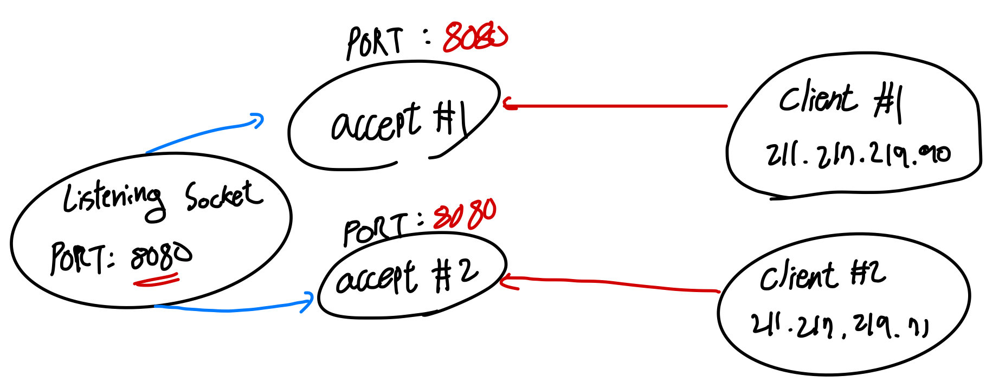
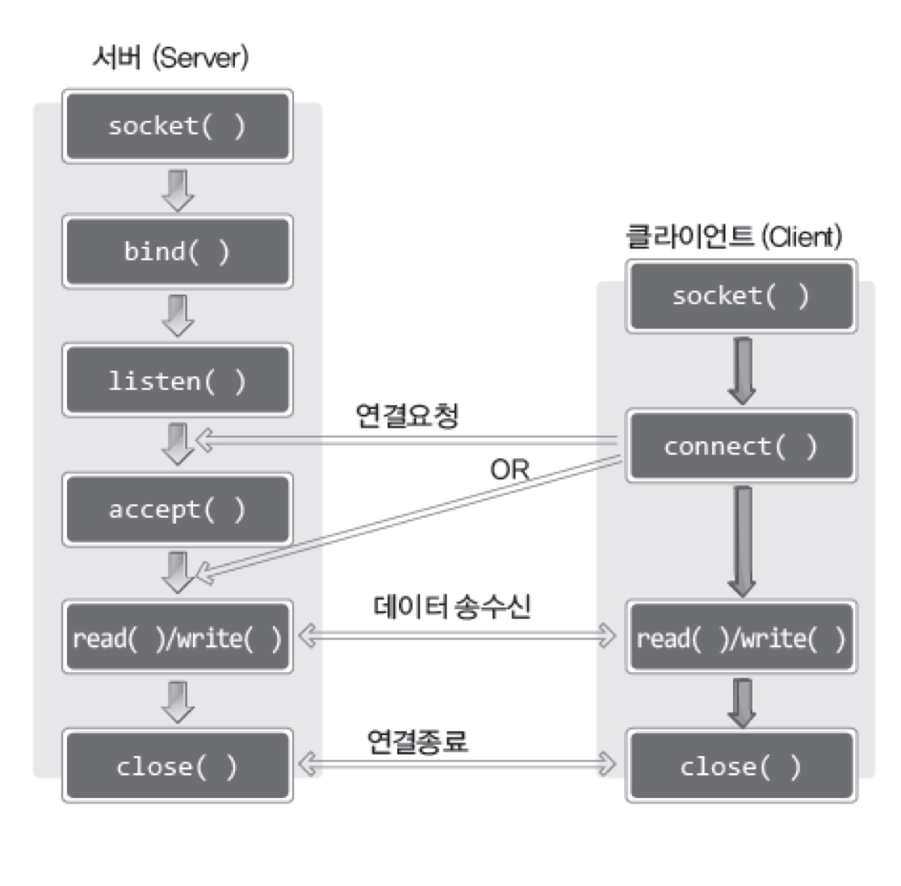

## TCP / IP 프로토콜 스택

`TCP/IP`는 `프로토콜 스택이다.` 프로토콜이 스택 형태로 쌓여 있다는 것을 의미한다. 인터넷 기반이 데이터 송수신을 목적으로 설계된 스택을 의미한다.

소켓 프로그래밍 기준으로는 데이터 송수신 과정을 네 영역으로 계층화하여 이야기 할 수도 있다.

1. `LINK 계층`: 물리적인 계층
2. `IP 계층`: 라우팅 알고리즘 표준화, 경로 설정
3. `TCP 계층 or UDP 계층`: 구체적인 데이터 전송 방식의 구분
4. `APPLICATION 계층`:

> OSI 7 계층 모델은 물리 계층, 데이터 링크 계층, 네트워크 계층, 전송 계층, 세션 계층, 표현 계층, 응용 계층으로 구성되어 있다.

각 영역은 영역별로 전문화 되어 있으며, 동시에 표준화 되어 있다. 라우터는 IP계층에서 동작하는데 IP계층에서 따르는 라우팅 알고리즘을 라우터 내에 적용해야 하는 것이 바로 표준화가 갖는 의미이다.

소켓을 생성하면 보통 `LINK`, `IP`, `TCP & UDP` 계층까지 자동화해준다. 개발자는 `APPLICATION` 계층에서 컨트롤만 잘 해주면 된다. 전송 형태를 개발자가 정의하고 소켓 생성 및 데이터 전송 타이밍, 형태 등 다양하게 직접 커스텀해주면 된다.

## TCP 서버의 함수 호출 순서

1. `socket()`: 소켓 생성
2. `bind()`: 소켓 주소 할당, bind 호출 단계 까지는 소켓의 용도가 결정되지 않은 상태이다.
3. `listen()`: 연결요청 대기, 해당 단계를 통해 리스닝 소켓 (서버 소켓)이라는 정체성이 확립된다.
4. `accept()`: 연결 허용
5. `read() / write()`: 데이터 송수신
6. `close()`: 연결 종료

연결 요청 대기 상태로 진입하는 `listen`함수가 중요하다.

```c
#include <sys/type.h>

// 성공 시 0, 실패 시 -1 반환
int listen(int sock, int backlog);
```

1. `sock`: 연결 요청 대기상태에 두고자 하는 소켓 파일 디스크립터를 전달한다.
2. `backlog`: 연결요청 대기 큐 크기정보를 전달한다. 클라이언트의 연결 요청 갯수를 제한할 수 있다.

리스닝 소켓은 생성 뒤에 클라이언트로부터 날라오는 요청들을 연결 요청 대기 큐에 push하는 작업을 할 뿐이다. 연결 요청 대기큐에서 데이터를 pop하여 클라이언트 소켓과 통신 연결을 형성하는 작업은 `accept`함수 호출을 통해 이루어진다.

```c
#include <sys/socket.h>

// 소켓 시 생성된 소켓 파일 디스크립터, 실패 시 -1 반환
int accept(int sock, struct sockaddr * addr, socklen_t * addrlen);
```

1. `sock`: 서버 소켓 (리스닝 소켓)의 파일 디스크립터 전달. 파일 디스크립터가 전달되는 이유는 연결 요청 대기 큐와 서버 소켓이 1대1 대응 관계이기 때문이다. 서버 소켓이 2개 생성된다는 의미는 연결 요청 대기큐가 2개 생성된다는 의미이다.
2. `addr`: 연결 요청을 한 클라이언트 소켓 주소정보를 담을 주소 값. 함수호출 완료 이후 addr 변수에 클라이언트 주소 정보가 채워진다.
3. `addrlen`: `addr` 변수의 크기를 바이트 단위로 전달한다. 변수의 참조를 전달해야 하며, 함수 호출 완료 이후에는 연결 요청된 클라이언트의 주소 정보 길이가 바이트 단위로 계산되어 할당된다.

## TCP 클라이언트 함수 호출 순서

1. `socket()`: 소켓 생성
2. `connect()`: 연결 요청. 함수 호출 후 **클라이언트 소켓은 BLOCK 상태가 된다.** 해당 상태에서 빠져나오기 위해서는 서버로부터 `accept`가 호출되었음을 확인 한 뒤에 이루어진다.
3. `read() / write()`: 데이터 송수신
4. `close()`: 연결 종료

```c
#include <sys/socket.h>

int connect(int sock, const struct sockaddr * servaddr, socklen_t addrlen);
```

`connect`함수 각 인자가 하는 역할은 리스닝 소켓의 `accept`함수 인자의 역할과 동일하다.

:::warning accept 함수 호출로 생성된 소켓의 포트 번호는?

accept로 생성된 소켓의 포트번호는 **리스닝 소켓 시 할당한 포트 번호와 동일하다.** 편의상 accept 소켓이라고 명명했을 때, 서로 다른 클라이언트 소켓으로부터 서버의 accept 소켓으로 연결이 이루어질 때 어떤 데이터를 전송해야 할지 선택해야 하는 상황을 가정해보자.



accept 소켓의 경우 클라이언트와 연결이 맺어질 때 클라이언트의 소켓 주소를 보유하게 된다. 그렇기 때문에 `accept`함수에서 `addr`변수가 존재하게 되는 것이다.

:::



위 그림에서 `listen`함수 호출 이후에 클라이언트로부터 `connect`요청이 언제 들어올 줄 알고 `accept`를 호출하는 걸까? 서버는 `accept`함수 호출 이후에 BLOCK 상태가 되어 대기하게 되고, 클라이언트로부터 `connect` 호출이 이루어지는 경우 `accept`를 빠져나와 데이터 송수신이 본격적으로 이루어지게 된다.
