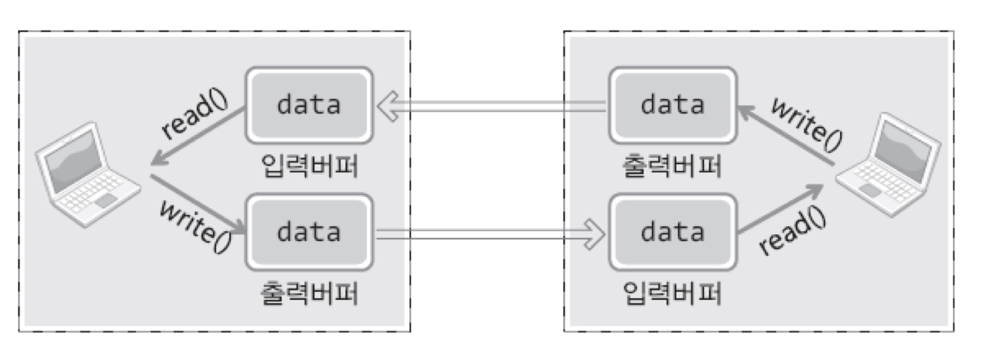
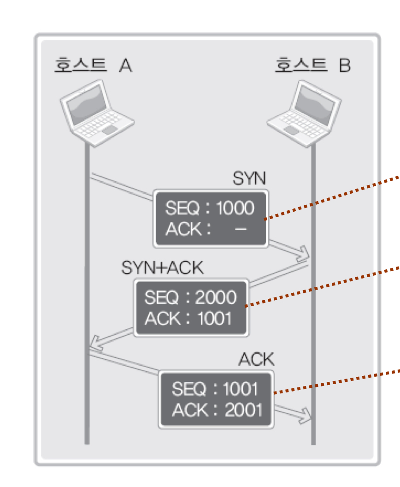
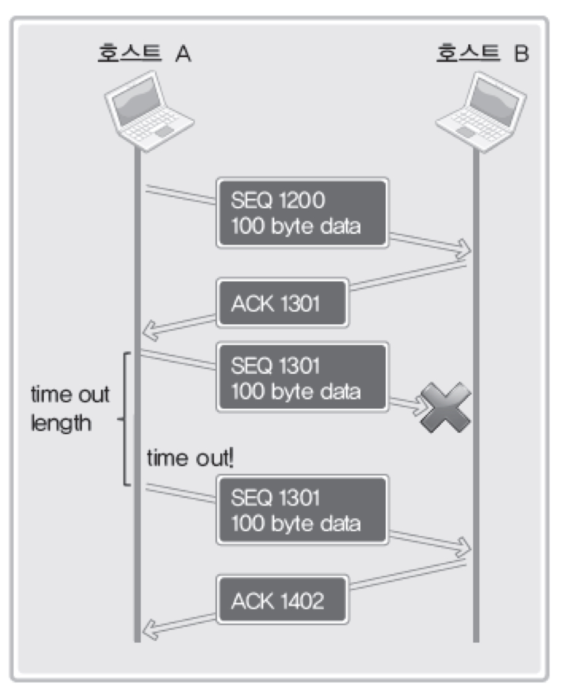
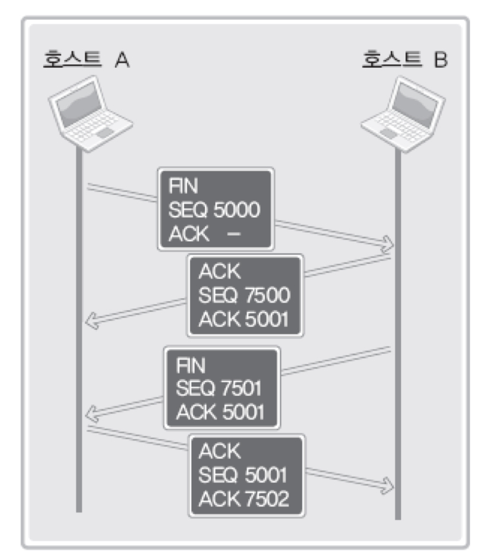

## 클라이언트 & 서버코드 문제점

아래는 서버 소켓 코드이다. `accept`호출 이후 `connect`로 요청이 들어온 클라이언트 소켓 파일 디스크립터를 `clnt_sock`에 저장하게 된다. 이후 read & write로 데이터 읽고 쓰기를 진행한다.

```c
// 서버 소켓 코드
clnt_sock=accept(serv_sock, (struct sockaddr*)&clnt_adr, &clnt_adr_sz);
if(clnt_sock==-1)
    error_handling("accept() error");
else
    printf("Connected client %d \n", i+1);

while((str_len=read(clnt_sock, message, BUF_SIZE))!=0)
    write(clnt_sock, message, str_len);

close(clnt_sock);
```

아래는 클라이언트 소켓 코드 중 일부이다. 아래 클라이언트 코드에서는 메시지를 입력받고 서버에 전달한 뒤, `connect`이후 서버로부터 쓰여진 해당 문장을 그대로 읽어들여 출력하게 된다.

```c
fputs("Input message(Q to quit): ", stdout);
fgets(message, BUF_SIZE, stdin);

if(!strcmp(message,"q\n") || !strcmp(message,"Q\n"))
    break;

write(sock, message, strlen(message));
str_len=read(sock, message, BUF_SIZE-1);
message[str_len]=0;
printf("Message from server: %s", message);
```

TCP 소켓의 경우 데이터 경계가 존재하지 않기 때문에 클라이언트로부터 입력받은 문자열 데이터가 어떤 기준으로 구분되는지 알지 못한다. 클라이언트로부터 10바이트 문자열을 입력받더라도 서버가 5바이트 데이터만 읽고 쓰기가 가능하도록 코드를 작성했다면 해당 데이터만큼만 클라이언트에게 전송하게 된다.

## 문제점 개선

클라이언트의 코드를 다음과 같이 수정하면 된다.

```c
// 문자열 길이
str_len=write(sock, message, strlen(message));

recv_len=0;
while(recv_len < str_len) {
    recv_cnt = read(sock, &message[recv_len], BUF_SIZE-1);
    if(recv_cnt==-1) {
        error_handling("read() error!");
    }
    recv_len+=recv_cnt;
}
message[recv_len]=0;
printf("Message from server: %s", message);
```

1. `write`가 리턴하는 입력 문자열에 대한 바이트 수를 변수에 저장해둔다.
2. `read`를 통해 읽어들인 바이트 수를 0으로 초기화 해둔 카운트 변수에 더해준다.
3. 카운트 변수에 저장되 바이트 수가 `write`에서 반환받은 바이트 수보다 적으면, 서버로부터 데이터를 아직 다 읽어들이지 못한 것이므로 반복문을 통해 데이터 읽어들이기를 다시 요청한다.

위 코드를 통해 명심할 점은 TCP 기반의 소켓이 데이터 경계가 없기 때문에 데이터 경계 구분이 필요한 로직을 구성할 경우에 클라이언트 단에서 구분지을 로직을 구현해야 한다는 것이다!

## TCP 입출력 버퍼

대부분의 입출력 과정에 버퍼가 필요한 이유는 서로 관계가 맺어진 채로 서로간의 입출력에만 집중할 수 없기 때문이다. 다른 작업을 하는 과정에서 버퍼를 살펴보았을 때 처리할 데이터가 있으면 가져가서 작업을 처리하게 되는 방식이다.

TCP 프로토콜도 이러한 이유로 입출력 버퍼가 필요하다. 아래 그림을 살펴보자



`write()` & `read()` 함수 호출은 그 즉시 데이터의 송수신이 이루어진다는 것이 아니라, 데이터를 입출력 버퍼에 실어 나르는 행위를 의미한다. 입출력 버퍼에 데이터가 적재되고 난 이후에 OS가 알아서 데이터를 가져다가 사용하는 방식이다.

`write` 호출 이후 출력버퍼에 데이터를 보유한 채로 TCP 프로토콜에 따라 OS가 데이터 수신자에게 데이터를 보내도 되는지 물어본다. 수신자는 송신자에게 50바이트까지 데이터를 가져와도 된다고 알람을 보내고, 이에 따라 송신자는 데이터를 수신자 입력 버퍼에 전달한다.

데이터 수신자의 입력버퍼 상황에 따라 데이터가 미닫이 창문이 차근히 옆으로 밀려나는 듯한 모습을 보이기 때문에 이를 슬라이딩 윈도우 프로토콜이라고 부른다.

슬라이딩 프로토콜로 인해 버퍼가 흘러 넘쳐서 데이터가 소실되는 일은 없게 된다.

## TCP 동작 1. 상대 소켓과의 연결

다음은 소켓 통신 과정에서의 메시지 종류를 나타낸다.



1. `SYN`: `SEQ`는 보내는 데이터 패킷의 번호를 의미한다.
2. `SYN+ACK`: `ACK: 1001`은 1000번 데이터 수신이 정상적으로 이루어졌고 1001번 부터 다시 송신하라는 의미이다. 호스트 B에서 보내는 응답 메시지를 `SEQ 2000`번에 할당해서 호스트 A에게 송신한다.
3. `ACK`: 호스트 A가 다시 보내는 메시지는 `SEQ 1001`번이고, 호스트 B에게 다음 메시지부터는 2001부터 패킷 번호를 할당해서 보내면 된다고 응답한다.

전달하고자 하는 실제 데이터가 정상적으로 송수신이 이루어졌음 외에도, 잘 받았음을 나타내는 알람 목적의 메시지도 `SEQ`넘버가 할당되어 송수신 된다.

## TCP 동작 2. 상대 소켓과의 데이터 송수신

데이터 송수신 과정에서 `ACK`번호는 전송된 바이트 크기만큼 증가시킨다. 즉 `ACK = SEQ + 전송된 바이트 크기 + 1`에 해당한다.



데이터 송신자의 SEQ를 확인하고 수신자는 `ACK번호를 수신한 데이터 크기 + increment`를 해줌으로써 데이터를 손실없이 잘 받았음을 묵시적으로 알리게 된다.

또한 SEQ 전송 이후 타이머가 작동하게 되고 SEQ에 대한 ACK가 전송되지 않은 경우 동일한 SEQ를 기준으로 데이터를 재전송하게 된다.

## TCP 동작 3. 상데 소켓과의 연결 종료

종료에 대한 알람까지 송수신자가 서로 주고받음으로써 여전히 데이터를 전달할 의사가 있는지 서로 알 수 있다.



1. 데이터 송신자가 `FIN`메시지를 SEQ 번호와 함께 보낸다.
2. 수신자가 `FIN` 메시지를 받고 `SEQ + 1` ACK를 보낸다.
3. 수신자도 송신자에게 `FIN`을 보낸다.
4. 송신자도 수신자에게 `ACK`를 보냄으로써 최종적인 소켓 통신이 마무리된다.

FIN 메시지까지 서로 주고받음으로써 이제 더 이상 전달할 데이터가 없음을 확신하고 통신을 종료한다.
