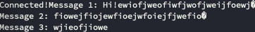

## UDP 소켓 특징과 구현

1. UDP 소켓은 SEQ, ACK과 같은 메시지 전달을 하지 않는다.
2. 연결의 설정과 해제의 과정도 존재하지 않는다.
3. 데이터 분실 및 손실 위험이 있다.
4. 별다른 연결 설정 등의 과정이 없기 때문에 데이터 전송이 빠르다.
5. 안전성보다 성능이 중요할 때에 UDP를 사용한다.

TCP는 호스트가 서로 연결된 이후 소켓의 파일 디스크립터 정보를 통해 데이터를 통신하게 된다. 연결만 되면 종료 이전까지 IP주소에 대한 정보를 알 필요 없이 소켓의 파일 디스크립터를 통해 핸들링하면 된다.

UDP 소켓이 연결의 개념이 없기 때문에 파생되는 세 가지 개념이 있다.

1. 매번 데이터를 전송할 때마다 목적지 주소와 소켓에 대한 정보를 전달해줘야 한다.
2. 서버 소켓과 클라이언트 소켓의 구분이 없다.
3. 하나의 소켓으로 둘 이상의 영역과 데이터 송수신이 가능하다.

## UDP 기반 데이터 입출력

UDP 소켓의 데이터 송수신 함수는 `sendto`와 `recv`가 있다.

```c
#include <sys/socket.h>

ssize_t sendto(
    int sock,
    void *buff,
    size_t nbytes,
    int flags,
    struct sockaddr *to,
    socklen_t addrlen
);
```

1. `sock`: 데이터 전송에 사용될 소켓 파일 디스크립터
2. `buff`: 전송할 데이터를 저장하고 있는 버퍼의 주소값
3. `nbytes`: 전송할 데이터 크기
4. `flags`: 옵션 지정에 사용되는 매개변수, 전달할 옵션이 없으면 0
5. `to`: 목적지 주소정보를 담고 있는 `sockaddr` 참조값
6. `addrlen`: to 파라미터로 전달된 주소값의 구조체 크기

```c
#include <sys/socket.h>

ssize_t recvfrom(
    int sock,
    void *buff,
    size_t nbytes,
    int flags,
    struct sockaddr *from,
    socklen_t *addrlen
);
```

1. `sock`: 데이터 수신에 사용될 UDP 소켓 파일 디스크립터
2. `buff`: 데이터 수신에 사용될 버퍼 주소값
3. `nbytes`: 수신할 최대 바이트 수 (buff 크기 이하)
4. `flags`: 옵션 지정
5. `from`: 송신 소켓 정보를 채워넣을 비어있는 소켓 주소 참조 전달
6. `addrlen`: 매개변수 from으로 전달된 소켓 구조체 크기

위의 두 함수 호출 리턴값은 각각 성공 시 송수신된 바이트 수를 나타낸다.

UDP는 데이터 경계가 존재하기 때문에 한번의 `recvfrom`호출을 통해 하나의 메시지를 완전히 읽어들인다. 메시지가 버퍼를 넘어서는 경우 비연결성이라는 특징으로 인해 데이터가 소실된다.

`sendto` 호출 시 IP와 PORT번호가 자동으로 할당되기 때문에 일반적으로 UDP 클라이언트 프로그램에서는 주소정보를 할당하는 과정이 불필요하다.

## 데이터 경계가 존재하는 UDP 소켓

UDP소켓 A에서 B로 다음과 같이 세 가지 다른 메시지를 전송한다.

```c
sendto(sock, msg1, sizeof(msg1), 0,
                (struct sockaddr*)&your_adr, sizeof(your_adr));
sendto(sock, msg2, sizeof(msg2), 0,
                (struct sockaddr*)&your_adr, sizeof(your_adr));
sendto(sock, msg3, sizeof(msg3), 0,
                (struct sockaddr*)&your_adr, sizeof(your_adr));
```

위와 같이 메시지를 보내는 경우 TCP 소켓이라면 데이터 구분 없이 설정해둔 문자열 버퍼 사이즈에 맞춰 데이터를 수신하게 될 것이다.

```c
for(i=0; i<3; i++)
{
    sleep(5);	// delay 5 sec.
    adr_sz=sizeof(your_adr);
    str_len=recvfrom(sock, message, BUF_SIZE, 0,
                            (struct sockaddr*)&your_adr, &adr_sz);

    printf("Message %d: %s \n", i+1, message);
}
```

반면 UDP 소켓의 경우 `recvfrom`함수를 호출하면 딜레이나 버퍼 용량에 상관 없이 `sendto`와 1대1 관계를 맺어 한번에 수신할 수 있는 데이터를 하나씩 받아온다.

## 예제 코드 TCP 연결로 바꿔보기

```c
#include <stdio.h>
#include <stdlib.h>
#include <string.h>
#include <unistd.h>
#include <arpa/inet.h>
#include <sys/socket.h>

#define BUF_SIZE 30
void error_handling(char *message);

int main(int argc, char *argv[])
{
    int sock;
    char msg1[]="Hi!.. 대충 BUF_SIZE 넘어서는 메시지";
    char msg2[]="I'm another UDP host!";
    char msg3[]="Nice to meet you";

    struct sockaddr_in your_adr;
    socklen_t your_adr_sz;
    if(argc!=3){
        printf("Usage : %s <IP> <port>\n", argv[0]);
        exit(1);
    }

//    sock=socket(PF_INET, SOCK_DGRAM, 0);
    sock=socket(PF_INET, SOCK_STREAM, 0);

    if(connect(sock, (struct sockaddr*)&your_adr, sizeof(your_adr))==-1)
        error_handling("connect() error!");
    else
        puts("Connected...........");

    write(sock, msg1, sizeof(msg1));
    write(sock, msg2, sizeof(msg2));
    write(sock, msg3, sizeof(msg3));

//    sendto(sock, msg1, sizeof(msg1), 0,
//                    (struct sockaddr*)&your_adr, sizeof(your_adr));
//    sendto(sock, msg2, sizeof(msg2), 0,
//                    (struct sockaddr*)&your_adr, sizeof(your_adr));
//    sendto(sock, msg3, sizeof(msg3), 0,
//                    (struct sockaddr*)&your_adr, sizeof(your_adr));
    close(sock);
    return 0;
}
```

기존 UDP 소켓 코드를 위와 같이 TCP로 변경하였다. 이때 연결성이 보장되는 TCP는 데이터 경계가 존재하지 않기 때문에 세 번에 걸쳐 진행되는 `write`동안 msg1, msg2, msg3가 합쳐져서 서버 소켓으로 보내지게 된다.



출력 결과를 보면 msg1 메시지가 BUF_SIZE가 30이 넘어서 나머지 데이터는 그대로 서버 소켓 버퍼에 남게 되고, 다음 read가 호출되는 시점에 다시 BUF_SIZE만큼 사이즈를 이어서 받게 된다.

## connected UDP 소켓

기본적인 UDP 소켓 형태인 unconnected UDP 소켓은 다음과 같은 과정으로 `sendto`가 호출된다.

1. UDP 소켓에 목적지 IP & PORT 정보 등록
2. 데이터 전송
3. UDP 소켓에 등록된 목적지 정보를 삭제한다.

`connected`소켓은 1,3번 과정을 매번 거치지 않는다. TCP 소켓과 같이 연결을 의미하는 것은 아니다. `sendto`시 매번 목적지 주소를 담아 보내는 과정만 생략한 것이라고 보면 된다.

connected UDP 소켓 생성 방법은 다음과 같다.

1. 목적지 주소에 대한 `sockaddr` 구조체 변수를 생성하고 멤버에 데이터들을 채워 넣는다.
2. 목적지 소켓으로의 `connect`함수를 호출한다.

리스닝 소켓, 서버 소켓이라는 용어를 사용하지 않은 이유는 UDP 프로토콜 기반의 소켓의 경우 연결의 개념이 존재하지 않기 때문이다. 애초에 리스닝이라는 개념 자체가 존재하지 않는다.

UDP 기반에서의 `connect`는 일방향적인 성격을 띄고 있고 목적지 소켓과의 연결 여부는 중요하지 않다. 목적지 정보 저장을 위해서만 사용한다.

기존에 `sendto`를 호출하던 unconnected UDP에서 connected UDP로 수정한 코드는 아래와 같다.

```c
int main(int argc, char *argv[])
{
	int sock;
    char msg1[]="Hi!";
	char msg2[]="I'm another UDP host!";
    char msg3[]="Nice to meet you";

	struct sockaddr_in your_adr;

	socklen_t your_adr_sz;
	if(argc!=3){
		printf("Usage : %s <IP> <port>\n", argv[0]);
		exit(1);
	}

	sock=socket(PF_INET, SOCK_DGRAM, 0);
	if(sock==-1)
		error_handling("socket() error");

	memset(&your_adr, 0, sizeof(your_adr));
	your_adr.sin_family=AF_INET;
	your_adr.sin_addr.s_addr=inet_addr(argv[1]);
	your_adr.sin_port=htons(atoi(argv[2]));

    connect(sock, (struct sockaddr*)&your_adr, sizeof(your_adr));

    write(sock, msg1, strlen(msg1));
    write(sock, msg2, strlen(msg2));
    write(sock, msg3, strlen(msg3));

//	sendto(sock, msg1, sizeof(msg1), 0,
//					(struct sockaddr*)&your_adr, sizeof(your_adr));
//	sendto(sock, msg2, sizeof(msg2), 0,
//					(struct sockaddr*)&your_adr, sizeof(your_adr));
//	sendto(sock, msg3, sizeof(msg3), 0,
//					(struct sockaddr*)&your_adr, sizeof(your_adr));
	close(sock);
	return 0;
}
```

목적지 주소 초기화 이후 `connect`를 호출한다. 이후 `sendto`, `recvfrom`이 아닌 read를 호출하면 된다.
