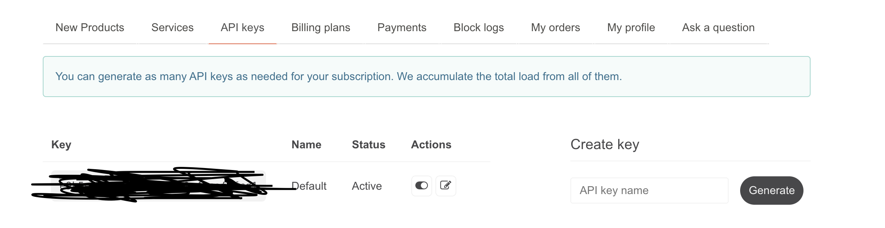
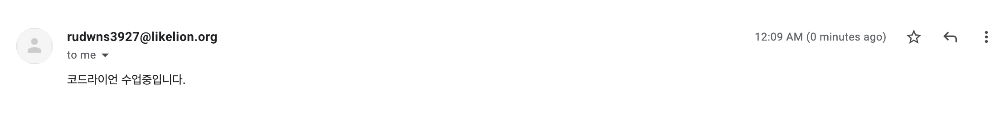

# 2022년 1월, Monthly I Learned

## 2/4

1. HGG FE 회의 진행
2. 스토리북 사용법 정리

## 2/6

1. Hufs Missing Semester 강의자료 마무리
   * 터미널 설정 추가자료
   * VScode 단축키 정리 +익스텐션
2. 코드라이언 파이썬

 

## 2/7

1. 코드라이언 파이썬 심화
   * 웹 크롤링
   * API활용하여 날씨정보 받아오기

### 크롤러 알아보기

웹 크롤러 → 웹 페이지의 데이터를 모아주는 소프트웨어

### 블록 조립 키트

크롤링을 위한 외부 모듈을 설치하자

```python
pip install requests # requests라는 모듈을 설치한다.
```

리퀘스트 모듈을 임포트하자

(파이썬 함수를 통해 → 반복되는 작업을 효율적으로 수행할 수 있다 !)

(파이썬 모듈은 파이썬 함수를 모아두는 파일이라고 이해해두자)

### 블록 조립 키트 사용법

모듈에서 원하는 함수를 꺼내어 사용하자 !

`requests` 모듈에서 `get` 함수를 꺼내어 사용하자 !

### 요청하고 응답받기

`requests.get(url)` 함수는 GET 요청을 보내는 기능을 한다

요청에 대해서는 **응답이 존재한다!**

파이썬 `requests.get()` 함수는 서버에 url정보를 요청하고 서버는 이에 대한 응답을 전달한다

### 요청하고 응답받기 2

`requests.get(url)` → `return : requests.response`

### 요청하고 응답받기 3

```python
import requests

url = "https://www.naver.com"
print(requests.get(url)) # Response 200 - 성공적인 응답

response = requests.get(url)
print(response.text) # html 코드가 나타난다 !

print(response.url) # url이 출력된다 !

print(response.content) # html 코드가 나타난다!

print(response.encoding) # ISO-8859-1 뭔지모를 코드가 나타난다!

print(response.headers) # HTTP헤더 정보가 나타난다 !

print(response.ok) # 정상 응답 여부를 출력한다!

print(response.status_code) # 상태 코드를 출력한다 !
```

### Beautiful Soup 1

`Beautiful Soup` → 모듈이 아닌 bs4 모듈에 속한 특정 함수이다!

```python
import requests
from bs4 import BeautifulSoup

print(BeautifulSoup(response.text, 'html.parser'))
```

뷰티풀 숲으로 출력한 데이터는 `response.text` 와 어떤 부분이 다를까

### Beautiful Soup 2

```python
print(type(response.text)) # <class 'str'>
print(type(BeautifulSoup(response.text, 'html.parser')) # <class 'bs4.BeautifulSoup'>
```

HTML은 단순 문자열이다 ! `response.text`로 얻어낸 HTML은 문자열이기 때문에 스트링 클래스 타입이고

후자는 이 문자열을 BeautifulSoup가 요구하는 형태로 모아두었기 때문에 bs4.BeautifulSoup 타입이 된다

### Beautiful Soup 3

`BeautifulSoup(데이터, 파싱방법)` → 데이터에는 HTML과 XML이 올 수 있다 !

파싱 방법은 파이썬에 내장된 HTML파서를 이용하자 !

```python
soup = BeautifulSoup(response.text, 'html.parser')
print(soup.title) # 수프에 담긴 타이틀 태그를 출력하자
```

### Beautiful Soup 4

수프는 원하는 태그를 출력할 수 있다 !

`findAll`메서드를 활용하면 원하는 태그 요소 전체를 출력할 수 있다 !

```python
print(soup.title)
print(soup.title.string)
print(soup.span)
print(soup.findAll('span'))
```

### Beautiful Soup 5

수프로 받아온 HTML 문자열을 실제 파일에 받아보자

```python
file = open("daum.html", "₩")
file.write(response.text)
file.close()
```

`link_favorsch` 클래스를 갖는 `<a></a>` 태그가 실시간 검색어 태그이다 !

### Beautiful Soup 6

`<a></a>` 태그 전체 요소를 가져오기 위해 `soup.findAll('a')` 메서드를 사용하자!

a태그내에 특정 클래스를 가진 a태그만 뽑아오기 위해서는 `findAll`메서드 두 번째 파라미터로 `className`을 전달한다 !

```python
print(soup.findAll('a', 'link_favorsch')
```

실시간 검색어 내에 문자열만 제외하고 나머지 요소들을 제거해보자 !

### 예쁘게 출력하기

```python
import datetime import datetime

results = soup.findAll('a', 'link_favorsch')
rank = 1

print(datetime.today()) # 오늘

for result in results:
	print(rank, "위: ",result.get_text(), "\n") # n위: 검색어n위
	rank+=1
```

***

### 날씨 정보 받아오기

### API 키 발급받기

openWeather 가서 API키를 발급받자 !



### API 알아보기

API란 → Application  Programming Interface

인터페이스란 → 클라이언트와 서버가 데이터를 원활하게 주고받을 수 있도록 해주는 약속과 같은 개념

### API Key 알아보기

API 키는 오픈API 사용 방명록 작성의 일환이라고 보면 된다 !

### API 링크 만들기

API 도큐먼트에 가서 API호출 링크를 가져오자

```python
city = "Seoul"
apikey = 내꺼 API
api = "http://api.openweathermap.org/data/2.5/weather?q={city}&appid={apikey}"
```

### 날씨 받아오기

```python
import requests

city = "Seoul"
apikey = 내꺼 API
api = "http://api.openweathermap.org/data/2.5/weather?q={city}&appid={apikey}"

result = requests.get(api)
print(result.text) # 각종 날씨 관련 정보 출력!
```

### 예쁘게 출력하기

`json` 모듈을 임포트 → 데이터를 주고받을 때의 포맷을 설정하자!

```python
import json
import requests

city = "Seoul"
apikey = 내꺼 API
api = "http://api.openweathermap.org/data/2.5/weather?q={city}&appid={apikey}"

result = requests.get(api)
data = json.loads(result.text) # 파이썬 딕셔너리 타입으로 변환 !
```

***

### 번역하기

### Googletrans 알아보기

Googletrans → 언어 감지 및 번역을 도와주는 라이브러리

언어 감지 → 안녕하세요: 한국어, Hello: 영어

```python
from googletrans import Translator
```

### 언어 감지하기

번역기를 만든다

언어 감지를 원하는 문장을 설정한다

감지한다

```python
from googletrans import Translator

translator = Translator() # 파라미터는 없고 번역기를 하나 생성한다!

sentence = "안녕하세요 코드라이언입니다"
detected = translator.detect(sentence) # 언어감지를 원하는 문장을 전달한다
# Detected(lank=ko, confidence=1.0)
print(detected.lang) # ko 한국어 !
```

### 번역하기

번역기를 만든다

번역을 원하는 문장을 설정한다

번역을 원하는 언어를 설정한다

번역한다

```python
from googletrans import Translator

translator = Translator()
sentence = "안녕"
translator.translate(sentence, 'en') # translate(text, dest, src)
```

`text` → 입력문장

`dest` → 번역 결과물 언어 (ko, en ..)

`src` → 감지되는 언어 (생략가능 → 자동인식)

***

### 메일 보내기

### 사전 준비

IMAP 사용 설정을 하자 → 다양한 기기에서 메일 서비스에 접근하기 위한 설정!

보안 수준이 낮은 앱 액세스 켜기!

### SMTP

SMTP는 메일 전송을 위한 프로토콜이다

파이썬 프로그램을 **이메일 클라이언트라고 하자.**

우리가 보내려는 목적지 메일 서버에 SMTP를 통해 메일을 전달한다

또한 이 서버에 메일을 저장하는 것이 아니므로 서버에서 목적지 주소에 SMTP를 활용하여 메일을 다시 전송한다

대상 목적지로부터 역으로 메일을 수신하기 위해서는 메일 서버에 저장되어 있는 데이터를 받아와야 하는데

이때 IMAP을 사용하게 되는 것이다 !

`You → SMTP → Server → IMAP → Me`

코드를 작성해보자

```python
import smtplib # 서버에 연결하는 라이브러리

SMTP_SERVER = "smtp.gmail.com"
SMTP_PORT = 465 # 지메일 SMTP 포트번호, 변경불가능!

smtp = smtplib.SMTP_SSL(SMTP_SERVER, SMTP_PORT) # smtp 객체를 통해 로그인을 진행한다!

smtp.login("rudwns3927@likelion.org", "password")
```

MIME → 메일 내용에 대한 정의

MIME 변환을 위해 `email.message` 모듈을 활용하자

* 이메일을 만든다
* 이메일에 내용을 담는다
* 발신자 , 수신자를 설정한다

```python
import smtplib
from email.message import EmailMessage

# ...
message = EmailMessage()
message.set_content("본문!")
message["Subject"] = "제목!" # MIME Header 삽입을 위한 형태!
message["From"] = "###@gmail.com"
message["To"] = "수신자"
```



```python
import smtplib
from email.message import EmailMessage

SMTP_SERVER = "smtp.gmail.com"
SMTP_PORT = 465

message = EmailMessage()
message.set_content("코드라이언 수업중입니다.")

message["Subject"] = "이것은 제목입니다."
message["From"] = "rudwns3927@likelion.org"
message["To"] = "rudwns3927@likelion.org"

smtp = smtplib.SMTP_SSL(SMTP_SERVER,SMTP_PORT)
smtp.login("rudwns3927@likelion.org","##")
smtp.send_message(message)
smtp.quit()
```

## 2/10

1. 삼성 ENG 관련 자료 조사 및 브리핑 진행
   * 피드백 후 추가자료 조사 (산업, 채용 마케팅 활용 첨언 등)
2. 멋사 10기 전체회의
3. 코드라이언 파이썬 세렝게티 MBTI 테스트 마무리

## 2/13

1. 코드라이언 MBTI 테스트 만들기 마무리
2. 코드라이언 장고 - 블로그 만들기 강의 수강

## 2/14

1. Hufs Missing Semester 개발환경 강의 리허설 진행
2. 애드업 - 삼성 ENG 기업분석 브리핑
3. 커리업로드 어플 관련 테스팅 디스크립션