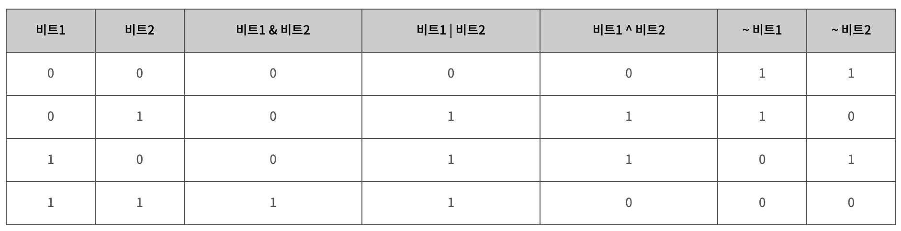

## 비트 연산 기초

`0100`이라는 4비트 데이터는 10진수 4를 나타낸다. 이를 `[false, true, false, false]` 불리언 배열로 나타낼 수 있다.



:::tip << 연산자

주로 `<<` 비트마스킹 연산자를 코딩테스트에서 쓸 때는 `1 << 4` 이런식으로 사용한다. 왼쪽 피연산자 값을 1로 두고 계산할 때가 많다.

:::

-   `^`, XOR 연산자는 같은 비트를 false로 반환해주는 연산자이다.
-   `~`, NOT 연산자는 모든 비트를 반전시킨다. `~value = -(value + 1)`이다.

비트연산을 사용하는 이유는 특정 불리언 집합 배열을 하나의 수로 표현하여 수행시간을 단축할 수 있기 때문이다.

## 비트 연산 활용법

1. idx번째 비트끄기: `S &= ~(1 << idx)`
2. idx번째 비트 XOR 연산: `S ^= (1 << idx)`, 토글기능과 동일하다. idx번째 비트를 반전시킨다.
3. 최하위 켜져있는 비트 찾기: `idx = (S & -S)`, 오른쪽에서부터 탐색해서 처음 1인 비트를 찾는다.
4. 크기가 n인 집합의 모든 비트를 켜기: `(1 << n) - 1`
5. idx번째 비트를 켜기: `S |= (1 << idx)`
6. idx번째 비트가 켜져 있는지 확인하기: `if(S & (1 << idx))`

### 활용법 1. 모든 경우의 수 세기

`{사과, 딸기, 포도, 배}` 그룹에 대해 그룹을 지을 수 있는 모든 경우의 수는 16이다. 이들을 모두 출력해보자.

```swift
let input = ["사과", "딸기", "포도", "배"]

for i in 0...1<<input.count {
    var ret = ""
    for j in 0..<input.count {
        if i & (1<<j) != 0 {
            ret += input[j] + " "
        }
    }
    print(ret)
}
```

1. i를 0부터 16까지 순회한다.
2. 이진수 i에 대해서 `XXXX`의 j번째 비트가 켜져있는지 확인한다.
3. 켜져있으면 input 인덱싱을 하여 경우의 수 출력 리스트에 추가한다.

### 활용법 2. 매개변수

아래 코드는

```swift
let input = ["사과", "딸기", "포도", "배"]

func go(_ num: Int) {
    var ret = ""

    for i in 0..<input.count {
        if (num & (1<<i)) != 0 {
            ret += input[i] + " "
        }
    }
    print(ret)
}

for i in 1..<4 {
    go(1 | (1 << i))
}
```

1. `go(1 | (1 << i))`를 통해 순회하며 각각 1,2,3번째 인덱스 비트를 켠다. 왼쪽 피연산자 숫자 1로 인해 "사과" 비트는 켜져있다.
2. 0, 1, 2, 3 비트가 켜져있는지 확인한다.
3. 사과 비트와 함께 켜져있는 다른 비트 위치 기준으로 input을 순회하여 문자열에 데이터를 추가한다.
