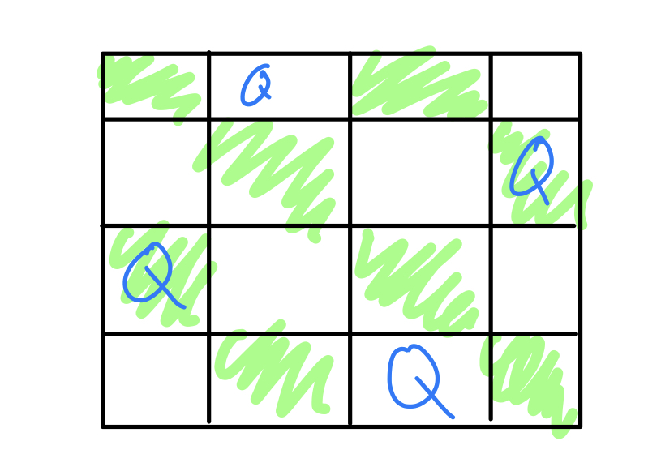
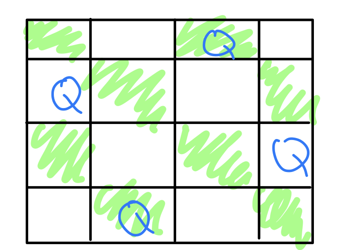

## 백트래킹

알고리즘에 있어서 DP, 그리디 등으로도 안풀리는 문제는 백트래킹 알고리즘으로 접근하게 된다.

예시로 미로 문제를 들 수 있는데 가령 미로 내에서 이동을 남쪽과 동쪽으로만 이동 가능하다고 할 때 목적지까지 가능 경로를 찾는 상황을 생각해보자.

네비게이터가 없는 상황이기 때문에 무작정 길을 가야 하는 상황이기에 더 이상 진행하지 못하는 막다른 길에 도달했을 때 **다시 상황이 진행될 수 있을 때까지 이전에 지나쳤던 길로 돌아오는 방식이** 백트래킹 알고리즘 풀이 방법이다.

```python
# pseudo code
def find_way(x,y): # 현재 (x,y)칸에 서있다
    if x==n-1 and y==n-1: # (n-1, n-1)이 목적지
        return True
    if M[x][y] == safe: # 빈 칸
        try_down = find_way(x+1, y) # 동쪽으로 이동
        if try_down == True: # 도착!
            return True
        try_ease = find_way(x,y+1) # 남쪽으로 이동
        return try_ease
    else:
        return False
```

**백트래킹 문제는 고려할 수 있는 모든 경우의 수를 알고리즘에 고려하면 된다.**

## N-queens 문제

퀸(Nqueen) 문제는 격자 판에 **같은 대각선이 아니면서, 같은 행과 열에도 속하지 않도록 퀸을 배열하는 문제이다.**

4 X 4 격자판에서는 다음과 같은 경우가 존재한다.




X 리스트를 선언하고 리스트의 인덱스값이 격자 행의 위치를 나타낸다고 하면 첫 번째 그림은 `X = [1,3,0,2]`이고 두 번째 그림은 `X = [2,0,3,1]` 이다.

구한 X의 해를 가지고 해를 어떻게 구했는 지에 대한 과정을 정리해보면

1. 퀸을 0,0에 배치한다.
2. 다음 퀸을 1,1에 배치해본다. - 같은 대각선에 존재하므로 불가능 -> 1,2에 둔다
3. 다음 퀸을 2,1에 배치해본다 - 2,1부터 2,3까지는 1,2의 대각선 안에 존재하므로 2,0밖에 불가능한데 0번째 열은 첫 번째 과정에서 이미 사용되었다.
4. 따라서 첫 퀸은 0,0에 두어서는 안된다.
5. 위의 과정을 0,0부터 0,3까지 반복한다.

```python
def nqueens(k):
    if k>=N:
        return
    for c in range(N):
        if queen can place at (k,c):
            X[k] = c
            nqueens(k+1)
```

## 상태트리

```python
def Backtrack(k):
    if k>n:
        output solution
        return
    for each possible candidate value c for x[k]:
        if B(x[1], x[2], ... , x[k-1], c) == True: # x[1] ~ x[k-1]까지는 결정된 값
            x[k] = c
            Backtrack(k+1)
```

위 코드에서 B함수를 **한계 함수(Bounding function)** 라고 한다. N-queens 문제에서의 한계 함수는 같은 행-열-대각선에 다른 퀸이 놓여있지 않은지 검사하는 함수이다.

백트래킹 알고리즘의 성능을 결정하는 요인은 **한계함수 B의 효율성에 달려있다.**

상태 트리(State Space Tree)는 백트래킹 알고리즘 구현 시 나타나는 몇 가지의 상태, 가령 미로 탈출 문제에서 동쪽과 남쪽으로 이동할 수 있다는 두 가지의 상태와 같은 것들이 트리 형태로 이루어지는 것을 말하며 이를 **Preorder** 순서로 탐색하게 된다.

## 배낭 문제

사이즈가 정해진 빈 배낭이 있고 각각 가중치가 부여되어 있고 사이즈가 모두 다른 n개의 아이템이 있을 때 **빈 배낭의 사이즈가 넘지 않으면서 선택된 아이템의 가중치가 가장 높은 경우의 수**

각 아이템을 쪼개서 넣을 수 있는 경우를 **fractional knapsack** 이라고 하고, 한번에 넣을 수 있거나 없거나 하는 경우를 **0/1 knapsack** 이라고 한다.

fractional 배낭 문제의 그리디 기준은 **가성비에 따라 아이템을 집어넣으면 된다.** (가성비 = 아이템 가치 / 아이템 크기)이고

0/1 배낭 문제의 경우는 가성비라는 그리디 기준이 항상 옳지는 않다. 따라서 백트래킹 알고리즘을 채택하게 되는데 아이템의 개수가 n개라면 검사해야할 전체 경우의 수가 2ⁿ이 되어 수행시간이 길어진다. 따라서 **굳이 고려하지 않아도 될 한계점을 설정해주는 것이 매우 중요하다.**
