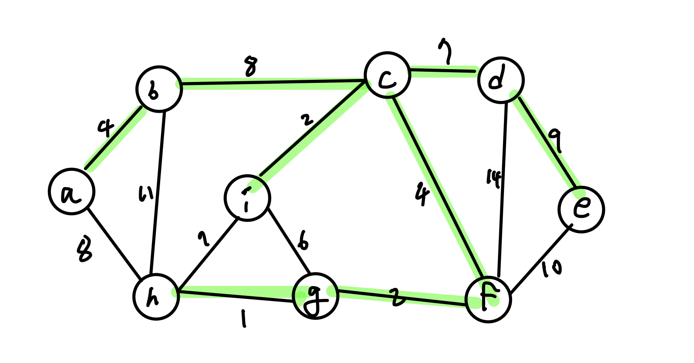

## 최소신장트리 알고리즘

최소신장트리(MST, Minimum Spanning Tree)는 그래프가 입력으로 주어지면 해당 그래프에 포함되어 있는 신장 트리의 비용이 최소인 그래프를 구하는 알고리즘이다.

:::tip 신장트리란?
신장트리(Spanning tree)란 **그래프의 부분 그래프로서** 주어진 그래프의 **모든 정점** 과 간선의 부분 집합으로 구성되는 트리이다. 각 노드는 적어도 하나의 간선에 연결되어 있어야 하며 **그래프에 사이클이 형성되면 안된다.**
:::

### MST 성질

1. 트리의 성질
   * n개의 노드는 n-1개의 간선을 갖는다.
   * 에지가 삭제되면 2개의 부트리로 분할된다.
   * 새로운 간선을 삽입하면 간선을 포함하는 사이클이 생성된다.
2. **Cut Property** : **Prim algorithm**
   * 컷에서 최소 비용 간선을 포함하는 MST는 최소 하나 이상 존재한다.

:::tip Cut이란?
그래프 내에 몇 개의 간선들을 모은 부분 집합을 의미한다. 컷에 해당하는 간선을 지우면 2개 이상의 부그래프로 나눠진다.

특정 기준에 따라 컷을 선정한 뒤 컷의 간선 모두를 그래프에서 제거한 뒤에 컷의 간선 하나씩 비용을 대입하며 최소 비용을 찾아보는 식으로 MST를 구성한다.
:::


각 노드에서 뻗어 나가는 간선들을 확인하여 컷을 선정한 뒤 컷들 중 가장 작은 비용을 갖는 간선을 찾아 MST를 조사한다.



부분 MST를 만든 뒤에 컷을 선정할 때에는 MST기준으로 인접한 간선을 모두 지나는 부드러운 곡선을 그려보면 된다.

1. **Cycle Property** : **Kruskal algorithm**
   * 임의의 사이클의 최대 비용에지를 포함한 MST는 없다.
   * 컷 프로퍼티와 반대로 생각하면 된다.

:::tip 사이클 프로퍼티 증명 (귀류법)
귀류법을 통해 최대비용 간선 e를 갖는 MST가 존재한다 라고 가정한다.

사이클 프로퍼티의 경우 두 간선 e, e'을 포함하는 그래프의 부분 사이클이 있고 간선 e의 비용이 간선 e'보다 크며 두 간선 중 하나만 삭제되어도 그래프가 신장트리로 나누어지는 상황을 생각해볼 때

이때 간선 e를 삭제하면 간선 e'로 이어지는 **MST** 가 만들어지게 되는데 이는 사이클 프로퍼티의 결론을 부정한 간선 e를 갖는 MST가 존재한다는 가정에 모순된다.
:::

다음은 크루스칼 알고리즘을 이용하여 MST를 찾는 과정이다.

<figure style="display:flex; align-items:center; flex-direction:column">

<figcaption style="font-size:1rem; color:grey; font-weight:bold; margin-top:0.8rem; margin-bottom:1rem;">1</figcaption>


<figcaption style="font-size:1rem; color:grey; font-weight:bold; margin-top:0.8rem; margin-bottom:1rem;">2</figcaption>

<figcaption style="font-size:1rem; color:grey; font-weight:bold; margin-top:0.8rem; margin-bottom:1rem;">3</figcaption>

<figcaption style="font-size:1rem; color:grey; font-weight:bold; margin-top:0.8rem; margin-bottom:1rem;">4, 이때 a-b를 잇는 간선도 추가해야함!</figcaption>

<figcaption style="font-size:1rem; color:grey; font-weight:bold; margin-top:0.8rem; margin-bottom:1rem;">5</figcaption>

<figcaption style="font-size:1rem; color:grey; font-weight:bold; margin-top:0.8rem; margin-bottom:1rem;">6</figcaption>

<figcaption style="font-size:1rem; color:grey; font-weight:bold; margin-top:0.8rem; margin-bottom:1rem;">7</figcaption>

<figcaption style="font-size:1rem; color:grey; font-weight:bold; margin-top:0.8rem; margin-bottom:1rem;">8</figcaption>
</figure>

## 프림 알고리즘

컷 프로퍼티(Cut property) : 컷의 최소비용에지를 포함한 MST는 항상 존재한다.

프림 알고리즘 구현을 위해 F는 임의의 노드 u, T는 공집합으로 시작한다.

```python
# pseudo code
F = {u}
T = ∅
while len(T) < n-1:
    find min edge(u,v) such that
    u ∈ F and v ∈ V-F

    T = T ∪ {(u,v)}
    F = F ∪ {u}
return T
```

:::tip 정리
F에 속하는 u노드에서 뻗어 나가는 간선들 중, u의 인접한 노드 v의로의 가중치가 가장 작은 간선을 찾은 후 T에 간선 (u,v)를 추가하고 F에는 v를 추가한다.
:::


F와 V-F 사이에 컷에 해당하는 간선들 중 최소비용을 갖도록 간선을 구성한다. V-F에서 컷에 해당하는 노드를 제외한 나머지 노드의 가중치는 모두 무한대로 초기화해둔 상태이다.

컷들 중 최소비용 간선에 해당하는 노드 둘 중 F에 속하는 노드가 E\[v\], V-F에 속하는 노드가 cost\[v\]로 정의된다.

V-F에 속하는 cost리스트는 무한대로, F에 속하는 E리스트는 None으로 초기화해둔다. 최종적으로 cost값이 가장 작은 노드를 찾아내기 위해 최소 힙 자료구조를 이용한다.

조건을 만족하여 T에 간선이 추가될때마다 기존에 V-F에 속했던 노드가 이제는 **F에 속하게 되므로** 컷에 해당하는 또 다른 간선을 만들기 위해 F에 추가된 새로운 노드로부터 V-F로의 간선 이동에서 **릴랙스 연산을 진행해야 한다.**

```python
# prim pseudo code with detail code
for each node v:
    cost[v] = math.inf
    E[v] = None
    F[v] = False

T = []

Q = Heap(V, cost) # cost가 키값
while Q is not empty: # 초기에 Q는 모든 노드가 무한대인 상태이므로 무작위 노드가 삭제된다.
    v = Q.delete_min()
    F[v] = True
    if E[v] != None:
        T.appennd((E[v], v))
    for each edge (v,w) incident to v:
        if F[w] == False and cost(v,w) < cost[w]:
            cost[w] = cost(v,w)
            Q.decrease_key(w, cost[w])
            E[w] = v
return T
```

:::warning
프림 알고리즘에서의 힙 자료구조는 우선순위 큐(Priority Queue)를 이용한다. 이에 해당하는 힙 자료구조로는 바이너리 힙(통상 알고있는 힙), 피보나치 힙 등이 있다.
:::


수행시간은 n을 노드 수 m을 간선 수라고 하였을 때

1. 힙을 만드는 시간 O(n)
2. 바깥 while 루프의 경우 O(n)
3. while 내부의 for 루프 O(logn)
4. decrease key O(logn)
5. 최악의 경우 for루프 내의 decrease key가 간선 수만큼 (m)번 호출

O(nlogn + mlogn) = O((m+n)logn)

## 크루스칼 알고리즘

사이클 프로퍼티(Cycle property) : 임의 사이클의 최대비용 간선은 MST에 포함되지 않는다.

크루스칼 알고리즘은 크게 다음과 같은 과정으로 진행된다.

1. 간선을 비용의 오름차순으로 정렬한다.
2. 최소 비용의 간선부터 MST를 만들어가되 **사이클이 형성되면 안된다.**
3. 작은 트리들이 서로 연결되어 하나의 큰 MST를 형성하게 된다는 것에서 의미를 가져와 크루스칼 알고리즘의 부트리를 **Forest(A collection of tree)** 라고 칭한다.
4. 모든 간선을 검사할 필요 없이 현재까지 포레스트에 쌓인 노드의 수가 전체 그래프의 노드 수와 동일해지면 연산을 종료하면 된다.

2번과정에서 추가했던 간선이 트리의 사이클 형성 원인이 되었을 때 해당 간선의 비용을 보면 현재까지 만들어온 포레스트의 간선 비용 중 가장 큰 값을 가지게 된다. 사이클 프로퍼티에 따라 현재 발견된 최대비용 간선은 앞으로 MST에 포함될 일이 없으므로 제외하여 다음 연산을 시작하면 된다.

포레스트의 사이클 여부 검사하는 데에 사용되는 자료구조는 **union-find** 자료구조가 사용되며 총 수행시간은 m개의 간선이 있을 때 O(mlogm)시간이 소요된다.

### 코드구현

크루스칼 연산 이전 자료의 초기 상태는 그래프의 각 노드를 모두 집합화 하는 것이다.


{a}, {b}, {c} ... {h}, {i}

```python
def kruskal(V, E):
    T = []
    for each v ∈ V: # n*O(1) -> O(n)
        make_set(v) # O(1)
    sort E in 오름차순 of costs # merge sort or heap sort, O(mlogm) - merge sort
    for each e = (u,v) in E: # m
        if find(u) ≠ find(v): # u가 속한 집합, v가 속한 집합이 같은지 여부를 검사 O(logn)
            T.append(e)
            union(find(u), find(v)) # union-find의 연산
    # O(mlogn)
    return T

    # 총 수행시간 O(mlogm)
```

```python
# union-find
# pseudo code
class Node:
    def __init__(self,key):
        self.key = key
        self.parent = self
        self.rank = 0

def makeset(x):
    return Node(x)

def find(x): # x의 루트노드 리턴
    while x.parent != x: # x is not root
        x = x.parent
    return x

def union(x, y):
    v, w = find(x), find(y)
    if v.rank > w.rank:
        v, w = w, v # rank가 작은 쪽에서 rank가 큰 쪽으로 트리를 연결, swap의 필요성?
    v.parent = w
    if v.rank==w.rank:
        w.rank+=1
```