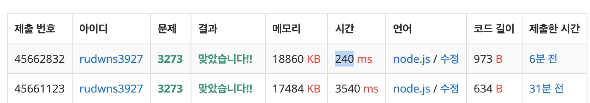

## BOJ 3273 두 수의 합

### Solution

```javascript
const readline = require('readline');
const rl = readline.createInterface({
  input: process.stdin,
  output: process.output,
});

const input = [];

rl.on('line', (line) => {
  input.push(line);
  if (input.length === 3) {
    input[0] = +input[0];
    input[1] = input[1].split(' ').map((item) => +item);
    input[2] = +input[2];
    rl.close();
  }
}).on('close', () => {
  let count = 0;
  const arr = input[1];
  for (let i = 0; i < arr.length - 1; i++) {
    for (let j = i + 1; j < arr.length; j++) {
      if (arr[i] + arr[j] === input[2]) {
        count += 1;
      }
    }
  }
  console.log(count);
  process.exit();
});
```

### Description

개선 가능성이 어느 정도 있어 보이는 코드입니다. 이중루프로 당장 정답처리는 되었지만 수행시간 효율화를 위해 리팩토링을 진행합니다.

### Refactor

```javascript
const readline = require('readline');
const rl = readline.createInterface({
  input: process.stdin,
  output: process.output,
});

const input = [];

rl.on('line', (line) => {
  input.push(line);
  if (input.length === 3) {
    input[0] = +input[0];
    input[1] = input[1].split(' ').map((item) => +item);
    input[1].sort((item1, item2) => item1 - item2);
    input[2] = +input[2];
    rl.close();
  }
}).on('close', () => {
  let count = 0;
  const arr = input[1];
  let left = 0;
  let right = arr.length - 1;

  while (left < right) {
    if (arr[left] + arr[right] === input[2]) {
      count += 1;

      if (arr[left] === arr[left + 1]) {
        left += 1;
      } else if (arr[right] === arr[right - 1]) {
        right -= 1;
      } else {
        left += 1;
      }
    } else if (arr[left] + arr[right] > input[2]) {
      right -= 1;
    } else if (arr[left] + arr[right] < input[2]) {
      left += 1;
    }
  }

  console.log(count);
  process.exit();
});
```

**배열을 먼저 sort메서드를 활용하여 오름차순으로 정렬합니다.** 이때 시간복잡도는 O(nlogn)입니다.

다중포인터 개념을 적용하여 주어진 배열 0번째와 마지막 인덱스에서 시작하는 포인터 둘을 둡니다. `left`와 `right` 두 지점에서 시작하여 주어진 배열 `arr[left] + arr[right]`이 찾고자 하는 합의 값과 동일하다면 count변수 값을 1 증가시킵니다.

만약 left, right 인덱스의 배열 값이 찾고자 하는 값보다 크면 right 인덱스를 하나 줄입니다. right인덱스의 배열값이 배열 내의 최댓값이기 때문입니다. 반대로 더 작다면 left인덱스를 하나 증가시킵니다.

이때 `arr[left]+arr[right]`이 찾고자 하는 값과 같은 경우라면 arr[left]과 arr[left+1]을 비교합니다. 같은 값이라면 `left = left+1`을 해주고, 반대의 경우라면 `right = right-1`을 해줍니다.

오름차순 정렬이 되어 있으므로 찾고자 하는 값 쌍을 찾았다면 더 이상의 경우는 없기 때문에 arr[left]와 같은 값 또는 arr[right]와 같은 값만 계속 찾아내면 됩니다.

최종적으로 O(nlogn + n) 시간이 소요되어 O(nlogn) 시간이 됩니다.


