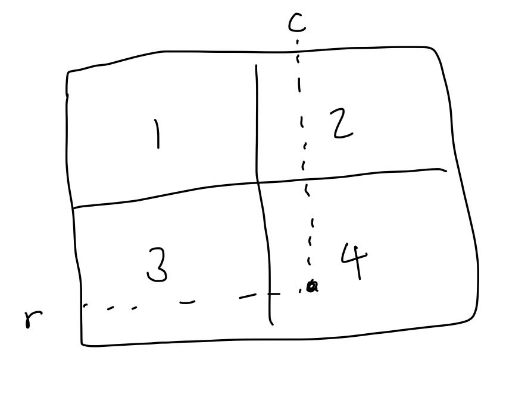
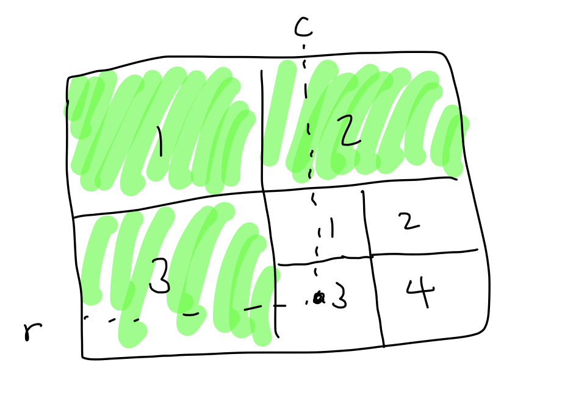

## Solution

```javascript
const readline = require('readline');
const rl = readline.createInterface({
    input: process.stdin,
    output: process.stdout,
});

// 전역변수로 쓰레기값을 선언할 수 없기 때문에 undefined 선언
let input = undefined;
rl.on('line', (line) => {
    // 데이터 정제
    input = line
        .trim()
        .split(' ')
        .map((item) => +item);
    rl.close();
}).on('close', () => {
    // 함수 호출
    console.log(helper(input[0], input[1], input[2]));
    process.exit();
});

const helper = (N, r, c) => {
    // 2*2사이즈일때 행 / 열 판단하여 0,1,2,3값 리턴
    if (N === 1) {
        if (r === c && r === 0) {
            return 0;
        } else if (r < c) {
            return 1;
        } else if (r > c) {
            return 2;
        } else {
            return 3;
        }
    }

    if (r < 2 ** (N - 1) && c < 2 ** (N - 1)) {
        // 행 / 열이 1사분면일때
        // 사각형 사이즈만 2^(N-1) by 2^(N-1)로 줄인다.
        const temp = helper(N - 1, r, c);
        return temp;
    } else if (r < 2 ** (N - 1) && c >= 2 ** (N - 1)) {
        // 행 / 열이 2사분면일때
        // 1사분면 사이즈만큼 숫자를 더해주고
        // 재귀적으로 2사분면에서의 행 / 열 위치값을 계산해준다.
        const temp = helper(N - 1, r, c - 2 ** (N - 1)) + (2 ** (N - 1)) ** 2;
        return temp;
    } else if (r >= 2 ** (N - 1) && c < 2 ** (N - 1)) {
        // 행 / 열이 3사분면일때
        // 1,2사분면 사이즈를 합친 것 만큼 숫자를 더해주고
        // 재귀적으로 3사분면에서의 행 / 열 위치값을 계산해준다.
        const temp =
            helper(N - 1, r - 2 ** (N - 1), c) + (2 ** (N - 1)) ** 2 * 2;
        return temp;
    } else {
        // 동일
        const temp =
            helper(N - 1, r - 2 ** (N - 1), c - 2 ** (N - 1)) +
            (2 ** (N - 1)) ** 2 * 3;
        return temp;
    }
};
```

## Description




Z 순서로 순회할 때에 주요한 로직은 사각형을 4개의 사분면으로 나누는 것입니다.
구하고자 하는 위치 값을 구하기 위해서는 r행 c열을 보면 됩니다.

예를 들어 N=3인 8\*8 = 64 사이즈의 사각형이 있다고 가정합니다.
이때 7행 7열의 위치값을 구하기 위해서는
1,2,3사분면의 사각형 사이즈를 모두 더한 뒤
1사분면을 기준으로 3행 3열의 위치값을 더하면 됩니다.

바닥조건은 2\*2사이즈일때 조건에 맞게 0,1,2,3을 리턴하면 됩니다.

temp변수를 두어 재귀호출의 결과값을 저장하고
temp변수값을 리턴하는 방식으로 진행해야 재귀호출의 비효율성을 줄일 수 있습니다.
