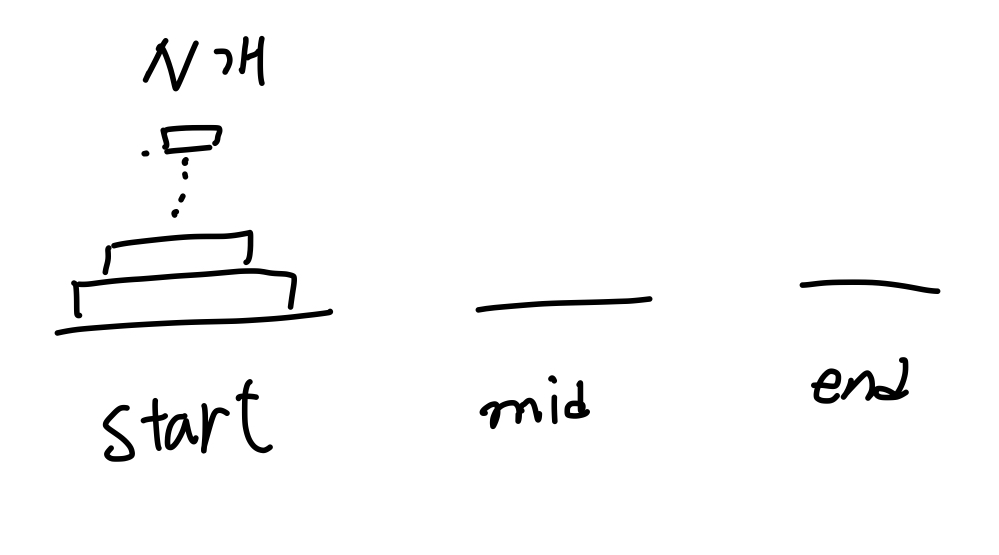
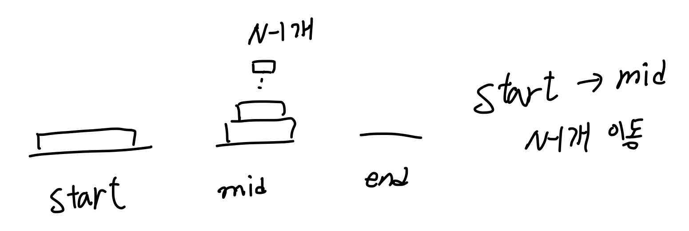
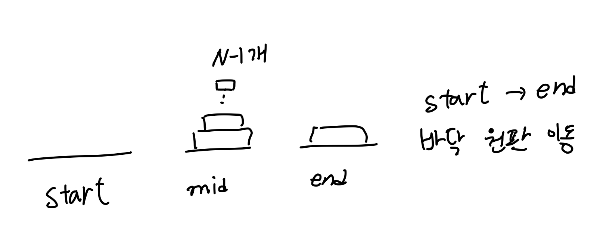
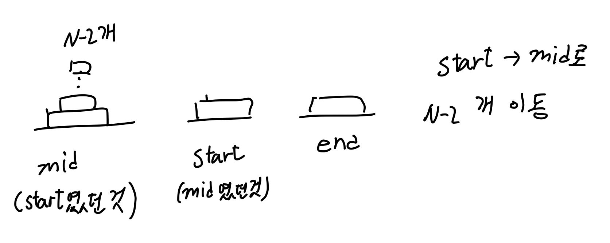
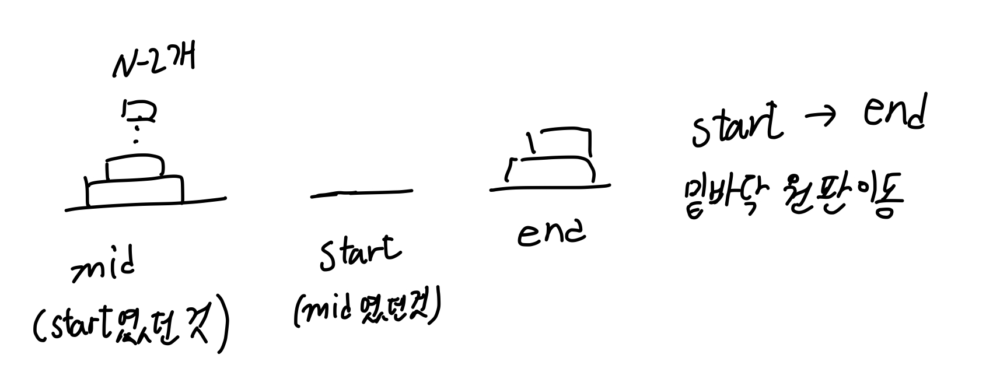

## Solution

```javascript
// 데이터 정제
const readline = require('readline');
const rl = readline.createInterface({
    input: process.stdin,
    output: process.stdout,
});

// 출발지점, 거쳐가는 지점, 도착 지점
let start = 0;
let mid = 1;
let end = 2;
let board = 0;

rl.on('line', (line) => {
    // board : 원판 개수
    board = +line;
    rl.close();
}).on('close', () => {
    // start에서 출발하여
    // mid를 거쳐
    // end까지
    // board개 만큼의 원판을 옮긴다.
    hanoi(start, mid, end, board);

    process.exit();
});

const hanoi = (start, mid, end, boardCount) => {
    let answer = [];
    const helper = (start, mid, end, boardCount) => {
        // 옮길 블록이 없으면 재귀 호출 종료.
        if (boardCount === 0) {
            return;
        }

        // start에서 mid까지 end를 거쳐 옮기는데
        // 맨 밑바닥 원판은 옮기지 않는다.
        helper(start, end, mid, boardCount - 1);

        // 맨 밑바닥 원판을 옮긴다.
        answer.push(`${start + 1} ${end + 1}`);

        // mid에서 대기중인 N-1개의 원판을
        // start를 거쳐
        // end로 옮긴다.
        helper(mid, start, end, boardCount - 1);
    };

    helper(start, mid, end, boardCount);

    console.log(answer.length);
    console.log(answer.join('\n'));
};
```

## Description

이해를 위해 도식화를 진행하였습니다.







흐름을 정리하면 다음과 같습니다.
hanoi()라는 함수는 파라미터를 시작지점, 경유지점, 도착지점 세 개를 순서대로 갖습니다. 이에 유의하여 아래 흐름을 이해해야 합니다.

START -> MID로 N-1개의 원판을 옮깁니다. 이때 END를 거쳐 N-1개를 전달해야 하므로 hanoi(START,END,MID)가 됩니다.
START에서 남은 밑바닥 원판을 END로 옮깁니다. 이때는 경유지점이 없고 하나의 원판만 전달하면 되므로 재귀호출을 하지 않습니다.
MID의 N-1개 원판들을 END로 옮깁니다. 이때 START를 거쳐 N-1개 전체를 전달해야하므로 hanoi(MID, START, END)가 됩니다.

위 함수에서 사용한 재귀함수는 헬퍼메서드로 활용되었습니다. `hanoi`라는 함수를 정의한 뒤 재귀적으로 `answer`라는 배열에 데이터를 쌓아가는 방식입니다.
