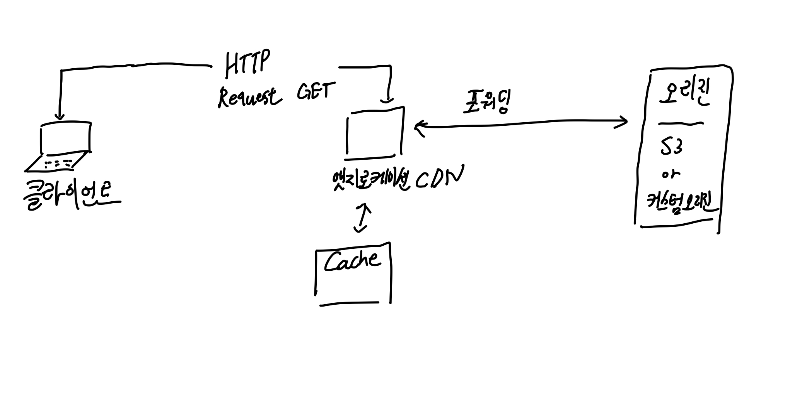

본 내용은 [Udemy - AWS Certified Developer Associate 시험 합격을 위한 모든 것!](https://www.udemy.com/course/best-aws-certified-developer-associate/)의 정리본입니다.

## 엣지 로케이션

AWS의 구성은 크게 리전 - 가용영역 - 엣지 로케이션 순서로 작아집니다. 가용영역은 리전 안에 포함되어 있고 엣지 로케이션은 가용영역 내에 포함됩니다.

엣지 로케이션은 AWS의 CDN(Content Delivery Network)제품인 CloudFront의 캐싱 컨텐츠가 위치하는 곳입니다. **CDN으로 인터넷 상에 콘텐츠를 캐싱하여 사용자에게 더욱 빠르게 전달할 수 있습니다.**

전 세계에 216개의 위치에 존재하고 캐싱 기능 외에도 디도스 공격으로부터 보호해주기도 합니다.

> And also allow you to expose an external HTTPS endpoint by loading the certificates and also talk internally in HTTPS to your applications if you need to encrypt that traffic as well.

1. 트래픽 : 주어진 시간에 컴퓨터 네트워크를 통해 움직이는 데이터의 양
2. https라는 인증을 외부적으로 보여줄 수 있게 되고, https 트래픽 암호화 방식을 어플리케이션에 적용할 수 있다.

S3 버킷이 매우 멀리 있는 리전에 위치해있고 유저가 해당 위치의 애셋들을 획득하고자 할때 CDN이라는 방식으로 캐싱된 데이터에 효율적으로 접근할 수 있게 되는 것입니다.

## 오리진

> An origin is the location where content is stored, and from which CloudFront gets content to serve to viewers.

오리진은 컨텐츠가 저장되는 위치를 이야기합니다. CDN은 이 오리진들로부터 컨텐츠를 가져오게 됩니다.

CDN의 오리진으로 크게 두 가지가 있는데 S3 버킷과 HTTP 프로토콜 기반 커스텀 오리진이 있습니다.

HTTP 커스텀 오리진은 어플리케이션 로드 밸런서, EC2 인스턴스, S3 정적 웹사이트, HTTP 백엔드 서버 등이 있겠습니다.

:::tip 포워드 vs 리다이렉트
리다이렉트와 포워드는 작업 중인 페이지가 전환된다는 점에서 결을 같이 하지만 페이지 전환 주체 관점에서 서로 반대 개념을 갖습니다.

리다이렉트는 페이지 전환 주체가 클라이언트이고 포워드는 페이지 전환 주체가 서버입니다.

리다이렉트는 클라이언트 측에서 직접 여러 번 서버로 요청이라는 동작을 취해야 하지만 포워드는 모든 URL 매핑 및 응답 동작을 내부적으로 처리하여 결과물을 바로 내줍니다.
:::

## S3 오리진

S3 버킷을 오리진으로 둔 CloudFront의 경우 각 지역의 엣지 로케이션 콘텐츠에 접근하려는 유저들의 요청이 있을 때 S3 버킷 오리진으로 먼저 AWS 네트워킹이 이루어집니다.

이때 S3 오리진에 접근하기 위해서는 OAI라는 Origin Access Identity라는 IAM을 통해 접근해야 하며 이 또한 오리진 S3 버킷 정책이 허용했을때 입니다.

(IAM과 관련된 개념 정리 예정)

## Reference

1. [FORTINET - Network Traffic](https://www.fortinet.com/resources/cyberglossary/network-traffic)
2. [Network/Basic - 리다이렉트와 포워드의 차이는 무엇인가?](https://kotlinworld.com/329)
