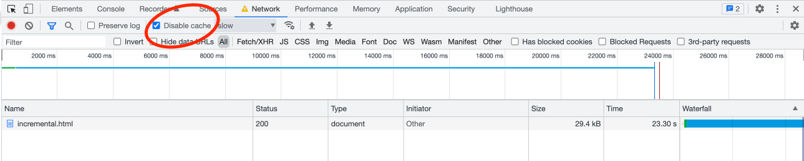
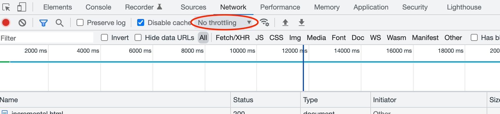
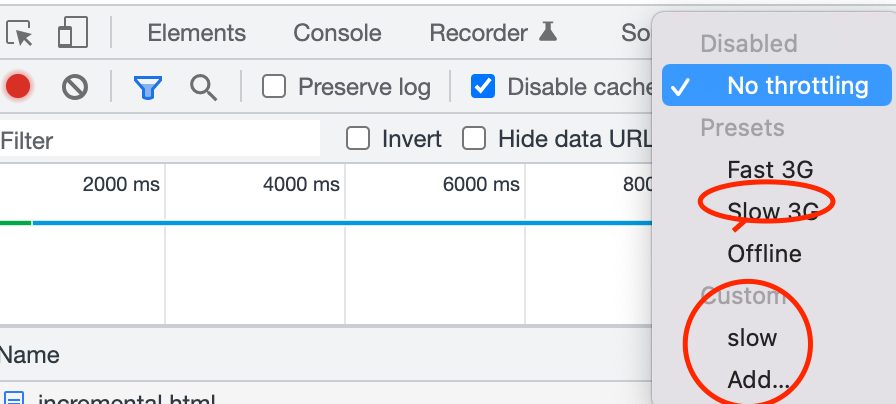
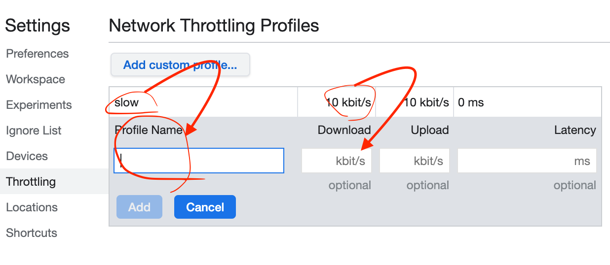
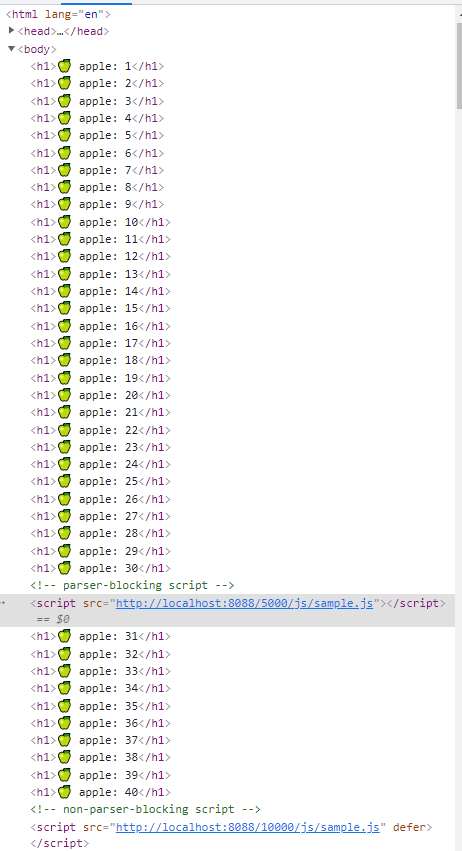
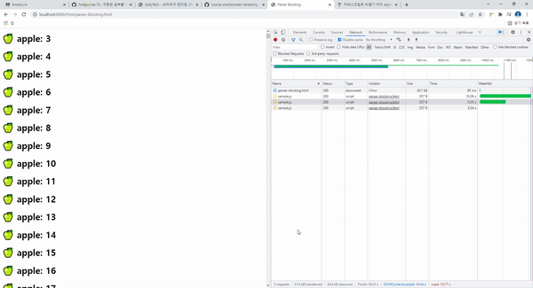
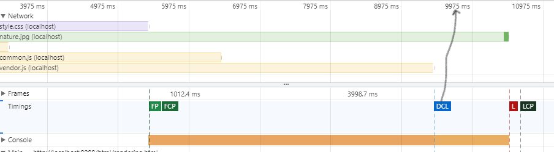

## 들어가며

브라우저 렌더링 과정을 알기 위해서는 필수적으로 DOM에 대한 지식이 있어야한다. [DOM에 대해 정리해둔 문서를](https://parkjju.github.io/vue-TIL/daily/220208-DOM.html) 참조하거나 다른 문서를 참조하여 DOM 개념을 익힌 뒤에 브라우저 렌더링 과정에 대해 학습하기를 권장합니다.

브라우저 렌더링을 왜 개발자가 알아야할까? 프론트엔드 개발자는 반드시 사용자에게 좋은 UX를 제공해야한다. 브라우저와 관련된 부정적 UX로는 리소스의 느린 로딩, 첫 페이지 로딩 시 필요없는 파일들의 다운로드, [FOUC (Flash Of Unstyled Content)](https://en.wikipedia.org/wiki/Flash_of_unstyled_content#/media/File:Wikipedia_FOUC.png) 등이 있다. 이러한 문제들을 예방하기 위해 브라우저 렌더링 사이클을 알아야 하는 것이다.

## DOM

브라우저가 HTML 문서를 가져오기 위해 서버에 요청하면 서버는 HTML 페이지를 **이진 스트림 포맷, 즉 이진데이터로 보내준다.** 리스폰스 헤더의 `Content-Type`의 값으로 `text/html, charset=UTF-8`을 첨부하며 이진데이터를 보내주는 것이다.

브라우저는 이를 인식하여 `charset=UTF-8`으로 인코딩된 문자를 읽고 이진 데이터를 텍스트형태로 나타내게 전환한다. 크롬 개발자 도구의 Network탭 - 주고 받은 파일 목록 중 하나를 클릭하면 `request`와 `response` 목록이 쭉 나오게 되니 참고하도록 하자.

서버가 보낸 응답에 헤더 부분이 누락되면 브라우저는 받은 파일을 어떻게 처리할지 알지 못한다. (해석조차 불가능하게 된다.) 응답이 정상적으로 이루어지면 우리가 아는 HTML문서를 받게 된다.

```html
<!DOCTYPE html>
<html>
  <head>
    <!-- -->
  </head>
  
  <body>
    <!-- -->
  </body>
</html>
```

HTML문서 내에 링크된 CSS파일은 HTML요소에 스타일을 추가해주고, JS파일은 자바스크립트 연산을 처리해준다. 단순한 HTML 문서로부터 CSS 스타일과 자바스크립트 요소가 적용된 웹 페이지까지 어떻게 렌더링되는걸까?

우선 응답으로 받은 HTML 코드는 자바스크립트 노드 객체로 분할 및 중첩되어 부자 관계를 이루게 된다. 이후 트리 구조를 이루게되며 이것이 바로 DOM 트리인것이다. DOM트리는 브라우저가 웹페이지를 렌더링하고 관리하는 데에 도움을 준다.

DOM은 자바스크립트 명세서 내에 포함된 내용이 아니다. 웹 API로써 다양한 목적에 맞게 웹 페이지를 동적으로 조작할 수 있게 도와주는 역할을 한다. 여러 스크립트 언어로 브라우저 API에 접근할 수 있다. (파이썬, ASP.NET 등)

## CSSOM (CSS Object Model)

우선 브라우저는 DOM 트리를 구축한 뒤에 전달받은 소스로부터 CSS를 읽어낸다. (`.css`파일, 인라인, 임베딩 등) 그 후 CSSOM 트리를 구축하게 된다. CSSOM은 CSS 셀렉터에 의해 선택된 특정 DOM요소에 적용될 스타일 정보를 가진다. 하지만 DOM요소 중 화면에 실제로 표시되지 않는 `<meta>`, `<script>`, `<title>`같은 요소들은 CSSOM에 포함되지 않는다.

CSSOM에서는 브라우저에서 기본적으로 제공하는 `user-agent stylesheet`을 오버라이딩하여 새롭게 정의한 프로퍼티들을 취합, 최종 CSS 프로퍼티들을 노드 형태로 구축한다.

<figure>

<figcaption>CSSOM (출처 - https://url.kr/y9eghd)</figcaption>
</figure>

이미지에서 볼 수 있듯 CSSOM트리는 눈에 보이지 않는 요소에 대해서는 노드로 구축하지 않는다.

## Render Tree

렌더 트리는 DOM과 CSSOM을 결합한 트리 구조의 객체모델이다. 브라우저는 이 렌더트리를 활용하여 각 눈에 보이는 요소들에 대해 **레이아웃 수치를 계산하고, 스크린에 페인팅한다.** 브라우저에 페이지를 렌더링함에 있어서 렌더 트리가 필수적인데 이 말은 즉슨 CSSOM과 DOM이 없으면 안된다는 의미이다.

렌더 트리 역시 CSSOM처럼 눈에 보이지 않는 요소에 대해 노드를 갖고 있지 않다. (엄밀한 의미에서 스크린에 픽셀 영역을 차지하지 않으면 렌더 트리의 노드로 등록되지 않는다고 할 수 있다.) CSS속성인 `display: none`이 적용된 요소는 0px * 0px사이즈이다. 따라서 해당 요소는 렌더 트리에 등록되지 않는다.

<figure>

<figcaption>Render Tree (출처 - https://url.kr/bfvyk4)</figcaption> </figure>

렌더 트리에 등록되는 기준이 눈에 보이는지 여부라면 그건 잘못되었다. 엄밀한 의미에서는 픽셀상에 공간을 차지하느냐 여부로 판단해야한다. `visibility:hidden`은 콘텐츠 표시만 숨기고 빈 공간을 차지하도록 한다.

참고로, DOM API는 사용자가 접근할 수 있는 반면에 CSSOM에는 직접 접근할 수 없다. 대신 DOM API를 통해 CSSOM에 접근할 수 있다. 이를 통해 CSSOM 노드의 CSS 프로퍼티를 조작할 수 있게 된다.

## Rendering Sequence

브라우저가 CSSOM, DOM, 렌더 트리를 통해 어떻게 특정 페이지를 브라우징하는걸까? 위에서 서술한 CSSOM, DOM 트리 구축을 통해 결과적으로 렌더 트리가 생성되면 **이때부터 브라우저는 각 요소를 스크린에 부착하기 시작한다.**

### 1. Layout Operation

브라우저는 우선 렌더트리 각 노드의 레이아웃을 생성한다. 이 레이아웃은 **렌더트리 각 노드의 사이즈(px)와 position으로 이루어져 있다.** 레이아웃은 각 노드의 레이아웃 정보를 계산하는 행위라고 이해하면 된다.

이 과정은 **리플로우(reflow), 브라우저 리플로우(browser reflow)라고도 불린다.** 리플로우, 레이아웃은 브라우저 윈도우를 스크롤, 리사이징 하거나 DOM 요소를 조작할 때에도 발생한다. [다음의 링크](https://stackoverflow.com/questions/27637184/what-is-dom-reflow/27637245#27637245)는 리플로우가 발생하는 이벤트 목록이다. 레이아웃 조정 작업은 기본적으로 트리에 접근하고 수치를 계산하여 정보를 취하는 과정을 거치기 때문에 다른 작업에 비해 비용이 높다. 비효율적인 레이아웃 조정은 레이아웃 스레싱(layout tharshing)을 일으키어 브라우저 성능 저하를 일으키게 된다. 레이아웃 스레싱에 대한 정보는 [다음의 자료를](https://estrella-kim.github.io/frontend_performance_optimization) 참고하자.

### 2. Paint operation

레이아웃 오퍼레이션을 통해 렌더트리 각 노드의 사이즈, 포지션과 같은 기하학적 정보를 얻어낼 수 있었다. 이들을 화면 상에 부착을 본격적으로 시작하는데, 렌더트리의 서브트리는 (노드들) 서로를 오버래핑 할 수가 있다. 이게 무슨 말이냐면, 말 그대로 햄버거처럼 요소를 화면상에 쌓을 수가 있다는 것이다. 이를 레이어(layer)를 생성한다고 한다. 특별히 CSS프로퍼티를 통한 애니메이션(frequently change the look, position, or geometry)에 적용되는 개념이다.

레이어 생성은 브라우저 페인팅을 효과적으로 할 수 있게 도와준다. (z-axis등을 이용하여 만들기도 하죠)

브라우저는 모든 레이어를 한 번에 그리지 않고 개별적으로 먼저 그려진다. 각 레이어에 브라우저는 먼저 눈에 보이는 요소들을 채워 넣는다. (보더, 배경색, 그림자, 텍스트 등)이 과정을 **래스터화(rasterization)** 라고 한다. 페이지의 레이어화와 래스터라이제이션 관련된 추가적인 자료는 다음을 참조하자. [intel article -must read!](https://www.intel.com/content/www/us/en/developer/articles/technical/software-vs-gpu-rasterization-in-chromium.html), [Accelerated Rendering in Chrome - must read!](https://www.html5rocks.com/en/tutorials/speed/layers/)

:::tip Intel article & Accelerated Rendering in Chrome 요약
우리는 렌더 트리와 레이아웃 오퍼레이션을 통해 각 요소 자체에 대한 정보, 스타일 및 배치에 대한 정보까지 가지고 있는 상태이다. 이 정보들을 가지고 페이지를 구성하는데, 이때 레이어(층) 개념을 도입하게 된다. 이미 갖고 있는 렌더트리 노드 정보를 토대로 각 레이어에 배치하는 것을 래스터화(rasterization) 라고 한다.

레이어 개념이 왜 필요할까? 계층화 되지 않고 한 층으로 이루어진 콘텐츠가 있다고 가정해보자. DOM을 통해 동적으로 해당 콘텐츠의 특정 부분을 수정한다고 했을때 수정 후에는 해당 층의 전체 페이지를 리페인팅해야된다는 문제가 있다. **브라우저 성능에 영향을 미치는 주 요소로 레이어 리페인팅 주기, 횟수가 있다.** 당연한 말이지만 레이어 리페인팅은 적으면 적을수록 좋다. 그렇다고 해서 HTML문서 작성부터 애니메이션을 마구잡이로 집어넣고, 자식 요소를 무작정 삽입하는 것은 CPU, GPU에 영향을 미치기 때문에(래스터라이징 횟수가 많아짐, `visible`로직 추적 등) 중간 지점을 찾는게 당연히 중요할 것으로 보인다.

래스터라이즈 시 레이어 개념이 필요한 이유에 대해서 알아보았으니 실질적으로 어떠한 방식으로 래스터라이즈가 일어나는지 알아보자. 우선, 브라우저가 페이지를 서버로부터 받아오고 이를 DOM으로 파싱한다. 이는 각종 컨텐츠(텍스트, 이미지 등)들이 어디에 배치되어야 하는 지에 대한 정보이다. 이 정보는 레이어 트리로 표현되기도 한다. 레이어 트리는 단순화된 DOM트리로 봐도 된다. 그도 그럴 것이 레이어 트리는 페이지의 `visible`한 요소들에 대해서만 취급하고 그러한 요소들이 싱글 레이어 단에서 묶여 표현될때도 있기 때문이다.

자 이제 레이어 트리를 가지고 브라우저에 본격적으로 페인팅을 시작하게 된다. 고생해서 페인팅을 모두 마쳤더니 사용자가 스크롤 이벤트를 준다. 또는 클릭을 통해 페이지 특정 부분에 동적인 요소를 추가/삭제 등 액션을 준다. 때마다 시마다 전체 페이지를 리페인팅 하는 것은 최악의 효율성을 가진다.

(앞으로 전개해나갈 이야기에서 주의할 점은 레이어와 레스터라이즈의 순서이다. 레스터라이즈를 논하기 위해서는 이미 **레이어 트리가 구축되고 확립되어 있어야 한다.** )

여러 레이어로 구성된 페이지가 있고 그 중에 첫 번째 레이어를 가져와보자. 이 페이지에 레스터라이즈를 할때 한 페이지 전체를 동시적으로 레스터라이징하는 방식은 비효율적이라고 반복적으로 설명하고 있다. 효율화를 위해서는 **한 페이지를 여러 개의 타일로 쪼개야한다.** 쪼갠 특정 타일에 이벤트가 부분적으로 발생했을 때 해당 부분만 래스터라이징을 새로 해주는 것이다. (보통 256 * 256 픽셀로 하는 것으로 알려져있다.)

예전 래스터라이징 방식은 CPU가 처리한 뒤의 결과물인 텍스쳐를 GPU에 보내는 방식이었다. 최근 방식은 GPU와 OpenGL을 사용하여 래스터라이징을 한다.

> **What are Web Textures?** : In web design, a web texture is a visual element, typically a background image, that resembles a three-dimensional, tactile surface. Web textures serve to enhance the look and feel of a website by giving web pages personality and depth.

***

Intel article Software rasterization부터 정리

:::

### 3. Compositing operation

페인팅 오퍼레이션에서 한 것은 실제 스크린에 요소들을 부착한 것이 아니다. DOM 정보를 가지고 레이어 트리를 구성했으며, 각 레이어 트리 속 올바른 위치에 요소들을 투입한 것이다. 이 레이어 트리는 **should be drawn on screen in a specific order이다.** 아직 그려지지 않은 상태인 것이다.

레이어 순서를 결정하고 스크린에 보내지는 과정이 바로 컴포지팅 오퍼레이션이다. 래스터화된 레이어들이 GPU로 보내져 최종적으로 우리가 보는 스크린이 그려진다.

다만, 구성된 레이어 전체가 보내질 때 까지 스크린이 기다리는 것은 아니다. 전체를 보내고 얼마 되지 않아 레이아웃 재조정(리플로우)이나 리페인트가 일어나게 되는 상황이 분명 발생하기 때문이다.위에서 잠깐 언급했던 타일 개념을 그대로 유지하여 최소한의 단위를 스크린에 먼저 보여준다.

지금까지의 브라우저 렌더링 과정을 정리해보면 다음과 같다.

1. DOM 구축
2. CSSOM 구축
3. 렌더 트리 구축 (DOM + CSSOM)
4. Layout(리플로우)
5. Paint operation
6. Compositing operation

위 일련의 과정을 **Critical rendering path** 라고 한다.

## 브라우저 엔진

지금까지 알아본 DOM, CSSOM, 각종 렌더링 로직(레이어 구축, 래스터라이징 등)들이 어떻게 이루어진다는 것을 알아보았다. 그렇다면 누가 이런 일을 해주는 걸까? 바로 **브라우저 엔진(Browser Engined == Rendering Engine == Layout Engine)이라는 소프트웨어가 한다.**

브라우저 엔진 중 웹킷(Webkit) 엔진은 애플 사의 사파리 브라우저 엔진이며 크롬의 디폴트 브라우저 엔진이다. 크로미움(Chromium) 브라우저에서는 블링크(Blink) 브라우저 엔진이 사용된다. 브라우저에 따른 브라우저 엔진 리스트는 [다음 링크를](https://stackoverflow.com/questions/3468154/what-is-webkit-and-how-is-it-related-to-css/3468311#3468311) 참조하자.

## 브라우저 렌더링 프로세스

자바스크립트는 웹 개발 역사와 함께 살아 숨쉰다. 그만큼 웹과 뗄레야 뗄 수 없는 존재이고 따라서 웹앱 개발 전체를 놓고 봤을 때 일관된 경험을 모두에게 제공한다.

하지만 이러한 자바스크립트도 브라우저 엔진에서는 한 수 무르게 된다. 왜냐, 브라우저는 표준화되지 않았기 때문이다. 역사적으로 브라우저의 발전은 하나의 공통된 명세를 통해 개발되온 것이 아닌 서로의 인터페이스를 모방하며 개발되면서도 각자의 철학을 가지고 있었기 때문에 미묘한 곳에서 항상 차이가 존재한다.

HTML5 명세가 등장하면서 렌더링 프로세스에 대한 표준화 노력이 주입되었다. 이론적 방향성은 제시했지만 실제로 적용하는 것은 전적으로 각 브라우저에 달려있다.

> The HTML5 specification has made some **effort to standardize how rendering should work** in theory but **how browsers adhere to this standard is totally up to them.**

## 다양한 브라우저 렌더링 프로세스

이 내용부터는 [browser-rendering-test](https://github.com/course-one/browser-rendering-test/tree/master/html) 프로젝트를 실제로 돌려보면서 이해하면 좋습니다.

### 1. Parsing and External Resources

파싱(Parsing)은 HTML콘텐츠를 읽고 DOM트리를 구축하는 일련의 과정을 말한다. 이러한 과정을 진행하기 때문에 **돔 파싱(DOM Parsing)** 이라고도 불리우며 돔 파싱을 하는 프로그램을 **돔 파서(DOM Parser)** 라고 한다.

대다수의 브라우저는 돔 파서를 (`DOMParser`) 웹 API로 제공한다. 돔 파서 프로토타입의 인스턴스는 `parseFromString`메서드를 상속받아 사용할 수 있게 된다. 이는 HTML 문서를 DOM트리 형태로 변환해주는 역할을 한다.

```javascript
var parseObject = new DOMParser();
var parsedResult = parseObject.parseFromString("<div><p>Hello!</p></div>", 'text/html');

console.log(parsedResult); // #document ......
```

파싱은 **점진적으로(incrementally), 한 번에 한 노드씩 이루어진다.**

첨부한 브라우저 렌더링 테스트프로젝트의 `incremental.html` 파일로 접근해보자. 브라우저 환경 테스트를 위해 개발자 도구에 세팅해야할 것들이 몇가지 있다.

1. 프로젝트 클론 후 해당 폴더에서 `node server.js` 명령어를 실행한다.
2. 크롬 개발자 도구의 네트워크 탭에 들어가서 `Disable cache`를 체크한다.
3. 쓰로틀링 임의 설정을 통해 인터넷 속도 설정을 지정한다. 본인 환경의 경우 커스텀하여 다운로드 속도를 **10kbps로** 지정하였다.
4. `incremental.html`파일이 있는 URL로 이동하여 점진적 파싱 현상을 두 눈으로 목격해본다.

인터넷 속도를 느리게 설정해놓다 보니 서버로부터 파일을 다운받는 속도가 느리다. 하지만 그럼에도 Apple문구가 적정 숫자까지 미리 출력되고 있음을 확인할 수 있다. 1000개의 사과가 출력될때까지 기다리는 것이 아니라 부분적으로 다운로드 및 파싱이 된 부분은 미리 렌더링을 진행하는 것이다.

:::tip 개발자 도구 이미지

 
 
 
 

:::

성능 개선과 관련된 지표는 [다음 링크를](https://web.dev/user-centric-performance-metrics/#important-metrics-to-measure) 참조하자.
세팅을 마치고 새로고침 후 스크롤을 빠르게 내리다 보면 파싱이 덜 된 페이지 모습을 확인할 수 있다.

개발자 도구를 쭉 뒤져보다 보면 `Performance` 탭에서 각종 이벤트들이 발생한 것을 볼 수 있다. 이 이벤트들은 **성능 메트릭이라고** 불리는 것들이다. 이 메트릭들이 서로 붙어있으면 붙어있을 수록, 일찍 발생하면 발생할수록 더 좋은 UX 제공하는 페이지라고 할 수 있다.

몇 가지 메트릭을 소개하자면,

1. `FP(First Paint)`는 브라우저가 처음으로 스크린에 파싱 결과물을 붙이기 시작하기까지의 시간이다. (바디 태그의 백그라운드에 1픽셀 찍기 시작한 시점)
2. `FCP(First Contentful Paint)`는 **텍스트나 이미지 콘텐츠가** 처음으로 파싱된 결과물로써 붙여지기 시작한 시점까지의 시간이다.
3. `LCP(Largest Contentful Paint)`는 가장 큰 텍스트 또는 이미지 요소가 렌더링 될때까지의 시간이다.

브라우저는 외부 소스(스크립트 태그의 `src` 어트리뷰트, `img`태그의 `src` 어트리뷰트, CSS의 `href` 등)를 만날 때마다 백그라운드에서 파일 다운로드를 진행한다.

가장 기억해야할 것은 돔 파싱이 보통 **메인 스레드에서 이루어진다는 것이다.** 자바스크립트의 메인 실행 스레드가 `busy` 상태이면 돔 파싱은 스레드가 `free`상태가 될 때 까지 진행되지 않는다. `script`태그는 **파서 블로킹(parser-blocking)** 이라는 특징을 갖기 때문에 위의 사실을 꼭 기억해야한다.

좋은 UX 제공을 위해서는 각종 스크립트 태그로 인한 파서 블록 현상을 방지해야한다. **스크립트 태그를 제외한 외부 요소(이미지, 비디오, 스타일시트, pdf)는 파서블록을 하지 않는다.**

### 2. Parser-Blocking Scripts
예제 프로젝트의 `parser-blocking.html`파일이 있는 URL로 이동해보자. 별도의 쓰로틀링 설정같은 것은 필요없다.

먼저 구글 개발자 도구의 `Elements` 탭에 들어가서 요소를 분석해보자.


HTML문서 내에 작성된 스크립트 태그가 아니라 `src` 프로퍼티를 통해 외부 리소스에 접근하고 있다. `browser-rendering-test` 프로그램 규칙에 따라 URL 접근시 `http://localhost:8088/delay-in-ms/directory/file` 에서 볼 수 있듯 `delay-in-ms` 속성이 있으면 리소스 접근에 딜레이를 부여하게 된다. 

첫 번째 스크립트와 두 번째 스크립트 사이의 차이점으로 `defer` 어트리뷰트 유무가 있다. `defer` 어트리뷰트는 **스크립트 처리 시점을 HTML 파싱 이전에 할 것이냐, 파싱 이후에 할 것이냐를 결정한다.** `defer` 어트리뷰트가 있는 상태에서는 스크립트가 HTML파싱을 모두 마친 뒤에 처리된다. 

스크립트는 기본적으로 파싱 블록 속성을 갖기 때문에 `defer` 처리를 하지 않은 첫 번째 스크립트 태그에 접근할 때 사과가 30개까지만 출력되고 나머지는 5초간 파싱 블록상태가 된다. 5초 후 나머지 사과들을 출력하다가 두 번째 스크립트 딜레이 10초가 적용된 스크립트 태그를 만나게 되는데 이 태그는 `defer` 처리가 되어 있어 HTML파싱을 우선으로 진행한다. `defer`를 통해 스크립트가 병렬처리 되어 네트워크 탭을 보면 10초 딜레이를 페이지 리로드와 동시에 계산하기 시작한다. 

(헷갈린다면 스크립트 태그 딜레이 시간을 서로 바꿔보고 네트워크를 확인해보자. 리소스 로딩이 5초 딜레이인 스크립트를 `defer` 처리하면 백그라운드에서 먼저 다운로드 받아둔 채로 대기하고 있음을 확인할 수 있다.) 



현상에 대한 확인이 되었으니 왜 이런 현상이 발생하는지 알아보자. 브라우저는 자바스크립트를 포함한 스크립트 언어에게 DOM API를 노출시킨다. 이는 매우 중요한 바를 시사하는데, **바로 스크립트가 DOM 요소를 동적으로 조작할 수 있다는 것이다.** 

익히 아는 사실임에도 다시 한번 숙지해야 하는 이유는 바로 브라우저가 돔 파싱과 스크립트를 병렬적으로 처리하고자 할 때 **레이스 컨디션(race condition)이 발생할 수 있다는 데에 있다.** 기존 정보를 가지고 구축해둔 파싱 결과물과 스크립트를 통해 **동적으로 구축한 돔 파싱 결과물이 서로 다를 수 있다는 것이다.** 다른 정적 파일이 돔 파서 블록을 일으키지 않는 이유가 여기에 있다.

따라서 돔 파싱은 반드시 메인 스레드라는 한 공간에서 이루어져야 하고 **이에 따라 파서 블록이라는 현상이 발생하는 것이다.** 

그렇다면 외부 리소스를 끌어다 사용하는 모든 스크립트 및 요소에 있어서 돔 파서를 인정하고 기다리는 수 밖에 없을까? 이러한 문제점을 해결하기 위해 ES6의 프로미스, `async`와 같은 비동기 처리 도구들이 생긴 것이다. **외부 리소스를 브라우저 메모리에 다운로드 하는 것과 설치한 파일을 스크립트 태그를 통해 DOM에 부착하는 것은 완전히 다른 이야기다.** 백그라운드에서 설치하는 것은 메인 스레드에서 처리하지 않기 때문에 반응성 측면에서 사용자에게 병렬처리가 되는 것처럼 보여질 수 있게 된다. (설치하자마자 DOM 파싱을 중단하고 스크립트를 실행한다.) 

`speculative parsing`이라는 기법도 있는데 이는 DOM트리 구축 이전에 서버로부터 받은 데이터를 HTML 문서로 파싱하는 과정에서 별개의 스레드를 통해 각종 외부 리소스를 끌어다 쓰는 요소들에 대해 읽어들이는 것이다. `speculative`의 사전적 의미는 추측인데 이 단어가 사용된 이유는 미래 시점에 외부 리소스의 로드를 예측하고 백그라운드에서 로드가 미리 진행되기 때문이다. 

### 3. Render-Blocking CSS
돔 파싱을 블록하는 요소는 **스크립트이며** 이를 제외한 파일을 돔 파싱을 블록하지 않는다. 따라서 CSS파일은 돔 파서를 블록하지 않는다. 다만 **렌더 트리 구축을 블록한다.** 렌더링 프로세스를 다시 들여다보자.

브라우저 엔진은 HTML 콘텐츠를 DOM 트리로 구축하고 동시에 CSS 외부 리소스 또는 임베딩 소스를 읽어들여 CSSOM 트리를 구축한다. 이는 **메인 스레드에서 함께 일어나게되고 결과적으로 합쳐져 렌더 트리를 구성하게 된다.** 네트워크 속도에 따라 DOM 구축 및 렌더링 과정은 위에서 보았듯 점진적으로 이루어진다.

하지만 **CSSOM 트리 구축은 점진적이지 않고 특정 방식(specific manner)으로 이루어진다.** 캐스캐이딩 속성에 따라 HTML 문서를 읽어 내려가다가 `<style>` 블록을 만나게 되면 CSSOM 트리의 CSS 규칙을 수정한다. 이는 일반적인 작업이며 인라인 방식의 CSS 작업과 동일하게 처리된다.

문제는 **CSS 외부 리소스를 끌어다 쓸 때에 발생한다.** 스크립트 파일과는 다르게 CSS가 돔 파싱에 레이스 컨디션을 일으킬 만큼 치명적이지 않기 때문에 병렬적으로 처리가 될 수 있다. 다만, CSSOM을 DOM파싱처럼 부분적으로 구축 및 빌드를 할 수가 없다. 캐스캐이딩 속성으로 인해 빌드 초기에 구축된 CSSOM 트리를 바탕으로 만들어진 렌더 트리와 이후 시점에 구축된 CSSOM 트리로 만들어진 렌더 트리가 달라지는 현상이 발생하고, 사용자 입장에서 화면이 쓸데없이 교체되는 걸 보여주기 때문이다. 이러한 문제를 바로 FOUC(Flash of Unstyled Content)라고 한다.

CSS는 **캐스캐이딩이라는** 대 전제 하나만으로 브라우저 렌더링에 영향을 미치게 된다. 돔 파싱 자체에 직접적 영향을 미치는 것은 아니지만 **CSS파일 전체 로딩을 기다려야하는 문제로 인해** 렌더 트리 구축을 블록한다. DOM트리 구축은 CSSOM 구축과 별개로 계속 백그라운드에서 진행된다. 

렌더 트리의 빠른 구축을 위해서는 DOM 스크립트 파싱블록 예방도 중요하지만 마찬가지로 CSSOM 트리 구축을 빠르게 마무리 지어놓는 것도 매우 중요하다. 이러한 이유로 CSS파일을 외부에서 끌어올 때 `head`태그 영역 내에 삽입해두는 것이다.

렌더링 실습 프로젝트에서 `render-block.html`에 접근해보자. 설정해둔 딜레이로 인해 CSS 소스 로드에 시간이 소요된다. CSSOM을 구축하고 있는 상황에 자바스크립트 `style` 객체를 통해 동적으로 프로퍼티를 조정하게 되면 **외부 CSS에서 가져오는 프로퍼티 값과 달라지게 되어 렌더 트리 상에 잘못된 결과를 페인팅 할 수 있다.** 

따라서, 이러한 문제를 예방하기 위해 CSS는 **스크립트를 블록한다.** 이를 스크립트 블록킹(script-blocking)이라고 부르며 스크립트 파일은 이전에 위치한 모든 스타일시트 파일이 **파싱되기 전까지** 실행되지 않는다. (백그라운드 설치는 진행)


위 현상을 확인하고 싶으면 `script-block.html` URL로 접속한 뒤 콘솔 창을 열어두면 된다. 네트워크 탭을 보면 `sample.js`파일이 200코드를 받고 정상적으로 다운로드 되었지만 콘솔에는 별다른 반응이 없다. CSS 전체가 로드되어 페이지가 로드되면 `sample.js` 스크립트가 실행되어 콘솔에 `Hello world!`가 출력된다.

## Document's DOMContentLoaded Event
`DOMContentLoaded`(이하 DCL) 이벤트는 파싱 HTML로부터 DOM 구축을 완료한 시점을 가리킨다. 파서 블록 스크립트 여부에 따라 이벤트발생 시점은 당연히 달라질 것이다. 또한 파서 블록 스크립트가 없더라도 스타일 시트에 로드 여부에 따라서도 DCL 시점은 영향을 받는다. 

DCL 감지 후에 DOM은 **구조적으로 구축이 되어 있는 상태는 맞지만, 안전한 상태는 아니다.** CSSOM 구축이 마무리 되어야 DOM도 완전무결해진다. 이러한 특징으로부터 유추할 수 있듯 스크립트 블록 CSS파일 역시 DCL 시점에 영향을 미친다.

웹사이트 성능 분석 시 주로 이용하는 메트릭이 바로 **DCL이다.** DCL 발생하기까지의 구간이 짧으면 짧을수록 유저에게 좋은 UX를 제공한다. 

## Window's load event
DCL은 DOM구축 마무리와 더불어 CSSOM까지 구축이 마무리되어 있을 때의 시점이라면 `window.onload` 이벤트는 외부 스타일 시트 리소스, 각종 정적파일 다운로드가 마무리되고 웹 어플리케이션 설치가 완료되었을 시점을 가리킨다.

`rendering.html` URL로 진입해보자. DOM & CSSOM 구축이 마무리 되어 페이지 렌더링이 마무리 되었을 때 `DCL`관련 내용이 콘솔에 출력되며 이미지 리소스 설치 완료 후 페이지에 렌더링된 시점에 `window.onload` 관련 내용이 콘솔에 출력된다.

위에서 잠깐 언급했던 `speculative strategy`를 직접 확인할 수 있는데, `rendering.html` 내의 스크립트 태그들은 별도의 비동기 처리 없이 각각 3,6,9초의 딜레이를 가지고 접근할 수 있도록 설정되어 있다. 스크립트는 돔 파싱을 블록하기 때문에 전체 요소가 렌더링 되기까지는 18초가 소요되어야 할 것으로 예상되지만, `speculative strategy`가 적용되면 HTML파싱 후 백그라운드 로드가 필요한 요소인 스크립트 태그 세개가 병렬적으로 다운로드 되기 때문에 각각 3초의 텀을 가지고 돔이 파싱된다. 총 9초의 시간이 소요되는 것이다. 



DCL이벤트가 감지된 후 얼마 지나지 않아 빨간색의 L 이벤트가 감지된 것을 볼 수 있다. 해당 이벤트가 윈도우의 `onload` 이벤트이며 이미지 파일까지 다운로드 및 렌더링된 시점을 가리킨다. (이미지 로드가 10초 딜레이로 설정되어 있음.)


## Reference

 1. [재그지그 - 브라우저 렌더링 과정](https://wormwlrm.github.io/2021/03/27/How-browsers-work.html)
 2. [Naver D2 - 브라우저는 어떻게 동작하는가?](https://d2.naver.com/helloworld/59361)
 3. [How the browser renders a web page?](https://medium.com/jspoint/how-the-browser-renders-a-web-page-dom-cssom-and-rendering-df10531c9969)
 4. [세줄코딩 - 스트림이란](https://uxicode.tistory.com/entry/%EC%8A%A4%ED%8A%B8%EB%A6%BC-stream-%EC%9D%B4%EB%9E%80)
 5. [Estrella's Fronted Info](https://estrella-kim.github.io/frontend_performance_optimization)
 6. [Accelerated Rendering in Chrome](https://www.html5rocks.com/en/tutorials/speed/layers/)
 7. [Intel article](https://www.intel.com/content/www/us/en/developer/articles/technical/software-vs-gpu-rasterization-in-chromium.html)
 8. [Scrolling Performance](https://www.html5rocks.com/en/tutorials/speed/scrolling/)
 9. [Web Textures: How to Add an Extra Dimension to Your Website](https://blog.hubspot.com/website/web-textures)
10. [github - browser-rendering-test](https://github.com/course-one/browser-rendering-test/tree/master/html)

## Additional

1. [성능 - 메트릭](https://web.dev/user-centric-performance-metrics/#important-metrics-to-measure)
2. 자바스크립트 쓰레드에 대한 개념