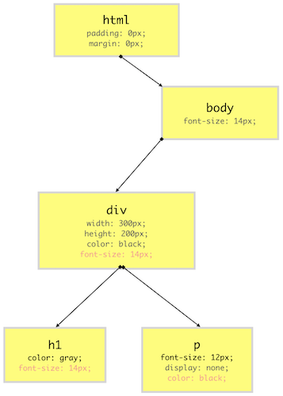
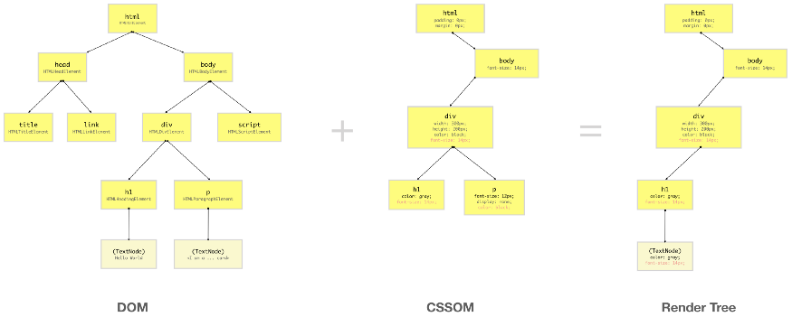

## 들어가며

브라우저 렌더링 과정을 알기 위해서는 필수적으로 DOM에 대한 지식이 있어야한다. [DOM에 대해 정리해둔 문서를](https://parkjju.github.io/vue-TIL/daily/220208-DOM.html) 참조하거나 다른 문서를 참조하여 DOM 개념을 익힌 뒤에 브라우저 렌더링 과정에 대해 학습하기를 권장합니다.

브라우저 렌더링을 왜 개발자가 알아야할까? 프론트엔드 개발자는 반드시 사용자에게 좋은 UX를 제공해야한다. 브라우저와 관련된 부정적 UX로는 리소스의 느린 로딩, 첫 페이지 로딩 시 필요없는 파일들의 다운로드, [FOUC (Flash Of Unstyled Content)](https://en.wikipedia.org/wiki/Flash_of_unstyled_content#/media/File:Wikipedia_FOUC.png) 등이 있다. 이러한 문제들을 예방하기 위해 브라우저 렌더링 사이클을 알아야 하는 것이다.

## DOM
브라우저가 HTML 문서를 가져오기 위해 서버에 요청하면 서버는 HTML 페이지를 **이진 스트림 포맷, 즉 이진데이터로 보내준다.** 리스폰스 헤더의 `Content-Type`의 값으로 `text/html, charset=UTF-8`을 첨부하며 이진데이터를 보내주는 것이다.

브라우저는 이를 인식하여 `charset=UTF-8`으로 인코딩된 문자를 읽고 이진 데이터를 텍스트형태로 나타내게 전환한다. 크롬 개발자 도구의 Network탭 - 주고 받은 파일 목록 중 하나를 클릭하면 `request`와 `response` 목록이 쭉 나오게 되니 참고하도록 하자.

서버가 보낸 응답에 헤더 부분이 누락되면 브라우저는 받은 파일을 어떻게 처리할지 알지 못한다. (해석조차 불가능하게 된다.) 응답이 정상적으로 이루어지면 우리가 아는 HTML문서를 받게 된다.

```html
<!DOCTYPE html>
<html>
  <head>
    <!-- -->
  </head>
  
  <body>
    <!-- -->
  </body>
</html>
```

HTML문서 내에 링크된 CSS파일은 HTML요소에 스타일을 추가해주고, JS파일은 자바스크립트 연산을 처리해준다. 단순한 HTML 문서로부터 CSS 스타일과 자바스크립트 요소가 적용된 웹 페이지까지 어떻게 렌더링되는걸까? 

우선 응답으로 받은 HTML 코드는 자바스크립트 노드 객체로 분할 및 중첩되어 부자 관계를 이루게 된다. 이후 트리 구조를 이루게되며 이것이 바로 DOM 트리인것이다. DOM트리는 브라우저가 웹페이지를 렌더링하고 관리하는 데에 도움을 준다.

DOM은 자바스크립트 명세서 내에 포함된 내용이 아니다. 웹 API로써 다양한 목적에 맞게 웹 페이지를 동적으로 조작할 수 있게 도와주는 역할을 한다. 여러 스크립트 언어로 브라우저 API에 접근할 수 있다. (파이썬, ASP.NET 등)

## CSSOM (CSS Object Model)
우선 브라우저는 DOM 트리를 구축한 뒤에 전달받은 소스로부터 CSS를 읽어낸다. (`.css`파일, 인라인, 임베딩 등) 그 후 CSSOM 트리를 구축하게 된다. CSSOM은 CSS 셀렉터에 의해 선택된 특정 DOM요소에 적용될 스타일 정보를 가진다. 하지만 DOM요소 중 화면에 실제로 표시되지 않는 `<meta>`, `<script>`, `<title>`같은 요소들은 CSSOM에 포함되지 않는다.
 
CSSOM에서는 브라우저에서 기본적으로 제공하는 `user-agent stylesheet`을 오버라이딩하여 새롭게 정의한 프로퍼티들을 취합, 최종 CSS 프로퍼티들을 노드 형태로 구축한다. 

<figure>
  
  <figcaption>CSSOM (출처 - https://url.kr/y9eghd)</figcaption>
</figure>

이미지에서 볼 수 있듯 CSSOM트리는 눈에 보이지 않는 요소에 대해서는 노드로 구축하지 않는다.

## Render Tree
렌더 트리는 DOM과 CSSOM을 결합한 트리 구조의 객체모델이다. 브라우저는 이 렌더트리를 활용하여 각 눈에 보이는 요소들에 대해 **레이아웃 수치를 계산하고, 스크린에 페인팅한다.** 브라우저에 페이지를 렌더링함에 있어서 렌더 트리가 필수적인데 이 말은 즉슨 CSSOM과 DOM이 없으면 안된다는 의미이다. 

렌더 트리 역시 CSSOM처럼 눈에 보이지 않는 요소에 대해 노드를 갖고 있지 않다. (엄밀한 의미에서 스크린에 픽셀 영역을 차지하지 않으면 렌더 트리의 노드로 등록되지 않는다고 할 수 있다.) CSS속성인 `display: none`이 적용된 요소는 0px * 0px사이즈이다. 따라서 해당 요소는 렌더 트리에 등록되지 않는다.

<figure>
  
  <figcaption>Render Tree (출처 - https://url.kr/bfvyk4)</figcaption>
</figure>

렌더 트리에 등록되는 기준이 눈에 보이는지 여부라면 그건 잘못되었다. 엄밀한 의미에서는 픽셀상에 공간을 차지하느냐 여부로 판단해야한다. `visibility:hidden`은 콘텐츠 표시만 숨기고 빈 공간을 차지하도록 한다.

참고로, DOM API는 사용자가 접근할 수 있는 반면에 CSSOM에는 직접 접근할 수 없다. 대신 DOM API를 통해 CSSOM에 접근할 수 있다. 이를 통해 CSSOM 노드의 CSS 프로퍼티를 조작할 수 있게 된다.

## Rendering Sequence
브라우저가 CSSOM, DOM, 렌더 트리를 통해 어떻게 특정 페이지를 브라우징하는걸까? 위에서 서술한 CSSOM, DOM 트리 구축을 통해 결과적으로 렌더 트리가 생성되면 **이때부터 브라우저는 각 요소를 스크린에 부착하기 시작한다.**

### 1. Layout Operation
브라우저는 우선 렌더트리 각 노드의 레이아웃을 생성한다. 이 레이아웃은 **렌더트리 각 노드의 사이즈(px)와 position으로 이루어져 있다.** 레이아웃은 각 노드의 레이아웃 정보를 계산하는 행위라고 이해하면 된다.

이 과정은 **리플로우(reflow), 브라우저 리플로우(browser reflow)라고도 불린다.** 리플로우, 레이아웃은 브라우저 윈도우를 스크롤, 리사이징 하거나 DOM 요소를 조작할 때에도 발생한다. [다음의 링크](https://stackoverflow.com/questions/27637184/what-is-dom-reflow/27637245#27637245)는 리플로우가 발생하는 이벤트 목록이다. 레이아웃 조정 작업은 기본적으로 트리에 접근하고 수치를 계산하여 정보를 취하는 과정을 거치기 때문에 다른 작업에 비해 비용이 높다. 비효율적인 레이아웃 조정은 레이아웃 스레싱(layout tharshing)을 일으키어 브라우저 성능 저하를 일으키게 된다. 레이아웃 스레싱에 대한 정보는 [다음의 자료를](https://estrella-kim.github.io/frontend_performance_optimization) 참고하자.


### 2. Paint operation
레이아웃 오퍼레이션을 통해 렌더트리 각 노드의 사이즈, 포지션과 같은 기하학적 정보를 얻어낼 수 있었다. 이들을 화면 상에 부착을 본격적으로 시작하는데, 렌더트리의 서브트리는 (노드들) 서로를 오버래핑 할 수가 있다. 이게 무슨 말이냐면, 말 그대로 햄버거처럼 요소를 화면상에 쌓을 수가 있다는 것이다. 이를 레이어(layer)를 생성한다고 한다. 특별히 CSS프로퍼티를 통한 애니메이션(frequently change the look, position, or geometry)에 적용되는 개념이다.

레이어 생성은 브라우저 페인팅을 효과적으로 할 수 있게 도와준다. (z-axis등을 이용하여 만들기도 하죠)

브라우저는 모든 레이어를 한 번에 그리지 않고 개별적으로 먼저 그려진다. 각 레이어에 브라우저는 먼저 눈에 보이는 요소들을 채워 넣는다. (보더, 배경색, 그림자, 텍스트 등)이 과정을 **래스터화(rasterization)** 라고 한다. 페이지의 레이어화와 래스터라이제이션 관련된 추가적인 자료는 다음을 참조하자. [intel article -must read!](https://www.intel.com/content/www/us/en/developer/articles/technical/software-vs-gpu-rasterization-in-chromium.html), [Accelerated Rendering in Chrome - must read!](https://www.html5rocks.com/en/tutorials/speed/layers/)

:::tip Intel article & Accelerated Rendering in Chrome 요약
우리는 렌더 트리와 레이아웃 오퍼레이션을 통해 각 요소 자체에 대한 정보, 스타일 및 배치에 대한 정보까지 가지고 있는 상태이다. 이 정보들을 가지고 페이지를 구성하는데, 이때 레이어(층) 개념을 도입하게 된다. 이미 갖고 있는 렌더트리 노드 정보를 토대로 각 레이어에 배치하는 것을 래스터화(rasterization) 라고 한다.

레이어 개념이 왜 필요할까? 계층화 되지 않고 한 층으로 이루어진 콘텐츠가 있다고 가정해보자. DOM을 통해 동적으로 해당 콘텐츠의 특정 부분을 수정한다고 했을때 수정 후에는 해당 층의 전체 페이지를 리페인팅해야된다는 문제가 있다. **브라우저 성능에 영향을 미치는 주 요소로 레이어 리페인팅 주기, 횟수가 있다.** 당연한 말이지만 레이어 리페인팅은 적으면 적을수록 좋다. 그렇다고 해서 HTML문서 작성부터 애니메이션을 마구잡이로 집어넣고, 자식 요소를 무작정 삽입하는 것은 CPU, GPU에 영향을 미치기 때문에(래스터라이징 횟수가 많아짐, `visible`로직 추적 등) 중간 지점을 찾는게 당연히 중요할 것으로 보인다.


:::


## Reference

1. [재그지그 - 브라우저 렌더링 과정](https://wormwlrm.github.io/2021/03/27/How-browsers-work.html)
2. [Naver D2 - 브라우저는 어떻게 동작하는가?](https://d2.naver.com/helloworld/59361)
3. [How the browser renders a web page?](https://medium.com/jspoint/how-the-browser-renders-a-web-page-dom-cssom-and-rendering-df10531c9969)
4. [세줄코딩 - 스트림이란](https://uxicode.tistory.com/entry/%EC%8A%A4%ED%8A%B8%EB%A6%BC-stream-%EC%9D%B4%EB%9E%80)
5. [Estrella's Fronted Info](https://estrella-kim.github.io/frontend_performance_optimization)
6. [Accelerated Rendering in Chrome](https://www.html5rocks.com/en/tutorials/speed/layers/)
7. [Intel article](https://www.intel.com/content/www/us/en/developer/articles/technical/software-vs-gpu-rasterization-in-chromium.html)
8. [Scrolling Performance](https://www.html5rocks.com/en/tutorials/speed/scrolling/)
