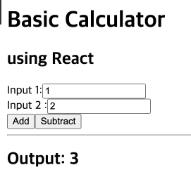

## About DOM

DOM에 대한 이야기는 [이전에 문서로](https://parkjju.github.io/vue-TIL/daily/220208-DOM.html#dom%E1%84%8B%E1%85%B5%E1%84%85%E1%85%A1%E1%86%AB) 정리해두었으니 참고하면 가상 돔 이야기를 이야기하는 데에 도움이 많이 될 것 같습니다.

간단히 정리해보자면 DOM은 크로스 플랫폼, 언어 독립적(language-independent)한 웹 API입니다. 구축 과정 및 상세 내용에 대해서는 문서 및 각종 자료를 참조해주시면 좋습니다. (이하 평어체로 작성)

DOM은 HTML로 파싱된 객체를 동적으로 조작하기 위해서 존재한다. 동적이라는 단어가 포함되기 때문에 DOM의 근본적인 문제가 발생한다. 바로 **성능 문제이다.** 개발자 도구를 통해 눈에 보이는 요소만 간략히 처리하는 것으로는 성능의 문제를 체감하기 어렵다. 더 극단적인 예시를 생각해보면 모던 웹의 가장 대표적인 주자로 Facebook, Instagram 등 각종 SNS가 있다. 이들 앱 내에서 게시물을 이루는 UI 요소 10000개를 왼쪽으로 1픽셀 옮긴다고 가정해보자. DOM 구조 재구축은 고사하고 각 요소가 실제로 옮겨질 수 있게끔  하는 브라우저 렌더링 단에서도 큰 오버헤드가 발생할 것이다.

## Virtual DOM 개요

위와 같은 문제를 해결하기 위해 W3C에서 `Shadow DOM`이라는 기능을 명세에 추가하였다. 섀도우 돔에 대한 정리는 [다음의 자료를](https://bitsofco.de/what-is-the-shadow-dom/?utm_source=CSS-Weekly&utm_campaign=Issue-344&) 참조하자. 섀도우 돔에 대한 설명과 실습 코드로 정리해둔 [문서도](./220224-shadow.md) 있으니 참고하면 좋을 것 같습니다.

섀도우 돔은 기능적으로 표준이고 사실 오래전부터 사용해왔다. `<input type="range"/>` 태그의 경우 HTML의 기준으로 봤을 때 한 가지 요소로만 이루어질 수 없다. 몇 가지의 `div` 또는 `span`과 스타일까지 적용해야 해당 태그 모습이 적절히 나타나게 되는 것이다.

섀도우 돔 외에 돔 최적화에 사용되는 기법이 바로 가상 돔(Virtual DOM)이다. 이 기법은 표준 기법이 아니다. **가상 돔은 DOM과 별개의 것이라기 보다 DOM을 기반으로 하는 기법이다.** DOM을 효율적으로, 적게 활용하는 방법이라고 보면 된다.

## Virtual DOM 기초

돔을 직접 조작하는 것보다 **돔을 추상화시킨 버전을 조작한다는 것이** 가상 돔과 오리지널 돔의 차이점이다. 가상 돔은 오리지널 돔에 비해 가볍고, 가상 돔에 수정사항이 생기면 실제 돔 트리에 반영할 수 있다. 실제 돔 트리에 변경사항을 반영하기 위해 가상 돔과 실제 돔의 차이를 비교하고 어떤 부분이 바뀌어야 하는지 체크한다.

가상 돔이 좋은 이유는 바로 실제 돔의 쓸데없는 요소를 모두 걷어내고 생각할 수 있기 때문이다. DOM API중에 기껏해야 지금까지 써본 기능은 `document.querySelector`가 아닌가. API를 차치하고서라도 DOM 자체에는 너무나 많은 정보가 있다.

가상 돔을 잘 쓰기 위해서는 다음 두 조건을 만족해야한다.

1. DOM 변경사항 반영 후 `re-render`를 어느 시점에 해야하는가?
2. `re-render`를 어떻게 하면 효율적으로 처리할 수 있는가?

### When re-render the DOM?

약간의 CS적인 내용들이 필요하다. 데이터가 바뀌었고 돔 트리에 이를 반영하여 다시 렌더링 해야하는 상황이다. **데이터에 변동이 있다는 사실을 컴퓨터가 어떻게 알아챌 수 있을까?**

1. `dirty check` : 프로세스의 **busy waiting을** 생각하면 된다. 데이터 동기화 작업을 `data polling`이라고 하는데 이 작업을 적정 간격을 두고 반복적으로 실행하는 것이다.
2. `observable` : **상태 변화를 체크한다.** 변화가 없으면 아무 작업도 하지 않고, 변화가 발생하면 무엇을 업데이트 해야하는 지만 확인한다.

### What makes it really fast is?

1. Efficient diff algorithm : 요소 간 차이를 판단하는 알고리즘을 개선해야한다. [React reconciliation](https://ko.reactjs.org/docs/reconciliation.html)
2. Batching DOM read/write operation : 돔 요소 읽기/쓰기 작업을 일괄적으로 처리한다.
3. Efficient update of sub-tree only : 전체 트리의 업데이트가 아닌, 업데이트가 필요한 서브트리 데이터만 업데이트한다.

> As you understand it’s not an easy thing and implementation of it can be tough.

## Virtual DOM 동작
> But before we proceed, have you thought why we don’t render directly the changes on the DOM? - (출처:[medium - how virtual dom and diffing works in react](https://medium.com/@gethylgeorge/how-virtual-dom-and-diffing-works-in-react-6fc805f9f84e))

DOM 변화를 직접 렌더링 하지 않는 이유가 무엇일까? 돔 트리 구축 자체는 자료구조가 트리이기 때문에 빠른 시간 안에 이루어지지만 그 안을 이루는 요소(데이터, 프로퍼티 값들)들을 수정할 때 **레이아웃의 조정 및 레이어 래스터 작업과 같은 로직을 거쳐야 하기 때문에 브라우저 입장에서 많은 오버헤드가 발생하는 것이다.** (최종적으로 리페인팅까지 진행해야한다.)

[medium 문서](https://medium.com/@gethylgeorge/how-virtual-dom-and-diffing-works-in-react-6fc805f9f84e)를 참조하여 가상 돔의 동작을 이해해보자. (계산기 프로그램으로 예제 코드가 제공되고 있는데, 리액트 버전이 오래 전거라 Deprecated 경고가 많이 발생한다. 알고리즘과 동작에 대한 이해만 가져가도록 하자.)

위의 이미지처럼 인풋 값 둘을 입력한 뒤 Add 또는 Subtract 버튼을 클릭하면 계산을 해준다. Add 버튼을 클릭하면 `setState`라는 이름의 메서드를 출력하면서 계산 결과값을 전달한다. 

리-렌더링 트리거 조건 첫 번째로 `dirty check`가 있었다. 컴포넌트를 어떻게 `dirty`상태라고 표시할 수 있을까?

---

this, Execution Context, Closure 학습 이후 다시 정리

---

## Reference

1. [Medium - What is Virtual DOM?](https://tonyfreed.medium.com/what-is-virtual-dom-c0ec6d6a925c)
2. [Medium - How Virtual DOM and diffing works in React](https://medium.com/@gethylgeorge/how-virtual-dom-and-diffing-works-in-react-6fc805f9f84e)
3. [What is the Shadow DOM?](https://bitsofco.de/what-is-the-shadow-dom/?utm_source=CSS-Weekly&utm_campaign=Issue-344&)