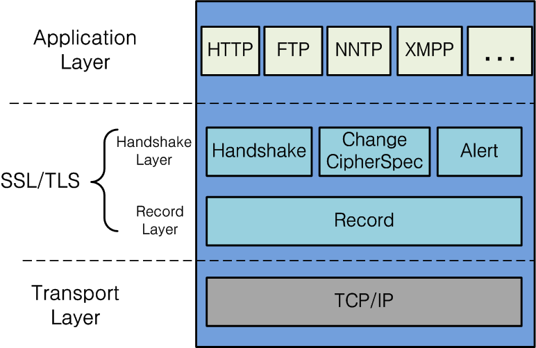

[생활코딩 - https와 ssl이란 무엇인가 시리즈](https://www.youtube.com/watch?v=0cfUVrQW_yg&list=PLCZ-8rvakaqbplQZAoUku8uuxUgbLQm-1)의 정리본입니다.

## HTTPS란?

HTTPS는 Hypertext Transfer Protocol의 약자입니다. 이때 하이퍼텍스트는 **문서와 문서가 링크 형태로 연결되어 있는 체계를 의미합니다.** 하이퍼텍스트의 가장 중요한 요소는 우리에게 익숙한 HTML문서입니다.

한마디로 HTTPS는 HTML을 전송하기 위한 통신 규약이라고 할 수 있습니다.

HTTP와 HTTPS의 차이가 무엇일까요? HTTPS의 S는 Over Secure Socket Layer의 약자인데, 특별한 보안 장치입니다. HTTP를 통한 하이퍼텍스트의 전송과 수신 과정에서 제 3자의 개입을 (보안 상 문제들) 차단하기 위한 장치인 것입니다.

## HTTPS vs SSL

HTTPS는 SSL위에서 동작합니다. OSI 7계층에 대한 자세한 설명은 [다음의 링크를](https://www.sharedit.co.kr/posts/7482) 참조하세요.

SSL과 HTTPS는 다른 것입니다. SSL이라는 전송 계층(Transport Layer)의 암호화 방식이 가장 많이 적용되는 곳이 HTTPS 프로토콜인것 뿐입니다.

SSL이 최근에는 TLS로 명칭이 변경되었지만 주로 SSL이라는 명칭을 사용합니다.

## SSL 인증서

SSL인증서는 클라이언트와 서버간의 통신을 **제 3자가 보증해주는 전자화된 문서입니다.** SSL인증서는 디지털 인증서의 한 종류입니다.

디지털 인증서를 사용함으로써 얻는 이점들은 다음과 같은 것들이 있습니다.

1. 통신 내용이 공격자에게 노출되는 것을 막는다. - 암호화
2. 클라이언트가 접속할 서버가 신뢰할만한지 판단할 수 있다.
3. 통신 내용의 악의적 변경을 방지

## 대칭키

암호화는 기존 암호를 **키값을** 통해 제 3자가 알아보지 못하게 하는 것이고 암호화된 값을 다시 키값을 활용하여 원본으로 해석하는 것을 복호화라고 합니다. 이때 암호화와 복호화 모두에는 **키값이라는 것이 사용됩니다.**

이러한 방식을 대칭키 방식이라고 합니다. 대칭키 방식은 누군가에게 전달된 암호를 복호화 하기 위해 키값이 필요하다는 것인데 원격에 위치한 대상에게 키값을 전달하기가 매우 위험합니다.

이러한 점이 대칭키 방식의 한계점입니다.

## 공개키

공개키 방식은 두 키를 갖고 둘 중 하나의 키로 암호화를 하면 나머지 한 키로 복호화를 할 수 있는 방식입니다. 한 키를 비공개키(private key), 나머지 한 키를 공개키(public key)로 하여 공개키를 타인에게 제공합니다.

배포처에서 개인 키를 소지하고 공개키를 사용자들에게 뿌려 사용자들의 암호화 대상을 암호화 합니다. 사용자들은 자신의 암호를 풀기 위해 개인키를 소지한 배포처로 자신의 암호를 보내고 거기서 복호화 되어 접근할 수 있게 됩니다.

## Reference

1. [네트워크 통신 계층: OSI 7계층 바로 알기](https://www.sharedit.co.kr/posts/7482)
2. [생활코딩 - HTTPS와 SSL이란 무엇인가](https://www.youtube.com/watch?v=0cfUVrQW_yg&list=PLCZ-8rvakaqbplQZAoUku8uuxUgbLQm-1)
3. [SSL/TLS와 HTTPS - 사진 출처](https://www.lesstif.com/ws/ssl-tls-https-43843962.html)
