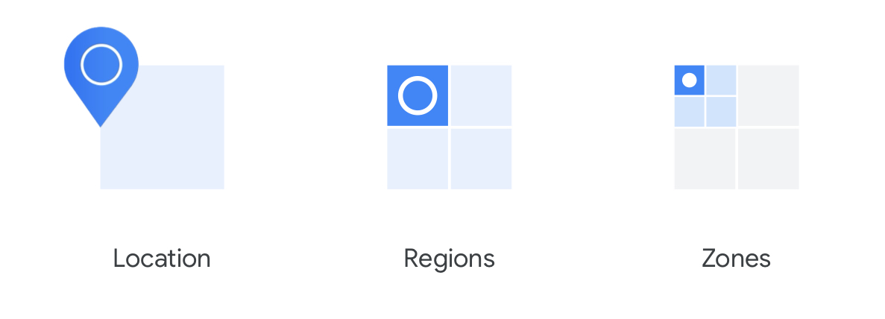

회사에서 좋은 기회로 GCP Associate Cloud Engineer 자격증 취득 프로그램 참여를 하게 되어 공부 내용을 기록한다.

## Definition of Cloud Computing

클라우드 컴퓨팅이란 아래 다섯가지 특성을 만족하는 정보 기술(IT)을 의미한다.

1. 고객이 컴퓨팅 자원을 온디맨드(주문형, 원할 때 즉각적인 요구에 따라 필요한 형태에 맞춰 주문) 방식, 그리고 자기 주도적으로 사용할 수 있다.
2. 고객이 이러한 컴퓨팅 자원들에 인터넷을 통해 어디서나 접근할 수 있다.
3. 해당 자원의 제공자는 공유된 컴퓨팅 자원들의 집합으로부터 꺼내어 사용자 요구에 따라 할당한다.
4. 자원은 탄력적이고(elastic) 고객 필요에 따라 사용량을 늘리거나 줄일 수 있다.
5. 고객은 그들이 사용한 만큼 비용을 지불하거나, 필요에 따라 사전에 예약한 만큼 비용을 지불한다.

## History of Cloud Computing

클라우드 컴퓨팅 모델은 아래와 같은 역사적 흐름에 따라 만들어지게 되었다.

1. **Colocation**: 데이터 센터 부지를 구매하거나 실제로 건설하지 않고 물리적 공간을 임대하는 방식
2. **Virtualized data center**: 로드밸런서, CPU, 디스크 등 실제 장치를 구매하여 프라이빗 데이터 센터 및 콜로케이션에 배치하는 형태가 아닌, 장치들을 소프트웨어 형태로 가상화 하여 제공하는 방식
    - 이를 통해 가상 서버를 만들 수 있게 되었지만, 해당 서버에 대한 관리 및 운영 책임은 여전히 기업에 존재
    - 서버 배치, 설치할 OS, 보안 업데이트 등 서버 컴퓨팅 셋업 자체를 가상화 데이터 센터를 이용하는 고객이 직접 해야됨.
    - 물리적인 장비만 쉽게 대여 할 수 있는 방식일 뿐
3. **Container-based architecture**: 자동화된 서비스들과 확장 가능한 데이터 시스템의 조합으로 구성
    - 컨테이너 기술(예: Docker)과 이를 관리하는 오케스트레이션 도구(예: Kubernetes)를 활용하면, 애플리케이션 실행에 필요한 인프라 프로비저닝을 자동화할 수 있다. 여기서 인프라 프로비저닝이란, 애플리케이션이 실행될 수 있도록 서버, 네트워크, 스토리지 등 컴퓨팅 자원을 준비하고 구성하는 과정을 의미한다.

## IaaS & PaaS

가상화 데이터 센터로의 국면 전환은 IaaS와 PaaS라는 새로운 형태의 서비스를 제공했다.

1. IaaS(Infrastructure as a Service): 클라우드를 통해 온디맨드 인프라 자원을 전달 (디스크 등 로우레벨 컴퓨팅 자원, 스토리지, 네트워크 지원 기능 - 로드 밸런서 등), ex) GCP Compute Engine
    - IaaS는 고객이 미리 할당한 자원에 대해 비용을 지불한다. (4시간 할당 예약, 4시간 만큼 비용지불)
2. PaaS(Platform as a Service): 애플리케이션이 필요한 인프라에 접근할 수 있도록 코드를 라이브러리와 연결해준다. 이때 라이브러리는 개발자가 인프라에 직접 접근하지 않고 GCP 라이브러리를 통해 간접적으로 인프라에 접근한다.(ex - DB 연결 시 `google.cloud.datastore`, 로깅 시 `google.cloud.logging` 활용 등)
    - PaaS는 고객이 실제로 사용한 자원에 대해서만 비용을 지불한다. (4시간 트래픽 발생, 4시간 만큼 비용지불)
    - IaaS와 다르게 PaaS는 인프라 자원을 미리 할당받아서 사용하는 형태가 아님
3. SaaS(Software as a Service): 완전한 어플리케이션 스택을 제공하여 고객이 완전한 클라우드 기반 애플리케이션에 바로 접근 및 사용할 수 있게 해준다. (ex - Gmail, Drive 등이 묶여 Google Workspace로 사용)

:::tip 서버리스 컴퓨팅

서버리스 컴퓨팅은 인프라에 대한 관리를 전혀 하지 않고 오직 코드에만 집중할 수 있는 환경을 제공하는 것을 의미한다. 서버 구성 및 자원 설정 없이도 어플리케이션 실행이 가능하다.

GCP에서는 아래와 같은 서버리스 컴퓨팅 서비스들을 제공한다.

-   Cloud Run: 컨테이너화된 마이크로 서비스를 쉽게 배포 가능
-   Cloud Function: 이벤트 기반 코드 모음, 파일 업로드 및 DB 변경과 같은 이벤트 발생 시 자동으로 등록해둔 함수가 실행된다.

:::

## Google Cloud Network

구글은 더 많은 처리량(throughput) 감당과 최대한 낮은 지연(latency)을 위해 글로벌 네트워크망을 구축했다. 전세계 곳곳에 100개 이상의 컨텐츠 캐싱 노드를 마련해두고 있다.

구글 인프라 위치가 고객 작업의 중요한 기반이 되는데, 전 세계 7개 리전에 기반을 두고 있다. 그 지역들은 북아메리카, 남아메리카, 유럽, 아프리카, 중동, 아시아, 오스트레일리아에 해당한다.

여러 지역에 걸쳐 인프라 망을 구축해둔 이유는 **가용성(availability)**, **내구성(durability)**, 그리고 **지연(latency)**과 같은 품질 요소들이 영향을 받기 때문이다. 지연은 정보의 패킷이 출발지에서 목적지까지 이동하는 데 걸리는 시간을 의미한다.

## Regions and Zones

클라우드 환경에서 각 지역은 리전으로 구성되어 있고, 각 리전은 Zone으로 구성되어 있다.

영국 런던이라는 지역에는 `europe-west2`라는 리전이 존재하고, 해당 리전에는 `europe-west2-a`, `europe-west2-b`, `europe-west2-c`.. 등의 Zone들로 구성되어 있다.

Zone은 구글 클라우드 리소스가 배포되는 물리적 영역이다. 가상 머신 배포를 가정하면, 해당 가상 머신은 하나의 Zone에 배포된다. Zone 구조를 통해 리소스의 중복성과(redundancy) 고가용성을(high-availability) 충족시킬 수 있다.

리소스 중복성은 같은 기능을 하는 리소스를 여러개로 복제해두는 것을 의미하며, 고가용성은 서비스가 장애 없이 지속적으로 운영될 수 있도록 설계된 시스템의 특성이다.

멀티존 배포 외에 멀티 리전 배포도 가능하다. 리소스 중복성, 고가용성을 만족하면서 추가적으로 멀리 떨어진 리전과의 애플리케이션 연결성을 보장하기 위한 목적도 추가된다.

Google Cloud Spanner가 위와 같은 역할을 한다. 여러 존 및 여러 리전에 DB 복제(replication)를 할 수 있게 해준다. 해당 복제본들은 멀티 리전에 배포될 수 있고, 이를 통해 낮은 레이턴시로 다른 리전에서 DB에 접근할 수 있게 된다.
