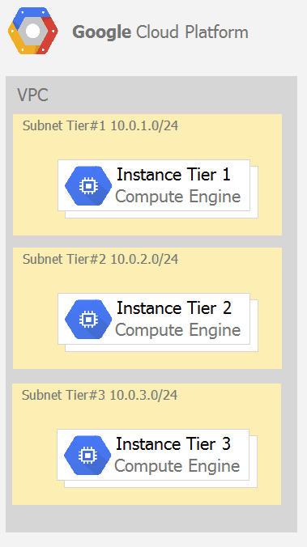
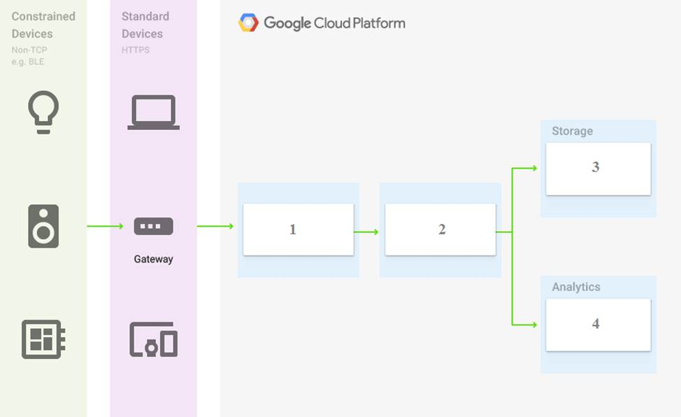
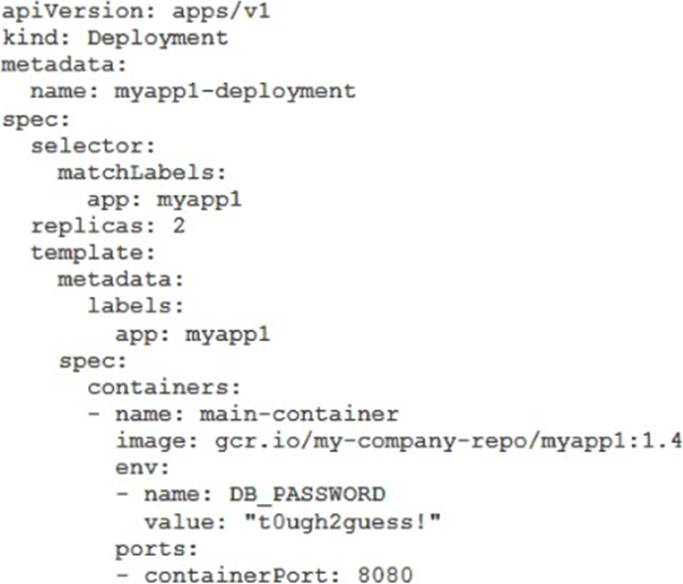

## dump 1

Every employee of your company has a Google account. Your operational team needs to manage a large number of instances on Compute Engine. Each member of this team needs only administrative access to the servers. Your security team wants to ensure that the deployment of credentials is operationally efficient and must be able to determine who accessed a given instance. What should you do?

A. Generate a new SSH key pair. Give the private key to each member of your team. Configure the public key in the metadata of each instance.
B. Ask each member of the team to generate a new SSH key pair and to send you their public key. Use a configuration management tool to deploy those keys on each instance.
C. Ask each member of the team to generate a new SSH key pair and to add the public key to their Google account. Grant the ג€compute.osAdminLoginג€ role to the Google group corresponding to this team.
D. Generate a new SSH key pair. Give the private key to each member of your team. Configure the public key as a project-wide public SSH key in your Cloud Platform project and allow project-wide public SSH keys on each instance.

:::details 풀이

문제 해석) 회사의 모든 직원이 Google 계정을 가지고 있습니다. 운영팀은 Compute Engine에서 많은 수의 인스턴스를 관리해야 합니다. 이 팀의 각 구성원은 서버에 대한 관리자 액세스 권한만 필요합니다. 보안팀은 자격 증명 배포가 운영상 효율적이어야 하며 누가 특정 인스턴스에 액세스했는지 확인할 수 있어야 한다고 요구합니다. 어떻게 해야 할까요?

서버에 대한 관리자 액세스 권한이라 함은, Compute Engine 서버 내에서 시스템 관리 작업에 대한 권한을 의미한다. 리소스 관리 권한이 아닌 것을 기억해야 한다.

오답 정리

-   A(오답): 새로운 SSH 키 쌍을 생성하고, 개인 키를 팀의 각 구성원에게 제공하며, 각 인스턴스의 메타데이터에 공개 키를 구성
    -   동일한 개인 키를 공유하면 누가 접근했는지 추적 불가
-   B(오답): 각 팀 구성원이 새로운 SSH 키 쌍을 생성하고 공개 키를 보내도록 하여, 구성 관리 도구로 각 인스턴스에 배포
    -   수동 배포 과정 비효율 / 확장성 저하
-   **C(정답)**: 각 팀 구성원이 새로운 SSH 키 쌍을 생성하고 Google 계정에 공개 키를 추가하도록 하고, 해당 팀에 대응하는 Google 그룹에 'compute.osAdminLogin' 역할을 부여
    -   OS Login을 통해 Google 계정과 SSH 키가 연동됨
    -   각 사용자를 개별적으로 추적 가능
    -   그룹 기반 권한 관리로 효율적
    -   Google의 감사 로그를 통해 접근 기록 추적 가능
-   D(오답): 새로운 SSH 키 쌍을 생성하고 개인 키를 각 구성원에게 제공하며, 프로젝트 전체 공개 SSH 키로 구성
    -   A와 동일하게 개별 사용자 추적 불가능

:::

## dump 2

```
You need to create a custom VPC with a single subnet. The subnet's range must be as large as possible. Which range should you use?

A. 0.0.0.0/0
B. 10.0.0.0/8
C. 172.16.0.0/12
D. 192.168.0.0/16
```

:::details 풀이

사용자 정의 VPC를 단일 서브넷으로 생성해야 합니다. 서브넷의 범위는 가능한 한 커야 합니다. 어떤 범위를 사용해야 할까요?

CIDR이란 IP 주소를 효율적으로 할당하고 라우팅하기 위한 방법이다. (`IP주소/프리픽스길이`)

A. 0.0.0.0/0

의미: 전체 IPv4 주소 공간 (모든 IP 주소)
범위: 0.0.0.0 ~ 255.255.255.255
주소 개수: 약 43억 개

B. 10.0.0.0/8 ⭐

의미: RFC 1918 사설 IP 대역 중 Class A
범위: 10.0.0.0 ~ 10.255.255.255
주소 개수: 약 1,677만 개

C. 172.16.0.0/12

의미: RFC 1918 사설 IP 대역 중 Class B
범위: 172.16.0.0 ~ 172.31.255.255
주소 개수: 약 104만 개

D. 192.168.0.0/16

:::

의미: RFC 1918 사설 IP 대역 중 Class C
범위: 192.168.0.0 ~ 192.168.255.255
주소 개수: 약 6만 5천 개

CIDR 표기에서 192.168.1.100/24의 앞부분은 IP주소, 뒷부분은 서브넷마스크 길이이다. 192, 168과 같은 각 부분은 옥텟이라고 불린다. 각 옥텟마다 0~255까지 할당 가능한데, 이는 비트 기준 00000000 ~ 11111111로 값이 변할 수 있다는 것을 가리킨다.

서브넷 마스크 길이는 1의 갯수를 의미하고, /24면 비트 1이 24개가 고정이라는 것을 의미한다.

즉 192.168.1이 고정 주소이고, 나머지 100 주소값이 변할 수 있음을 의미한다.

## dump 3

You want to select and configure a cost-effective solution for relational data on Google Cloud Platform. You are working with a small set of operational data in one geographic location. You need to support point-in-time recovery. What should you do?

-   A. Select Cloud SQL (MySQL). Verify that the enable binary logging option is selected.
-   B. Select Cloud SQL (MySQL). Select the create failover replicas option.
-   C. Select Cloud Spanner. Set up your instance with 2 nodes.
-   D. Select Cloud Spanner. Set up your instance as multi-regional.

:::details 풀이

#### 영문 문제 해석

**문제**: "Google Cloud Platform에서 관계형 데이터를 위한 비용 효율적인 솔루션을 선택하고 구성하려고 합니다. 한 지리적 위치에서 소규모 운영 데이터로 작업하고 있습니다. 특정 시점 복구(point-in-time recovery)를 지원해야 합니다. 어떻게 해야 할까요?"

**핵심 요구사항**:

-   관계형 데이터베이스
-   **비용 효율적인** 솔루션
-   **소규모** 운영 데이터
-   **단일 지리적 위치**
-   **Point-in-time Recovery (PITR)** 지원 필수

#### 선택지 해석

**A. Cloud SQL (MySQL)을 선택하고, enable binary logging 옵션이 선택되었는지 확인**

-   Binary logging: MySQL의 변경 사항을 로그로 기록
-   PITR을 위해 필수적인 기능

**B. Cloud SQL (MySQL)을 선택하고, create failover replicas 옵션을 선택**

-   Failover replicas: 고가용성을 위한 복제본 생성
-   주로 장애 대응용, PITR과는 다른 개념

**C. Cloud Spanner를 선택하고, 2개 노드로 인스턴스 설정**

-   Cloud Spanner: 글로벌 분산 데이터베이스
-   최소 2개 노드 필요 (비용이 높음)

**D. Cloud Spanner를 선택하고, 인스턴스를 멀티 리전으로 설정**

-   Multi-regional: 여러 지역에 분산
-   가장 비용이 높은 옵션

#### 문제 분석 및 정답 도출

#### 서비스 비교

**Cloud SQL vs Cloud Spanner**

-   **Cloud SQL**:
-   소규모~중간 규모 애플리케이션
-   비용 효율적
-   단일 리전에 적합
-   PITR 지원 (binary logging 필요)

-   **Cloud Spanner**:
-   대규모, 글로벌 애플리케이션
-   비용이 높음 (최소 2노드부터)
-   자동 PITR 지원하지만 과도한 스펙

#### Point-in-Time Recovery

**Cloud SQL에서 PITR 활성화 방법**:

1. **Binary logging 활성화** ← 핵심!
2. Automated backup 설정
3. 이 둘이 결합되어 PITR 기능 제공

**Failover replicas**는 고가용성을 위한 것으로 PITR과는 별개입니다.

#### 비용 고려사항

-   **소규모 데이터 + 단일 위치** → Cloud SQL이 적합
-   Cloud Spanner는 요구사항 대비 과도하게 비싼 솔루션

#### 정답: **A. Cloud SQL (MySQL)을 선택하고, enable binary logging 옵션이 선택되었는지 확인**

**선택 이유**:

1. **비용 효율성**: 소규모 데이터에는 Cloud SQL이 적합
2. **PITR 지원**: Binary logging이 PITR의 핵심 요구사항
3. **단일 위치**: 멀티 리전 불필요
4. **요구사항 충족**: 모든 조건을 가장 경제적으로 만족

:::

PITR은 데이터베이스를 특정 시점으로 복구하는 기능이다. (DB 특정 스냅샷으로 복구)

## dump 4

You want to configure autohealing for network load balancing for a group of Compute Engine instances that run in multiple zones, using the fewest possible steps. You need to configure re-creation of VMs if they are unresponsive after 3 attempts of 10 seconds each. What should you do?

-   A. Create an HTTP load balancer with a backend configuration that references an existing instance group. Set the health check to healthy (HTTP)
-   B. Create an HTTP load balancer with a backend configuration that references an existing instance group. Define a balancing mode and set the maximum RPS to 10.
-   C. Create a managed instance group. Set the Autohealing health check to healthy (HTTP)
-   D. Create a managed instance group. Verify that the autoscaling setting is on.

:::details 풀이

#### 영문 문제 해석

**문제**: "여러 영역에서 실행되는 Compute Engine 인스턴스 그룹에 대해 네트워크 로드 밸런싱을 위한 자동 복구(autohealing)를 가능한 한 최소한의 단계로 구성하려고 합니다. 각각 10초씩 3회 시도 후 응답하지 않으면 VM을 다시 생성하도록 구성해야 합니다. 어떻게 해야 할까요?"

**핵심 요구사항**:

-   **Autohealing** (자동 복구) 구성
-   **Network load balancing**
-   **Multiple zones** (여러 영역)
-   **최소 단계**로 구성
-   **3회 시도 × 10초 = 30초** 후 VM 재생성
-   응답하지 않는 VM 처리

#### 선택지 해석

**A. 기존 인스턴스 그룹을 참조하는 백엔드 구성으로 HTTP 로드 밸런서 생성. 헬스 체크를 healthy (HTTP)로 설정**

-   HTTP 로드 밸런서: L7 로드 밸런서 (문제에서 요구하는 것은 네트워크 로드 밸런싱)
    -   L7 - OSI 7계층을 의미, HTTP 로드밸런서는 7계층인데, 문제에서 요구하는건 네트워크 계층 (4계층) 로드밸런서
-   기존 인스턴스 그룹 사용 (autohealing 기능 없음)
    -   문제에서의 existing instance group이 unmanaged instance group을 의미한다.

**B. 기존 인스턴스 그룹을 참조하는 백엔드 구성으로 HTTP 로드 밸런서 생성. 밸런싱 모드 정의하고 최대 RPS를 10으로 설정**

-   HTTP 로드 밸런서 (네트워크 로드 밸런싱 아님)
-   RPS 설정은 autohealing과 무관

**C. 관리형 인스턴스 그룹(Managed Instance Group) 생성. Autohealing 헬스 체크를 healthy (HTTP)로 설정**

-   MIG: autohealing 기능 내장
-   헬스 체크로 자동 복구 가능

**D. 관리형 인스턴스 그룹 생성. 오토스케일링 설정이 켜져 있는지 확인**

-   MIG 생성은 맞지만
-   Autoscaling ≠ Autohealing (다른 기능)

#### 문제 분석 및 정답 도출

#### Autohealing vs Load Balancing 구분

**Autohealing (자동 복구)**:

-   비정상 인스턴스를 **자동으로 재생성**
-   Managed Instance Group의 기능
-   Health check로 인스턴스 상태 모니터링

**Load Balancing**:

-   트래픽을 여러 인스턴스에 **분산**
-   비정상 인스턴스로 트래픽 전송 중단
-   인스턴스를 재생성하지는 않음

#### Network Load Balancing

문제에서 "network load balancing"을 언급했지만, 핵심 요구사항은 **autohealing**입니다.

-   Network LB 자체는 autohealing 기능 없음
-   MIG + Health Check = autohealing 구현

##### Managed Instance Group (MIG)의 장점

1. **Autohealing 내장**: 헬스 체크 기반 자동 복구
2. **Multi-zone 지원**: 여러 영역에 인스턴스 분산
3. **최소 단계**: 한 번의 설정으로 모든 기능 활성화
4. **Health Check 커스터마이징**: 3회 × 10초 설정 가능

#### 헬스 체크 설정

MIG에서 autohealing 설정 시:

Check interval: 10초
Timeout: 10초
Unhealthy threshold: 3회
총 대기 시간: 30초 후 VM 재생성

#### 정답: **C. 관리형 인스턴스 그룹 생성. Autohealing 헬스 체크를 healthy (HTTP)로 설정**

**선택 이유**:

1. **Autohealing 직접 제공**: MIG는 autohealing 기능을 내장
2. **최소 단계**: 하나의 구성으로 모든 요구사항 충족
3. **Multi-zone 지원**: 자동으로 여러 영역에 분산
4. **헬스 체크 커스터마이징**: 3회 × 10초 설정 가능
5. **요구사항 완벽 일치**: VM 재생성 기능 제공

오토힐링 헬스체크 타입을 HTTP 지정한다는 것은 HTTP 요청을 보낸 뒤 응답 코드를 보고 상태를 판단한다는 것을 의미한다.

-   TCP: 포트 연결만 확인
-   HTTPS: SSL/TLS 포함한 HTTP 확인
-   HTTP/2: HTTP/2 프로토콜로 확인

:::

## dump 5

You are using multiple configurations for gcloud. You want to review the configured Kubernetes Engine cluster of an inactive configuration using the fewest possible steps. What should you do?

-   A. Use gcloud config configurations describe to review the output.
-   B. Use gcloud config configurations activate and gcloud config list to review the output.
-   C. Use kubectl config get-contexts to review the output.
-   D. Use kubectl config use-context and kubectl config view to review the output.

:::details 풀이

### 영문 문제 해석

**문제**: "gcloud에 대해 여러 구성을 사용하고 있습니다. 가장 적은 단계로 비활성 구성의 구성된 Kubernetes Engine 클러스터를 검토하려고 합니다. 어떻게 해야 할까요?"

**핵심 요구사항**:

-   Multiple gcloud configurations (여러 gcloud 구성)
-   Inactive configuration (비활성 구성)
-   Kubernetes Engine cluster 검토
-   Fewest possible steps (최소 단계)

### 선택지 해석

**A. gcloud config configurations describe를 사용하여 출력 검토**

-   특정 구성의 모든 속성을 표시
-   구성 활성화 없이 바로 확인 가능

**B. gcloud config configurations activate와 gcloud config list를 사용하여 출력 검토**

-   구성 활성화 후 현재 활성 구성 확인
-   2단계 필요

**C. kubectl config get-contexts를 사용하여 출력 검토**

-   kubectl의 컨텍스트 목록 확인
-   gcloud 구성과는 별개의 kubectl 구성

**D. kubectl config use-context와 kubectl config view를 사용하여 출력 검토**

-   kubectl 컨텍스트 변경 후 클러스터 구성 정보 확인
-   2단계 필요

### 문제 분석 및 정답 도출

#### gcloud configuration vs kubectl context

**gcloud configuration**

-   Google Cloud CLI의 구성 프로필
-   프로젝트, 리전, 계정, 클러스터 이름 등 설정

**kubectl context**

-   Kubernetes CLI의 클러스터 접속 정보
-   클러스터 API 서버, 인증 정보, 네임스페이스 등

#### "configured Kubernetes Engine cluster를 review"의 의미

**실제 Kubernetes 클러스터 구성 확인**

-   클러스터 API 서버 주소
-   인증 정보 및 방식
-   네임스페이스 설정
-   사용자 권한 정보

#### 각 선택지 분석

**A. gcloud config configurations describe**

-   출력: 프로젝트, 리전, 클러스터 이름
-   한계: 실제 Kubernetes 구성 정보 없음

**B. gcloud config configurations activate + list**

-   출력: gcloud 레벨 정보
-   한계: Kubernetes 클러스터 구성 세부사항 없음

**C. kubectl config get-contexts**

-   출력: 컨텍스트 목록
-   한계: 실제 클러스터 구성 정보 없음

**D. kubectl config use-context + view**

-   출력: 클러스터 API 서버, 인증 정보, 사용자 설정 등
-   장점: 실제 Kubernetes 클러스터 구성 정보 제공

##### 정답: D. kubectl config use-context와 kubectl config view를 사용하여 출력 검토

**선택 이유**:

1. 실제 Kubernetes 클러스터 구성 정보 확인 가능
2. API 서버 주소, 인증 방식, 사용자 권한 등 상세 정보 제공
3. kubectl config view가 클러스터 구성 검토에 적합한 명령어
4. gcloud configuration은 메타 정보만 제공하여 부족

:::

## dump 6

Your company uses Cloud Storage to store application backup files for disaster recovery purposes. You want to follow Google's recommended practices. Which storage option should you use?

A. Multi-Regional Storage
B. Regional Storage
C. Nearline Storage
D. Coldline Storage

:::details 풀이

### 영문 문제 해석

**문제**: "회사에서 재해 복구 목적으로 애플리케이션 백업 파일을 저장하기 위해 Cloud Storage를 사용합니다. Google의 권장 사례를 따르고자 합니다. 어떤 스토리지 옵션을 사용해야 할까요?"

**핵심 요구사항**:

-   Application backup files (애플리케이션 백업 파일)
-   Disaster recovery purposes (재해 복구 목적)
-   Google's recommended practices (Google 권장 사례)

### 선택지 해석

**A. Multi-Regional Storage**

-   여러 지역에 데이터 복제
-   높은 가용성과 내구성
-   가장 높은 비용

**B. Regional Storage**

-   단일 리전 내 여러 존에 데이터 복제
-   높은 성능, 중간 비용
-   지역적 재해에 취약

**C. Nearline Storage**

-   월 1회 미만 접근하는 데이터용
-   중간 비용, 검색 비용 있음
-   30일 최소 보관 기간

**D. Coldline Storage**

-   분기 1회 미만 접근하는 데이터용
-   낮은 비용, 높은 검색 비용
-   90일 최소 보관 기간

### 문제 분석 및 정답 도출

#### 재해 복구용 백업의 실제 특성

**접근 패턴**

-   평상시: 거의 접근하지 않음 (분기 1회 미만)
-   재해 발생시에만 접근
-   장기간 보관이 주 목적

**백업 데이터의 생명주기**

-   생성 후 장기간 보관
-   법적 요구사항으로 수년간 보존
-   실제 사용 빈도는 매우 낮음

**비용 최적화**

-   저장 비용이 가장 중요한 요소
-   재해시 검색 비용은 일회성으로 허용 가능

#### Google의 백업 권장 사례

**Disaster Recovery 백업의 특징**

-   매우 낮은 접근 빈도 (분기 1회 미만)
-   장기 보관 (90일 이상)
-   비용 효율성 최우선
-   재해시에만 빠른 검색 필요

**Coldline Storage의 장점**

-   백업 데이터의 접근 패턴과 정확히 일치
-   가장 낮은 저장 비용
-   90일 최소 보관 기간이 백업 정책과 맞음
-   재해 복구시 허용 가능한 검색 시간

#### 다른 옵션들이 부적합한 이유

**Multi-Regional/Regional Storage**

-   백업 데이터에는 과도한 비용
-   자주 접근하는 데이터용

**Nearline Storage**

-   월 1회 접근을 가정하지만 백업은 그보다 훨씬 적음
-   Coldline보다 불필요하게 높은 비용

**Archive Storage**도 있는데, 이는 가격 측면에서는 이점이 있지만 재해복구시 데이터 접근 속도가 너무 느려서 부적절하다.

#### 정답: D. Coldline Storage

**선택 이유**:

1. 재해 복구 백업의 매우 낮은 접근 빈도와 일치 (분기 1회 미만)
2. 장기 보관에 최적화된 가장 낮은 저장 비용
3. 90일 최소 보관 기간이 백업 정책에 적합
4. Google이 재해 복구 백업에 권장하는 스토리지 클래스
5. 재해시에만 발생하는 검색 비용은 비용 대비 허용 가능

:::

## dump 7

Several employees at your company have been creating projects with Cloud Platform and paying for it with their personal credit cards, which the company reimburses. The company wants to centralize all these projects under a single, new billing account. What should you do?

A. Contact cloud-billing@google.com with your bank account details and request a corporate billing account for your company.
B. Create a ticket with Google Support and wait for their call to share your credit card details over the phone.
C. In the Google Platform Console, go to the Resource Manage and move all projects to the root Organizarion.
D. In the Google Cloud Platform Console, create a new billing account and set up a payment method.

:::details 풀이

### 영문 문제 해석

**문제**: "회사의 여러 직원들이 Cloud Platform으로 프로젝트를 만들고 개인 신용카드로 결제하여 회사에서 보상받고 있습니다. 회사는 모든 프로젝트를 단일한 새로운 청구 계정으로 중앙화하려고 합니다. 어떻게 해야 할까요?"

**핵심 요구사항**:

-   Multiple projects with personal credit cards (개인 신용카드로 결제하는 여러 프로젝트)
-   Company reimbursement (회사 보상)
-   Centralize under single billing account (단일 청구 계정으로 중앙화)
-   New billing account needed (새로운 청구 계정 필요)

### 선택지 해석

**A. cloud-billing@google.com에 은행 계좌 세부정보를 제공하여 회사용 기업 청구 계정을 요청**

-   이메일로 은행 정보 전달
-   기업 청구 계정 요청 방식

**B. Google Support에 티켓을 생성하고 전화로 신용카드 세부정보를 공유하기 위해 연락을 기다림**

-   Support 티켓 생성
-   전화를 통한 신용카드 정보 공유

**C. Google Platform Console에서 Resource Manager로 이동하여 모든 프로젝트를 루트 Organization으로 이동**

-   조직 구조 변경
-   프로젝트 이동 (청구 계정 변경 아님)

**D. Google Cloud Platform Console에서 새로운 청구 계정을 생성하고 결제 방법을 설정**

-   콘솔에서 직접 청구 계정 생성
-   결제 방법 직접 설정

### 문제 분석 및 정답 도출

#### 청구 계정 중앙화 과정

**필요한 단계**

1. 새로운 기업 청구 계정 생성
2. 결제 방법 설정 (기업 카드/계좌)
3. 기존 프로젝트들을 새 청구 계정으로 이동

#### 각 선택지 분석

**A. 이메일로 기업 청구 계정 요청**

-   cloud-billing@google.com은 실제 Google 이메일이 아님
-   은행 정보를 이메일로 전달하는 것은 보안상 부적절
-   공식적인 프로세스가 아님

**B. Support 티켓으로 신용카드 정보 공유**

-   Google은 전화로 결제 정보를 요구하지 않음
-   피싱 시도와 유사한 위험한 방법
-   공식적인 청구 계정 생성 방법이 아님

**C. Resource Manager로 프로젝트 이동**

-   Organization 구조 변경은 청구와 별개
-   프로젝트를 Organization으로 이동해도 청구 계정은 변경되지 않음
-   청구 중앙화와 직접적 관련 없음

**D. Console에서 새 청구 계정 생성**

-   Google Cloud Console의 표준 프로세스
-   직접적이고 안전한 방법
-   기업 결제 방법 설정 가능
-   생성 후 프로젝트들을 새 청구 계정으로 연결 가능

#### Google Cloud 청구 계정 생성 프로세스

**표준 절차**

1. Google Cloud Console → Billing 섹션
2. Create billing account 선택
3. 계정 정보 및 결제 방법 설정
4. 기존 프로젝트들을 새 청구 계정으로 이동

**보안 및 공식성**

-   모든 과정이 Google Cloud Console 내에서 진행
-   안전한 결제 정보 입력
-   즉시 적용 가능

#### 정답: D. Google Cloud Platform Console에서 새로운 청구 계정을 생성하고 결제 방법을 설정

**선택 이유**:

1. Google Cloud의 표준적이고 공식적인 프로세스
2. 안전하고 직접적인 청구 계정 생성 방법
3. 기업 결제 방법을 즉시 설정 가능
4. 생성 후 기존 프로젝트들을 새 청구 계정으로 쉽게 이동 가능
5. 추가적인 외부 연락이나 대기 시간 불필요

:::

## dump 8

You have an application that looks for its licensing server on the IP 10.0.3.21. You need to deploy the licensing server on Compute Engine. You do not want to change the configuration of the application and want the application to be able to reach the licensing server. What should you do?

A. Reserve the IP 10.0.3.21 as a static internal IP address using gcloud and assign it to the licensing server.
B. Reserve the IP 10.0.3.21 as a static public IP address using gcloud and assign it to the licensing server.
C. Use the IP 10.0.3.21 as a custom ephemeral IP address and assign it to the licensing server.
D. Start the licensing server with an automatic ephemeral IP address, and then promote it to a static internal IP address.

:::details 풀이

### 영문 문제 해석

**문제**: "라이선스 서버를 IP 10.0.3.21에서 찾는 애플리케이션이 있습니다. Compute Engine에 라이선스 서버를 배포해야 합니다. 애플리케이션의 구성을 변경하고 싶지 않으며 애플리케이션이 라이선스 서버에 도달할 수 있기를 원합니다. 어떻게 해야 할까요?"

**핵심 요구사항**:

-   Application looks for licensing server on IP 10.0.3.21 (애플리케이션이 특정 IP에서 라이선스 서버 검색)
-   Deploy licensing server on Compute Engine (Compute Engine에 라이선스 서버 배포)
-   Do not change application configuration (애플리케이션 구성 변경 금지)
-   Application must reach licensing server (애플리케이션이 라이선스 서버에 접근 가능해야 함)

### 선택지 해석

**A. gcloud를 사용하여 IP 10.0.3.21을 정적 내부 IP 주소로 예약하고 라이선스 서버에 할당**

-   Static internal IP address 예약
-   내부 네트워크에서 사용
-   Private IP 범위 (10.x.x.x)

**B. gcloud를 사용하여 IP 10.0.3.21을 정적 공용 IP 주소로 예약하고 라이선스 서버에 할당**

-   Static public IP address 예약
-   인터넷에서 접근 가능한 공용 IP
-   10.x.x.x는 사설 IP 대역

**C. IP 10.0.3.21을 커스텀 임시 IP 주소로 사용하여 라이선스 서버에 할당**

-   Custom ephemeral IP 사용
-   임시 IP로 특정 IP 지정

**D. 자동 임시 IP 주소로 라이선스 서버를 시작한 후 정적 내부 IP 주소로 승격**

-   임시 IP로 시작
-   나중에 정적 IP로 변경
-   원하는 특정 IP (10.0.3.21) 보장 안됨

### 문제 분석 및 정답 도출

#### IP 주소 10.0.3.21 분석

**IP 주소 특성**

-   10.0.3.21은 RFC 1918 사설 IP 대역 (10.0.0.0/8)
-   내부 네트워크에서만 사용 가능
-   공용 인터넷에서 라우팅 불가

#### 각 선택지 분석

**A. Static internal IP 예약**

-   10.x.x.x는 사설 IP 대역으로 internal IP가 적합
-   정적 예약으로 IP 주소 고정 보장
-   애플리케이션이 동일한 VPC 내에서 접근 가능
-   구성 변경 없이 기존 IP 주소 사용

**B. Static public IP 예약**

-   10.x.x.x는 사설 IP 대역으로 public IP로 사용 불가
-   RFC 1918 사설 주소는 공용 IP로 할당 불가능
-   Google Cloud에서 허용하지 않음

**C. Custom ephemeral IP**

-   Ephemeral IP는 일시적이며 재시작 시 변경될 수 있음
-   특정 IP 주소 보장이 어려움
-   라이선스 서버의 지속적 접근성에 부적합

**D. 자동 ephemeral에서 static으로 승격**

-   처음에 할당받는 IP가 10.0.3.21일 보장 없음
-   다른 IP가 할당되면 애플리케이션 접근 불가
-   승격 과정에서도 원하는 IP 보장 안됨

#### Static Internal IP 예약 과정

**Google Cloud 명령어**

```bash
gcloud compute addresses create LICENSE-SERVER-IP --region=us-central1 --subnet=default --addresses=10.0.3.21
gcloud compute instances create licensing-server --private-network-ip=10.0.3.21
```

#### 네트워크 요구사항 충족

**애플리케이션과 라이선스 서버 연결**

-   동일한 VPC 네트워크 내 배치
-   방화벽 규칙으로 적절한 포트 허용
-   내부 DNS 또는 직접 IP 접근

#### 정답: A. gcloud를 사용하여 IP 10.0.3.21을 정적 내부 IP 주소로 예약하고 라이선스 서버에 할당

**선택 이유**:

1. 10.0.3.21은 사설 IP 대역으로 internal IP가 적합
2. 정적 예약으로 IP 주소 고정 보장
3. 애플리케이션 구성 변경 없이 기존 하드코딩된 IP 사용 가능
4. 동일한 VPC 내에서 애플리케이션이 라이선스 서버에 접근 가능
5. Google Cloud의 표준적인 정적 IP 관리 방식

RFC 1918 사설 IP 대역이란 인터넷에서 라우팅되지 않는 내부 네트워크 전용 IP 주소 범위를 말한다. 사설 IP 대역은 총 3개이다.

1. `10.0.0.0/8` - `10.0.0.0` ~ `10.255.255.255`까지 할당 가능
    - 대규모 기업 네트워크
2. `172.16.0.0/12` - `172.16.0.0` ~ `172.31.255.255`까지 할당 가능
    - 중간 규모 네트워크
3. `192.168.0.0/16` - `192.168.255.255`
    - 소규모 네트워크 / 가정용 라우터

위 IP주소로는 라우팅이 불가능하고, 공용 인터넷에서 해당 주소들로 패킷을 전송하지 않는다.

자동 ephemeral IP주소는 VM 인스턴스 생성 시 자동으로 부여되는 주소이고, VM 재시작시 해당 주소가 변경될 수 있다. 별도 IP 예약비용이 없는게 특징이다. 임시 작업 및 개발환경에서 사용 가능하다.

퍼블릭 IP 주소는 인터넷에서 직접 라우팅 가능한 주소로, 사설 IP주소를 제외한 모든 주소 공간에 해당한다.

현대 클라우드 아키텍쳐는 로드 밸런서가 퍼블릭 IP를 가지고, 이에 묶여있는 웹 서버들이 사설 IP를 갖는 구조이다. 사용자가 로드밸런서 퍼블릭 IP로 트래픽을 보내면, 로드밸런서가 다시 웹 서버가 가진 사설 IP로 트래픽을 라우팅 한다.

:::

## dump 9

You are deploying an application to App Engine. You want the number of instances to scale based on request rate. You need at least 3 unoccupied instances at all times. Which scaling type should you use?

A. Manual Scaling with 3 instances.
B. Basic Scaling with min_instances set to 3.
C. Basic Scaling with max_instances set to 3.
D. Automatic Scaling with min_idle_instances set to 3.

:::details 풀이

### 영문 문제 해석

**문제**: "App Engine에 애플리케이션을 배포하고 있습니다. 요청 비율에 따라 인스턴스 수가 확장되기를 원합니다. 항상 최소 3개의 사용되지 않는 인스턴스가 필요합니다. 어떤 스케일링 타입을 사용해야 할까요?"

**핵심 요구사항**:

-   Deploy to App Engine (App Engine에 배포)
-   Scale based on request rate (요청 비율 기반 스케일링)
-   At least 3 unoccupied instances at all times (항상 최소 3개의 비어있는 인스턴스)

### 선택지 해석

**A. 3개 인스턴스로 Manual Scaling 사용**

-   Manual Scaling: 수동으로 인스턴스 수 고정
-   요청량에 관계없이 항상 3개 인스턴스 유지
-   자동 스케일링 불가

**B. min_instances를 3으로 설정한 Basic Scaling 사용**

-   Basic Scaling: 요청이 있을 때만 인스턴스 시작
-   min_instances: 최소 인스턴스 수 설정
-   유휴(idle) 시간 후 인스턴스 종료

**C. max_instances를 3으로 설정한 Basic Scaling 사용**

-   Basic Scaling 사용
-   max_instances: 최대 인스턴스 수 제한
-   3개를 초과할 수 없음

**D. min_idle_instances를 3으로 설정한 Automatic Scaling 사용**

-   Automatic Scaling: 요청량에 따른 자동 스케일링
-   min_idle_instances: 항상 유지할 유휴 인스턴스 수
-   요청 처리 중인 인스턴스 외에 추가로 유휴 인스턴스 유지

### 문제 분석 및 정답 도출

#### App Engine 스케일링 타입별 특징

**Manual Scaling**

-   고정된 인스턴스 수
-   자동 스케일링 없음
-   항상 동일한 수의 인스턴스 실행
-   요청량 변화에 대응 불가

**Basic Scaling**

-   요청이 있을 때만 인스턴스 시작
-   idle_timeout 후 인스턴스 종료
-   min_instances: 최소 실행 인스턴스 수
-   max_instances: 최대 실행 인스턴스 수
-   단순한 on-demand 스케일링

**Automatic Scaling**

-   요청량에 따른 지능형 자동 스케일링
-   다양한 메트릭 기반 스케일링
-   min_idle_instances: 항상 대기 상태로 유지할 인스턴스 수
-   빠른 응답을 위한 유휴 인스턴스 pool 유지

#### 요구사항 분석

**"Scale based on request rate" (요청 비율 기반 스케일링)**

-   Manual Scaling: ❌ 고정된 인스턴스로 스케일링 불가
-   Basic Scaling: ✅ 요청에 따른 기본적 스케일링
-   Automatic Scaling: ✅ 고급 요청 기반 스케일링

**"At least 3 unoccupied instances" (최소 3개 비어있는 인스턴스)**

-   Manual Scaling: ❌ 모든 인스턴스가 요청 처리에 사용됨
-   Basic Scaling min_instances: ❌ 최소 실행 인스턴스이지 유휴 인스턴스가 아님
-   Basic Scaling max_instances: ❌ 최대 제한일 뿐, 유휴 인스턴스 보장 안함
-   Automatic Scaling min_idle_instances: ✅ 요청 처리와 별도로 유휴 인스턴스 보장

#### 각 선택지 상세 분석

**A. Manual Scaling with 3 instances**

-   항상 3개 인스턴스만 실행
-   요청량 증가 시 스케일링 불가
-   3개 모두 요청 처리에 사용되어 "unoccupied" 보장 안됨

**B. Basic Scaling with min_instances=3**

-   최소 3개 인스턴스 실행
-   요청이 많으면 추가 인스턴스 시작 가능
-   하지만 3개가 모두 요청 처리 중일 수 있어 "unoccupied" 보장 안됨

**C. Basic Scaling with max_instances=3**

-   최대 3개까지만 실행
-   요청 증가 시 스케일링 제한
-   유휴 인스턴스 보장 없음

**D. Automatic Scaling with min_idle_instances=3**

-   요청량에 따른 자동 스케일링
-   요청 처리 인스턴스와 별도로 항상 3개의 유휴 인스턴스 유지
-   두 요구사항 모두 충족

#### min_idle_instances의 동작 원리

**실제 시나리오**

```
현재 처리 중인 요청: 10개 → 10개 인스턴스 사용 중
min_idle_instances: 3 설정
결과: 총 13개 인스턴스 실행 (10개 사용 중 + 3개 대기 중)

새로운 요청 급증 시:
- 3개 유휴 인스턴스가 즉시 요청 처리 시작
- 필요 시 추가 인스턴스 자동 생성
- 항상 3개 유휴 인스턴스 pool 유지
```

#### 정답: D. min_idle_instances를 3으로 설정한 Automatic Scaling 사용

**선택 이유**:

1. 요청 비율에 따른 자동 스케일링 제공
2. min_idle_instances=3으로 항상 3개의 비어있는 인스턴스 보장
3. 트래픽 급증 시 즉시 대응 가능한 유휴 인스턴스 pool 유지
4. 두 가지 요구사항을 모두 완벽히 충족
5. App Engine의 고급 스케일링 기능 활용

:::

## dump 10

You have a development project with appropriate IAM roles defined. You are creating a production project and want to have the same IAM roles on the new project, using the fewest possible steps. What should you do?

-   A. Use gcloud iam roles copy and specify the production project as the destination project.
-   B. Use gcloud iam roles copy and specify your organization as the destination organization.
-   C. In the Google Cloud Platform Console, use the 'create role from role' functionality.
-   D. In the Google Cloud Platform Console, use the 'create role' functionality and select all applicable permissions.

:::details 풀이

### 영문 문제 해석

**문제**: "적절한 IAM 역할이 정의된 개발 프로젝트가 있습니다. 프로덕션 프로젝트를 생성하고 있으며 가장 적은 단계를 사용하여 새 프로젝트에 동일한 IAM 역할을 적용하려고 합니다. 어떻게 해야 할까요?"

**핵심 요구사항**:

-   Development project with IAM roles defined (IAM 역할이 정의된 개발 프로젝트)
-   Creating production project (프로덕션 프로젝트 생성)
-   Same IAM roles on new project (새 프로젝트에 동일한 IAM 역할)
-   Fewest possible steps (최소 단계)

### 선택지 해석

**A. gcloud iam roles copy를 사용하고 프로덕션 프로젝트를 대상 프로젝트로 지정**

-   명령줄을 통한 역할 복사
-   개발 프로젝트에서 프로덕션 프로젝트로 직접 복사
-   프로젝트 간 역할 복사

**B. gcloud iam roles copy를 사용하고 조직을 대상 조직으로 지정**

-   명령줄을 통한 역할 복사
-   조직 레벨로 역할 복사
-   조직 전체에서 사용 가능한 역할 생성

**C. Google Cloud Platform Console에서 'create role from role' 기능 사용**

-   웹 콘솔을 통한 역할 생성
-   기존 역할을 기반으로 새 역할 생성
-   GUI 기반 접근 방식

**D. Google Cloud Platform Console에서 'create role' 기능을 사용하고 모든 해당 권한 선택**

-   웹 콘솔에서 처음부터 역할 생성
-   모든 권한을 수동으로 선택
-   가장 많은 단계 필요

### 문제 분석 및 정답 도출

#### IAM 역할 복사 방법 비교

**gcloud CLI 방법**

-   명령어 한 줄로 즉시 실행 가능
-   스크립트 자동화 가능
-   빠르고 정확한 복사

**Console GUI 방법**

-   웹 인터페이스를 통한 수동 작업
-   클릭과 선택 작업 필요
-   시간이 더 소요됨

#### gcloud iam roles copy 명령어 분석

**기본 문법**

```bash
gcloud iam roles copy --source=SOURCE_ROLE_ID --destination=DEST_ROLE_ID --dest-project=DEST_PROJECT_ID
```

**프로젝트 간 복사 vs 조직 레벨 복사**

**A. 프로덕션 프로젝트로 복사**

```bash
gcloud iam roles copy --source=projects/dev-project/roles/customRole --destination=customRole --dest-project=prod-project
```

-   개발 프로젝트의 커스텀 역할을 프로덕션 프로젝트로 직접 복사
-   프로덕션 프로젝트에서만 사용 가능
-   정확히 요구사항에 맞음

**B. 조직으로 복사**

```bash
gcloud iam roles copy --source=projects/dev-project/roles/customRole --destination=customRole --dest-organization=123456789
```

-   조직 레벨로 역할 복사
-   조직 내 모든 프로젝트에서 사용 가능
-   과도한 범위 (프로덕션 프로젝트만 필요한데 조직 전체에 적용)

#### Console 방법 분석

**C. 'create role from role' 기능**

-   기존 역할을 선택하여 복사본 생성
-   GUI에서 몇 번의 클릭 필요
-   gcloud보다 더 많은 단계

**D. 'create role' 기능**

-   처음부터 새로운 역할 생성
-   모든 권한을 개별적으로 선택해야 함
-   가장 많은 시간과 단계 소요
-   실수 가능성 높음

#### 최소 단계 비교

**단계 수 비교**

1. **A (gcloud copy to project)**: 1단계 - 명령어 한 줄 실행
2. **B (gcloud copy to org)**: 1단계 - 하지만 불필요한 범위
3. **C (console from role)**: 3-4단계 - 웹 접속, 역할 선택, 복사, 설정
4. **D (console create)**: 5+ 단계 - 웹 접속, 역할 생성, 권한 개별 선택

#### 범위 적절성

**요구사항**: "새 프로젝트에 동일한 IAM 역할"

-   A: ✅ 프로덕션 프로젝트에만 적용 (정확한 범위)
-   B: ❌ 조직 전체에 적용 (과도한 범위)
-   C: ✅ 프로젝트별 적용 가능
-   D: ✅ 프로젝트별 적용 가능

#### 정답: A. gcloud iam roles copy를 사용하고 프로덕션 프로젝트를 대상 프로젝트로 지정

**선택 이유**:

1. 최소 단계: 명령어 한 줄로 완료
2. 정확한 범위: 프로덕션 프로젝트에만 역할 복사
3. 완전한 복사: 모든 권한이 정확히 복사됨
4. 자동화 가능: 스크립트로 반복 실행 가능
5. 실수 방지: 수동 권한 선택으로 인한 누락 방지

:::

## dump 11

You need a dynamic way of provisioning VMs on Compute Engine. The exact specifications will be in a dedicated configuration file. You want to follow Google's recommended practices. Which method should you use?

-   A. Deployment Manager
-   B. Cloud Composer
-   C. Managed Instance Group
-   D. Unmanaged Instance Group

:::details 풀이

### 영문 문제 해석

**문제**: "Compute Engine에서 VM을 동적으로 프로비저닝하는 방법이 필요합니다. 정확한 사양은 전용 구성 파일에 있을 것입니다. Google의 권장 사례를 따르고 싶습니다. 어떤 방법을 사용해야 할까요?"

**핵심 요구사항**:

-   Dynamic provisioning of VMs (VM의 동적 프로비저닝)
    -   VM 생성, VM 수 및 사양, 배포 및 관리 등의 과정이 자동으로 이루어지는 것을 의미한다.
    -   정적 프로비저닝은 관리자가 VM을 하나씩 직접 생성하고, 구성과 관리가 고정적으로 이루어진다.
-   Exact specifications in dedicated configuration file (전용 구성 파일에 정확한 사양)
-   Follow Google's recommended practices (Google 권장 사례 준수)
-   On Compute Engine (Compute Engine 사용)

### 선택지 해석

**A. Deployment Manager**

-   Google Cloud의 Infrastructure as Code (IaC) 서비스
-   YAML/Jinja2/Python 템플릿을 사용한 리소스 정의
-   구성 파일 기반 인프라 배포 및 관리
-   선언적 구성 관리

**B. Cloud Composer**

-   Apache Airflow 기반 워크플로우 오케스트레이션 서비스
-   복잡한 데이터 파이프라인 및 워크플로우 관리
-   DAG(Directed Acyclic Graph) 기반 작업 스케줄링
-   데이터 처리 워크플로우용

**C. Managed Instance Group (MIG)**

-   동일한 VM 인스턴스들의 관리형 그룹
-   Instance Template 기반 자동 스케일링
-   자동 복구 및 업데이트 기능
-   동적 스케일링 지원

**D. Unmanaged Instance Group**

-   기존 VM 인스턴스들의 단순한 그룹핑
-   수동 관리 필요
-   자동 스케일링 및 관리 기능 없음
-   정적인 구성

### 문제 분석 및 정답 도출

#### 요구사항 세부 분석

**"Dynamic provisioning" (동적 프로비저닝)**

-   필요에 따라 자동으로 리소스 생성/삭제
-   런타임에 인프라 변경 가능
-   선언적 구성을 통한 자동 배포

**"Dedicated configuration file" (전용 구성 파일)**

-   Infrastructure as Code 접근 방식
-   코드로 인프라 정의 및 버전 관리
-   재사용 가능한 템플릿 기반 배포

**"Google's recommended practices" (Google 권장 사례)**

-   IaC 사용 권장
-   자동화된 배포 및 관리
-   버전 관리 및 재현 가능한 배포

#### 각 선택지 상세 분석

**A. Deployment Manager**

-   ✅ 구성 파일 기반 (YAML/Jinja2/Python 템플릿)
-   ✅ 동적 프로비저닝 지원
-   ✅ Google의 공식 IaC 도구
-   ✅ 선언적 구성으로 VM 사양 정의 가능
-   ✅ 버전 관리 및 롤백 지원

**B. Cloud Composer**

-   ❌ 워크플로우 오케스트레이션 도구 (VM 프로비저닝용 아님)
-   ❌ 주로 데이터 파이프라인 관리용
-   ❌ Infrastructure as Code 도구가 아님
-   ❌ VM 사양 정의에 부적합

**C. Managed Instance Group**

-   ✅ 동적 스케일링 지원
-   ✅ Instance Template 기반 구성
-   ❌ 단일 템플릿 기반으로 제한적
-   ❌ 복잡한 인프라 구성에는 한계
-   ❌ 전체적인 IaC 솔루션이 아님

**D. Unmanaged Instance Group**

-   ❌ 수동 관리 필요
-   ❌ 동적 프로비저닝 지원 안함
-   ❌ 구성 파일 기반 관리 불가
-   ❌ 정적인 그룹핑만 제공

#### Deployment Manager의 장점

**Infrastructure as Code**

```yaml
# deployment-manager-template.yaml
resources:
    - name: web-server-template
      type: compute.v1.instanceTemplate
      properties:
          properties:
              machineType: n1-standard-1
              disks:
                  - boot: true
                    initializeParams:
                        sourceImage: projects/debian-cloud/global/images/family/debian-10
              networkInterfaces:
                  - network: global/networks/default
                    accessConfigs:
                        - type: ONE_TO_ONE_NAT

    - name: web-server-group
      type: compute.v1.instanceGroupManager
      properties:
          baseInstanceName: web-server
          instanceTemplate: $(ref.web-server-template.selfLink)
          targetSize: 3
```

**동적 관리**

-   구성 파일 변경 후 재배포로 인프라 업데이트
-   자동 롤백 및 버전 관리
-   의존성 관리 및 순서 보장

**Google 권장 사례**

-   공식 IaC 도구로 권장
-   다른 Google Cloud 서비스와 완전 통합
-   엔터프라이즈급 기능 제공

#### 다른 도구들과의 비교

**Terraform vs Deployment Manager**

-   Terraform: 멀티 클라우드 지원
-   Deployment Manager: Google Cloud 특화, 더 깊은 통합

**Instance Groups vs Deployment Manager**

-   Instance Groups: VM 그룹 관리에 특화
-   Deployment Manager: 전체 인프라 스택 관리

#### 정답: A. Deployment Manager

**선택 이유**:

1. 구성 파일 기반 Infrastructure as Code 지원
2. 동적 프로비저닝 및 리소스 관리 제공
3. Google Cloud의 공식 IaC 도구로 권장 사례 준수
4. YAML/Jinja2/Python 템플릿으로 복잡한 VM 사양 정의 가능
5. 버전 관리, 롤백, 의존성 관리 등 엔터프라이즈 기능 제공
6. Google Cloud 서비스와의 완전한 통합

IaC는 인프라를 코드로 관리하는 방법론을 말한다. 기존에는 GUI, 명령어 입력, 문서화 등으로 인프라를 관리했지만 IaC는 코드 작성을 통해 자동으로 배포 / 버전 관리 등이 이루어진다.

코드로 관리되기 때문에 변경사항이 코드로 추적 가능하고, 어떻게 구성하는 지에 대한 서술이 아닌 무엇을 구성하는지 작성함으로써 선언적인 코드 작성이 가능하다. 또한 같은 코드로 인프라 구성 시 동일한 결과를 나타낸다는 멱등성이 성립된다.

구글 클라우드에서는 Deployment Manager가 공식 IaC 도구이며, Cloud Foundation Toolkit이 모범 사례로 사용되는 템플릿이다.

:::

## dump 12

You have a Dockerfile that you need to deploy on Kubernetes Engine. What should you do?

A. Use kubectl app deploy `<dockerfilename>`.
B. Use gcloud app deploy `<dockerfilename>`.
C. Create a docker image from the Dockerfile and upload it to Container Registry. Create a Deployment YAML file to point to that image. Use kubectl to create the deployment with that file.
D. Create a docker image from the Dockerfile and upload it to Cloud Storage. Create a Deployment YAML file to point to that image. Use kubectl to create the deployment with that file.

:::details 풀이

### 영문 문제 해석

**문제**: "Kubernetes Engine에 배포해야 하는 Dockerfile이 있습니다. 어떻게 해야 할까요?"

**핵심 요구사항**:

-   Dockerfile exists (Dockerfile 존재)
-   Deploy on Kubernetes Engine (Kubernetes Engine에 배포)
-   Proper deployment process (적절한 배포 프로세스)

### 선택지 해석

**A. kubectl app deploy `<dockerfilename>` 사용**

-   kubectl 명령어 사용
-   app deploy 하위 명령어로 Dockerfile 직접 배포
-   직접적인 Dockerfile 배포 시도

**B. gcloud app deploy `<dockerfilename>` 사용**

-   gcloud 명령어 사용
-   App Engine 배포 명령어
-   Kubernetes Engine이 아닌 App Engine용 명령어

**C. Dockerfile에서 Docker 이미지 생성하여 Container Registry에 업로드. Deployment YAML 파일을 생성하여 해당 이미지를 가리키도록 설정. kubectl을 사용하여 파일로 배포 생성**

-   Docker 이미지 빌드 및 Container Registry 업로드
-   Kubernetes Deployment YAML 파일 생성
-   kubectl을 통한 배포

**D. Dockerfile에서 Docker 이미지 생성하여 Cloud Storage에 업로드. Deployment YAML 파일을 생성하여 해당 이미지를 가리키도록 설정. kubectl을 사용하여 파일로 배포 생성**

-   Docker 이미지 빌드 및 Cloud Storage 업로드
-   Kubernetes Deployment YAML 파일 생성
-   kubectl을 통한 배포

### 문제 분석 및 정답 도출

#### Kubernetes 배포 프로세스 이해

**Kubernetes의 기본 동작 원리**

-   Kubernetes는 컨테이너 이미지를 실행
-   Dockerfile 자체를 직접 실행하지 않음
-   컨테이너 레지스트리에서 이미지를 Pull하여 실행

**표준 배포 단계**

1. Dockerfile → Docker Image 빌드
2. Docker Image → Container Registry 업로드
3. Deployment YAML 작성 (이미지 참조)
4. kubectl로 Deployment 생성

#### 각 선택지 상세 분석

**A. kubectl app deploy `<dockerfilename>`**

-   kubectl에 'app deploy' 하위 명령어는 존재하지 않음
-   kubectl은 Kubernetes 리소스를 관리하는 도구
-   Dockerfile을 직접 처리하는 기능 없음
-   잘못된 명령어

**B. gcloud app deploy `<dockerfilename>`**

-   App Engine 배포 명령어
-   Kubernetes Engine이 아닌 App Engine용
-   서비스가 다름 (App Engine ≠ Kubernetes Engine)
-   요구사항과 불일치

**C. Container Registry 사용**

-   ✅ 올바른 Docker 빌드 프로세스
-   ✅ Container Registry는 Docker 이미지 저장소
-   ✅ Kubernetes가 Container Registry에서 이미지 Pull 가능
-   ✅ 표준 Kubernetes 배포 프로세스

**D. Cloud Storage 사용**

-   ✅ 올바른 Docker 빌드 프로세스
-   ❌ Cloud Storage는 파일 저장소 (Docker 이미지 레지스트리 아님)
-   ❌ Kubernetes가 Cloud Storage에서 직접 이미지 Pull 불가
-   ❌ 잘못된 저장소 선택

#### Container Registry vs Cloud Storage

**Container Registry**

-   Docker 이미지 전용 레지스트리 서비스
-   Docker pull/push 명령어 지원
-   Kubernetes와 완전 통합
-   이미지 버전 관리 및 보안 스캔
-   표준 Docker Registry API 지원

**Cloud Storage**

-   일반적인 파일 저장 서비스
-   Docker 이미지 형태로 저장 불가
-   Kubernetes가 직접 접근 불가
-   Docker Registry 프로토콜 미지원

#### 올바른 배포 프로세스 (선택지 C)

**1. Docker 이미지 빌드**

```bash
# Dockerfile에서 이미지 생성
docker build -t my-app:v1.0 .
```

**2. Container Registry에 업로드**

```bash
# 태그 지정
docker tag my-app:v1.0 gcr.io/my-project/my-app:v1.0

# 업로드
docker push gcr.io/my-project/my-app:v1.0
```

**3. Deployment YAML 작성**

```yaml
# deployment.yaml
apiVersion: apps/v1
kind: Deployment
metadata:
    name: my-app-deployment
spec:
    replicas: 3
    selector:
        matchLabels:
            app: my-app
    template:
        metadata:
            labels:
                app: my-app
        spec:
            containers:
                - name: my-app
                  image: gcr.io/my-project/my-app:v1.0
                  ports:
                      - containerPort: 8080
```

**4. kubectl로 배포**

```bash
kubectl apply -f deployment.yaml
```

#### Google Cloud의 통합 서비스

**Container Registry와 GKE 통합**

-   같은 프로젝트 내에서 자동 인증
-   IAM 권한으로 접근 제어
-   네트워크 최적화된 이미지 전송
-   보안 및 취약점 스캔

#### 정답: C. Dockerfile에서 Docker 이미지를 생성하여 Container Registry에 업로드하고, Deployment YAML 파일을 생성하여 해당 이미지를 가리키도록 설정한 후, kubectl을 사용하여 해당 파일로 배포를 생성

**선택 이유**:

1. 표준 Kubernetes 배포 프로세스 준수
2. Container Registry는 Docker 이미지 전용 레지스트리 서비스
3. Kubernetes가 Container Registry에서 이미지를 정상적으로 Pull 가능
4. Google Cloud의 권장 사례 및 모범 사례
5. 보안, 버전 관리, 통합 측면에서 최적
6. 실제 운영 환경에서 사용하는 표준 방법

컨테이너 레지스트리는 Docker 이미지 저장소이다. 주소 형식은 `gcr.io/[PROJECT-ID]/[IMAGE-NAME]:[TAG]`이다.

```bash
# 1. 개발자가 코드 작성
vim app.py

# 2. Dockerfile 작성
vim Dockerfile

# 3. 이미지 빌드
docker build -t gcr.io/my-project/my-app:v1.0 .

# 4. 테스트
docker run gcr.io/my-project/my-app:v1.0

# 5. 업로드
docker push gcr.io/my-project/my-app:v1.0

# 6. Kubernetes에서 사용
kubectl run my-app --image=gcr.io/my-project/my-app:v1.0
```

:::

## dump 13

Your development team needs a new Jenkins server for their project. You need to deploy the server using the fewest steps possible. What should you do?

-   A. Download and deploy the Jenkins Java WAR to App Engine Standard.
-   B. Create a new Compute Engine instance and install Jenkins through the command line interface.
-   C. Create a Kubernetes cluster on Compute Engine and create a deployment with the Jenkins Docker image.
-   D. Use GCP Marketplace to launch the Jenkins solution.

:::details 풀이

### 영문 문제 해석

**문제**: "개발팀이 프로젝트를 위해 새로운 Jenkins 서버가 필요합니다. 가능한 한 최소한의 단계로 서버를 배포해야 합니다. 어떻게 해야 할까요?"

**핵심 요구사항**:

-   New Jenkins server for development team (개발팀을 위한 새 Jenkins 서버)
-   Deploy using fewest steps possible (최소한의 단계로 배포)
-   Quick and simple deployment (빠르고 간단한 배포)

### 선택지 해석

**A. Jenkins Java WAR를 App Engine Standard에 다운로드하고 배포**

-   App Engine Standard 환경 사용
-   Jenkins WAR 파일을 직접 배포
-   서버리스 환경에서 Jenkins 실행

**B. 새로운 Compute Engine 인스턴스를 생성하고 명령줄 인터페이스를 통해 Jenkins 설치**

-   VM 인스턴스 수동 생성
-   SSH 접속 후 수동 설치
-   명령줄 기반 설치 과정

**C. Compute Engine에서 Kubernetes 클러스터를 생성하고 Jenkins Docker 이미지로 배포 생성**

-   GKE 클러스터 생성
-   Kubernetes 배포 설정
-   Jenkins Docker 컨테이너 실행

**D. GCP Marketplace를 사용하여 Jenkins 솔루션 실행**

-   Google Cloud Marketplace 활용
-   사전 구성된 Jenkins 솔루션 사용
-   클릭 몇 번으로 배포 완료

### 문제 분석 및 정답 도출

#### 각 선택지 단계 수 분석

**A. App Engine Standard + Jenkins WAR**
단계:

1. Jenkins WAR 파일 다운로드
    - 젠킨스 WAR는 자바 웹앱을 패키징한 압축파일이다.
2. app.yaml 구성 파일 작성
3. gcloud app deploy 실행
    - 문제점: App Engine Standard는 Jenkins 같은 지속적인 백그라운드 서비스에 부적합
    - 앱엔진 스탠다드 환경은 요청이 올때만 어플리케이션을 실행한다. (백그라운드 스레드를 제한한다.)
    - Git, 빌드 도구 등 외부 연결도 제한된다.
    - 앱엔진 스탠다드는 읽기 전용 파일시스템을 갖는다.

**B. Compute Engine + 수동 설치**
단계:

1. VM 인스턴스 생성
2. SSH 접속
3. Java 설치
4. Jenkins 다운로드
5. Jenkins 설치 및 구성
6. 방화벽 규칙 설정
7. 초기 설정 및 플러그인 설치
   총 7+단계 (가장 많음)

**C. GKE + Jenkins Docker**
단계:

1. GKE 클러스터 생성
2. kubectl 구성
3. Jenkins Deployment YAML 작성
4. Service YAML 작성
5. kubectl apply로 배포
6. Persistent Volume 설정
   총 6단계

**D. GCP Marketplace**
단계:

1. Google Cloud Console → Marketplace 접속
2. Jenkins 검색
3. 구성 옵션 선택 (VM 크기, 네트워크 등)
4. Deploy 버튼 클릭
   총 4단계 (가장 적음)

#### GCP Marketplace의 장점

**사전 구성된 솔루션**

-   Jenkins가 이미 설치 및 구성됨
-   최적화된 설정 적용
-   필요한 플러그인 포함
-   보안 설정 자동 적용

**자동 인프라 프로비저닝**

-   VM 인스턴스 자동 생성
-   방화벽 규칙 자동 설정
-   네트워크 구성 자동 적용
-   디스크 및 스토리지 자동 구성

**즉시 사용 가능**

-   배포 완료 후 바로 Jenkins 접속 가능
-   관리자 계정 자동 생성
-   SSL/TLS 인증서 자동 설정
-   모니터링 및 백업 옵션 제공

##### 다른 선택지들의 한계

**A. App Engine Standard 문제점**

-   Jenkins는 지속적으로 실행되어야 하는 서비스
-   App Engine Standard는 요청 기반 실행 모델
-   Jenkins의 빌드 작업, 스케줄링 기능과 호환성 문제
-   파일 시스템 접근 제한

**B. 수동 설치의 단점**

-   시간 소모적 (수 시간 소요 가능)
-   설정 실수 가능성
-   보안 설정 누락 위험
-   초기 구성의 복잡성

**C. Kubernetes의 복잡성**

-   클러스터 관리 오버헤드
-   YAML 구성 파일 작성 필요
-   Persistent Volume 설정 복잡
-   Jenkins에 특화된 설정 필요

#### GCP Marketplace Jenkins 솔루션 특징

**포함된 구성요소**

-   Jenkins LTS (Long Term Support) 버전
-   필수 플러그인 사전 설치
-   NGINX 리버스 프록시
-   Let's Encrypt SSL 인증서
-   자동 백업 스크립트

**배포 옵션**

-   VM 크기 선택 (n1-standard-1~8)
-   디스크 크기 설정
-   네트워크 및 서브넷 선택
-   방화벽 규칙 자동 생성

**사후 관리**

-   Google Cloud Console에서 상태 모니터링
-   자동 업데이트 옵션
-   백업 및 복원 기능
-   로그 및 메트릭 수집

#### 실제 배포 과정 (선택지 D)

**1단계: Marketplace 접속**

```
Google Cloud Console → Navigation Menu → Marketplace
```

**2단계: Jenkins 검색 및 선택**

```
검색창에 "Jenkins" 입력 → "Jenkins Certified by Bitnami" 선택
```

**3단계: 구성 설정**

```
- Deployment name: jenkins-server
- Zone: us-central1-a
- Machine type: n1-standard-2
- Boot disk size: 20GB
- Network: default
```

**4단계: 배포 실행**

```
"Deploy" 버튼 클릭 → 5-10분 후 배포 완료
```

#### 정답: D. GCP Marketplace를 사용하여 Jenkins 솔루션 실행

**선택 이유**:

1. 최소 단계: 단 4단계로 완료 (다른 방법 대비 가장 적음)
2. 사전 구성: Jenkins가 이미 최적화된 상태로 설치
3. 자동 인프라: VM, 네트워크, 보안 설정 자동 생성
4. 즉시 사용: 배포 완료 후 바로 Jenkins 접속 가능
5. 관리 편의성: Google Cloud 통합 모니터링 및 관리
6. 검증된 솔루션: Bitnami에서 제공하는 안정적인 이미지
7. 시간 절약: 수동 설치 대비 95% 시간 단축

젠킨스는 CI/CD를 자동화해주는 도구이다. CI 단계에서 통합된 코드를 자동으로 빌드하고 실행해주고, CD 단계에서 테스트 통과 코드를 자동으로 프로덕션에 배포해준다.

:::

## dump 14

You need to update a deployment in Deployment Manager without any resource downtime in the deployment. Which command should you use?

A. gcloud deployment-manager deployments create --config `<deployment-config-path>`
B. gcloud deployment-manager deployments update --config `<deployment-config-path>`
C. gcloud deployment-manager resources create --config `<deployment-config-path>`
D. gcloud deployment-manager resources update --config `<deployment-config-path>`

:::details 풀이

### 영문 문제 해석

**문제**: "배포에서 리소스 다운타임 없이 Deployment Manager의 배포를 업데이트해야 합니다. 어떤 명령어를 사용해야 할까요?"

**핵심 요구사항**:

-   Update a deployment in Deployment Manager (Deployment Manager에서 배포 업데이트)
-   Without any resource downtime (리소스 다운타임 없이)
-   Existing deployment modification (기존 배포 수정)

### 선택지 해석

**A. gcloud deployment-manager deployments create --config `<deployment-config-path>`**

-   새로운 배포를 생성하는 명령어
-   create 동작으로 기존 배포와 별개
-   신규 배포 생성용

**B. gcloud deployment-manager deployments update --config `<deployment-config-path>`**

-   기존 배포를 업데이트하는 명령어
-   update 동작으로 기존 배포 수정
-   배포 수준에서의 업데이트

**C. gcloud deployment-manager resources create --config `<deployment-config-path>`**

-   새로운 리소스를 생성하는 명령어
-   개별 리소스 생성용
-   배포 전체 업데이트와는 다른 개념

**D. gcloud deployment-manager resources update --config `<deployment-config-path>`**

-   개별 리소스를 업데이트하는 명령어
-   특정 리소스만 수정
-   배포 전체가 아닌 리소스 단위 업데이트

### 문제 분석 및 정답 도출

#### Deployment Manager 구조 이해

**Deployment (배포)**

-   여러 리소스들의 집합
-   YAML/Jinja2/Python 템플릿으로 정의
-   하나의 논리적 단위로 관리

**Resources (리소스)**

-   배포 내의 개별 구성 요소
-   VM, 네트워크, 로드밸런서 등
-   배포에 속하는 개별 클라우드 리소스

#### 명령어 체계 분석

**deployments vs resources**

```bash
# 배포 레벨 명령어 (전체 관리)
gcloud deployment-manager deployments [create|update|delete]

# 리소스 레벨 명령어 (개별 관리)
gcloud deployment-manager resources [create|update|delete]
```

**create vs update**

```bash
# 생성 (신규)
gcloud deployment-manager deployments create my-deployment --config config.yaml

# 업데이트 (기존 수정)
gcloud deployment-manager deployments update my-deployment --config config.yaml
```

#### 각 선택지 상세 분석

**A. deployments create**

-   새로운 배포 생성
-   기존 배포가 있으면 충돌 오류 발생
-   업데이트가 아닌 신규 생성
-   요구사항과 불일치

**B. deployments update**

-   기존 배포의 구성 수정
-   다운타임 최소화 전략 사용
-   Rolling update 또는 Blue-Green 배포 지원
-   전체 배포 단위에서 일관된 업데이트

**C. resources create**

-   개별 리소스 신규 생성
-   배포와 독립적으로 리소스만 추가
-   전체 배포 업데이트와는 다른 개념
-   요구사항과 불일치

**D. resources update**

-   개별 리소스만 수정
-   배포 전체의 일관성 보장 어려움
-   복잡한 의존성 관리 필요
-   전체적인 배포 업데이트에 부적합

#### Deployment Manager의 업데이트 메커니즘

**Smart Update 전략**

```
1. 구성 파일 변경사항 분석
2. 필요한 리소스만 선별적 업데이트
3. 의존성 순서에 따른 순차 업데이트
4. 롤백 지점 자동 생성
```

**다운타임 최소화 방법**

```
- Rolling Update: 점진적 교체
- Blue-Green Deployment: 새 버전 준비 후 전환
- 헬스체크 기반 업데이트
- 자동 롤백 기능
```

#### 실제 업데이트 과정

**기존 배포 확인**

```bash
gcloud deployment-manager deployments list
gcloud deployment-manager deployments describe my-deployment
```

**구성 파일 수정**

```yaml
# config.yaml 수정
resources:
    - name: web-server
      type: compute.v1.instance
      properties:
          machineType: n1-standard-2 # n1-standard-1에서 업그레이드
          zone: us-central1-a
```

**배포 업데이트 실행**

```bash
gcloud deployment-manager deployments update my-deployment --config config.yaml
```

**업데이트 모니터링**

```bash
gcloud deployment-manager operations list
gcloud deployment-manager operations describe OPERATION_ID
```

#### 다운타임 없는 업데이트의 원리

**Managed Instance Group 예시**

```yaml
# 기존: 3개 인스턴스
resources:
- name: web-servers
  type: compute.v1.instanceGroupManager
  properties:
    targetSize: 3
    instanceTemplate: old-template

# 업데이트: 새 템플릿으로 변경
resources:
- name: web-servers
  type: compute.v1.instanceGroupManager
  properties:
    targetSize: 3
    instanceTemplate: new-template  # 새 템플릿
```

**업데이트 과정**

```
1. 새 템플릿으로 1개 인스턴스 생성
2. 헬스체크 통과 확인
3. 기존 인스턴스 1개 삭제
4. 과정 반복 (Rolling Update)
5. 모든 인스턴스가 새 버전으로 교체 완료
```

#### deployments update의 장점

**일관된 상태 관리**

-   전체 배포의 일관성 보장
-   의존성 자동 해결
-   원자적 업데이트 (All or Nothing)

**자동 롤백**

-   업데이트 실패 시 자동 롤백
-   이전 상태로 안전하게 복원
-   데이터 무결성 보장

**모니터링 및 로깅**

-   업데이트 과정 전체 추적
-   상세한 로그 및 메트릭
-   문제 발생 시 신속한 진단

#### 정답: B. gcloud deployment-manager deployments update --config `<deployment-config-path>`

**선택 이유**:

1. 기존 배포를 업데이트하는 올바른 명령어
2. 다운타임 최소화를 위한 스마트 업데이트 전략 사용
3. 전체 배포의 일관성과 의존성을 자동으로 관리
4. Rolling Update 및 Blue-Green 배포 등 무중단 업데이트 지원
5. 자동 롤백 및 오류 복구 기능 제공
6. Google Cloud의 권장 사례 및 표준 방법

다운타임(Downtime)은 시스템이나 서비스가 정상적으로 작동하지 않는 시간을 의미한다. 다운타임 없이 배포하기 위해 롤링 업데이트를 지원하는 서비스가 필요하다.

:::

## dump 15

You need to run an important query in BigQuery but expect it to return a lot of records. You want to find out how much it will cost to run the query. You are using on-demand pricing. What should you do?

A. Arrange to switch to Flat-Rate pricing for this query, then move back to on-demand.
B. Use the command line to run a dry run query to estimate the number of bytes read. Then convert that bytes estimate to dollars using the Pricing Calculator.
C. Use the command line to run a dry run query to estimate the number of bytes returned. Then convert that bytes estimate to dollars using the Pricing Calculator.
D. Run a select count (\*) to get an idea of how many records your query will look through. Then convert that number of rows to dollars using the Pricing Calculator.

:::details 풀이

### 영문 문제 해석

**문제**: "BigQuery에서 중요한 쿼리를 실행해야 하지만 많은 레코드를 반환할 것으로 예상됩니다. 쿼리 실행 비용이 얼마나 될지 알고 싶습니다. On-demand 요금제를 사용하고 있습니다. 어떻게 해야 할까요?"

**핵심 요구사항**:

-   Important query in BigQuery (BigQuery에서 중요한 쿼리)
-   Expect to return a lot of records (많은 레코드 반환 예상)
-   Find out cost to run the query (쿼리 실행 비용 확인)
-   Using on-demand pricing (On-demand 요금제 사용)

### 선택지 해석

**A. 이 쿼리를 위해 Flat-Rate 요금제로 전환한 후 다시 On-demand로 복구**

-   요금제 변경을 통한 비용 관리
-   일시적으로 다른 요금제 사용
-   쿼리 완료 후 원래 요금제로 복귀

**B. 명령줄을 사용하여 dry run 쿼리로 읽을 바이트 수를 추정한 후 Pricing Calculator로 바이트 추정치를 달러로 변환**

-   Dry run으로 데이터 스캔량 미리 확인
-   읽을 바이트(bytes read) 기반 비용 계산
-   실제 쿼리 실행 전 비용 예측

**C. 명령줄을 사용하여 dry run 쿼리로 반환될 바이트 수를 추정한 후 Pricing Calculator로 바이트 추정치를 달러로 변환**

-   Dry run으로 결과 크기 미리 확인
-   반환될 바이트(bytes returned) 기반 비용 계산
-   결과 데이터 크기 기반 예측

**D. select count(\*)를 실행하여 쿼리가 살펴볼 레코드 수를 파악한 후 Pricing Calculator로 행 수를 달러로 변환**

-   레코드 수 기반 비용 예측
-   count(\*) 쿼리로 행 수 확인
-   행 개수를 비용으로 변환

### 문제 분석 및 정답 도출

#### BigQuery On-Demand 요금제 이해

**과금 기준**

-   BigQuery On-demand 요금제는 **스캔한 데이터의 바이트 수**를 기준으로 과금
-   쿼리가 읽은 데이터량 (bytes read/processed)이 비용 결정 요소
-   반환되는 결과의 크기나 행 개수는 과금과 무관

**요금 구조 (2024년 기준)**

```
$6.25 per TB (테라바이트당 $6.25)
첫 1TB/월은 무료
```

#### 각 선택지 상세 분석

**A. Flat-Rate로 전환**

-   Flat-Rate는 고정 비용 요금제 ($2,000-40,000/월)
-   일회성 쿼리를 위한 요금제 변경은 비효율적
-   변경/복구 과정이 복잡하고 시간 소요
-   단일 쿼리 비용 예측 목적에 부적합

**B. Dry run으로 읽을 바이트 수 추정** ✅

-   BigQuery의 dry run 기능 활용
-   실제 데이터를 스캔하지 않고 스캔할 데이터량만 계산
-   On-demand 과금 기준과 정확히 일치
-   실제 비용 예측에 가장 적합

**C. Dry run으로 반환될 바이트 수 추정**

-   반환되는 결과 크기는 BigQuery 과금과 무관
-   On-demand는 스캔한 데이터량으로 과금하므로 잘못된 접근
-   결과 크기와 실제 비용 간의 연관성 없음
-   사용자에게 반환될 쿼리 결과의 크기를 의미한다.

**D. count(\*)로 레코드 수 확인**

-   행 개수는 BigQuery On-demand 과금 기준이 아님
-   스캔한 데이터의 바이트 수가 중요
-   행 수가 많아도 컬럼이 적으면 스캔 데이터량은 적을 수 있음
-   정확한 비용 예측 불가

#### BigQuery Dry Run 사용법

**명령줄에서 dry run 실행**

```bash
# dry run으로 스캔할 데이터량 확인
bq query --use_legacy_sql=false --dry_run \
'SELECT customer_id, order_total, order_date
 FROM `project.dataset.orders`
 WHERE order_date >= "2023-01-01"'

# 출력 예시:
Query successfully validated. Assuming the tables are not modified,
running this query will process 2.5 GB of data.
```

**웹 UI에서 dry run**

```
1. BigQuery Console 접속
2. 쿼리 입력
3. "More" 버튼 → "Query validator" 클릭
4. 스캔할 데이터량 표시: "This query will process 2.5 GB"
```

#### 비용 계산 과정

**1단계: Dry run으로 스캔 데이터량 확인**

```bash
Query will process 2.5 GB of data
```

**2단계: 비용 계산**

```
2.5 GB = 0.0025 TB
비용 = 0.0025 TB × $6.25/TB = $0.015625 (약 1.6센트)
```

**3단계: Pricing Calculator 활용**

```
Google Cloud Pricing Calculator에서:
- BigQuery 선택
- On-demand queries
- Query data: 2.5 GB 입력
- 결과: $0.02 (반올림된 비용)
```

#### Dry Run의 장점

**정확성**

-   실제 쿼리 실행 시 스캔할 데이터량과 동일
-   파티션 제거, 컬럼 프루닝 등 최적화 반영
-   가장 정확한 비용 예측

**안전성**

-   실제 데이터를 스캔하지 않음
-   비용 발생 없이 예측 가능
-   쿼리 문법 검증도 동시에 수행

**빠른 실행**

-   메타데이터만 확인하므로 빠름
-   대용량 테이블도 몇 초 내 결과 확인
-   반복적인 비용 예측 가능

#### 스캔 데이터량에 영향을 주는 요소

**테이블 구조**

```sql
-- 모든 컬럼 스캔 (많은 데이터)
SELECT * FROM large_table

-- 특정 컬럼만 스캔 (적은 데이터)
SELECT id, name FROM large_table
```

**파티션 활용**

```sql
-- 전체 파티션 스캔
SELECT * FROM partitioned_table

-- 특정 파티션만 스캔 (데이터량 대폭 감소)
SELECT * FROM partitioned_table
WHERE _PARTITIONTIME >= '2023-01-01'
```

**클러스터링 활용**

```sql
-- 클러스터 컬럼으로 필터링 시 스캔량 감소
SELECT * FROM clustered_table
WHERE cluster_column = 'specific_value'
```

#### 정답: B. 명령줄을 사용하여 dry run 쿼리로 읽을 바이트 수를 추정한 후 Pricing Calculator로 바이트 추정치를 달러로 변환

**선택 이유**:

1. BigQuery On-demand 과금 기준과 정확히 일치 (스캔한 데이터량 기준)
2. Dry run 기능으로 실제 비용 발생 없이 정확한 데이터량 예측 가능
3. 쿼리 최적화 효과가 반영된 실제 스캔량 확인
4. Pricing Calculator로 정확한 달러 금액 변환 가능
5. Google Cloud 공식 권장 방법
6. 빠르고 안전한 비용 예측 방법

:::

## dump 16

You have a single binary application that you want to run on Google Cloud Platform. You decided to automatically scale the application based on underlying infrastructure CPU usage. Your organizational policies require you to use virtual machines directly. You need to ensure that the application scaling is operationally efficient and completed as quickly as possible. What should you do?

A. Create a Google Kubernetes Engine cluster, and use horizontal pod autoscaling to scale the application.
B. Create an instance template, and use the template in a managed instance group with autoscaling configured.
C. Create an instance template, and use the template in a managed instance group that scales up and down based on the time of day.
D. Use a set of third-party tools to build automation around scaling the application up and down, based on Stackdriver CPU usage monitoring.

:::details 풀이

### 영문 문제 해석

**문제**: "Google Cloud Platform에서 실행하려는 단일 바이너리 애플리케이션이 있습니다. 기본 인프라의 CPU 사용률을 기반으로 애플리케이션을 자동으로 확장하기로 결정했습니다. 조직 정책에 따라 가상머신을 직접 사용해야 합니다. 애플리케이션 확장이 운영 효율적이고 가능한 한 빠르게 완료되도록 해야 합니다. 어떻게 해야 할까요?"

**핵심 요구사항**:

-   Single binary application (단일 바이너리 애플리케이션)
-   Automatically scale based on CPU usage (CPU 사용률 기반 자동 스케일링)
-   Organizational policy requires virtual machines directly (조직 정책상 가상머신 직접 사용 필수)
-   Operationally efficient (운영 효율적)
-   Completed as quickly as possible (가능한 한 빠른 완료)

### 선택지 해석

**A. Google Kubernetes Engine 클러스터를 생성하고 horizontal pod autoscaling을 사용하여 애플리케이션 확장**

-   GKE 클러스터 사용
-   Pod 기반 수평 확장
-   Kubernetes 환경에서 컨테이너 실행
-   VM을 직접 사용하지 않음 (GKE가 VM 관리)

**B. 인스턴스 템플릿을 생성하고 자동 스케일링이 구성된 관리형 인스턴스 그룹에서 템플릿 사용**

-   Instance Template 생성
-   Managed Instance Group (MIG) 사용
-   CPU 기반 자동 스케일링 구성
-   VM 직접 사용

**C. 인스턴스 템플릿을 생성하고 시간대에 따라 확장/축소하는 관리형 인스턴스 그룹에서 템플릿 사용**

-   Instance Template 및 MIG 사용
-   시간 기반 스케일링 (CPU 기반 아님)
-   예측 가능한 패턴 기반 확장
-   실제 CPU 사용률과 무관한 스케일링

**D. 써드파티 도구를 사용하여 Stackdriver CPU 사용량 모니터링을 기반으로 애플리케이션 확장/축소 자동화 구축**

-   외부 도구 사용
-   사용자 정의 자동화 스크립트
-   Stackdriver(현재 Cloud Monitoring) 메트릭 기반
-   수동 구현 필요

### 문제 분석 및 정답 도출

#### 조직 정책 요구사항 분석

**"가상머신 직접 사용" 요구사항**

-   VM 인스턴스를 직접 관리해야 함
-   Kubernetes 같은 추상화 계층 사용 불가
-   컨테이너가 아닌 VM에서 바이너리 직접 실행

#### 각 선택지 상세 분석

**A. GKE + Horizontal Pod Autoscaling**

-   ❌ 조직 정책 위반: VM 직접 사용하지 않음
-   ❌ GKE가 VM을 추상화하여 관리
-   ✅ CPU 기반 자동 스케일링 지원
-   ✅ 빠른 스케일링 속도
-   ✅ 운영 효율적

**B. Instance Template + MIG + Autoscaling**

-   ✅ VM 직접 사용 (조직 정책 준수)
-   ✅ CPU 기반 자동 스케일링 지원
-   ✅ Google Cloud 네이티브 솔루션 (운영 효율적)
-   ✅ 빠른 스케일링 (사전 구성된 템플릿 사용)
-   ✅ 모든 요구사항 충족

**C. MIG + 시간 기반 스케일링**

-   ✅ VM 직접 사용
-   ❌ CPU 기반이 아닌 시간 기반 스케일링
-   ❌ 실제 워크로드와 무관한 스케일링
-   ❌ 요구사항 불충족

**D. 써드파티 도구 + 사용자 정의 자동화**

-   ✅ VM 직접 사용 가능
-   ✅ CPU 기반 스케일링 가능
-   ❌ 운영 비효율적 (사용자 정의 구현 필요)
-   ❌ 개발 및 유지보수 부담
-   ❌ 느린 구현 속도

#### Managed Instance Group (MIG)의 장점

**자동 스케일링 기능**

```yaml
# 자동 스케일링 정책 예시
autoscaling:
    minNumReplicas: 1
    maxNumReplicas: 10
    cpuUtilization:
        utilizationTarget: 0.6 # CPU 60% 기준
    coolDownPeriodSec: 60 # 60초 쿨다운
```

**빠른 인스턴스 프로비저닝**

-   Instance Template에 모든 구성 사전 정의
-   부팅 디스크, 네트워크, 메타데이터 등 미리 설정
-   스케일 아웃 시 템플릿 기반으로 빠른 VM 생성

**운영 효율성**

-   Google Cloud 네이티브 솔루션
-   자동화된 헬스 체크 및 복구
-   로드 밸런싱과의 통합
-   모니터링 및 로깅 자동 구성

#### Instance Template 구성 예시

```yaml
# instance-template.yaml
name: app-template
properties:
    machineType: n1-standard-2
    disks:
        - boot: true
          initializeParams:
              sourceImage: projects/debian-cloud/global/images/family/debian-11
    networkInterfaces:
        - network: global/networks/default
    metadata:
        items:
            - key: startup-script
              value: |
                  #!/bin/bash
                  # 바이너리 애플리케이션 다운로드 및 실행
                  gsutil cp gs://my-bucket/my-app ./my-app
                  chmod +x ./my-app
                  ./my-app
    tags:
        items:
            - http-server
```

#### MIG 자동 스케일링 구성

```bash
# MIG 생성
gcloud compute instance-groups managed create app-group \
  --template=app-template \
  --size=2 \
  --zone=us-central1-a

# 자동 스케일링 설정
gcloud compute instance-groups managed set-autoscaling app-group \
  --max-num-replicas=10 \
  --min-num-replicas=1 \
  --target-cpu-utilization=0.6 \
  --cool-down-period=60 \
  --zone=us-central1-a
```

#### 스케일링 속도 비교

**MIG 자동 스케일링**

```
1. CPU 사용률 60% 초과 감지
2. 스케일링 결정 (10-30초)
3. 새 인스턴스 생성 (1-2분)
4. 애플리케이션 시작 (30초-2분)
총 소요 시간: 2-5분
```

**써드파티 도구 방식**

```
1. 모니터링 데이터 수집 (1-5분)
2. 사용자 정의 로직 실행 (30초-2분)
3. API 호출로 VM 생성 (1-2분)
4. 애플리케이션 배포 및 시작 (2-5분)
총 소요 시간: 5-15분
```

#### 운영 효율성 비교

**MIG 방식 (선택지 B)**

```
✅ 설정 한 번으로 자동화 완료
✅ Google Cloud 통합 모니터링
✅ 자동 헬스 체크 및 복구
✅ 롤링 업데이트 지원
✅ 부하 분산 자동 연동
```

**사용자 정의 방식 (선택지 D)**

```
❌ 스크립트 개발 및 테스트 필요
❌ 모니터링 시스템 별도 구축
❌ 오류 처리 로직 구현 필요
❌ 유지보수 부담
❌ 보안 및 권한 관리 복잡
```

#### 조직 정책 준수

**VM 직접 사용 요구사항**

```
MIG 방식:
- 실제 Compute Engine VM 인스턴스 사용
- VM에서 바이너리 애플리케이션 직접 실행
- VM의 CPU, 메모리, 디스크 직접 관리
→ 정책 완벽 준수

GKE 방식:
- VM 위에 Kubernetes 추상화 계층 존재
- 컨테이너로 애플리케이션 실행
- VM 직접 관리하지 않음
→ 정책 위반
```

#### 정답: B. 인스턴스 템플릿을 생성하고 자동 스케일링이 구성된 관리형 인스턴스 그룹에서 템플릿 사용

**선택 이유**:

1. 조직 정책 완벽 준수: VM 직접 사용
2. CPU 기반 자동 스케일링 지원
3. 운영 효율성: Google Cloud 네이티브 솔루션
4. 빠른 스케일링: 사전 구성된 템플릿 기반 신속한 프로비저닝
5. 통합 관리: 모니터링, 로깅, 헬스체크 자동화
6. 확장성: 다중 존 및 리전 지원
7. 비용 효율성: 불필요한 써드파티 도구 비용 없음

MIG는 인스턴스 템플릿 기반으로만 VM을 생성하기 때문에 기존 VM들을 가져올 수 없다. 기존 인스턴스를 그룹화하려면 Unmanaged Instance Group (UIG) 방식을 사용해야 한다.

:::

## dump 17

You are analyzing Google Cloud Platform service costs from three separate projects. You want to use this information to create service cost estimates by service type, daily and monthly, for the next six months using standard query syntax. What should you do?

A. Export your bill to a Cloud Storage bucket, and then import into Cloud Bigtable for analysis.
B. Export your bill to a Cloud Storage bucket, and then import into Google Sheets for analysis.
C. Export your transactions to a local file, and perform analysis with a desktop tool.
D. Export your bill to a BigQuery dataset, and then write time window-based SQL queries for analysis.

:::details 풀이

### 영문 문제 해석

**문제**: "3개의 별도 프로젝트에서 Google Cloud Platform 서비스 비용을 분석하고 있습니다. 이 정보를 사용하여 향후 6개월 동안 서비스 타입별로 일별 및 월별 서비스 비용 추정치를 표준 쿼리 구문으로 생성하려고 합니다. 어떻게 해야 할까요?"

**핵심 요구사항**:

-   Analyzing GCP service costs from 3 projects (3개 프로젝트의 GCP 서비스 비용 분석)
-   Create service cost estimates by service type (서비스 타입별 비용 추정)
-   Daily and monthly analysis (일별 및 월별 분석)
-   Next six months forecast (향후 6개월 예측)
-   Using standard query syntax (표준 쿼리 구문 사용)

### 선택지 해석

**A. 청구서를 Cloud Storage 버킷으로 내보낸 후 분석을 위해 Cloud Bigtable로 가져오기**

-   Cloud Storage 중간 저장소 사용
-   Cloud Bigtable을 분석 도구로 활용
-   NoSQL 데이터베이스 방식

**B. 청구서를 Cloud Storage 버킷으로 내보낸 후 분석을 위해 Google Sheets로 가져오기**

-   Cloud Storage 중간 저장소 사용
-   Google Sheets 스프레드시트로 분석
-   GUI 기반 분석 도구

**C. 거래 내역을 로컬 파일로 내보내고 데스크톱 도구로 분석 수행**

-   로컬 환경으로 데이터 다운로드
-   데스크톱 분석 도구 사용 (Excel, 기타 도구)
-   오프라인 분석 방식

**D. 청구서를 BigQuery 데이터셋으로 내보낸 후 시간 윈도우 기반 SQL 쿼리로 분석 작성**

-   BigQuery 데이터 웨어하우스 활용
-   SQL 쿼리를 통한 분석
-   시계열 데이터 분석 최적화

### 문제 분석 및 정답 도출

#### 요구사항 세부 분석

**"표준 쿼리 구문 사용" 요구사항**

-   SQL과 같은 표준화된 쿼리 언어 필요
-   복잡한 데이터 조작 및 집계 기능 필요
-   재사용 가능한 쿼리 스크립트 작성

**"서비스 타입별, 일별/월별 분석" 요구사항**

-   다차원 데이터 분석 (서비스별, 시간별)
-   시계열 데이터 처리
-   집계 및 그룹화 기능

**"향후 6개월 예측" 요구사항**

-   대용량 데이터 처리
-   복잡한 통계 분석
-   시계열 예측 모델링

#### 각 선택지 상세 분석

**A. Cloud Bigtable**

-   ❌ NoSQL 데이터베이스로 복잡한 집계 쿼리에 부적합
-   ❌ 표준 SQL 쿼리 지원하지 않음
-   ❌ 비용 분석보다는 실시간 애플리케이션에 특화
-   ❌ 시계열 분석 도구로서 제한적

**B. Google Sheets**

-   ❌ 대용량 데이터 처리 한계 (100만 행 제한)
-   ❌ 복잡한 SQL 쿼리 지원 안함
-   ❌ 3개 프로젝트 데이터 통합 분석 어려움
-   ❌ 자동화 및 스케일링 제한

**C. 로컬 데스크톱 도구**

-   ❌ 클라우드 환경과 분리되어 실시간 업데이트 어려움
-   ❌ 대용량 데이터 다운로드 시간 및 저장 공간 문제
-   ❌ 협업 및 공유 어려움
-   ❌ 자동화 제한적

**D. BigQuery + SQL**

-   ✅ 표준 SQL 쿼리 완벽 지원
-   ✅ 페타바이트 규모 데이터 처리 가능
-   ✅ 시계열 데이터 분석에 최적화
-   ✅ 복잡한 집계 및 분석 함수 제공
-   ✅ 자동화 및 스케줄링 지원

#### BigQuery를 통한 청구 데이터 분석

**청구 데이터 내보내기 설정**

```bash
# BigQuery로 청구 데이터 자동 내보내기 설정
gcloud beta billing accounts get-iam-policy ACCOUNT_ID
gcloud beta billing export create \
  --billing-account=ACCOUNT_ID \
  --dataset=PROJECT_ID:billing_dataset
```

**표준 SQL을 통한 분석 쿼리 예시**

**서비스별 일별 비용 분석**

```sql
-- 서비스별 일별 비용 추이
SELECT
  service.description AS service_name,
  usage_start_time AS usage_date,
  SUM(cost) AS daily_cost,
  project.id AS project_id
FROM `project.billing_dataset.gcp_billing_export_v1_ACCOUNT_ID`
WHERE usage_start_time >= DATE_SUB(CURRENT_DATE(), INTERVAL 6 MONTH)
GROUP BY service_name, usage_date, project_id
ORDER BY usage_date DESC, daily_cost DESC
```

**월별 비용 집계 및 예측**

```sql
-- 월별 서비스 비용 집계 및 트렌드 분석
WITH monthly_costs AS (
  SELECT
    service.description AS service_name,
    EXTRACT(YEAR FROM usage_start_time) AS year,
    EXTRACT(MONTH FROM usage_start_time) AS month,
    SUM(cost) AS monthly_cost
  FROM `project.billing_dataset.gcp_billing_export_v1_ACCOUNT_ID`
  WHERE usage_start_time >= DATE_SUB(CURRENT_DATE(), INTERVAL 12 MONTH)
  GROUP BY service_name, year, month
),
trend_analysis AS (
  SELECT
    service_name,
    AVG(monthly_cost) AS avg_monthly_cost,
    STDDEV(monthly_cost) AS cost_stddev,
    -- 선형 회귀를 통한 트렌드 계산
    CORR(month, monthly_cost) AS cost_trend
  FROM monthly_costs
  GROUP BY service_name
)
SELECT
  service_name,
  avg_monthly_cost,
  -- 향후 6개월 예상 비용
  avg_monthly_cost * (1 + cost_trend * 0.1) AS projected_cost_6m
FROM trend_analysis
ORDER BY avg_monthly_cost DESC
```

**3개 프로젝트 통합 분석**

```sql
-- 프로젝트별 서비스 비용 비교
SELECT
  project.id AS project_name,
  service.description AS service_name,
  DATE_TRUNC(usage_start_time, MONTH) AS month,
  SUM(cost) AS monthly_cost,
  -- 프로젝트 간 비용 비율
  SUM(cost) / SUM(SUM(cost)) OVER (PARTITION BY DATE_TRUNC(usage_start_time, MONTH)) AS cost_ratio
FROM `project.billing_dataset.gcp_billing_export_v1_ACCOUNT_ID`
WHERE usage_start_time >= DATE_SUB(CURRENT_DATE(), INTERVAL 6 MONTH)
GROUP BY project_name, service_name, month
ORDER BY month DESC, monthly_cost DESC
```

#### BigQuery의 고급 분석 기능

**시계열 예측 함수**

```sql
-- BigQuery ML을 활용한 비용 예측
CREATE MODEL `project.billing_dataset.cost_forecast_model`
OPTIONS (
  model_type='ARIMA_PLUS',
  time_series_timestamp_col='usage_date',
  time_series_data_col='daily_cost',
  time_series_id_col='service_name'
) AS
SELECT
  DATE(usage_start_time) AS usage_date,
  service.description AS service_name,
  SUM(cost) AS daily_cost
FROM `project.billing_dataset.gcp_billing_export_v1_ACCOUNT_ID`
WHERE usage_start_time >= DATE_SUB(CURRENT_DATE(), INTERVAL 12 MONTH)
GROUP BY usage_date, service_name
```

**예측 결과 조회**

```sql
-- 향후 6개월 비용 예측
SELECT *
FROM ML.FORECAST(
  MODEL `project.billing_dataset.cost_forecast_model`,
  STRUCT(180 AS horizon, 0.8 AS confidence_level)
)
ORDER BY service_name, forecast_timestamp
```

##### 다른 선택지들의 한계

**Cloud Bigtable 한계**

```
- SQL 지원 안함 → 표준 쿼리 구문 요구사항 불충족
- 스키마리스 NoSQL → 구조화된 청구 데이터 분석에 부적합
- 집계 함수 제한 → 복잡한 비용 분석 어려움
```

**Google Sheets 한계**

```
- 행 수 제한 → 대용량 청구 데이터 처리 불가
- 고급 SQL 함수 없음 → 시계열 분석 제한
- 자동화 어려움 → 정기적 분석 및 예측 어려움
```

**로컬 도구 한계**

```
- 클라우드 통합 부족 → 실시간 데이터 업데이트 어려움
- 협업 제한 → 팀 단위 분석 어려움
- 스케일링 한계 → 대용량 데이터 처리 제약
```

#### BigQuery 사용의 추가 이점

**비용 효율성**

-   쿼리당 과금으로 분석 비용 최적화
-   자동 스케일링으로 리소스 효율성

**통합 및 확장성**

-   다른 Google Cloud 서비스와 완벽 통합
-   실시간 데이터 스트리밍 지원
-   BigQuery ML을 통한 고급 예측 분석

**표준화 및 재사용성**

-   표준 SQL 99 지원
-   쿼리 스케줄링 및 자동화
-   대시보드 및 리포팅 도구 연동

#### 정답: D. 청구서를 BigQuery 데이터셋으로 내보낸 후 시간 윈도우 기반 SQL 쿼리로 분석 작성

**선택 이유**:

1. 표준 SQL 쿼리 구문 완벽 지원으로 요구사항 충족
2. 대용량 시계열 데이터 분석에 최적화된 아키텍처
3. 서비스별, 일별/월별 다차원 분석 기능 제공
4. 복잡한 집계 및 예측 분석 함수 지원
5. 3개 프로젝트 데이터 통합 분석 용이
6. 자동화 및 스케줄링을 통한 정기적 분석 가능
7. BigQuery ML을 활용한 향후 6개월 비용 예측 지원
8. Google Cloud 네이티브 통합으로 실시간 데이터 업데이트

:::

## dump 18

You need to set up a policy so that videos stored in a specific Cloud Storage Regional bucket are moved to Coldline after 90 days, and then deleted after one year from their creation. How should you set up the policy?

A. Use Cloud Storage Object Lifecycle Management using Age conditions with SetStorageClass and Delete actions. Set the SetStorageClass action to 90 days and the Delete action to 275 days (365 ג€" 90)
B. Use Cloud Storage Object Lifecycle Management using Age conditions with SetStorageClass and Delete actions. Set the SetStorageClass action to 90 days and the Delete action to 365 days.
C. Use gsutil rewrite and set the Delete action to 275 days (365-90).
D. Use gsutil rewrite and set the Delete action to 365 days.

:::details 풀이

### 영문 문제 해석

**문제**: "특정 Cloud Storage Regional 버킷에 저장된 비디오가 90일 후 Coldline으로 이동되고, 생성 후 1년 후에 삭제되도록 정책을 설정해야 합니다. 정책을 어떻게 설정해야 할까요?"

**핵심 요구사항**:

-   Videos in Cloud Storage Regional bucket (Regional 버킷의 비디오 파일)
-   Move to Coldline after 90 days (90일 후 Coldline으로 이동)
-   Delete after one year from creation (생성 후 1년 후 삭제)
-   Set up policy (정책 설정)

### 선택지 해석

**A. Age 조건으로 Cloud Storage Object Lifecycle Management를 사용하여 SetStorageClass와 Delete 액션 설정. SetStorageClass 액션을 90일로, Delete 액션을 275일(365-90)로 설정**

-   Object Lifecycle Management 사용
-   90일: Regional → Coldline 이동
-   275일: 삭제 (총 365일 - 90일 = 275일)
-   상대적 날짜 계산 방식

**B. Age 조건으로 Cloud Storage Object Lifecycle Management를 사용하여 SetStorageClass와 Delete 액션 설정. SetStorageClass 액션을 90일로, Delete 액션을 365일로 설정**

-   Object Lifecycle Management 사용
-   90일: Regional → Coldline 이동
-   365일: 삭제 (생성일 기준 절대 날짜)
-   절대적 날짜 계산 방식

**C. gsutil rewrite를 사용하고 Delete 액션을 275일(365-90)로 설정**

-   gsutil rewrite 명령어 사용 (수동 도구)
-   275일 후 삭제 설정
-   라이프사이클 정책이 아닌 일회성 작업

**D. gsutil rewrite를 사용하고 Delete 액션을 365일로 설정**

-   gsutil rewrite 명령어 사용 (수동 도구)
-   365일 후 삭제 설정
-   라이프사이클 정책이 아닌 일회성 작업

### 문제 분석 및 정답 도출

#### Cloud Storage Object Lifecycle Management 이해

**라이프사이클 정책의 작동 방식**

-   모든 조건과 액션은 **객체 생성일(Creation Date) 기준**으로 계산
-   Age 조건: 객체가 생성된 후 경과된 일수
-   각 액션은 독립적으로 생성일부터 계산

**Age 조건의 정확한 의미**

```json
{
    "lifecycle": {
        "rule": [
            {
                "condition": { "age": 90 },
                "action": {
                    "type": "SetStorageClass",
                    "storageClass": "COLDLINE"
                }
            },
            {
                "condition": { "age": 365 },
                "action": { "type": "Delete" }
            }
        ]
    }
}
```

#### 각 선택지 상세 분석

**A. SetStorageClass: 90일, Delete: 275일**

```
타임라인:
Day 0: 객체 생성 (Regional)
Day 90: Coldline으로 이동 ✓
Day 275: 삭제 실행 ❌ (너무 이름)

문제점:
- 생성 후 275일에 삭제 = 약 9개월 후 삭제
- 요구사항인 "1년 후 삭제"와 불일치
- 잘못된 계산 방식 적용
```

**B. SetStorageClass: 90일, Delete: 365일**

```
타임라인:
Day 0: 객체 생성 (Regional)
Day 90: Coldline으로 이동 ✓
Day 365: 삭제 실행 ✓ (정확히 1년 후)

결과:
- 90일 후 Coldline 이동: 요구사항 충족
- 365일(1년) 후 삭제: 요구사항 충족
- 올바른 절대 날짜 계산 방식
```

**C. gsutil rewrite + Delete: 275일**

```
문제점:
- gsutil rewrite는 일회성 수동 명령어
- 자동 라이프사이클 정책 아님
- 새로 업로드되는 객체에 자동 적용 안됨
- 275일 계산도 잘못됨
```

**D. gsutil rewrite + Delete: 365일**

```
문제점:
- gsutil rewrite는 라이프사이클 정책이 아님
- Storage Class 변경 기능 누락
- 수동 개입 필요
- 자동화 불가능
```

#### Object Lifecycle Management vs gsutil rewrite

**Object Lifecycle Management (올바른 접근)**

```json
{
    "lifecycle": {
        "rule": [
            {
                "condition": { "age": 90 },
                "action": {
                    "type": "SetStorageClass",
                    "storageClass": "COLDLINE"
                }
            },
            {
                "condition": { "age": 365 },
                "action": { "type": "Delete" }
            }
        ]
    }
}
```

**장점:**

-   자동화된 정책 실행
-   새로운 객체에 자동 적용
-   지속적인 관리 불필요
-   다양한 조건과 액션 지원

**gsutil rewrite (부적절한 도구)**

```bash
# 일회성 명령어 (자동화 안됨)
gsutil rewrite -s COLDLINE gs://bucket-name/*
gsutil lifecycle set lifecycle.json gs://bucket-name
```

**단점:**

-   수동 실행 필요
-   기존 객체에만 적용
-   스토리지 클래스 변경과 삭제를 동시에 처리 어려움
-   지속적인 정책 적용 불가능

#### Age 조건 계산 방식의 오해

**잘못된 이해 (선택지 A의 오류)**

```
생각: "90일 후 Coldline 이동, 그 후 275일 더 지나서 삭제"
Day 0: 생성
Day 90: Coldline 이동
Day 90+275=365: 삭제

실제 Cloud Storage 동작:
❌ 이런 방식으로 작동하지 않음
```

**올바른 이해 (선택지 B)**

```
모든 조건은 생성일 기준:
Day 0: 객체 생성
Day 90: age=90 조건 만족 → Coldline 이동
Day 365: age=365 조건 만족 → 삭제

각 액션은 독립적으로 생성일부터 계산됨
```

#### 실제 라이프사이클 정책 설정

**JSON 구성 파일**

```json
{
    "lifecycle": {
        "rule": [
            {
                "condition": {
                    "age": 90
                },
                "action": {
                    "type": "SetStorageClass",
                    "storageClass": "COLDLINE"
                }
            },
            {
                "condition": {
                    "age": 365
                },
                "action": {
                    "type": "Delete"
                }
            }
        ]
    }
}
```

**정책 적용 명령어**

```bash
# 라이프사이클 정책 적용
gsutil lifecycle set lifecycle.json gs://my-video-bucket

# 정책 확인
gsutil lifecycle get gs://my-video-bucket
```

#### 라이프사이클 정책의 실행 과정

**Cloud Storage의 자동 실행**

```
매일 자동 스캔:
1. 버킷 내 모든 객체의 age 계산
2. 조건 만족하는 객체 식별
3. 해당 액션 자동 실행
4. 로그 기록 및 모니터링

사용자 개입 불필요!
```

#### 비용 최적화 효과

**Regional → Coldline → Delete**

```
비용 변화:
- Regional Storage: $0.020/GB/month
- Coldline Storage: $0.004/GB/month
- 90일 후: 80% 스토리지 비용 절약
- 365일 후: 100% 비용 절약 (삭제)

대용량 비디오 파일의 경우 상당한 비용 절약
```

#### 다른 Storage Class 옵션

**왜 Coldline인가?**

```
Nearline: 월 1회 미만 접근 (30일 최소 보관)
Coldline: 분기 1회 미만 접근 (90일 최소 보관) ✓
Archive: 연 1회 미만 접근 (365일 최소 보관)

90일 후 이동이므로 Coldline이 적절
```

#### 정답: B. Age 조건으로 Cloud Storage Object Lifecycle Management를 사용하여 SetStorageClass와 Delete 액션 설정. SetStorageClass 액션을 90일로, Delete 액션을 365일로 설정

**선택 이유**:

1. Object Lifecycle Management는 자동화된 정책 관리의 표준 방법
2. Age 조건은 모든 액션이 생성일 기준으로 독립적으로 계산됨
3. 90일: Regional → Coldline 이동 요구사항 정확히 충족
4. 365일: 생성 후 정확히 1년 후 삭제 요구사항 충족
5. 새로운 객체에 자동으로 적용되는 지속적 정책
6. 수동 개입 없이 완전 자동화된 라이프사이클 관리
7. 비용 최적화와 스토리지 관리 효율성 제공

`gsutil rewrite` 명령어는 기존 클라우드 스토리지 객체 메타데이터나 암호화 설정을 변경하는 명령어이다.

:::

## dump 19

You have a Linux VM that must connect to Cloud SQL. You created a service account with the appropriate access rights. You want to make sure that the VM uses this service account instead of the default Compute Engine service account. What should you do?

A. When creating the VM via the web console, specify the service account under the 'Identity and API Access' section.
B. Download a JSON Private Key for the service account. On the Project Metadata, add that JSON as the value for the key compute-engine-service- account.
C. Download a JSON Private Key for the service account. On the Custom Metadata of the VM, add that JSON as the value for the key compute-engine- service-account.
D. Download a JSON Private Key for the service account. After creating the VM, ssh into the VM and save the JSON under ~/.gcloud/compute-engine-service- account.json.

:::details 풀이

### 영문 문제 해석

**문제**: "Cloud SQL에 연결해야 하는 Linux VM이 있습니다. 적절한 액세스 권한을 가진 서비스 계정을 생성했습니다. VM이 기본 Compute Engine 서비스 계정 대신 이 서비스 계정을 사용하도록 하려고 합니다. 어떻게 해야 할까요?"

**핵심 요구사항**:

-   Linux VM that must connect to Cloud SQL (Cloud SQL에 연결할 Linux VM)
-   Service account with appropriate access rights (적절한 권한을 가진 서비스 계정)
-   VM uses this service account instead of default (기본 대신 특정 서비스 계정 사용)
-   Proper configuration method (올바른 설정 방법)

### 선택지 해석

**A. 웹 콘솔을 통해 VM 생성 시 'Identity and API Access' 섹션에서 서비스 계정 지정**

-   VM 생성 시점에서 서비스 계정 설정
-   Google Cloud Console UI를 통한 설정
-   공식적인 VM 구성 방법

**B. 서비스 계정의 JSON Private Key를 다운로드하여 Project Metadata에 compute-engine-service-account 키 값으로 추가**

-   JSON 키 파일 다운로드 방식
-   프로젝트 수준 메타데이터 설정
-   전체 프로젝트에 영향

**C. 서비스 계정의 JSON Private Key를 다운로드하여 VM의 Custom Metadata에 compute-engine-service-account 키 값으로 추가**

-   JSON 키 파일 다운로드 방식
-   VM별 커스텀 메타데이터 설정
-   특정 VM에만 영향

**D. 서비스 계정의 JSON Private Key를 다운로드하여 VM 생성 후 ssh로 접속하여 ~/.gcloud/compute-engine-service-account.json에 저장**

-   JSON 키 파일 다운로드 방식
-   수동으로 VM 내부에 파일 저장
-   파일 시스템 기반 설정

### 문제 분석 및 정답 도출

#### Google Cloud VM 서비스 계정 설정 방식

**공식적인 방법: VM 생성 시 서비스 계정 할당**

```
VM 생성 과정:
1. Compute Engine → VM instances → Create instance
2. Identity and API Access 섹션
3. Service account 드롭다운에서 원하는 서비스 계정 선택
4. Access scopes 설정
```

**Google Cloud의 권장 아키텍처**

-   VM과 서비스 계정의 바인딩은 VM 메타데이터 수준에서 관리
-   JSON 키 파일 다운로드는 보안상 권장하지 않음
-   네이티브 IAM 통합 방식 사용

#### 각 선택지 상세 분석

**A. VM 생성 시 Identity and API Access에서 설정**

-   ✅ Google Cloud의 공식 권장 방법
-   ✅ 보안이 가장 우수 (키 파일 노출 없음)
-   ✅ VM 메타데이터 서버를 통한 자동 인증
-   ✅ 키 로테이션 자동 처리
-   ✅ IAM과 완전 통합

**B. Project Metadata에 JSON 키 저장**

-   ❌ 비공식적인 방법
-   ❌ JSON 키 파일 노출 위험
-   ❌ 프로젝트 전체에 영향 (과도한 범위)
-   ❌ 키 관리 복잡성
-   ❌ compute-engine-service-account는 실제 메타데이터 키가 아님

**C. VM Custom Metadata에 JSON 키 저장**

-   ❌ 비공식적인 방법
-   ❌ JSON 키 파일 보안 위험
-   ❌ 메타데이터를 통한 키 노출 가능성
-   ❌ 수동 키 관리 필요
-   ❌ compute-engine-service-account는 유효한 메타데이터 키가 아님

**D. VM 내부 파일 시스템에 JSON 키 저장**

-   ❌ 매우 비보안적인 방법
-   ❌ 파일 시스템 접근으로 키 노출 위험
-   ❌ 키 로테이션 수동 처리 필요
-   ❌ ~/.gcloud/ 경로는 올바른 위치가 아님
-   ❌ VM 재시작 시 설정 유지 문제

#### Google Cloud 서비스 계정 인증 메커니즘

**메타데이터 서버를 통한 인증 (권장 방법)**

```bash
# VM 내에서 자동으로 동작하는 방식
curl -H "Metadata-Flavor: Google" \
  http://metadata.google.internal/computeMetadata/v1/instance/service-accounts/default/token

# 애플리케이션에서 자동 인증
gcloud auth application-default print-access-token
```

**JSON 키 파일 방식 (권장하지 않음)**

```bash
# 수동으로 설정해야 하는 방식
export GOOGLE_APPLICATION_CREDENTIALS="/path/to/key.json"
gcloud auth activate-service-account --key-file=/path/to/key.json
```

#### VM 생성 시 서비스 계정 설정 과정

**Google Cloud Console에서**

```
1. Compute Engine → VM instances
2. CREATE INSTANCE 클릭
3. Identity and API access 섹션 확장
4. Service account 드롭다운:
   - Compute Engine default service account
   - [사용자 정의 서비스 계정] ← 여기서 선택
5. Access scopes:
   - Allow default access
   - Allow full access to all Cloud APIs
   - Set access for each API (권장)
```

**gcloud 명령어로**

```bash
gcloud compute instances create my-vm \
  --service-account=my-service-account@project.iam.gserviceaccount.com \
  --scopes=https://www.googleapis.com/auth/sqlservice.admin
```

#### Cloud SQL 연결을 위한 권한 설정

**필요한 IAM 역할**

```
서비스 계정에 부여해야 할 권한:
- Cloud SQL Client (roles/cloudsql.client)
- 또는 Cloud SQL Editor (roles/cloudsql.editor)
```

**액세스 스코프 설정**

```
VM의 액세스 스코프:
- https://www.googleapis.com/auth/sqlservice.admin
- 또는 "Allow full access to all Cloud APIs"
```

#### 보안 모범 사례

**권장 사항 (선택지 A)**

```
✅ VM 생성 시 서비스 계정 할당
✅ 최소 권한 원칙 적용
✅ 액세스 스코프 세밀하게 설정
✅ JSON 키 파일 사용 피하기
✅ IAM 조건부 액세스 활용
```

**지양해야 할 방식 (선택지 B, C, D)**

```
❌ JSON 키 파일 다운로드
❌ 키 파일을 메타데이터나 파일시스템에 저장
❌ 수동 키 관리
❌ 과도한 권한 부여
❌ 키 하드코딩
```

#### 실제 구현 예시

**올바른 방법 (선택지 A)**

```bash
# VM 생성 시 서비스 계정 지정
gcloud compute instances create sql-client-vm \
  --service-account=cloudsql-client@my-project.iam.gserviceaccount.com \
  --scopes=https://www.googleapis.com/auth/sqlservice.admin \
  --zone=us-central1-a

# VM 내에서 자동 인증 확인
gcloud auth list
# * cloudsql-client@my-project.iam.gserviceaccount.com

# Cloud SQL 연결 테스트
gcloud sql instances list
```

#### VM 생성 후 서비스 계정 변경

**기존 VM의 서비스 계정 변경**

```bash
# VM 중지 필요
gcloud compute instances stop my-vm --zone=us-central1-a

# 서비스 계정 변경
gcloud compute instances set-service-account my-vm \
  --service-account=new-service-account@project.iam.gserviceaccount.com \
  --scopes=https://www.googleapis.com/auth/sqlservice.admin \
  --zone=us-central1-a

# VM 시작
gcloud compute instances start my-vm --zone=us-central1-a
```

#### Cloud SQL 연결 확인

**연결 테스트**

```bash
# VM 내에서 Cloud SQL 연결 확인
gcloud sql connect my-instance --user=root

# 또는 직접 연결
mysql -h [INSTANCE_IP] -u root -p
```

#### 정답: A. 웹 콘솔을 통해 VM 생성 시 'Identity and API Access' 섹션에서 서비스 계정 지정

**선택 이유**:

1. Google Cloud의 공식 권장 방법으로 가장 안전하고 표준적
2. JSON 키 파일 다운로드 없이 네이티브 IAM 통합 활용
3. 메타데이터 서버를 통한 자동 인증으로 보안성 극대화
4. 키 로테이션 및 관리가 Google에 의해 자동 처리
5. VM과 서비스 계정 간의 바인딩이 플랫폼 수준에서 관리
6. Cloud SQL 연결에 필요한 권한을 안전하게 제공
7. 확장성과 유지보수성이 뛰어난 솔루션

:::

## dump 21

Your company has a 3-tier solution running on Compute Engine. The configuration of the current infrastructure is shown below. Each tier has a service account that is associated with all instances within it. You need to enable communication on TCP port 8080 between tiers as follows: Instances in tier #1 must communicate with tier #2. Instances in tier #2 must communicate with tier #3. What should you do?



1.  Create an ingress firewall rule with the following settings: Targets: all instances. Source filter: IP ranges (with the range set to 10.0.2.0/24). Protocols: allow all. 2. Create an ingress firewall rule with the following settings: Targets: all instances. Source filter: IP ranges (with the range set to 10.0.1.0/24). Protocols: allow all.
1.  Create an ingress firewall rule with the following settings: Targets: all instances with tier #2 service account. Source filter: all instances with tier #1 service account. Protocols: allow TCP: 8080. 2. Create an ingress firewall rule with the following settings: Targets: all instances with tier #3 service account. Source filter: all instances with tier #2 service account. Protocols: allow TCP: 8080.
1.  Create an ingress firewall rule with the following settings: Targets: all instances with tier #2 service account. Source filter: all instances with tier #1 service account. Protocols: allow all. 2. Create an ingress firewall rule with the following settings: Targets: all instances with tier #3 service account. Source filter: all instances with tier #2 service account. Protocols: allow all.
1.  Create an egress firewall rule with the following settings: Targets: all instances. Source filter: IP ranges (with the range set to 10.0.2.0/24). Protocols: allow TCP: 8080. 2. Create an egress firewall rule with the following settings: Targets: all instances. Source filter: IP ranges (with the range set to 10.0.1.0/24). Protocols: allow TCP: 8080.

:::details 풀이

### 영문 문제 해석

**문제**: "회사에 Compute Engine에서 실행되는 3-tier 솔루션이 있습니다. 현재 인프라의 구성은 아래와 같습니다. 각 tier에는 해당 tier 내의 모든 인스턴스와 연관된 서비스 계정이 있습니다. 다음과 같이 tier 간에 TCP 포트 8080에서 통신을 활성화해야 합니다: Tier #1의 인스턴스는 tier #2와 통신해야 합니다. Tier #2의 인스턴스는 tier #3과 통신해야 합니다. 어떻게 해야 할까요?"

**네트워크 구성**:

-   VPC 내 3개 서브넷
-   Subnet Tier #1: 10.0.1.0/24
-   Subnet Tier #2: 10.0.2.0/24
-   Subnet Tier #3: 10.0.3.0/24
-   각 tier별 전용 서비스 계정

**통신 요구사항**:

-   Tier #1 → Tier #2 (TCP 8080)
-   Tier #2 → Tier #3 (TCP 8080)

### 선택지 해석

**선택지 1**:

1. 모든 인스턴스를 대상으로 하고 소스를 10.0.2.0/24로 하는 ingress 규칙 (모든 프로토콜 허용)
2. 모든 인스턴스를 대상으로 하고 소스를 10.0.1.0/24로 하는 ingress 규칙 (모든 프로토콜 허용)

**선택지 2**:

1. Tier #2 서비스 계정 인스턴스를 대상으로 하고 소스를 Tier #1 서비스 계정으로 하는 ingress 규칙 (TCP 8080 허용)
2. Tier #3 서비스 계정 인스턴스를 대상으로 하고 소스를 Tier #2 서비스 계정으로 하는 ingress 규칙 (TCP 8080 허용)

**선택지 3**:

1. Tier #2 서비스 계정 인스턴스를 대상으로 하고 소스를 Tier #1 서비스 계정으로 하는 ingress 규칙 (모든 프로토콜 허용)
2. Tier #3 서비스 계정 인스턴스를 대상으로 하고 소스를 Tier #2 서비스 계정으로 하는 ingress 규칙 (모든 프로토콜 허용)

**선택지 4**:

1. 모든 인스턴스를 대상으로 하고 소스를 10.0.2.0/24로 하는 egress 규칙 (TCP 8080 허용)
2. 모든 인스턴스를 대상으로 하고 소스를 10.0.1.0/24로 하는 egress 규칙 (TCP 8080 허용)

### 문제 분석 및 정답 도출

#### 통신 흐름 분석

**요구되는 통신**

```
Tier #1 (10.0.1.0/24) → Tier #2 (10.0.2.0/24) : TCP 8080
Tier #2 (10.0.2.0/24) → Tier #3 (10.0.3.0/24) : TCP 8080
```

**방화벽 규칙 관점**

```
Tier #2가 Tier #1으로부터 ingress 트래픽 수신
Tier #3이 Tier #2로부터 ingress 트래픽 수신
```

#### Google Cloud 방화벽 규칙 이해

**Ingress vs Egress**

-   **Ingress**: 외부→내부로 들어오는 트래픽
-   **Egress**: 내부→외부로 나가는 트래픽

**서비스 계정 기반 타겟팅**

-   서비스 계정으로 인스턴스 그룹 식별 가능
-   IP 범위보다 더 세밀하고 안전한 제어
-   인스턴스 추가/제거 시 자동으로 적용

#### 각 선택지 상세 분석

**선택지 1 분석**

```
문제점:
❌ 너무 광범위한 타겟 (모든 인스턴스)
❌ 모든 프로토콜 허용 (과도한 권한)
❌ 잘못된 IP 범위 매핑
❌ 보안 원칙 위배 (최소 권한 원칙)

규칙 1: 모든 인스턴스가 10.0.2.0/24에서 모든 트래픽 수신
규칙 2: 모든 인스턴스가 10.0.1.0/24에서 모든 트래픽 수신
→ 의도한 방향과 다름
```

**선택지 2 분석** ✅

```
장점:
✅ 정확한 서비스 계정 기반 타겟팅
✅ 특정 포트만 허용 (TCP 8080)
✅ 최소 권한 원칙 준수
✅ 통신 방향 정확

규칙 1: Tier #2 ← Tier #1 (TCP 8080)
규칙 2: Tier #3 ← Tier #2 (TCP 8080)
→ 요구사항과 정확히 일치
```

**선택지 3 분석**

```
문제점:
✅ 올바른 서비스 계정 타겟팅
❌ 모든 프로토콜 허용 (과도한 권한)
❌ 보안 위험 증가
❌ 요구사항은 TCP 8080만 필요

규칙은 올바르지만 불필요한 프로토콜까지 허용
```

**선택지 4 분석**

```
문제점:
❌ Egress 규칙 사용 (잘못된 방향)
❌ Source filter를 IP 범위로 설정 (egress에서는 destination)
❌ 잘못된 개념 적용
❌ egress 규칙의 source filter는 의미 없음
```

#### 올바른 방화벽 규칙 설계

**규칙 1: Tier #1 → Tier #2 통신 허용**

```bash
gcloud compute firewall-rules create tier1-to-tier2 \
  --direction=INGRESS \
  --action=ALLOW \
  --target-service-accounts=tier2-service-account@project.iam.gserviceaccount.com \
  --source-service-accounts=tier1-service-account@project.iam.gserviceaccount.com \
  --rules=tcp:8080
```

**규칙 2: Tier #2 → Tier #3 통신 허용**

```bash
gcloud compute firewall-rules create tier2-to-tier3 \
  --direction=INGRESS \
  --action=ALLOW \
  --target-service-accounts=tier3-service-account@project.iam.gserviceaccount.com \
  --source-service-accounts=tier2-service-account@project.iam.gserviceaccount.com \
  --rules=tcp:8080
```

#### 서비스 계정 vs IP 범위 비교

**서비스 계정 기반 (선택지 2)**

```
장점:
✅ 동적 인스턴스 관리 (인스턴스 추가/제거 자동 적용)
✅ 세밀한 접근 제어
✅ IP 변경에 영향받지 않음
✅ 보안 모범 사례

예시: 인스턴스가 다른 서브넷으로 이동해도 서비스 계정은 유지
```

**IP 범위 기반 (선택지 1)**

```
단점:
❌ 정적 구성 (IP 변경 시 규칙 수정 필요)
❌ 서브넷 전체에 적용 (불필요한 권한)
❌ 관리 복잡성 증가
❌ 스케일링 시 유연성 부족
```

#### 보안 원칙 적용

**최소 권한 원칙**

```
✅ 필요한 포트만 허용 (TCP 8080)
✅ 특정 서비스 계정 간에만 허용
✅ 명시적 허용 정책
❌ 모든 프로토콜 허용 금지
```

**심층 방어**

```
네트워크 레벨: 방화벽 규칙
애플리케이션 레벨: 인증/권한 부여
인스턴스 레벨: OS 방화벽, 서비스 구성
```

#### 실제 적용 시나리오

**3-Tier 애플리케이션 예시**

```
Tier #1: Web Server (Apache/Nginx)
├── 사용자 요청 수신
├── Tier #2로 API 호출 (TCP 8080)
└── 결과를 사용자에게 반환

Tier #2: Application Server (Tomcat/Node.js)
├── Tier #1에서 요청 수신 (TCP 8080)
├── 비즈니스 로직 처리
├── Tier #3으로 데이터 요청 (TCP 8080)
└── 결과를 Tier #1으로 반환

Tier #3: Database Server (MySQL/PostgreSQL)
├── Tier #2에서 요청 수신 (TCP 8080)
├── 데이터 처리 및 응답
└── 결과를 Tier #2로 반환
```

#### 트러블슈팅 관점

**방화벽 규칙 테스트**

```bash
# 연결성 테스트
gcloud compute instances list --filter="service-account:tier1-sa"
gcloud compute instances list --filter="service-account:tier2-sa"

# 포트 연결 테스트
telnet `<tier2-internal-ip>` 8080
nc -zv `<tier3-internal-ip>` 8080
```

**로그 모니터링**

```bash
# 방화벽 로그 확인
gcloud logging read "resource.type=gce_subnetwork AND jsonPayload.rule_details.action=ALLOW"
```

#### 정답: 선택지 2

**규칙 1**: Tier #2 서비스 계정 인스턴스를 대상으로 하고 소스를 Tier #1 서비스 계정으로 하는 ingress 규칙 (TCP 8080 허용)
**규칙 2**: Tier #3 서비스 계정 인스턴스를 대상으로 하고 소스를 Tier #2 서비스 계정으로 하는 ingress 규칙 (TCP 8080 허용)

**선택 이유**:

1. 정확한 통신 방향과 일치 (ingress 규칙)
2. 서비스 계정 기반의 세밀한 접근 제어
3. 최소 권한 원칙 준수 (TCP 8080만 허용)
4. 확장성과 유지보수성 우수
5. 보안 모범 사례 적용
6. 동적 인스턴스 관리 지원
7. 요구사항과 정확히 일치하는 구성

ingress는 트래픽을 받는 규칙, egress는 트래픽을 내보내는 규칙이다.

:::

## dump 22

You significantly changed a complex Deployment Manager template and want to confirm that the dependencies of all defined resources are properly met before committing it to the project. You want the most rapid feedback on your changes. What should you do?

A. Use granular logging statements within a Deployment Manager template authored in Python.
B. Monitor activity of the Deployment Manager execution on the Stackdriver Logging page of the GCP Console.
C. Execute the Deployment Manager template against a separate project with the same configuration, and monitor for failures.
D. Execute the Deployment Manager template using the C-preview option in the same project, and observe the state of interdependent resources.

:::details 풀이

### 영문 문제 해석

**문제**: "복잡한 Deployment Manager 템플릿을 크게 변경했으며, 프로젝트에 커밋하기 전에 정의된 모든 리소스의 종속성이 제대로 충족되는지 확인하고 싶습니다. 변경 사항에 대한 가장 빠른 피드백을 원합니다. 어떻게 해야 할까요?"

**핵심 요구사항**:

-   Complex Deployment Manager template with significant changes (크게 변경된 복잡한 템플릿)
-   Confirm dependencies are properly met (종속성이 제대로 충족되는지 확인)
-   Before committing to project (프로젝트에 커밋하기 전)
-   Most rapid feedback (가장 빠른 피드백)

### 선택지 해석

**A. Python으로 작성된 Deployment Manager 템플릿 내에서 세분화된 로깅 구문 사용**

-   Python 템플릿에 로깅 코드 추가
-   실행 중 상세한 로그 출력
-   디버깅 목적의 로깅 추가

**B. GCP Console의 Stackdriver Logging 페이지에서 Deployment Manager 실행 활동 모니터링**

-   실제 배포 실행 후 로그 모니터링
-   Stackdriver를 통한 사후 분석
-   실시간 실행 로그 확인

**C. 동일한 구성을 가진 별도 프로젝트에 대해 Deployment Manager 템플릿을 실행하고 실패 모니터링**

-   테스트 프로젝트에서 실제 배포 실행
-   실제 리소스 생성을 통한 검증
-   실패 발생 시 분석

**D. 같은 프로젝트에서 --preview 옵션을 사용하여 Deployment Manager 템플릿을 실행하고 상호 종속적인 리소스의 상태 관찰**

-   Preview 모드로 dry run 실행
-   실제 리소스 생성 없이 검증
-   종속성 및 구성 오류 사전 확인

### 문제 분석 및 정답 도출

#### Deployment Manager Preview Mode 이해

**--preview 옵션의 특징**

```bash
gcloud deployment-manager deployments create my-deployment \
  --config=template.yaml \
  --preview

# 또는 기존 배포 업데이트 시
gcloud deployment-manager deployments update my-deployment \
  --config=new-template.yaml \
  --preview
```

**Preview Mode 동작 방식**

-   실제 리소스를 생성하지 않음
-   템플릿 구문 검증
-   종속성 그래프 생성 및 검증
-   API 호출 시뮬레이션 (실제 생성 없이)
-   리소스 간 종속성 확인

#### 각 선택지 상세 분석

**A. Python 템플릿에 로깅 추가**

```python
# 예시: 로깅 추가
def GenerateConfig(context):
    print("Generating resources...")  # 로깅 추가
    resources = []
    # 템플릿 로직
    return {'resources': resources}
```

**문제점:**

-   ❌ 실제 실행해야 로그 확인 가능
-   ❌ 종속성 검증과 직접적 관련 없음
-   ❌ 빠른 피드백 제공 어려움
-   ❌ 로깅만으로는 종속성 오류 사전 발견 불가

**B. Stackdriver Logging 모니터링**

```
장점: 상세한 실행 로그 확인 가능
단점:
❌ 실제 배포 실행 후에만 확인 가능
❌ 실패 시 리소스 정리 필요
❌ 사후 분석 방식 (사전 검증 아님)
❌ 빠른 피드백 제공 어려움
```

**C. 별도 프로젝트에서 실제 실행**

```
장점: 완전한 실제 환경 테스트
단점:
❌ 별도 프로젝트 설정 필요 (시간 소요)
❌ 실제 리소스 생성으로 인한 비용 발생
❌ 실행 시간이 오래 걸림
❌ 실패 시 리소스 정리 복잡
❌ "가장 빠른 피드백"과 상반됨
```

**D. Preview 옵션 사용** ✅

```
장점:
✅ 실제 리소스 생성 없이 검증
✅ 종속성 그래프 사전 확인
✅ 템플릿 구문 오류 즉시 발견
✅ API 호출 시뮬레이션
✅ 몇 초 내 빠른 피드백
✅ 비용 발생 없음
✅ 안전한 검증 방법
```

#### Preview Mode의 구체적인 검증 내용

**템플릿 구문 검증**

```yaml
# 잘못된 구문 예시
resources:
- name: vm-instance
  type: compute.v1.instance
  properties:
    zone: us-central1-a
    machineType: invalid-machine-type  # 오류

# Preview 실행 시 즉시 오류 발견
ERROR: Invalid machine type: invalid-machine-type
```

**종속성 검증**

```yaml
# 종속성 오류 예시
resources:
- name: vm-instance
  type: compute.v1.instance
  properties:
    networkInterfaces:
    - network: $(ref.my-network.selfLink)  # my-network가 정의되지 않음

# Preview 실행 시 종속성 오류 발견
ERROR: Reference to undefined resource: my-network
```

**리소스 간 관계 확인**

```yaml
# 올바른 종속성 예시
resources:
    - name: my-network
      type: compute.v1.network

    - name: my-subnet
      type: compute.v1.subnetwork
      properties:
          network: $(ref.my-network.selfLink) # 올바른 참조

    - name: vm-instance
      type: compute.v1.instance
      properties:
          networkInterfaces:
              - subnetwork: $(ref.my-subnet.selfLink) # 올바른 참조
```

#### Preview 실행 결과 예시

**성공적인 Preview**

```bash
$ gcloud deployment-manager deployments create test-deployment \
  --config=template.yaml --preview

Create operation operation-1234567890 completed successfully.
NAME                TYPE                     STATE
my-network          compute.v1.network       IN_PREVIEW
my-subnet           compute.v1.subnetwork    IN_PREVIEW
vm-instance         compute.v1.instance      IN_PREVIEW

Dependencies validated successfully.
```

**종속성 오류가 있는 Preview**

```bash
$ gcloud deployment-manager deployments create test-deployment \
  --config=template.yaml --preview

ERROR: Error in Operation [operation-1234567890]:
errors:
- code: INVALID_RESOURCE_REFERENCE
  message: Reference to undefined resource 'missing-network'
```

#### 실제 워크플로우에서의 활용

**개발 프로세스**

```
1. 템플릿 수정
2. Preview 실행 (--preview)
3. 오류 발견 시 템플릿 수정 후 2단계 반복
4. Preview 성공 시 실제 배포 실행
5. 프로덕션에 커밋
```

**빠른 피드백 루프**

```
템플릿 수정 → Preview (10-30초) → 오류 확인 → 수정 → 반복
vs
템플릿 수정 → 실제 배포 (5-30분) → 오류 확인 → 정리 → 수정 → 반복
```

#### Preview vs 실제 배포 비교

**Preview Mode**

```
✅ 실행 시간: 10-30초
✅ 비용: $0
✅ 위험도: 없음
✅ 종속성 검증: 가능
✅ 리소스 정리: 불필요
❌ 실제 환경 테스트: 불가능
```

**실제 배포**

```
❌ 실행 시간: 5-30분
❌ 비용: 리소스 사용료 발생
❌ 위험도: 높음 (실제 리소스 영향)
✅ 종속성 검증: 가능
❌ 리소스 정리: 필요
✅ 실제 환경 테스트: 가능
```

#### 복잡한 템플릿에서 Preview의 중요성

**복잡한 종속성 예시**

```yaml
# 20개 이상의 리소스가 상호 의존하는 경우
resources:
    - name: vpc-network
    - name: subnet-web
    - name: subnet-app
    - name: subnet-db
    - name: firewall-web
    - name: firewall-app
    - name: load-balancer
    - name: instance-template-web
    - name: instance-group-web
    - name: autoscaler-web
# ... 등등

# 이런 복잡한 템플릿일수록 Preview가 중요
```

#### 정답: D. 같은 프로젝트에서 --preview 옵션을 사용하여 Deployment Manager 템플릿을 실행하고 상호 종속적인 리소스의 상태 관찰

**선택 이유**:

1. 가장 빠른 피드백 (10-30초 내 결과 확인)
2. 실제 리소스 생성 없이 안전한 검증
3. 종속성 그래프 및 참조 무결성 완전 검증
4. 템플릿 구문 오류 즉시 발견
5. 비용 발생 없음
6. API 호출 시뮬레이션을 통한 권한 및 할당량 검증
7. 반복적인 테스트에 적합한 빠른 실행 속도
8. 프로덕션 환경에 영향 없는 안전한 테스트 방법

:::

## dump 23

You are analyzing Google Cloud Platform service costs from three separate projects. You want to use this information to create service cost estimates by service type, daily and monthly, for the next six months using standard query syntax. What should you do?

A. Export your bill to a Cloud Storage bucket, and then import into Cloud Bigtable for analysis.

B. Export your bill to a Cloud Storage bucket, and then import into Google Sheets for analysis.

C. Export your transactions to a local file, and perform analysis with a desktop tool.

D. Export your bill to a BigQuery dataset, and then write time window-based SQL queries for analysis.

:::details 풀이

**영문 문제 해석**

Google Cloud Platform의 세 개의 별도 프로젝트에서 서비스 비용을 분석하고 있습니다. 이 정보를 사용하여 표준 쿼리 구문을 통해 서비스 유형별로 일별 및 월별 서비스 비용 추정치를 향후 6개월 동안 생성하고자 합니다. 어떻게 해야 할까요?

이 문제는 GCP의 여러 프로젝트에서 발생한 비용 데이터를 수집하고 분석하여 미래의 비용을 예측하는 시나리오입니다. 핵심은 "표준 쿼리 구문(standard query syntax)"을 사용한다는 점입니다.

### 선택지 해석

**A. Export your bill to a Cloud Storage bucket, and then import into Cloud Bigtable for analysis.**
빌링 데이터를 Cloud Storage 버킷으로 내보낸 다음 Cloud Bigtable로 가져와서 분석하는 방법입니다. Cloud Bigtable은 NoSQL 데이터베이스로 대용량 데이터 처리에 특화되어 있지만, 표준 SQL 쿼리를 지원하지 않습니다.

**B. Export your bill to a Cloud Storage bucket, and then import into Google Sheets for analysis.**
빌링 데이터를 Cloud Storage 버킷으로 내보낸 다음 Google Sheets로 가져와서 분석하는 방법입니다. Google Sheets는 간단한 분석에는 유용하지만 대용량 데이터 처리와 복잡한 시간 기반 쿼리에는 제한적입니다.

**C. Export your transactions to a local file, and perform analysis with a desktop tool.**
거래 내역을 로컬 파일로 내보내서 데스크톱 도구로 분석하는 방법입니다. 이는 확장성이 떨어지고 클라우드 환경의 이점을 활용하지 못합니다.

**D. Export your bill to a BigQuery dataset, and then write time window-based SQL queries for analysis.**
빌링 데이터를 BigQuery 데이터셋으로 내보낸 다음 시간 창 기반 SQL 쿼리를 작성하여 분석하는 방법입니다. BigQuery는 표준 SQL을 지원하며 대용량 데이터 분석에 최적화되어 있습니다.

### 문제 분석 및 정답 도출

이 문제의 핵심 요구사항을 분석해보면:

1. **표준 쿼리 구문 사용**: 문제에서 명시적으로 "standard query syntax"를 요구했습니다.
2. **시간 기반 분석**: 일별, 월별 분석과 6개월 예측이 필요합니다.
3. **서비스 유형별 분석**: 다양한 GCP 서비스별로 비용을 분류해야 합니다.
4. **다중 프로젝트 데이터**: 세 개의 프로젝트 데이터를 통합 분석해야 합니다.

각 선택지를 평가하면:

-   **A번 (Cloud Bigtable)**: NoSQL 데이터베이스로 표준 SQL을 지원하지 않습니다.
-   **B번 (Google Sheets)**: 간단한 분석에는 적합하지만 대용량 데이터와 복잡한 시간 기반 쿼리에는 한계가 있습니다.
-   **C번 (로컬 파일)**: 확장성이 부족하고 클라우드의 이점을 활용하지 못합니다.
-   **D번 (BigQuery)**: 표준 SQL을 완전히 지원하며, 시간 창 기반 쿼리(`DATE_TRUNC`, `EXTRACT` 등)와 대용량 데이터 분석에 최적화되어 있습니다.

BigQuery는 GCP의 빌링 데이터 분석을 위한 표준 솔루션입니다. BigQuery로 빌링 데이터를 내보내면 다음과 같은 이점이 있습니다:

-   표준 SQL 문법으로 복잡한 시간 기반 쿼리 작성 가능
-   `GROUP BY`, `PARTITION BY`, 윈도우 함수 등을 활용한 고급 분석
-   대용량 데이터 처리 성능
-   여러 프로젝트 데이터의 통합 분석 지원

**정답: D**

윈도우 기반 SQL 쿼리 (Window-based SQL Queries)란 시간 윈도우나 데이터 그룹을 기반으로 집계 및 분석을 수행하는 SQL 쿼리를 의미합니다.

:::

## dump 24

You want to send and consume Cloud Pub/Sub messages from your App Engine application. The Cloud Pub/Sub API is currently disabled. You will use a service account to authenticate your application to the API. You want to make sure your application can use Cloud Pub/Sub. What should you do?

A. Enable the Cloud Pub/Sub API in the API Library on the GCP Console.
B. Rely on the automatic enablement of the Cloud Pub/Sub API when the Service Account accesses it.
C. Use Deployment Manager to deploy your application. Rely on the automatic enablement of all APIs used by the application being deployed.
D. Grant the App Engine Default service account the role of Cloud Pub/Sub Admin. Have your application enable the API on the first connection to Cloud Pub/Sub.

:::details 풀이

**영문 문제 해석**

App Engine 애플리케이션에서 Cloud Pub/Sub 메시지를 전송하고 소비하고자 합니다. 현재 Cloud Pub/Sub API가 비활성화되어 있습니다. 서비스 계정을 사용하여 API에 대한 애플리케이션 인증을 할 예정입니다. 애플리케이션이 Cloud Pub/Sub를 사용할 수 있도록 하려면 어떻게 해야 할까요?

이 문제는 GCP에서 API 활성화와 서비스 계정 권한 설정에 관한 기본적인 개념을 다루고 있습니다. 핵심은 비활성화된 API를 사용하기 위해 필요한 단계를 이해하는 것입니다.

### 선택지 해석

**A. Enable the Cloud Pub/Sub API in the API Library on the GCP Console.**
GCP Console의 API 라이브러리에서 Cloud Pub/Sub API를 활성화하는 방법입니다. 이는 GCP에서 API를 사용하기 위한 표준적이고 직접적인 방법입니다.

**B. Rely on the automatic enablement of the Cloud Pub/Sub API when the Service Account accesses it.**
서비스 계정이 API에 액세스할 때 Cloud Pub/Sub API가 자동으로 활성화되는 것에 의존하는 방법입니다. 하지만 GCP에서는 API가 자동으로 활성화되지 않습니다.

**C. Use Deployment Manager to deploy your application. Rely on the automatic enablement of all APIs used by the application being deployed.**
Deployment Manager를 사용하여 애플리케이션을 배포하고, 배포되는 애플리케이션이 사용하는 모든 API의 자동 활성화에 의존하는 방법입니다. Deployment Manager는 API 자동 활성화 기능을 제공하지 않습니다.

**D. Grant the App Engine Default service account the role of Cloud Pub/Sub Admin. Have your application enable the API on the first connection to Cloud Pub/Sub.**
App Engine 기본 서비스 계정에 Cloud Pub/Sub Admin 역할을 부여하고, 애플리케이션이 Cloud Pub/Sub에 처음 연결할 때 API를 활성화하도록 하는 방법입니다. 하지만 애플리케이션 코드에서 직접 API를 활성화하는 것은 일반적인 접근 방식이 아닙니다.

### 문제 분석 및 정답 도출

이 문제의 핵심 요구사항을 분석해보면:

1. **API 활성화 필요성**: Cloud Pub/Sub API가 현재 비활성화되어 있어 사용할 수 없는 상태입니다.
2. **애플리케이션 접근**: App Engine 애플리케이션에서 Cloud Pub/Sub를 사용해야 합니다.
3. **서비스 계정 인증**: 서비스 계정을 통한 인증을 사용할 예정입니다.

GCP에서 API 사용을 위한 기본 원칙:

-   **API 활성화가 선행되어야 함**: 모든 GCP API는 사용하기 전에 반드시 활성화되어야 합니다.
-   **수동 활성화 필요**: GCP는 보안과 비용 관리를 위해 API를 자동으로 활성화하지 않습니다.
-   **Console을 통한 활성화**: API Library에서 API를 활성화하는 것이 표준 방법입니다.

각 선택지를 평가하면:

-   **A번**: 가장 직접적이고 표준적인 방법입니다. GCP Console의 API Library에서 Cloud Pub/Sub API를 활성화하면 즉시 사용 가능해집니다.
-   **B번**: GCP는 자동 API 활성화를 지원하지 않습니다. 명시적 활성화가 필요합니다.
-   **C번**: Deployment Manager는 리소스 배포를 위한 도구이며, API 자동 활성화 기능은 제공하지 않습니다.
-   **D번**: IAM 권한 부여는 중요하지만, API가 활성화되지 않으면 권한이 있어도 API를 사용할 수 없습니다. 또한 애플리케이션에서 직접 API를 활성화하는 것은 일반적이지 않습니다.

API 사용을 위한 올바른 순서:

1. API Library에서 API 활성화
2. 필요한 IAM 권한 설정
3. 서비스 계정 구성
4. 애플리케이션에서 API 사용

**정답: A**

GCP Pub/Sub은 Publisher-Subscriber 패턴의 완전 관리형 메시징 서비스이다. 애플리케이션 간 비동기적으로 메시지를 주고받을 수 있다. 자동 확장을 지원하고, 초당 수백만 개 메시지 처리가 가능하다.

클라우드 환경에서 메시지는 애플리케이션 간 정보 송수신을 위해 사용된다.

-   주문 처리 시스템에서 결제 - 재고 - 배송 각 단계별 메시지 전달
-   이메일 / SMS 발송 요청을 큐에 저장 후 순차 처리
-   로그 데이터 수집 및 분석
-   실시간 알림 서비스

:::

## dump 25

You have a website hosted on App Engine standard environment. You want 1% of your users to see a new test version of the website. You want to minimize complexity.

A. Deploy the new version in the same application and use the –-migrate option.

B. Deploy the new version in the same application and use the –-splits option to give a weight of 99 to the current version and a weight of 1 to the new version.

C. Create a new App Engine application in the same project. Deploy the new version in that application. Use the App Engine library to proxy 1% of the requests to the new version.

D. Create a new App Engine application in the same project. Deploy the new version in that application. Configure your network load balancer to send 1% of the traffic to that new application.

:::details 풀이

### **영문 문제 해석**

App Engine standard environment에서 웹사이트를 호스팅하고 있습니다. 사용자의 1%만 새로운 테스트 버전의 웹사이트를 보게 하고 싶습니다. 복잡성을 최소화하려고 합니다.

이는 A/B 테스트나 카나리 배포를 위한 트래픽 분할 시나리오입니다. App Engine에서 새 버전을 배포할 때 일부 사용자만 새 버전에 노출시키는 방법을 묻는 문제입니다.

### **선택지 해석**

**A. Deploy the new version in the same application and use the –-migrate option.**

-   같은 애플리케이션에 새 버전을 배포하고 `--migrate` 옵션을 사용
-   `--migrate` 옵션은 모든 트래픽을 새 버전으로 즉시 이동시킴 (100% 마이그레이션)
-   1% 분할이 아닌 전체 트래픽 이동이므로 요구사항에 맞지 않음

**B. Deploy the new version in the same application and use the –-splits option to give a weight of 99 to the current version and a weight of 1 to the new version.**

-   같은 애플리케이션에 새 버전을 배포하고 `--splits` 옵션 사용
-   현재 버전에 99의 가중치, 새 버전에 1의 가중치를 부여
-   99:1 비율로 트래픽을 분할하여 정확히 1%의 사용자가 새 버전을 보게 됨
-   App Engine의 내장 기능을 사용하여 복잡성이 낮음

**C. Create a new App Engine application in the same project. Deploy the new version in that application. Use the App Engine library to proxy 1% of the requests to the new version.**

-   같은 프로젝트에 새로운 App Engine 애플리케이션 생성
-   새 애플리케이션에 새 버전 배포
-   App Engine 라이브러리를 사용하여 1% 요청을 프록시
-   별도 애플리케이션 생성과 프록시 로직 구현으로 복잡성이 높음

**D. Create a new App Engine application in the same project. Deploy the new version in that application. Configure your network load balancer to send 1% of the traffic to that new application.**

-   같은 프로젝트에 새로운 App Engine 애플리케이션 생성
-   네트워크 로드 밸런서를 구성하여 1% 트래픽 전송
-   별도 애플리케이션과 로드 밸런서 설정으로 매우 복잡함

### **문제 분석 및 정답 도출**

**핵심 요구사항:**

1. 1% 사용자만 새 버전 노출
2. 복잡성 최소화

**App Engine의 트래픽 분할 기능:**

-   App Engine은 같은 애플리케이션 내에서 여러 버전 간 트래픽 분할을 지원
-   `gcloud app deploy --splits` 명령어로 가중치 기반 트래픽 분할 가능
-   별도의 인프라나 프록시 없이 간단하게 구현 가능

**각 선택지 분석:**

-   **A**: 전체 마이그레이션으로 요구사항 미충족
-   **B**: App Engine 내장 기능으로 정확한 1% 분할, 최소 복잡성
-   **C**: 별도 애플리케이션과 프록시 로직으로 복잡성 증가
-   **D**: 로드 밸런서 추가 구성으로 가장 복잡

**정답: B**

App Engine의 `--splits` 옵션을 사용하면 같은 애플리케이션 내에서 버전 간 트래픽을 가중치로 분할할 수 있습니다. 현재 버전 99, 새 버전 1의 가중치로 설정하면 정확히 1%의 사용자가 새 버전을 보게 되며, 별도의 인프라나 복잡한 설정 없이 가장 간단하게 구현할 수 있습니다.

D - 클라이언트와 서버 사이에서 요청을 가로채 트래픽 분할을 처리하는 로드밸런서를 구성한다는 것을 의미한다. 상당한 복잡성

:::

## dump 26

Your organization is a financial company that needs to store audit log files for 3 years. Your organization has hundreds of Google Cloud projects. You need to implement a cost-effective approach for log file retention.
A. Create an export to the sink that saves logs from Cloud Audit to BigQuery.

B. Create an export to the sink that saves logs from Cloud Audit to a Coldline Storage bucket.

C. Write a custom script that uses logging API to copy the logs from Stackdriver logs to BigQuery.

D. Export these logs to Cloud Pub/Sub and write a Cloud Dataflow pipeline to store logs to Cloud SQL.

:::details 풀이

### **영문 문제 해석**

금융회사에서 감사 로그 파일을 3년간 보관해야 합니다. 조직에는 수백 개의 Google Cloud 프로젝트가 있습니다. 로그 파일 보존을 위한 비용 효과적인 접근 방식을 구현해야 합니다.

이는 대규모 조직에서 장기간 로그 보관을 위한 최적의 저장소 선택 문제입니다. 3년이라는 긴 보관 기간과 비용 효과성이 핵심 요구사항입니다.

### **선택지 해석**

**A. Create an export to the sink that saves logs from Cloud Audit to BigQuery.**

-   Cloud Audit 로그를 BigQuery로 내보내는 싱크 생성
-   BigQuery는 데이터 분석에는 적합하지만 장기 보관 시 비용이 높음
-   3년간 대량 로그 보관 시 스토리지 비용이 상당함
-   Audit 로그는 GCP에서 자동으로 생성되는 감사(감사원장 할때 그 감사) 로그이다.
    -   감사 로그: 누가, 언제, 무엇을, 어떻게 했는지 기록하는 로그
    -   GCP 리소스에 대한 관리 활동 및 데이터 접근 추적

**B. Create an export to the sink that saves logs from Cloud Audit to a Coldline Storage bucket.**

-   Cloud Audit 로그를 Coldline Storage 버킷으로 내보내는 싱크 생성
-   Coldline은 장기 보관용 저비용 스토리지 클래스
-   접근 빈도가 낮은 데이터에 최적화되어 3년 보관에 적합
-   가장 비용 효과적인 옵션

**C. Write a custom script that uses logging API to copy the logs from Stackdriver logs to BigQuery.**

-   Logging API를 사용하여 Stackdriver 로그를 BigQuery로 복사하는 커스텀 스크립트 작성
-   커스텀 스크립트 개발 및 유지보수 비용 발생
-   BigQuery의 높은 스토리지 비용 + 개발 복잡성
-   Stackdriver 로그는 현재 Cloud logging으로 명칭이 변경되었음. 모든 GCP 서비스와 애플리케이션 로그를 수집, 저장, 분석하는 서비스이다.
    -   감사 로그보다 규모가 훨씬 크기 때문에 비효율적
-   Logging API는 Google Cloud Logging과 프로그래밍 방식으로 상호작용 할 수 있게 해주는 RESTful API이다.

**D. Export these logs to Cloud Pub/Sub and write a Cloud Dataflow pipeline to store logs to Cloud SQL.**

-   로그를 Cloud Pub/Sub로 내보내고 Cloud Dataflow 파이프라인으로 Cloud SQL에 저장
-   가장 복잡한 아키텍처
-   Cloud SQL은 관계형 데이터베이스로 로그 저장에 부적합
-   높은 운영 비용과 복잡성

### **문제 분석 및 정답 도출**

**핵심 요구사항:**

1. 3년간 감사 로그 보관
2. 비용 효과적 접근 방식
3. 수백 개 프로젝트 대상

**Cloud Storage 클래스별 특성:**

-   **Standard**: 자주 접근하는 데이터용, 비용 높음
-   **Nearline**: 월 1회 미만 접근, 30일 최소 보관
-   **Coldline**: 분기 1회 미만 접근, 90일 최소 보관
-   **Archive**: 연 1회 미만 접근, 365일 최소 보관

**감사 로그 특성:**

-   규제 준수를 위한 장기 보관 필요
-   일반적으로 접근 빈도가 낮음
-   필요 시에만 조회하는 아카이브 성격

**각 선택지 분석:**

-   **A**: BigQuery는 분석용으로 장기 보관 시 비용 부담
-   **B**: Coldline은 3년 보관에 최적화된 저비용 솔루션
-   **C**: 커스텀 개발 + BigQuery 비용으로 비효율적
-   **D**: 과도하게 복잡한 아키텍처, Cloud SQL 부적합

**정답: B**

감사 로그는 규제 준수를 위해 보관하지만 자주 접근하지 않는 데이터입니다. Coldline Storage는 분기별 1회 미만 접근하는 데이터를 위한 저비용 스토리지 클래스로, 3년간 장기 보관에 가장 비용 효과적입니다. Cloud Logging의 export sink 기능을 사용하면 자동으로 로그를 Coldline 버킷으로 전송할 수 있어 운영 복잡성도 최소화됩니다.

:::

## dump 27

You built an application on Google Cloud that uses Cloud Spanner. Your support team needs to monitor the environment but should not have access to table data. You need a streamlined solution to grant the correct permissions to your support team, and you want to follow Google-recommended practices. What should you do?

A. Add the support team group to the roles/monitoring.viewer role.

B. Add the support team group to the roles/spanner.databaseUser role.

C. Add the support team group to the roles/spanner.databaseReader role.

D. Add the support team group to the roles/stackdriver.accounts.viewer role.

:::details 풀이

### **영문 문제 해석**

Google Cloud에서 Cloud Spanner를 사용하는 애플리케이션을 구축했습니다. 지원팀이 환경을 모니터링해야 하지만 테이블 데이터에는 액세스할 수 없어야 합니다. 지원팀에 올바른 권한을 부여하는 간소화된 솔루션이 필요하며, Google 권장 사례를 따르고 싶습니다.

이는 Cloud Spanner 환경에서 모니터링은 가능하지만 실제 데이터 접근은 차단해야 하는 권한 분리 문제입니다. 최소 권한 원칙과 역할 기반 액세스 제어가 핵심입니다.

### **선택지 해석**

**A. Add the support team group to the roles/monitoring.viewer role.**

-   Cloud Monitoring의 뷰어 역할 부여 (Cloud Monitoring이라는 서비스가 존재함.)
    -   리소스와 애플리케이션 성능, 가용성, 상태를 모니터링하는 서비스.
    -   메트릭 수집, 대시보드, 알림 등을 제공하는 완전 관리형 서비스.
-   모든 Google Cloud 서비스의 모니터링 메트릭과 대시보드를 읽기 전용으로 접근
-   Cloud Spanner 성능 메트릭, 쿼리 통계, 인스턴스 상태 등 모니터링 정보 확인 가능
-   실제 테이블 데이터에는 액세스 불가
-   Google 권장 사례에 부합하는 간소화된 솔루션

**B. Add the support team group to the roles/spanner.databaseUser role.**

-   Cloud Spanner 데이터베이스 사용자 역할
-   데이터베이스에 연결하고 DML 작업(SELECT, INSERT, UPDATE, DELETE) 수행 가능
-   테이블 데이터에 직접 액세스할 수 있어 요구사항에 위배

**C. Add the support team group to the roles/spanner.databaseReader role.**

-   Cloud Spanner 데이터베이스 리더 역할
-   데이터베이스의 모든 테이블과 뷰에서 데이터를 읽을 수 있음
-   SELECT 쿼리를 통해 실제 테이블 데이터에 액세스 가능
-   요구사항에 명확히 위배됨

**D. Add the support team group to the roles/stackdriver.accounts.viewer role.**

-   더 이상 사용되지 않는 레거시 Stackdriver 역할
-   현재는 Cloud Operations 제품군으로 통합됨
-   Google 권장 사례에 부합하지 않음

### **문제 분석 및 정답 도출**

**핵심 요구사항:**

1. 환경 모니터링 가능
2. 테이블 데이터 접근 불가
3. 간소화된 솔루션
4. Google 권장 사례 준수

**Cloud Spanner 모니터링 vs 데이터 접근:**

-   **모니터링**: 성능 메트릭, CPU 사용률, 쿼리 통계, 인스턴스 상태
-   **데이터 접근**: 실제 테이블의 레코드 내용 조회

**역할별 권한 분석:**

-   **monitoring.viewer**: 모니터링 데이터만 접근, 실제 데이터 접근 불가
-   **spanner.databaseUser**: 데이터 읽기/쓰기 가능 (요구사항 위배)
-   **spanner.databaseReader**: 데이터 읽기 가능 (요구사항 위배)
-   **stackdriver.accounts.viewer**: 레거시 역할 (권장 사례 위배)

**Google 권장 사례:**

-   최소 권한 원칙: 필요한 최소한의 권한만 부여
-   목적별 역할 사용: 모니터링 목적이면 모니터링 역할 사용
-   최신 역할 사용: 레거시 Stackdriver 대신 현재 Cloud Operations 역할

**모니터링 정보 포함 범위:**
`roles/monitoring.viewer`로 확인 가능한 Cloud Spanner 정보:

-   인스턴스 CPU 사용률
-   스토리지 사용량
-   쿼리 성능 통계
-   API 요청 수
-   대기 시간 메트릭
-   오류율

**정답: A**

`roles/monitoring.viewer` 역할은 Cloud Spanner를 포함한 모든 Google Cloud 서비스의 모니터링 메트릭에 읽기 전용 액세스를 제공합니다. 이를 통해 지원팀은 성능, 가용성, 오류율 등 환경 상태를 모니터링할 수 있지만, 실제 테이블 데이터에는 접근할 수 없습니다. 이는 최소 권한 원칙을 따르는 Google 권장 사례에 부합하는 간소화된 솔루션입니다.

:::

## dump 28

You want to run a single caching HTTP reverse proxy on GCP for a latency-sensitive website. This specific reverse proxy consumes almost no CPU. You want to have a 30-GB in-memory cache, and need an additional 2 GB of memory for the rest of the processes. You want to minimize cost. How should you run this reverse proxy?

A. Create a Cloud Memorystore for Redis instance with 32-GB capacity.

B. Run it on Compute Engine, and choose a custom instance type with 6 vCPUs and 32 GB of memory.

C. Package it in a container image, and run it on Kubernetes Engine, using n1-standard-32 instances as nodes.

D. Run it on Compute Engine, choose the instance type n1-standard-1, and add an SSD persistent disk of 32 GB.

:::details 풀이

### **영문 문제 해석**

지연 시간에 민감한 웹사이트를 위해 GCP에서 단일 캐싱 HTTP 리버스 프록시를 실행하려고 합니다. 이 특정 리버스 프록시는 CPU를 거의 사용하지 않습니다. 30GB의 인메모리 캐시가 필요하고, 나머지 프로세스를 위해 추가로 2GB의 메모리가 필요합니다. 비용을 최소화하려고 합니다.

이는 CPU 사용량은 낮지만 대용량 캐시가 필요한 리버스 프록시 구성에서 최적의 비용 효율적 솔루션을 찾는 문제입니다. 총 32GB 인메모리 캐시와 비용 최소화가 핵심 요구사항입니다.

### **선택지 해석**

**A. Create a Cloud Memorystore for Redis instance with 32-GB capacity.**

-   Google Cloud의 관리형 Redis 서비스 사용
-   32GB 용량의 인메모리 캐시 제공
-   HTTP 리버스 프록시는 별도 경량 인스턴스에서 실행하고 Redis를 캐시 백엔드로 사용
-   관리형 서비스로 운영 부담 최소화
-   캐시에 특화된 고성능과 고가용성 제공

**B. Run it on Compute Engine, and choose a custom instance type with 6 vCPUs and 32 GB of memory.**

-   Compute Engine 커스텀 인스턴스 사용
-   6 vCPUs + 32GB 메모리 구성
-   CPU 사용량이 거의 없다고 했으므로 6 vCPUs는 과도한 리소스
-   VM 관리 부담과 불필요한 CPU 비용 발생

**C. Package it in a container image, and run it on Kubernetes Engine, using n1-standard-32 instances as nodes.**

-   GKE에서 컨테이너로 실행
-   n1-standard-32 인스턴스 (32 vCPUs, 120GB 메모리) 사용
-   단일 리버스 프록시를 위해 과도한 리소스 할당
-   Kubernetes 관리 오버헤드와 불필요한 CPU/메모리로 매우 비효율적

**D. Run it on Compute Engine, choose the instance type n1-standard-1, and add an SSD persistent disk of 32 GB.**

-   n1-standard-1 인스턴스 (1 vCPU, 3.75GB 메모리)
-   32GB SSD persistent disk 추가
-   인메모리 캐시가 필요한데 디스크 스토리지 제안
-   디스크는 메모리보다 훨씬 느려서 지연 시간 요구사항 미충족

### **문제 분석 및 정답 도출**

**핵심 요구사항:**

1. 30GB 인메모리 캐시 + 2GB 프로세스 메모리
2. CPU 사용량 거의 없음
3. 지연 시간에 민감 (고성능 인메모리 필수)
4. 비용 최소화

**Cloud Memorystore의 장점:**

-   **관리형 서비스**: 백업, 모니터링, 패치 자동화
-   **고가용성**: 자동 장애 조치 및 복제
-   **최적화된 성능**: 캐싱에 특화된 Redis 엔진
-   **스케일링**: 필요 시 쉽게 용량 조정
-   **운영 비용 절약**: 인프라 관리 부담 없음

**아키텍처 구성:**
[클라이언트] → [경량 HTTP 프록시 (소형 VM)] → [Cloud Memorystore Redis 32GB] → [백엔드 서버]

**각 선택지 총 비용 분석:**

-   **A**: Cloud Memorystore 32GB + 소형 프록시 VM = 최적화된 비용
-   **B**: 커스텀 VM 32GB + VM 관리 비용 = 더 높은 총 비용
-   **C**: 과도한 GKE 리소스 = 매우 높은 비용
-   **D**: 성능 요구사항 미충족으로 부적합

**정답: A**

대용량 인메모리 캐시가 필요한 리버스 프록시의 경우, Cloud Memorystore for Redis 32GB 인스턴스가 가장 비용 효율적입니다. HTTP 프록시는 CPU를 거의 사용하지 않으므로 소형 VM에서 실행하고, 실제 캐싱은 관리형 Redis 서비스에서 처리하는 구조가 관리 부담과 총 운영 비용을 최소화합니다. 또한 캐시에 특화된 고성능과 고가용성을 자동으로 제공받을 수 있습니다.

:::

## dump 29

You have a single binary application that you want to run on Google Cloud Platform. You decided to automatically scale the application based on underlying infrastructure CPU usage. Your organizational policies require you to use Virtual Machines directly. You need to ensure that the application scaling is operationally efficient and completed as quickly as possible. What should you do?

A. Create a Google Kubernetes Engine cluster, and use horizontal pod autoscaling to scale the application.

B. Create an instance template, and use the template in a Managed Instance Group with autoscaling configured.

C. Create an instance template, and use the template in a Managed Instance Group that scales up and down based on the time of day.

D. Use a set of third-party tools to build automation around scaling the application up and down, based on Stackdriver CPU usage monitoring.

:::details

### **영문 문제 해석**

Google Cloud Platform에서 실행하려는 단일 바이너리 애플리케이션이 있습니다. 기본 인프라의 CPU 사용률을 기반으로 애플리케이션을 자동 확장하기로 결정했습니다. 조직 정책상 가상 머신을 직접 사용해야 합니다. 애플리케이션 확장이 운영적으로 효율적이고 가능한 한 빠르게 완료되도록 해야 합니다.

이는 VM을 사용해야 하는 제약 조건 하에서 CPU 기반 자동 확장을 구현하는 문제입니다. 운영 효율성과 확장 속도가 핵심 요구사항입니다.

### **선택지 해석**

**A. Create a Google Kubernetes Engine cluster, and use horizontal pod autoscaling to scale the application.**

-   GKE 클러스터 생성 및 Horizontal Pod Autoscaler 사용
-   Kubernetes는 컨테이너 기반으로 VM을 직접 사용하는 조건에 부합하지 않음
-   조직 정책 위반으로 부적합한 선택지

**B. Create an instance template, and use the template in a Managed Instance Group with autoscaling configured.**

-   인스턴스 템플릿 생성 후 관리형 인스턴스 그룹에서 자동 확장 설정
-   VM 기반으로 조직 정책 준수
-   CPU 사용률 기반 자동 확장 지원
-   Google Cloud의 네이티브 자동 확장 기능으로 운영 효율성 높음
-   사전 정의된 템플릿으로 빠른 인스턴스 생성

**C. Create an instance template, and use the template in a Managed Instance Group that scales up and down based on the time of day.**

-   시간대 기반 확장 설정
-   CPU 사용률이 아닌 시간 기반 확장으로 요구사항 미충족
-   실제 부하와 관계없는 확장으로 비효율적

**D. Use a set of third-party tools to build automation around scaling the application up and down, based on Stackdriver CPU usage monitoring.**

-   써드파티 도구를 사용한 커스텀 자동화 구축
-   Stackdriver(Cloud Monitoring) CPU 모니터링 기반
-   커스텀 솔루션 개발로 운영 복잡성 증가
-   구현 및 유지보수 부담으로 운영 효율성 저하

### **문제 분석 및 정답 도출**

**핵심 요구사항:**

1. CPU 사용률 기반 자동 확장
2. 가상 머신 직접 사용 (조직 정책)
3. 운영 효율성 최대화
4. 빠른 확장 완료

**Managed Instance Group (MIG)의 장점:**

-   **자동 확장**: CPU, 메모리, HTTP 로드 등 다양한 메트릭 기반
-   **인스턴스 템플릿**: 표준화된 VM 구성으로 일관성 보장
-   **빠른 확장**: 사전 구성된 템플릿으로 신속한 인스턴스 생성
-   **자동 치유**: 비정상 인스턴스 자동 교체
-   **로드 밸런싱**: 자동 로드 밸런서 연동
-   **관리형 서비스**: Google Cloud 네이티브 기능으로 운영 부담 최소화

**각 선택지 분석:**

-   **A**: 조직 정책 위반 (VM 직접 사용 조건 위배)
-   **B**: 모든 요구사항 충족, 네이티브 기능으로 최적 효율성
-   **C**: CPU 기반이 아닌 시간 기반 확장으로 요구사항 미충족
-   **D**: 커스텀 구현으로 운영 복잡성 증가, 효율성 저하

**MIG 자동 확장 설정 예:**

```bash
gcloud compute instance-groups managed set-autoscaling my-mig \
    --max-num-replicas 10 \
    --min-num-replicas 1 \
    --target-cpu-utilization 0.75 \
    --cool-down-period 90s
```

운영 효율성 측면:

네이티브 기능: Google Cloud가 제공하는 완전 관리형 서비스
모니터링 통합: Cloud Monitoring과 자동 연동
확장 속도: 템플릿 기반으로 빠른 인스턴스 프로비저닝
유지보수: 써드파티 도구나 커스텀 스크립트 불필요

정답: B

조직 정책에 따라 VM을 직접 사용해야 하는 환경에서 CPU 기반 자동 확장을 구현하려면 Managed Instance Group이 가장 적합합니다. 인스턴스 템플릿으로 표준화된 VM 구성을 정의하고, MIG의 자동 확장 기능을 통해 CPU 사용률에 따른 확장/축소가 가능합니다. 이는 Google Cloud의 네이티브 기능으로 운영 효율성이 높고, 사전 구성된 템플릿을 통해 빠른 확장을 보장합니다.

:::

## dump 30

You need to set up permissions for a set of Compute Engine instances to enable them to write data into a particular Cloud Storage bucket. You want to follow Google-recommended practices. What should you do?

A. Create a service account with an access scope. Use the access scope 'https://www.googleapis.com/auth/devstorage.write_only'.

B. Create a service account with an access scope. Use the access scope 'https://www.googleapis.com/auth/cloud-platform'.

C. Create a service account and add it to the IAM role 'storage.objectCreator' for that bucket.

D. Create a service account and add it to the IAM role 'storage.objectAdmin' for that bucket.

:::details 풀이

### **영문 문제 해석**

Compute Engine 인스턴스들이 특정 Cloud Storage 버킷에 데이터를 쓸 수 있도록 권한을 설정해야 합니다. Google 권장 사례를 따르고 싶습니다.

이는 VM에서 Cloud Storage에 쓰기 권한을 부여하는 최적의 방법을 찾는 문제입니다. 최소 권한 원칙과 Google 권장 사례가 핵심입니다.

### **선택지 해석**

**A. Create a service account with an access scope. Use the access scope 'https://www.googleapis.com/auth/devstorage.write_only'.**

-   서비스 계정 생성 후 액세스 스코프 사용
-   `devstorage.write_only` 스코프는 Cloud Storage 쓰기 전용 권한
-   액세스 스코프는 레거시 방식으로 Google에서 권장하지 않음
-   IAM 역할 대신 스코프를 사용하는 구식 접근법
-   액세스 스코프는 GCP VM 인스턴스가 구글 클라우드 API에 접근할 수 있는 범위를 제한하는 레거시 방식이다. VM 런타임에 권한 조정이 어렵다.

**B. Create a service account with an access scope. Use the access scope 'https://www.googleapis.com/auth/cloud-platform'.**

-   `cloud-platform` 스코프 사용
-   모든 Google Cloud 서비스에 대한 권한 부여
-   과도한 권한으로 최소 권한 원칙 위배
-   여전히 레거시 스코프 방식 사용

**C. Create a service account and add it to the IAM role 'storage.objectCreator' for that bucket.**

-   서비스 계정 생성 후 IAM 역할 할당
-   `storage.objectCreator` 역할: 객체 생성 권한만 제공
-   특정 버킷에 대해서만 권한 부여
-   최소 권한 원칙 준수 및 현대적 IAM 방식

**D. Create a service account and add it to the IAM role 'storage.objectAdmin' for that bucket.**

-   `storage.objectAdmin` 역할 사용
-   객체 생성, 읽기, 수정, 삭제 모든 권한 포함
-   쓰기만 필요한 상황에서 과도한 권한 부여
-   최소 권한 원칙 위배

### **문제 분석 및 정답 도출**

**핵심 요구사항:**

1. Compute Engine에서 특정 Cloud Storage 버킷에 데이터 쓰기
2. Google 권장 사례 준수
3. 최소 권한 원칙

**Google 권장 사례:**

**1. IAM 역할 vs 액세스 스코프**

-   **현재 권장**: IAM 역할 사용
-   **레거시**: 액세스 스코프 (더 이상 권장하지 않음)
-   IAM 역할이 더 세밀하고 유연한 권한 제어 제공

**2. 최소 권한 원칙**

-   필요한 최소한의 권한만 부여
-   쓰기만 필요하면 쓰기 권한만 부여
-   과도한 권한은 보안 위험 증가

**Storage IAM 역할 비교:**

**`storage.objectCreator`**

-   객체 생성 및 업로드만 가능
-   기존 객체 읽기, 수정, 삭제 불가
-   쓰기 전용 시나리오에 최적

**`storage.objectAdmin`**

-   모든 객체 작업 가능 (CRUD)
-   버킷 내 모든 권한 포함
-   필요 이상의 권한 제공

**액세스 스코프의 문제점:**

-   VM 레벨에서 설정되어 세밀한 제어 어려움
-   IAM 정책과 혼재 시 복잡성 증가
-   Google에서 IAM 역할 사용 권장

**구현 예시:**

```bash
# 1. 서비스 계정 생성
gcloud iam service-accounts create vm-storage-writer

# 2. IAM 역할 바인딩 (특정 버킷에만)
gcloud projects add-iam-policy-binding `<project-id>` \
    --member="serviceAccount:vm-storage-writer@`<project-id>`.iam.gserviceaccount.com" \
    --role="roles/storage.objectCreator" \
    --condition='expression=resource.name.startsWith("projects/_/buckets/my-bucket/")'

# 3. VM에 서비스 계정 할당
gcloud compute instances create my-vm \
    --service-account=vm-storage-writer@`<project-id>`.iam.gserviceaccount.com
```

각 선택지 분석:

A, B: 레거시 스코프 방식으로 권장되지 않음
C: 최소 권한 + 현대적 IAM 방식으로 최적
D: 과도한 권한으로 보안 위험

정답: C
Google 권장 사례에 따르면 액세스 스코프 대신 IAM 역할을 사용해야 하며, 최소 권한 원칙에 따라 쓰기 작업만 필요한 경우 storage.objectCreator 역할을 사용해야 합니다. 이 역할은 특정 버킷에 객체를 생성하고 업로드할 수 있는 권한만 제공하여 보안을 유지하면서 필요한 기능을 수행할 수 있습니다.

:::

## dump 31

You have an object in a Cloud Storage bucket that you want to share with an external company. The object contains sensitive data. You want access to the content to be removed after four hours. The external company does not have a Google account to which you can grant specific user-based access privileges. You want to use the most secure method that requires the fewest steps. What should you do?
A. Create a signed URL with a four-hour expiration and share the URL with the company.

B. Set object access to 'public' and use object lifecycle management to remove the object after four hours.

C. Configure the storage bucket as a static website and furnish the object's URL to the company. Delete the object from the storage bucket after four hours.

D. Create a new Cloud Storage bucket specifically for the external company to access. Copy the object to that bucket. Delete the bucket after four hours have passed.

:::details 풀이

### **영문 문제 해석**

Cloud Storage 버킷에 있는 객체를 외부 회사와 공유하려고 합니다. 이 객체에는 민감한 데이터가 포함되어 있습니다. 4시간 후에 콘텐츠에 대한 접근을 제거하려고 합니다. 외부 회사는 특정 사용자 기반 접근 권한을 부여할 수 있는 Google 계정이 없습니다. 가장 안전하면서 최소한의 단계가 필요한 방법을 사용하려고 합니다.

이는 Google 계정이 없는 외부 사용자에게 민감한 데이터를 시간 제한과 함께 안전하게 공유하는 문제입니다. 보안성과 단순성이 핵심 요구사항입니다.

### **선택지 해석**

**A. Create a signed URL with a four-hour expiration and share the URL with the company.**

-   4시간 만료 시간이 설정된 서명된 URL 생성 후 공유
-   서명된 URL은 특정 시간 후 자동 만료되는 보안 메커니즘
-   Google 계정 없이도 접근 가능
-   가장 간단하고 안전한 방법
-   URL 생성 한 번으로 완료되는 최소 단계
-   구글 클라우드 스토리지에서 signed URL을 사용하면 만료시간을 설정할 수 있다. 구글에서 제공하는 보안 서명까지 제공되므로 퍼블릭하지 않게 데이터 제공이 가능하다.

**B. Set object access to 'public' and use object lifecycle management to remove the object after four hours.**

-   객체를 퍼블릭으로 설정하고 생명주기 관리로 4시간 후 삭제
-   퍼블릭 접근으로 인터넷의 누구든지 접근 가능
-   민감한 데이터에 대해 매우 위험한 방법
-   보안 요구사항에 심각하게 위배

**C. Configure the storage bucket as a static website and furnish the object's URL to the company. Delete the object from the storage bucket after four hours.**

-   버킷을 정적 웹사이트로 구성하고 4시간 후 수동 삭제
-   정적 웹사이트 설정은 퍼블릭 접근을 의미
-   수동 삭제 필요로 자동화되지 않음
-   민감한 데이터에 부적합하고 복잡함

**D. Create a new Cloud Storage bucket specifically for the external company to access. Copy the object to that bucket. Delete the bucket after four hours have passed.**

-   외부 회사 전용 새 버킷 생성 및 객체 복사
-   4시간 후 전체 버킷 삭제
-   여전히 접근 권한 문제 해결되지 않음
-   불필요한 복잡성과 추가 단계 필요

### **문제 분석 및 정답 도출**

**핵심 요구사항:**

1. 민감한 데이터 안전한 공유
2. 4시간 후 자동 접근 제거
3. Google 계정 없는 외부 사용자 대상
4. 최소 단계로 최대 보안

**서명된 URL (Signed URL)의 장점:**

**1. 시간 제한 보안**

-   지정된 시간 후 자동 만료
-   만료 후 URL로 접근 불가능
-   수동 삭제나 추가 작업 불필요

**2. 인증 없는 접근**

-   Google 계정 불필요
-   URL 소유자만 접근 가능
-   외부 사용자에게 이상적

**3. 세밀한 권한 제어**

-   특정 객체에만 접근 허용
-   읽기 전용 또는 특정 작업만 허용
-   최소 권한 원칙 준수

**4. 암호화된 보안**

-   URL 자체에 서명과 만료 정보 포함
-   위조나 변조 불가능
-   HTTPS 프로토콜로 전송 중 암호화

**서명된 URL 생성 예시:**

    # gsutil 사용
    gsutil signurl -d 4h service-account-key.json gs://bucket/sensitive-file.pdf

    # gcloud 사용
    gcloud storage sign-url gs://bucket/sensitive-file.pdf --duration=4h

**생성된 URL 형태:**

    https://storage.googleapis.com/bucket/sensitive-file.pdf?X-Goog-Algorithm=GOOG4-RSA-SHA256&X-Goog-Credential=...&X-Goog-Date=20231215T120000Z&X-Goog-Expires=14400&X-Goog-SignedHeaders=host&X-Goog-Signature=...

**각 선택지 보안 분석:**

-   **A**: 암호화된 서명 + 자동 만료 = 최고 보안
-   **B**: 퍼블릭 접근 = 보안 위험 매우 높음
-   **C**: 퍼블릭 웹사이트 = 보안 위험 높음
-   **D**: 접근 권한 미해결 = 보안 문제 지속

**단계 수 비교:**

-   **A**: 1단계 (서명된 URL 생성)
-   **B**: 2단계 (퍼블릭 설정 + 생명주기 설정)
-   **C**: 3단계 (웹사이트 구성 + URL 제공 + 수동 삭제)
-   **D**: 4단계 (버킷 생성 + 복사 + 권한 설정 + 삭제)

**정답: A**

서명된 URL은 Google 계정이 없는 외부 사용자에게 민감한 데이터를 시간 제한과 함께 안전하게 공유할 수 있는 최적의 방법입니다. 4시간 만료 시간이 URL에 암호화되어 포함되므로 자동으로 접근이 차단되며, 단일 단계로 생성 가능하여 가장 간단하면서도 보안적인 솔루션입니다. 다른 방법들은 모두 퍼블릭 접근을 허용하여 민감한 데이터에 부적합합니다.

:::

## dump 32

You need to create an autoscaling Managed Instance Group for an HTTPS web application. You want to make sure that unhealthy VMs are recreated. What should you do?

A. Create a health check on port 443 and use that when creating the Managed Instance Group.

B. Select Multi-Zone instead of Single-Zone when creating the Managed Instance Group.

C. In the Instance Template, add the label 'health-check'.

D. In the Instance Template, add a startup script that sends a heartbeat to the metadata server.

:::details 풀이

### **영문 문제 해석**

HTTPS 웹 애플리케이션을 위한 자동 확장 관리형 인스턴스 그룹을 생성해야 합니다. 비정상 VM이 재생성되도록 하려고 합니다.

이는 Managed Instance Group에서 VM의 상태를 모니터링하고 비정상 인스턴스를 자동으로 교체하는 메커니즘을 구현하는 문제입니다. HTTPS 웹 애플리케이션의 건강성 확인이 핵심입니다.

### **선택지 해석**

**A. Create a health check on port 443 and use that when creating the Managed Instance Group.**

-   443 포트(HTTPS)에서 헬스 체크 생성
-   관리형 인스턴스 그룹 생성 시 헬스 체크 설정
-   HTTPS 애플리케이션의 실제 가용성을 확인
-   응답하지 않는 인스턴스를 자동으로 비정상으로 판단하여 재생성

**B. Select Multi-Zone instead of Single-Zone when creating the Managed Instance Group.**

-   멀티 존 배포 선택
-   고가용성과 장애 격리를 위한 설정
-   비정상 VM 감지 및 재생성과는 직접적 관련 없음
-   존 장애에 대한 복원력은 제공하지만 개별 VM 상태 모니터링은 별개

**C. In the Instance Template, add the label 'health-check'.**

-   인스턴스 템플릿에 `health-check` 라벨 추가
-   라벨은 단순한 메타데이터로 실제 헬스 체크 기능 없음
-   비정상 VM 감지나 재생성 메커니즘과 무관

**D. In the Instance Template, add a startup script that sends a heartbeat to the metadata server.**

-   스타트업 스크립트로 메타데이터 서버에 하트비트 전송
-   메타데이터 서버는 헬스 체크 기능을 제공하지 않음
-   커스텀 모니터링 로직이지만 MIG의 자동 복구와 연동되지 않음

### **문제 분석 및 정답 도출**

**핵심 요구사항:**

1. HTTPS 웹 애플리케이션 대상
2. 비정상 VM 자동 재생성
3. 자동 확장 관리형 인스턴스 그룹

**Managed Instance Group의 자동 복구 메커니즘:**

-   **헬스 체크**: VM의 실제 애플리케이션 상태 확인
-   **자동 복구**: 헬스 체크 실패 시 인스턴스 자동 삭제 및 재생성
-   **로드 밸런서 연동**: 비정상 인스턴스로 트래픽 전송 중단

**HTTPS 헬스 체크의 중요성:**

-   **포트 443**: HTTPS 프로토콜의 표준 포트
-   **애플리케이션 레벨 확인**: 단순히 VM이 실행 중인지가 아니라 웹 애플리케이션이 정상 응답하는지 확인
-   **실제 사용자 경험 반영**: 사용자가 접근하는 것과 동일한 방식으로 상태 확인

**헬스 체크 작동 원리:**

    # 헬스 체크 생성 예시
    gcloud compute health-checks create https my-https-health-check \
        --port 443 \
        --request-path /health \
        --check-interval 30s \
        --timeout 10s \
        --healthy-threshold 2 \
        --unhealthy-threshold 3

    # MIG에 헬스 체크 적용
    gcloud compute instance-groups managed create my-mig \
        --template my-template \
        --health-check my-https-health-check \
        --initial-delay 300s

**각 선택지 분석:**

-   **A**: HTTPS 애플리케이션의 실제 상태를 확인하는 정확한 방법
-   **B**: 고가용성 제공하지만 개별 VM 헬스 체크와는 별개
-   **C**: 메타데이터 라벨은 기능적 역할 없음
-   **D**: 커스텀 하트비트는 MIG 자동 복구와 연동되지 않음

**헬스 체크 vs 다른 모니터링:**

-   **헬스 체크**: MIG가 인식하고 자동 조치 가능
-   **커스텀 모니터링**: 별도 로직 구현 필요, MIG와 연동 복잡

**자동 복구 프로세스:**

1. 헬스 체크가 연속으로 실패
2. MIG가 해당 인스턴스를 비정상으로 판단
3. 비정상 인스턴스 삭제
4. 인스턴스 템플릿을 기반으로 새 인스턴스 생성
5. 새 인스턴스가 헬스 체크 통과 후 서비스 투입

**정답: A**

HTTPS 웹 애플리케이션의 비정상 VM을 자동으로 재생성하려면 443 포트에서 헬스 체크를 생성하고 이를 Managed Instance Group에 연결해야 합니다. 헬스 체크는 실제 애플리케이션의 가용성을 확인하여 응답하지 않는 인스턴스를 자동으로 감지하고, MIG는 이러한 비정상 인스턴스를 삭제한 후 새로운 인스턴스로 교체합니다. 이는 Google Cloud의 네이티브 자동 복구 메커니즘으로 가장 효율적이고 안정적인 솔루션입니다.

포트(Port)의 개념:
포트는 컴퓨터에서 네트워크 통신의 출입구 역할을 합니다. 하나의 컴퓨터에서 여러 서비스가 동시에 실행될 때, 각 서비스를 구분하기 위한 번호입니다.

```text
클라이언트 → IP주소:포트번호 → 서버
예: 192.168.1.100:443 (HTTPS 서비스)
    192.168.1.100:80  (HTTP 서비스)
    192.168.1.100:22  (SSH 서비스)
```

포트 번호 체계:

0-1023: 잘 알려진 포트 (Well-known ports)
1024-49151: 등록된 포트 (Registered ports)
49152-65535: 동적/사설 포트 (Dynamic/Private ports)

주요 표준 포트들:
웹 서비스:

80번: HTTP (HyperText Transfer Protocol)
443번: HTTPS (HTTP Secure)

이메일:

25번: SMTP (메일 전송)
110번: POP3 (메일 수신)
143번: IMAP (메일 수신)

파일 전송:

21번: FTP (File Transfer Protocol)
22번: SSH/SFTP (Secure Shell)

데이터베이스:

3306번: MySQL
3389: RDP
5432번: PostgreSQL
1433번: SQL Server

:::

## dump 33

You are deploying an application to a Compute Engine VM in a Managed Instance Group. The application must be running at all times, but only a single instance of the VM should run per GCP project. How should you configure the instance group?

A. Set autoscaling to On, set the minimum number of instances to 1, and then set the maximum number of instances to 1.

B. Set autoscaling to Off, set the minimum number of instances to 1, and then set the maximum number of instances to 1.

C. Set autoscaling to On, set the minimum number of instances to 1, and then set the maximum number of instances to 2.

D. Set autoscaling to Off, set the minimum number of instances to 1, and then set the maximum number of instances to 2.

:::details 풀이

### **영문 문제 해석**

Managed Instance Group에서 HTTPS 웹 애플리케이션을 위한 자동 확장을 생성해야 합니다. 애플리케이션이 항상 실행되고 있어야 하지만, GCP 프로젝트당 VM의 단일 인스턴스만 실행되어야 합니다.

이는 고가용성을 유지하면서도 정확히 하나의 인스턴스만 실행되도록 보장하는 특수한 요구사항을 가진 문제입니다. 단일성과 가용성을 동시에 만족해야 합니다.

### **선택지 해석**

**A. Set autoscaling to On, set the minimum number of instances to 1, and then set the maximum number of instances to 1.**

-   자동 확장 활성화
-   최소 인스턴스: 1개
-   최대 인스턴스: 1개
-   항상 정확히 1개 인스턴스 유지하면서 자동 복구 기능 제공

**B. Set autoscaling to Off, set the minimum number of instances to 1, and then set the maximum number of instances to 1.**

-   자동 확장 비활성화
-   인스턴스가 실패해도 자동으로 재생성되지 않음
-   수동 개입 필요

**C. Set autoscaling to On, set the minimum number of instances to 1, and then set the maximum number of instances to 2.**

-   최대 2개 인스턴스 허용
-   "단일 인스턴스만 실행" 요구사항 위배

**D. Set autoscaling to Off, set the minimum number of instances to 1, and then set the maximum number of instances to 2.**

-   자동 확장 비활성화 + 자동 복구 없음
-   요구사항 미충족

### **문제 분석 및 정답 도출**

**핵심 요구사항:**

1. 애플리케이션이 항상 실행 상태 유지
2. 프로젝트당 정확히 1개 인스턴스만 실행
3. 자동 관리를 통한 운영 효율성

**자동 확장의 역할:**

-   **자동 확장 ON**: 헬스 체크 실패 시 자동으로 인스턴스 재생성
-   **자동 확장 OFF**: 인스턴스 실패 시 수동 개입 필요

**min=1, max=1 설정의 의미:**

-   항상 정확히 1개 인스턴스 유지
-   인스턴스 실패 시 즉시 새 인스턴스로 교체
-   부하와 관계없이 인스턴스 수 고정

**각 선택지 분석:**

-   **A**: 자동 복구 + 단일 인스턴스 보장 = 모든 요구사항 충족
-   **B**: 자동 복구 없음으로 가용성 위험
-   **C**: 최대 2개로 단일성 요구사항 위배
-   **D**: 자동 복구 없음 + 설정 불일치

**실제 동작 시나리오:** # 정상 상태: 1개 인스턴스 실행 # 인스턴스 실패 시: MIG가 자동으로 감지 # 자동 복구: 즉시 새 인스턴스 생성 # 결과: 다운타임 최소화하며 1개 인스턴스 유지

**정답: A**

"애플리케이션이 항상 실행되어야 한다"는 고가용성 요구사항과 "단일 인스턴스만 실행"이라는 제약사항을 동시에 만족하려면 자동 확장을 활성화하되 min=1, max=1로 설정해야 합니다. 이렇게 하면 인스턴스 실패 시 MIG가 자동으로 새 인스턴스를 생성하여 서비스 연속성을 보장하면서도 정확히 하나의 인스턴스만 실행되도록 할 수 있습니다.

:::

## dump 34

You have production and test workloads that you want to deploy on Compute Engine. Production VMs need to be in a different subnet than the test VMs. All the VMs must be able to reach each other over internal IP without creating additional routes. You need to set up VPC and the 2 subnets. Which configuration meets these requirements?

A. Create a single custom VPC with 2 subnets. Create each subnet in a different region and with a different CIDR range.

B. Create a single custom VPC with 2 subnets. Create each subnet in the same region and with the same CIDR range.

C. Create 2 custom VPCs, each with a single subnet. Create each subnet is a different region and with a different CIDR range.

D. Create 2 custom VPCs, each with a single subnet. Create each subnet in the same region and with the same CIDR range.

:::details 풀이

### **영문 문제 해석**

프로덕션과 테스트 워크로드를 Compute Engine에 배포하려고 합니다. 프로덕션 VM은 테스트 VM과 다른 서브넷에 있어야 합니다. 모든 VM은 추가 라우트를 생성하지 않고도 내부 IP로 서로 접근할 수 있어야 합니다. VPC와 2개의 서브넷을 설정해야 합니다.

이는 네트워크 분리와 내부 통신을 동시에 만족하는 VPC 설계 문제입니다. 서브넷 분리와 자동 라우팅이 핵심 요구사항입니다.

### **선택지 해석**

**A. Create a single custom VPC with 2 subnets. Create each subnet in a different region and with a different CIDR range.**

-   단일 커스텀 VPC에 2개 서브넷 생성
-   각 서브넷을 다른 리전에 생성하고 다른 CIDR 범위 사용
-   단일 VPC 내의 서브넷들은 자동으로 라우팅됨
-   리전 분리로 네트워크 격리와 내부 통신 모두 만족

**B. Create a single custom VPC with 2 subnets. Create each subnet in the same region and with the same CIDR range.**

-   같은 리전에 같은 CIDR 범위로 서브넷 생성
-   같은 CIDR 범위는 IP 충돌을 일으키므로 불가능
-   기술적으로 구현 불가능한 선택지

**C. Create 2 custom VPCs, each with a single subnet. Create each subnet is a different region and with a different CIDR range.**

-   2개의 별도 VPC 생성
-   서로 다른 VPC 간에는 기본적으로 통신 불가능
-   추가 라우트나 VPC 피어링 설정 필요하므로 요구사항 위배

**D. Create 2 custom VPCs, each with a single subnet. Create each subnet in the same region and with the same CIDR range.**

-   2개의 별도 VPC + 같은 CIDR 범위
-   VPC 간 통신 불가능하고 CIDR 충돌까지 발생
-   요구사항 완전 미충족

### **문제 분석 및 정답 도출**

**핵심 요구사항:**

1. 프로덕션과 테스트 VM을 다른 서브넷에 분리
2. 모든 VM이 내부 IP로 상호 접근 가능
3. 추가 라우트 생성 없이 자동 라우팅

**Google Cloud VPC 네트워킹 원리:**

-   **단일 VPC**: 모든 서브넷이 자동으로 라우팅됨
-   **다중 VPC**: 기본적으로 격리되어 추가 설정 필요
-   **서브넷 간 통신**: 같은 VPC 내에서는 자동으로 가능

**CIDR 범위 고려사항:**

-   서브넷마다 고유한 CIDR 범위 필요
-   같은 CIDR 범위로는 서브넷 생성 불가능
-   다른 CIDR 범위로 네트워크 분리 달성

**리전 vs 존 고려:**

-   리전이 다르면 물리적 분리와 고가용성 제공
-   같은 VPC 내에서는 리전 간에도 자동 라우팅

**각 선택지 분석:**

-   **A**: 단일 VPC로 자동 라우팅 + 다른 CIDR로 분리 = 완벽
-   **B**: CIDR 충돌로 구현 불가능
-   **C**: 다중 VPC로 추가 설정 필요
-   **D**: 다중 VPC + CIDR 충돌로 완전 부적합

**네트워크 설계 예시:**

    VPC: production-test-vpc
    ├── Subnet 1 (us-central1): 10.0.1.0/24 (Production)
    └── Subnet 2 (us-west1): 10.0.2.0/24 (Test)

    자동 라우팅: 10.0.1.x ↔ 10.0.2.x

**정답: A**

단일 커스텀 VPC에 2개의 서브넷을 생성하되, 각각 다른 리전과 다른 CIDR 범위를 사용하는 것이 최적입니다. 이렇게 하면 프로덕션과 테스트 환경을 네트워크적으로 분리하면서도, 같은 VPC 내에서 자동 라우팅을 통해 모든 VM이 추가 설정 없이 내부 IP로 통신할 수 있습니다. Google Cloud VPC의 기본 라우팅 메커니즘을 활용한 가장 효율적인 솔루션입니다.

### VPC 기본 개념정의

-   클라우드 상에서 논리적으로 격리된 가상 네트워크
-   사용자가 정의하고 제어할 수 있는 네트워크 환경
-   온프레미스 네트워크와 유사한 구조를 클라우드에서 구현

### Google Cloud VPC 특징

-   전역(Global) 리소스
    -   하나의 VPC는 모든 Google Cloud 리전에 걸쳐 존재
    -   리전 간 자동 연결 및 라우팅 제공
-   서브넷 구조
    VPC (전역)
    ├── Subnet A (us-central1): 10.0.1.0/24
    ├── Subnet B (europe-west1): 10.0.2.0/24
    └── Subnet C (asia-east1): 10.0.3.0/24

VPC 구성 요소

1. 서브넷 (Subnets)
    - 역할: VPC 내의 IP 주소 범위 구분
    - 특징: 리전별로 생성, CIDR 블록으로 정의
    - 예시: 10.0.1.0/24 (256개 IP 주소)
2. 라우팅 테이블
    - 기능: 네트워크 트래픽 경로 결정
    - 자동 라우팅: 같은 VPC 내 서브넷 간 자동 연결
    - 커스텀 라우팅: 특정 트래픽 경로 수동 설정
3. 방화벽 규칙

```python
# 예시 방화벽 규칙
allow-ssh:
  direction: ingress
  ports: 22
  source: 0.0.0.0/0
  target: ssh-servers

allow-internal:
  direction: ingress
  source: 10.0.0.0/8
  target: all-instances
```

4. NAT 및 인터넷 게이트웨이

-   인터넷 액세스: 외부 IP 또는 Cloud NAT
-   내부 통신: VPC 내부 IP 주소 사용

### VPC 네트워킹 모델

```text
VM Instance ←→ Subnet ←→ VPC ←→ Internet/Other VPCs
```

### 통신 경로

```text
같은 서브넷: 직접 통신
다른 서브넷 (같은 VPC): 자동 라우팅
다른 VPC: VPC 피어링 또는 VPN 필요
온프레미스: Cloud VPN 또는 Interconnect
```

온프레미스(On-premises)는 기업이 자체적으로 소유하고 운영하는 물리적 데이터센터나 서버실에서 IT 인프라를 구축하고 관리하는 방식입니다.

### VPC 간 연결 방법

1. VPC 피어링
    - 용도: 같은 또는 다른 프로젝트의 VPC 연결
    - 특징: 비전이적(non-transitive), 1:1 연결
    - 제한: IP 주소 중복 불가
2. Cloud VPN
    - 용도: 온프레미스와 VPC 연결
    - 특징: IPSec VPN 터널 사용
    - 대역폭: 최대 3Gbps per tunnel
3. Cloud Interconnect
    - 용도: 고속 전용 연결
    - 특징: 물리적 전용 회선
    - 대역폭: 10Gbps ~ 100Gbps

### 보안 모델 - 계층별 보안

1. VPC 레벨: 네트워크 격리
2. 서브넷 레벨: IP 범위 분리
3. 인스턴스 레벨: 방화벽 태그
4. 애플리케이션 레벨: IAM 및 서비스 계정

### 네트워크 보안 기능

-   방화벽 규칙 (Stateful)
-   Cloud Armor (DDoS 보호)
-   Private Google Access
-   VPC Flow Logs
-   Packet Mirroring

### 네트워크 설계

1. 환경별 VPC 분리 (prod/dev/test)
2. 계층별 서브넷 구성 (web/app/db)
3. 적절한 CIDR 블록 계획
4. 방화벽 규칙 최소 권한 원칙

### 운영 관리

1. 네트워크 모니터링 설정
2. 로그 및 감사 기능 활용
3. 자동화 도구 사용 (Terraform 등)
4. 재해 복구 계획 수립

### 주요 비용 요소

-   NAT Gateway 사용량
-   외부 IP 주소 개수
-   리전 간 트래픽 전송
-   VPN 연결 시간

### 비용 절약 방법

1. 내부 IP 우선 사용
2. Cloud NAT 효율적 활용
3. 리전 간 트래픽 최소화
4. 미사용 리소스 정리

방화벽 태그(Firewall Tags)는 Google Cloud에서 VM 인스턴스를 논리적으로 그룹핑하여 방화벽 규칙을 적용하는 메커니즘입니다.

### 정의

-   VM 인스턴스에 할당하는 텍스트 라벨
-   방화벽 규칙에서 대상을 지정할 때 사용
-   IP 주소 대신 논리적 그룹으로 보안 정책 관리

### 작동 방식

1. VM에 태그 할당 (예: "web-server", "database")
2. 방화벽 규칙에서 태그를 대상으로 지정
3. 해당 태그가 있는 모든 VM에 규칙 적용

### 태그 할당

```bash
# VM 생성 시 태그 지정
gcloud compute instances create web-server-1 \
    --tags=web-servers,frontend

# 기존 VM에 태그 추가
gcloud compute instances add-tags web-server-1 \
    --tags=https-servers
```

### 방화벽 규칙 생성

```bash
# web-servers 태그가 있는 VM에 HTTP 허용
gcloud compute firewall-rules create allow-http-web \
    --allow tcp:80 \
    --source-ranges 0.0.0.0/0 \
    --target-tags web-servers

# database 태그가 있는 VM에 MySQL 허용 (web-servers에서만)
gcloud compute firewall-rules create allow-mysql-from-web \
    --allow tcp:3306 \
    --source-tags web-servers \
    --target-tags database
```

### Source Tags (소스 태그)

```bash
# web-servers 태그가 있는 VM에서 오는 트래픽만 허용
--source-tags web-servers
```

### Target Tags (대상 태그)

`--taget-tags` 태그를 갖는 모든 VM에게 해당 방화벽 규칙을 적용하겠다는 의미이다.

```bash
# database 태그가 있는 VM에만 규칙 적용
--target-tags database
```

:::

## dump 35

You have an instance group that you want to load balance. You want the load balancer to terminate the client SSL session. The instance group is used to serve a public web application over HTTPS. You want to follow Google-recommended practices. What should you do?

A. Configure an HTTP(S) load balancer.

B. Configure an internal TCP load balancer.

C. Configure an external SSL proxy load balancer.

D. Configure an external TCP proxy load balancer.

:::details 풀이

### **영문 문제 해석**

로드 밸런싱할 인스턴스 그룹이 있습니다. 로드 밸런서가 클라이언트 SSL 세션을 종료하기를 원합니다. 인스턴스 그룹은 HTTPS를 통해 공개 웹 애플리케이션을 제공하는 데 사용됩니다. Google 권장 사례를 따르고 싶습니다.

이는 공개 웹 애플리케이션에서 SSL 종료를 로드 밸런서에서 처리하는 최적의 방법을 찾는 문제입니다. SSL 종료와 HTTP/HTTPS 트래픽 처리가 핵심 요구사항입니다.

### **선택지 해석**

**A. Configure an HTTP(S) load balancer.**

-   HTTP(S) 로드 밸런서 구성
-   Layer 7 (애플리케이션 레이어) 로드 밸런서
-   HTTPS 트래픽을 기본적으로 지원하며 SSL 종료 기능 제공
-   웹 애플리케이션에 최적화된 기능들 포함 (URL 기반 라우팅, 헤더 조작 등)
-   Google Cloud의 권장 솔루션

**B. Configure an internal TCP load balancer.**

-   내부 TCP 로드 밸런서
-   내부 네트워크 전용으로 공개 웹 애플리케이션에 부적합
-   외부 인터넷에서 접근할 수 없음
-   요구사항에 맞지 않음

**C. Configure an external SSL proxy load balancer.**

-   외부 SSL 프록시 로드 밸런서
-   SSL/TLS 연결에 특화된 Layer 4 로드 밸런서
-   SSL 종료는 지원하지만 HTTP 특화 기능 부족
-   웹 애플리케이션에는 HTTP(S) 로드 밸런서가 더 적합

**D. Configure an external TCP proxy load balancer.**

-   외부 TCP 프록시 로드 밸런서
-   일반적인 TCP 연결용 Layer 4 로드 밸런서
-   SSL 종료 기능이 제한적이고 HTTPS에 최적화되지 않음
-   웹 애플리케이션에 부적합

### **문제 분석 및 정답 도출**

**핵심 요구사항:**

1. 공개 웹 애플리케이션 제공
2. HTTPS 프로토콜 사용
3. 로드 밸런서에서 SSL 종료
4. Google 권장 사례 준수

**SSL 종료 (SSL Termination) 개념:**

-   클라이언트와 로드 밸런서 간: HTTPS 암호화 연결
-   로드 밸런서와 백엔드 간: HTTP 평문 또는 새로운 SSL 연결
-   로드 밸런서가 SSL 인증서를 관리하고 암호화/복호화 처리

**Google Cloud 로드 밸런서 유형:**

**HTTP(S) Load Balancer:**

-   Layer 7 로드 밸런서
-   HTTP/HTTPS 트래픽에 최적화
-   자동 SSL 인증서 관리 (Google Managed SSL)
-   URL 기반 라우팅, 헤더 조작 등 웹 기능 제공
-   CDN 통합, DDoS 보호 등 웹 애플리케이션 보안 기능

**SSL Proxy Load Balancer:**

-   Layer 4 로드 밸런서
-   SSL/TLS 연결 종료 지원
-   HTTP 특화 기능 없음
-   웹 애플리케이션보다는 SSL 기반 비-HTTP 프로토콜에 적합

**각 선택지 분석:**

-   **A**: 웹 애플리케이션에 최적화된 완전한 솔루션
-   **B**: 내부 전용으로 공개 웹앱에 부적합
-   **C**: SSL 종료는 가능하지만 HTTP 최적화 부족
-   **D**: SSL 종료 기능 제한적, 웹앱에 부적합

**Google 권장 사례:**

-   웹 애플리케이션: HTTP(S) Load Balancer 사용
-   SSL 인증서: Google Managed SSL 활용
-   백엔드: Instance Groups과 Health Check 구성
-   보안: Cloud CDN과 Cloud Armor 통합

**HTTP(S) Load Balancer 장점:**

-   자동 SSL 인증서 갱신
-   전역 로드 밸런싱 (Anycast IP)
-   HTTP/2 및 gRPC 지원
-   URL 기반 트래픽 라우팅
-   Cloud CDN 통합으로 성능 향상
-   DDoS 보호 및 웹 방화벽 기능

**정답: A**

공개 웹 애플리케이션에서 SSL 종료와 함께 HTTPS 트래픽을 처리하려면 HTTP(S) 로드 밸런서를 구성해야 합니다. 이는 웹 애플리케이션에 최적화된 Layer 7 로드 밸런서로, SSL 종료 기능과 함께 URL 기반 라우팅, 자동 SSL 인증서 관리, CDN 통합 등 웹 애플리케이션에 필요한 모든 기능을 제공합니다. Google Cloud에서 HTTPS 웹 애플리케이션에 권장하는 표준 솔루션입니다.

"로드 밸런서가 클라이언트 SSL 세션을 종료한다"는 것은 암호화된 HTTPS 연결을 로드 밸런서에서 복호화하여 처리한다는 의미입니다.

SSL Termination (종료)

```text
[클라이언트] --HTTPS--> [로드밸런서] --HTTP--> [백엔드]
                     ↑
                SSL 복호화 처리
```

### 네트워크 계층 구조

```text
Layer 7 - Application  (HTTP, HTTPS, FTP)
Layer 6 - Presentation (SSL/TLS, 암호화)
Layer 5 - Session      (세션 관리)
Layer 4 - Transport    (TCP, UDP) ← Layer 4 로드밸런서
Layer 3 - Network      (IP)
Layer 2 - Data Link    (Ethernet)
Layer 1 - Physical     (케이블, 전파)
```

### Layer 4 vs Layer 7 비교

-   Layer 4 (Transport Layer):
    -   확인 정보: IP 주소, 포트 번호, TCP/UDP
    -   처리 방식: 패킷 기반 전달
    -   장점: 빠른 속도, 낮은 지연시간
    -   단점: HTTP 내용 기반 라우팅 불가
    -   예시: TCP Load Balancer, SSL Proxy Load Balancer
-   Layer 7 (Application Layer):
    -   확인 정보: HTTP 헤더, URL, 쿠키, 콘텐츠
    -   처리 방식: HTTP 요청 분석 후 처리
    -   장점: 지능적 라우팅, 콘텐츠 기반 분산
    -   단점: 높은 CPU 사용량, 상대적 지연
    -   예시: HTTP(S) Load Balancer, Application Load Balancer

:::

## dump 36

You have a web application deployed as a Managed Instance Group. You have a new version of the application to gradually deploy. Your web application is currently receiving live web traffic. You want to ensure that the available capacity does not decrease during the deployment. What should you do?

A. Perform a rolling-action start-update with maxSurge set to 0 and maxUnavailable set to 1.

B. Perform a rolling-action start-update with maxSurge set to 1 and maxUnavailable set to 0.

C. Create a new Managed Instance Group with an updated instance template. Add the group to the backend service for the load balancer. When all instances in the new Managed Instance Group are healthy, delete the old Managed Instance Group.

D. Create a new instance template with the new application version. Update the existing Managed Instance Group with the new instance template. Delete the instances in the Managed Instance Group to allow the Managed Instance Group to recreate the instance using the new instance template.

:::details 풀이

### **영문 문제 해석**

Managed Instance Group으로 배포된 웹 애플리케이션이 있습니다. 점진적으로 배포할 새 버전의 애플리케이션이 있습니다. 웹 애플리케이션은 현재 라이브 웹 트래픽을 받고 있습니다. 배포 중에 사용 가능한 용량이 감소하지 않도록 하려고 합니다.

이는 무중단 배포(Zero-downtime deployment)를 위한 롤링 업데이트 전략 문제입니다. 서비스 중단 없이 새 버전을 배포하면서 용량을 유지하는 것이 핵심입니다.

### **선택지 해석**

**A. Perform a rolling-action start-update with maxSurge set to 0 and maxUnavailable set to 1.**

-   maxSurge=0: 추가 인스턴스 생성 없음
-   maxUnavailable=1: 동시에 1개 인스턴스만 사용 불가
-   기존 인스턴스를 하나씩 종료 후 새로 생성
-   총 용량이 일시적으로 감소함 (예: 5개 → 4개 → 5개)

**B. Perform a rolling-action start-update with maxSurge set to 1 and maxUnavailable set to 0.**

-   maxSurge=1: 최대 1개 추가 인스턴스 생성 가능
-   maxUnavailable=0: 기존 인스턴스 종료 없이 진행
-   새 인스턴스를 먼저 생성하고 준비 완료 후 기존 인스턴스 교체
-   용량이 증가하거나 최소한 유지됨 (예: 5개 → 6개 → 5개)

**C. Create a new Managed Instance Group with an updated instance template. Add the group to the backend service for the load balancer. When all instances in the new Managed Instance Group are healthy, delete the old Managed Instance Group.**

-   Blue-Green 배포 방식
-   완전히 새로운 MIG 생성 후 로드 밸런서에 추가
-   모든 새 인스턴스가 준비된 후 기존 MIG 제거
-   배포 중 용량이 두 배로 증가하여 비용 증가

**D. Create a new instance template with the new application version. Update the existing Managed Instance Group with the new instance template. Delete the instances in the Managed Instance Group to allow the Managed Instance Group to recreate the instance using the new instance template.**

-   강제로 모든 인스턴스를 삭제하는 방식
-   동시에 모든 인스턴스가 재생성되어 서비스 중단 발생
-   용량이 일시적으로 0이 되는 위험

### **문제 분석 및 정답 도출**

**핵심 요구사항:**

1. 점진적 배포 (Gradual deployment)
2. 라이브 트래픽 처리 중
3. 사용 가능한 용량 감소 방지
4. 무중단 서비스

**maxSurge와 maxUnavailable 매개변수:**

**maxSurge:**

-   롤링 업데이트 중 원래 크기를 초과하여 생성할 수 있는 추가 인스턴스 수
-   예: 원래 5개, maxSurge=1 → 최대 6개까지 가능

**maxUnavailable:**

-   롤링 업데이트 중 동시에 사용할 수 없는 인스턴스 수
-   예: 원래 5개, maxUnavailable=1 → 최소 4개는 유지

**용량 변화 시뮬레이션:**

**선택지 A (maxSurge=0, maxUnavailable=1):**

    초기: [v1] [v1] [v1] [v1] [v1] (5개)
    1단계: [v1] [v1] [v1] [v1] [교체중] (4개 사용 가능)
    2단계: [v1] [v1] [v1] [v1] [v2] (5개 사용 가능)
    ...
    → 용량이 일시적으로 감소

**선택지 B (maxSurge=1, maxUnavailable=0):**

    초기: [v1] [v1] [v1] [v1] [v1] (5개)
    1단계: [v1] [v1] [v1] [v1] [v1] [v2추가] (6개 사용 가능)
    2단계: [v2] [v1] [v1] [v1] [v1] (5개 사용 가능)
    ...
    → 용량이 유지되거나 증가

**각 선택지 분석:**

-   **A**: 용량 감소 발생으로 요구사항 위배
-   **B**: 용량 유지하며 점진적 배포 달성
-   **C**: 용량은 유지되지만 비용 증가, 복잡성 증가
-   **D**: 서비스 중단 위험으로 요구사항 완전 위배

**Google Cloud 권장 사례:**

-   무중단 배포를 위해 maxSurge > 0, maxUnavailable = 0 권장
-   추가 리소스 비용을 감수하고 안정성 확보
-   점진적 배포로 문제 발생 시 빠른 롤백 가능

**롤링 업데이트 명령 예시:**

    gcloud compute instance-groups managed rolling-action start-update my-mig \
        --version=template=new-template \
        --max-surge=1 \
        --max-unavailable=0

**정답: B**

라이브 트래픽을 처리하는 웹 애플리케이션의 무중단 배포를 위해서는 maxSurge=1, maxUnavailable=0으로 롤링 업데이트를 수행해야 합니다. 이렇게 하면 새 인스턴스를 먼저 생성하여 준비 상태가 된 후에 기존 인스턴스를 교체하므로, 배포 과정에서 사용 가능한 용량이 감소하지 않습니다. 일시적으로 추가 인스턴스 비용이 발생하지만 서비스 연속성과 사용자 경험을 보장할 수 있는 가장 안전한 배포 방법입니다.

:::

## dump 37

You need to grant access for three users so that they can view and edit table data on a Cloud Spanner instance. What should you do?

A. Run gcloud iam roles describe roles/spanner.databaseUser. Add the users to the role.

B. Run gcloud iam roles describe roles/spanner.databaseUser. Add the users to a new group. Add the group to the role.

C. Run gcloud iam roles describe roles/spanner.viewer –project my-project. Add the users to the role.

D. Run gcloud iam roles describe roles/spanner.viewer –project my-project. Add the users to a new group. Add the group to the role.

:::details 풀이

### **영문 문제 해석**

세 명의 사용자가 Cloud Spanner 인스턴스의 테이블 데이터를 보고 편집할 수 있도록 액세스 권한을 부여해야 합니다.

이는 Cloud Spanner에서 데이터 읽기와 쓰기 권한을 제공하는 적절한 IAM 역할 선택과 권한 부여 방식을 묻는 문제입니다.

### **선택지 해석**

**A. Run gcloud iam roles describe roles/spanner.databaseUser. Add the users to the role.**

-   `roles/spanner.databaseUser` 역할 확인 후 사용자들을 직접 역할에 추가
-   개별 사용자를 직접 역할에 바인딩하는 방식
-   Google 권장 사례에 어긋남

**B. Run gcloud iam roles describe roles/spanner.databaseUser. Add the users to a new group. Add the group to the role.**

-   `roles/spanner.databaseUser` 역할 확인
-   새로운 그룹 생성 후 사용자들을 그룹에 추가
-   그룹을 역할에 바인딩하는 방식
-   Google 권장 사례에 부합

**C. Run gcloud iam roles describe roles/spanner.viewer –project my-project. Add the users to the role.**

-   `roles/spanner.viewer` 역할 사용
-   읽기 전용 권한만 제공
-   편집 권한이 없어 요구사항 미충족

**D. Run gcloud iam roles describe roles/spanner.viewer –project my-project. Add the users to a new group. Add the group to the role.**

-   `roles/spanner.viewer` 역할 + 그룹 방식
-   읽기 전용 권한만 제공
-   편집 권한이 없어 요구사항 미충족

### **문제 분석 및 정답 도출**

**핵심 요구사항:**

1. Cloud Spanner 테이블 데이터 조회 (읽기)
2. Cloud Spanner 테이블 데이터 편집 (쓰기)
3. 세 명의 사용자에게 권한 부여

**Cloud Spanner IAM 역할 비교:**

**`roles/spanner.databaseUser`:**

-   데이터베이스 연결 및 쿼리 실행 권한
-   SELECT, INSERT, UPDATE, DELETE 작업 가능
-   읽기와 쓰기 모든 권한 포함
-   요구사항 완전 충족

**`roles/spanner.viewer`:**

-   Cloud Spanner 리소스 메타데이터 조회만 가능
-   실제 테이블 데이터 접근 불가
-   읽기 전용이며 편집 권한 없음
-   요구사항 미충족

**IAM 권한 부여 모범 사례:**

**그룹 기반 권한 관리 (권장):**

-   사용자들을 그룹에 추가
-   그룹에 역할 부여
-   관리 용이성과 확장성 제공
-   권한 추적 및 감사 용이

**개별 사용자 직접 권한 부여 (비권장):**

-   사용자별로 개별 역할 바인딩
-   관리 복잡성 증가
-   확장성 부족

**실제 구현 과정:**

    # 1. 역할 권한 확인
    gcloud iam roles describe roles/spanner.databaseUser

    # 2. 그룹 생성
    gcloud identity groups create spanner-db-users@company.com

    # 3. 사용자들을 그룹에 추가
    gcloud identity groups memberships add \
        --group-email="spanner-db-users@company.com" \
        --member-email="user1@company.com"

    # 4. 그룹을 역할에 바인딩
    gcloud projects add-iam-policy-binding PROJECT_ID \
        --member="group:spanner-db-users@company.com" \
        --role="roles/spanner.databaseUser"

**각 선택지 분석:**

-   **A**: 올바른 역할이지만 개별 사용자 관리로 비효율적
-   **B**: 올바른 역할 + 그룹 기반 관리로 최적
-   **C**: 편집 권한 없는 역할로 요구사항 미충족
-   **D**: 편집 권한 없는 역할 + 그룹 방식이지만 여전히 요구사항 미충족

**Google Cloud 권장 사례:**

-   그룹을 통한 권한 관리
-   최소 권한 원칙 (필요한 권한만 부여)
-   역할 기반 접근 제어 (RBAC)
-   정기적인 권한 검토 및 감사

**정답: B**

세 명의 사용자가 Cloud Spanner 테이블 데이터를 보고 편집하려면 `roles/spanner.databaseUser` 역할이 필요합니다. 이 역할은 데이터베이스 연결과 읽기/쓰기 작업을 모두 허용합니다. Google 권장 사례에 따라 사용자들을 새로운 그룹에 추가하고 그룹을 역할에 바인딩하는 것이 관리 효율성과 확장성 측면에서 최적의 방법입니다.

:::

## dump 38

You need to create a new billing account and then link it with an existing Google Cloud Platform project. What should you do?

A. Verify that you are Project Billing Manager for the GCP project. Update the existing project to link it to the existing billing account.

B. Verify that you are Project Billing Manager for the GCP project. Create a new billing account and link the new billing account to the existing project.

C. Verify that you are Billing Administrator for the billing account. Create a new project and link the new project to the existing billing account.

D. Verify that you are Billing Administrator for the billing account. Update the existing project to link it to the existing billing account.

:::details 풀이

### 영문 문제 해석

새로운 청구 계정(billing account)을 생성하고 기존 Google Cloud Platform 프로젝트와 연결해야 합니다. 어떻게 해야 할까요?

문제의 핵심은 두 가지 작업입니다:

1. 새로운 청구 계정 생성
2. 기존 GCP 프로젝트와 연결

### 선택지 해석

**A. Project Billing Manager 권한 확인 후, 기존 프로젝트를 기존 청구 계정에 연결하도록 업데이트**

-   Project Billing Manager 역할 확인
-   기존 청구 계정 사용 (새 청구 계정 생성하지 않음)
-   문제 요구사항과 불일치

**B. Project Billing Manager 권한 확인 후, 새 청구 계정 생성하고 기존 프로젝트에 연결**

-   Project Billing Manager 역할 확인
-   새 청구 계정 생성 및 기존 프로젝트 연결
-   문제 요구사항과 일치하지만 권한이 부족

**C. Billing Administrator 권한 확인 후, 새 프로젝트 생성하고 기존 청구 계정에 연결**

-   Billing Administrator 역할 확인
-   새 프로젝트 생성 (기존 프로젝트 사용하지 않음)
-   문제 요구사항과 불일치

**D. Billing Administrator 권한 확인 후, 기존 프로젝트를 기존 청구 계정에 연결하도록 업데이트**

-   Billing Administrator 역할 확인
-   기존 청구 계정 사용 (새 청구 계정 생성하지 않음)
-   문제 요구사항과 불일치

### 문제 분석 및 정답 도출

**필요한 권한 분석:**

-   새 청구 계정 생성: Billing Administrator 권한 필요
-   프로젝트와 청구 계정 연결: Project Billing Manager 또는 Billing Administrator 권한 필요

**작업 요구사항:**

1. 새 청구 계정 생성 (기존 계정 사용 아님)
2. 기존 프로젝트 사용 (새 프로젝트 생성 아님)

새 청구 계정을 생성하려면 Billing Administrator 권한이 반드시 필요합니다. Project Billing Manager는 청구 계정 생성 권한이 없고, 기존 청구 계정을 프로젝트에 연결하는 권한만 가지고 있습니다.

선택지를 다시 검토하면, B가 작업 요구사항은 만족하지만 권한이 부족하고, 나머지 선택지들은 작업 요구사항 자체를 만족하지 않습니다.

하지만 실제 GCP에서 새 청구 계정 생성 후 기존 프로젝트 연결을 위해서는:

1. Billing Administrator 권한으로 새 청구 계정 생성
2. 해당 청구 계정을 기존 프로젝트에 연결

**정답: B**

비록 Project Billing Manager 권한으로는 청구 계정 생성이 불가능하지만, 문제에서 요구하는 작업 시퀀스(새 청구 계정 생성 + 기존 프로젝트 연결)와 가장 일치하는 선택지입니다.

:::

## dump 39

You have sensitive data stored in three Cloud Storage buckets and have enabled data access logging. You want to verify activities for a particular user for these buckets, using the fewest possible steps. You need to verify the addition of metadata labels and which files have been viewed from those buckets. What should you do?

A. Using the GCP Console, filter the Activity log to view the information.

B. Using the GCP Console, filter the Stackdriver log to view the information.

C. View the bucket in the Storage section of the GCP Console.

D. Create a trace in Stackdriver to view the information.

:::details 풀이

### 영문 문제 해석

세 개의 Cloud Storage 버킷에 민감한 데이터를 저장하고 있으며 데이터 액세스 로깅을 활성화했습니다. 최소한의 단계로 특정 사용자의 이러한 버킷에 대한 활동을 확인하려고 합니다. 메타데이터 레이블 추가와 해당 버킷에서 어떤 파일들이 조회되었는지 확인해야 합니다. 어떻게 해야 할까요?

문제의 핵심:

-   Cloud Storage 버킷 활동 추적
-   데이터 액세스 로깅이 이미 활성화됨
-   특정 사용자의 활동 확인
-   메타데이터 레이블 추가 확인
-   파일 조회 활동 확인
-   최소한의 단계로 수행

### 선택지 해석

**A. GCP Console을 사용하여 Activity log를 필터링하여 정보 확인**

-   GCP Console의 Activity 탭에서 통합된 감사 로그 제공
-   사용자별, 리소스별 간단한 필터링 옵션
-   Cloud Storage의 Admin Activity와 Data Access 로그 모두 확인 가능
-   최소한의 클릭으로 원하는 정보 확인

**B. GCP Console을 사용하여 Stackdriver log를 필터링하여 정보 확인**

-   Cloud Logging(구 Stackdriver) 인터페이스
-   복잡한 로그 쿼리 작성 필요
-   더 많은 단계와 기술적 지식 요구

**C. GCP Console의 Storage 섹션에서 버킷 확인**

-   버킷의 현재 상태와 객체 목록만 확인
-   과거 활동 이력이나 사용자별 액세스 로그 확인 불가
-   메타데이터 변경 이력 추적 불가능

**D. Stackdriver에서 trace 생성하여 정보 확인**

-   Trace는 분산 추적 도구로 애플리케이션 성능 분석용
-   Storage 버킷 액세스 패턴이나 관리 활동 추적에는 부적합

### 문제 분석 및 정답 도출

**Cloud Storage 로깅 구조:**

-   **Admin Activity logs**: 버킷 생성/삭제, 메타데이터 변경, 권한 수정 등
-   **Data Access logs**: 객체 읽기/쓰기, 다운로드/업로드 등 (별도 활성화 필요)

**문제 요구사항 분석:**

1. 메타데이터 레이블 추가 → Admin Activity logs에 기록
2. 파일 조회 → Data Access logs에 기록 (이미 활성화됨)
3. 특정 사용자 활동만 필터링
4. 최소한의 단계

**Activity log의 장점:**

-   직관적인 웹 UI 인터페이스
-   드롭다운 메뉴를 통한 간단한 필터링
-   사용자명, 서비스, 리소스별 필터 옵션
-   Admin Activity와 Data Access 로그 통합 표시
-   복잡한 쿼리 작성 불필요

Cloud Logging 인터페이스 대비 Activity log는 비기술적 사용자도 쉽게 사용할 수 있으며, "최소한의 단계"라는 요구사항에 가장 적합합니다.

**정답: A**

Activity log는 Cloud Storage의 관리 활동과 데이터 액세스 활동을 모두 추적할 수 있으며, 사용자 친화적인 필터링 옵션을 통해 특정 사용자의 메타데이터 변경과 파일 조회 활동을 효율적으로 확인할 수 있습니다.

:::

## dump 40

You need to monitor resources that are distributed over different projects in Google Cloud Platform. You want to consolidate reporting under the same Stackdriver Monitoring dashboard. What should you do?

A. Use Shared VPC to connect all projects, and link Stackdriver to one of the projects.

B. For each project, create a Stackdriver account. In each project, create a service account for that project and grant it the role of Stackdriver Account Editor in all other projects.

C. Configure a single Stackdriver account, and link all projects to the same account.

D. Configure a single Stackdriver account for one of the projects. In Stackdriver, create a Group and add the other project names as criteria for that Group.

:::details 풀이

### 영문 문제 해석

Google Cloud Platform의 여러 프로젝트에 분산된 리소스를 모니터링해야 합니다. 동일한 Stackdriver Monitoring 대시보드 하에서 보고를 통합하려고 합니다. 어떻게 해야 할까요?

문제의 핵심:

-   여러 프로젝트에 분산된 리소스 모니터링
-   단일 Stackdriver Monitoring 대시보드에서 통합 보고
-   중앙 집중식 모니터링 구성

### 선택지 해석

**A. Shared VPC를 사용하여 모든 프로젝트를 연결하고, Stackdriver를 프로젝트 중 하나에 연결**

-   Shared VPC는 네트워킹 솔루션으로 모니터링과는 별개
-   네트워크 연결이 모니터링 데이터 통합을 보장하지 않음
-   Stackdriver 계정 연결 방식이 명확하지 않음

**B. 각 프로젝트마다 Stackdriver 계정 생성하고, 각 프로젝트에서 서비스 계정을 만들어 다른 모든 프로젝트에서 Stackdriver Account Editor 역할 부여**

-   여러 개의 분리된 Stackdriver 계정 생성
-   복잡한 권한 관리 구조
-   통합 대시보드 구성이 아닌 분산된 모니터링

**C. 단일 Stackdriver 계정을 구성하고 모든 프로젝트를 동일한 계정에 연결**

-   하나의 Stackdriver 계정으로 통합 관리
-   모든 프로젝트의 메트릭을 중앙에서 수집
-   단일 대시보드에서 모든 리소스 모니터링 가능

**D. 프로젝트 중 하나에 단일 Stackdriver 계정 구성하고, Stackdriver에서 Group을 생성하여 다른 프로젝트 이름을 해당 Group의 기준으로 추가**

-   하나의 프로젝트에만 Stackdriver 연결
-   Group은 리소스 분류 도구이지 프로젝트 연결 방법이 아님
-   다른 프로젝트의 메트릭 수집 불가능

### 문제 분석 및 정답 도출

**Stackdriver Monitoring(현재 Cloud Monitoring) 구조:**

-   Monitoring은 프로젝트별로 메트릭을 수집
-   여러 프로젝트의 데이터를 통합하려면 모든 프로젝트가 동일한 Monitoring 워크스페이스에 연결되어야 함
-   워크스페이스는 여러 프로젝트의 모니터링 데이터를 통합하는 컨테이너

**멀티 프로젝트 모니터링 요구사항:**

1. 단일 Monitoring 워크스페이스 생성
2. 모든 대상 프로젝트를 해당 워크스페이스에 연결
3. 통합 대시보드에서 모든 프로젝트 리소스 확인

**각 선택지 분석:**

-   A: 네트워킹 솔루션으로 모니터링 문제 해결 시도 (부적합)
-   B: 분산된 계정 구조로 통합 불가능
-   C: 올바른 멀티 프로젝트 모니터링 구성 방법
-   D: Group 기능을 잘못 이해한 접근법

**올바른 구성 방법:**

1. 호스팅 프로젝트에서 Monitoring 워크스페이스 생성
2. 모니터링하려는 모든 프로젝트를 해당 워크스페이스에 추가
3. 필요한 권한 설정 (Monitoring Viewer/Editor)
4. 통합 대시보드에서 모든 프로젝트 리소스 모니터링

**정답: C**

단일 Stackdriver(Cloud Monitoring) 워크스페이스를 구성하고 모든 관련 프로젝트를 동일한 워크스페이스에 연결하는 것이 멀티 프로젝트 환경에서 통합 모니터링을 구현하는 표준 방법입니다.

:::

## dump 41

You need a dynamic way of provisioning VMs on Compute Engine. The exact specifications will be in a dedicated configuration file. You want to follow Google's recommended practices. Which method should you use?

A. Deployment Manager.

B. Cloud Composer.

C. Managed Instance Group.

D. Unmanaged Instance Group.

:::details 풀이

### 영문 문제 해석

Compute Engine에서 VM을 동적으로 프로비저닝하는 방법이 필요합니다. 정확한 사양은 전용 구성 파일에 있을 것입니다. Google의 권장 사례를 따르려고 합니다. 어떤 방법을 사용해야 할까요?

문제의 핵심:

-   VM의 동적 프로비저닝
-   전용 구성 파일에 사양 정의
-   Google 권장 사례 준수
-   Infrastructure as Code 접근법

### 선택지 해석

**A. Deployment Manager**

-   Google Cloud의 Infrastructure as Code (IaC) 도구
-   YAML 또는 Python 템플릿을 사용한 구성 파일 기반 배포
-   선언적 방식으로 리소스 정의 및 관리
-   VM, 네트워크, 스토리지 등 모든 GCP 리소스 지원
-   버전 관리 및 반복 가능한 배포

**B. Cloud Composer**

-   Apache Airflow 기반의 워크플로우 오케스트레이션 서비스
-   복잡한 데이터 파이프라인 및 워크플로우 관리용
-   VM 프로비저닝보다는 작업 스케줄링 및 의존성 관리에 특화
-   단순 인프라 배포에는 과도하게 복잡함

**C. Managed Instance Group (MIG)**

-   동일한 템플릿 기반의 VM 인스턴스 그룹 관리
-   자동 스케일링, 자동 복구, 로드 밸런싱 지원
-   인스턴스 템플릿 사용하지만 구성 파일 기반이 아님
-   주로 웹 애플리케이션이나 서비스의 고가용성 구현용

**D. Unmanaged Instance Group**

-   서로 다른 구성의 VM들을 수동으로 그룹화
-   자동화 기능 제한적
-   로드 밸런서 백엔드로만 사용 가능
-   동적 프로비저닝에는 부적합

### 문제 분석 및 정답 도출

**문제 요구사항 분석:**

1. **동적 프로비저닝**: 필요에 따라 자동으로 리소스 생성/삭제
2. **전용 구성 파일**: Infrastructure as Code 방식
3. **Google 권장 사례**: 공식 도구 및 모범 사례 활용

**Deployment Manager의 장점:**

-   **구성 파일 기반**: YAML/Python 템플릿으로 VM 사양 정의
-   **선언적 접근법**: 원하는 상태를 선언하면 자동으로 달성
-   **버전 관리**: 구성 파일을 Git 등으로 관리 가능
-   **반복 가능성**: 동일한 구성을 여러 환경에 배포
-   **의존성 관리**: 리소스 간 의존성 자동 처리
-   **Google 공식 도구**: GCP의 표준 IaC 솔루션

**구성 파일 예시:**
resources: - name: vm-instance
type: compute.v1.instance
properties:
zone: us-central1-a
machineType: n1-standard-1
disks: - boot: true
autoDelete: true
initializeParams:
sourceImage: projects/debian-cloud/global/images/family/debian-11

**다른 선택지들의 한계:**

-   **Cloud Composer**: 워크플로우 관리용으로 과도한 복잡성
-   **MIG**: 템플릿 기반이지만 구성 파일 중심 접근법 아님
-   **Unmanaged Instance Group**: 수동 관리로 동적 프로비저닝 불가

**정답: A**

Deployment Manager는 구성 파일 기반의 선언적 인프라 관리를 제공하는 Google의 공식 Infrastructure as Code 도구로, VM의 동적 프로비저닝과 구성 파일 기반 관리라는 요구사항을 모두 만족시키는 Google 권장 솔루션입니다.

dedicated configuration file: 전용 설정 파일

:::

## dump 42

You created an instance of SQL Server 2017 on Compute Engine to test features in the new version. You want to connect to this instance using the fewest number of steps. What should you do?

A. Install a RDP client on your desktop. Verify that a firewall rule for port 3389 exists.

B. Install a RDP client in your desktop. Set a Windows username and password in the GCP Console. Use the credentials to log in to the instance.

C. Set a Windows password in the GCP Console. Verify that a firewall rule for port 22 exists. Click the RDP button in the GCP Console and supply the credentials to log in.

D. Set a Windows username and password in the GCP Console. Verify that a firewall rule for port 3389 exists. Click the RDP button in the GCP Console, and supply the credentials to log in.

:::details 풀이

### 영문 문제 해석

테스트를 위해 Compute Engine에서 SQL Server 2017 인스턴스를 생성했습니다. 최소한의 단계로 이 인스턴스에 연결하려고 합니다. 어떻게 해야 할까요?

문제의 핵심:

-   Windows SQL Server 인스턴스에 연결
-   최소한의 단계로 연결
-   효율적인 접근 방법

### 선택지 해석

**A. 데스크톱에 RDP 클라이언트 설치하고, 포트 3389에 대한 방화벽 규칙 존재 확인**

-   RDP 클라이언트 설치
-   방화벽 규칙만 확인
-   **Windows 인증 정보 설정 누락** (연결 불가능)

**B. 데스크톱에 RDP 클라이언트 설치하고, GCP Console에서 Windows 사용자명과 비밀번호 설정 후 해당 인증 정보로 인스턴스 로그인**

-   RDP 클라이언트 설치
-   Windows 인증 정보 설정
-   직접 연결 (2가지 주요 작업)

**C. GCP Console에서 Windows 비밀번호 설정하고, 포트 22에 대한 방화벽 규칙 확인 후, GCP Console의 RDP 버튼 클릭하여 인증 정보 제공**

-   **포트 22는 SSH용** (Windows는 포트 3389 사용)
-   잘못된 포트로 인한 연결 실패

**D. GCP Console에서 Windows 사용자명과 비밀번호 설정하고, 포트 3389에 대한 방화벽 규칙 확인 후, GCP Console의 RDP 버튼 클릭하여 인증 정보 제공**

-   Windows 인증 정보 설정
-   방화벽 규칙 확인 (추가 단계)
-   Console RDP 버튼 클릭
-   인증 정보 다시 입력 (4가지 작업)

### 문제 분석 및 정답 도출

**핵심 요소:**

1. **Windows 인스턴스는 기본적으로 RDP가 허용됨** (`default-allow-rdp` 규칙)
2. **방화벽 확인은 실제로 불필요한 단계**
3. **"fewest steps"는 실제 수행해야 할 작업 수를 의미**

**선택지 B의 효율성:**

-   **2가지 주요 작업**: RDP 클라이언트 설치 + 인증 정보 설정
-   **불필요한 단계 제거**: 방화벽 확인 생략 (이미 기본 허용)
-   **직접적인 연결**: 중간 단계 없이 바로 인스턴스 접근

**선택지 D의 단점:**

-   **추가 확인 단계**: 방화벽 규칙 확인 (실제로는 불필요)
-   **Console 경유**: RDP 버튼 클릭이라는 중간 단계
-   **인증 정보 중복 입력**: 설정 후 다시 입력

**실제 단계 비교:**

-   **B**: 클라이언트 설치 → 인증 정보 설정 → 연결
-   **D**: 인증 정보 설정 → 방화벽 확인 → Console 접근 → 인증 정보 입력

**정답: B**

Windows 인스턴스는 기본적으로 RDP가 허용되므로 방화벽 확인이 불필요하며, RDP 클라이언트를 직접 사용하는 것이 Console을 경유하는 것보다 더 적은 단계로 연결할 수 있습니다.

### RDP란?

**RDP (Remote Desktop Protocol)**는 원격 데스크톱 연결을 위한 프로토콜입니다.

-   Remote Desktop Protocol의 줄임말
-   Microsoft에서 개발한 원격 데스크톱 접속 프로토콜
    네트워크를 통해 다른 컴퓨터의 데스크톱에 원격으로 접속할 수 있게 해주는 기술

### 주요 특징

-   포트: 기본적으로 3389번 포트 사용
-   운영체제: 주로 Windows 시스템에서 사용
-   GUI 접근: 원격지 컴퓨터의 전체 데스크톱 화면을 로컬에서 조작 가능

### Linux의 SSH vs Windows의 RDP

-   SSH: 리눅스 원격 접속, 주로 명령줄 인터페이스, 포트 22
-   RDP: 윈도우 원격 접속, 그래픽 데스크톱 인터페이스, 포트 3389

### RDP 클라이언트 예시

-   Windows: 내장 "원격 데스크톱 연결" 프로그램
-   Mac: Microsoft Remote Desktop
-   Linux: Remmina, xfreerdp 등
    웹 브라우저: GCP Console의 내장 RDP 클라이언트

### GCP에서 RDP

-   Windows VM 인스턴스에 접속할 때 사용
-   SQL Server, IIS 등 Windows 기반 서비스 관리
-   그래픽 인터페이스를 통한 Windows 관리 작업

:::

## dump 43

ou are the organization and billing administrator for your company. The engineering team has the Project Creator role on the organization. You do not want the engineering team to be able to link projects to the billing account. Only the finance team should be able to link a project to a billing account, but they should not be able to make any other changes to projects. What should you do?

A. Assign the finance team only the Billing Account User role on the billing account.

B. Assign the engineering team only the Billing Account User role on the billing account.

C. Assign the finance team the Billing Account User role on the billing account and the Project Billing Manager role on the organization.

D. Assign the engineering team the Billing Account User role on the billing account and the Project Billing Manager role on the organization.

:::details 풀이

### 영문 문제 해석

당신은 회사의 조직 및 청구 관리자입니다. 엔지니어링 팀은 조직에서 Project Creator 역할을 가지고 있습니다. 엔지니어링 팀이 프로젝트를 청구 계정에 연결할 수 있게 하고 싶지 않습니다. 오직 재무팀만 프로젝트를 청구 계정에 연결할 수 있어야 하지만, 프로젝트에 다른 변경사항은 만들 수 없어야 합니다. 어떻게 해야 할까요?

문제의 핵심:

-   엔지니어링 팀: 프로젝트 생성은 가능하지만 청구 계정 연결은 불가능
-   재무팀: 프로젝트를 청구 계정에 연결만 가능, 다른 프로젝트 변경은 불가능
-   역할 분리를 통한 청구 권한 제어

### 선택지 해석

**A. 재무팀에게만 청구 계정에서 Billing Account User 역할 할당**

-   Billing Account User: 청구 계정을 프로젝트에 연결할 수 있는 권한
-   재무팀만 청구 계정 사용 가능
-   엔지니어링 팀은 청구 계정에 접근 불가능하여 연결 불가

**B. 엔지니어링 팀에게만 청구 계정에서 Billing Account User 역할 할당**

-   엔지니어링 팀이 청구 계정 연결 가능
-   요구사항과 반대

**C. 재무팀에게 청구 계정에서 Billing Account User 역할과 조직에서 Project Billing Manager 역할 할당**

-   추가적인 Project Billing Manager 권한 부여
-   "프로젝트에 다른 변경사항을 만들 수 없어야 한다"는 요구사항 위배 가능성

**D. 엔지니어링 팀에게 청구 계정에서 Billing Account User 역할과 조직에서 Project Billing Manager 역할 할당**

-   엔지니어링 팀이 청구 연결 가능
-   요구사항과 완전히 반대

### 문제 분석 및 정답 도출

**핵심 이해:**
문제에서 "당신은 조직 및 청구 관리자"라고 명시되어 있습니다. 이는 문제 해결자가 이미 **조직 레벨에서 모든 프로젝트에 대한 관리 권한**을 가지고 있음을 의미합니다.

**Project Creator 역할의 권한:**

-   프로젝트 생성 가능
-   **생성한 프로젝트에 대한 Owner 권한 자동 취득**
-   Owner 권한에는 Project Billing Manager 권한이 포함됨

**청구 계정 연결 조건 재분석:**
프로젝트를 청구 계정에 연결하려면:

1. **청구 계정에 대한 접근 권한** (Billing Account User)
2. **프로젝트에 대한 청구 설정 권한** (Project Billing Manager 또는 상위)

**현재 권한 상황:**

-   **엔지니어링 팀**: Project Creator → 프로젝트 생성 시 Owner 권한 취득 (청구 설정 가능)
-   **재무팀**: 현재 권한 없음

**A 선택지가 올바른 이유:**

-   재무팀에게만 **Billing Account User** 부여
-   엔지니어링 팀은 청구 계정에 접근할 수 없어서 연결 불가능
-   재무팀은 청구 계정 접근 가능하지만, 개별 프로젝트 권한은 별도로 부여받아야 함
-   **조직 관리자(문제 해결자)가 필요에 따라 재무팀에게 특정 프로젝트의 청구 권한만 선별적으로 부여 가능**

**"다른 변경사항을 만들 수 없어야 한다"는 요구사항:**

-   Billing Account User 자체로는 프로젝트 변경 권한이 없음
-   조직 관리자가 필요한 경우에만 최소 권한으로 부여 가능

**정답: A**

Billing Account User 역할만 부여하면 재무팀은 청구 계정에 접근할 수 있지만, 개별 프로젝트 권한은 조직 관리자가 필요에 따라 최소한으로 부여할 수 있어 권한 분리 원칙을 지킬 수 있습니다.

### Billing 관련 역할들

1. Billing Account Administrator

-   청구 계정에 대한 모든 권한
-   청구 계정 생성, 삭제, 수정
-   다른 사용자에게 청구 권한 부여
-   결제 수단 관리

2. Billing Account User

-   청구 계정을 프로젝트에 연결할 수 있는 권한
-   청구 계정 자체는 수정 불가
-   청구 정보 조회 가능

3. Project Billing Manager

-   특정 프로젝트의 청구 설정 관리
-   프로젝트의 청구 계정 연결/해제
-   청구 정보 조회
-   프로젝트의 다른 설정은 변경 불가

4. Billing Account Viewer

-   청구 계정 정보 조회만 가능
-   변경 권한 없음

:::

## dump 44

You are creating a Google Kubernetes Engine (GKE) cluster with a cluster autoscaler feature enabled. You need to make sure that each node of the cluster will run a monitoring pod that sends container metrics to a third-party monitoring solution. What should you do?

A. Deploy the monitoring pod in a StatefulSet object.

B. Deploy the monitoring pod in a DaemonSet object.

C. Reference the monitoring pod in a Deployment object.

D. Reference the monitoring pod in a cluster initializer at the GKE cluster creation time.

:::details 풀이

### 영문 문제 해석

클러스터 자동 스케일링 기능이 활성화된 Google Kubernetes Engine (GKE) 클러스터를 생성하고 있습니다. 클러스터의 각 노드에서 컨테이너 메트릭을 타사 모니터링 솔루션으로 전송하는 모니터링 파드가 실행되도록 해야 합니다. 어떻게 해야 할까요?

문제의 핵심:

-   GKE 클러스터의 **각 노드**에서 모니터링 파드 실행
-   클러스터 자동 스케일링 환경 (노드 수가 동적으로 변경)
-   컨테이너 메트릭을 타사 모니터링 솔루션으로 전송
-   모든 노드에서 일관된 모니터링 보장

### 선택지 해석

**A. StatefulSet 객체에서 모니터링 파드 배포**

-   StatefulSet: 상태를 가진 애플리케이션용 (데이터베이스 등)
-   고정된 네트워크 식별자와 영구 스토리지 제공
-   특정 노드 배치 보장 없음
-   각 노드마다 하나씩 실행 보장 없음

**B. DaemonSet 객체에서 모니터링 파드 배포**

-   DaemonSet: **모든 노드에서 파드의 사본을 실행**
-   새 노드 추가 시 자동으로 파드 배포
-   노드 제거 시 해당 파드 자동 제거
-   노드별 시스템 서비스에 최적화

**C. Deployment 객체에서 모니터링 파드 참조**

-   Deployment: 일반적인 애플리케이션 배포용
-   지정된 수의 파드 복제본 유지
-   특정 노드 배치 제어 없음
-   각 노드마다 하나씩 실행 보장 없음

**D. GKE 클러스터 생성 시 클러스터 이니셜라이저에서 모니터링 파드 참조**

-   클러스터 이니셜라이저는 클러스터 생성 시점의 초기 설정
-   동적 노드 추가/제거에 대응하지 않음
-   자동 스케일링 환경에서 새 노드에 파드 배포 보장 없음

### 문제 분석 및 정답 도출

**요구사항 분석:**

1. **각 노드에서 실행**: 모든 노드에 모니터링 파드 필요
2. **클러스터 자동 스케일링**: 노드 수가 동적으로 변경
3. **컨테이너 메트릭 수집**: 노드 레벨 모니터링 에이전트 역할
4. **타사 모니터링**: 외부 시스템으로 메트릭 전송

**DaemonSet의 특징:**

-   **노드별 파드 보장**: 모든 노드(또는 선택된 노드)에서 정확히 하나의 파드 실행
-   **자동 스케일링 대응**: 새 노드 추가 시 자동으로 파드 배포
-   **노드 제거 대응**: 노드 삭제 시 해당 파드도 자동 정리
-   **시스템 서비스 최적화**: 로그 수집, 모니터링, 네트워크 에이전트 등에 적합

**모니터링 에이전트의 일반적인 패턴:**

-   Prometheus Node Exporter
-   Fluentd/Fluent Bit 로그 수집기
-   DataDog Agent
-   New Relic Infrastructure Agent

이러한 모든 도구들은 **DaemonSet**으로 배포되어 각 노드에서 시스템 메트릭을 수집합니다.

**다른 선택지들의 한계:**

-   **StatefulSet**: 상태 유지가 목적, 노드별 배포 보장 없음
-   **Deployment**: 복제본 수 기반, 특정 노드 배치 제어 없음
-   **클러스터 이니셜라이저**: 정적 설정, 동적 노드 변경 대응 불가

**정답: B**

DaemonSet은 클러스터의 모든 노드(또는 선택된 노드)에서 정확히 하나의 파드가 실행되도록 보장하며, 클러스터 자동 스케일링으로 인한 노드 추가/제거에 자동으로 대응하여 각 노드에서 일관된 모니터링을 제공합니다.

:::

### GKE 노드, 팟 개념

**GKE (Google Kubernetes Engine)**에서 노드와 파드는 Kubernetes의 핵심 개념입니다.

-   노드 (Node)
    -   물리적 또는 가상 머신: GKE에서는 Google Compute Engine VM
    -   클러스터의 워커: 실제로 컨테이너가 실행되는 서버
    -   여러 파드를 호스팅: 하나의 노드에 여러 파드 실행 가능
    -   자동 스케일링: 부하에 따라 노드 개수 자동 증감

```text
클러스터 = 여러 노드의 집합
노드 1: VM (4 CPU, 16GB RAM)
노드 2: VM (4 CPU, 16GB RAM)
노드 3: VM (4 CPU, 16GB RAM)
```

-   파드 (Pod)

    -   가장 작은 배포 단위: 하나 이상의 컨테이너를 포함
    -   공유 리소스: 같은 파드 내 컨테이너들은 네트워크와 스토리지 공유
    -   일시적: 파드는 생성/삭제가 자유로움
    -   노드 위에서 실행: 스케줄러가 적절한 노드에 배치

-   파드 = 하나 또는 여러 컨테이너의 묶음
-   파드 A: [웹서버 컨테이너]
-   파드 B: [웹서버 컨테이너 + 로그수집 컨테이너]

### 관계 구조

```
클러스터
├── 노드 1 (VM)
│ ├── 파드 A (웹서버)
│ └── 파드 B (데이터베이스)
├── 노드 2 (VM)
│ ├── 파드 C (API서버)
│ └── 파드 D (모니터링)
└── 노드 3 (VM)
└── 파드 E (백그라운드 작업)

노드 (하드웨어/VM 인스턴스)
├── 운영체제 (Ubuntu/CentOS)
├── Container Runtime (Docker/containerd)
└── 실행 중인 소프트웨어들:
    ├── Pod A (nginx 프로세스)
    ├── Pod B (mysql 프로세스)
    ├── Pod C (api-server 프로세스)
    └── Pod D (monitoring 프로세스)
```

이렇게 노드는 하드웨어, 파드는 애플리케이션이라고 생각하면 됩니다.

GKE에서 객체(Object)란 **"Kubernetes에서 관리하는 모든 것"**을 객체라고 합니다.

1. Pod

-   가장 기본 단위: 하나 이상의 컨테이너 묶음
-   공유 리소스: 네트워크, 스토리지 공유
-   일시적: 직접 생성하기보다는 다른 객체를 통해 관리

2. Deployment

-   가장 일반적: 상태가 없는 애플리케이션 배포
-   복제본 관리: 지정된 수의 파드 복제본 유지
-   롤링 업데이트: 무중단 배포 지원
-   용도: 웹 서버, API 서버, 마이크로서비스

3. StatefulSet

-   상태 유지: 고유한 네트워크 식별자와 영구 스토리지
-   순서 보장: 파드 생성/삭제 순서 제어
-   용도: 데이터베이스, 분산 시스템 (MySQL, MongoDB, Elasticsearch)

4. DaemonSet

-   노드별 배포: 모든 노드(또는 선택된 노드)에 파드 하나씩
-   시스템 서비스: 노드 레벨 작업 수행
-   용도: 로그 수집, 모니터링 에이전트, 네트워크 플러그인

5. Job

-   일회성 작업: 완료 후 종료되는 작업
-   성공 보장: 지정된 수의 파드가 성공적으로 완료될 때까지 재시도
-   용도: 배치 처리, 데이터 마이그레이션

6. CronJob

-   스케줄된 작업: 정해진 시간에 반복 실행
-   cron 문법: Unix cron과 동일한 스케줄링
-   용도: 백업, 정기 데이터 처리, 리포트 생성

7. Service

-   로드 밸런싱: 파드들에 대한 안정적인 엔드포인트 제공
-   서비스 디스커버리: 파드 IP가 변경되어도 일관된 접근
    -   ClusterIP: 클러스터 내부 통신
    -   NodePort: 노드 포트를 통한 외부 접근
    -   LoadBalancer: 외부 로드 밸런서 생성

8. Ingress

-   HTTP/HTTPS 라우팅: 외부에서 클러스터 서비스로 접근
-   도메인 기반 라우팅: 여러 서비스를 하나의 IP로 통합
-   SSL/TLS 지원: 인증서 관리

9. ConfigMap

-   설정 데이터: 애플리케이션 설정을 코드와 분리
-   비민감 정보: 환경 변수, 설정 파일
-   용도: 데이터베이스 URL, API 엔드포인트

10. Secret

-   민감한 데이터: 암호화되어 저장
-   보안 정보: 비밀번호, API 키, 인증서
-   타입들: Opaque, TLS, Docker Registry

11. PersistentVolume (PV)

-   저장소 리소스: 클러스터 레벨의 스토리지
-   독립적: 파드 생명주기와 무관

12. PersistentVolumeClaim (PVC)

-   저장소 요청: 파드가 PV를 사용하기 위한 요청
-   동적 프로비저닝: 자동으로 PV 생성 가능

13. ServiceAccount

-   파드 인증: 파드가 Kubernetes API에 접근할 때 사용
-   권한 제어: RBAC와 연동

14. Role / ClusterRole

-   권한 정의: 어떤 리소스에 어떤 작업을 할 수 있는지 정의
-   범위: Role(네임스페이스), ClusterRole(클러스터 전체)

15. RoleBinding / ClusterRoleBinding

-   권한 할당: 사용자/그룹/ServiceAccount에 Role 연결

```text
Kubernetes 객체들

1. 파드 관련
   ├── Pod (실제 실행 단위)
   └── 컨트롤러들 (파드의 성격/역할 정의)
       ├── Deployment (지속 서비스)
       ├── Job (일회성 작업)
       ├── DaemonSet (노드별 시스템 서비스)
       └── StatefulSet (상태 보존)

2. 인프라 지원 객체들
   ├── Service (네트워킹)
   ├── ConfigMap (설정)
   ├── Secret (보안)
   └── PersistentVolume (저장소)
```

## dump 45

You create a new Google Kubernetes Engine (GKE) cluster and want to make sure that it always runs a supported and stable version of Kubernetes. What should you do?

A. Enable the Node Auto-Repair feature for your GKE cluster.

B. Enable the Node Auto-Upgrades feature for your GKE cluster.

C. Select the latest available cluster version for your GKE cluster.

D. Select 'Container-Optimized OS (cos)' as a node image for your GKE cluster.

:::details 풀이

### 영문 문제 해석

새로운 Google Kubernetes Engine (GKE) 클러스터를 생성하고 항상 지원되고 안정적인 Kubernetes 버전이 실행되도록 하려고 합니다. 어떻게 해야 할까요?

문제의 핵심:

-   새 GKE 클러스터 생성
-   항상 지원되고 안정적인 Kubernetes 버전 유지
-   지속적인 버전 관리와 업데이트

### 선택지 해석

**A. GKE 클러스터에서 Node Auto-Repair 기능 활성화**

-   Node Auto-Repair: 비정상 상태의 노드를 자동으로 감지하고 수리/교체
-   노드 하드웨어/소프트웨어 문제 해결
-   Kubernetes 버전 업데이트와는 직접적 관련 없음
-   클러스터 안정성 향상이지만 버전 관리 기능 아님

**B. GKE 클러스터에서 Node Auto-Upgrades 기능 활성화**

-   Node Auto-Upgrades: 노드의 Kubernetes 버전을 자동으로 업그레이드
-   Google이 권장하는 안정적인 버전으로 자동 업데이트
-   보안 패치 및 버그 수정 자동 적용
-   지원되는 버전 범위 내에서 자동 유지

**C. GKE 클러스터에서 사용 가능한 최신 클러스터 버전 선택**

-   최신 버전 선택은 일회성 설정
-   시간이 지나면 더 새로운 버전이 출시되어 상대적으로 구버전이 됨
-   지속적인 업데이트를 보장하지 않음
-   최신 버전이 항상 가장 안정적이지는 않음

**D. 노드 이미지로 'Container-Optimized OS (COS)' 선택**

-   COS: Google에서 개발한 컨테이너 최적화 운영체제
-   보안 및 성능 최적화
-   자동 업데이트 지원
-   Kubernetes 버전 관리가 아닌 OS 레벨 최적화

### 문제 분석 및 정답 도출

**요구사항 분석:**

-   **"항상 지원되고 안정적인 버전"**: 지속적인 버전 관리 필요
-   **자동화**: 수동 개입 없이 버전 유지
-   **안정성**: 검증된 버전으로의 업그레이드

**GKE 버전 관리 구조:**

-   **Control Plane**: Google이 자동으로 관리 및 업그레이드
-   **Node Pool**: 사용자가 관리하거나 자동 업그레이드 설정 가능
-   **Release Channel**: Rapid, Regular, Stable 채널로 업데이트 정책 관리

**각 선택지의 효과:**

-   **A (Auto-Repair)**: 노드 장애 복구, 버전 업데이트 아님
-   **B (Auto-Upgrades)**: Kubernetes 버전 자동 업데이트 ✓
-   **C (최신 버전)**: 초기 설정만, 지속성 없음
-   **D (COS)**: OS 최적화, Kubernetes 버전과 별개

**Node Auto-Upgrades의 동작:**

1. Google이 새로운 안정적 버전 릴리스
2. 자동으로 노드 업그레이드 스케줄링
3. 무중단 롤링 업데이트 수행
4. 지원되지 않는 구버전 방지

**Best Practice:**

-   Control Plane은 Google이 자동 관리
-   Node Auto-Upgrades 활성화로 노드도 자동 업데이트
-   Release Channel 설정으로 업데이트 정책 조절

**정답: B**

Node Auto-Upgrades 기능을 활성화하면 GKE 클러스터의 노드들이 Google에서 검증한 안정적이고 지원되는 Kubernetes 버전으로 자동 업그레이드되어, 수동 개입 없이 지속적으로 최신 상태를 유지할 수 있습니다.

:::

### 쿠버네티스 클러스터 / 노드 구분

쿠버네티스 클러스터는 노드들의 집합을 의미한다.

```text
Kubernetes 클러스터
├── 마스터 노드들 (Control Plane)
│   ├── 마스터 노드 1
│   ├── 마스터 노드 2 (고가용성)
│   └── 마스터 노드 3
└── 워커 노드들 (Node Pool)
    ├── 워커 노드 1
    ├── 워커 노드 2
    ├── 워커 노드 3
    └── 워커 노드 N개...
```

-   마스터 노드 (Control Plane)
-   역할: 클러스터 관리 및 제어

    -   API 서버 실행
    -   스케줄링 결정
    -   클러스터 상태 저장
    -   전체 클러스터 조율

-   워커 노드
-   역할: 실제 애플리케이션(파드) 실행

    -   파드 실행 환경 제공
    -   컨테이너 런타임 실행
    -   네트워킹 처리
    -   마스터 노드와 통신

-   물리적 관점

    -   클러스터 = 여러 대의 서버/VM들이 네트워크로 연결된 집합

-   예시

    -   서버 1 (마스터): 클러스터 관리
    -   서버 2 (워커): 웹 애플리케이션 파드 실행
    -   서버 3 (워커): 데이터베이스 파드 실행
    -   서버 4 (워커): API 서버 파드 실행

-   GKE 클러스터 생성 시

```text
✅ Google이 자동 생성:

-   마스터 노드들 (사용자에게 안 보임)
-   네트워킹 설정
-   보안 설정

✅ 사용자가 설정:

-   워커 노드 개수 및 사양
-   노드 풀 구성
-   클러스터 이름 및 위치
```

### GKE 버전 관리 구조

```text
GKE 클러스터
├── Control Plane (구글 자동 관리)
│   └── Kubernetes 마스터 구성 요소들
├── Node Pool (사용자 관리 선택)
│   ├── Node Pool A (웹서버용)
│   ├── Node Pool B (데이터베이스용)
│   └── Node Pool C (배치작업용)
└── Release Channel (업데이트 정책)
    ├── Rapid (빠른 업데이트)
    ├── Regular (균형적 업데이트)
    └── Stable (안정적 업데이트)
```

1. Control Plane (컨트롤 플레인)

-   위치: Google Cloud의 관리 영역 (사용자에게 안 보임)
-   역할: 클러스터의 "두뇌" 역할
-   Control Plane 구성 요소:

```text
┌─────────────────────────────────┐
│  API Server (kubectl 받는 곳)    │
│  etcd (모든 데이터 저장소)        │
│  Scheduler (파드 배치 결정)      │
│  Controller Manager (상태 관리)  │
└─────────────────────────────────┘
        ↓ (명령 전달)
   Worker Nodes들
```

-   버전 관리: Google이 100% 자동 관리
    -   사용자 개입 불가능
    -   보안 패치 즉시 적용
    -   24시간 무중단 업데이트

2. Node Pool (노드 풀)
    - 정의: 같은 설정을 가진 워커 노드들의 그룹

```
클러스터
├── Node Pool "웹서버"
│ ├── 노드 1 (n1-standard-2)
│ ├── 노드 2 (n1-standard-2)
│ └── 노드 3 (n1-standard-2)
├── Node Pool "데이터베이스"
│ ├── 노드 A (n1-highmem-4)
│ └── 노드 B (n1-highmem-4)
└── Node Pool "GPU 작업"
└── 노드 X (n1-standard-1 + GPU)
```

-   각 노드 풀별로 다른 설정 가능
    -   머신 타입 (CPU/메모리)
    -   디스크 크기
    -   Kubernetes 버전 ← 이게 중요!
    -   자동 업그레이드 설정

3. Release Channel (릴리즈 채널)
    - 클러스터 전체의 업데이트 정책을 결정:

```text
Release Channel 선택
↓
┌─────────────────────────┐
│ Rapid Channel │ → 최신 기능 빠르게
│ (주 1-2회 업데이트) │ (개발/테스트용)
├─────────────────────────┤
│ Regular Channel │ → 안정성과 혁신 균형
│ (월 1-2회 업데이트) │ (일반 운영용)
├─────────────────────────┤
│ Stable Channel │ → 검증된 버전만
│ (분기 1회 업데이트) │ (중요 운영용)
└─────────────────────────┘
```

-   세 요소의 관계

```text
Release Channel (정책)
↓
Control Plane ← 자동 적용 (Google 관리)
↓
Node Pool ← 선택적 적용 (Auto-Upgrade ON/OFF)
```

### 사용자 관리 포인트

-   사용자가 제어할 수 있는 것

    -   Release Channel 선택 (클러스터 생성 시)
    -   Node Pool의 Auto-Upgrade 설정 (풀별로)
    -   수동 업그레이드 실행 (필요시)

-   Google이 자동 관리하는 것
    -   Control Plane 업데이트 (항상 자동)
    -   보안 패치 (긴급시 강제 적용)

```text
Release Channel의 역할:
"이 클러스터에서는 이런 버전들만 사용할 수 있어요"

Kubernetes 전체 릴리즈: v1.29.0, v1.28.5, v1.28.4, v1.27.8...
                    ↓ (Release Channel 필터링)
Rapid Channel 리스트:   [v1.29.0, v1.28.5, v1.28.4]    ← 최신 버전들
Regular Channel 리스트: [v1.28.5, v1.28.4, v1.27.8]    ← 검증된 버전들
Stable Channel 리스트:  [v1.28.4, v1.27.8, v1.27.7]    ← 안정화된 버전들
```

Auto-upgrade on off 여부에 따라 릴리즈 채널의 버전을 적용할지 여부를 결정하게 된다.

버전이 노드풀이 적용되면 각 노드 VM OS레벨의 변화가 있을 수도 있고, 노드의 파드 내부 정책들이 변경될 수도 있다. 오브젝트의 변화가 있을 수도 있는 등 GKE 버전 변경에 따른 세부 수정사항은 다양하다.

## dump 46

Your company uses Cloud Storage to store application backup files for disaster recovery purposes. You want to follow Google's recommended practices. Which storage option should you use?

A. Multi-Regional Storage.

B. Regional Storage.

C. Nearline Storage.

D. Coldline Storage.

:::details 풀이

### 영문 문제 해석

회사에서 재해 복구 목적으로 애플리케이션 백업 파일을 저장하기 위해 Cloud Storage를 사용합니다. Google의 권장 사례를 따르려고 합니다. 어떤 스토리지 옵션을 사용해야 할까요?

문제의 핵심:

-   재해 복구 목적의 백업 파일 저장
-   Google 권장 사례 준수
-   적절한 스토리지 클래스 선택
-   백업 파일의 특성에 맞는 옵션

### 선택지 해석

**A. Multi-Regional Storage**

-   여러 지역에 걸친 데이터 복제
-   높은 가용성과 내구성
-   자주 액세스되는 데이터에 최적화
-   가장 높은 비용
-   재해 복구 시 즉시 접근 가능

**B. Regional Storage**

-   단일 지역 내 여러 존에 복제
-   높은 성능과 낮은 지연시간
-   자주 액세스되는 데이터용
-   Multi-Regional보다 저렴하지만 여전히 높은 비용
-   지역 단위 재해에 취약

**C. Nearline Storage**

-   월 1회 미만 액세스되는 데이터용
-   30일 최소 저장 기간
-   액세스 비용 있음
-   Standard Storage보다 저렴
-   데이터 백업 및 아카이브에 적합

**D. Coldline Storage**

-   분기당 1회 미만 액세스되는 데이터용
-   90일 최소 저장 기간
-   높은 액세스 비용
-   매우 저렴한 저장 비용
-   장기 아카이브 및 재해 복구용

### 문제 분석 및 정답 도출

**재해 복구 백업의 특성:**

1. **액세스 빈도**: 일반적으로 거의 액세스하지 않음
2. **보관 기간**: 장기간 보관 필요
3. **복구 시간**: 재해 시에만 필요 (긴급하지만 빈번하지 않음)
4. **비용 효율성**: 저장 비용 최적화 중요

**각 스토리지 클래스의 적합성:**

**Multi-Regional Storage:**

-   장점: 최고 수준의 가용성, 즉시 액세스
-   단점: 매우 높은 비용, 백업용으로는 과도한 성능
-   적합성: 재해 복구용으로는 비용 대비 효과 낮음

**Regional Storage:**

-   장점: 높은 성능, Multi-Regional보다 저렴
-   단점: 여전히 높은 비용, 지역 재해 위험
-   적합성: 자주 액세스하지 않는 백업에는 부적합

**Nearline Storage:**

-   장점: 적당한 저장 비용, 월 단위 액세스에 적합
-   단점: 백업용으로는 액세스 빈도가 여전히 높은 가정
-   적합성: 정기적 백업 검증이 있는 경우 적합

**Coldline Storage:**

-   장점: 매우 저렴한 저장 비용, 장기 보관에 최적
-   단점: 높은 액세스 비용, 90일 최소 보관
-   적합성: 재해 복구 백업의 특성과 완벽히 일치

**Google 권장 사례:**

-   **재해 복구 백업**: 장기간 보관하면서 거의 액세스하지 않는 데이터
-   **비용 최적화**: 저장 비용을 최소화하면서 필요시 복구 가능
-   **Coldline Storage 권장**: 분기당 1회 미만 액세스되는 백업 데이터에 이상적

**백업 시나리오:**

:::

## dump 47

Your company has an existing GCP organization with hundreds of projects and a billing account. Your company recently acquired another company that also has hundreds of projects and its own billing account. You would like to consolidate all GCP costs of both GCP organizations onto a single invoice. You would like to consolidate all costs as of tomorrow. What should you do?

A. Link the acquired company's projects to your company's billing account.

B. Configure the acquired company's billing account and your company's billing account to export the billing data into the same BigQuery dataset.

C. Migrate the acquired company's projects into your company's GCP organization. Link the migrated projects to your company's billing account.

D. Create a new GCP organization and a new billing account. Migrate the acquired company's projects and your company's projects into the new GCP organization and link the projects to the new billing account.

:::details 풀이

### 영문 문제 해석

회사에 수백 개의 프로젝트와 하나의 청구 계정이 있는 기존 GCP 조직이 있습니다. 회사가 최근 수백 개의 프로젝트와 자체 청구 계정을 가진 다른 회사를 인수했습니다. 두 GCP 조직의 모든 GCP 비용을 하나의 송장으로 통합하고자 합니다. 내일부터 모든 비용을 통합하고자 합니다. 무엇을 해야 합니까?

핵심 요구사항:

-   두 조직의 모든 GCP 비용을 단일 송장으로 통합
-   내일부터 즉시 적용

### 선택지 해석

**A. 인수한 회사의 프로젝트를 자사의 청구 계정에 연결**

-   인수한 회사의 프로젝트들은 기존 조직에 그대로 두고 청구 계정만 변경
-   프로젝트 이전 없이 청구만 통합하는 방법

**B. 인수한 회사의 청구 계정과 자사의 청구 계정을 동일한 BigQuery 데이터셋으로 청구 데이터 내보내기 구성**

-   두 개의 별도 청구 계정을 유지하면서 데이터 분석을 위해 통합
-   실제 송장은 여전히 분리되어 발행됨

**C. 인수한 회사의 프로젝트를 자사의 GCP 조직으로 마이그레이션하고, 마이그레이션된 프로젝트를 자사의 청구 계정에 연결**

-   조직 구조를 완전히 통합하는 방법
-   프로젝트 마이그레이션과 청구 계정 연결을 모두 수행

**D. 새로운 GCP 조직과 새로운 청구 계정을 생성하고, 인수한 회사의 프로젝트와 자사의 프로젝트를 모두 새로운 조직으로 마이그레이션하여 새로운 청구 계정에 연결**

-   완전히 새로운 구조를 만들어 통합하는 방법
-   양쪽 모든 프로젝트를 새로운 환경으로 이전

### 문제 분석 및 정답 도출

문제의 핵심은 "단일 송장으로 통합"과 "내일부터 즉시 적용"입니다.

**청구 통합 방법 분석:**

-   GCP에서 단일 송장을 받으려면 모든 프로젝트가 동일한 청구 계정에 연결되어야 함
-   프로젝트의 청구 계정 변경은 즉시 적용 가능
-   조직 간 프로젝트 마이그레이션은 복잡하고 시간이 소요됨

**각 선택지 평가:**

**A번:** 프로젝트 이전 없이 청구 계정만 변경하므로 가장 빠르고 간단함. 내일부터 즉시 단일 송장 수령 가능.

**B번:** 여전히 두 개의 별도 청구 계정이 존재하므로 두 개의 송장이 발행됨. 단일 송장 요구사항을 충족하지 못함.

**C번:** 프로젝트 마이그레이션이 필요하므로 시간이 소요되며 내일부터 즉시 적용이 어려움.

**D번:** 모든 프로젝트를 새로운 조직으로 마이그레이션해야 하므로 가장 복잡하고 시간이 많이 소요됨.

**정답: A**

인수한 회사의 프로젝트들을 자사의 청구 계정에 연결하는 것이 가장 효율적이고 신속한 해결책입니다. 프로젝트는 기존 조직에 그대로 두고 청구 계정만 변경하면 내일부터 즉시 단일 송장으로 모든 비용을 통합할 수 있습니다.

:::

## dump 48

You want to configure 10 Compute Engine instances for availability when maintenance occurs. Your requirements state that these instances should attempt to automatically restart if they crash. Also, the instances should be highly available including during system maintenance. What should you do?

A. Create an instance template for the instances. Set the 'Automatic Restart' to on. Set the 'On-host maintenance' to Migrate VM instance. Add the instance template to an instance group.

B. Create an instance template for the instances. Set 'Automatic Restart' to off. Set 'On-host maintenance' to Terminate VM instances. Add the instance template to an instance group.

C. Create an instance group for the instances. Set the 'Autohealing' health check to healthy (HTTP).

D. Create an instance group for the instance. Verify that the 'Advanced creation options' setting for 'do not retry machine creation' is set to off.

:::details 풀이

### 영문 문제 해석

유지보수가 발생할 때 가용성을 위해 10개의 Compute Engine 인스턴스를 구성하려고 합니다. 요구사항은 이러한 인스턴스들이 충돌할 경우 자동으로 재시작을 시도해야 한다고 명시되어 있습니다. 또한 인스턴스들은 시스템 유지보수 중에도 포함하여 고가용성을 가져야 합니다.

핵심 요구사항:

-   인스턴스 충돌 시 자동 재시작
-   시스템 유지보수 중에도 고가용성 유지
-   10개 인스턴스 구성

### 선택지 해석

**A. 인스턴스 템플릿 생성 후 'Automatic Restart'를 on으로 설정, 'On-host maintenance'를 Migrate VM instance로 설정, 인스턴스 그룹에 인스턴스 템플릿 추가**

-   자동 재시작 활성화
-   호스트 유지보수 시 VM 마이그레이션 수행
-   인스턴스 그룹으로 관리

**B. 인스턴스 템플릿 생성 후 'Automatic Restart'를 off로 설정, 'On-host maintenance'를 Terminate VM instances로 설정, 인스턴스 그룹에 인스턴스 템플릿 추가**

-   자동 재시작 비활성화
-   호스트 유지보수 시 VM 종료
-   인스턴스 그룹으로 관리

**C. 인스턴스를 위한 인스턴스 그룹 생성, 'Autohealing' 상태 확인을 healthy (HTTP)로 설정**

-   자동 복구 기능만 구성
-   HTTP 상태 확인 기반 자동 복구

**D. 인스턴스를 위한 인스턴스 그룹 생성, 'Advanced creation options'의 'do not retry machine creation' 설정이 off로 되어 있는지 확인**

-   머신 생성 재시도 옵션만 확인
-   기본적인 인스턴스 그룹 설정

### 문제 분석 및 정답 도출

요구사항 분석:

1. **자동 재시작**: 인스턴스 충돌 시 자동으로 재시작
2. **유지보수 중 고가용성**: 시스템 유지보수 동안에도 서비스 연속성 보장

**GCP Compute Engine 가용성 옵션:**

**Automatic Restart:**

-   on: 인스턴스 충돌 시 자동 재시작
-   off: 수동 재시작 필요

**On-host maintenance:**

-   Migrate VM instance: 호스트 유지보수 시 다른 호스트로 라이브 마이그레이션
-   Terminate VM instance: 호스트 유지보수 시 인스턴스 종료

**각 선택지 평가:**

**A번:**

-   Automatic Restart = on → 충돌 시 자동 재시작 ✓
-   On-host maintenance = Migrate → 유지보수 중 라이브 마이그레이션으로 연속성 보장 ✓
-   두 요구사항 모두 충족

**B번:**

-   Automatic Restart = off → 자동 재시작 불가 ✗
-   On-host maintenance = Terminate → 유지보수 시 서비스 중단 ✗
-   두 요구사항 모두 미충족

**C번:**

-   Autohealing만 구성했으며 Automatic Restart와 On-host maintenance 설정 없음
-   자동 재시작과 유지보수 중 가용성 보장 불확실

**D번:**

-   머신 생성 재시도 옵션만 다루며 핵심 요구사항 미충족
-   자동 재시작과 유지보수 중 가용성 보장 불가

**정답: A**

인스턴스 템플릿에서 'Automatic Restart'를 on으로 설정하여 충돌 시 자동 재시작을 보장하고, 'On-host maintenance'를 Migrate VM instance로 설정하여 시스템 유지보수 중에도 라이브 마이그레이션을 통해 서비스 연속성을 유지할 수 있습니다.

:::

### Automatic Restart vs Autohealing

-   Automatic Restart

    -   범위: 개별 VM 인스턴스 레벨의 설정
    -   작동 조건: VM이 하드웨어 장애나 호스트 오류로 인해 충돌했을 때
    -   복구 방식: 동일한 VM 인스턴스를 같은 호스트 또는 다른 호스트에서 재시작
    -   설정 위치: VM 인스턴스 생성 시 또는 인스턴스 템플릿에서 설정
    -   감지 방법: Google Cloud 플랫폼이 하드웨어/호스트 레벨 장애를 자동 감지

-   Autohealing
    -   범위: Managed Instance Group (MIG) 레벨의 설정
    -   작동 조건: 애플리케이션 레벨의 문제가 발생했을 때 (예: 웹서버가 응답하지 않음)
    -   복구 방식: 문제가 있는 VM을 삭제하고 새로운 VM을 생성
    -   설정 위치: Managed Instance Group에서 Health Check와 함께 설정
    -   감지 방법: Health Check (HTTP, HTTPS, TCP 등)를 통해 애플리케이션 상태 모니터링

| 구분              | Automatic Restart       | Autohealing                              |
| ----------------- | ----------------------- | ---------------------------------------- |
| **장애 레벨**     | 하드웨어/호스트 장애    | 애플리케이션 장애                        |
| **복구 방법**     | VM 재시작               | VM 삭제 후 재생성                        |
| **데이터 보존**   | 영구 디스크 데이터 보존 | 영구 디스크 데이터 보존 (새 VM에 재연결) |
| **IP 주소**       | 동일 내부 IP 유지       | 새로운 내부 IP 할당 가능                 |
| **설정 요구사항** | VM 레벨 설정만 필요     | Health Check + MIG 설정 필요             |

### on-host maintenence

on-host maintenence는 구글 클라우드측에서 물리 호스트 서버에 정기 유지보수 작업을 할때 VM이 어떻게 동작할지 결정하는 설정이다. (ex - 물리 서버 하드웨어 업그레이드, 호스트 OS 보안패치 등)

1. Migrate VM instance (기본값)

-   동작: VM을 다른 호스트로 라이브 마이그레이션
-   장점
    -   서비스 중단 없음 (보통 몇 초 내)
    -   사용자가 알아차리기 어려움
    -   자동으로 처리됨
-   단점
    -   일시적인 성능 저하 가능
    -   GPU나 특수 하드웨어 사용 시 제약

2. Terminate VM instance

-   동작: 유지보수 시작 전에 VM을 완전히 종료
-   장점
    -   예측 가능한 동작
    -   특수 워크로드에 적합 (preemtible VM, 개발환경 등)
-   단점
    -   서비스 중단 발생
    -   수동으로 재시작해야 함

## dump 49

You have a development project with appropriate IAM roles defined. You are creating a production project and want to have the same IAM roles on the new project, using the fewest possible steps. What should you do?

A. Use gcloud iam roles copy and specify the production project as the destination project.

B. Use gcloud iam roles copy and specify your organization as the destination organization.

C. In the Google Cloud Platform Console, use the 'create role from role' functionality.

D. In the Google Cloud Platform Console, use the 'create role' functionality and select all applicable permissions.

:::details 풀이

### 영문 문제 해석

적절한 IAM 역할이 정의된 개발 프로젝트가 있습니다. 프로덕션 프로젝트를 생성하고 있으며 가능한 최소한의 단계로 새 프로젝트에 동일한 IAM 역할을 적용하고자 합니다. 무엇을 해야 합니까?

핵심 요구사항:

-   개발 프로젝트의 IAM 역할을 프로덕션 프로젝트로 복사
-   최소한의 단계로 수행

### 선택지 해석

**A. gcloud iam roles copy를 사용하여 프로덕션 프로젝트를 대상 프로젝트로 지정**

-   CLI를 통해 개발 프로젝트의 역할을 프로덕션 프로젝트로 직접 복사
-   명령어 한 번으로 역할 복사 완료

**B. gcloud iam roles copy를 사용하여 조직을 대상 조직으로 지정**

-   CLI를 통해 개발 프로젝트의 역할을 조직 레벨로 복사
-   조직 전체에서 사용 가능한 역할로 변환

**C. Google Cloud Platform Console에서 'create role from role' 기능 사용**

-   웹 콘솔을 통해 기존 역할을 기반으로 새 역할 생성
-   GUI를 통한 역할 복사

**D. Google Cloud Platform Console에서 'create role' 기능을 사용하여 모든 해당 권한 선택**

-   웹 콘솔을 통해 처음부터 새로운 역할 생성
-   수동으로 모든 권한을 개별 선택

### 문제 분석 및 정답 도출

문제의 핵심은 "동일한 IAM 역할을 새 프로젝트에 적용"과 "최소한의 단계"입니다.

**IAM 역할 복사 방법 분석:**

**gcloud iam roles copy 명령어:**

-   소스 프로젝트의 커스텀 역할을 대상 프로젝트로 복사
-   명령어 형식:

    gcloud iam roles copy --source="projects/SOURCE_PROJECT_ID" --destination="projects/DESTINATION_PROJECT_ID" --source-role="ROLE_ID"

**각 선택지 평가:**

**A번:** 개발 프로젝트의 역할을 프로덕션 프로젝트로 직접 복사. 한 번의 명령어로 정확히 요구사항 충족.

**B번:** 조직 레벨로 복사하면 프로젝트별 역할이 아닌 조직 전체 역할이 됨. 요구사항과 다른 범위.

**C번:** Console을 통한 방법이지만 여러 역할이 있다면 각각 개별적으로 복사해야 하므로 더 많은 단계 필요.

**D번:** 완전히 수동으로 새 역할을 생성하는 방법으로 가장 많은 단계와 시간 소요. 실수 가능성도 높음.

**gcloud iam roles copy의 장점:**

-   한 번의 명령어로 모든 권한과 설정 복사
-   자동화 가능
-   실수 위험 최소화
-   가장 효율적인 방법

**정답: A**

gcloud iam roles copy 명령어를 사용하여 프로덕션 프로젝트를 대상 프로젝트로 지정하는 것이 가장 효율적입니다. 단일 명령어로 개발 프로젝트의 모든 커스텀 IAM 역할을 프로덕션 프로젝트로 정확히 복사할 수 있습니다.

:::

## dump 50

You are using multiple configurations for gcloud. You want to review the configured Kubernetes Engine cluster of an inactive configuration using the fewest possible steps. What should you do?

A. Use gcloud config configurations describe to review the output.

B. Use gcloud config configurations activate and gcloud config list to review the output.

C. Use kubectl config get-contexts to review the output.

D. Use kubectl config use-context and kubectl config view to review the output.

:::details 풀이

### 영문 문제 해석

gcloud에서 여러 구성을 사용하고 있습니다. 가능한 최소한의 단계로 비활성 구성의 구성된 Kubernetes Engine 클러스터를 검토하고자 합니다. 무엇을 해야 합니까?

핵심 요구사항:

-   비활성 구성의 Kubernetes Engine 클러스터 검토
-   최소한의 단계로 수행

### 선택지 해석

**A. gcloud config configurations describe를 사용하여 출력 검토**

-   gcloud 구성의 기본 설정 정보 조회
-   프로젝트, 지역, 계정 등의 메타데이터만 확인

**B. gcloud config configurations activate를 사용하여 구성 활성화 후 gcloud config list로 출력 검토**

-   구성을 활성화한 후 gcloud 설정 확인
-   여전히 Kubernetes 클러스터 상세 정보는 불완전

**C. kubectl config get-contexts를 사용하여 출력 검토**

-   사용 가능한 Kubernetes 컨텍스트 목록만 표시
-   클러스터 상세 설정 정보는 확인 불가

**D. kubectl config use-context를 사용하여 컨텍스트 변경 후 kubectl config view로 출력 검토**

-   특정 Kubernetes 컨텍스트로 전환
-   해당 클러스터의 상세 구성 정보 확인

### 문제 분석 및 정답 도출

문제의 핵심은 "Kubernetes Engine 클러스터를 검토"입니다.

**gcloud vs kubectl 역할 구분:**

**gcloud configurations:**

-   Google Cloud 전반 설정 (프로젝트, 계정, 기본 지역 등)
-   클러스터 연결을 위한 메타정보만 포함
-   실제 Kubernetes 클러스터 상세 설정은 포함하지 않음

**kubectl contexts:**

-   Kubernetes 클러스터 연결 및 설정 정보
-   클러스터 엔드포인트, 인증 정보, 네임스페이스 등
-   실제 클러스터 작업을 위한 구체적 설정

**각 선택지 분석:**

**A번:** gcloud 구성 메타데이터만 확인하므로 Kubernetes 클러스터 상세 정보 부족

**B번:** gcloud 설정을 활성화해도 여전히 kubectl 레벨의 클러스터 상세 정보는 확인 불가

**C번:** 컨텍스트 목록만 보여주고 실제 클러스터 구성은 확인 불가

**D번:**

1. `kubectl config use-context [CONTEXT_NAME]` - 대상 클러스터 컨텍스트로 전환
2. `kubectl config view` - 해당 컨텍스트의 클러스터 상세 설정 확인

**kubectl config view가 보여주는 정보:**

-   클러스터 엔드포인트 URL
-   인증서 정보
-   사용자 인증 설정
-   네임스페이스 설정
-   컨텍스트별 구성 상세

**정답: D**

Kubernetes Engine 클러스터의 실제 구성을 검토하려면 kubectl을 사용해야 합니다. kubectl config use-context로 원하는 클러스터 컨텍스트로 전환한 후 kubectl config view로 해당 클러스터의 상세 설정을 확인하는 것이 가장 효과적입니다.

:::

## dump 51

You need to configure IAM access audit logging in BigQuery for external auditors. You want to follow Google-recommended practices. What should you do?

A. Add the auditors group to the 'logging.viewer' and 'bigQuery.dataViewer' predefined IAM roles.

B. Add the auditors group to two new custom IAM roles.

C. Add the auditor user accounts to the 'logging.viewer' and 'bigQuery.dataViewer' predefined IAM roles.

D. Add the auditor user accounts to two new custom IAM roles.

:::details 풀이

### 영문 문제 해석

BigQuery에서 외부 감사관을 위한 IAM 접근 감사 로깅을 구성해야 합니다. Google 권장 사례를 따르고자 합니다. 무엇을 해야 합니까?

핵심 요구사항:

-   외부 감사관에게 BigQuery IAM 접근 감사 로깅 권한 부여
-   Google 권장 사례 준수

### 선택지 해석

**A. 감사관 그룹을 'logging.viewer'와 'bigQuery.dataViewer' 사전 정의된 IAM 역할에 추가**

-   그룹 기반 권한 관리
-   로그 조회 및 BigQuery 데이터 조회 권한 부여

**B. 감사관 그룹을 두 개의 새로운 커스텀 IAM 역할에 추가**

-   그룹 기반 권한 관리
-   커스텀 역할 생성하여 필요한 권한만 부여

**C. 감사관 사용자 계정을 'logging.viewer'와 'bigQuery.dataViewer' 사전 정의된 IAM 역할에 추가**

-   개별 사용자 기반 권한 관리
-   사전 정의된 역할 사용

**D. 감사관 사용자 계정을 두 개의 새로운 커스텀 IAM 역할에 추가**

-   개별 사용자 기반 권한 관리
-   커스텀 역할 생성

### 문제 분석 및 정답 도출

Google 권장 사례 분석:

**그룹 vs 개별 사용자 관리:**

-   Google은 개별 사용자보다는 그룹을 통한 권한 관리를 권장
-   그룹 사용 시 권한 관리가 용이하고 확장성이 좋음
-   감사관이 여러 명일 경우 그룹으로 관리하는 것이 효율적

**사전 정의된 역할 vs 커스텀 역할:**

-   요구사항을 충족하는 사전 정의된 역할이 있다면 우선 사용 권장
-   최소 권한 원칙 적용

**필요한 권한:**

-   `logging.viewer`: 로그 조회 권한 (감사 로그 포함)
-   `bigquery.dataViewer`: BigQuery 데이터 조회 권한

**역할 분석:**

-   `logging.viewer`: Cloud Logging의 로그를 조회할 수 있는 권한
-   `bigquery.dataViewer`: BigQuery 데이터셋과 테이블의 메타데이터 및 데이터 조회 권한

두 사전 정의된 역할이 감사관의 요구사항(IAM 접근 감사 로깅 조회)을 정확히 충족합니다.

**정답: A**

Google 권장 사례에 따라 개별 사용자가 아닌 그룹을 통한 권한 관리를 사용하고, 요구사항을 충족하는 사전 정의된 IAM 역할을 활용하는 것이 가장 적절합니다.

:::

## dump 52

You recently deployed a new version of an application to App Engine and then discovered a bug in the release. You need to immediately revert to the prior version of the application. What should you do?

A. Run gcloud app restore.

B. On the App Engine page of the GCP Console, select the application that needs to be reverted and click Revert.

C. On the App Engine Versions page of the GCP Console, route 100% of the traffic to the previous version.

D. Deploy the original version as a separate application. Then go to App Engine settings and split traffic between applications so that the original version serves 100% of the requests.

:::details 풀이

### 영문 문제 해석

최근 App Engine에 애플리케이션의 새 버전을 배포했는데 릴리스에서 버그를 발견했습니다. 애플리케이션을 이전 버전으로 즉시 되돌려야 합니다. 무엇을 해야 합니까?

핵심 요구사항:

-   App Engine 애플리케이션에서 버그 발견
-   이전 버전으로 즉시 롤백 필요

### 선택지 해석

**A. gcloud app restore 실행**

-   CLI 명령어를 통한 복원
-   restore 명령어 사용

**B. GCP Console의 App Engine 페이지에서 되돌려야 할 애플리케이션을 선택하고 Revert 클릭**

-   웹 콘솔을 통한 직접 되돌리기
-   애플리케이션 레벨에서 Revert 기능 사용

**C. GCP Console의 App Engine Versions 페이지에서 이전 버전으로 트래픽 100% 라우팅**

-   버전 관리 페이지에서 트래픽 분배 조정
-   새 버전은 유지하되 트래픽만 이전 버전으로 전환

**D. 원래 버전을 별도 애플리케이션으로 배포한 후 App Engine 설정에서 애플리케이션 간 트래픽을 분할하여 원래 버전이 100% 요청 처리하도록 설정**

-   완전히 새로운 애플리케이션으로 배포
-   애플리케이션 간 트래픽 분할

### 문제 분석 및 정답 도출

**App Engine 버전 관리 메커니즘:**

**App Engine의 버전 시스템:**

-   각 배포마다 새로운 버전이 생성됨
-   여러 버전이 동시에 존재 가능
-   트래픽 분배를 통해 어떤 버전이 요청을 처리할지 결정

**각 선택지 분석:**

**A번 (gcloud app restore):**

-   `gcloud app restore`라는 명령어는 존재하지 않음
-   App Engine에는 restore 개념이 없음

**B번 (App Engine 페이지에서 Revert):**

-   App Engine 콘솔에 "Revert" 버튼은 존재하지 않음
-   이러한 직접적인 되돌리기 기능은 제공되지 않음

**C번 (Versions 페이지에서 트래픽 라우팅):**

-   App Engine의 표준 롤백 방법
-   Versions 페이지에서 이전 버전을 선택하고 트래픽 100% 할당
-   즉시 적용되어 빠른 롤백 가능
-   새 버전은 삭제되지 않고 유지됨

**D번 (별도 애플리케이션으로 배포):**

-   불필요하게 복잡한 방법
-   App Engine 프로젝트당 하나의 애플리케이션만 가능
-   애플리케이션 간 트래픽 분할 기능은 존재하지 않음

**App Engine 롤백 모범 사례:**

1. Versions 페이지로 이동
2. 안정적인 이전 버전 선택
3. 해당 버전으로 트래픽 100% 라우팅
4. 문제 해결 후 다시 새 버전 배포

**정답: C**

App Engine Versions 페이지에서 이전 버전으로 트래픽을 100% 라우팅하는 것이 가장 빠르고 안전한 롤백 방법입니다. 이는 App Engine의 표준 롤백 절차입니다.

:::

## dump 53

You want to configure Autohealing for network load balancing for a group of Compute Engine instances that run in multiple zones, using the fewest possible steps. You need to configure re-creation of VMs if they are unresponsive after 3 attempts of 10 seconds each. What should you do?

A. Create an HTTP load balancer with a backend configuration that references an existing instance group. Set the health check to healthy (HTTP).

B. Create an HTTP load balancer with a backend configuration that references an existing instance group. Define a balancing mode and set the maximum RPS to 10.

C. Create a Managed Instance Group. Set the Autohealing health check to healthy (HTTP).

D. Create a Managed Instance Group. Verify that the autoscaling setting is on.

:::details 풀이

### 영문 문제 해석

여러 존에서 실행되는 Compute Engine 인스턴스 그룹에 대해 네트워크 로드밸런싱 환경에서 사용할 Autohealing을 가능한 최소한의 단계로 구성하려고 합니다. VM이 각각 10초씩 3번 시도 후 응답하지 않으면 재생성하도록 구성해야 합니다. 무엇을 해야 합니까?

핵심 요구사항:

-   여러 존의 Compute Engine 인스턴스 그룹
-   Autohealing 구성 (VM 재생성)
-   10초씩 3번 시도 후 무응답 시 재생성
-   최소한의 단계

### 선택지 해석

**A. 기존 인스턴스 그룹을 참조하는 백엔드 구성으로 HTTP 로드 밸런서 생성. 상태 확인을 healthy (HTTP)로 설정**

-   HTTP 로드 밸런서 사용
-   기존 인스턴스 그룹 활용
-   HTTP 상태 확인 설정

**B. 기존 인스턴스 그룹을 참조하는 백엔드 구성으로 HTTP 로드 밸런서 생성. 밸런싱 모드 정의하고 최대 RPS를 10으로 설정**

-   HTTP 로드 밸런서 사용
-   밸런싱 모드와 RPS 제한 설정
-   Autohealing 관련 설정 없음

**C. Managed Instance Group 생성. Autohealing 상태 확인을 healthy (HTTP)로 설정**

-   MIG 생성
-   Autohealing 직접 설정
-   HTTP 상태 확인 사용

**D. Managed Instance Group 생성. 자동 확장 설정이 켜져 있는지 확인**

-   MIG 생성
-   자동 확장만 확인
-   Autohealing 설정 없음

### 문제 분석 및 정답 도출

**Autohealing 구현 방법:**

**Autohealing의 정의:**

-   비정상 인스턴스를 자동으로 감지하고 재생성하는 기능
-   Health Check를 통해 인스턴스 상태 모니터링
-   설정된 조건에 따라 자동으로 인스턴스 교체

**구현 옵션 비교:**

**로드 밸런서 기반 vs MIG 기반:**

-   로드 밸런서: 트래픽 분산이 주목적, Autohealing은 부수적
-   MIG: 인스턴스 그룹 관리가 주목적, Autohealing 직접 지원

**각 선택지 분석:**

**A번:**

-   HTTP 로드 밸런서 + 기존 인스턴스 그룹
-   상태 확인은 있지만 Autohealing 기능이 명시적이지 않음
-   로드 밸런서의 상태 확인은 트래픽 라우팅용

**B번:**

-   RPS 제한 설정은 Autohealing과 무관
-   문제 요구사항과 맞지 않음

**C번:**

-   MIG는 Autohealing 기능을 직접 제공
-   HTTP 상태 확인으로 인스턴스 상태 모니터링
-   비정상 인스턴스 자동 재생성
-   최소 단계로 요구사항 충족

**D번:**

-   자동 확장은 Autohealing과 다른 기능
-   요구사항인 재생성 기능 제공하지 않음

**MIG Autohealing 특징:**

-   Health Check 기반으로 인스턴스 상태 확인
-   설정된 임계값 초과 시 자동으로 인스턴스 삭제 후 재생성
-   10초 3번 시도 같은 세부 설정 가능
-   여러 존에 걸친 인스턴스 관리 지원

**정답: C**

Managed Instance Group을 생성하고 Autohealing 상태 확인을 HTTP로 설정하는 것이 가장 직접적이고 효율적인 방법입니다. MIG는 Autohealing 기능을 내장하고 있어 별도의 로드 밸런서 없이도 요구사항을 충족할 수 있습니다.

:::

RPS는 Requests Per Second의 약자로, 초당 요청 수를 의미한다.

### Health Check

헬스 체크는 시스템이나 서비스가 정상적으로 작동하는지 자동으로 확인하는 모니터링 메커니즘이다.

-   HTTP / HTTPS 프로토콜 헬스체크 흐름

```text
1. 10초마다 HTTP GET 요청을 VM에 보냄
   GET http://vm-ip:80/health

2. 응답 확인:
   - 200 OK 받음 → healthy
   - 500 에러 또는 무응답 → unhealthy

3. 연속 3번 unhealthy → 해당 VM을 비정상으로 판정
```

-   TCP 프로토콜 헬스체크 흐름

```text
1. 지정된 포트로 TCP 연결 시도
   예: tcp://vm-ip:8080

2. 연결 성공 여부 확인:
   - 3-way handshake 성공 → healthy
   - 연결 실패/타임아웃 → unhealthy

3. 즉시 연결 종료
```

-   SSL 헬스체크 흐름

```text
1. 지정된 포트로 SSL/TLS 연결 시도
   예: ssl://vm-ip:443

2. SSL Handshake 수행:
   - ClientHello 전송
   - 서버 인증서 검증
   - 암호화 키 교환
   - SSL 연결 설정 완료 → healthy

3. SSL 연결 실패 시 → unhealthy
   - 인증서 오류
   - 암호화 협상 실패
   - 연결 타임아웃

4. SSL 연결 종료
```

-   프로토콜별 헬스체크 종류
    -   HTTP/HTTPS: 웹 애플리케이션
    -   TCP: 포트 연결 확인
    -   SSL: 암호화된 연결 확인

## dump 54

You have a Linux VM that must connect to Cloud SQL. You created a service account with the appropriate access rights. You want to make sure that the VM uses this service account instead of the default Compute Engine service account. What should you do?

A. When creating the VM via the web console, specify the service account under the 'Identity and API Access' section.

B. Download a JSON Private Key for the service account. On the Project Metadata, add that JSON as the value for the key compute-engine-service-account.

C. Download a JSON Private Key for the service account. On the Custom Metadata of the VM, add that JSON as the value for the key compute-engine-service-account.

D. Download a JSON Private Key for the service account. After creating the VM, ssh into the VM and save the JSON under ~/.gcloud/compute-engine-service-account.json.

:::details 풀이

### 영문 문제 해석

Cloud SQL에 연결해야 하는 Linux VM이 있습니다. 적절한 액세스 권한을 가진 서비스 계정을 생성했습니다. VM이 기본 Compute Engine 서비스 계정 대신 이 서비스 계정을 사용하도록 하려고 합니다. 무엇을 해야 합니까?

핵심 요구사항:

-   Linux VM이 Cloud SQL에 연결
-   커스텀 서비스 계정 사용 (기본 Compute Engine 서비스 계정 대신)
-   적절한 액세스 권한 설정

### 선택지 해석

**A. 웹 콘솔을 통해 VM 생성 시 'Identity and API Access' 섹션에서 서비스 계정 지정**

-   VM 생성 시점에 서비스 계정 설정
-   Google Cloud 콘솔의 표준 방법 사용

**B. 서비스 계정의 JSON Private Key 다운로드. 프로젝트 메타데이터에서 해당 JSON을 compute-engine-service-account 키의 값으로 추가**

-   JSON 키 파일 다운로드
-   프로젝트 레벨 메타데이터에 설정

**C. 서비스 계정의 JSON Private Key 다운로드. VM의 커스텀 메타데이터에서 해당 JSON을 compute-engine-service-account 키의 값으로 추가**

-   JSON 키 파일 다운로드
-   VM 레벨 메타데이터에 설정

**D. 서비스 계정의 JSON Private Key 다운로드. VM 생성 후 SSH로 접속하여 ~/.gcloud/compute-engine-service-account.json 경로에 JSON 저장**

-   JSON 키 파일 다운로드
-   VM 내부 파일 시스템에 수동 저장

### 문제 분석 및 정답 도출

**GCP 서비스 계정 사용 방법:**

**Google 권장 방법:**

-   VM 생성 시 서비스 계정을 직접 할당
-   JSON 키 파일 다운로드는 보안상 권장하지 않음
-   메타데이터 또는 파일 시스템 저장은 비표준 방법

**각 선택지 분석:**

**A번 - VM 생성 시 서비스 계정 지정:**

-   Google Cloud의 표준 방법
-   VM 생성 시 'Identity and API Access' 섹션에서 커스텀 서비스 계정 선택
-   자동으로 해당 서비스 계정의 권한 적용
-   JSON 키 파일 불필요
-   가장 안전하고 권장되는 방법

**B번 - 프로젝트 메타데이터:**

-   JSON 키 다운로드 필요 (보안 위험)
-   프로젝트 전체에 영향
-   비표준 방법

**C번 - VM 메타데이터:**

-   JSON 키 다운로드 필요 (보안 위험)
-   compute-engine-service-account라는 키는 표준이 아님
-   비표준 방법

**D번 - 파일 시스템 저장:**

-   JSON 키 다운로드 필요 (보안 위험)
-   수동으로 파일 관리
-   ~/.gcloud/ 경로는 표준이 아님
-   가장 복잡하고 비권장 방법

**Google 권장 보안 모범 사례:**

-   VM에 서비스 계정을 직접 할당하여 자동 인증 사용
-   JSON 키 파일 다운로드 및 저장은 보안상 위험
-   Application Default Credentials (ADC) 메커니즘 활용

**정답: A**

VM 생성 시 웹 콘솔의 'Identity and API Access' 섹션에서 커스텀 서비스 계정을 지정하는 것이 Google 권장 방법입니다. 이 방법은 안전하고 간단하며 JSON 키 파일 관리가 불필요합니다.

:::

## dump 55

You have one project called proj-sa where you manage all your service accounts. You want to be able to use a service account from this project to take snapshots of VMs running in another project called proj-vm. What should you do?

A. Download the private key from the service account, and add it to each VMs custom metadata.

B. Download the private key from the service account, and add the private key to each VM's SSH keys.

C. Grant the service account the IAM role of Compute Storage Admin in the project called proj-vm.

D. When creating the VMs, set the service account's API scope for Compute Engine to read/write.

:::details 풀이

### 영문 문제 해석

모든 서비스 계정을 관리하는 proj-sa라는 프로젝트가 하나 있습니다. 이 프로젝트의 서비스 계정을 사용하여 proj-vm이라는 다른 프로젝트에서 실행 중인 VM의 스냅샷을 생성할 수 있도록 하려고 합니다. 무엇을 해야 합니까?

핵심 요구사항:

-   proj-sa 프로젝트의 서비스 계정 사용
-   proj-vm 프로젝트의 VM 스냅샷 생성
-   크로스 프로젝트 권한 설정

### 선택지 해석

**A. 서비스 계정에서 private key를 다운로드하여 각 VM의 커스텀 메타데이터에 추가**

-   JSON 키 파일 다운로드
-   VM 메타데이터에 키 저장

**B. 서비스 계정에서 private key를 다운로드하여 각 VM의 SSH 키에 추가**

-   JSON 키 파일 다운로드
-   SSH 키로 private key 사용

**C. proj-vm 프로젝트에서 서비스 계정에 Compute Storage Admin IAM 역할 부여**

-   크로스 프로젝트 IAM 권한 설정
-   스냅샷 생성에 필요한 권한 부여

**D. VM 생성 시 서비스 계정의 Compute Engine API 범위를 read/write로 설정**

-   API 스코프 설정
-   VM 생성 시점에 권한 범위 지정

### 문제 분석 및 정답 도출

**크로스 프로젝트 서비스 계정 사용:**

**스냅샷 생성에 필요한 권한:**

-   `compute.disks.createSnapshot`: 디스크 스냅샷 생성
-   `compute.snapshots.create`: 스냅샷 리소스 생성
-   `compute.instances.get`: VM 정보 조회

**각 선택지 분석:**

**A번 - VM 메타데이터에 키 저장:**

-   JSON 키 다운로드는 보안 위험
-   메타데이터에 키 저장은 비표준 방법
-   키 관리 복잡성 증가

**B번 - SSH 키로 사용:**

-   SSH 키와 서비스 계정 키는 완전히 다른 개념
-   SSH 키는 서버 접속용, 서비스 계정 키는 API 인증용
-   근본적으로 잘못된 접근

**C번 - IAM 역할 부여:**

-   proj-vm 프로젝트에서 proj-sa의 서비스 계정에 권한 부여
-   `roles/compute.storageAdmin`에는 스냅샷 생성 권한 포함
-   크로스 프로젝트 권한 설정의 표준 방법
-   JSON 키 다운로드 불필요

**D번 - API 스코프 설정:**

-   API 스코프는 VM에 할당된 서비스 계정의 권한 범위 제한
-   이미 다른 프로젝트의 서비스 계정 사용이 전제
-   권한 자체를 부여하는 방법이 아님

**Compute Storage Admin 역할:**

-   컴퓨팅 스토리지 관련 모든 권한 포함
-   스냅샷 생성, 관리, 삭제 가능
-   디스크 관리 권한 포함

**크로스 프로젝트 IAM 설정:**

-   서비스 계정은 proj-sa에 존재
-   proj-vm 프로젝트에서 해당 서비스 계정에 필요한 역할 부여
-   서비스 계정 이메일 형식: `service-account-name@proj-sa.iam.gserviceaccount.com`

**정답: C**

proj-vm 프로젝트에서 proj-sa 프로젝트의 서비스 계정에 Compute Storage Admin IAM 역할을 부여하는 것이 크로스 프로젝트 권한 설정의 표준 방법입니다. 이를 통해 안전하고 효율적으로 VM 스냅샷을 생성할 수 있습니다.

:::

### GCP VM SSH

GCP VM에 SSH로 접속할때 특정 키값쌍을 생성하는 로그를 볼 수 있는데, 해당 동작이 세션 동안만 유지되는 일회성 SSH 키 쌍을 생성하는 동작에 해당된다.

### Compute Storage

Compute Storage는 GCP에서 컴퓨팅 인스턴스와 관련된 스토리지 리소스를 총칭하는 개념이다.

-   Persistent Disk: VM에 연결된 영구 디스크
    -   VM 삭제 이후에도 데이터 유지
-   Snapshots: 디스크 백업 / 복사본
-   Images: VM 생성용 템플릿
-   Local SSDs: VM에 직접 연결된 로컬 스토리지
    -   VM 호스트 서버에 물리적으로 직접 연결된 스토리지
    -   VM 삭제시 데이터도 함께 삭제

## dump 56

You have one GCP account running in your default region and zone and another account running in a non-default region and zone. You want to start a new Compute Engine instance in these two Google Cloud Platform accounts using the command line interface. What should you do?

A. Create two configurations using gcloud config configurations create [NAME]. Run gcloud config configurations activate [NAME] to switch between accounts when running the commands to start the Compute Engine instances.

B. Create two configurations using gcloud config configurations create [NAME]. Run gcloud configurations list to start the Compute Engine instances.

C. Activate two configurations using gcloud configurations activate [NAME]. Run gcloud config list to start the Compute Engine instances.

D. Activate two configurations using gcloud configurations activate [NAME]. Run gcloud configurations list to start the Compute Engine instances.

:::details 풀이

### 영문 문제 해석

기본 리전과 존에서 실행되는 하나의 GCP 계정과 기본이 아닌 리전과 존에서 실행되는 다른 계정이 있습니다. 명령줄 인터페이스를 사용하여 이 두 Google Cloud Platform 계정에서 새로운 Compute Engine 인스턴스를 시작하려고 합니다. 어떻게 해야 할까요?

이 문제는 gcloud CLI를 사용하여 여러 GCP 계정 간에 전환하면서 각각의 계정에서 Compute Engine 인스턴스를 생성하는 방법을 묻고 있습니다.

### 선택지 해석

**A. Create two configurations using gcloud config configurations create [NAME]. Run gcloud config configurations activate [NAME] to switch between accounts when running the commands to start the Compute Engine instances.**

-   `gcloud config configurations create [NAME]`을 사용하여 두 개의 구성을 생성
-   `gcloud config configurations activate [NAME]`을 실행하여 Compute Engine 인스턴스를 시작하는 명령을 실행할 때 계정 간 전환
-   구성 생성과 활성화를 올바르게 조합한 방법

**B. Create two configurations using gcloud config configurations create [NAME]. Run gcloud configurations list to start the Compute Engine instances.**

-   구성 생성은 올바르지만 `gcloud configurations list`는 구성 목록을 보여주는 명령으로 인스턴스 시작과는 무관
-   구성을 활성화하는 단계가 누락됨

**C. Activate two configurations using gcloud configurations activate [NAME]. Run gcloud config list to start the Compute Engine instances.**

-   `gcloud configurations activate`는 잘못된 명령어 (올바른 명령은 `gcloud config configurations activate`)
-   `gcloud config list`는 현재 구성 정보를 보여주는 명령으로 인스턴스 시작과는 무관

**D. Activate two configurations using gcloud configurations activate [NAME]. Run gcloud configurations list to start the Compute Engine instances.**

-   `gcloud configurations activate`는 잘못된 명령어
-   `gcloud configurations list`는 구성 목록 조회 명령으로 인스턴스 시작과는 무관

### 문제 분석 및 정답 도출

여러 GCP 계정에서 작업하기 위해서는 각 계정에 대한 별도의 gcloud 구성(configuration)을 만들어야 합니다.

**올바른 워크플로우:**

1. 각 계정에 대해 구성 생성:

```bash
gcloud config configurations create account1-config
gcloud config configurations create account2-config
```

2. 각 구성에서 계정, 프로젝트, 리전/존 설정:

```bash
gcloud config configurations activate account1-config
gcloud auth login
gcloud config set project PROJECT_ID_1
gcloud config set compute/region us-central1
gcloud config set compute/zone us-central1-a
```

3. 필요에 따라 구성 전환:

```bash
gcloud config configurations activate account2-config

# 인스턴스 생성 명령 실행

gcloud compute instances create instance-name
```

선택지 A가 구성을 생성하고 활성화하는 올바른 명령어를 제시하고 있으며, 실제로 계정 간 전환하여 인스턴스를 시작할 수 있는 유일한 방법입니다.

**정답: A**

:::

gcloud에서 configuration은 완전히 독립적으로 관리된다.

-   계정 정보
-   프로젝트 ID
-   기본 리전
-   기본 존
-   기타 설정들

## dump 57

You need to deploy an application, which is packaged in a container image, in a new project. The application exposes an HTTP endpoint and receives very few requests per day. You want to minimize costs. What should you do?

A. Deploy the container on Cloud Run.

B. Deploy the container on Cloud Run on GK.

C. Deploy the container on App Engine Flexible.

D. Deploy the container on Google Kubernetes Engine, with cluster autoscaling and horizontal pod autoscaling enabled.

:::details 풀이

### 영문 문제 해석

새로운 프로젝트에서 컨테이너 이미지로 패키징된 애플리케이션을 배포해야 합니다. 애플리케이션은 HTTP 엔드포인트를 노출하고 하루에 매우 적은 요청을 받습니다. 비용을 최소화하려고 합니다. 어떻게 해야 할까요?

이 문제는 트래픽이 매우 적은 컨테이너화된 HTTP 애플리케이션을 비용 효율적으로 배포하는 최적의 방법을 묻고 있습니다.

### 선택지 해석

**A. Deploy the container on Cloud Run.**

-   서버리스 컨테이너 플랫폼
-   요청이 없을 때 0으로 스케일 다운 가능
-   사용한 만큼만 비용 지불 (pay-per-use)
-   콜드 스타트 있지만 트래픽이 적으면 문제없음

**B. Deploy the container on Cloud Run on GKE.**

-   GKE 클러스터 위에서 실행되는 Cloud Run
-   클러스터 노드 비용이 지속적으로 발생
-   최소 노드 유지 필요로 기본 비용 존재

**C. Deploy the container on App Engine Flexible.**

-   유연한 환경의 App Engine
-   최소 1개 인스턴스 항상 실행
-   트래픽이 없어도 최소 인스턴스 비용 지속 발생

**D. Deploy the container on Google Kubernetes Engine, with cluster autoscaling and horizontal pod autoscaling enabled.**

-   완전 관리형 Kubernetes 클러스터
-   클러스터 관리 비용 및 최소 노드 비용 발생
-   오토스케일링이 있어도 기본 인프라 비용 존재

### 문제 분석 및 정답 도출

핵심 요구사항 분석:

1. **매우 적은 트래픽**: "very few requests per day"
2. **비용 최소화**: 주요 목표
3. **HTTP 엔드포인트**: 웹 애플리케이션
4. **컨테이너 이미지**: 이미 컨테이너화됨

**각 옵션의 비용 특성:**

**Cloud Run (A):**

-   **Scale-to-zero**: 트래픽이 없을 때 완전히 0으로 스케일 다운
-   **Pay-per-request**: 실제 요청 처리 시간만 과금
-   **서버리스**: 인프라 관리 없음
-   **매우 적은 트래픽에 최적화됨**

**Cloud Run on GKE (B):**

-   GKE 클러스터 노드 비용 지속 발생
-   최소 노드 유지로 기본 비용 높음

**App Engine Flexible (C):**

-   최소 1개 인스턴스 항상 실행
-   트래픽이 없어도 지속적인 VM 비용

**GKE (D):**

-   클러스터 관리 비용
-   최소 노드 풀 유지 필요
-   가장 높은 기본 비용

**비용 비교:**
하루에 매우 적은 요청의 경우, Cloud Run이 유일하게 트래픽이 없는 시간에 완전히 0 비용이 되는 옵션입니다. 다른 모든 옵션은 사용하지 않아도 지속적인 기본 비용이 발생합니다.

**정답: A**

Flexible 앱엔진은 최소 1개 인스턴스가 항상 실행된다는 특징이 있다.

:::

## dump 58

You are building an application that stores relational data from users. Users across the globe will use this application. Your CTO is concerned about the scaling requirements because the size of the user base is unknown. You need to implement a database solution that can scale with your user growth with minimum configuration changes. Which storage solution should you use?

A. Cloud SQL.

B. Cloud Spanner.

C. Cloud Firestore.

D. Cloud Datastore.

:::details 풀이

### 영문 문제 해석

전 세계 사용자로부터 관계형 데이터를 저장하는 애플리케이션을 구축하고 있습니다. 전 세계의 사용자가 이 애플리케이션을 사용할 것입니다. CTO는 사용자 기반의 크기를 알 수 없기 때문에 확장 요구 사항에 대해 우려하고 있습니다. 최소한의 구성 변경으로 사용자 증가에 따라 확장할 수 있는 데이터베이스 솔루션을 구현해야 합니다. 어떤 스토리지 솔루션을 사용해야 할까요?

이 문제는 글로벌 확장성과 관계형 데이터 요구사항을 동시에 만족하면서 최소한의 관리로 자동 확장이 가능한 데이터베이스를 선택하는 것입니다.

### 선택지 해석

**A. Cloud SQL**

-   관리형 관계형 데이터베이스 (MySQL, PostgreSQL, SQL Server)
-   수직 확장(vertical scaling) 지원하지만 한계가 있음
-   단일 리전에서 실행되며 글로벌 확장에 제한적
-   수동적 확장 관리 필요

**B. Cloud Spanner**

-   글로벌 분산 관계형 데이터베이스
-   수평 확장(horizontal scaling) 자동 지원
-   ACID 속성을 유지하면서 글로벌 일관성 제공
-   무제한에 가까운 확장성과 최소한의 관리 필요

**C. Cloud Firestore**

-   NoSQL 문서 데이터베이스
-   관계형 데이터 요구사항에 적합하지 않음
-   자동 확장 지원하지만 SQL/관계형 모델 없음

**D. Cloud Datastore**

-   NoSQL 문서 데이터베이스 (Firestore의 이전 버전)
-   관계형 데이터에 적합하지 않음
-   레거시 서비스로 새로운 프로젝트에 권장되지 않음

### 문제 분석 및 정답 도출

핵심 요구사항 분석:

1. **관계형 데이터**: SQL 쿼리와 관계형 스키마 필요
2. **글로벌 사용자**: 전 세계 사용자에게 낮은 지연시간 제공
3. **알 수 없는 확장 요구사항**: 예측 불가능한 성장에 대응
4. **최소한의 구성 변경**: 자동 확장과 관리 간소화

**각 옵션의 특성 비교:**

**Cloud SQL (A):**

-   관계형 데이터 지원 ✓
-   수직 확장만 가능 (CPU, 메모리 증가)
-   단일 리전 제한으로 글로벌 확장 어려움
-   확장 시 다운타임 발생 가능

**Cloud Spanner (B):**

-   완전한 관계형 데이터베이스 ✓
-   **자동 수평 확장** ✓
-   **글로벌 분산** ✓
-   **최소한의 관리** ✓
-   ACID 트랜잭션과 글로벌 일관성
-   노드 수 자동 조정 가능

**Cloud Firestore/Datastore (C, D):**

-   NoSQL로 관계형 데이터 요구사항 불충족 ✗
-   JOIN 연산이나 복잡한 관계형 쿼리 불가

**Cloud Spanner의 장점:**

-   **무제한 확장**: 페타바이트급 데이터와 수백만 QPS 지원
-   **글로벌 분산**: 다중 리전에 자동 복제
-   **자동 샤딩**: 데이터 분산과 재밸런싱 자동 처리
-   **최소 관리**: 인프라 관리 없이 확장성 확보
-   **강한 일관성**: 글로벌 ACID 트랜잭션

**정답: B**

샤딩은 대용량 데이터베이스를 여러 작은 조각으로 나누어 분산 저장하는 기술이다.

:::

## dump 59

You are using Deployment Manager to create a Google Kubernetes Engine cluster. Using the same Deployment Manager deployment, you also want to create a DaemonSet in the kube-system namespace of the cluster. You want a solution that uses the fewest possible services.

A. Add the cluster's API as a new Type Provider in Deployment Manager, and use the new type to create the DaemonSet.

B. Use the Deployment Manager Runtime Configurator to create a new Config resource that contains the DaemonSet definition.

C. With Deployment Manager, create a Compute Engine instance with a startup script that uses kubectl to create the DaemonSet.

D. In the cluster's definition in Deployment Manager, add a metadata that has kube-system as key and the DaemonSet manifest as value.

:::details 풀이

### 영문 문제 해석

Deployment Manager를 사용하여 Google Kubernetes Engine 클러스터를 생성하고 있습니다. 동일한 Deployment Manager 배포를 사용하여 클러스터의 kube-system 네임스페이스에 DaemonSet도 생성하려고 합니다. 가능한 한 가장 적은 수의 서비스를 사용하는 솔루션을 원합니다.

이 문제는 Deployment Manager를 통해 GKE 클러스터와 Kubernetes 리소스를 함께 배포하는 가장 효율적인 방법을 묻고 있습니다.

### 선택지 해석

**A. Add the cluster's API as a new Type Provider in Deployment Manager, and use the new type to create the DaemonSet.**

-   Deployment Manager에서 클러스터의 API를 새로운 Type Provider로 추가
    -   쿠버네티스 클러스터 API를 Deployment Manager에서 사용 가능한 리소스 타입으로 등록한다는 것을 의미.
-   새로운 타입을 사용하여 DaemonSet 생성
-   Type Provider를 통해 Kubernetes API에 직접 접근

**B. Use the Deployment Manager Runtime Configurator to create a new Config resource that contains the DaemonSet definition.**

-   Deployment Manager Runtime Configurator 사용
-   DaemonSet 정의를 포함하는 새로운 Config 리소스 생성
-   Runtime Configurator는 구성 관리용이지 Kubernetes 리소스 생성용이 아님

**C. With Deployment Manager, create a Compute Engine instance with a startup script that uses kubectl to create the DaemonSet.**

-   Deployment Manager로 Compute Engine 인스턴스 생성
-   kubectl을 사용하는 startup script로 DaemonSet 생성
-   추가 컴퓨팅 리소스가 필요하여 비효율적

**D. In the cluster's definition in Deployment Manager, add a metadata that has kube-system as key and the DaemonSet manifest as value.**

-   클러스터 정의에서 메타데이터 추가
-   kube-system을 키로, DaemonSet 매니페스트를 값으로 설정
-   메타데이터로는 실제 Kubernetes 리소스 생성 불가

### 문제 분석 및 정답 도출

핵심 요구사항:

1. **단일 Deployment Manager 배포**: GKE 클러스터와 DaemonSet을 함께 관리
2. **가장 적은 서비스 사용**: 추가 서비스 최소화
3. **kube-system 네임스페이스**: 시스템 레벨 DaemonSet 배포

**각 옵션 분석:**

**Type Provider 방식 (A):**

-   Deployment Manager의 확장 메커니즘
-   외부 API를 Deployment Manager 리소스 타입으로 등록
-   Kubernetes API를 Type Provider로 등록하면 DaemonSet을 Deployment Manager 리소스처럼 관리 가능
-   추가 서비스 없이 직접 Kubernetes API 호출

**Runtime Configurator (B):**

-   구성 데이터 저장 및 관리용 서비스
-   Kubernetes 리소스 생성 기능 없음
-   목적에 맞지 않는 접근 방식

**Compute Engine + startup script (C):**

-   추가 VM 인스턴스 필요
-   리소스 낭비 및 복잡성 증가
-   "가장 적은 서비스" 요구사항에 부적합

**메타데이터 방식 (D):**

-   메타데이터는 정보 저장용
-   실제 Kubernetes 리소스 생성 불가
-   기능적으로 작동하지 않음

**Type Provider의 작동 방식:**

```bash
# Type Provider 정의
resources:
- name: k8s-type
    type: deploymentmanager.v2beta.typeProvider
    properties:
    options:
        validationOptions:
        schemaValidation: IGNORE_WITH_WARNINGS
    descriptorUrl: https://$(ref.my-cluster.endpoint)/openapi/v2

# DaemonSet 생성
- name: my-daemonset
    type: k8s-type:/api/v1/namespaces/kube-system/daemonsets
    properties:
    apiVersion: apps/v1
    kind: DaemonSet
    # ... DaemonSet 스펙
```

**정답: A**

:::

Deployment Manager는 Infrastructure as Code (IaC)서비스이다. 인프라 정의를 코드 형태로 작성할 수 있다. (Python, yaml 등)

-   선언적 구성
-   의존성 관리
-   템플릿화 (재사용성 up)
-   롤백 지원

Type Provider는 Deployment Manager의 확장 기능이다. 외부 API를 Deployment Manager 리소스 타입으로 등록이 가능하다. 쿠버네티스 API / 타사 API 등을 관리할 수 있다.

현재 Deployment Manager는 유지보수 모드로, 해당 서비스를 사용한 개발이 적극적으로 권장되지는 않는다.

DaemonSet은 노드당 Pod을 정확히 하나씩만 실행하는 정책이다.

## dump 60

You have a Virtual Machine that is currently configured with 2 vCPUs and 4 GB of memory. It is running out of memory. You want to upgrade the Virtual Machine to have 8 GB of memory. What should you do?

A. Rely on live migration to move the workload to a machine with more memory.

B. Use gcloud to add metadata to the V. Set the key to required-memory-size and the value to 8 GB.

C. Stop the VM, change the machine type to n1-standard-8, and start the VM.

D. Stop the VM, increase the memory to 8 GB, and start the VM.

:::details 풀이

### 영문 문제 해석

현재 2개의 vCPU와 4GB 메모리로 구성된 Virtual Machine이 있습니다. 메모리가 부족한 상황입니다. Virtual Machine을 8GB 메모리로 업그레이드하려고 합니다. 어떻게 해야 할까요?

이 문제는 Google Cloud Compute Engine VM의 메모리를 증가시키는 올바른 방법을 묻고 있습니다.

### 선택지 해석

**A. Rely on live migration to move the workload to a machine with more memory.**

-   라이브 마이그레이션을 사용하여 더 많은 메모리가 있는 머신으로 워크로드 이동
-   라이브 마이그레이션은 Google의 유지보수를 위한 자동 기능이며 사용자가 직접 제어할 수 없음
-   메모리 업그레이드 목적으로 사용 불가

**B. Use gcloud to add metadata to the VM. Set the key to required-memory-size and the value to 8 GB.**

-   VM에 메타데이터 추가로 메모리 크기 설정
-   메타데이터는 정보 저장용이며 실제 하드웨어 리소스 변경 불가
-   기능적으로 작동하지 않음

**C. Stop the VM, change the machine type to n1-standard-8, and start the VM.**

-   VM 중지 후 머신 타입을 n1-standard-8로 변경하고 재시작
-   n1-standard-8은 8 vCPU와 30GB 메모리를 제공
-   필요 이상의 리소스(CPU와 메모리) 제공으로 비용 비효율적

**D. Stop the VM, increase the memory to 8 GB, and start the VM.**

-   VM 중지 후 메모리를 8GB로 증가하고 재시작
-   정확히 필요한 메모리만 증가
-   가장 직접적이고 효율적인 방법

### 문제 분석 및 정답 도출

**Compute Engine VM 리소스 변경 원칙:**

1. **VM 중지 필요**: 대부분의 하드웨어 변경은 VM이 중지된 상태에서만 가능
2. **개별 리소스 조정**: CPU와 메모리를 독립적으로 조정 가능
3. **커스텀 머신 타입**: 필요에 맞는 정확한 리소스 구성

**각 선택지 분석:**

**라이브 마이그레이션 (A):**

-   Google의 인프라 유지보수를 위한 자동 기능
-   사용자가 직접 트리거할 수 없음
-   동일한 머신 타입 내에서만 이동

**메타데이터 방식 (B):**

-   메타데이터는 정보 전달용
-   VM의 실제 하드웨어 리소스 변경 불가
-   애플리케이션이 메타데이터를 읽어서 동작할 수는 있지만 실제 메모리는 변경되지 않음

**사전 정의된 머신 타입 (C):**

-   n1-standard-8: 8 vCPU + 30GB 메모리
-   필요한 메모리(8GB)보다 훨씬 많은 리소스
-   불필요한 CPU 업그레이드로 비용 증가

**커스텀 메모리 증가 (D):**

-   현재 2 vCPU는 유지하면서 메모리만 4GB → 8GB로 증가
-   정확히 필요한 리소스만 추가
-   비용 효율적이고 직접적인 해결책

**올바른 gcloud 명령어 예시:**

```bash
gcloud compute instances stop VM_NAME
gcloud compute instances set-machine-type VM_NAME \
    --custom-cpu=2 --custom-memory=8GB
gcloud compute instances start VM_NAME
```

**정답: D**

GCP 라이브 마이그레이션은 구글측에서 하드웨어 유지보수를 진행하는 경우 자동으로 수행하는 것을 의미한다. 자동적으로, 내부적으로 실행한다. 동일 스펙 내에서만 수행된다.

:::

## dump 61

You created a Google Cloud Platform project with an App Engine application inside the project. You initially configured the application to be served from the us-central region. Now you want the application to be served from the asia-northeast1 region. What should you do?

A. Change the default region property setting in the existing GCP project to asia-northeast1.

B. Change the region property setting in the existing App Engine application from us-central to asia-northeast1.

C. Create a second App Engine application in the existing GCP project and specify asia-northeast1 as the region to serve your application.

D. Create a new GCP project and create an App Engine application inside this new project. Specify asia-northeast1 as the region to serve your application.

:::details 풀이

### 영문 문제 해석

Google Cloud Platform 프로젝트에 App Engine 애플리케이션을 생성했습니다. 처음에는 애플리케이션이 us-central 리전에서 서비스되도록 구성했습니다. 이제 애플리케이션이 asia-northeast1 리전에서 서비스되도록 하려고 합니다. 어떻게 해야 할까요?

이 문제는 App Engine 애플리케이션의 리전을 변경하는 방법에 대한 Google Cloud의 제약사항을 이해하고 있는지 묻고 있습니다.

### 선택지 해석

**A. Change the default region property setting in the existing GCP project to asia-northeast1.**

-   기존 GCP 프로젝트의 기본 리전 속성 설정을 asia-northeast1로 변경
-   프로젝트의 기본 리전 변경이 기존 App Engine 애플리케이션에 영향을 주지 않음

**B. Change the region property setting in the existing App Engine application from us-central to asia-northeast1.**

-   기존 App Engine 애플리케이션의 리전 속성을 us-central에서 asia-northeast1로 변경
-   App Engine 애플리케이션의 리전은 생성 후 변경 불가능

**C. Create a second App Engine application in the existing GCP project and specify asia-northeast1 as the region to serve your application.**

-   기존 GCP 프로젝트에 두 번째 App Engine 애플리케이션 생성
-   하나의 프로젝트에는 하나의 App Engine 애플리케이션만 생성 가능

**D. Create a new GCP project and create an App Engine application inside this new project. Specify asia-northeast1 as the region to serve your application.**

-   새 GCP 프로젝트를 생성하고 그 안에 App Engine 애플리케이션 생성
-   asia-northeast1을 리전으로 지정
-   App Engine 리전 변경의 유일한 방법

### 문제 분석 및 정답 도출

**App Engine의 중요한 제약사항:**

1. **리전 불변성**: App Engine 애플리케이션의 리전은 생성 후 변경 불가능
2. **프로젝트당 하나**: 각 GCP 프로젝트는 하나의 App Engine 애플리케이션만 보유 가능
3. **영구적 선택**: 최초 생성 시 선택한 리전이 영구적으로 고정

**각 선택지 분석:**

**프로젝트 기본 리전 변경 (A):**

-   프로젝트의 기본 리전은 새로 생성되는 리소스에만 영향
-   이미 생성된 App Engine 애플리케이션의 리전은 변경되지 않음

**App Engine 리전 변경 (B):**

-   App Engine 애플리케이션은 생성 후 리전 변경 불가능
-   Google Cloud의 근본적인 제약사항

**두 번째 App Engine 생성 (C):**

-   하나의 프로젝트에는 최대 하나의 App Engine 애플리케이션만 존재 가능
-   기술적으로 불가능한 옵션

**새 프로젝트 생성 (D):**

-   새 프로젝트에서 새로운 App Engine 애플리케이션 생성
-   원하는 리전(asia-northeast1) 지정 가능
-   애플리케이션 코드와 데이터를 마이그레이션 필요

**마이그레이션 과정:**

1. 새 GCP 프로젝트 생성
2. 새 프로젝트에서 asia-northeast1 리전으로 App Engine 애플리케이션 생성
3. 기존 애플리케이션 코드 배포
4. 데이터베이스 및 기타 리소스 마이그레이션
5. DNS 및 트래픽을 새 애플리케이션으로 전환

이는 번거로운 과정이지만 App Engine의 아키텍처상 불가피한 방법입니다.

**정답: D**

:::

GCP 앱엔진은 웹 애플리케이션과 API를 쉽게 배포하고 실행할 수 있게 해주는 서비스이다.

-   코드 중심 배포: 애플리케이션 코드만 업로드하면 자동으로 배포
-   자동 확장: 트래픽에 따라 인스턴스 자동 증감
-   서버 관리 불필요: 인프라 운영을 Google이 담당
-   다양한 언어 지원: Python, Java, Node.js, Go, PHP, Ruby 등

## dump 62

You have a project for your App Engine application that serves a development environment. The required testing has succeeded and you want to create a new project to serve as your production environment. What should you do?

A. Use gcloud to create the new project, and then deploy your application to the new project.

B. Use gcloud to create the new project and to copy the deployed application to the new project.

C. Create a Deployment Manager configuration file that copies the current App Engine deployment into a new project.

D. Deploy your application again using gcloud and specify the project parameter with the new project name to create the new project.

:::details 풀이

### 영문 문제 해석

개발 환경 역할을 하는 App Engine 애플리케이션용 프로젝트가 있습니다. 필요한 테스트가 성공했고 프로덕션 환경 역할을 할 새 프로젝트를 생성하려고 합니다. 어떻게 해야 할까요?

이 문제는 개발 환경에서 테스트가 완료된 App Engine 애플리케이션을 프로덕션 환경으로 배포하는 올바른 방법을 묻고 있습니다.

### 선택지 해석

**A. Use gcloud to create the new project, and then deploy your application to the new project.**

-   gcloud를 사용하여 새 프로젝트 생성
-   새 프로젝트에 애플리케이션 배포
-   표준적인 프로젝트 생성 및 배포 워크플로우

**B. Use gcloud to create the new project and to copy the deployed application to the new project.**

-   gcloud로 새 프로젝트 생성 및 배포된 애플리케이션 복사
-   App Engine에서는 배포된 애플리케이션을 직접 복사하는 기능이 없음
-   실제로 작동하지 않는 방법

**C. Create a Deployment Manager configuration file that copies the current App Engine deployment into a new project.**

-   Deployment Manager 구성 파일로 현재 App Engine 배포를 새 프로젝트로 복사
-   Deployment Manager는 App Engine 애플리케이션 복사 기능을 제공하지 않음
-   복잡하고 불필요한 접근 방식

**D. Deploy your application again using gcloud and specify the project parameter with the new project name to create the new project.**

-   새 프로젝트 이름을 지정하여 애플리케이션 재배포로 프로젝트 자동 생성
-   gcloud app deploy로는 프로젝트를 자동 생성할 수 없음
-   프로젝트는 사전에 존재해야 함

### 문제 분석 및 정답 도출

**App Engine 프로덕션 배포 워크플로우:**

1. **새 프로젝트 생성**: 프로덕션용 별도 GCP 프로젝트 생성
2. **App Engine 활성화**: 새 프로젝트에서 App Engine 서비스 활성화
3. **애플리케이션 배포**: 동일한 소스 코드를 새 프로젝트에 배포
4. **환경별 구성**: 프로덕션용 설정 적용

**각 선택지 분석:**

**표준 워크플로우 (A):**

```bash
# 1. 새 프로젝트 생성
gcloud projects create my-app-production

# 2. 프로젝트 설정
gcloud config set project my-app-production
gcloud app create --region=us-central

# 3. 애플리케이션 배포
gcloud app deploy
```

**불가능한 복사 방식 (B):**

-   App Engine에는 배포된 애플리케이션을 다른 프로젝트로 직접 복사하는 기능 없음
-   소스 코드에서 새로 배포해야 함

**과도한 복잡성 (C):**

-   Deployment Manager는 인프라 구성용
-   App Engine 애플리케이션 복사 기능 없음
-   단순한 재배포로 충분한 상황에 불필요한 복잡성

**잘못된 프로젝트 생성 방식 (D):**

-   `gcloud app deploy`는 프로젝트를 자동 생성하지 않음
-   프로젝트는 사전에 존재해야 하며 App Engine이 활성화되어야 함
-   기능적으로 작동하지 않는 방법

**개발-프로덕션 분리의 장점:**

-   환경별 독립적 관리
-   프로덕션 데이터 보호
-   별도의 액세스 제어
-   리소스 사용량 분리

**정답: A**

:::

## dump 63

You are building an application that will run in your data center. The application will use Google Cloud Platform (GCP) services like AutoML. You created a service account that has appropriate access to AutoML. You need to enable authentication to the APIs from your on-premises environment. What should you do?

A. Use service account credentials in your on-premises application.

B. Use gcloud to create a key file for the service account that has appropriate permissions.

C. Set up direct interconnect between your data center and Google Cloud Platform to enable authentication for your on-premises applications.

D. Go to the IAM & admin console, grant a user account permissions similar to the service account permissions, and use this user account for authentication from your data center.

:::details 풀이

### 영문 문제 해석

데이터 센터에서 실행될 애플리케이션을 구축하고 있습니다. 이 애플리케이션은 AutoML과 같은 Google Cloud Platform (GCP) 서비스를 사용할 예정입니다. AutoML에 대한 적절한 액세스 권한을 가진 서비스 계정을 생성했습니다. 온프레미스 환경에서 API에 대한 인증을 활성화해야 합니다. 어떻게 해야 할까요?

이 문제는 온프레미스 환경에서 GCP 서비스에 인증하는 올바른 방법을 묻고 있습니다.

### 선택지 해석

**A. Use service account credentials in your on-premises application.**

-   온프레미스 애플리케이션에서 서비스 계정 자격 증명 사용
-   일반적이지만 구체적인 구현 방법이 명시되지 않음
-   서비스 계정 키 파일이 필요한데 그 생성 과정이 포함되지 않음

**B. Use gcloud to create a key file for the service account that has appropriate permissions.**

-   gcloud를 사용하여 적절한 권한을 가진 서비스 계정의 키 파일 생성
-   온프레미스 환경에서 인증하는 표준적이고 구체적인 방법
-   생성된 키 파일을 애플리케이션에서 사용하여 인증

**C. Set up direct interconnect between your data center and Google Cloud Platform to enable authentication for your on-premises applications.**

-   데이터 센터와 GCP 간의 직접 연결 설정
-   Direct Interconnect는 네트워크 연결용이며 인증과는 별개의 문제
-   인증 문제를 해결하지 못함

**D. Go to the IAM & admin console, grant a user account permissions similar to the service account permissions, and use this user account for authentication from your data center.**

-   사용자 계정에 서비스 계정과 유사한 권한 부여 후 사용
-   사용자 계정은 사람이 사용하는 것이며 애플리케이션 인증에 부적절
-   보안 모범 사례에 위배됨

### 문제 분석 및 정답 도출

**온프레미스에서 GCP 인증 방법:**

1. **서비스 계정 키 파일 생성**: JSON 형태의 개인 키 생성
2. **환경 변수 설정**: `GOOGLE_APPLICATION_CREDENTIALS` 변수로 키 파일 경로 지정
3. **애플리케이션에서 사용**: Google 클라이언트 라이브러리가 자동으로 인증

**각 선택지 분석:**

**불완전한 답변 (A):**

-   서비스 계정 사용이 맞지만 구체적인 방법 없음
-   키 파일 생성 과정이 누락되어 실제 구현 불가

**표준적인 방법 (B):**

```bash
# 서비스 계정 키 파일 생성
gcloud iam service-accounts keys create ~/key.json \
    --iam-account=my-service-account@my-project.iam.gserviceaccount.com

# 환경 변수 설정
export GOOGLE_APPLICATION_CREDENTIALS="~/key.json"

# 애플리케이션에서 자동 인증 사용
```

**잘못된 접근 (C):**

-   Direct Interconnect는 네트워크 대역폭과 지연시간 개선용
-   인증과는 무관한 인프라 연결 서비스
-   인증 문제를 해결하지 못함

**부적절한 인증 방식 (D):**

-   사용자 계정은 대화형 인증용
-   애플리케이션에서는 서비스 계정 사용이 표준
-   보안상 위험하고 관리가 어려움

**서비스 계정 키 파일의 장점:**

-   프로그래매틱 액세스에 최적화
-   세밀한 권한 제어 가능
-   회전(rotation) 및 취소 가능
-   감사 로그 추적 가능

**보안 고려사항:**

-   키 파일을 안전하게 저장
-   정기적인 키 회전
-   최소 권한 원칙 적용
-   키 파일 액세스 제한

**정답: B**

:::

## dump 64

You host a static website on Cloud Storage. Recently, you began to include links to PDF files on this site. Currently, when users click on the links to these PDF files, their browsers prompt them to save the file onto their local system. Instead, you want the clicked PDF files to be displayed within the browser window directly, without prompting the user to save the file locally. What should you do?

A. Enable Cloud CDN on the website frontend.

B. Enable 'Share publicly' on the PDF file objects.

C. Set Content-Type metadata to application/pdf on the PDF file objects.

D. Add a label to the storage bucket with a key of Content-Type and value of application/pdf.

:::details 풀이

### 영문 문제 해석

Cloud Storage에서 정적 웹사이트를 호스팅하고 있습니다. 최근 이 사이트에 PDF 파일 링크를 포함하기 시작했습니다. 현재 사용자가 이러한 PDF 파일 링크를 클릭하면 브라우저가 파일을 로컬 시스템에 저장하라는 메시지를 표시합니다. 대신 클릭한 PDF 파일이 사용자에게 로컬 저장을 요구하지 않고 브라우저 창에서 직접 표시되도록 하려고 합니다. 어떻게 해야 할까요?

이 문제는 웹 브라우저가 파일을 다운로드하지 않고 브라우저 내에서 표시하도록 하는 HTTP 헤더 설정을 묻고 있습니다.

### 선택지 해석

**A. Enable Cloud CDN on the website frontend.**

-   웹사이트 프론트엔드에서 Cloud CDN 활성화
-   CDN은 성능 향상을 위한 서비스로 파일 표시 방식과는 무관
-   브라우저의 파일 처리 동작을 변경하지 않음

**B. Enable 'Share publicly' on the PDF file objects.**

-   PDF 파일 객체에서 '공개적으로 공유' 활성화
-   파일 접근 권한 설정으로 브라우저 표시 방식과는 무관
-   이미 웹사이트에서 링크되고 있다면 접근 가능한 상태

**C. Set Content-Type metadata to application/pdf on the PDF file objects.**

-   PDF 파일 객체에 Content-Type 메타데이터를 application/pdf로 설정
-   브라우저가 파일 형식을 올바르게 인식하여 PDF 뷰어로 표시
-   브라우저의 파일 처리 방식을 결정하는 핵심 헤더

**D. Add a label to the storage bucket with a key of Content-Type and value of application/pdf.**

-   스토리지 버킷에 Content-Type 라벨 추가
-   버킷 라벨은 관리 목적용이며 HTTP 응답에 영향을 주지 않음
-   개별 파일의 Content-Type과는 별개

### 문제 분석 및 정답 도출

**브라우저의 파일 처리 방식:**

1. **Content-Type 헤더 확인**: 서버에서 전송된 MIME 타입 확인
2. **브라우저 지원 여부 판단**: 해당 타입을 브라우저가 표시할 수 있는지 확인
3. **처리 방식 결정**: 표시 또는 다운로드 결정

**각 선택지 분석:**

**성능 개선 서비스 (A):**

-   Cloud CDN은 캐싱과 전송 속도 개선용
-   Content-Type 헤더나 파일 처리 방식을 변경하지 않음

**접근 권한 설정 (B):**

-   공개 공유는 파일 접근 권한 문제
-   이미 웹사이트에서 링크되고 있다면 접근 가능
-   브라우저 표시 방식과는 무관

**올바른 Content-Type 설정 (C):**

-   `Content-Type: application/pdf` 헤더가 핵심
-   브라우저가 PDF 뷰어로 파일을 열도록 지시
-   Cloud Storage에서 객체별 메타데이터로 설정 가능

**잘못된 라벨 설정 (D):**

-   버킷 라벨은 관리 및 과금용
-   HTTP 응답 헤더에 영향을 주지 않음
-   파일별 설정이 아닌 버킷 전체 설정

**Cloud Storage 객체 메타데이터 설정:**

```bash
# gsutil을 사용한 설정
gsutil setmeta -h "Content-Type:application/pdf" gs://bucket-name/file.pdf

# 여러 파일에 일괄 적용
gsutil -m setmeta -h "Content-Type:application/pdf" gs://bucket-name/*.pdf
```

**브라우저 동작:**

-   Content-Type이 `application/pdf`로 설정되면 브라우저가 PDF 플러그인/뷰어 사용
-   Content-Type이 없거나 `application/octet-stream`이면 다운로드 시작
-   올바른 MIME 타입이 브라우저 내 표시의 핵심

**정답: C**

:::

## dump 65

You are the project owner of a GCP project and want to delegate control to colleagues to manage buckets and files in Cloud Storage. You want to follow Google-recommended practices. Which IAM roles should you grant your colleagues?

A. Project Editor.

B. Storage Admin.

C. Storage Object Admin.

D. Storage Object Creator.

:::details 풀이

### 영문 문제 해석

GCP 프로젝트의 프로젝트 소유자이며 동료들에게 Cloud Storage의 버킷과 파일을 관리할 수 있는 권한을 위임하려고 합니다. Google 권장 사례를 따르려고 합니다. 동료들에게 어떤 IAM 역할을 부여해야 할까요?

이 문제는 Cloud Storage 관리를 위한 적절한 IAM 역할을 선택하면서 최소 권한 원칙을 적용하는 방법을 묻고 있습니다.

### 선택지 해석

**A. Project Editor**

-   프로젝트 전체에 대한 편집 권한
-   Cloud Storage뿐만 아니라 Compute Engine, BigQuery 등 모든 서비스에 대한 광범위한 권한
-   필요 이상의 과도한 권한 부여

**B. Storage Admin**

-   Cloud Storage 서비스에 대한 완전한 관리 권한
-   버킷 생성/삭제, 객체 관리, IAM 정책 설정 등 모든 작업 가능
-   Cloud Storage 관리에 필요한 모든 권한 포함

**C. Storage Object Admin**

-   Cloud Storage 객체(파일)에 대한 관리 권한
-   객체 생성, 읽기, 수정, 삭제 가능
-   버킷 생성이나 IAM 정책 관리 권한은 없음

**D. Storage Object Creator**

-   Cloud Storage 객체 생성 권한만 제공
-   객체 읽기나 삭제 권한 없음
-   매우 제한적인 권한으로 관리 목적에 부적합

### 문제 분석 및 정답 도출

**요구사항 분석:**

-   **버킷과 파일 관리**: 버킷 생성/삭제와 객체 관리 모두 필요
-   **Google 권장 사례**: 최소 권한 원칙 적용
-   **동료들에게 위임**: 실제 관리 작업 수행 가능해야 함

**각 선택지의 권한 범위:**

**Project Editor (A):**

-   과도한 권한으로 보안 위험
-   Cloud Storage 외의 불필요한 서비스 접근 권한
-   최소 권한 원칙 위배

**Storage Admin (B):**

-   Cloud Storage 전체 관리 권한
-   버킷 생성/삭제, 객체 관리, IAM 정책 설정
-   Cloud Storage에 국한된 적절한 권한 범위

**Storage Object Admin (C):**

-   객체 관리는 가능하지만 버킷 관리 불가
-   문제에서 요구하는 "버킷과 파일 관리" 중 버킷 관리 부족

**Storage Object Creator (D):**

-   객체 생성만 가능
-   관리 작업에 필요한 읽기/삭제 권한 없음

**Google 권장 사례:**

1. **최소 권한 원칙**: 작업에 필요한 최소한의 권한만 부여
2. **서비스별 권한**: 특정 서비스에 국한된 역할 사용
3. **기능별 세분화**:

:::

## dump 66

You are running an application on multiple Virtual Machines within a Managed Instance Group and have autoscaling enabled. The autoscaling policy is configured so that additional instances are added to the group if the CPU utilization of instances goes above 80%. VMs are added until the instance group reaches its maximum limit of five VMs or until CPU utilization of instances lowers to 80%. The initial delay for HTTP health checks against the instances is set to 30 seconds. The Virtual Machine instances take around three minutes to become available for users. You observe that when the instance group autoscales, it adds more instances then necessary to support the levels of end-user traffic. You want to properly maintain instance group sizes when autoscaling. What should you do?

A. Set the maximum number of instances to 1.

B. Decrease the maximum number of instances to 3.

C. Use a TCP health check instead of an HTTP health check.

D. Increase the initial delay of the HTTP health check to 200 seconds.

:::details 풀이

### 영문 문제 해석

Managed Instance Group 내의 여러 Virtual Machine에서 애플리케이션을 실행하고 있으며 오토스케일링이 활성화되어 있습니다. 오토스케일링 정책은 인스턴스의 CPU 사용률이 80%를 초과하면 그룹에 추가 인스턴스를 추가하도록 구성되어 있습니다. 인스턴스 그룹이 최대 5개 VM 제한에 도달하거나 인스턴스의 CPU 사용률이 80%로 낮아질 때까지 VM이 추가됩니다. 인스턴스에 대한 HTTP 헬스 체크의 초기 지연 시간은 30초로 설정되어 있습니다. Virtual Machine 인스턴스가 사용자에게 사용 가능해지기까지 약 3분이 걸립니다. 인스턴스 그룹이 오토스케일링할 때 최종 사용자 트래픽 수준을 지원하는 데 필요한 것보다 더 많은 인스턴스를 추가하는 것을 관찰했습니다. 오토스케일링 시 인스턴스 그룹 크기를 적절히 유지하려고 합니다. 어떻게 해야 할까요?

### 선택지 해석

**A. Set the maximum number of instances to 1.**

-   최대 인스턴스 수를 1개로 설정
-   오토스케일링을 완전히 무력화시키는 극단적인 제한
-   트래픽 증가 시 대응 불가능

**B. Decrease the maximum number of instances to 3.**

-   최대 인스턴스 수를 3개로 감소
-   과도한 스케일링을 제한하지만 근본 원인 해결하지 못함
-   실제 필요 시에도 확장 제한될 수 있음

**C. Use a TCP health check instead of an HTTP health check.**

-   HTTP 헬스 체크 대신 TCP 헬스 체크 사용
-   헬스 체크 프로토콜 변경은 인스턴스 준비 시간과 무관
-   문제의 근본 원인 해결하지 못함

**D. Increase the initial delay of the HTTP health check to 200 seconds.**

-   HTTP 헬스 체크의 초기 지연 시간을 200초로 증가
-   인스턴스가 실제로 준비될 때까지 헬스 체크 대기
-   오토스케일러가 실제 가용한 인스턴스만 고려하도록 함

### 문제 분석 및 정답 도출

**문제의 핵심:**

-   VM이 사용 가능해지는 시간: **3분 (180초)**
-   현재 헬스 체크 초기 지연: **30초**
-   차이: **150초** 동안 헬스 체크는 통과하지만 실제로는 사용 불가능

**오토스케일링 문제 시나리오:**

1. CPU 사용률 80% 초과로 새 인스턴스 생성
2. 30초 후 헬스 체크 통과 (하지만 실제로는 아직 준비 안됨)
3. 오토스케일러가 "사용 가능한" 인스턴스로 인식
4. 실제로는 아직 트래픽 처리 불가능하므로 CPU 사용률 여전히 높음
5. 추가 인스턴스 계속 생성

**각 선택지 분석:**

**극단적 제한 (A, B):**

-   최대 인스턴스 수 제한은 임시방편
-   실제 필요한 확장을 막을 수 있음
-   근본 원인(헬스 체크 타이밍) 해결하지 못함

**프로토콜 변경 (C):**

-   TCP vs HTTP는 성능 차이가 미미
-   인스턴스 준비 시간과는 무관한 변경
-   문제 해결에 도움되지 않음

**헬스 체크 지연 시간 조정 (D):**

-   초기 지연을 200초로 설정하면 인스턴스가 실제로 준비된 후 헬스 체크 시작
-   오토스케일러가 실제 사용 가능한 인스턴스만 "healthy"로 인식
-   과도한 인스턴스 생성 방지

**헬스 체크 타이밍의 중요성:**

-   헬스 체크가 너무 빨리 통과하면 아직 준비되지 않은 인스턴스도 "사용 가능"으로 간주
-   오토스케일러는 헬스 체크 결과를 기반으로 스케일링 결정
-   적절한 지연 시간 설정으로 정확한 인스턴스 상태 반영

**권장 설정:**

-   초기 지연: 인스턴스 준비 시간(180초) + 여유 시간(20초) = 200초
-   이렇게 하면 실제로 트래픽을 처리할 수 있는 인스턴스만 카운트

**정답: D**

:::

## dump 67

You have 32 GB of data in a single file that you need to upload to a Nearline Storage bucket. The WAN connection you are using is rated at 1 Gbps, and you are the only one on the connection. You want to use as much of the rated 1 Gbps as possible to transfer the file rapidly. How should you upload the file?

A. Use the GCP Console to transfer the file instead of gsutil.

B. Enable parallel composite uploads using gsutil on the file transfer.

C. Decrease the TCP window size on the machine initiating the transfer.

D. Change the storage class of the bucket from Nearline to Multi-Regional.

:::details 풀이

### 영문 문제 해석

Nearline Storage 버킷에 업로드해야 하는 32GB 데이터가 단일 파일로 있습니다. 사용하고 있는 WAN 연결은 1Gbps로 평가되며, 연결에서 유일한 사용자입니다. 파일을 빠르게 전송하기 위해 평가된 1Gbps를 최대한 활용하려고 합니다. 파일을 어떻게 업로드해야 할까요?

이 문제는 대용량 파일을 Cloud Storage에 효율적으로 업로드하기 위한 최적화 방법을 묻고 있습니다.

### 선택지 해석

**A. Use the GCP Console to transfer the file instead of gsutil.**

-   gsutil 대신 GCP Console을 사용하여 파일 전송
-   웹 브라우저 기반 업로드는 일반적으로 명령줄 도구보다 느림
-   대용량 파일에 대한 최적화 기능 부족

**B. Enable parallel composite uploads using gsutil on the file transfer.**

-   gsutil에서 병렬 복합 업로드 활성화
-   큰 파일을 여러 청크로 나누어 동시에 업로드
-   네트워크 대역폭을 최대한 활용하는 최적화 기법

**C. Decrease the TCP window size on the machine initiating the transfer.**

-   전송을 시작하는 머신의 TCP 윈도우 크기 감소
-   TCP 윈도우 크기 감소는 처리량을 제한함
-   대역폭 활용도를 낮추는 역효과

**D. Change the storage class of the bucket from Nearline to Multi-Regional.**

-   버킷의 스토리지 클래스를 Nearline에서 Multi-Regional로 변경
-   스토리지 클래스는 업로드 성능에 직접적인 영향을 주지 않음
-   비용과 접근 패턴과 관련된 설정

### 문제 분석 및 정답 도출

**업로드 성능 최적화 요소:**

1. **병렬 처리**: 여러 연결을 통한 동시 업로드
2. **청킹**: 대용량 파일을 작은 조각으로 분할
3. **네트워크 최적화**: TCP 설정 및 대역폭 활용
4. **도구 선택**: 최적화된 전송 도구 사용

**각 선택지 분석:**

**웹 콘솔 vs gsutil (A):**

-   웹 브라우저는 단일 연결 제한
-   JavaScript 기반 업로드의 성능 제약
-   gsutil은 네트워크 최적화가 더 잘되어 있음

**병렬 복합 업로드 (B):**

-   gsutil의 `-m` 옵션과 `parallel_composite_upload_threshold` 설정
-   파일을 여러 부분으로 나누어 병렬 업로드
-   완료 후 Cloud Storage에서 자동으로 합성

```bash
gsutil -m cp -o GSUtil:parallel_composite_upload_threshold=150M \
    large_file.dat gs://bucket-name/
```

**TCP 윈도우 크기 감소 (C):**

-   TCP 윈도우는 전송 중인 데이터의 양을 제어
-   크기 감소는 처리량 감소로 이어짐
-   1Gbps 대역폭 활용을 제한하는 역효과

**스토리지 클래스 변경 (D):**

-   Nearline vs Multi-Regional은 저장 위치와 비용 차이
-   업로드 성능에는 영향을 주지 않음
-   전송 속도와는 무관한 설정

**병렬 복합 업로드의 작동 방식:**

1. 큰 파일을 여러 청크로 분할 (기본적으로 150MB 이상 파일)
2. 각 청크를 병렬로 업로드
3. 모든 청크 업로드 완료 후 Cloud Storage에서 단일 객체로 합성
4. 여러 TCP 연결을 통해 대역폭 최대 활용

**32GB 파일의 경우:**

-   기본 설정으로도 자동으로 병렬 업로드 수행
-   명시적으로 활성화하면 최적의 성능 보장
-   1Gbps 연결을 효율적으로 활용

**정답: B**

TCP 윈도우 크기 제한 / 패킷 손실 복구 등의 이유로 대용량 파일을 하나로 전송하면 1Gbps 대역폭을 충분히 활용하지 못한다.

:::

Parallel Composite Upload는 구글 클라우드 스토리지에서 대용량 파일을 빠르게 업로드하기 위한 최적화 기술이다.

-   큰 파일을 여러 개의 작은 청크(조각)로 분할
-   각 청크를 별도의 객체로 병렬 업로드
-   모든 청크 업로드 완료 후 Cloud Storage에서 단일 객체로 자동 합성

gsutil은 구글 클라우드 스토리지와 상호작용하기 위한 CLI 도구이다. 구글 스토리지 버킷과 객체를 관리하는 파이썬 기반 CLI 도구이다. GCP SDK에 기본적으로 포함되어 있다.

## dump 68

You deployed an App Engine application using gcloud app deploy, but it did not deploy to the intended project. You want to find out why this happened and where the application deployed. What should you do?

A. Check the app.yaml file for your application and check project settings.

B. Check the web-application.xml file for your application and check project settings.

C. Go to Deployment Manager and review settings for deployment of applications.

D. Go to Cloud Shell and run gcloud config list to review the Google Cloud configuration used for deployment.

:::details 풀이

### 영문 문제 해석

gcloud app deploy를 사용하여 App Engine 애플리케이션을 배포했지만 의도한 프로젝트에 배포되지 않았습니다. 왜 이런 일이 발생했는지와 애플리케이션이 어디에 배포되었는지 알아내려고 합니다. 어떻게 해야 할까요?

이 문제는 gcloud 명령어가 잘못된 프로젝트에 배포된 원인을 찾고 실제 배포 위치를 확인하는 방법을 묻고 있습니다.

### 선택지 해석

**A. Check the app.yaml file for your application and check project settings.**

-   애플리케이션의 app.yaml 파일과 프로젝트 설정 확인
-   app.yaml에는 일반적으로 프로젝트 정보가 포함되지 않음
-   배포된 위치를 확인하는 데 도움이 되지 않음

**B. Check the web-application.xml file for your application and check project settings.**

-   web-application.xml 파일과 프로젝트 설정 확인
-   이는 Java 웹 애플리케이션용 설정 파일
-   App Engine의 모든 런타임에 적용되지 않으며 프로젝트 정보 포함하지 않음

**C. Go to Deployment Manager and review settings for deployment of applications.**

-   Deployment Manager에서 애플리케이션 배포 설정 검토
-   Deployment Manager는 인프라 관리용이며 App Engine 배포와는 무관
-   App Engine 배포 정보를 제공하지 않음

**D. Go to Cloud Shell and run gcloud config list to review the Google Cloud configuration used for deployment.**

-   Cloud Shell에서 gcloud config list 실행하여 배포에 사용된 Google Cloud 구성 검토
-   gcloud의 현재 프로젝트 설정과 구성 정보 확인
-   배포가 어느 프로젝트로 이루어졌는지 파악 가능

### 문제 분석 및 정답 도출

**gcloud app deploy의 프로젝트 결정 방식:**

1. `--project` 플래그로 명시적 지정
2. `gcloud config set project` 명령으로 설정된 기본 프로젝트
3. 환경 변수 `GOOGLE_CLOUD_PROJECT`
4. 현재 디렉토리의 `.gcloud` 설정

**각 선택지 분석:**

**애플리케이션 설정 파일 (A, B):**

-   app.yaml이나 web-application.xml은 애플리케이션 구성용
-   배포 대상 프로젝트 정보는 포함하지 않음
-   gcloud 명령어의 프로젝트 선택과는 별개

**Deployment Manager (C):**

-   인프라 자동화 도구
-   App Engine 애플리케이션 배포와는 다른 서비스
-   gcloud app deploy와 무관

**gcloud 구성 확인 (D):**

```bash
# 현재 gcloud 구성 확인
gcloud config list

# 출력 예시:
[core]
account = user@example.com
project = wrong-project-id

[compute]
region = us-central1
zone = us-central1-a
```

**배포 위치 확인 방법:**

```bash
# 현재 설정된 프로젝트 확인
gcloud config get-value project

# 특정 프로젝트의 App Engine 애플리케이션 확인
gcloud app describe --project=PROJECT_ID

# 배포된 버전 확인
gcloud app versions list --project=PROJECT_ID
```

**문제 해결 과정:**

1. `gcloud config list`로 현재 구성 확인
2. 의도한 프로젝트와 다른지 확인
3. 올바른 프로젝트로 재설정: `gcloud config set project CORRECT_PROJECT_ID`
4. 필요시 재배포 수행

**정답: D**

:::

app.yaml 파일은 앱엔진 서비스를 위한 구성파일이다. 앱엔진 애플리케이션 런타임 환경 설정 / 인스턴스 타입 / 스케일링 정책 / 환경변수 등이 정의되어 있다.

## dump 69

You need to select and configure compute resources for a set of batch processing jobs. These jobs take around 2 hours to complete and are run nightly. You want to minimize service costs. What should you do?

A. Select Google Kubernetes Engine. Use a single-node cluster with a small instance type.

B. Select Google Kubernetes Engine. Use a three-node cluster with micro instance types.

C. Select Compute Engine. Use preemptible VM instances of the appropriate standard machine type.

D. Select Compute Engine. Use VM instance types that support micro bursting.

:::details 풀이

### 영문 문제 해석

배치 처리 작업 세트를 위한 컴퓨팅 리소스를 선택하고 구성해야 합니다. 이러한 작업은 완료하는 데 약 2시간이 걸리며 매일 밤에 실행됩니다. 서비스 비용을 최소화하려고 합니다. 어떻게 해야 할까요?

이 문제는 정기적인 배치 작업을 위한 가장 비용 효율적인 컴퓨팅 리소스를 선택하는 방법을 묻고 있습니다.

### 선택지 해석

**A. Select Google Kubernetes Engine. Use a single-node cluster with a small instance type.**

-   Google Kubernetes Engine 선택, 작은 인스턴스 타입의 단일 노드 클러스터 사용
-   GKE 클러스터 관리 오버헤드와 지속적인 노드 비용 발생
-   배치 작업에는 과도한 복잡성

**B. Select Google Kubernetes Engine. Use a three-node cluster with micro instance types.**

-   Google Kubernetes Engine 선택, 마이크로 인스턴스 타입의 3노드 클러스터 사용
-   여러 노드로 인한 추가 비용과 관리 복잡성
-   마이크로 인스턴스는 성능 제약으로 작업 시간 증가 가능성

**C. Select Compute Engine. Use preemptible VM instances of the appropriate standard machine type.**

-   Compute Engine 선택, 적절한 표준 머신 타입의 preemptible VM 인스턴스 사용
-   Preemptible VM은 최대 80% 비용 절약
-   2시간 작업에 적합한 시간 제한 (최대 24시간)

**D. Select Compute Engine. Use VM instance types that support micro bursting.**

-   Compute Engine 선택, 마이크로 버스팅을 지원하는 VM 인스턴스 타입 사용
-   마이크로 버스팅은 일시적 성능 향상이지만 지속적 고성능 작업에는 부적합
-   배치 작업에 최적화되지 않음

### 문제 분석 및 정답 도출

**배치 작업의 특성:**

-   **예측 가능한 스케줄**: 매일 밤 실행
-   **고정된 실행 시간**: 약 2시간
-   **중단 허용**: 일반적으로 배치 작업은 실패 시 재시작 가능
-   **비용 최적화**: 주요 요구사항

**각 선택지 분석:**

**GKE 기반 솔루션 (A, B):**

-   클러스터 관리 비용 (마스터 노드 비용)
-   지속적인 노드 운영 비용
-   배치 작업에는 과도한 오버헤드
-   Kubernetes의 복잡성이 단순한 배치 작업에 불필요

**Preemptible VM (C):**

-   **최대 80% 비용 절약**: 일반 VM 대비 훨씬 저렴
-   **24시간 실행 보장**: 2시간 작업에 충분한 시간
-   **작업 완료 후 자동 종료**: 불필요한 비용 없음
-   **재시작 가능**: 중단 시 처음부터 다시 실행

**마이크로 버스팅 (D):**

-   낮은 기본 성능에서 일시적 성능 향상
-   2시간 지속 작업에는 기본 성능이 부족할 가능성
-   배치 처리에 최적화되지 않음

**Preemptible VM의 장점:**

-   일반 VM 대비 60-80% 비용 절약
-   최대 24시간 실행 보장 (2시간 작업에 충분)
-   30초 종료 예고로 안전한 종료 처리 가능
-   배치 작업에 이상적인 비용-성능 비율

**비용 비교 예시:**

-   일반 VM (n1-standard-4): 시간당 $0.19
-   Preemptible VM (n1-standard-4): 시간당 $0.04
-   2시간 작업 기준: $0.38 vs $0.08 (약 79% 절약)

**구현 예시:**

```bash
gcloud compute instances create batch-job-vm \
    --preemptible \
    --machine-type=n1-standard-4 \
    --boot-disk-size=50GB \
    --scopes=cloud-platform
```

**정답: C**

Cloud Functions / Cloud Scheduler를 사용하면 VM 재시작이 가능하다. Google Cloud Batch는 특별히 프리엠티블 VM 배치작업을 위해 설계된 서비스이며, 자동 재시작 및 체크포인트 관리를 효율적이로 처리해준다.

:::

마이크로 버스팅은 GCP Compute Engine의 특정 머신 타입에서 제공하는 CPU 성능 기능이다. 사용하지 않은 CPU 시간을 크레딧으로 축적하여 버스트에 활용하는 방식이다.

## dump 70

You are hosting an application on bare-metal servers in your own data center. The application needs access to Cloud Storage. However, security policies prevent the servers hosting the application from having public IP addresses or access to the internet. You want to follow Google-recommended practices to provide the application with access to Cloud Storage. What should you do?

A. 1. Use nslookup to get the IP address for storage.googleapis.com. 2. Negotiate with the security team to be able to give a public IP address to the servers. 3. Only allow egress traffic from those servers to the IP addresses for storage.googleapis.com.

B. 1. Using Cloud VPN, create a VPN tunnel to a Virtual Private Cloud (VPC) in Google Cloud. 2. In this VPC, create a Compute Engine instance and install the Squid proxy server on this instance. 3. Configure your servers to use that instance as a proxy to access Cloud Storage.

C. 1. Use Migrate for Compute Engine (formerly known as Velostrata) to migrate those servers to Compute Engine. 2. Create an internal load balancer (ILB) that uses storage.googleapis.com as backend. 3. Configure your new instances to use this ILB as proxy.

D. 1. Using Cloud VPN or Interconnect, create a tunnel to a VPC in Google Cloud. 2. Use Cloud Router to create a custom route advertisement for 199.36.153.4/30. Announce that network to your on-premises network through the VPN tunnel. 3. In your on-premises network, configure your DNS server to resolve \*.googleapis.com as a CNAME to restricted.googleapis.com.

베어-메탈 서버는 하드웨어 상에 어떤 소프트웨어도 설치되어 있지 않은 상태를 의미한다.

:::details 풀이

### 영문 문제 해석

자체 데이터 센터의 베어메탈 서버에서 애플리케이션을 호스팅하고 있습니다. 애플리케이션은 Cloud Storage에 액세스해야 합니다. 그러나 보안 정책으로 인해 애플리케이션을 호스팅하는 서버가 공용 IP 주소를 갖거나 인터넷에 액세스하는 것이 금지되어 있습니다. Google 권장 사례를 따라 애플리케이션에 Cloud Storage 액세스를 제공하려고 합니다. 어떻게 해야 할까요?

이 문제는 보안 제약이 있는 온프레미스 환경에서 Cloud Storage에 안전하게 접근하는 방법을 묻고 있습니다.

### 선택지 해석

**A. Use nslookup to get the IP address for storage.googleapis.com. Negotiate with the security team to be able to give a public IP address to the servers. Only allow egress traffic from those servers to the IP addresses for storage.googleapis.com.**

-   storage.googleapis.com의 IP 주소를 얻어서 서버에 공용 IP 부여 후 해당 IP로만 송신 허용
    -   nslookup은 ip주소 조회하는 커맨드
-   보안 정책 위반 (공용 IP 사용)
-   Google API IP는 변경될 수 있어 불안정함

**B. Using Cloud VPN, create a VPN tunnel to a Virtual Private Cloud (VPC) in Google Cloud. In this VPC, create a Compute Engine instance and install the Squid proxy server on this instance. Configure your servers to use that instance as a proxy to access Cloud Storage.**

-   Cloud VPN으로 VPC 연결 후 Squid 프록시를 통해 Cloud Storage 접근
-   사설 네트워크를 통한 안전한 연결
-   프록시 서버 관리 오버헤드 존재

**C. Use Migrate for Compute Engine (formerly known as Velostrata) to migrate those servers to Compute Engine. Create an internal load balancer (ILB) that uses storage.googleapis.com as backend. Configure your new instances to use this ILB as proxy.**

-   서버를 Compute Engine으로 마이그레이션
-   온프레미스 요구사항과 맞지 않음
-   내부 로드 밸런서가 외부 API를 백엔드로 사용할 수 없음

**D. Using Cloud VPN or Interconnect, create a tunnel to a VPC in Google Cloud. Use Cloud Router to create a custom route advertisement for 199.36.153.4/30. Announce that network to your on-premises network through the VPN tunnel. In your on-premises network, configure your DNS server to resolve \*.googleapis.com as a CNAME to restricted.googleapis.com**

-   Cloud VPN/Interconnect로 VPC 연결
-   Private Google Access를 위한 특정 IP 대역 라우팅
-   DNS를 restricted.googleapis.com으로 설정하여 사설 경로 사용

### 문제 분석 및 정답 도출

**핵심 요구사항:**

-   온프레미스 서버에서 Cloud Storage 접근
-   공용 IP 없이 사설 네트워크만 사용
-   보안 정책 준수
-   Google 권장 사례 따르기

**Google의 Private Google Access:**

-   `restricted.googleapis.com`을 통한 사설 접근 경로
-   199.36.153.4/30 IP 대역을 통한 Google API 접근
-   인터넷을 거치지 않는 안전한 연결

**각 선택지 분석:**

**보안 정책 위반 (A):**

-   공용 IP 사용으로 보안 정책 위반
-   Google API IP 주소는 변경 가능하여 불안정
-   근본적으로 요구사항에 맞지 않음

**프록시 서버 방식 (B):**

-   기술적으로 가능하지만 복잡함
-   Squid 프록시 서버 관리 필요
-   Google 권장 방식보다 복잡한 구조

**마이그레이션 방식 (C):**

-   온프레미스를 유지해야 하는 요구사항 위반
-   ILB가 external API를 백엔드로 사용할 수 없음
-   기술적으로 불가능한 구성

**Private Google Access (D):**

-   Google의 공식 권장 방식
-   `restricted.googleapis.com`을 통한 사설 접근
-   199.36.153.4/30 대역으로 Google API 접근
-   DNS 설정으로 투명한 사용 가능

**Private Google Access 구성:**

1. Cloud VPN/Interconnect로 온프레미스-GCP 연결
2. Cloud Router에서 199.36.153.4/30 대역 광고
3. 온프레미스 DNS에서 \*.googleapis.com → restricted.googleapis.com 설정
4. 모든 Google API 호출이 사설 경로로 라우팅

이 방식은 Google이 공식적으로 제공하는 Private Google Access 기능을 활용하여 인터넷을 거치지 않고 안전하게 Google Cloud 서비스에 접근할 수 있습니다.

**정답: D**

:::

Squid는 오픈소스 웹 프록시 캐시 서버이다. 아래와 같은 기능들을 갖는다.

-   프록시 서버: 클라이언트와 서버 사이의 중계 역할
-   캐싱: 자주 요청되는 웹 콘텐츠를 저장하여 성능 향상
-   접근 제어: 특정 사이트나 콘텐츠에 대한 접근 제한
-   로깅: 모든 웹 트래픽 기록

### Private Google Access

프라이빗 구글 액세스는 공용 IP주소 없이 사설 네트워크를 통해 구글 클라우드 서비스에 접근할 수 있게 해주는 서비스이다. 인터넷을 거치지 않고 구글 API및 서비스에 접근이 가능하다. 온프레미스나 VPC 내부에서 안전한 서비스 이용이 가능하다.

1. Private Google Access (VPC 내부용)

    - VPC 내 사설 IP만 가진 VM이 Google API 접근
    - private.googleapis.com 사용

2. Private Google Access for on-premises hosts
    - 온프레미스 환경에서 Google Cloud 접근
    - restricted.googleapis.com 사용 (앞선 문제의 경우)

-   작동 방식

```text
온프레미스 → VPN/Interconnect → Google Cloud
                              ↓
                         Google APIs
                    (인터넷 거치지 않음)
```

온프레미스와의 연결이 구축되었으면 199.36.153.4/30라는 GCP 특수 공용 IP대역으로 트래픽을 보내면 된다. VPN / Interconnect 연결된 상태에서 Cloud Router가 트래픽 라우팅을 진행한다.

일반 `*.googleapis.com` 라우팅 애플리케이션이 API를 호출하면 GCP 공용 엔드포인트로 연결되는데, VPN을 통해 패킷 교환을 진행해야 하기 때문에 DNS 리다이렉션이 필수적이다.

특수 IP 경로를 통해 트래픽을 전달하면 구글 API 호출을 가로챈 뒤 `restricted.googleapis.com`으로 리다이렉트한다.

-   애플리케이션이 storage.googleapis.com 호출
-   DNS가 이를 restricted.googleapis.com으로 변환
-   트래픽이 199.36.153.4/30 경로로 라우팅
-   VPN 터널을 통해 Google Cloud로 전송
-   Google이 사설 경로로 Cloud Storage 응답

### VPC (Virtual Private Cloud)

VPC는 클라우드 환경에서 논리적으로 격리된 가상 사설 네트워크이다.

```text
VPC A: 10.0.0.0/16
├── Subnet 1: 10.0.1.0/24
└── Subnet 2: 10.0.2.0/24

VPC B: 172.16.0.0/16
├── Subnet 1: 172.16.1.0/24
└── Subnet 2: 172.16.2.0/24
```

## dump 71

You are given a project with a single Virtual Private Cloud (VPC) and a single subnetwork in the us-central1 region. There is a Compute Engine instance hosting an application in this subnetwork. You need to deploy a new instance in the same project in the europe-west1 region. This new instance needs access to the application. You want to follow Google-recommended practices. What should you do?

A. 1. Create a subnetwork in the same VPC, in europe-west1. 2. Create the new instance in the new subnetwork and use the first instance's private address as the endpoint.

B. 1. Create a VPC and a subnetwork in europe-west1. 2. Expose the application with an internal load balancer. 3. Create the new instance in the new subnetwork and use the load balancer's address as the endpoint.

C. 1. Create a subnetwork in the same VPC, in europe-west1. 2. Use Cloud VPN to connect the two subnetworks. 3. Create the new instance in the new subnetwork and use the first instance's private address as the endpoint.

D. 1. Create a VPC and a subnetwork in europe-west1. 2. Peer the 2 VPCs. 3. Create the new instance in the new subnetwork and use the first instance's private address as the endpoint.

:::details 풀이

### 영문 문제 해석

단일 Virtual Private Cloud (VPC)와 us-central1 리전의 단일 서브네트워크가 있는 프로젝트가 주어졌습니다. 이 서브네트워크에는 애플리케이션을 호스팅하는 Compute Engine 인스턴스가 있습니다. 같은 프로젝트의 europe-west1 리전에 새 인스턴스를 배포해야 합니다. 이 새 인스턴스는 애플리케이션에 액세스해야 합니다. Google 권장 사례를 따르려고 합니다. 어떻게 해야 할까요?

이 문제는 Google Cloud VPC의 글로벌 특성과 서브넷 구성을 이해하고 있는지 묻고 있습니다.

### 선택지 해석

**A. Create a subnetwork in the same VPC, in europe-west1. Create the new instance in the new subnetwork and use the first instance's private address as the endpoint.**

-   동일한 VPC에서 europe-west1에 서브네트워크 생성
-   새 서브넷에 인스턴스 생성 후 첫 번째 인스턴스의 사설 주소를 엔드포인트로 사용
-   VPC의 글로벌 특성을 활용한 간단한 구성

**B. Create a VPC and a subnetwork in europe-west1. Expose the application with an internal load balancer. Create the new instance in the new subnetwork and use the load balancer's address as the endpoint.**

-   europe-west1에 새 VPC와 서브네트워크 생성
-   내부 로드 밸런서로 애플리케이션 노출
-   별도 VPC로 인한 추가 복잡성

**C. Create a subnetwork in the same VPC, in europe-west1. Use Cloud VPN to connect the two subnetworks. Create the new instance in the new subnetwork and use the first instance's private address as the endpoint.**

-   동일한 VPC에서 europe-west1에 서브네트워크 생성
-   Cloud VPN으로 두 서브넷 연결
-   동일한 VPC 내에서 VPN이 불필요한 복잡한 구성

**D. Create a VPC and a subnetwork in europe-west1. Peer the 2 VPCs. Create the new instance in the new subnetwork and use the first instance's private address as the endpoint.**

-   europe-west1에 새 VPC와 서브네트워크 생성
-   두 VPC를 피어링
-   불필요한 VPC 분리와 피어링 복잡성

### 문제 분석 및 정답 도출

**Google Cloud VPC의 핵심 특성:**

-   **글로벌 리소스**: VPC는 전 세계 모든 리전에 걸쳐 존재
-   **리전별 서브넷**: 각 서브넷은 특정 리전에 속함
-   **내부 연결**: 동일한 VPC 내 모든 서브넷은 자동으로 연결됨

**각 선택지 분석:**

**올바른 글로벌 VPC 활용 (A):**

-   기존 VPC는 이미 글로벌이므로 europe-west1에서도 사용 가능
-   새 서브넷 생성만으로 리전 간 연결 완료
-   동일한 VPC 내에서 자동으로 내부 라우팅 제공
-   추가 네트워킹 구성 불필요

**불필요한 VPC 분리 (B, D):**

-   새 VPC 생성으로 인한 추가 복잡성
-   로드 밸런서나 VPC 피어링 등 추가 구성 필요
-   Google 권장 사례와 반대되는 복잡한 아키텍처

**과도한 네트워킹 구성 (C):**

-   동일한 VPC 내에서 Cloud VPN 사용은 불필요
-   VPC 내부 서브넷은 기본적으로 연결되어 있음
-   추가 비용과 복잡성만 증가

**Google VPC의 작동 방식:**

    기존 상황:
    VPC (글로벌)
    └── us-central1 서브넷: 10.0.1.0/24
        └── 애플리케이션 인스턴스: 10.0.1.10

    해결책:
    VPC (글로벌)
    ├── us-central1 서브넷: 10.0.1.0/24
    │   └── 애플리케이션 인스턴스: 10.0.1.10
    └── europe-west1 서브넷: 10.0.2.0/24 (새로 생성)
        └── 새 인스턴스: 10.0.2.10

**연결 확인:**

-   새 인스턴스(10.0.2.10)가 애플리케이션(10.0.1.10)에 직접 접근 가능
-   별도 네트워킹 구성 없이 VPC 내부 라우팅으로 자동 처리

**Google 권장 사례:**

-   단일 VPC를 글로벌하게 활용
-   필요에 따라 리전별 서브넷 추가
-   복잡한 네트워킹 구성 최소화

**정답: A**

:::

## dump 72

You are building a pipeline to process time-series data. Which Google Cloud Platform services should you put in boxes 1,2,3, and 4?



A. Cloud Pub/Sub, Cloud Dataflow, Cloud Datastore, BigQuery.
B. Firebase Messages, Cloud Pub/Sub, Cloud Spanner, BigQuery.
C. Cloud Pub/Sub, Cloud Storage, BigQuery, Cloud Bigtable.
D. Cloud Pub/Sub, Cloud Dataflow, Cloud Bigtable, BigQuery.

:::details

### 영문 문제 해석

시계열 데이터를 처리하는 파이프라인을 구축하고 있습니다. 박스 1, 2, 3, 4에 어떤 Google Cloud Platform 서비스를 배치해야 할까요?

이 문제는 시계열 데이터 파이프라인의 일반적인 아키텍처 패턴에 맞는 적절한 GCP 서비스 조합을 묻고 있습니다.

### 선택지 해석

**A. Cloud Pub/Sub, Cloud Dataflow, Cloud Datastore, BigQuery**

-   1: Cloud Pub/Sub (메시지 수집)
-   2: Cloud Dataflow (스트림 처리)
-   3: Cloud Datastore (NoSQL 저장소)
-   4: BigQuery (분석)

**B. Firebase Messages, Cloud Pub/Sub, Cloud Spanner, BigQuery**

-   1: Firebase Messages (모바일 메시징)
-   2: Cloud Pub/Sub (메시지 수집)
-   3: Cloud Spanner (관계형 DB)
-   4: BigQuery (분석)

**C. Cloud Pub/Sub, Cloud Storage, BigQuery, Cloud Bigtable**

-   1: Cloud Pub/Sub (메시지 수집)
-   2: Cloud Storage (파일 저장소)
-   3: BigQuery (분석)
-   4: Cloud Bigtable (NoSQL)

**D. Cloud Pub/Sub, Cloud Dataflow, Cloud Bigtable, BigQuery**

-   1: Cloud Pub/Sub (메시지 수집)
-   2: Cloud Dataflow (스트림 처리)
-   3: Cloud Bigtable (시계열 저장소)
-   4: BigQuery (분석)

### 문제 분석 및 정답 도출

**시계열 데이터 파이프라인의 전형적인 구조:**

1. **데이터 수집**: IoT 디바이스, 센서 등에서 실시간 데이터 수집
2. **스트림 처리**: 실시간 데이터 변환, 필터링, 집계
3. **빠른 저장소**: 실시간 쿼리와 최근 데이터 액세스용
4. **분석 저장소**: 대용량 데이터 분석과 장기 보관용

**각 단계별 최적 서비스:**

**1단계 - 데이터 수집:**

-   **Cloud Pub/Sub**: 대용량 실시간 메시지 처리에 최적
-   Firebase Messages는 모바일 푸시 알림용으로 부적합

**2단계 - 스트림 처리:**

-   **Cloud Dataflow**: 실시간 ETL과 스트림 처리 전용 서비스
-   Cloud Storage는 파일 저장소로 실시간 처리에 부적합

**3단계 - 실시간 저장소:**

-   **Cloud Bigtable**: 시계열 데이터 저장에 특화된 NoSQL
-   높은 처리량과 낮은 지연시간 제공
-   Cloud Datastore는 일반적인 문서 저장소로 시계열에 최적화되지 않음

**4단계 - 분석:**

-   **BigQuery**: 대용량 데이터 분석과 데이터 웨어하우징 전용

**시계열 데이터의 특성:**

-   대용량, 고빈도 데이터 유입
-   시간 순서대로 정렬된 데이터
-   최근 데이터는 빠른 조회 필요
-   과거 데이터는 분석 목적으로 활용

**Cloud Bigtable이 시계열에 적합한 이유:**

-   Row key를 timestamp 기반으로 설계 가능
-   수평 확장으로 대용량 처리
-   밀리초 단위 지연시간
-   시계열 데이터 패턴에 최적화된 스키마 설계

**전체 파이프라인 흐름:**

1. IoT 센서 → Cloud Pub/Sub (실시간 수집)
2. Cloud Pub/Sub → Cloud Dataflow (변환/필터링)
3. Cloud Dataflow → Cloud Bigtable (실시간 저장)
4. Cloud Dataflow → BigQuery (분석용 저장)

**정답: D**

Google Cloud Dataflow는 스트림 및 배치 데이터 처리를 위한 완전 관리형 서비스입니다.

-   핵심 기능
    -   ETL 파이프라인: 데이터 추출, 변환, 로드 작업
    -   실시간 스트림 처리: 지속적으로 들어오는 데이터 처리
    -   배치 처리: 대용량 데이터 일괄 처리
    -   Apache Beam 기반: 오픈소스 프레임워크 사용

:::

실시간 ETL은 Extract, Transform, Load과정을 실시간으로 처리하는 데이터 처리 방식이다.

## dump 73

For analysis purposes, you need to send all the logs from all of your Compute Engine instances to a BigQuery dataset called platform-logs. You have already installed the Cloud Logging agent on all the instances. You want to minimize cost. What should you do?

A. 1. Give the BigQuery Data Editor role on the platform-logs dataset to the service accounts used by your instances. 2. Update your instances' metadata to add the following value: logs-destination: bq://platform-logs.

B. 1. In Cloud Logging, create a logs export with a Cloud Pub/Sub topic called logs as a sink. 2. Create a Cloud Function that is triggered by messages in the logs topic. 3. Configure that Cloud Function to drop logs that are not from Compute Engine and to insert Compute Engine logs in the platform-logs dataset.

C. 1. In Cloud Logging, create a filter to view only Compute Engine logs. 2. Click Create Export. 3. Choose BigQuery as Sink Service, and the platform-logs dataset as Sink Destination.

D. 1. Create a Cloud Function that has the BigQuery User role on the platform-logs dataset. 2. Configure this Cloud Function to create a BigQuery Job that executes this query: INSERT INTO dataset.platform-logs (timestamp, log) SELECT timestamp, log FROM compute.logs WHERE timestamp > DATE_SUB(CURRENT_DATE(), INTERVAL 1 DAY) 3. Use Cloud Scheduler to trigger this Cloud Function once a day.

:::details 풀이

### 영문 문제 해석

분석 목적으로 모든 Compute Engine 인스턴스의 로그를 platform-logs라는 BigQuery 데이터셋으로 보내야 합니다. 모든 인스턴스에 Cloud Logging 에이전트를 이미 설치했습니다. 비용을 최소화하려고 합니다. 어떻게 해야 할까요?

이 문제는 Cloud Logging에서 BigQuery로 로그를 전송하는 가장 비용 효율적인 방법을 묻고 있습니다.

### 선택지 해석

**A. Give the BigQuery Data Editor role on the platform-logs dataset to the service accounts used by your instances. Update your instances' metadata to add the following value: logs-destination: bq://platform-logs.**

-   인스턴스 서비스 계정에 BigQuery Data Editor 역할 부여
-   인스턴스 메타데이터에 logs-destination 값 추가
-   존재하지 않는 메타데이터 기반 로그 라우팅 방식

**B. In Cloud Logging, create a logs export with a Cloud Pub/Sub topic called logs as a sink. Create a Cloud Function that is triggered by messages in the logs topic. Configure that Cloud Function to drop logs that are not from Compute Engine and to insert Compute Engine logs in the platform-logs dataset.**

-   Cloud Logging에서 Pub/Sub을 sink로 하는 로그 내보내기 생성
-   Pub/Sub 메시지로 트리거되는 Cloud Function 생성
-   Cloud Function에서 Compute Engine 로그만 필터링하여 BigQuery에 삽입
-   복잡하고 추가 비용 발생

**C. In Cloud Logging, create a filter to view only Compute Engine logs. Click Create Export. Choose BigQuery as Sink Service, and the platform-logs dataset as Sink Destination.**

-   Cloud Logging에서 Compute Engine 로그만 보는 필터 생성
-   내보내기 생성으로 BigQuery를 sink 서비스로 선택
-   platform-logs 데이터셋을 sink 대상으로 지정
-   Cloud Logging의 기본 내보내기 기능 활용

**D. Create a Cloud Function that has the BigQuery User role on the platform-logs dataset. Configure this Cloud Function to create a BigQuery Job that executes this query: INSERT INTO dataset.platform-logs (timestamp, log) SELECT timestamp, log FROM compute.logs WHERE timestamp > DATE_SUB(CURRENT_DATE(), INTERVAL 1 DAY) Use Cloud Scheduler to trigger this Cloud Function once a day.**

-   BigQuery User 역할을 가진 Cloud Function 생성
-   일일 배치로 로그 데이터 복사하는 쿼리 실행
-   Cloud Scheduler로 하루에 한 번 트리거
-   실시간이 아닌 배치 처리 방식

### 문제 분석 및 정답 도출

**비용 최소화를 위한 고려사항:**

1. **추가 서비스 최소화**: 중간 처리 서비스 사용 자제
2. **직접 연결**: 소스에서 목적지로 바로 전송
3. **관리 오버헤드 최소화**: 복잡한 구성 피하기
4. **Google 네이티브 기능**: 기본 제공 기능 활용

**각 선택지 분석:**

**잘못된 메타데이터 방식 (A):**

-   `logs-destination` 메타데이터는 존재하지 않는 기능
-   Cloud Logging 에이전트는 이런 방식으로 작동하지 않음
-   기술적으로 불가능한 방법

**복잡한 중간 처리 (B):**

-   Pub/Sub + Cloud Function 조합으로 추가 비용 발생
-   Cloud Function 실행 비용과 Pub/Sub 메시지 비용
-   불필요한 복잡성과 관리 오버헤드

**직접 내보내기 (C):**

-   Cloud Logging의 기본 내보내기 기능 활용
-   추가 서비스 없이 직접 BigQuery로 전송
-   비용 효율적이고 관리가 간단
-   Google의 표준 권장 방식

**배치 처리 (D):**

-   실시간이 아닌 일일 배치 처리
-   Cloud Function과 Scheduler 비용 추가
-   분석 목적에는 실시간성이 중요할 수 있음

**Cloud Logging Export 기능:**

-   Cloud Logging에서 제공하는 기본 기능
-   필터를 통해 특정 로그만 선택 가능
-   BigQuery, Cloud Storage, Pub/Sub 등을 sink로 지원
-   실시간 스트리밍으로 로그 전송

**구현 과정:**

1. Cloud Logging 콘솔에서 "Logs Router" 이동
2. "Create Sink" 클릭
3. Sink 이름 설정
4. 필터 설정: `resource.type="gce_instance"`
5. Destination을 BigQuery로 선택
6. 대상 데이터셋을 platform-logs로 지정

**정답: C**

:::

Logs Router는 로그 데이터를 다양한 대상으로 라우팅하고 내보내는 기능이다.

-   주요 기능

    -   로그 필터링: 특정 조건에 맞는 로그만 선택
    -   로그 내보내기: 선택된 로그를 외부 서비스로 전송
    -   Sink 관리: 로그를 받을 대상 서비스 설정

-   Sink(싱크) 종류
    -   BigQuery: 로그 분석 및 데이터 웨어하우징
    -   Cloud Storage: 장기 보관 및 아카이빙
    -   Cloud Pub/Sub: 실시간 스트리밍 처리
    -   다른 프로젝트: 중앙 집중식 로그 관리

## dump 74

You want to deploy an application on Cloud Run that processes messages from a Cloud Pub/Sub topic. You want to follow Google-recommended practices. What should you do?

A. 1. Create a Cloud Function that uses a Cloud Pub/Sub trigger on that topic. 2. Call your application on Cloud Run from the Cloud Function for every message.

B. 1. Grant the Pub/Sub Subscriber role to the service account used by Cloud Run. 2. Create a Cloud Pub/Sub subscription for that topic. 3. Make your application pull messages from that subscription.

C. 1. Create a service account. 2. Give the Cloud Run Invoker role to that service account for your Cloud Run application. 3. Create a Cloud Pub/Sub subscription that uses that service account and uses your Cloud Run application as the push endpoint.

D. 1. Deploy your application on Cloud Run on GKE with the connectivity set to Internal. 2. Create a Cloud Pub/Sub subscription for that topic. 3. In the same Google Kubernetes Engine cluster as your application, deploy a container that takes the messages and sends them to your application.

:::details 풀이

### 영문 문제 해석

Cloud Pub/Sub 토픽의 메시지를 처리하는 애플리케이션을 Cloud Run에 배포하려고 합니다. Google 권장 사례를 따르려고 합니다. 어떻게 해야 할까요?

이 문제는 Cloud Run과 Cloud Pub/Sub를 연결하는 Google 권장 아키텍처 패턴을 묻고 있습니다.

### 선택지 해석

**A. Create a Cloud Function that uses a Cloud Pub/Sub trigger on that topic. Call your application on Cloud Run from the Cloud Function for every message.**

-   Pub/Sub 토픽에서 트리거되는 Cloud Function 생성
-   Cloud Function에서 모든 메시지마다 Cloud Run 애플리케이션 호출
-   불필요한 중간 계층 추가

**B. Grant the Pub/Sub Subscriber role to the service account used by Cloud Run. Create a Cloud Pub/Sub subscription for that topic. Make your application pull messages from that subscription.**

-   Cloud Run 서비스 계정에 Pub/Sub Subscriber 역할 부여
-   토픽에 대한 Pub/Sub 구독 생성
-   애플리케이션에서 구독으로부터 메시지를 pull 방식으로 가져오기

**C. Create a service account. Give the Cloud Run Invoker role to that service account for your Cloud Run application. Create a Cloud Pub/Sub subscription that uses that service account and uses your Cloud Run application as the push endpoint.**

-   서비스 계정 생성
-   해당 서비스 계정에 Cloud Run Invoker 역할 부여
-   Cloud Run 애플리케이션을 push 엔드포인트로 사용하는 Pub/Sub 구독 생성

**D. Deploy your application on Cloud Run on GKE with the connectivity set to Internal. Create a Cloud Pub/Sub subscription for that topic. In the same Google Kubernetes Engine cluster as your application, deploy a container that takes the messages and sends them to your application.**

-   내부 연결로 설정된 Cloud Run on GKE에 애플리케이션 배포
-   별도 컨테이너로 메시지 중계 처리
-   불필요한 복잡성 추가

### 문제 분석 및 정답 도출

**Cloud Run + Pub/Sub 연동 방식:**

1. **Pull 방식**: Cloud Run에서 Pub/Sub 구독을 폴링
2. **Push 방식**: Pub/Sub에서 Cloud Run으로 HTTP 요청 전송

**Google 권장 사례 - Push 방식:**

-   Cloud Run은 HTTP 기반 서비스이므로 push 방식이 자연스러움
-   메시지 도착 시 즉시 처리 (폴링 지연 없음)
-   서버리스 아키텍처에 적합 (트래픽 없을 때 0으로 스케일)

**각 선택지 분석:**

**불필요한 중간 계층 (A):**

-   Cloud Function을 중간에 두는 것은 비효율적
-   추가 비용과 지연시간 발생
-   직접 연결이 더 간단하고 효율적

**Pull 방식 (B):**

-   기술적으로 가능하지만 권장되지 않음
-   Cloud Run이 지속적으로 폴링해야 하므로 서버리스 장점 상실
-   트래픽이 없어도 인스턴스가 계속 실행되어야 함

**Push 방식 - 권장 사례 (C):**

-   Pub/Sub에서 메시지 도착 시 즉시 Cloud Run으로 HTTP POST 요청
-   Cloud Run이 요청 기반으로 자동 스케일링
-   서버리스 아키텍처의 장점 최대 활용

**복잡한 GKE 구성 (D):**

-   Cloud Run on GKE는 일반 Cloud Run보다 복잡
-   불필요한 중계 컨테이너 추가
-   관리 오버헤드 증가

**Push 방식 구성 과정:**

1. 서비스 계정 생성
2. Cloud Run 애플리케이션에 대한 Cloud Run Invoker 권한 부여
3. Pub/Sub 구독에서 Cloud Run URL을 push endpoint로 설정
4. 메시지 도착 시 자동으로 HTTP POST 요청 전송

**장점:**

-   즉시 처리 (폴링 지연 없음)
-   자동 스케일링 (트래픽 기반)
-   비용 효율적 (사용한 만큼만 과금)
-   관리 간소화

**정답: C**

Cloud Run Invoker는 IAM 역할 중 하나로, Cloud Run 서비스를 호출할 수 있는 권한을 제공한다.

:::

## dump 75

Your projects incurred more costs than you expected last month. Your research reveals that a development GKE container emitted a huge number of logs, which resulted in higher costs. You want to disable the logs quickly using the minimum number of steps. What should you do?

A. 1. Go to the Logs ingestion window in Stackdriver Logging, and disable the log source for the GKE container resource.

B. 1. Go to the Logs ingestion window in Stackdriver Logging, and disable the log source for the GKE Cluster Operations resource.

C. 1. Go to the GKE console, and delete existing clusters. 2. Recreate a new cluster. 3. Clear the option to enable legacy Stackdriver Logging.

D. 1. Go to the GKE console, and delete existing clusters. 2. Recreate a new cluster. 3. Clear the option to enable legacy Stackdriver Monitoring.

:::details 풀이

### 영문 문제 해석

프로젝트가 지난달 예상보다 많은 비용이 발생했습니다. 조사 결과 개발용 GKE 컨테이너가 엄청난 양의 로그를 생성하여 비용이 높아진 것으로 밝혀졌습니다. 최소한의 단계로 빠르게 로그를 비활성화하려고 합니다. 어떻게 해야 할까요?

이 문제는 GKE에서 발생하는 과도한 로깅 비용을 신속하게 해결하는 방법을 묻고 있습니다.

### 선택지 해석

**A. Go to the Logs ingestion window in Stackdriver Logging, and disable the log source for the GKE container resource.**

-   Stackdriver Logging의 로그 수집 창에서 GKE 컨테이너 리소스의 로그 소스 비활성화
-   특정 리소스 타입의 로그 수집을 중단하는 방법

**B. Go to the Logs ingestion window in Stackdriver Logging, and disable the log source for the GKE Cluster Operations resource.**

-   Stackdriver Logging에서 GKE Cluster Operations 리소스의 로그 소스 비활성화
-   클러스터 운영 로그는 컨테이너 애플리케이션 로그와 다른 유형

**C. Go to the GKE console, and delete existing clusters. Recreate a new cluster. Clear the option to enable legacy Stackdriver Logging.**

-   기존 클러스터 삭제 후 새 클러스터 재생성
-   레거시 Stackdriver Logging 옵션 해제
-   극단적이고 서비스 중단을 유발하는 방법

**D. Go to the GKE console, and delete existing clusters. Recreate a new cluster. Clear the option to enable legacy Stackdriver Monitoring.**

-   클러스터 재생성 후 Stackdriver Monitoring 해제
-   로깅이 아닌 모니터링 설정 변경

### 문제 분석 및 정답 도출

**문제 상황 분석:**

-   개발용 GKE 컨테이너에서 과도한 로그 생성
-   높은 Cloud Logging 비용 발생
-   빠른 해결책 필요

**GKE 로그 유형:**

1. **컨테이너 로그**: 애플리케이션에서 생성하는 로그 (stdout/stderr)
2. **클러스터 운영 로그**: Kubernetes 시스템 로그, API 서버 로그 등

**각 선택지 분석:**

**컨테이너 로그 비활성화 (A):**

-   문제의 원인인 "개발용 GKE 컨테이너"의 로그 직접 차단
-   Cloud Logging에서 특정 리소스 타입의 로그 수집 중단
-   빠르고 정확한 해결책

**클러스터 운영 로그 비활성화 (B):**

-   클러스터 운영 로그는 일반적으로 애플리케이션 로그보다 양이 적음
-   문제의 근본 원인 해결하지 못함
-   컨테이너 애플리케이션 로그는 계속 생성됨

**클러스터 재생성 (C, D):**

-   개발 환경이라도 서비스 중단 발생
-   재배포와 재설정 필요
-   "최소한의 단계" 요구사항에 부적합
-   과도하게 극단적인 방법

**Cloud Logging 로그 수집 제어:**

-   Cloud Logging에서 특정 리소스 타입별로 로그 수집 on/off 가능
-   즉시 적용되어 추가 로그 수집 중단
-   기존 서비스에 영향 없이 로깅만 중단

**로그 수집 비활성화 과정:**

1. Cloud Logging 콘솔 접속
2. Logs ingestion 설정 페이지 이동
3. GKE container 리소스 타입 선택
4. 로그 수집 비활성화

**비용 절약 효과:**

-   즉시 새로운 로그 수집 중단
-   Cloud Logging 저장 및 처리 비용 절약
-   기존 애플리케이션 동작에는 영향 없음

**정답: A**

:::

## dump 76

You've deployed a microservice called myapp1 to a Google Kubernetes Engine cluster using the YAML file specified below. You need to refactor this configuration so that the database password is not stored in plain text. You want to follow Google-recommended practices. What should you do?



A. Store the database password inside the Docker image of the container, not in the YAML file.

B. Store the database password inside a Secret object. Modify the YAML file to populate the DB_PASSWORD environment variable from the Secret.

C. Store the database password inside a ConfigMap object. Modify the YAML file to populate the DB_PASSWORD environment variable from the ConfigMap.

D. Store the database password in a file inside a Kubernetes persistent volume, and use a persistent volume claim to mount the volume to the container.

:::details 풀이

### 영문 문제 해석

아래 지정된 YAML 파일을 사용하여 myapp1이라는 마이크로서비스를 Google Kubernetes Engine 클러스터에 배포했습니다. 데이터베이스 암호가 평문으로 저장되지 않도록 이 구성을 리팩토링해야 합니다. Google 권장 사례를 따르려고 합니다. 어떻게 해야 할까요?

이 문제는 Kubernetes에서 민감한 정보(암호, API 키 등)를 안전하게 관리하는 방법을 묻고 있습니다.

### 선택지 해석

**A. Store the database password inside the Docker image of the container, not in the YAML file.**

-   데이터베이스 암호를 YAML 파일 대신 컨테이너의 Docker 이미지 안에 저장
-   이미지 내부에 하드코딩하는 것은 보안상 더 위험
-   이미지가 공유되거나 레지스트리에 업로드될 때 암호 노출

**B. Store the database password inside a Secret object. Modify the YAML file to populate the DB_PASSWORD environment variable from the Secret.**

-   데이터베이스 암호를 Secret 객체에 저장
-   YAML 파일에서 Secret으로부터 DB_PASSWORD 환경 변수 설정
-   Kubernetes의 표준 보안 모범 사례

**C. Store the database password inside a ConfigMap object. Modify the YAML file to populate the DB_PASSWORD environment variable from the ConfigMap.**

-   데이터베이스 암호를 ConfigMap 객체에 저장
-   ConfigMap은 민감하지 않은 구성 데이터용으로 설계됨
-   암호 같은 민감한 데이터에는 부적절

**D. Store the database password in a file inside a Kubernetes persistent volume, and use a persistent volume claim to mount the volume to the container.**

-   데이터베이스 암호를 Persistent Volume의 파일에 저장
-   PVC를 통해 컨테이너에 볼륨 마운트
-   과도하게 복잡하고 표준 방식이 아님

### 문제 분석 및 정답 도출

**Kubernetes에서 민감한 데이터 관리:**

-   **Secret**: 암호, 토큰, 키 등 민감한 데이터 저장용
-   **ConfigMap**: 비민감한 구성 데이터 저장용

**각 선택지 분석:**

**Docker 이미지 내장 (A):**

-   보안상 더 위험한 방법
-   이미지 빌드 시 암호가 레이어에 포함됨
-   이미지 공유 시 암호 노출 위험
-   암호 변경 시 이미지 재빌드 필요

**Secret 사용 (B):**

-   Kubernetes의 표준 보안 방식
-   Base64 인코딩으로 저장
-   etcd에서 암호화 저장 가능
-   RBAC로 접근 제어 가능

**ConfigMap 사용 (C):**

-   ConfigMap은 민감하지 않은 데이터용
-   평문으로 저장되어 보안상 부적절
-   암호 같은 민감한 정보에는 사용하지 않아야 함

**Persistent Volume 사용 (D):**

-   불필요하게 복잡한 방법
-   Secret이 더 간단하고 적절한 해결책
-   볼륨 관리 오버헤드 추가

**Secret 사용 예시:**

```bash
# Secret 생성
apiVersion: v1
kind: Secret
metadata:
    name: db-secret
type: Opaque
data:
    password: <base64-encoded-password>

# Deployment에서 Secret 사용
apiVersion: apps/v1
kind: Deployment
metadata:
    name: myapp1
spec:
    template:
    spec:
        containers:
        - name: myapp1
        image: myapp1:latest
        env:
        - name: DB_PASSWORD
            valueFrom:
            secretKeyRef:
                name: db-secret
                key: password
```

**Secret의 장점:**

-   Kubernetes 네이티브 보안 기능
-   암호화 저장 옵션
-   세밀한 접근 제어
-   네임스페이스 격리
-   환경 변수나 볼륨으로 주입 가능

**정답: B**

-   etcd

    -   Kubernetes 클러스터의 핵심 데이터 저장소
    -   분산 키-값 저장소로 클러스터의 모든 구성 정보와 상태 저장
    -   Kubernetes API 서버가 모든 데이터를 etcd에 저장
    -   Secret도 etcd에 저장되며, 암호화 옵션 설정 가능

-   RBAC (Role-Based Access Control)

    -   역할 기반 액세스 제어 시스템
    -   사용자나 서비스 계정에 역할을 할당하여 권한 제어
    -   "누가 무엇을 할 수 있는지" 세밀하게 제어 가능

-   RBAC 구성 요소

    -   Role: 특정 권한들의 집합 (예: Pod 읽기, Secret 생성)
    -   RoleBinding: 사용자/그룹을 Role에 연결
    -   ClusterRole: 클러스터 전체에 적용되는 역할
    -   ClusterRoleBinding: 클러스터 레벨에서 역할 바인딩

-   Secret과의 연관성
    -   RBAC로 누가 Secret을 읽고 쓸 수 있는지 제어
    -   개발자는 자신의 네임스페이스 Secret만 접근 가능하도록 설정
    -   운영팀은 모든 Secret 관리 권한 부여

:::

## dump 77

You have an application running in Google Kubernetes Engine (GKE) with cluster autoscaling enabled. The application exposes a TCP endpoint. There are several replicas of this application. You have a Compute Engine instance in the same region, but in another Virtual Private Cloud (VPC), called gce-network, that has no overlapping IP ranges with the first VPC. This instance needs to connect to the application on GKE. You want to minimize effort. What should you do?

A. 1. In GKE, create a Service of type LoadBalancer that uses the application's Pods as backend. 2. Set the service's externalTrafficPolicy to Cluster. 3. Configure the Compute Engine instance to use the address of the load balancer that has been created.

B. 1. In GKE, create a Service of type NodePort that uses the application's Pods as backend. 2. Create a Compute Engine instance called proxy with 2 network interfaces, one in each VPC. 3. Use iptables on this instance to forward traffic from gce-network to the GKE nodes. 4. Configure the Compute Engine instance to use the address of proxy in gce-network as endpoint.

C. 1. In GKE, create a Service of type LoadBalancer that uses the application's Pods as backend. 2. Add an annotation to this service: cloud.google.com/load-balancer-type: Internal 3. Peer the two VPCs together. 4. Configure the Compute Engine instance to use the address of the load balancer that has been created.

D. 1. In GKE, create a Service of type LoadBalancer that uses the application's Pods as backend. 2. Add a Cloud Armor Security Policy to the load balancer that whitelists the internal IPs of the MIG's instances. 3. Configure the Compute Engine instance to use the address of the load balancer that has been created.

:::details 풀이

### 영문 문제 해석

Google Kubernetes Engine (GKE)에서 클러스터 오토스케일링이 활성화된 상태로 애플리케이션을 실행하고 있습니다. 이 애플리케이션은 TCP 엔드포인트를 노출하며 여러 개의 복제본이 있습니다. 같은 리전이지만 다른 Virtual Private Cloud (VPC)인 gce-network에 Compute Engine 인스턴스가 있으며, 이는 첫 번째 VPC와 IP 범위가 겹치지 않습니다. 이 인스턴스가 GKE의 애플리케이션에 연결해야 합니다. 노력을 최소화하려고 합니다. 어떻게 해야 할까요?

이 문제는 서로 다른 VPC에 있는 리소스 간의 네트워크 연결을 구현하는 가장 간단한 방법을 묻고 있습니다.

### 선택지 해석

**A. In GKE, create a Service of type LoadBalancer that uses the application's Pods as backend. Set the service's externalTrafficPolicy to Cluster. Configure the Compute Engine instance to use the address of the load balancer that has been created.**

-   LoadBalancer 타입 서비스 생성 (외부 로드 밸런서)
-   externalTrafficPolicy를 Cluster로 설정
-   공용 로드 밸런서를 통한 접근

**B. In GKE, create a Service of type NodePort that uses the application's Pods as backend. Create a Compute Engine instance called proxy with 2 network interfaces, one in each VPC. Use iptables on this instance to forward traffic from gce-network to the GKE nodes. Configure the Compute Engine instance to use the address of proxy in gce-network as endpoint.**

-   NodePort 서비스 생성
-   두 VPC에 네트워크 인터페이스를 가진 프록시 인스턴스 생성
-   iptables로 트래픽 포워딩 설정
-   복잡한 수동 프록시 구성

**C. In GKE, create a Service of type LoadBalancer that uses the application's Pods as backend. Add an annotation to this service: cloud.google.com/load-balancer-type: Internal. Peer the two VPCs together. Configure the Compute Engine instance to use the address of the load balancer that has been created.**

-   내부 로드 밸런서 생성
-   두 VPC 간 피어링 설정
-   내부 로드 밸런서 주소 사용

**D. In GKE, create a Service of type LoadBalancer that uses the application's Pods as backend. Add a Cloud Armor Security Policy to the load balancer that whitelists the internal IPs of the MIG's instances. Configure the Compute Engine instance to use the address of the load balancer that has been created.**

-   외부 로드 밸런서 + Cloud Armor 보안 정책
-   특정 IP만 허용하는 화이트리스트 설정

### 문제 분석 및 정답 도출

**상황 분석:**

-   서로 다른 VPC에 위치한 리소스 간 연결 필요
-   IP 범위 겹치지 않음 (VPC 피어링 가능)
-   노력 최소화가 목표

**각 선택지 분석:**

**외부 로드 밸런서 (A):**

-   인터넷을 통한 연결
-   사설 네트워크 간 통신에 부적절
-   보안상 위험하고 비효율적

**수동 프록시 구성 (B):**

-   가장 복잡한 방법
-   추가 인스턴스 관리 필요
-   iptables 수동 구성으로 운영 부담 증가
-   "노력 최소화" 요구사항에 부적합

**내부 로드 밸런서 + VPC 피어링 (C):**

-   내부 로드 밸런서로 사설 IP 사용
-   VPC 피어링으로 두 네트워크 연결
-   사설 네트워크 내에서 안전한 통신
-   설정이 간단하고 관리 용이

**외부 로드 밸런서 + 보안 정책 (D):**

-   여전히 인터넷을 통한 연결
-   Cloud Armor로 IP 제한하지만 근본적으로 공용 경로
-   내부 통신에 부적절

**VPC 피어링의 장점:**

-   두 VPC가 하나의 네트워크처럼 작동
-   사설 IP로 직접 통신 가능
-   추가 라우팅 설정 최소화
-   Google 백본 네트워크 사용으로 안전하고 빠름

**내부 로드 밸런서 구성:**

```bash
apiVersion: v1
kind: Service
metadata:
    name: myapp-service
    annotations:
    cloud.google.com/load-balancer-type: "Internal"
spec:
    type: LoadBalancer
    selector:
    app: myapp1
    ports:
    - port: 80
    targetPort: 8080
```

**VPC 피어링 설정:**

```bash
gcloud compute networks peerings create gke-to-gce \
    --network=gke-network \
    --peer-network=gce-network
```

이 방법이 가장 간단하면서도 안전한 사설 네트워크 연결을 제공합니다.

**정답: C**

:::

GKE NodePort 서비스는 모든 노드에서 특정 포트를 열어 외부 트래픽을 받는 서비스 타입이다.

```text
외부 클라이언트 → 노드 IP:NodePort → Service → Pod
```

-   Kubernetes 객체 (Object)

    -   Kubernetes API에서 관리하는 엔티티
    -   실제로 생성되고 저장되는 리소스
    -   예: Pod, Service, Deployment, ConfigMap, Secret 등

-   서비스 타입 (Service Type)

    -   Service 객체 내부의 속성값
    -   Service가 어떻게 노출될지 결정하는 설정
    -   예: ClusterIP, NodePort, LoadBalancer, ExternalName

-   Kubernetes Service 객체의 타입들
    -   ClusterIP: 클러스터 내부에서만 접근 (기본값)
    -   NodePort: 각 노드의 포트를 통해 외부 접근
    -   LoadBalancer: 클라우드 로드 밸런서 생성
    -   ExternalName: 외부 서비스에 대한 DNS 별칭

두 VPC의 IP 주소 범위(CIDR)가 겹치면 라우팅 모호성으로 인해 피어링이 불가능하다.

```bash
VPC A: 10.0.0.0/16
VPC B: 10.1.0.0/16 ✓ (피어링 가능)
VPC C: 10.0.0.0/24 ✗ (A와 겹침, 피어링 불가)
```

```text
VPC A: 10.0.0.0/16
VPC B: 10.0.0.0/16 (동일한 범위)

피어링 후 라우터가 10.0.1.100으로 패킷을 보내려 할 때:
- VPC A의 10.0.1.100으로 보낼까?
- VPC B의 10.0.1.100으로 보낼까?
→ 라우터가 결정할 수 없음 (모호성)
```

## dump 78

You are using Container Registry to centrally store your company's container images in a separate project. In another project, you want to create a Google Kubernetes Engine (GKE) cluster. You want to ensure that Kubernetes can download images from Container Registry. What should you do?

A. In the project where the images are stored, grant the Storage Object Viewer IAM role to the service account used by the Kubernetes nodes.

B. When you create the GKE cluster, choose the Allow full access to all Cloud APIs option under 'Access scopes'.

C. Create a service account, and give it access to Cloud Storage. Create a P12 key for this service account and use it as an imagePullSecrets in Kubernetes.

D. Configure the ACLs on each image in Cloud Storage to give read-only access to the default Compute Engine service account.

:::details 풀이

### 영문 문제 해석

회사의 컨테이너 이미지를 별도 프로젝트의 Container Registry에 중앙 집중식으로 저장하고 있습니다. 다른 프로젝트에서 Google Kubernetes Engine (GKE) 클러스터를 생성하려고 합니다. Kubernetes가 Container Registry에서 이미지를 다운로드할 수 있도록 하려고 합니다. 어떻게 해야 할까요?

이 문제는 다른 프로젝트의 Container Registry에 저장된 이미지를 GKE에서 사용하기 위한 권한 설정을 묻고 있습니다.

### 선택지 해석

**A. In the project where the images are stored, grant the Storage Object Viewer IAM role to the service account used by the Kubernetes nodes.**

-   이미지가 저장된 프로젝트에서 Kubernetes 노드가 사용하는 서비스 계정에 Storage Object Viewer IAM 역할 부여
-   크로스 프로젝트 접근을 위한 직접적인 권한 부여

**B. When you create the GKE cluster, choose the Allow full access to all Cloud APIs option under 'Access scopes'.**

-   GKE 클러스터 생성 시 'Access scopes'에서 모든 Cloud API에 대한 전체 액세스 허용 옵션 선택
-   과도한 권한 부여로 보안 원칙에 위배

**C. Create a service account, and give it access to Cloud Storage. Create a P12 key for this service account and use it as an imagePullSecrets in Kubernetes.**

-   서비스 계정 생성하고 Cloud Storage 액세스 권한 부여
-   P12 키 생성하여 Kubernetes의 imagePullSecrets로 사용
-   복잡하고 구식 방법

**D. Configure the ACLs on each image in Cloud Storage to give read-only access to the default Compute Engine service account.**

-   Cloud Storage의 각 이미지에 ACL 설정하여 기본 Compute Engine 서비스 계정에 읽기 전용 액세스 부여
-   개별 이미지마다 ACL 설정하는 비효율적 방법

### 문제 분석 및 정답 도출

**Container Registry와 권한:**

-   Container Registry는 내부적으로 Cloud Storage를 사용
-   이미지를 읽으려면 Storage Object Viewer 권한 필요
-   크로스 프로젝트 접근 시 명시적 권한 부여 필요

**GKE 노드의 서비스 계정:**

-   GKE 노드는 기본적으로 Compute Engine 기본 서비스 계정 사용
-   또는 커스텀 서비스 계정 지정 가능
-   이 서비스 계정이 Container Registry 접근 권한을 가져야 함

**각 선택지 분석:**

**직접 권한 부여 (A):**

-   이미지 저장 프로젝트에서 GKE 노드 서비스 계정에 Storage Object Viewer 역할 부여
-   최소 권한 원칙에 따른 정확한 권한 설정
-   간단하고 효과적인 방법

**과도한 권한 (B):**

-   모든 Cloud API 접근 권한은 보안상 위험
-   최소 권한 원칙에 위배
-   불필요한 권한까지 부여하는 문제

**복잡한 키 관리 (C):**

-   P12 키 파일 생성과 관리 복잡성
-   imagePullSecrets 설정의 추가 복잡성
-   현대적이지 않은 접근 방법

**비효율적 ACL 관리 (D):**

-   각 이미지마다 개별 ACL 설정 필요
-   새 이미지 추가 시마다 반복 작업
-   확장성과 관리성 부족

**권한 설정 예시:**

```bash
    # GKE 노드의 서비스 계정 확인
    gcloud container clusters describe my-cluster --zone=us-central1-a

    # 이미지 저장 프로젝트에서 권한 부여
    gcloud projects add-iam-policy-binding IMAGE_PROJECT_ID \
        --member="serviceAccount:GKE_NODE_SERVICE_ACCOUNT" \
        --role="roles/storage.objectViewer"
```

**Container Registry 접근 흐름:**

1. GKE가 Pod 생성 시 이미지 pull 시도
2. 노드의 서비스 계정으로 Container Registry 접근
3. Storage Object Viewer 권한으로 이미지 다운로드
4. Pod 컨테이너 실행

**정답: A**

:::

컨테이너 레지스트리가 내부적으로 구글 클라우드 스토리지를 백엔드로 사용한다. 컨테이너 레지스트리는 도커 이미지를 클라우드 스토리지 버킷에 저장한다.

-   이미지 다운로드 과정

    -   docker pull gcr.io/project/image 실행
    -   Container Registry API가 요청 받음
    -   Registry가 Cloud Storage에서 이미지 레이어 읽기
    -   읽은 데이터를 Docker 클라이언트에 전송

-   권한이 필요한 이유
    -   GKE 노드가 이미지를 pull하려면 Container Registry API 호출
    -   Container Registry가 이미지 데이터를 가져오려면 Cloud Storage 객체 읽기 필요
    -   Storage Object Viewer 권한이 있어야 Cloud Storage 객체 읽기 가능

ACL은 Access Control List의 줄임말로, 리소스에 대한 접근 권한을 관리하는 목록이다.

## dump 79

You deployed a new application inside your Google Kubernetes Engine cluster using the YAML file specified below. You check the status of the deployed pods and notice that one of them is still in PENDING status. You want to find out why the pod is stuck in pending status. What should you do?


A. Review details of the myapp-service Service object and check for error messages.

B. Review details of the myapp-deployment Deployment object and check for error messages.

C. Review details of myapp-deployment-58ddbbb995-lp86m Pod and check for warning messages.

D. View logs of the container in myapp-deployment-58ddbbb995-lp86m pod and check for warning messages.

:::details 풀이

### 영문 문제 해석

아래 지정된 YAML 파일을 사용하여 Google Kubernetes Engine 클러스터에 새 애플리케이션을 배포했습니다. 배포된 Pod의 상태를 확인했더니 그 중 하나가 여전히 PENDING 상태에 있습니다. Pod가 pending 상태에서 멈춰있는 이유를 알아내려고 합니다. 어떻게 해야 할까요?

이 문제는 Kubernetes에서 Pod가 Pending 상태에 머물러 있을 때 문제를 진단하는 방법을 묻고 있습니다.

### 선택지 해석

**A. Review details of the myapp-service Service object and check for error messages.**

-   myapp-service Service 객체의 세부 정보를 검토하고 오류 메시지 확인
-   Service는 네트워킹 관련 설정으로 Pod 스케줄링과는 무관

**B. Review details of the myapp-deployment Deployment object and check for error messages.**

-   myapp-deployment Deployment 객체의 세부 정보를 검토하고 오류 메시지 확인
-   Deployment는 전체적인 배포 상태 정보 제공

**C. Review details of myapp-deployment-58ddbbb995-lp86m Pod and check for warning messages.**

-   특정 Pod (myapp-deployment-58ddbbb995-lp86m)의 세부 정보를 검토하고 경고 메시지 확인
-   문제가 있는 Pod를 직접 조사하는 방법

**D. View logs of the container in myapp-deployment-58ddbbb995-lp86m pod and check for warning messages.**

-   해당 Pod 내 컨테이너의 로그를 확인하고 경고 메시지 체크
-   컨테이너가 아직 실행되지 않은 상태에서는 로그가 없을 수 있음

### 문제 분석 및 정답 도출

**Pod Pending 상태의 가능한 원인:**

1. **리소스 부족**: CPU, 메모리 부족으로 스케줄링 불가
2. **노드 선택 문제**: nodeSelector, affinity 조건에 맞는 노드 없음
3. **이미지 Pull 실패**: 컨테이너 이미지 다운로드 실패
4. **볼륨 마운트 문제**: PVC나 볼륨 연결 실패
5. **권한 문제**: 보안 정책이나 권한 부족

**각 선택지 분석:**

**Service 객체 검토 (A):**

-   Service는 Pod 간 네트워킹과 로드 밸런싱 담당
-   Pod가 Pending 상태인 것과는 무관
-   Pod가 Running 상태가 된 후에 의미가 있음

**Deployment 객체 검토 (B):**

-   Deployment는 전체 배포 상태와 ReplicaSet 정보 제공
-   일반적인 배포 문제는 확인 가능하지만 특정 Pod의 문제 원인은 상세하지 않음

**Pod 직접 검토 (C):**

-   `kubectl describe pod` 명령으로 Pod의 상세 상태 확인
-   **Events 섹션**에서 스케줄링 실패 원인 확인 가능
-   가장 직접적이고 구체적인 정보 제공

**컨테이너 로그 확인 (D):**

-   Pod가 Pending 상태라면 컨테이너가 아직 시작되지 않음
-   컨테이너가 실행되지 않은 상태에서는 애플리케이션 로그 없음
-   Running 상태일 때 의미 있는 방법

**kubectl describe pod의 유용성:**

```bash
kubectl describe pod myapp-deployment-58ddbbb995-lp86m
```

-   출력 예시와 진단 정보
    -   Status: Pod의 현재 상태
    -   Conditions: Pod 조건들의 상세 상태
    -   Events: 스케줄링 과정에서 발생한 이벤트들

"FailedScheduling: 0/3 nodes are available: insufficient memory"
"Failed to pull image: unauthorized"
"pod has unbound immediate PersistentVolumeClaims"

Pod가 Pending 상태일 때는 Events 섹션이 가장 중요한 진단 정보를 제공합니다.

정답: C

:::

## dump 80

You are setting up a Windows VM on Compute Engine and want to make sure you can log in to the VM via RDP. What should you do?

A. After the VM has been created, use your Google Account credentials to log in into the VM.

B. After the VM has been created, use gcloud compute reset-windows-password to retrieve the login credentials for the VM.

C. When creating the VM, add metadata to the instance using 'windows-password' as the key and a password as the value.

D. After the VM has been created, download the JSON Private Key for the default Compute Engine service account. Use the credentials in the JSON file to log in to the VM.

:::details 풀이

### 영문 문제 해석

Compute Engine에서 Windows VM을 설정하고 있으며 RDP를 통해 VM에 로그인할 수 있도록 하려고 합니다. 어떻게 해야 할까요?

이 문제는 Google Cloud Compute Engine의 Windows VM에 RDP 접근을 위한 올바른 인증 방법을 묻고 있습니다.

### 선택지 해석

**A. After the VM has been created, use your Google Account credentials to log in into the VM.**

-   VM 생성 후 Google 계정 자격 증명을 사용하여 VM 로그인
-   Google 계정과 Windows VM 로컬 계정은 별개

**B. After the VM has been created, use gcloud compute reset-windows-password to retrieve the login credentials for the VM.**

-   VM 생성 후 gcloud compute reset-windows-password 명령어로 로그인 자격 증명 검색
-   Google Cloud의 표준 Windows VM 패스워드 관리 방법

**C. When creating the VM, add metadata to the instance using 'windows-password' as the key and a password as the value.**

-   VM 생성 시 'windows-password'를 키로 하는 메타데이터에 패스워드 추가
-   잘못된 메타데이터 키 이름

**D. After the VM has been created, download the JSON Private Key for the default Compute Engine service account. Use the credentials in the JSON file to log in to the VM.**

-   VM 생성 후 기본 Compute Engine 서비스 계정의 JSON 개인 키 다운로드
-   서비스 계정 키는 VM RDP 로그인과 무관

### 문제 분석 및 정답 도출

**Google Cloud Windows VM의 인증 방식:**

-   Google Cloud는 Windows VM에 대해 자동화된 패스워드 관리 제공
-   gcloud 명령어를 통한 패스워드 설정 및 검색
-   보안을 위해 랜덤 패스워드 자동 생성

**각 선택지 분석:**

**Google 계정 사용 (A):**

-   Google 계정은 GCP 리소스 관리용
-   Windows VM 내부의 로컬 계정과는 별개
-   직접적인 RDP 로그인 불가능

**gcloud 패스워드 리셋 (B):**

-   Google Cloud의 표준 Windows VM 관리 방법
-   자동으로 랜덤 패스워드 생성 및 설정
-   생성된 패스워드를 사용자에게 반환

**메타데이터 설정 (C):**

-   'windows-password'는 올바른 메타데이터 키가 아님
-   Google Cloud는 특정 메타데이터 키를 통해 패스워드 관리하지 않음

**서비스 계정 키 (D):**

-   서비스 계정은 API 접근용 자격 증명
-   Windows RDP 로그인과는 무관한 개념

**gcloud compute reset-windows-password 명령어:**

```bash
gcloud compute reset-windows-password INSTANCE_NAME \
    --zone=ZONE \
    --user=USERNAME
```

**명령어 실행 결과:**

-   지정된 사용자명에 대한 랜덤 패스워드 생성
-   VM에 자동으로 사용자 계정 생성 또는 패스워드 업데이트
-   생성된 패스워드를 화면에 출력

**Windows VM RDP 접근 과정:**

1. VM 생성 완료 대기
2. gcloud compute reset-windows-password 실행
3. 출력된 사용자명과 패스워드 확인
4. RDP 클라이언트로 VM에 연결
5. 생성된 자격 증명으로 로그인

**보안 고려사항:**

-   패스워드는 안전하게 보관
-   정기적인 패스워드 변경 권장
-   RDP 접근을 위한 방화벽 규칙 확인 필요

**정답: B**

:::

## dump 81

You want to configure an SSH connection to a single Compute Engine instance for users in the dev1 group. This instance is the only resource in this particular Google Cloud Platform project that the dev1 users should be able to connect to. What should you do?

A. Set metadata to enable-oslogin=true for the instance. Grant the dev1 group the compute.osLogin role. Direct them to use the Cloud Shell to ssh to that instance.

B. Set metadata to enable-oslogin=true for the instance. Set the service account to no service account for that instance. Direct them to use the Cloud Shell to ssh to that instance.

C. Enable block project wide keys for the instance. Generate an SSH key for each user in the dev1 group. Distribute the keys to dev1 users and direct them to use their third-party tools to connect.

D. Enable block project wide keys for the instance. Generate an SSH key and associate the key with that instance. Distribute the key to dev1 users and direct them to use their third-party tools to connect.

:::details 풀이

### 영문 문제 해석

dev1 그룹의 사용자가 단일 Compute Engine 인스턴스에 SSH 연결을 구성하려고 합니다. 이 인스턴스는 특정 Google Cloud Platform 프로젝트에서 dev1 사용자가 연결할 수 있어야 하는 유일한 리소스입니다. 어떻게 해야 할까요?

이 문제는 특정 그룹의 사용자에게 단일 인스턴스에 대한 SSH 접근 권한을 안전하게 부여하는 방법을 묻고 있습니다.

### 선택지 해석

**A. Set metadata to enable-oslogin=true for the instance. Grant the dev1 group the compute.osLogin role. Direct them to use the Cloud Shell to ssh to that instance.**

-   인스턴스에 enable-oslogin=true 메타데이터 설정
-   dev1 그룹에 compute.osLogin 역할 부여
-   Cloud Shell을 통한 SSH 접속 지시

**B. Set metadata to enable-oslogin=true for the instance. Set the service account to no service account for that instance. Direct them to use the Cloud Shell to ssh to that instance.**

-   인스턴스에 enable-oslogin=true 메타데이터 설정
-   해당 인스턴스의 서비스 계정을 없음으로 설정
-   서비스 계정 설정은 SSH 접근과 무관

**C. Enable block project wide keys for the instance. Generate an SSH key for each user in the dev1 group. Distribute the keys to dev1 users and direct them to use their third-party tools to connect.**

-   인스턴스에서 프로젝트 전체 키 차단 활성화
-   dev1 그룹의 각 사용자에 대해 SSH 키 생성
-   개별 키 관리의 복잡성

**D. Enable block project wide keys for the instance. Generate an SSH key and associate the key with that instance. Distribute the key to dev1 users and direct them to use their third-party tools to connect.**

-   프로젝트 전체 키 차단 활성화
-   단일 SSH 키 생성하여 인스턴스와 연결
-   공유 키 사용으로 보안 위험

### 문제 분석 및 정답 도출

**OS Login의 장점:**

-   Google 계정과 SSH 키를 중앙 집중식으로 관리
-   IAM 권한을 통한 세밀한 접근 제어
-   자동 사용자 계정 생성 및 관리
-   감사 로깅과 모니터링 기능

**각 선택지 분석:**

**OS Login + IAM 역할 (A):**

-   enable-oslogin=true로 OS Login 활성화
-   compute.osLogin 역할로 그룹 단위 권한 관리
-   Google 권장 방식의 중앙 집중식 관리
-   개별 키 관리 불필요

**OS Login + 서비스 계정 제거 (B):**

-   서비스 계정 설정은 SSH 사용자 접근과 무관
-   서비스 계정은 VM이 다른 GCP 서비스에 접근할 때 사용
-   SSH 접근 권한과는 별개의 개념

**개별 SSH 키 관리 (C):**

-   각 사용자별로 SSH 키 생성 및 배포
-   키 순환, 취소, 관리의 복잡성
-   사용자 추가/제거 시 수동 작업 필요

**공유 SSH 키 (D):**

-   하나의 키를 여러 사용자가 공유
-   보안상 위험하고 감사 추적 어려움
-   사용자별 접근 제어 불가능

**OS Login 구성 예시:**

```bash
# 인스턴스에 OS Login 활성화
gcloud compute instances add-metadata INSTANCE_NAME \
    --metadata enable-oslogin=TRUE

# 그룹에 역할 부여
gcloud projects add-iam-policy-binding PROJECT_ID \
    --member="group:dev1@company.com" \
    --role="roles/compute.osLogin"
```

**OS Login의 보안 장점:**

-   개별 사용자 식별 가능
-   중앙 집중식 권한 관리
-   자동 SSH 키 순환
-   세션 감사 로깅
-   2단계 인증 지원

**정답: A**

:::

OS Login은 구글 클라우드에서 Compute Engine VM에 대한 SSH 접근을 중앙 집중식으로 관리하는 기능이다. 사용자가 구글 계정에 SSH키를 등록하고, SSH 연결 시도 시 구글에서 신원을 확인한 뒤 연결을 지어준다.

GCP 콘솔에서 접속하는 SSH는 브라우저 기반 임시 SSH이다. 공개 키가 VM에 남고 프라이빗 키는 브라우저 세션 내에만 존재한다.

-   OS Login과의 차이
    -   gcloud ssh: 로컬에서 키 생성 후 VM 메타데이터에 추가
    -   OS Login: Google 계정에 키 등록 후 중앙 관리

## dump 82

You need to produce a list of the enabled Google Cloud Platform APIs for a GCP project using the gcloud command line in the Cloud Shell. The project name is my-project. What should you do?

A. Run gcloud projects list to get the project ID, and then run gcloud services list --project .

B. Run gcloud init to set the current project to my-project, and then run gcloud services list --available.

C. Run gcloud info to view the account value, and then run gcloud services list --account .

D. Run gcloud projects describe to verify the project value, and then run gcloud services list --available.

:::details 풀이

### 영문 문제 해석

Cloud Shell에서 gcloud 명령줄을 사용하여 GCP 프로젝트의 활성화된 Google Cloud Platform API 목록을 생성해야 합니다. 프로젝트 이름은 my-project입니다. 어떻게 해야 할까요?

이 문제는 특정 프로젝트에서 활성화된 API 서비스 목록을 조회하는 올바른 gcloud 명령어 사용법을 묻고 있습니다.

### 선택지 해석

**A. Run gcloud projects list to get the project ID, and then run gcloud services list --project .**

-   gcloud projects list로 프로젝트 ID 확인 후 gcloud services list --project `<PROJECT_ID>`실행
-   활성화된 서비스 목록을 조회하는 올바른 방법

**B. Run gcloud init to set the current project to my-project, and then run gcloud services list --available.**

-   gcloud init으로 현재 프로젝트를 my-project로 설정 후 gcloud services list --available 실행
-   --available은 사용 가능한 모든 API를 보여주며, 활성화된 것만 보여주지 않음

**C. Run gcloud info to view the account value, and then run gcloud services list --account .**

-   gcloud info로 계정 정보 확인 후 gcloud services list --account `<ACCOUNT>` 실행
-   --account는 존재하지 않는 옵션

**D. Run gcloud projects describe to verify the project value, and then run gcloud services list --available.**

-   gcloud projects describe로 프로젝트 정보 확인 후 gcloud services list --available 실행
-   --available은 활성화된 서비스가 아닌 사용 가능한 모든 서비스 표시

### 문제 분석 및 정답 도출

**핵심 요구사항:**

-   특정 프로젝트(my-project)의 **활성화된** API 목록 조회
-   gcloud 명령줄 사용

**gcloud services 명령어 옵션:**

-   `gcloud services list`: 현재 프로젝트에서 활성화된 서비스 목록
-   `gcloud services list --available`: 사용 가능한 모든 서비스 목록 (활성화 여부 무관)
-   `gcloud services list --project=PROJECT_ID`: 특정 프로젝트의 활성화된 서비스 목록

**각 선택지 분석:**

**올바른 접근 (A):**

1. `gcloud projects list`로 프로젝트 ID 확인
2. `gcloud services list --project=PROJECT_ID`로 해당 프로젝트의 활성화된 서비스 조회
3. 정확히 요구사항에 맞는 방법

**프로젝트 설정 후 잘못된 옵션 (B):**

-   gcloud init은 올바른 프로젝트 설정 방법
-   하지만 `--available` 옵션은 활성화되지 않은 서비스까지 모두 표시
-   요구사항과 불일치

**존재하지 않는 옵션 (C):**

-   `--account` 옵션은 gcloud services list에 존재하지 않음
-   기술적으로 불가능한 명령어

**잘못된 옵션 사용 (D):**

-   프로젝트 확인은 맞지만 `--available` 사용으로 부적절
-   활성화된 서비스만 필요한데 모든 사용 가능한 서비스까지 표시

**실제 명령어 예시:**

```bash
# 1단계: 프로젝트 ID 확인
gcloud projects list

# 2단계: 특정 프로젝트의 활성화된 서비스 목록
gcloud services list --project=my-project-id
```

**출력 예시:**
NAME TITLE
bigquery.googleapis.com BigQuery API
compute.googleapis.com Compute Engine API
storage-api.googleapis.com Google Cloud Storage JSON API

**정답: A**

:::

## dump 83

You need to provide a cost estimate for a Kubernetes cluster using the GCP pricing calculator for Kubernetes. Your workload requires high IOPs, and you will also be using disk snapshots. You start by entering the number of nodes, average hours, and average days. What should you do next?

A. Fill in local SSD. Fill in persistent disk storage and snapshot storage.

B. Fill in local SSD. Add estimated cost for cluster management.

C. Select Add GPUs. Fill in persistent disk storage and snapshot storage.

D. Select Add GPUs. Add estimated cost for cluster management.

:::details 풀이

### 영문 문제 해석

GCP pricing calculator for Kubernetes를 사용하여 Kubernetes 클러스터의 비용 견적을 제공해야 합니다. 워크로드에는 높은 IOPS가 필요하고 디스크 스냅샷도 사용할 예정입니다. 노드 수, 평균 시간, 평균 일수를 입력하는 것으로 시작합니다. 다음에 무엇을 해야 할까요?

이 문제는 고성능 스토리지가 필요한 Kubernetes 워크로드의 비용 계산에서 필요한 구성 요소를 묻고 있습니다.

### 선택지 해석

**A. Fill in local SSD. Fill in persistent disk storage and snapshot storage.**

-   Local SSD 입력
-   Persistent disk storage와 snapshot storage 입력
-   높은 IOPS 요구사항과 스냅샷 사용에 모두 대응

**B. Fill in local SSD. Add estimated cost for cluster management.**

-   Local SSD 입력
-   클러스터 관리 예상 비용 추가
-   스냅샷 스토리지 비용 누락

**C. Select Add GPUs. Fill in persistent disk storage and snapshot storage.**

-   GPU 추가 선택
-   Persistent disk storage와 snapshot storage 입력
-   GPU는 높은 IOPS 요구사항과 무관

**D. Select Add GPUs. Add estimated cost for cluster management.**

-   GPU 추가 선택
-   클러스터 관리 예상 비용 추가
-   스토리지 관련 비용 누락

### 문제 분석 및 정답 도출

**워크로드 요구사항 분석:**

-   **높은 IOPS**: 고성능 스토리지 필요
-   **디스크 스냅샷 사용**: 스냅샷 스토리지 비용 고려 필요

**각 선택지 분석:**

**Local SSD + 스토리지 비용 (A):**

-   Local SSD: 높은 IOPS 요구사항을 만족하는 최적의 스토리지
-   Persistent disk storage: 일반적인 데이터 저장용
-   Snapshot storage: 스냅샷 백업 비용
-   모든 요구사항을 충족하는 완전한 구성

**Local SSD + 관리 비용 (B):**

-   Local SSD로 높은 IOPS 요구사항 충족
-   하지만 스냅샷 스토리지 비용 누락
-   요구사항 중 일부만 고려

**GPU + 스토리지 비용 (C):**

-   GPU는 머신러닝/AI 워크로드용
-   높은 IOPS 요구사항과는 직접적 관련 없음
-   스토리지 비용은 적절하게 고려

**GPU + 관리 비용 (D):**

-   GPU와 관리 비용 모두 높은 IOPS와 직접 관련 없음
-   핵심 요구사항인 스토리지 성능 고려 안됨

**높은 IOPS를 위한 스토리지 옵션:**

-   **Local SSD**: 가장 높은 IOPS 제공 (수십만 IOPS)
-   **SSD Persistent Disk**: 중간 수준 IOPS
-   **Standard Persistent Disk**: 낮은 IOPS

**비용 계산 고려사항:**

1. **컴퓨팅 리소스**: 노드 수, 머신 타입, 실행 시간
2. **스토리지**: Local SSD, Persistent Disk
3. **스냅샷**: 백업 데이터 저장 비용
4. **네트워킹**: 데이터 전송 비용
5. **관리**: GKE 클러스터 관리 수수료

문제에서 명시된 "높은 IOPS"와 "디스크 스냅샷" 요구사항을 모두 만족하려면 Local SSD(성능용)와 스냅샷 스토리지(백업용) 비용을 모두 고려해야 합니다.

**정답: A**

:::

IOP는 Input/Output Operations Per Second의 줄임말로, 저장 장치가 초당 처리할 수 있는 입출력 작업 수를 나타내는 성능 지표이다.

### 구글 클라우드 스토리지 유형

1. Local SSD

-   VM 인스턴스에 물리적으로 연결된 임시 SSD
-   가장 높은 성능 (375,000 IOPS)
-   VM 종료 시 데이터 손실

2. SSD Persistent Disk

-   네트워크 연결 영구 스토리지
-   중간 성능 (최대 100,000 IOPS)
-   VM과 독립적으로 존재, 데이터 영구 보관

3. Balanced Persistent Disk

-   성능과 비용의 균형
-   SSD 기반이지만 SSD Persistent Disk보다 저렴
-   최대 80,000 IOPS

4. Standard Persistent Disk

-   HDD 기반
-   가장 저렴하지만 낮은 성능 (최대 7,500 IOPS)

5. Regional Persistent Disk

-   두 개 존에 동기 복제되는 SSD
-   고가용성 제공
-   약간 낮은 성능 (단일 존 SSD 대비)

## dump 84

You are using Google Kubernetes Engine with autoscaling enabled to host a new application. You want to expose this new application to the public, using HTTPS on a public IP address. What should you do?

A. Create a Kubernetes Service of type NodePort for your application, and a Kubernetes Ingress to expose this Service via a Cloud Load Balancer.

B. Create a Kubernetes Service of type ClusterIP for your application. Configure the public DNS name of your application using the IP of this Service.

C. Create a Kubernetes Service of type NodePort to expose the application on port 443 of each node of the Kubernetes cluster. Configure the public DNS name of your application with the IP of every node of the cluster to achieve load-balancing.

D. Create a HAProxy pod in the cluster to load-balance the traffic to all the pods of the application. Forward the public traffic to HAProxy with an iptable rule. Configure the DNS name of your application using the public IP of the node HAProxy is running on.

:::details 풀이

### 영문 문제 해석

오토스케일링이 활성화된 Google Kubernetes Engine을 사용하여 새 애플리케이션을 호스팅하고 있습니다. 공용 IP 주소에서 HTTPS를 사용하여 이 새 애플리케이션을 공개적으로 노출하려고 합니다. 어떻게 해야 할까요?

이 문제는 GKE에서 애플리케이션을 인터넷에 HTTPS로 안전하게 노출하는 Google 권장 방법을 묻고 있습니다.

### 선택지 해석

**A. Create a Kubernetes Service of type NodePort for your application, and a Kubernetes Ingress to expose this Service via a Cloud Load Balancer.**

-   애플리케이션용 NodePort 타입 Kubernetes Service 생성
-   Kubernetes Ingress를 통해 Cloud Load Balancer로 서비스 노출
-   표준적인 Kubernetes 방식

**B. Create a Kubernetes Service of type ClusterIP for your application. Configure the public DNS name of your application using the IP of this Service.**

-   ClusterIP 타입 Kubernetes Service 생성
-   서비스 IP를 사용하여 공용 DNS 이름 구성
-   ClusterIP는 클러스터 내부에서만 접근 가능

**C. Create a Kubernetes Service of type NodePort to expose the application on port 443 of each node of the Kubernetes cluster. Configure the public DNS name of your application with the IP of every node of the cluster to achieve load-balancing.**

-   NodePort 서비스로 각 노드의 443 포트에 애플리케이션 노출
-   모든 노드 IP를 DNS에 구성하여 로드 밸런싱 달성
-   수동적이고 복잡한 관리 방식

**D. Create a HAProxy pod in the cluster to load-balance the traffic to all the pods of the application. Forward the public traffic to HAProxy with an iptable rule. Configure the DNS name of your application using the public IP of the node HAProxy is running on.**

-   클러스터에 HAProxy Pod 생성하여 트래픽 로드 밸런싱
-   iptable 규칙으로 공용 트래픽을 HAProxy로 전달
-   과도하게 복잡하고 수동적인 구성

### 문제 분석 및 정답 도출

**HTTPS 공개 노출 요구사항:**

-   공용 IP 주소 필요
-   HTTPS/SSL 인증서 관리
-   로드 밸런싱
-   오토스케일링과 호환

**Kubernetes 표준 패턴:**

1. **Service**: Pod 그룹에 대한 안정적인 네트워크 엔드포인트
2. **Ingress**: HTTP(S) 라우팅과 SSL 종료 처리
3. **Load Balancer**: 외부 트래픽 분산

**각 선택지 분석:**

**Ingress + NodePort (A):**

-   NodePort Service로 Pod 그룹 노출
-   Ingress Controller가 HTTP(S) 라우팅 및 SSL 처리
-   GKE에서 자동으로 Google Cloud Load Balancer 프로비저닝
-   SSL 인증서 자동 관리 가능

**ClusterIP 사용 (B):**

-   ClusterIP는 클러스터 내부에서만 접근 가능
-   외부 인터넷에서 직접 접근 불가능
-   공용 노출에 부적합

**수동 NodePort 관리 (C):**

-   각 노드 IP를 수동으로 DNS에 등록
-   노드 추가/제거 시 DNS 업데이트 필요
-   SSL 인증서 수동 관리
-   오토스케일링과 호환성 문제

**수동 프록시 구성 (D):**

-   HAProxy Pod의 단일 장애점
-   iptables 규칙 수동 관리
-   복잡한 구성과 유지보수
-   Kubernetes 네이티브 방식이 아님

**GKE Ingress의 장점:**

-   자동 Google Cloud Load Balancer 생성
-   관리형 SSL 인증서 (Let's Encrypt 또는 Google 관리)
-   오토스케일링과 완벽 호환
-   노드 변경 시 자동 백엔드 업데이트

**구성 예시:**

```bash
# NodePort Service
apiVersion: v1
kind: Service
metadata:
    name: my-app-service
spec:
    type: NodePort
    selector:
    app: my-app
    ports:
    - port: 80
    targetPort: 8080

# Ingress
apiVersion: networking.k8s.io/v1
kind: Ingress
metadata:
    name: my-app-ingress
spec:
    rules:
    - host: myapp.example.com
    http:
        paths:
        - path: /
        pathType: Prefix
        backend:
            service:
            name: my-app-service
            port:
                number: 80
```

**정답: A**

:::

### HAProxy

High Availability Proxy의 줄임말로, 오픈소스 로드 밸런서 및 프록시 서버이다.

-   주요 기능
    -   로드 밸런싱: 여러 서버에 트래픽 분산
    -   고가용성: 서버 장애 시 자동 failover
    -   헬스 체크: 백엔드 서버 상태 모니터링
    -   SSL 종료: HTTPS 트래픽 처리

```text
클라이언트 → HAProxy → 백엔드 서버들
                    ├── 서버1
                    ├── 서버2
                    └── 서버3
```

-   로드 밸런싱 알고리즘
    -   Round Robin: 순서대로 분배
    -   Least Connections: 연결 수가 적은 서버로
    -   Source IP Hash: 클라이언트 IP 기반

### 로드 밸런싱 알고리즘 비교

1. Round Robin (라운드 로빈)

    - 방식: 요청을 서버에 순서대로 순환 분배
    - 예시: 요청1→서버1, 요청2→서버2, 요청3→서버3, 요청4→서버1...
    - 장점: 구현 간단, 서버 성능이 동일할 때 균등 분배
    - 단점: 서버 성능 차이나 요청 처리 시간 차이 고려 안함

2. Least Connections (최소 연결)

    - 방식: 현재 활성 연결 수가 가장 적은 서버로 요청 전송
    - 예시: 서버1(5개 연결), 서버2(3개 연결) → 서버2로 전송
    - 장점: 실제 서버 부하를 반영한 지능적 분배
    - 단점: 연결 추적 오버헤드, 구현 복잡성

3. Source IP Hash (소스 IP 해시)
    - 방식: 클라이언트 IP를 해시하여 특정 서버에 고정 할당
    - 예시: IP 192.168.1.100 → 항상 서버2로 전송
    - 장점: 세션 유지(sticky session), 캐시 활용 극대화
    - 단점: 서버별 불균등 분배 가능성, 특정 서버 집중 위험

## GKE 구성요소 정리

-   컨테이너 관리 오브젝트

    -   Pod: 하나 이상의 컨테이너를 포함하는 최소 배포 단위
    -   Container: 애플리케이션과 종속성을 패키징한 실행 환경
    -   Image: 컨테이너 실행을 위한 템플릿

-   워크로드 제어 오브젝트

    -   Deployment: Pod 복제본과 업데이트 관리
    -   ReplicaSet: 지정된 수의 Pod 복제본 유지
    -   StatefulSet: 상태를 가진 애플리케이션 관리
    -   DaemonSet: 모든 노드에 Pod를 하나씩 실행

-   네트워킹 오브젝트

    -   Service: Pod 그룹에 대한 네트워크 엔드포인트
        -   ClusterIP, NodePort, LoadBalancer, ExternalName
    -   Ingress: HTTP/HTTPS 라우팅 규칙 정의
    -   Ingress Controller: Ingress 규칙을 실제 로드 밸런서로 구현

-   스토리지 오브젝트

    -   Persistent Volume (PV): 클러스터 수준의 스토리지 리소스
    -   Persistent Volume Claim (PVC): 스토리지 요청 및 바인딩
    -   Storage Class: 동적 볼륨 프로비저닝 정책

-   구성 관리 오브젝트

    -   ConfigMap: 비민감 구성 데이터 저장
    -   Secret: 민감한 데이터(암호, 토큰) 저장
    -   Namespace: 리소스 논리적 분리

-   인프라 오브젝트
    -   Node: Pod가 실행되는 워커 머신
    -   Cluster: 마스터와 노드들의 집합
    -   Node Pool: 동일한 구성을 가진 노드 그룹

## GKE 구성 요소 간 통신 흐름

### 외부 → 클러스터 흐름

```text
Internet → Ingress → Service → Pod
```

-   외부 요청: 클라이언트가 도메인으로 HTTP/HTTPS 요청
-   Ingress: 호스트/경로 기반으로 적절한 Service 결정
-   Service: Pod 그룹 중 하나를 선택하여 트래픽 전달
-   Pod: 컨테이너에서 요청 처리

### Pod 간 내부 통신

```text
Pod A → Service → Pod B
```

-   Pod는 다른 Pod와 직접 통신하지 않고 Service를 통해 통신
-   Service가 안정적인 네트워크 엔드포인트 제공

### 워크로드 관리 흐름

```
Deployment → ReplicaSet → Pod
```

-   Deployment: 원하는 상태 정의 (복제본 수, 이미지 등)
-   ReplicaSet: Pod 복제본 생성/삭제로 원하는 상태 유지
-   Pod: 실제 애플리케이션 실행

### 스토리지 연결 흐름

```
Pod → PVC → PV → 실제 스토리지
```

-   Pod: PVC를 볼륨으로 마운트
-   PVC: 스토리지 요청사항 정의
-   PV: 실제 스토리지 리소스와 바인딩

### 구성 데이터 흐름

```
ConfigMap/Secret → Pod (환경변수/볼륨)
```

-   ConfigMap과 Secret의 데이터가 Pod로 주입
-   환경변수 또는 파일 형태로 사용

### 제어 플레인 통신

```
kubectl → API Server → etcd
                   ↓
              Controller → Node
```

-   모든 명령은 API 서버를 통해 처리
-   상태 정보는 etcd에 저장
-   컨트롤러가 실제 상태를 원하는 상태로 조정

## dump 85

You need to enable traffic between multiple groups of Compute Engine instances that are currently running two different GCP projects. Each group of Compute Engine instances is running in its own VPC. What should you do?

A. Verify that both projects are in a GCP Organization. Create a new VPC and add all instances.

B. Verify that both projects are in a GCP Organization. Share the VPC from one project and request that the Compute Engine instances in the other project use this shared VPC.

C. Verify that you are the Project Administrator of both projects. Create two new VPCs and add all instances.

D. Verify that you are the Project Administrator of both projects. Create a new VPC and add all instances.

:::details 풀이

### 영문 문제 해석

두 개의 서로 다른 GCP 프로젝트에서 실행 중인 여러 Compute Engine 인스턴스 그룹 간에 트래픽을 활성화해야 합니다. 각 Compute Engine 인스턴스 그룹은 자체 VPC에서 실행되고 있습니다. 어떻게 해야 합니까?

### 선택지 해석

**A. 두 프로젝트가 GCP Organization에 있는지 확인합니다. 새 VPC를 만들고 모든 인스턴스를 추가합니다.**

-   Organization 확인은 필요하지만, 새 VPC를 만들어 인스턴스를 이동시키는 것은 비효율적입니다.
-   인스턴스를 새 VPC로 마이그레이션하려면 재생성이 필요하여 다운타임이 발생합니다.

**B. 두 프로젝트가 GCP Organization에 있는지 확인합니다. 한 프로젝트의 VPC를 공유하고 다른 프로젝트의 Compute Engine 인스턴스가 이 공유 VPC를 사용하도록 요청합니다.**

-   Shared VPC는 Organization 내에서 여러 프로젝트 간 네트워크 리소스를 공유하는 권장 방법입니다.
-   한 프로젝트를 호스트 프로젝트로, 다른 프로젝트를 서비스 프로젝트로 설정합니다.
-   기존 인스턴스를 그대로 유지하면서 네트워크 연결을 구성할 수 있습니다.

**C. 두 프로젝트의 Project Administrator인지 확인합니다. 두 개의 새 VPC를 만들고 모든 인스턴스를 추가합니다.**

-   Project Administrator 권한만으로는 충분하지 않으며, Organization이 필요합니다.
-   새 VPC 두 개를 만드는 것은 문제를 해결하지 못합니다.

**D. 두 프로젝트의 Project Administrator인지 확인합니다. 새 VPC를 만들고 모든 인스턴스를 추가합니다.**

-   Organization 수준의 Shared VPC 없이는 프로젝트 간 VPC 공유가 불가능합니다.
-   단일 VPC를 여러 프로젝트에서 직접 사용할 수 없습니다.

### 문제 분석 및 정답 도출

서로 다른 프로젝트의 VPC 간 통신을 위한 GCP 권장 방법은 **Shared VPC**입니다.

**Shared VPC의 요구사항:**

-   Organization 수준에서 구성되어야 함
-   호스트 프로젝트(VPC 소유)와 서비스 프로젝트(VPC 사용) 구조
-   Organization Admin 또는 적절한 Shared VPC Admin 권한 필요

**다른 옵션들:**

-   VPC Peering: 가능하지만 문제에서 요구하는 방식이 아님
-   새 VPC 생성: 인스턴스 재생성으로 인한 다운타임 발생

선택지 B는 Organization 확인 후 Shared VPC를 통해 기존 인스턴스를 유지하면서 프로젝트 간 네트워크 연결을 구성하는 Google 권장 방식입니다.

**정답: B**

:::

## dump 86

You are operating a Google Kubernetes Engine (GKE) cluster for your company where different teams can run non-production workloads. Your Machine Learning (ML) team needs access to Nvidia Tesla P100 GPUs to train their models. You want to minimize effort and cost. What should you do?

A. Ask your ML team to add the accelerator: gpu annotation to their pod specification.

B. Recreate all the nodes of the GKE cluster to enable GPUs on all of them.

C. Create your own Kubernetes cluster on top of Compute Engine with nodes that have GPUs. Dedicate this cluster to your ML team.

D. Add a new, GPU-enabled, node pool to the GKE cluster. Ask your ML team to add the cloud.google.com/gke -accelerator: nvidia-tesla-p100 nodeSelector to their pod specification.

:::details 풀이

### 영문 문제 해석

회사를 위해 여러 팀이 비프로덕션 워크로드를 실행할 수 있는 Google Kubernetes Engine (GKE) 클러스터를 운영하고 있습니다. 머신러닝(ML) 팀은 모델 학습을 위해 Nvidia Tesla P100 GPU에 대한 액세스가 필요합니다. 노력과 비용을 최소화하려고 합니다. 어떻게 해야 합니까?

### 선택지 해석

**A. ML 팀에게 Pod 사양에 accelerator: gpu 어노테이션을 추가하도록 요청합니다.**

-   단순한 어노테이션만으로는 GPU를 사용할 수 없습니다.
-   GPU가 있는 노드가 없으면 Pod가 스케줄링되지 않습니다.
-   실제 GPU 하드웨어 프로비저닝이 필요합니다.

**B. GKE 클러스터의 모든 노드를 재생성하여 모든 노드에서 GPU를 활성화합니다.**

-   모든 노드에 GPU를 추가하는 것은 비용이 매우 높습니다.
-   ML 팀만 GPU가 필요한데 모든 팀의 워크로드에 GPU를 제공하는 것은 비효율적입니다.
-   기존 워크로드에 다운타임이 발생할 수 있습니다.

**C. GPU가 있는 노드로 Compute Engine 위에 자체 Kubernetes 클러스터를 만듭니다. 이 클러스터를 ML 팀 전용으로 사용합니다.**

-   새로운 클러스터를 구축하고 관리하는 것은 노력이 많이 듭니다.
-   클러스터 관리 오버헤드가 증가합니다.
-   문제 요구사항인 "노력 최소화"에 부합하지 않습니다.

**D. GKE 클러스터에 GPU가 활성화된 새 노드 풀을 추가합니다. ML 팀에게 Pod 사양에 cloud.google.com/gke-accelerator: nvidia-tesla-p100 nodeSelector를 추가하도록 요청합니다.**

-   기존 클러스터에 GPU 전용 노드 풀만 추가합니다.
-   다른 팀의 워크로드는 영향을 받지 않습니다.
-   nodeSelector를 통해 ML 팀의 Pod만 GPU 노드에 스케줄링됩니다.
-   비용 효율적이며 관리 노력이 최소화됩니다.

### 문제 분석 및 정답 도출

GKE에서 GPU 워크로드를 지원하는 권장 방법:

**노드 풀 구조:**

-   GKE는 여러 노드 풀을 지원하여 서로 다른 하드웨어 요구사항을 수용할 수 있습니다
-   GPU가 필요한 워크로드만 GPU 노드 풀에 배치하여 비용을 최적화합니다

**Pod 스케줄링:**

-   nodeSelector를 사용하여 특정 노드 유형에 Pod를 배치합니다
-   GKE는 `cloud.google.com/gke-accelerator` 레이블을 GPU 노드에 자동으로 추가합니다
-   정확한 GPU 유형(nvidia-tesla-p100)을 지정하여 원하는 하드웨어에 스케줄링합니다

**비용 및 노력 최소화:**

-   기존 클러스터 활용 (새 클러스터 불필요)
-   필요한 팀만 GPU 리소스 사용
-   다운타임 없이 추가 가능
-   관리 오버헤드 최소화

선택지 D는 노드 풀 추가와 nodeSelector를 통해 비용과 노력을 모두 최소화하면서 ML 팀에게 필요한 GPU 액세스를 제공합니다.

**정답: D**

:::

쿠버네티스 어노테이션(Annotation)이란 Kubernetes에서 어노테이션은 객체에 메타데이터를 첨부하는 key-value 쌍입니다. 주로 다음 용도로 사용됩니다.

-   설정 정보나 설명 추가
-   외부 도구가 참조할 정보 저장
-   빌드/릴리스 정보 기록

```text
metadata:
  annotations:
    description: "이것은 설명입니다"
    accelerator: gpu  # 이건 그냥 메모일 뿐
```

프로비저닝은 리소스를 사용할 수 있도록 준비하는 과정을 말한다. 노드에 파드가 할당되는걸 파드를 스케줄링한다고 한다.

## dump 87

Your VMs are running in a subnet that has a subnet mask of 255.255.255.240. The current subnet has no more free IP addresses and you require an additional 10 IP addresses for new VMs. The existing and new VMs should all be able to reach each other without additional routes. What should you do?

A. Use gcloud to expand the IP range of the current subnet.

B. Delete the subnet, and recreate it using a wider range of IP addresses.

C. Create a new project. Use Shared VPC to share the current network with the new project.

D. Create a new subnet with the same starting IP but a wider range to overwrite the current subnet.

:::details 풀이

### 영문 문제 해석

VM이 서브넷 마스크 255.255.255.240인 서브넷에서 실행 중입니다. 현재 서브넷에 사용 가능한 IP 주소가 더 이상 없으며 새 VM을 위해 10개의 추가 IP 주소가 필요합니다. 기존 VM과 새 VM은 추가 라우트 없이 서로 연결할 수 있어야 합니다. 어떻게 해야 합니까?

### 선택지 해석

**A. gcloud를 사용하여 현재 서브넷의 IP 범위를 확장합니다.**

-   GCP에서는 서브넷의 IP 범위를 확장할 수 있습니다.
-   기존 VM에 영향을 주지 않고 더 많은 IP 주소를 추가할 수 있습니다.
-   다운타임이 없으며 추가 라우팅 설정이 필요 없습니다.

**B. 서브넷을 삭제하고 더 넓은 IP 주소 범위로 재생성합니다.**

-   서브넷을 삭제하면 해당 서브넷의 모든 VM이 삭제됩니다.
-   모든 리소스를 재생성해야 하므로 다운타임이 발생합니다.
-   비효율적이고 위험한 방법입니다.

**C. 새 프로젝트를 만듭니다. Shared VPC를 사용하여 현재 네트워크를 새 프로젝트와 공유합니다.**

-   IP 주소 부족 문제를 해결하지 못합니다.
-   Shared VPC는 프로젝트 간 네트워크 공유 목적이지 IP 확장 목적이 아닙니다.
-   문제와 관련이 없는 해결책입니다.

**D. 동일한 시작 IP로 더 넓은 범위의 새 서브넷을 만들어 현재 서브넷을 덮어씁니다.**

-   GCP에서는 서브넷을 "덮어쓰기"할 수 없습니다.
-   동일한 IP 범위를 가진 서브넷이 중복되면 충돌이 발생합니다.
-   이러한 작업은 지원되지 않습니다.

### 문제 분석 및 정답 도출

**서브넷 마스크 계산:**

-   255.255.255.240 = /28
-   /28 서브넷 = 16개 IP 주소 (사용 가능: 14개, 2개는 네트워크/브로드캐스트용)
-   10개 추가 필요 → 더 큰 서브넷 필요

**GCP 서브넷 확장 기능:**

-   GCP는 서브넷의 CIDR 범위를 확장하는 기능을 제공합니다
-   기존 리소스에 영향 없이 IP 범위를 늘릴 수 있습니다
-   `gcloud compute networks subnets expand-ip-range` 명령 사용

**확장 가능한 시나리오:**

-   /28 → /27 (30개 사용 가능 IP)
-   /28 → /26 (62개 사용 가능 IP)
-   확장만 가능하고 축소는 불가능합니다

**왜 A번이 정답인가:**

-   다운타임 없음
-   기존 VM 영향 없음
-   추가 라우팅 불필요 (같은 서브넷이므로)
-   가장 간단하고 안전한 방법

GCP의 서브넷 확장 기능을 사용하면 운영 중인 환경을 방해하지 않고 필요한 IP 주소를 확보할 수 있습니다.

**정답: A**

:::

## dump 88

You have a Google Cloud Platform account with access to both production and development projects. You need to create an automated process to list all compute instances in development and production projects on a daily basis. What should you do?

A. Create two configurations using gcloud config. Write a script that sets configurations as active, individually. For each configuration, use gcloud compute instances list to get a list of compute resources.

B. Create two configurations using gsutil config. Write a script that sets configurations as active, individually. For each configuration, use gsutil compute instances list to get a list of compute resources.

C. Go to Cloud Shell and export this information to Cloud Storage on a daily basis.

D. Go to GCP Console and export this information to Cloud SQL on a daily basis.

:::details 풀이

### 영문 문제 해석

프로덕션 및 개발 프로젝트에 모두 액세스할 수 있는 Google Cloud Platform 계정이 있습니다. 매일 개발 및 프로덕션 프로젝트의 모든 Compute 인스턴스를 나열하는 자동화된 프로세스를 만들어야 합니다. 어떻게 해야 합니까?

### 선택지 해석

**A. gcloud config를 사용하여 두 개의 구성을 만듭니다. 각 구성을 개별적으로 활성화하는 스크립트를 작성합니다. 각 구성에 대해 gcloud compute instances list를 사용하여 Compute 리소스 목록을 가져옵니다.**

-   gcloud config를 사용하여 여러 프로젝트 구성을 관리할 수 있습니다.
-   각 구성을 활성화하고 인스턴스 목록을 조회하는 자동화된 스크립트 작성이 가능합니다.
-   올바른 명령어와 도구를 사용합니다.

**B. gsutil config를 사용하여 두 개의 구성을 만듭니다. 각 구성을 개별적으로 활성화하는 스크립트를 작성합니다. 각 구성에 대해 gsutil compute instances list를 사용하여 Compute 리소스 목록을 가져옵니다.**

-   gsutil은 Cloud Storage 전용 도구입니다.
-   gsutil에는 compute instances list 명령어가 없습니다.
-   완전히 잘못된 도구 사용입니다.

**C. Cloud Shell로 이동하여 매일 이 정보를 Cloud Storage로 내보냅니다.**

-   구체적인 방법이 명시되지 않았습니다.
-   "Go to"는 수동 작업을 암시하며 자동화가 아닙니다.
-   매일 수동으로 실행해야 하므로 자동화 요구사항을 충족하지 못합니다.

**D. GCP Console로 이동하여 매일 이 정보를 Cloud SQL로 내보냅니다.**

-   Console은 웹 UI로 수동 작업입니다.
-   자동화된 프로세스가 아닙니다.
-   Cloud SQL로 내보내는 것은 불필요하게 복잡합니다.

### 문제 분석 및 정답 도출

**문제 요구사항:**

-   자동화된 프로세스 (매일 실행)
-   두 개의 다른 프로젝트 접근
-   Compute Engine 인스턴스 목록 조회

**gcloud 구성(configuration) 관리:**

```bash
# 구성 생성
gcloud config configurations create dev-config
gcloud config set project dev-project-id

gcloud config configurations create prod-config
gcloud config set project prod-project-id
```

**자동화 스크립트 예시:**

```bash
#!/bin/bash

# 개발 프로젝트
gcloud config configurations activate dev-config
gcloud compute instances list

# 프로덕션 프로젝트
gcloud config configurations activate prod-config
gcloud compute instances list
```

**대안 방법 (더 간단):**

```bash
# --project 플래그 사용 (구성 전환 불필요)
gcloud compute instances list --project=dev-project-id
gcloud compute instances list --project=prod-project-id
```

**왜 A번이 정답인가:**

-   올바른 도구 사용 (gcloud)
-   올바른 명령어 (compute instances list)
-   자동화 가능한 스크립트 방식
-   여러 프로젝트를 효과적으로 관리

**B번이 틀린 이유:**

-   gsutil은 Cloud Storage 전용
-   Compute Engine 관리 불가능

**C, D번이 틀린 이유:**

-   수동 작업 ("Go to")
-   자동화되지 않음

선택지 A는 gcloud 구성 관리를 통해 여러 프로젝트의 Compute 인스턴스를 자동으로 조회할 수 있는 스크립트 기반 솔루션을 제공합니다.

**정답: A**

:::

`gsutil` 명령어는 Google Cloud Storage 서비스에만 사용 가능한 명령어이다.

### 구성(Configuration)이란?

-   gcloud CLI에서 구성은 특정 GCP 환경에 대한 설정값들을 저장한 프로필입니다.

-   구성에 포함되는 주요 설정
    -   project: 기본 프로젝트 ID
    -   account: 사용할 Google 계정
    -   region: 기본 리전 (예: us-central1)
    -   zone: 기본 존 (예: us-central1-a)

여러 구성들을 생성해두고 `activate`명령어를 통해 특정 구성을 활성화 하는 것도 가능하다.

## dump 89

You have a large 5-TB AVRO file stored in a Cloud Storage bucket. Your analysts are proficient only in SQL and need access to the data stored in this file. You want to find a cost-effective way to complete their request as soon as possible. What should you do?

A. Load data in Cloud Datastore and run a SQL query against it.

B. Create a BigQuery table and load data in BigQuery. Run a SQL query on this table and drop this table after you complete your request.

C. Create external tables in BigQuery that point to Cloud Storage buckets and run a SQL query on these external tables to complete your request.

D. Create a Hadoop cluster and copy the AVRO file to NDFS by compressing it. Load the file in a hive table and provide access to your analysts so that they can run SQL queries.

:::details 풀이

### 영문 문제 해석

Cloud Storage 버킷에 저장된 5TB 크기의 AVRO 파일이 있습니다. 분석가들은 SQL만 능숙하게 다룰 수 있으며 이 파일에 저장된 데이터에 액세스해야 합니다. 가능한 한 빨리 비용 효율적인 방법으로 요청을 완료하려고 합니다. 어떻게 해야 합니까?

### 선택지 해석

**A. Cloud Datastore에 데이터를 로드하고 SQL 쿼리를 실행합니다.**

-   Cloud Datastore는 NoSQL 데이터베이스로 SQL을 지원하지 않습니다.
-   5TB의 대용량 분석 데이터에 적합하지 않습니다.
-   완전히 잘못된 선택입니다.

**B. BigQuery 테이블을 생성하고 데이터를 BigQuery에 로드합니다. 이 테이블에서 SQL 쿼리를 실행하고 요청 완료 후 테이블을 삭제합니다.**

-   5TB 데이터를 BigQuery로 로드하는 데 시간이 오래 걸립니다.
-   데이터 로드 및 저장에 비용이 발생합니다.
-   일회성 분석에는 비효율적입니다.

**C. Cloud Storage 버킷을 가리키는 BigQuery 외부 테이블을 생성하고 이러한 외부 테이블에서 SQL 쿼리를 실행하여 요청을 완료합니다.**

-   데이터를 이동하지 않고 그대로 Cloud Storage에 둡니다.
-   BigQuery가 직접 Cloud Storage의 AVRO 파일을 읽어서 쿼리합니다.
-   데이터 로드 시간과 저장 비용이 없습니다.
-   즉시 SQL 쿼리 가능합니다.

**D. Hadoop 클러스터를 만들고 압축하여 AVRO 파일을 HDFS에 복사합니다. Hive 테이블에 파일을 로드하고 분석가에게 액세스 권한을 제공하여 SQL 쿼리를 실행할 수 있도록 합니다.**

-   Hadoop 클러스터 설정은 복잡하고 시간이 많이 걸립니다.
-   클러스터 운영 비용이 높습니다.
-   가장 복잡하고 비용이 많이 드는 방법입니다.

### 문제 분석 및 정답 도출

**문제 요구사항:**

-   SQL 사용 가능
-   비용 효율적
-   가능한 빨리 (as soon as possible)

**BigQuery 외부 테이블(External Tables):**

-   데이터를 BigQuery로 복사하지 않고 Cloud Storage에서 직접 쿼리
-   지원 형식: AVRO, CSV, JSON, Parquet, ORC 등
-   쿼리 시에만 비용 발생 (스캔한 데이터량 기준)
-   저장 비용 없음 (Cloud Storage 비용만)

**방법 비교:**

| 방법            | 설정 시간          | 데이터 이동 | 저장 비용                | 복잡도 |
| --------------- | ------------------ | ----------- | ------------------------ | ------ |
| B (로드)        | 5TB 로드 시간 필요 | 필요        | BigQuery + Cloud Storage | 보통   |
| C (외부 테이블) | 즉시               | 불필요      | Cloud Storage만          | 낮음   |
| D (Hadoop)      | 클러스터 구축 시간 | 필요        | HDFS + Cloud Storage     | 높음   |

**외부 테이블 생성 예시:**

    CREATE EXTERNAL TABLE `project.dataset.avro_data`
    OPTIONS (
      format = 'AVRO',
      uris = ['gs://bucket-name/file.avro']
    );

    SELECT * FROM `project.dataset.avro_data` WHERE ...;

**왜 C번이 정답인가:**

-   즉시 사용 가능 (가장 빠름)
-   데이터 이동 없음 (시간 절약)
-   최소 비용 (쿼리 스캔 비용만)
-   SQL 지원 (분석가 요구사항 충족)
-   BigQuery의 강력한 분석 기능 활용

선택지 C는 외부 테이블을 사용하여 데이터 이동 없이 Cloud Storage의 AVRO 파일을 직접 쿼리할 수 있는 가장 빠르고 비용 효율적인 방법입니다.

**정답: C**

:::

## dump 90

You deployed an LDAP server on Compute Engine that is reachable via TLS through port 636 using UDP. You want to make sure it is reachable by clients over that port. What should you do?

A. Add the network tag allow-udp-636 to the VM instance running the LDAP server.

B. Create a route called allow-udp-636 and set the next hop to be the VM instance running the LDAP server.

C. Add a network tag of your choice to the instance. Create a firewall rule to allow ingress on UDP port 636 for that network tag.

D. Add a network tag of your choice to the instance running the LDAP server. Create a firewall rule to allow egress on UDP port 636 for that network tag.

:::details 풀이

### 영문 문제 해석

UDP를 사용하여 포트 636을 통해 TLS로 접근 가능한 LDAP 서버를 Compute Engine에 배포했습니다. 클라이언트가 해당 포트를 통해 접근할 수 있도록 하려고 합니다. 어떻게 해야 합니까?

### 선택지 해석

**A. LDAP 서버를 실행하는 VM 인스턴스에 네트워크 태그 allow-udp-636을 추가합니다.**

-   네트워크 태그만 추가해서는 아무 일도 일어나지 않습니다.
-   방화벽 규칙이 없으면 태그는 의미가 없습니다.
-   트래픽 허용을 위한 실제 규칙이 필요합니다.

**B. allow-udp-636이라는 route를 생성하고 next hop을 LDAP 서버를 실행하는 VM 인스턴스로 설정합니다.**

-   Route는 트래픽 경로 지정용이지 방화벽 규칙이 아닙니다.
-   포트 허용과는 관련이 없습니다.
-   완전히 잘못된 개념입니다.

**C. 인스턴스에 선택한 네트워크 태그를 추가합니다. 해당 네트워크 태그에 대해 UDP 포트 636의 ingress를 허용하는 방화벽 규칙을 생성합니다.**

-   네트워크 태그로 VM을 식별합니다.
-   Ingress(인바운드) 방화벽 규칙으로 외부에서 들어오는 트래픽을 허용합니다.
-   클라이언트가 서버에 접근하려면 ingress 규칙이 필요합니다.

**D. LDAP 서버를 실행하는 인스턴스에 선택한 네트워크 태그를 추가합니다. 해당 네트워크 태그에 대해 UDP 포트 636의 egress를 허용하는 방화벽 규칙을 생성합니다.**

-   Egress(아웃바운드)는 VM에서 나가는 트래픽입니다.
-   클라이언트가 서버에 접근하는 것은 ingress(들어오는 트래픽)입니다.
-   잘못된 트래픽 방향입니다.

### 문제 분석 및 정답 도출

**네트워크 보안 개념:**

**방화벽 규칙:**

-   GCP VPC 방화벽은 기본적으로 모든 ingress를 차단하고 모든 egress를 허용합니다.
-   외부에서 VM으로 들어오는 트래픽을 허용하려면 ingress 규칙이 필요합니다.

**네트워크 태그:**

-   방화벽 규칙의 대상을 지정하는 라벨
-   태그가 있는 인스턴스에만 규칙 적용

**Ingress vs Egress:**

-   Ingress: 외부 → VM (클라이언트가 서버에 연결)
-   Egress: VM → 외부 (서버가 외부로 요청)

**이 문제의 시나리오:**

-   클라이언트가 LDAP 서버(VM)에 연결
-   UDP 포트 636으로 들어오는 트래픽
-   **Ingress 규칙 필요**

**올바른 구성 절차:**

```bash
# 1. VM에 네트워크 태그 추가
gcloud compute instances add-tags ldap-server \
    --tags=ldap-server

# 2. Ingress 방화벽 규칙 생성
gcloud compute firewall-rules create allow-ldap-udp \
    --allow=udp:636 \
    --target-tags=ldap-server \
    --source-ranges=0.0.0.0/0
```

**왜 C번이 정답인가:**

-   네트워크 태그로 대상 VM 식별
-   Ingress 규칙으로 외부 클라이언트 접근 허용
-   UDP 포트 636 명시
-   완전한 솔루션 제공

**다른 선택지가 틀린 이유:**

-   A: 방화벽 규칙 없음 (태그만으로는 불충분)
-   B: Route는 방화벽 기능이 아님
-   D: Egress는 반대 방향 (VM에서 나가는 트래픽)

선택지 C는 네트워크 태그와 ingress 방화벽 규칙을 조합하여 클라이언트가 LDAP 서버의 UDP 포트 636에 접근할 수 있도록 합니다.

**정답: C**

:::

Next Hop은 패킷이 목적지로 가기 위해 다음으로 거쳐야 할 지점을 의미한다. LDAP(Lightweight Directory Access Protocol)는
디렉토리 서비스에 접근하기 위한 프로토콜입니다.

## dump 91

You are migrating a production-critical on-premises application that requires 96 vCPUs to perform its task. You want to make sure the application runs in a similar environment on GCP. What should you do?

A. When creating the VM, use machine type n1-standard-96.

B. When creating the VM, use Intel Skylake as the CPU platform.

C. Create the VM using Compute Engine default settings. Use gcloud to modify the running instance to have 96 vCPUs.

D. Start the VM using Compute Engine default settings, and adjust as you go based on Rightsizing Recommendations.

:::details 풀이

### 영문 문제 해석

96개의 vCPU가 필요한 프로덕션 중요 온프레미스 애플리케이션을 마이그레이션하고 있습니다. GCP에서 유사한 환경에서 애플리케이션이 실행되도록 하려고 합니다. 어떻게 해야 합니까?

### 선택지 해석

**A. VM을 생성할 때 머신 타입 n1-standard-96을 사용합니다.**

-   n1-standard-96은 96 vCPU를 제공하는 표준 머신 타입입니다.
-   요구사항(96 vCPU)을 정확히 충족합니다.
-   즉시 올바른 리소스로 VM을 생성합니다.

**B. VM을 생성할 때 CPU 플랫폼으로 Intel Skylake를 사용합니다.**

-   CPU 플랫폼은 프로세서 세대를 지정하는 것입니다.
-   vCPU 개수와는 무관합니다.
-   96 vCPU 요구사항을 충족하지 못합니다.

**C. Compute Engine 기본 설정을 사용하여 VM을 생성합니다. gcloud를 사용하여 실행 중인 인스턴스를 수정하여 96 vCPU를 갖도록 합니다.**

-   실행 중인 인스턴스의 vCPU 개수는 변경할 수 없습니다.
-   머신 타입을 변경하려면 인스턴스를 중지해야 합니다.
-   프로덕션 중요 애플리케이션에 불필요한 다운타임 발생합니다.

**D. Compute Engine 기본 설정을 사용하여 VM을 시작하고, Rightsizing Recommendations에 따라 조정합니다.**

-   Rightsizing Recommendations은 사용 패턴을 분석한 후 제안합니다.
-   시간이 걸리며 초기에는 부족한 리소스로 실행됩니다.
-   프로덕션 중요 애플리케이션에 부적절합니다.

### 문제 분석 및 정답 도출

**GCP Compute Engine 머신 타입:**

**n1-standard-96:**

-   vCPU: 96
-   메모리: 360 GB
-   요구사항에 정확히 맞는 머신 타입

**VM 리소스 변경 제약:**

-   실행 중 머신 타입 변경 불가
-   중지 → 머신 타입 변경 → 재시작 필요

**프로덕션 중요 애플리케이션 마이그레이션 원칙:**

-   처음부터 올바른 리소스 할당
-   불필요한 다운타임 방지
-   성능 문제 사전 예방

**왜 A번이 정답인가:**

-   96 vCPU 요구사항을 즉시 충족
-   추가 조정이나 다운타임 불필요
-   가장 직접적이고 효율적인 방법
-   프로덕션 환경에 적합

**다른 선택지가 틀린 이유:**

-   B: CPU 플랫폼은 vCPU 개수와 무관
-   C: 실행 중 vCPU 변경 불가능
-   D: 초기에 리소스 부족으로 성능 문제 발생 가능

**참고 - 다른 96 vCPU 옵션:**

-   n1-standard-96 (96 vCPU, 360 GB 메모리)
-   n1-highmem-96 (96 vCPU, 624 GB 메모리)
-   n1-highcpu-96 (96 vCPU, 86.4 GB 메모리)
-   커스텀 머신 타입으로도 가능

선택지 A는 VM 생성 시 바로 필요한 96 vCPU를 가진 머신 타입을 선택하여 프로덕션 애플리케이션을 안정적으로 마이그레이션합니다.

**정답: A**

1. GPU 같은 물리적 하드웨어 추가
    - 이전 GPU 문제에서 언급한 "하드웨어 프로비저닝"은
        - GPU가 물리적으로 장착된 노드 생성
        - 새로운 노드 풀 추가
        - 이건 새로운 인스턴스 생성이 맞습니다
2. CPU/메모리 같은 가상 리소스 변경
    - 머신 타입 변경은
        - 가상 리소스(vCPU, 메모리) 할당 변경
        - 같은 VM 유지
        - 중지 → 변경 → 재시작으로 가능

:::

머신타입은 `[시리즈]-[타입]-[CPU 갯수]`로 이루어진다. 타입은 메모리 성능 / CPU 효율성 등을 나타낸다. (highcpu..)

## dump 92

Your company's infrastructure is on-premises, but all machines are running at maximum capacity. You want to burst to Google Cloud. The workloads on Google Cloud must be able to directly communicate to the workloads on-premises using a private IP range. What should you do?

A. In Google Cloud, configure the VPC as a host for Shared VP.

B. In Google Cloud, configure the VPC for VPC Network Peering.

C. Create bastion hosts both in your on-premises environment and on Google Cloud. Configure both as proxy servers using their public IP addresses.

D. Set up Cloud VPN between the infrastructure on-premises and Google Cloud.

:::details 풀이

### 영문 문제 해석

회사의 인프라는 온프레미스에 있지만 모든 머신이 최대 용량으로 실행되고 있습니다. Google Cloud로 버스트하려고 합니다. Google Cloud의 워크로드는 프라이빗 IP 범위를 사용하여 온프레미스 워크로드와 직접 통신할 수 있어야 합니다. 어떻게 해야 합니까?

### 선택지 해석

**A. Google Cloud에서 VPC를 Shared VPC의 호스트로 구성합니다.**

-   Shared VPC는 GCP 내 여러 프로젝트 간 네트워크 공유용입니다.
-   온프레미스와 GCP 간 연결과는 무관합니다.
-   문제 요구사항을 해결하지 못합니다.

**B. Google Cloud에서 VPC Network Peering을 위한 VPC를 구성합니다.**

-   VPC Peering은 GCP 내 또는 GCP 간 VPC 연결용11입니다.
-   온프레미스 네트워크와는 피어링할 수 없습니다.
-   온프레미스-클라우드 연결 불가능합니다.

**C. 온프레미스 환경과 Google Cloud 양쪽에 배스천 호스트를 생성합니다. 퍼블릭 IP 주소를 사용하여 프록시 서버로 구성합니다.**

-   퍼블릭 IP를 사용하면 프라이빗 IP 통신이 아닙니다.
-   복잡하고 보안이 약합니다.
-   문제에서 요구한 "프라이빗 IP 범위" 조건 위반입니다.

**D. 온프레미스 인프라와 Google Cloud 간에 Cloud VPN을 설정합니다.**

-   VPN 터널을 통해 프라이빗 연결 제공
-   온프레미스와 GCP가 같은 프라이빗 네트워크처럼 동작
-   프라이빗 IP로 직접 통신 가능
-   클라우드 버스팅에 적합한 솔루션

### 문제 분석 및 정답 도출

**클라우드 버스팅(Cloud Bursting):**

-   온프레미스 용량 부족 시 클라우드로 워크로드 확장
-   하이브리드 클라우드 아키텍처
-   프라이빗 네트워크 연결 필요

**온프레미스-GCP 연결 옵션:**

**1. Cloud VPN (정답)**

-   IPsec VPN 터널 생성
-   프라이빗 IP 통신
-   비용 효율적
-   설정이 상대적으로 간단

**2. Cloud Interconnect**

-   전용 물리적 연결
-   높은 대역폭, 낮은 지연시간
-   비용이 높음
-   선택지에 없음

**왜 D번이 정답인가:**

-   프라이빗 IP 범위 사용 (요구사항 충족)
-   온프레미스-GCP 간 안전한 연결
-   양방향 직접 통신 가능
-   클라우드 버스팅 시나리오에 적합

**Cloud VPN 구성:**

```text
온프레미스                    GCP
┌─────────┐                ┌─────────┐
│10.0.0.0/│    VPN Tunnel  │10.1.0.0/│
│   16    │◄──────────────►│   16    │
└─────────┘                └─────────┘

# 프라이빗 IP로 직접 통신
10.0.0.5 → 10.1.0.10 ✓
```

**다른 선택지가 틀린 이유:**

-   A: Shared VPC는 GCP 내부용
-   B: VPC Peering은 온프레미스 지원 안 함
-   C: 퍼블릭 IP 사용으로 프라이빗 통신 불가

선택지 D는 Cloud VPN을 통해 온프레미스와 GCP 간 프라이빗 IP 기반 안전한 연결을 제공하여 클라우드 버스팅을 가능하게 합니다.

**정답: D**

Bastion Host는 보안이 강화된 특수 목적의 서버로, 외부 네트워크에서 내부 프라이빗 네트워크로 접근할 때 거쳐가는 "관문" 역할을 합니다.

:::

## dump 93

Your company uses BigQuery for data warehousing. Over time, many different business units in your company have created 1000+ datasets across hundreds of projects. Your CIO wants you to examine all datasets to find tables that contain an employee_ssn column. You want to minimize effort in performing this task. What should you do?

A. Go to Data Catalog and search for employee_ssn in the search box.

B. Write a shell script that uses the bq command line tool to loop through all the projects in your organization.

C. Write a script that loops through all the projects in your organization and runs a query on INFORMATION_SCHEMA.COLUMNS view to find the employee_ssn column.

D. Write a Cloud Dataflow job that loops through all the projects in your organization and runs a query on INFORMATION_SCHEMA.COLUMNS view to find employee_ssn column.

:::details 풀이

### 영문 문제 해석

회사에서 데이터 웨어하우징을 위해 BigQuery를 사용합니다. 시간이 지나면서 회사의 여러 사업부가 수백 개의 프로젝트에 걸쳐 1000개 이상의 데이터셋을 만들었습니다. CIO가 employee_ssn 컬럼을 포함하는 테이블을 찾기 위해 모든 데이터셋을 검사하라고 요청했습니다. 이 작업을 수행하는 데 노력을 최소화하려고 합니다. 어떻게 해야 합니까?

### 선택지 해석

**A. Data Catalog로 이동하여 검색 상자에서 employee_ssn을 검색합니다.**

-   Data Catalog는 GCP의 메타데이터 관리 서비스입니다.
-   전체 조직의 데이터 자산을 검색할 수 있습니다.
-   컬럼 이름으로 검색 가능합니다.
-   가장 간단하고 빠른 방법입니다.

**B. bq 커맨드 라인 도구를 사용하여 조직의 모든 프로젝트를 반복하는 쉘 스크립트를 작성합니다.**

-   스크립트 작성 필요 (노력 많음)
-   모든 프로젝트와 데이터셋을 수동으로 반복해야 함
-   비효율적입니다.

**C. 조직의 모든 프로젝트를 반복하고 INFORMATION_SCHEMA.COLUMNS 뷰에서 쿼리를 실행하여 employee_ssn 컬럼을 찾는 스크립트를 작성합니다.**

-   프로그래밍 필요
-   각 프로젝트마다 별도 쿼리 실행
-   복잡하고 시간이 많이 걸립니다.

**D. 조직의 모든 프로젝트를 반복하고 INFORMATION_SCHEMA.COLUMNS 뷰에서 쿼리를 실행하여 employee_ssn 컬럼을 찾는 Cloud Dataflow 작업을 작성합니다.**

-   과도하게 복잡한 솔루션
-   Dataflow는 대규모 데이터 처리용이지 메타데이터 검색용이 아닙니다.
-   불필요한 인프라 구축입니다.

### 문제 분석 및 정답 도출

**Data Catalog란:**

-   GCP의 통합 메타데이터 관리 서비스
-   자동으로 BigQuery, Cloud Storage 등의 메타데이터 수집
-   강력한 검색 기능 제공

**Data Catalog 검색 기능:**

-   컬럼 이름으로 검색
-   테이블 이름으로 검색
-   태그로 검색
-   전체 조직 범위 검색

**사용 방법:**

    1. Data Catalog 콘솔 열기
    2. 검색창에 "employee_ssn" 입력
    3. 결과에서 해당 컬럼을 포함한 모든 테이블 확인

**왜 A번이 정답인가:**

-   코드 작성 불필요 (노력 최소화)
-   전체 조직 검색 자동화
-   즉시 결과 확인 가능
-   Google 권장 방법

**다른 옵션들의 문제:**

-   B, C: 스크립트 작성 및 유지보수 필요
-   D: 과도한 엔지니어링 (메타데이터 검색에 Dataflow 불필요)

**INFORMATION_SCHEMA란:**

-   BigQuery의 메타데이터 테이블
-   데이터셋/테이블/컬럼 정보 조회 가능
-   프로젝트별로 쿼리해야 함 (비효율적)

선택지 A는 Data Catalog의 통합 검색 기능을 활용하여 최소한의 노력으로 조직 전체에서 employee_ssn 컬럼을 찾을 수 있습니다.

**정답: A**

:::

## dump 94

You create a Deployment with 2 replicas in a Google Kubernetes Engine cluster that has a single preemptible node pool. After a few minutes, you use kubectl to examine the status of your Pod and observe that one of them is still in Pending status. What is the most likely cause?
Deployed pods status

A. The pending Pod's resource requests are too large to fit on a single node of the cluster.

B. Too many Pods are already running in the cluster, and there are not enough resources left to schedule the pending Pod.

C. The node pool is configured with a service account that does not have permission to pull the container image used by the pending Pod.

D. The pending Pod was originally scheduled on a node that has been preempted between the creation of the Deployment and your verification of the Pods' status. It is currently being rescheduled on a new node.

:::details 풀이

### 영문 문제 해석

단일 preemptible 노드 풀을 가진 Google Kubernetes Engine 클러스터에서 2개의 replica를 가진 Deployment를 생성했습니다. 몇 분 후 kubectl을 사용하여 Pod 상태를 확인했을 때 그중 하나가 여전히 Pending 상태입니다. 가장 가능성 있는 원인은 무엇입니까?

### 선택지 해석

**A. Pending 상태인 Pod의 리소스 요청이 클러스터의 단일 노드에 맞추기에는 너무 큽니다.**

-   2개의 replica 중 1개는 실행 중이고 1개만 Pending입니다.
-   같은 Deployment이므로 리소스 요청이 동일합니다.
-   하나가 실행됐다면 다른 하나도 같은 크기여서 이게 원인은 아닙니다.

**B. 클러스터에서 이미 너무 많은 Pod가 실행 중이어서 Pending 중인 Pod를 스케줄링할 리소스가 부족합니다.**

-   가능한 시나리오입니다.
-   첫 번째 Pod가 실행된 후 리소스 부족으로 두 번째 Pod가 대기 중일 수 있습니다.

**C. 노드 풀이 Pending 중인 Pod에서 사용하는 컨테이너 이미지를 pull할 권한이 없는 서비스 계정으로 구성되어 있습니다.**

-   권한 문제라면 ImagePullBackOff 에러가 발생합니다.
-   Pending 상태가 아닙니다.

**D. Pending 중인 Pod는 원래 노드에 스케줄링되었으나, Deployment 생성과 확인 사이에 해당 노드가 선점(preempt)되었습니다. 현재 새 노드에 재스케줄링 중입니다.**

-   Preemptible 노드는 언제든 종료될 수 있습니다.
-   노드가 종료되면 해당 노드의 Pod는 다시 스케줄링됩니다.
-   "몇 분 후" 확인했을 때 이런 상황이 발생했을 가능성이 높습니다.

### 문제 분석 및 정답 도출

**Preemptible 노드의 특성:**

-   Google이 언제든지 종료(선점)할 수 있는 저렴한 VM
-   최대 24시간 실행
-   30초 종료 통지 후 강제 종료
-   워크로드가 중단에 강해야 함

**시나리오 분석:**

```text
시간 순서:
1. Deployment 생성 (2 replicas 요청)
2. Pod 1이 노드 A에 스케줄링 → 실행
3. Pod 2가 노드 B에 스케줄링 → 실행
4. 노드 B가 preempt됨 (Google이 회수)
5. Pod 2가 Pending 상태 (새 노드 대기)
6. 사용자가 확인 → 1개 Running, 1개 Pending
```

**왜 D번이 가장 가능성 있는 원인인가:**

-   Preemptible 노드는 예고 없이 종료될 수 있음
-   "몇 분 후" 확인 = 그 사이 노드 선점 가능
-   단일 노드 풀이라서 새 노드 프로비저닝 대기 중
-   재스케줄링 과정에서 Pending 상태 유지

**다른 선택지 검토:**

-   A: 1개가 이미 실행 중이므로 크기 문제 아님
-   B: 가능하지만 preemptible 특성을 고려하면 D가 더 가능성 높음
-   C: 권한 문제는 다른 에러 발생

**Preemptible 노드 풀의 문제점:**

-   갑작스러운 노드 종료
-   Pod 재스케줄링 지연
-   프로덕션에 부적합

선택지 D는 preemptible 노드의 선점 특성과 "몇 분 후" 확인이라는 시간 흐름을 고려할 때 가장 가능성 있는 원인입니다.

**정답: D**

:::

쿠버네티스에서는 노드 장애를 감지한 뒤 Pod을 리스케줄링 할 수 있다.

```text
1. 노드 종료 (Google이 회수)
   ↓
2. Kubelet이 응답 중단
   ↓
3. Control Plane이 노드를 NotReady로 표시
   ↓
4. 해당 노드의 Pod들이 Terminating → Pending으로 변경
   ↓
5. Scheduler가 새로운 노드 찾기 시작
   ↓
6. 사용 가능한 노드에 Pod 배치
   또는
   새 노드 프로비저닝 대기 (단일 노드 풀인 경우)
```

## dump 95

You are building a product on top of Google Kubernetes Engine (GKE). You have a single GKE cluster. For each of your customers, a Pod is running in that cluster, and your customers can run arbitrary code inside their Pod. You want to maximize the isolation between your customers' Pods. What should you do?

A. Use Binary Authorization and whitelist only the container images used by your customers' Pods.

B. Use the Container Analysis API to detect vulnerabilities in the containers used by your customers' Pods.

C. Create a GKE node pool with a sandbox type configured to gvisor. Add the parameter runtimeClassName: gvisor to the specification of your customers' Pods.

D. Use the cos_containerd image for your GKE nodes. Add a nodeSelector with the value cloud.google.com/gke-os-distribution: cos_containerd to the specification of your customers' Pods.

:::details 풀이

### 영문 문제 해석

Google Kubernetes Engine (GKE) 위에 제품을 구축하고 있습니다. 단일 GKE 클러스터가 있습니다. 각 고객마다 Pod가 해당 클러스터에서 실행되고 있으며, 고객은 자신의 Pod 내에서 임의의 코드를 실행할 수 있습니다. 고객의 Pod 간 격리를 최대화하려고 합니다. 어떻게 해야 합니까?

### 선택지 해석

**A. Binary Authorization을 사용하고 고객의 Pod에서 사용하는 컨테이너 이미지만 화이트리스트에 추가합니다.**

-   이미지 검증 및 승인 제어
-   어떤 이미지를 실행할지 제한
-   격리(isolation)가 아닌 보안 정책

**B. Container Analysis API를 사용하여 고객의 Pod에서 사용하는 컨테이너의 취약점을 탐지합니다.**

-   취약점 스캔 및 분석
-   보안 문제 식별
-   Pod 간 격리와는 무관

**C. gvisor로 구성된 샌드박스 타입의 GKE 노드 풀을 생성합니다. 고객 Pod의 사양에 runtimeClassName: gvisor 파라미터를 추가합니다.**

-   gVisor는 애플리케이션 커널 샌드박스
-   컨테이너를 격리된 환경에서 실행
-   호스트 커널로부터 강력한 격리 제공

**D. GKE 노드에 cos_containerd 이미지를 사용합니다. 고객 Pod의 사양에 cloud.google.com/gke-os-distribution: cos_containerd 값을 가진 nodeSelector를 추가합니다.**

-   Container-Optimized OS 사용
-   특정 노드에 Pod 배치
-   격리 수준 향상 없음

### 문제 분석 및 정답 도출

**문제의 핵심 요구사항:**

-   고객이 임의의 코드 실행 가능 (보안 위험)
-   Pod 간 격리 최대화 필요
-   멀티테넌시 환경

**컨테이너 격리 수준:**

**일반 컨테이너:**

-   같은 호스트 커널 공유
-   네임스페이스와 cgroup으로 격리
-   커널 취약점에 노출 가능

**gVisor 샌드박스:**

-   사용자 공간 커널 제공
-   호스트 커널과 추가 격리 계층
-   악의적 코드 영향 최소화

**gVisor의 작동 방식:**

    일반 컨테이너:
    App → 호스트 커널 → 하드웨어

    gVisor 샌드박스:
    App → gVisor 커널 → 호스트 커널 → 하드웨어
         (격리 계층)

**왜 C번이 정답인가:**

-   gVisor는 강력한 샌드박싱 제공
-   임의 코드 실행 위험 완화
-   Pod 간 격리 최대화
-   멀티테넌시 환경에 적합

**다른 선택지 검토:**

-   A, B: 보안 검증이지 격리가 아님
-   D: OS 선택만으로는 격리 수준 향상 안 됨

**GKE에서 gVisor 사용:**

```text
# 노드 풀 생성
gcloud container node-pools create gvisor-pool \
    --cluster=my-cluster \
    --sandbox type=gvisor

# Pod 스펙
apiVersion: v1
kind: Pod
spec:
    runtimeClassName: gvisor
    containers:
    - name: customer-app
    image: customer-image
```

선택지 C는 gVisor 샌드박스를 사용하여 고객의 임의 코드 실행으로부터 시스템을 보호하고 Pod 간 격리를 최대화합니다.

**정답: C**

:::

### gvisor

gvisor는 구글이 개발한 오픈소스 애플리케이션 커널 샌드박스이다. 일반 컨테이너는 호스트 운영체제의 커널을 직접 공유합니다. gVisor는 그 사이에 추가 보안 계층을 넣어서 격리를 강화합니다.

-   일반 컨테이너

```text
애플리케이션
    ↓
호스트 Linux 커널 (공유)
    ↓
하드웨어
```

-   gVisor 샌드박스

```
애플리케이션
    ↓
gVisor 사용자 공간 커널 (격리 계층)
    ↓
호스트 Linux 커널
    ↓
하드웨어
```

-   주요 구성요소

    -   runsc (runtime)
        -   gVisor의 컨테이너 런타임
        -   runc(일반 런타임)을 대체
    -   Sentry
        -   사용자 공간에서 실행되는 커널
        -   시스템 콜을 가로채서 처리
    -   Gofer
        -   파일 시스템 접근 처리

-   일반 컨테이너

```
프로그램: open("/etc/passwd")
   ↓ (직접 호출)
호스트 커널: 파일 열기
   ↓
프로그램: 파일 내용 받음 ✓
```

-   gVisor 샌드박스

```
프로그램: open("/etc/passwd")
   ↓
gVisor: 가로채서 확인
   ↓ (안전하다고 판단)
gVisor: 제한된 방식으로 처리
   ↓
프로그램: 파일 내용 받음 ✓
```

샌드박스는 프로그램을 격리된 환경에서 실행하여 시스템의 다른 부분에 영향을 주지 못하도록 하는 보안 메커니즘입니다.

cos_containerd는 GKE 노드의 운영체제 이미지 옵션 중 하나입니다. COS (Container-Optimized OS)란 Google이 만든 경량화된 Linux 배포판으로, 컨테이너 실행에 최적화되어 있습니다.

## dump 96

Your customer has implemented a solution that uses Cloud Spanner and notices some read latency-related performance issues on one table. This table is accessed only by their users using a primary key. The table schema is shown below. You want to resolve the issue. What should you do?
Database table

A. Remove the profile_picture field from the table.

B. Add a secondary index on the person_id column.

C. Change the primary key to not have monotonically increasing values.

D. Create a secondary index using the following Data Definition Language (DDL):


:::details 풀이

### 영문 문제 해석

고객이 Cloud Spanner를 사용하는 솔루션을 구현했고 한 테이블에서 읽기 지연 시간 관련 성능 문제를 발견했습니다. 이 테이블은 사용자가 기본 키(primary key)를 사용해서만 액세스합니다. 테이블 스키마가 아래에 표시되어 있습니다. 문제를 해결하려고 합니다. 어떻게 해야 합니까?

### 선택지 해석

**A. 테이블에서 profile_picture 필드를 제거합니다.**

-   profile_picture는 BYTES(255)로 큰 데이터입니다.
-   큰 필드가 있으면 행 전체를 읽을 때 성능 저하 가능합니다.
-   하지만 기본 키로 조회 시 근본 원인은 아닙니다.

**B. person_id 컬럼에 보조 인덱스를 추가합니다.**

-   person_id는 이미 PRIMARY KEY입니다.
-   기본 키에 추가 인덱스는 불필요하고 중복됩니다.
-   성능 개선 효과 없음입니다.

**C. 기본 키가 단조 증가하는 값을 갖지 않도록 변경합니다.**

-   person_id는 INT64로 순차적 번호입니다 (단조 증가).
-   Cloud Spanner에서 단조 증가 키는 핫스팟(hotspot)을 발생시킵니다.
-   모든 쓰기가 같은 노드로 몰려 성능 저하가 발생합니다.
-   UUID나 해시 기반 키로 변경하면 부하 분산됩니다.

**D. 다음 DDL을 사용하여 보조 인덱스를 생성합니다: (인덱스 내용이 제공되지 않음)**

-   DDL 내용이 없어 평가 불가능합니다.
-   기본 키 조회에는 보조 인덱스가 도움이 안 됩니다.

### 문제 분석 및 정답 도출

**Cloud Spanner의 핫스팟 문제:**

**단조 증가 키의 문제점:**

-   Cloud Spanner는 키 범위로 데이터를 분산 저장합니다.
-   순차적 ID (1, 2, 3, 4...)를 사용하면:
    -   모든 새 데이터가 마지막 범위에 집중
    -   한 노드에만 쓰기 부하 집중
    -   읽기도 최근 데이터 위주로 집중되면 핫스팟 발생

**문제 상황:**

```text
시간순 삽입:
person_id: 1, 2, 3, 4, 5, ...
                        ↓
모든 요청이 최신 범위로 집중
                        ↓
특정 노드에 부하 집중 (핫스팟)
                        ↓
읽기 지연 시간 증가
```

**해결 방법 (C번):**

```text
# 나쁜 키 설계
person_id: 1, 2, 3, 4, 5

# 좋은 키 설계 (분산)
person_id: uuid() 또는 hash(sequential_id)
예: a3f2b1c4, 7d8e9f0a, 2b3c4d5e
```

**왜 C번이 정답인가:**

-   단조 증가 키는 Cloud Spanner의 안티패턴
-   키를 분산시키면 부하가 여러 노드에 고르게 분산
-   핫스팟 제거로 읽기 성능 향상
-   Google 권장 베스트 프랙티스

**다른 선택지 검토:**

-   A: 필드 크기 문제는 부차적 (근본 원인 아님)
-   B: 이미 기본 키인데 추가 인덱스 무의미
-   D: 보조 인덱스는 기본 키 조회에 도움 안 됨

**권장 키 설계:**

```text
-- 나쁨
person_id INT64 (순차)

-- 좋음
person_id STRING (UUID)
person_id INT64 (해시 기반)
```

선택지 C는 단조 증가하는 기본 키를 분산된 키로 변경하여 Cloud Spanner의 핫스팟 문제를 해결하고 읽기 성능을 개선합니다.

**정답: C**

:::

-   기본 키(Primary Key)
    -   테이블의 각 행을 고유하게 식별
    -   자동으로 인덱스 생성됨
    -   테이블당 1개만 존재
-   보조 인덱스(Secondary Index)
    -   기본 키가 아닌 다른 컬럼에 대한 추가 인덱스
    -   여러 개 생성 가능
    -   특정 컬럼으로 검색 속도 향상

DB에서 Hotspot은 데이터베이스 특정 부분에 요청이 집중되어 병목 현상이 발생하는 것을 말한다.

Cloud Spanner의 데이터 분산 방식은 키 범위(key range)로 데이터를 분할하여 여러 노드에 분산 저장합니다.

```text
노드 1: person_id 1-1000
노드 2: person_id 1001-2000
노드 3: person_id 2001-3000
```

```text
노드 1: [1-1000]     ← 과거 데이터, 조용함
노드 2: [1001-2000]  ← 과거 데이터, 조용함
노드 3: [2001-3000]  ← 과거 데이터, 조용함
노드 4: [3001-4000]  ← 과거 데이터, 조용함
노드 5: [4001-5000]  ← 새 데이터 계속 삽입, 과부하! 🔥
```

## dump 97

Your organization has strict requirements to control access to Google Cloud projects. You need to enable your Site Reliability Engineers (SREs) to approve requests from the Google Cloud support team when an SRE opens a support case. You want to follow Google-recommended practices. What should you do?

A. Add your SREs to roles/iam.roleAdmin role.

B. Add your SREs to roles/accessapproval.approver role.

C. Add your SREs to a group and then add this group to roles/iam.roleAdmin.role.

D. Add your SREs to a group and then add this group to roles/accessapproval.approver role.

:::details 풀이

### 영문 문제 해석

조직에는 Google Cloud 프로젝트에 대한 액세스를 제어하는 엄격한 요구사항이 있습니다. SRE가 지원 케이스를 열 때 Google Cloud 지원 팀의 요청을 승인할 수 있도록 Site Reliability Engineers(SRE)를 활성화해야 합니다. Google 권장 사례를 따르려고 합니다. 어떻게 해야 합니까?

### 선택지 해석

**A. SRE를 roles/iam.roleAdmin 역할에 추가합니다.**

-   IAM Role Admin은 역할 관리 권한입니다.
-   Access Approval과는 무관합니다.
-   잘못된 역할입니다.

**B. SRE를 roles/accessapproval.approver 역할에 추가합니다.**

-   Access Approval Approver는 지원 요청 승인 권한을 제공합니다.
-   올바른 역할이지만 개별 사용자에게 직접 부여합니다.
-   Google 권장 사례를 따르지 않습니다.

**C. SRE를 그룹에 추가한 다음 이 그룹을 roles/iam.roleAdmin.role에 추가합니다.**

-   그룹 사용은 좋은 방식입니다.
-   하지만 잘못된 역할(iam.roleAdmin)을 부여합니다.

**D. SRE를 그룹에 추가한 다음 이 그룹을 roles/accessapproval.approver 역할에 추가합니다.**

-   올바른 역할(Access Approval Approver) 사용
-   그룹을 통한 권한 관리 (Google 권장 사례)
-   완전한 솔루션입니다.

### 문제 분석 및 정답 도출

**Access Approval이란:**

-   Google 지원팀이 고객 데이터에 접근할 때 승인 필요
-   규정 준수 및 보안 강화
-   조직의 담당자가 승인/거부 결정

**시나리오:**

    1. SRE가 지원 케이스 오픈
    2. Google 지원팀이 프로젝트 접근 요청
    3. SRE가 승인 또는 거부
    4. 승인 시에만 Google 지원팀 접근 가능

**필요한 역할:**

-   `roles/accessapproval.approver`: 접근 요청 승인/거부 권한

**Google IAM 권장 사례:**

-   개별 사용자가 아닌 **그룹**에 역할 부여
-   관리 용이성 (멤버 추가/제거 간단)
-   감사 추적 개선
-   일관된 권한 관리

**왜 D번이 정답인가:**

-   올바른 역할: accessapproval.approver
-   Google 권장 방식: 그룹 사용
-   관리 효율성: SRE 팀원 추가/제거 간편
-   보안 모범 사례 준수

**다른 선택지 검토:**

-   A, C: 잘못된 역할 (iam.roleAdmin은 역할 관리용)
-   B: 올바른 역할이지만 개별 사용자 할당 (비권장)

**그룹 사용의 이점:**

    그룹: sre-team@company.com
    ├─ user1@company.com
    ├─ user2@company.com
    └─ user3@company.com

    # 새 SRE 추가 시
    그룹에 추가만 하면 자동으로 권한 부여

선택지 D는 Access Approval Approver 역할을 그룹을 통해 부여하여 Google 권장 사례를 따르면서 SRE가 지원 요청을 승인할 수 있게 합니다.

**정답: D**

:::

Access Approval은 Google 직원(지원팀 포함)이 고객의 데이터나 리소스에 접근하려 할 때, 고객이 직접 승인/거부할 수 있는 기능입니다.

## dump 98

You need to host an application on a Compute Engine instance in a project shared with other teams. You want to prevent the other teams from accidentally causing downtime on that application. Which feature should you use?

A. Use a Shielded VM.

B. Use a Preemptible VM.

C. Use a sole-tenant node.

D. Enable deletion protection on the instance.

:::details 풀이

### 영문 문제 해석

다른 팀과 공유되는 프로젝트의 Compute Engine 인스턴스에서 애플리케이션을 호스팅해야 합니다. 다른 팀이 실수로 해당 애플리케이션의 다운타임을 발생시키는 것을 방지하려고 합니다. 어떤 기능을 사용해야 합니까?

### 선택지 해석

**A. Shielded VM을 사용합니다.**

-   부트 레벨 보안 강화
-   루트킷, 부트킷 방지
-   우발적 삭제와는 무관합니다.

**B. Preemptible VM을 사용합니다.**

-   Google이 언제든 종료할 수 있는 저가 VM
-   오히려 다운타임을 증가시킵니다.
-   완전히 반대 효과입니다.

**C. Sole-tenant 노드를 사용합니다.**

-   전용 물리 서버에서 VM 실행
-   다른 고객과 하드웨어 공유 방지
-   같은 프로젝트 내 다른 팀의 실수는 막지 못합니다.

**D. 인스턴스에서 deletion protection을 활성화합니다.**

-   VM 삭제를 방지하는 기능
-   실수로 인스턴스를 삭제하는 것을 차단
-   다른 팀의 우발적 삭제 방지

### 문제 분석 및 정답 도출

**문제 상황:**

-   공유 프로젝트 (여러 팀이 접근 가능)
-   다른 팀의 **실수** 방지 필요
-   애플리케이션 다운타임 방지

**가장 가능성 높은 위험:**

-   누군가 실수로 VM 삭제
-   잘못된 인스턴스 중지/삭제

**Deletion Protection의 작동:**

```bash
# Deletion Protection 없이
$ gcloud compute instances delete my-app
✓ 삭제됨 (다운타임 발생!)

# Deletion Protection 활성화
$ gcloud compute instances delete my-app
✗ Error: Instance has deletion protection enabled

# 삭제하려면 먼저 보호 해제 필요
$ gcloud compute instances update my-app --no-deletion-protection
$ gcloud compute instances delete my-app
```

**활성화 방법:**

```bash
# 생성 시
gcloud compute instances create my-app \
    --deletion-protection

# 기존 인스턴스에
gcloud compute instances update my-app \
    --deletion-protection
```

**왜 D번이 정답인가:**

-   실수로 인한 삭제 방지
-   추가 단계 필요 (의도적이어야 삭제 가능)
-   간단하고 효과적인 보호
-   비용 추가 없음

**다른 선택지 검토:**

-   A: 보안 강화이지 삭제 방지 아님
-   B: 오히려 다운타임 증가
-   C: 하드웨어 격리이지 접근 제어 아님

**참고 - 추가 보호 방법:**

-   IAM 권한 분리 (특정 팀에만 삭제 권한)
-   라벨링으로 중요 리소스 표시
-   조직 정책으로 제약 설정

선택지 D는 deletion protection을 활성화하여 다른 팀이 실수로 인스턴스를 삭제하는 것을 방지합니다.

**정답: D**

:::

-   루트킷(Rootkit)
    -   OS 커널 수준의 악성 코드
    -   시스템 깊숙이 숨어서 탐지 어려움
-   부트킷(Bootkit)
    -   부트로더를 감염시키는 악성 코드
    -   OS보다 먼저 로드되어 모든 것 제어
-   펌웨어 공격
    -   BIOS/UEFI 레벨 공격
    -   재설치해도 제거 안 됨

Shielded VM은 Google Cloud의 보안 강화 가상 머신으로, 부팅 과정의 무결성을 보호하는 기능입니다.

일반 VM은 부팅 시 악성 코드(루트킷, 부트킷)에 감염될 수 있습니다. Shielded VM은 이를 방지합니다.

Sole-Tenant Node는 고객 전용 물리 서버입니다. 다른 고객과 하드웨어를 공유하지 않습니다.

## dump 99

Your organization needs to grant users access to query datasets in BigQuery but prevent them from accidentally deleting the datasets. You want a solution that follows Google-recommended practices. What should you do?

A. Add users to roles/bigquery user role only, instead of roles/bigquery dataOwner.

B. Add users to roles/bigquery dataEditor role only, instead of roles/bigquery dataOwner.

C. Create a custom role by removing delete permissions, and add users to that role only.

D. Create a custom role by removing delete permissions. Add users to the group, and then add the group to the custom role.

:::details 풀이

### 영문 문제 해석

조직에서는 사용자에게 BigQuery의 데이터셋을 쿼리할 수 있는 액세스 권한을 부여하되 실수로 데이터셋을 삭제하지 못하도록 방지해야 합니다. Google 권장 사례를 따르는 솔루션을 원합니다. 어떻게 해야 합니까?

### 선택지 해석

**A. 사용자를 roles/bigquery dataOwner 대신 roles/bigquery user 역할에만 추가합니다.**

-   BigQuery User: 쿼리 실행, 데이터셋 나열 가능
-   데이터셋/테이블 생성, 삭제 불가
-   쿼리만 실행하려는 경우 적합하지만 데이터셋 관리는 불가

**B. 사용자를 roles/bigquery dataOwner 대신 roles/bigquery dataEditor 역할에만 추가합니다.**

-   BigQuery Data Editor: 테이블 생성, 수정 가능
-   하지만 데이터셋 삭제 권한도 포함됨
-   삭제 방지 목적에 부합하지 않음

**C. 삭제 권한을 제거한 커스텀 역할을 만들고 해당 역할에만 사용자를 추가합니다.**

-   필요한 권한만 정확히 부여
-   삭제 권한 제외
-   개별 사용자에게 직접 부여 (Google 권장 사례 아님)

**D. 삭제 권한을 제거한 커스텀 역할을 만듭니다. 사용자를 그룹에 추가한 다음 그룹을 커스텀 역할에 추가합니다.**

-   삭제 권한 제외한 커스텀 역할
-   그룹을 통한 권한 관리 (Google 권장 사례)
-   완전한 솔루션

### 문제 분석 및 정답 도출

**BigQuery 기본 역할:**

**BigQuery User:**

-   쿼리 실행, Job 생성
-   데이터셋 나열
-   데이터 읽기 불가 (별도 권한 필요)

**BigQuery Data Editor:**

-   테이블/뷰 생성, 수정, 삭제
-   데이터 읽기, 쓰기
-   **데이터셋 삭제 가능** (문제!)

**BigQuery Data Owner:**

-   모든 권한 (데이터셋 삭제 포함)

**문제 요구사항:**

-   쿼리 실행 가능
-   데이터셋 삭제 방지

**해결 방법:**
커스텀 역할 생성:
bigquery.datasets.get
bigquery.tables.get
bigquery.tables.list
bigquery.tables.getData
bigquery.jobs.create
(삭제 권한 제외)

**Google 권장 사례:**

-   개별 사용자가 아닌 그룹에 역할 부여
-   관리 효율성
-   감사 추적
-   일관된 권한 관리

**왜 D번이 정답인가:**

-   필요한 권한만 포함한 커스텀 역할
-   삭제 권한 명시적 제외
-   그룹 기반 관리 (Google 권장)
-   확장 가능하고 유지보수 용이

**다른 선택지 검토:**

-   A: 쿼리만 가능, 데이터 읽기 권한 부족할 수 있음
-   B: 삭제 권한 포함 (요구사항 위반)
-   C: 올바른 접근이지만 그룹 사용 안 함 (비권장)

선택지 D는 삭제 권한을 제외한 커스텀 역할을 만들고 그룹을 통해 관리하여 Google 권장 사례를 따르면서 요구사항을 충족합니다.

**정답: D**

:::

빅쿼리에서 데이터셋을 쿼리하려면 데이터 읽기 권한도 필요하다.

## dumps 100

You have a developer laptop with the Cloud SDK installed on Ubuntu. The Cloud SDK was installed from the Google Cloud Ubuntu package repository. You want to test your application locally on your laptop with Cloud Datastore. What should you do?
A. Export Cloud Datastore data using gcloud datastore export.

B. Create a Cloud Datastore index using gcloud datastore indexes create.

C. Install the google-cloud-sdk-datastore-emulator component using the apt get install command.

D. Install the cloud-datastore-emulator component using the gcloud components install command.

:::details 풀이

### 영문 문제 해석

Ubuntu에 Cloud SDK가 설치된 개발자 노트북이 있습니다. Cloud SDK는 Google Cloud Ubuntu 패키지 저장소에서 설치되었습니다. Cloud Datastore를 사용하여 노트북에서 로컬로 애플리케이션을 테스트하려고 합니다. 어떻게 해야 할까요?

**핵심 포인트:**

-   Ubuntu 환경
-   Cloud SDK가 **Ubuntu 패키지 저장소(apt)에서 설치됨**
-   Cloud Datastore를 **로컬에서 테스트**하고 싶음
-   Datastore Emulator 설치 필요

### 선택지 해석

**A. Export Cloud Datastore data using gcloud datastore export.**

-   `gcloud datastore export` 명령으로 Cloud Datastore 데이터를 내보내기
-   이는 데이터를 백업하거나 이동하는 용도이며, 로컬 에뮬레이터 설치와는 무관함

**B. Create a Cloud Datastore index using gcloud datastore indexes create.**

-   `gcloud datastore indexes create` 명령으로 Cloud Datastore 인덱스 생성
-   인덱스는 쿼리 성능 최적화를 위한 것이며, 로컬 테스트 환경 구축과는 무관함

**C. Install the google-cloud-sdk-datastore-emulator component using the apt get install command.**

-   `apt get install` 명령으로 `google-cloud-sdk-datastore-emulator` 컴포넌트 설치
-   Ubuntu 패키지 저장소에서 설치한 경우, 추가 컴포넌트도 apt를 통해 설치해야 함

**D. Install the cloud-datastore-emulator component using the gcloud components install command.**

-   `gcloud components install` 명령으로 `cloud-datastore-emulator` 컴포넌트 설치
-   이 방법은 Cloud SDK를 독립 실행형(standalone)으로 설치했을 때 사용하는 방법
-   Ubuntu 패키지 저장소에서 설치한 경우 `gcloud components` 명령은 작동하지 않음

### 문제 분석 및 정답 도출

**핵심 개념:**

Cloud SDK 설치 방법에 따라 컴포넌트 관리 방법이 다릅니다:

1. **독립 실행형 설치 (tar.gz)** → `gcloud components install` 사용
2. **패키지 관리자 설치 (apt, yum 등)** → 패키지 관리자로 컴포넌트 설치

문제에서 "Google Cloud Ubuntu package repository"에서 설치했다고 명시되어 있으므로, apt를 통해 추가 컴포넌트를 설치해야 합니다.

**설치 명령:**

    sudo apt-get install google-cloud-sdk-datastore-emulator

**에뮬레이터 실행:**

    gcloud beta emulators datastore start

**정답: C**

Ubuntu 패키지 저장소에서 Cloud SDK를 설치한 경우, Datastore Emulator도 apt를 통해 설치해야 합니다.

데이터스토어 에뮬레이터를 통해 로컬에서 목업 데이터 테스트를 무한대로 진행해볼 수 있다.

:::

## dump 101

Your company set up a complex organizational structure on Google Cloud. The structure includes hundreds of folders and projects. Only a few team members should be able to view the hierarchical structure. You need to assign minimum permissions to these team members, and you want to follow Google-recommended practices. What should you do?

A. Add the users to roles/browser role.

B. Add the users to roles/iam.roleViewer role.

C. Add the users to a group, and add this group to roles/browser.

D. Add the users to a group, and add this group to roles/iam.roleViewer role.

:::details 풀이

### 영문 문제 해석

회사가 Google Cloud에 복잡한 조직 구조를 설정했습니다. 이 구조에는 수백 개의 폴더와 프로젝트가 포함되어 있습니다. 소수의 팀원만 계층 구조를 볼 수 있어야 합니다. 이러한 팀원에게 최소 권한을 할당해야 하며, Google 권장 사례를 따르고자 합니다. 어떻게 해야 할까요?

**핵심 포인트:**

-   복잡한 조직 구조 (폴더, 프로젝트 수백 개)
-   소수의 팀원만 계층 구조 조회 필요
-   최소 권한 원칙 적용
-   Google 권장 사례 준수

### 선택지 해석

**A. Add the users to roles/browser role.**

-   사용자를 개별적으로 `roles/browser` 역할에 추가
-   Browser 역할: 프로젝트와 폴더의 계층 구조를 볼 수 있는 역할
-   개별 사용자 관리 방식

**B. Add the users to roles/iam.roleViewer role.**

-   사용자를 개별적으로 `roles/iam.roleViewer` 역할에 추가
-   Role Viewer 역할: IAM 역할의 메타데이터를 볼 수 있는 역할 (계층 구조 조회와는 다름)
-   개별 사용자 관리 방식

**C. Add the users to a group, and add this group to roles/browser.**

-   사용자를 그룹에 추가하고, 그룹에 `roles/browser` 역할 할당
-   그룹 기반 관리 방식
-   Browser 역할로 계층 구조 조회 가능

**D. Add the users to a group, and add this group to roles/iam.roleViewer role.**

-   사용자를 그룹에 추가하고, 그룹에 `roles/iam.roleViewer` 역할 할당
-   그룹 기반 관리 방식
-   Role Viewer는 계층 구조 조회용이 아님

### 문제 분석 및 정답 도출

**역할 비교:**

1. **roles/browser (Browser)**

    - 조직, 폴더, 프로젝트의 계층 구조 조회 가능
    - 리소스 자체는 수정 불가
    - 읽기 전용 탐색 권한

2. **roles/iam.roleViewer (Role Viewer)**
    - IAM 역할 정의 및 메타데이터 조회
    - 커스텀 역할의 권한 확인
    - 계층 구조 조회와는 무관

**Google 권장 사례:**

1. **그룹 기반 관리**

    - 개별 사용자에게 직접 권한 부여 지양
    - 그룹에 권한을 부여하고 사용자를 그룹에 추가
    - 관리 용이성 및 확장성 향상

2. **최소 권한 원칙**
    - 필요한 작업에 필요한 최소한의 권한만 부여
    - 계층 구조 조회만 필요하므로 Browser 역할이 적합

**올바른 접근 방법:**

```bash
# 1. 그룹 생성
gcloud identity groups create hierarchy-viewers@example.com

# 2. 사용자를 그룹에 추가
gcloud identity groups memberships add --group-email=hierarchy-viewers@example.com \
    --member-email=user@example.com

# 3. 그룹에 Browser 역할 부여
gcloud organizations add-iam-policy-binding ORGANIZATION_ID \
    --member=group:hierarchy-viewers@example.com \
    --role=roles/browser
```

**정답: C**

사용자를 그룹에 추가하고, 그룹에 `roles/browser` 역할을 할당하는 것이 최소 권한 원칙과 Google 권장 사례를 모두 충족합니다.

:::

## dump 102

Your company has a single sign-on (SSO) identity provider that supports Security Assertion Markup Language (SAML) integration with service providers. Your company has users in Cloud Identity. You would like users to authenticate using your company's SSO provider. What should you do?

A. In Cloud Identity, set up SSO with Google as an identity provider to access custom SAML apps.

B. In Cloud Identity, set up SSO with a third-party identity provider with Google as a service provider.

C. Obtain OAuth 2.0 credentials, configure the user consent screen, and set up OAuth 2.0 for Mobile & Desktop Apps.

D. Obtain OAuth 2.0 credentials, configure the user consent screen, and set up OAuth 2.0 for Web Server Applications.

:::details 풀이

### 영문 문제 해석

회사에 SAML(Security Assertion Markup Language) 통합을 지원하는 SSO(Single Sign-On) ID 공급자가 있습니다. 회사에는 Cloud Identity에 사용자가 있습니다. 회사의 SSO 공급자를 사용하여 사용자가 인증하도록 하려고 합니다. 어떻게 해야 할까요?

**핵심 포인트:**

-   기존 회사 SSO 공급자 보유 (SAML 지원)
-   Cloud Identity에 사용자 존재
-   회사 SSO로 인증하도록 설정 필요
-   Google을 서비스 공급자로 사용

### 선택지 해석

**A. In Cloud Identity, set up SSO with Google as an identity provider to access custom SAML apps.**

-   Cloud Identity에서 Google을 ID 공급자로 설정하여 커스텀 SAML 앱에 접근
-   방향이 반대: Google이 ID 공급자가 되어 다른 앱에 인증 제공
-   문제 요구사항과 불일치

**B. In Cloud Identity, set up SSO with a third-party identity provider with Google as a service provider.**

-   Cloud Identity에서 타사 ID 공급자를 사용하여 SSO 설정, Google이 서비스 공급자 역할
-   올바른 방향: 회사 SSO (ID 공급자) → Google (서비스 공급자)
-   SAML 기반 페더레이션 설정

**C. Obtain OAuth 2.0 credentials, configure the user consent screen, and set up OAuth 2.0 for Mobile & Desktop Apps.**

-   OAuth 2.0 자격 증명 획득, 사용자 동의 화면 구성, 모바일 및 데스크톱 앱용 OAuth 2.0 설정
-   OAuth는 인증(Authentication)이 아닌 권한 부여(Authorization) 프로토콜
-   SSO/SAML 요구사항과 무관

**D. Obtain OAuth 2.0 credentials, configure the user consent screen, and set up OAuth 2.0 for Web Server Applications.**

-   OAuth 2.0 자격 증명 획득, 사용자 동의 화면 구성, 웹 서버 애플리케이션용 OAuth 2.0 설정
-   OAuth는 권한 부여용, SSO 인증과는 다른 목적
-   문제 요구사항과 무관

### 문제 분석 및 정답 도출

**SAML SSO 구조 이해:**

```
사용자 → 회사 SSO (ID 공급자/IdP) → Google Cloud (서비스 공급자/SP)

1. 사용자가 Google Cloud 접근 시도
2. Google이 회사 SSO로 리다이렉트
3. 회사 SSO에서 인증
4. SAML assertion을 Google에 전달
5. Google이 사용자 접근 허용
```

**SAML vs OAuth 2.0:**

-   **SAML**: 인증(Authentication) 프로토콜, SSO 구현에 사용
-   **OAuth 2.0**: 권한 부여(Authorization) 프로토콜, API 접근 권한 관리

**구성 방법:**

Cloud Identity에서:

1. SAML 기반 SSO 설정
2. 회사 SSO를 외부(타사) ID 공급자로 구성
3. Google Cloud를 서비스 공급자로 설정
4. SAML 메타데이터 교환 (IdP ↔ SP)
5. 속성 매핑 구성

**설정 예시:**

```
# Cloud Identity Admin Console에서
1. Security → Authentication → SSO with third party IdP
2. SAML 설정 활성화
3. IdP 메타데이터 업로드 (회사 SSO에서 제공)
4. SP 메타데이터 다운로드 (회사 SSO에 제공)
5. 속성 매핑 구성 (email, username 등)
```

**정답: B**

Cloud Identity에서 타사(회사) ID 공급자를 사용하여 SSO를 설정하고, Google을 서비스 공급자로 구성해야 합니다. 이것이 SAML 기반 SSO의 표준 구현 방식입니다.

:::

SSO (Single Sign-On)는 한 번의 로그인으로 여러 서비스를 사용할 수 있는 시스템입니다.

-   일상 예시
    -   Google 계정 하나로 Gmail, YouTube, Google Drive 모두 사용
    -   네이버 로그인 하면 카페, 블로그, 쇼핑 자동 로그인
    -   회사에서 한 번 로그인하면 이메일, 인트라넷, 클라우드 모두 접근 가능

SAML (Security Assertion Markup Language)은 SSO를 구현하는 기술 표준 중 하나입니다. 서로 다른 시스템 간에 인증 정보를 안전하게 전달하는 방법을 정의합니다.

페더레이션(Federation)은 서로 다른 조직의 인증 시스템을 신뢰 관계로 연결하는 것입니다. 회사에서 구현해둔 SAML기반 SSO 인증 시스템을 구글 서비스와 연동하는 것이다.

## dump 103

You are building an archival solution for your data warehouse and have selected Cloud Storage to archive your data. Your users need to be able to access this archived data once a quarter for some regulatory requirements. You want to select a cost-efficient option. Which storage option should you use?

A. Cold Storage.

B. Nearline Storage.

C. Regional Storage.

D. Multi-Regional Storage.

:::details 풀이

### 영문 문제 해석

데이터 웨어하우스를 위한 아카이빙 솔루션을 구축 중이며, 데이터를 아카이브하기 위해 Cloud Storage를 선택했습니다. 사용자는 일부 규제 요구사항을 위해 분기당 한 번(3개월에 1번) 이 아카이브된 데이터에 접근해야 합니다. 비용 효율적인 옵션을 선택하려고 합니다. 어떤 스토리지 옵션을 사용해야 할까요?

**핵심 포인트:**

-   아카이빙 용도 (장기 보관)
-   접근 빈도: 분기당 1회 (3개월에 1번)
-   비용 효율성 중요
-   규제 준수 목적

### 선택지 해석

**A. Cold Storage (Coldline Storage)**

-   연간 1회 미만 접근하는 데이터용
-   최소 보관 기간: 90일
-   저장 비용: 매우 저렴
-   접근 비용: 높음
-   연간 1~2회 접근에 최적화

**B. Nearline Storage**

-   월 1회 미만 접근하는 데이터용
-   최소 보관 기간: 30일
-   저장 비용: 저렴
-   접근 비용: 중간
-   월 1회 또는 분기 1회 접근에 최적화

**C. Regional Storage (Standard Storage - Regional)**

-   자주 접근하는 데이터용
-   최소 보관 기간: 없음
-   저장 비용: 비쌈
-   접근 비용: 저렴
-   실시간/빈번한 접근에 최적화

**D. Multi-Regional Storage (Standard Storage - Multi-Regional)**

-   전 세계에서 자주 접근하는 데이터용
-   최소 보관 기간: 없음
-   저장 비용: 가장 비쌈
-   접근 비용: 저렴
-   글로벌 고가용성 필요 시 사용

### 문제 분석 및 정답 도출

**Cloud Storage 클래스 비교:**

| 스토리지 클래스 | 접근 빈도   | 저장 비용 | 접근 비용 | 최소 보관 기간 |
| --------------- | ----------- | --------- | --------- | -------------- |
| Standard        | 빈번함      | 높음      | 낮음      | 없음           |
| Nearline        | 월 1회 미만 | 낮음      | 중간      | 30일           |
| Coldline        | 연 1회 미만 | 매우 낮음 | 높음      | 90일           |
| Archive         | 연 1회 미만 | 가장 낮음 | 매우 높음 | 365일          |

**접근 패턴 분석:**

    분기당 1회 = 3개월에 1번 = 연 4회 접근

**비용 효율성 계산:**

**Coldline (선택지 A):**

-   저장 비용: 매우 저렴
-   연 4회 접근 → 접근 비용 부담 증가
-   연 1회 미만 접근에 최적화되어 있어 오버스펙

**Nearline (선택지 B):**

-   저장 비용: 저렴
-   월 1회 미만 접근에 최적화
-   분기당 1회(연 4회)는 Nearline의 설계 목적과 정확히 일치
-   접근 비용과 저장 비용의 최적 균형

**Standard (선택지 C, D):**

-   저장 비용이 높아 아카이빙 용도로 비효율적
-   빈번한 접근에 최적화

**사용 사례:**

    # Nearline으로 데이터 업로드
    gsutil -m cp -r ./archive-data gs://archive-bucket/

    # 스토리지 클래스 설정
    gsutil defstorageclass set NEARLINE gs://archive-bucket/

    # 분기별 접근 시
    # 추가 접근 비용 발생하지만 Coldline보다 저렴

**정답: B (Nearline Storage)**

분기당 1회 접근(연 4회)은 Nearline Storage의 설계 목적인 "월 1회 미만 접근"과 정확히 일치하며, 저장 비용과 접근 비용의 최적 균형을 제공합니다. Coldline은 연 1회 미만 접근에 적합하여 이 경우 과도한 접근 비용이 발생할 수 있습니다.

:::

## dump 104

A team of data scientists infrequently needs to use a Google Kubernetes Engine (GKE) cluster that you manage. They require GPUs for some long-running, nonrestartable jobs. You want to minimize cost. What should you do?

A. Enable node auto-provisioning on the GKE cluster.

B. Create a VerticalPodAutscaler for those workloads.

C. Create a node pool with preemptible VMs and GPUs attached to those VMs.

D. Create a node pool of instances with GPUs, and enable autoscaling on this node pool with a minimum size of 1.

:::details 풀이

### 정답 재분석

정답이 D인 이유를 다시 분석하겠습니다.

**D. Create a node pool of instances with GPUs, and enable autoscaling on this node pool with a minimum size of 1.**

### 왜 D가 정답인가?

**핵심 이유: GPU 노드의 시작 시간**

1. **GPU 노드 프로비저닝 시간**

    - GPU가 연결된 노드는 생성에 5-10분 이상 소요
    - 데이터 과학자들이 작업 시작을 위해 오래 대기해야 함
    - 최소 1개 노드 유지 = 즉시 사용 가능

2. **"가끔 사용(infrequently)" 해석**

    - 완전히 사용 안 하는 것이 아님
    - 데이터 과학팀이 필요할 때 즉시 사용 가능해야 함
    - 예측 불가능한 사용 패턴

3. **비용 vs 생산성 균형**
    - GPU 노드 1개 비용 < 데이터 과학자들의 대기 시간 비용
    - 작업 시작 지연으로 인한 생산성 손실 방지

**각 선택지 재평가:**

**A. Node Auto-Provisioning**

-   장점: 완전 자동화, 0개까지 축소 가능
-   단점: GPU 노드 생성에 5-10분 소요, 즉시 사용 불가
-   팀이 작업 시작할 때마다 오래 대기

**C. Preemptible VMs**

-   재시작 불가능한 작업에는 절대 부적합
-   24시간 내 강제 종료 = 작업 실패

**D. GPU 노드 풀 + 오토스케일링 (최소 1개)**

    # 설정 예시
    gcloud container node-pools create gpu-pool \
      --cluster=my-cluster \
      --accelerator type=nvidia-tesla-t4,count=1 \
      --machine-type=n1-standard-4 \
      --num-nodes=1 \
      --enable-autoscaling \
      --min-nodes=1 \
      --max-nodes=10

**작동 방식:**

    평상시: GPU 노드 1개 항상 대기
    → 데이터 과학자 작업 시작 → 즉시 실행

    작업 증가: 노드 1개 → 자동으로 10개까지 확장

    작업 감소: 다시 1개로 축소 (0개 아님)

**비용 최소화 해석:**

"비용 최소화"가 반드시 "절대 비용 최소"를 의미하는 것은 아닙니다:

-   총 운영 비용(TCO) 관점
-   사용자 대기 시간 비용 포함
-   GPU 노드 1개 유지 비용 < 생산성 손실 비용

### 정답: D

GPU 노드 풀을 생성하고 최소 크기 1로 오토스케일링을 활성화하면, 즉시 사용 가능한 GPU 리소스를 제공하면서도 수요에 따라 확장/축소하여 비용을 최소화할 수 있습니다. 항상 1개 노드를 유지하는 비용보다 팀의 대기 시간으로 인한 생산성 손실이 더 크기 때문입니다.

:::

Node Auto-Provisioning은 GKE가 워크로드의 요구사항을 보고 자동으로 적절한 노드 풀을 생성/삭제하는 기능입니다.

-   일반 오토스케일링 (Cluster Autoscaler)

```
미리 노드 풀 생성 필요:
- GPU 노드 풀 (n1-standard-4 + GPU)
- CPU 노드 풀 (n1-standard-2)
- 메모리 노드 풀 (n1-highmem-8)

→ 각 풀 내에서만 노드 개수 증감
```

-   Node Auto-Provisioning: 노드 풀 미리 만들 필요 없음

```
Pod 요청: "GPU 1개, CPU 4개, 메모리 16GB 필요해요"
→ GKE가 자동으로:
  1. 적절한 머신 타입 선택
  2. 노드 풀 생성
  3. 노드 프로비저닝
  4. Pod 스케줄링
  5. 사용 안 하면 노드 풀 삭제
```

**VPA (VerticalPodAutoscaler)**는 Kubernetes에서 Pod의 CPU와 메모리 요청량을 자동으로 조정해주는 도구입니다.

## dump 105

Your organization has user identities in Active Directory. Your organization wants to use Active Directory as their source of truth for identities. Your organization wants to have full control over the Google accounts used by employees for all Google services, including your Google Cloud Platform (GCP) organization. What should you do?

A. Use Google Cloud Directory Sync (GCDS) to synchronize users into Cloud Identity.

B. Use the cloud Identity APIs and write a script to synchronize users to Cloud Identity.

C. Export users from Active Directory as a CSV and import them to Cloud Identity via the Admin Console.

D. Ask each employee to create a Google account using self signup. Require that each employee use their company email address and password.

:::details 풀이

### 영문 문제 해석

조직에 Active Directory에 사용자 ID가 있습니다. 조직은 Active Directory를 ID의 신뢰할 수 있는 소스(source of truth)로 사용하려고 합니다. 조직은 Google Cloud Platform(GCP) 조직을 포함한 모든 Google 서비스에 대해 직원이 사용하는 Google 계정을 완전히 제어하려고 합니다. 어떻게 해야 할까요?

**핵심 포인트:**

-   Active Directory가 이미 존재 (온프레미스 ID 시스템)
-   Active Directory를 Single Source of Truth로 유지
-   모든 Google 서비스에 대한 완전한 제어 필요
-   직원 계정 관리의 중앙화

### 선택지 해석

**A. Use Google Cloud Directory Sync (GCDS) to synchronize users into Cloud Identity.**

-   Google Cloud Directory Sync(GCDS)를 사용하여 사용자를 Cloud Identity에 동기화
-   Google 공식 도구로 Active Directory와 Cloud Identity 연동
-   자동 동기화, 단방향 싱크 (AD → Cloud Identity)
-   그룹, OU(조직 단위), 사용자 속성 동기화

**B. Use the Cloud Identity APIs and write a script to synchronize users to Cloud Identity.**

-   Cloud Identity API를 사용하여 사용자 동기화 스크립트 작성
-   커스텀 솔루션 개발 필요
-   유지보수 부담 증가
-   GCDS가 이미 제공하는 기능을 재개발

**C. Export users from Active Directory as a CSV and import them to Cloud Identity via the Admin Console.**

-   Active Directory에서 사용자를 CSV로 내보내고 Admin Console을 통해 Cloud Identity로 가져오기
-   수동 프로세스, 일회성 작업
-   지속적인 동기화 불가능
-   변경사항 반영 어려움

**D. Ask each employee to create a Google account using self signup. Require that each employee use their company email address and password.**

-   각 직원에게 자가 가입으로 Google 계정 생성 요청, 회사 이메일과 비밀번호 사용 요구
-   중앙 제어 불가능
-   일관성 없는 계정 관리
-   보안 정책 적용 어려움

### 문제 분석 및 정답 도출

**Source of Truth 개념:**

    Active Directory (온프레미스)
           ↓ 동기화
    Cloud Identity (Google Cloud)
           ↓ 사용
    모든 Google 서비스 (GCP, Gmail, Drive 등)

**GCDS (Google Cloud Directory Sync) 특징:**

1.  **공식 Google 도구**

    -   무료 제공
    -   Google이 지원 및 업데이트

2.  **단방향 동기화**

    -   AD → Cloud Identity (한 방향만)
    -   AD가 항상 Source of Truth 유지

3.  **자동화된 동기화**

        # GCDS 설정 예시
        1. GCDS 설치 (Windows 서버)
        2. AD 연결 설정
        3. Cloud Identity 연결 설정
        4. 동기화 규칙 구성
        5. 스케줄 설정 (예: 매 시간)

4.  **동기화 대상**
    -   사용자 계정
    -   그룹
    -   조직 단위(OU)
    -   사용자 속성 (이메일, 이름, 부서 등)

**다른 선택지의 문제점:**

**B (API + 스크립트):**

-   GCDS가 이미 제공하는 기능
-   개발 및 유지보수 비용 발생
-   검증된 솔루션 대신 커스텀 개발

**C (CSV 수동 가져오기):**

-   일회성 작업
-   AD에서 사용자 추가/삭제 시 수동 작업 필요
-   퇴사자 처리 지연 가능
-   Source of Truth 개념 위반

**D (자가 가입):**

-   중앙 제어 완전히 불가능
-   퇴사자 계정 관리 불가
-   보안 정책 적용 불가
-   "완전한 제어" 요구사항 위배

**GCDS 작동 흐름:**

    1. AD에 신입사원 추가
       ↓
    2. GCDS 자동 동기화 (스케줄대로)
       ↓
    3. Cloud Identity에 계정 자동 생성
       ↓
    4. 직원이 GCP 및 Google 서비스 사용 가능

    1. AD에서 퇴사자 비활성화
       ↓
    2. GCDS 동기화
       ↓
    3. Cloud Identity 계정 자동 비활성화
       ↓
    4. 모든 Google 서비스 접근 차단

**정답: A (Google Cloud Directory Sync 사용)**

GCDS는 Active Directory를 Source of Truth로 유지하면서 Cloud Identity와 자동 동기화하는 Google 공식 도구입니다. 완전한 제어, 자동화, 지속적인 동기화를 제공하며 추가 개발 없이 즉시 사용 가능합니다.

:::

Active Directory란 Microsoft가 만든 기업용 사용자 및 컴퓨터 관리 시스템입니다. Windows 환경의 사실상 표준(de facto standard)입니다.

**Google Cloud Directory Sync (GCDS)**는 기존 ID 시스템과 Google Cloud를 연결해주는 동기화 도구입니다.

## dump 106

You have successfully created a development environment in a project for an application. This application uses Compute Engine and Cloud SQL. Now you need to create a production environment for this application. The security team has forbidden the existence of network routes between these 2 environments and has asked you to follow Google-recommended practices. What should you do?

A. Create a new project, enable the Compute Engine and Cloud SQL APIs in that project, and replicate the setup you have created in the development environment.

B. Create a new production subnet in the existing VPC and a new production Cloud SQL instance in your existing project, and deploy your application using those resources.

C. Create a new project, modify your existing VPC to be a Shared VPC, share that VPC with your new project, and replicate the setup you have in the development environment in that new project in the Shared VP.

D. Ask the security team to grant you the Project Editor role in an existing production project used by another division of your company. Once they grant you that role, replicate the setup you have in the development environment in that project.

:::details 풀이

### 영문 문제 해석

프로젝트에서 애플리케이션을 위한 개발 환경을 성공적으로 생성했습니다. 이 애플리케이션은 Compute Engine과 Cloud SQL을 사용합니다. 이제 이 애플리케이션을 위한 프로덕션 환경을 생성해야 합니다. 보안 팀은 이 두 환경 간의 네트워크 경로 존재를 금지했으며, Google 권장 사례를 따르도록 요청했습니다. 어떻게 해야 할까요?

**핵심 포인트:**

-   개발 환경 이미 존재 (Compute Engine + Cloud SQL)
-   프로덕션 환경 새로 생성 필요
-   **두 환경 간 네트워크 경로 금지** (네트워크 격리)
-   Google 권장 사례 준수

### 선택지 해석

**A. Create a new project, enable the Compute Engine and Cloud SQL APIs in that project, and replicate the setup you have created in the development environment.**

-   새 프로젝트 생성, Compute Engine 및 Cloud SQL API 활성화, 개발 환경 설정 복제
-   완전히 별도의 프로젝트 = 네트워크 완전 격리
-   각 프로젝트가 독립적인 VPC 보유

**B. Create a new production subnet in the existing VPC and a new production Cloud SQL instance in your existing project, and deploy your application using those resources.**

-   기존 VPC에 새 프로덕션 서브넷 생성, 기존 프로젝트에 새 Cloud SQL 인스턴스 생성
-   같은 VPC 내에서는 네트워크 격리 불가능
-   보안 요구사항 위배

**C. Create a new project, modify your existing VPC to be a Shared VPC, share that VPC with your new project, and replicate the setup you have in the development environment in that new project in the Shared VPC.**

-   새 프로젝트 생성, 기존 VPC를 Shared VPC로 변경, 새 프로젝트와 VPC 공유
-   Shared VPC = 같은 네트워크 공유
-   네트워크 경로 존재 = 보안 요구사항 위배

**D. Ask the security team to grant you the Project Editor role in an existing production project used by another division of your company. Once they grant you that role, replicate the setup you have in the development environment in that project.**

-   다른 부서의 기존 프로덕션 프로젝트에서 Editor 역할 요청, 개발 환경 복제
-   다른 부서 리소스와 혼재
-   보안 및 관리 측면에서 부적절

### 문제 분석 및 정답 도출

**Google 권장 환경 분리 방식:**

    환경별 별도 프로젝트:

    Project: app-dev          Project: app-prod
    ├── VPC: dev-vpc         ├── VPC: prod-vpc
    ├── Compute Engine       ├── Compute Engine
    └── Cloud SQL            └── Cloud SQL

    ❌ 네트워크 연결 없음
    ✅ 완전한 격리

**프로젝트 분리의 이점:**

1.  **네트워크 격리**

    -   각 프로젝트는 독립적인 VPC 보유
    -   기본적으로 프로젝트 간 네트워크 통신 불가
    -   방화벽 규칙도 독립적

2.  **보안 경계**

        개발 환경 침해 → 프로덕션 영향 없음
        개발자 실수 → 프로덕션과 격리됨

3.  **접근 제어**

        개발 프로젝트: 개발자들이 Editor 권한
        프로덕션 프로젝트: 제한적인 권한만 부여

4.  **비용 관리**
    -   환경별 비용 명확히 분리
    -   예산 및 할당량 독립 관리

**각 선택지 분석:**

**A (새 프로젝트):**

    개발: project-dev
    ├── VPC: 10.0.0.0/16
    └── 완전 독립

    프로덕션: project-prod
    ├── VPC: 10.1.0.0/16
    └── 완전 독립

    ✅ 네트워크 격리
    ✅ Google 권장 사례

**B (같은 프로젝트, 다른 서브넷):**

    project-dev
    └── VPC
        ├── subnet-dev: 10.0.1.0/24
        └── subnet-prod: 10.0.2.0/24

    ❌ 같은 VPC = 네트워크 연결 가능
    ❌ 보안 요구사항 위배

**C (Shared VPC):**

    host-project
    └── shared-vpc (공유)
        ├── project-dev (사용)
        └── project-prod (사용)

    ❌ Shared VPC = 네트워크 공유
    ❌ 격리 불가능

**D (다른 부서 프로젝트):**

    other-division-prod
    ├── 다른 팀 리소스
    └── 내 애플리케이션 (혼재)

    ❌ 리소스 혼재
    ❌ 보안 및 관리 문제

**구현 단계:**

    # 1. 새 프로젝트 생성
    gcloud projects create app-prod-project

    # 2. 프로젝트 설정
    gcloud config set project app-prod-project

    # 3. API 활성화
    gcloud services enable compute.googleapis.com
    gcloud services enable sqladmin.googleapis.com

    # 4. VPC 생성 (자동 또는 커스텀)
    gcloud compute networks create prod-vpc --subnet-mode=auto

    # 5. Compute Engine 인스턴스 생성
    gcloud compute instances create prod-instance \
        --network=prod-vpc \
        --zone=us-central1-a

    # 6. Cloud SQL 인스턴스 생성
    gcloud sql instances create prod-sql \
        --network=projects/app-prod-project/global/networks/prod-vpc

**네트워크 격리 확인:**

    개발 VPC: 10.0.0.0/16 (project-dev)
    프로덕션 VPC: 10.1.0.0/16 (project-prod)

    → 서로 다른 프로젝트 = 기본적으로 통신 불가
    → VPC Peering이나 VPN 설정 없으면 완전 격리

**정답: A**

새 프로젝트를 생성하고 Compute Engine 및 Cloud SQL API를 활성화한 후 개발 환경 설정을 복제합니다. 이는 환경 간 네트워크를 완전히 격리하는 Google 권장 방식이며, 각 환경이 독립적인 VPC를 가지므로 보안 요구사항을 충족합니다.

:::

## dump 107

Your management has asked an external auditor to review all the resources in a specific project. The security team has enabled the Organization Policy called Domain Restricted Sharing on the organization node by specifying only your Cloud Identity domain. You want the auditor to only be able to view, but not modify, the resources in that project. What should you do?

A. Ask the auditor for their Google account, and give them the Viewer role on the project.

B. Ask the auditor for their Google account, and give them the Security Reviewer role on the project.

C. Create a temporary account for the auditor in Cloud Identity, and give that account the Viewer role on the project.

D. Create a temporary account for the auditor in Cloud Identity, and give that account the Security Reviewer role on the project.

:::details 풀이

### 영문 문제 해석

경영진이 외부 감사자에게 특정 프로젝트의 모든 리소스를 검토하도록 요청했습니다. 보안 팀이 조직 노드에서 Domain Restricted Sharing이라는 조직 정책을 활성화했으며, Cloud Identity 도메인만 지정했습니다. 감사자가 해당 프로젝트의 리소스를 볼 수만 있고 수정할 수는 없도록 하려고 합니다. 어떻게 해야 할까요?

**핵심 포인트:**

-   외부 감사자 (회사 직원 아님)
-   Domain Restricted Sharing 정책 활성화됨
-   회사 Cloud Identity 도메인만 허용
-   감사자는 읽기 전용 권한 필요

### 선택지 해석

**A. Ask the auditor for their Google account, and give them the Viewer role on the project.**

-   감사자의 Google 계정 요청, 프로젝트에 Viewer 역할 부여
-   외부 도메인 계정 (@gmail.com 등)
-   Domain Restricted Sharing 정책 위배

**B. Ask the auditor for their Google account, and give them the Security Reviewer role on the project.**

-   감사자의 Google 계정 요청, 프로젝트에 Security Reviewer 역할 부여
-   외부 도메인 계정
-   Domain Restricted Sharing 정책 위배

**C. Create a temporary account for the auditor in Cloud Identity, and give that account the Viewer role on the project.**

-   Cloud Identity에 감사자용 임시 계정 생성, Viewer 역할 부여
-   회사 도메인 계정 (@company.com)
-   Domain Restricted Sharing 정책 준수
-   읽기 전용 권한

**D. Create a temporary account for the auditor in Cloud Identity, and give that account the Security Reviewer role on the project.**

-   Cloud Identity에 감사자용 임시 계정 생성, Security Reviewer 역할 부여
-   회사 도메인 계정
-   Domain Restricted Sharing 정책 준수
-   보안 관련 읽기 권한

### 문제 분석 및 정답 도출

**Domain Restricted Sharing 정책:**

    조직 정책:
    "리소스 공유는 @company.com 도메인만 허용"

    허용: auditor@company.com ✅
    차단: auditor@gmail.com ❌
    차단: auditor@external-firm.com ❌

**정책이 활성화된 상황:**

    Organization
    └── Organization Policy
        └── Domain Restricted Sharing
            └── Allowed Domains: company.com

    결과:
    - 외부 도메인 계정은 어떤 역할도 부여 불가
    - IAM에서 추가하려고 해도 차단됨

**역할 비교:**

**Viewer (roles/viewer):**

:::

## dump 108
