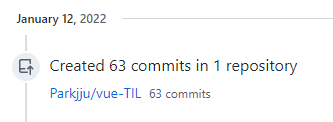
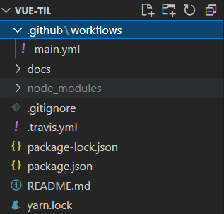

## Github Action을 활용하게 된 이유

저는 보시다시피 뷰프레스(vuepress) 사이트 생성기를 공부 내용을 정리해오고 있습니다. 지킬(jekyll)을 활용하여 포스팅 할 때에는 너무 날것(?)의 느낌이라 빌드 과정부터 글을 실제로 업로드 할때까지 귀찮은 부분이 꽤 있었던 것 같은데 뷰프레스를 활용하게 되면서 각종 기능이 잘 갖춰진 라이브러리를 활용하는 느낌을 받았습니다.

그 동안 다양한 블로그를 참조하여 글 작성과 빌드 과정, 포스팅까지의 과정이 꽤 단순화 시킬 수 있었지만 (쉘 스크립트 `sh deploy.sh`, `sh start.sh` 등) 여전히 배포 과정에서 나름 1분정도 넘는 시간동안 복잡한 명령어 목록을 지켜봐야하는 문제점은 있었습니다.

사실 그냥 참으려면 참을 수 있는 정도의 귀찮음이었지만 깃헙 액션(Github Action)이라는 기능을 실제로 적용해볼 수 있을 것 같아 흥미가 생겨 블로그 글의 배포 과정을 자동화해보기로 했습니다.

## Github Action 적용

제가 이번에 깃헙 액션을 통해 자동화시킨 부분은 **깃헙 원격저장소 메인브랜치에 푸시 이벤트가 감지되었을 때 뷰프레스 빌드 및 배포를 자동적으로 처리하는 동작입니다.**

커밋 수를 날로 먹으려고 한 것이 아니라 깃헙 액션을 테스트 할 때 항상 커밋-푸시 후 빌드 오류를 직접 확인해야 했기 때문에 액션 등록 날만 수십개의 커밋을 날렸습니다..


우선 깃헙 액션을 등록하는 공식적인 방법을 먼저 소개드린 뒤에 오류 발생 케이스와 그에 따른 저의 해결방법들을 소개하도록 하겠습니다.

깃헙 액션 각 옵션에 대해 자세히 공부하기 위해서는 [Github Actions Docs를](https://docs.github.com/en/actions/learn-github-actions/understanding-github-actions#overview) 참조하여 기초 용어에 대해 읽어보시는 것을 추천합니다. (Actions라는 용어에 대해서 기본적으로 읽어보시길 추천)

## Github Action으로 자동 배포하기

[kyoungwhan01 - 기억보다 기록을](https://kyounghwan01.github.io/blog/Vue/vuepress/vuepress-github-actions/#workflows-%E1%84%91%E1%85%A1%E1%84%8B%E1%85%B5%E1%86%AF-%E1%84%89%E1%85%A2%E1%86%BC%E1%84%89%E1%85%A5%E1%86%BC)

위 글을 참조하여 깃헙 액션의 기본적인 사용법을 소개합니다.

### 1. workflows 생성

워크플로우(workflows)는 깃헙 액션이 진행될 때 어떠한 기능을 수행할 지 알려주는 파일입니다.

프로젝트 루트폴더에서 **.github** 폴더를 생성한 뒤 하위 폴더에 `workflows` 폴더를 생성합니다. `workflows` 폴더 하위에 `원하는이름.yml` 파일까지 생성해준 뒤 다음의 코드를 삽입합니다.



```yml
name: Build and Deploy
on: [push]
jobs:
    build-and-deploy:
        runs-on: ubuntu-latest
        steps:
            - name: Checkout
              uses: actions/checkout@master

            - name: vuepress-deploy
              uses: jenkey2011/vuepress-deploy@master
              env:
                  ACCESS_TOKEN: ${{ secrets.ACCESS_TOKEN }}
                  TARGET_BRANCH: gh-pages
                  BUILD_SCRIPT: yarn && yarn build
                  BUILD_DIR: docs/.vuepress/dist
```

:::details yml 문법 몇가지

[Github Actions 공식문서](https://docs.github.com/en/actions/learn-github-actions/workflow-syntax-for-github-actions)

1. `name` : 워크플로우의 이름입니다. 추후 깃헙 액션 등록 뒤에 표기될 이름이며 원하는 대로 명명해도 문제는 없습니다. [(실제로 사용된 name)](https://github.com/Parkjju/vue-TIL/actions/runs/1696565223), 커밋 메세지 옆에 표기됩니다.
2. `on` : **Required**. 워크플로우 생성에 필수적입니다. **워크플로우를 트리거하는 깃헙 이벤트입니다.** 깃헙 이벤트로는 add, commit, push 등 여러가지가 있지만 저는 레포에 푸시 이벤트가 발생했을 때 자동화를 진행하려 하므로 `push`로 작성합니다. 작성 타입은 Array로 전달하거나 이벤트가 하나일 경우 문자열로 전달해도 된다고 합니다. `on: push`와 같이 말이죠.
3. `jobs` : 워크플로우를 이루는 구성요소입니다. 각 `job`들은 `runs-on`이라는 옵션 아래 동작하게 되는데, 이 옵션은 `job`이 동작할 가상환경을 지정합니다. (위 코드에는 우분투라고 되어있네요.)
4. `jobs.id` : `job`의 식별자이며 각 `job`당 하나만 가질 수 있습니다. 공백은 `-`로 표기합니다. 참고로 `runs-on`옵션은 `jobs.id.runs-on`의 위계를 가집니다.
5. `jobs.id.steps` : `steps`는 `job`에서 일처리 순서를 나타냅니다. `steps`는 명령어를 실행하고 태스크를 셋업하며 레포지토리의 액션을 실행하는 등의 역할을 합니다.
6. `jobs.id.steps.name` : 깃헙에 각 스텝의 이름을 표기해줍니다. [(링크)](https://github.com/Parkjju/vue-TIL/runs/4813750042?check_suite_focus=true) 에 들어가보시면, 액션을 처리하는 일련의 과정들이 있는데 이때 `steps`의 `name`으로 지정한 `Checkout`,`vuepress-deploy`가 보이실겁니다.
7. `jobs.id.steps.uses` : 실행할 `action`을 선택합니다. `action`은 재사용 가능한 코드 유닛으로 정의되어 있습니다. 동일 레포지토리의 워크플로우에 정의되어 있거나 퍼블릭 레포지토리 또는 퍼블릭 도커이미지에 정의되어 있는 액션을 사용할 수 있습니다. 위의 예시 코드에서는 깃헙에서 사용되는 `checkout`이라는 액션을 사용하는데 커밋 해시넘버나 브랜치 명과 같은 정보를 함께 제공해야 합니다. `jenkey2011/vuepress-deploy`는 뷰프레스 자동화 배포를 제공하는 퍼블릭 레포지토리의 이름입니다.
8. `env` : `steps`에서 이용가능한 환경변수들을 담는 기능을 합니다. 뷰프레스 자동화 배포를 위해서는 [jenkey2011](https://github.com/jenkey2011/vuepress-deploy/) 레포를 참조하여 필요한 환경변수를 세팅해야합니다. `ACCESS_TOKEN`을 환경변수로 등록하는 방법은 이후 설명합니다.

:::

## 2. Github에 환경변수 세팅

[jenkey2011](https://github.com/jenkey2011/vuepress-deploy/) 레포지토리의 리드미 파일을 보면 환경변수로 등록해야할 워크플로우 변수들 목록이 작성되어 있습니다. 저는 뷰프레스 자동배포를 위해 해당 레포를 깃헙 액션 어플리케이션으로 이용하는 것이지, 깃헙 액션을 활용해 구현하는 모든 어플리케이션에 위 레포지토리를 이용하는 것은 아닙니다.

`BUILD_SCRIPT`, `BUILD_DIR`, `TARGET_BRANCH` 세 가지는 리드미 파일을 보고 워크플로우 환경변수로 등록하면 되며, 저희는 깃헙 레포지토리에 액세스 토큰을 등록하는 방법을 알아보겠습니다.

액세스토큰을 발급받기 위해서는 **본인의 계정 메뉴 - settings - Developer setting - Personal access tokens**로 들어가서 발급받으시면 됩니다. 발급 시 액세스 토큰을 활용할 스코프를 선택하게 되는데 워크플로우와 깃헙 액션을 통해 구현하고자 하는 어플리케이션 특성에 맞춰 선택해주시면 됩니다.

토큰을 발급받았으면 배포를 진행하실 레포지토리에 들어갑니다. 레포지토리 세팅에 `secrets`메뉴가 있고 **new repository secret**으로 시크릿을 생성해주시면 됩니다. **시크릿의 이름은** `ACCESS_TOKEN`으로 해주시고, `Value`에는 위의 코드대로 작성해둔 후 추가 세팅을 진행합니다.

자동화 배포 대상 블로그 레포지토리로 진입하여 `Settings`에 들어갑니다. 좌측 메뉴의 Secrets - Actions에 진입합니다. `New repository secret`을 클릭한 후 , 이름에 `ACCESS_TOKEN`, `VALUE`는 발급받은 액세스 토큰을 입력합니다.

이후 파일 수정 및 푸시를 할 경우 이벤트가 트리거 되어 `Github Actions`가 작동됩니다. 위의 코드는 뷰프레스 자동배포를 위한 액션이므로 뷰프레스 사이트 빌드 및 배포가 자동으로 이루어지고, 빌드 과정에서 오류가 발생할 경우 깃헙 계정에 등록된 이메일로 오류가 전달됩니다.

## 기타 이슈

뷰프레스 배포 자동화를 위해 기본적으로 진행하는 절차는 모두 알아보았습니다. 지금부터는 제가 배포 자동화를 시도하며 겪었던 자잘한 이슈나 실수들을 공유해드리려고 합니다.