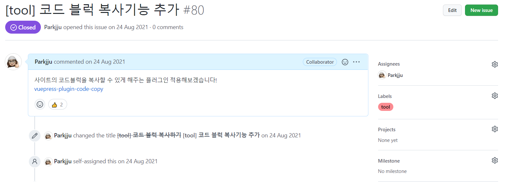

깃과 깃헙을 활용한 프로젝트 운영에 대해 기본적인 흐름을 정리합니다.

[FE 협업 환경/컨벤션에 대한 문서](https://yechoi.tistory.com/m/84) 를 참조하여 작성하였습니다.

## Issue 할당

1. 작업할 내용에 대해 **이슈를 생성한다.**
2. **Assignees**에 작업 진행자를 할당한다.
3. **Labels**에 작업할 내용의 태그를 표기한다.
