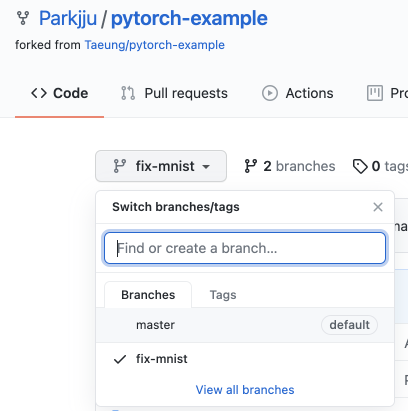
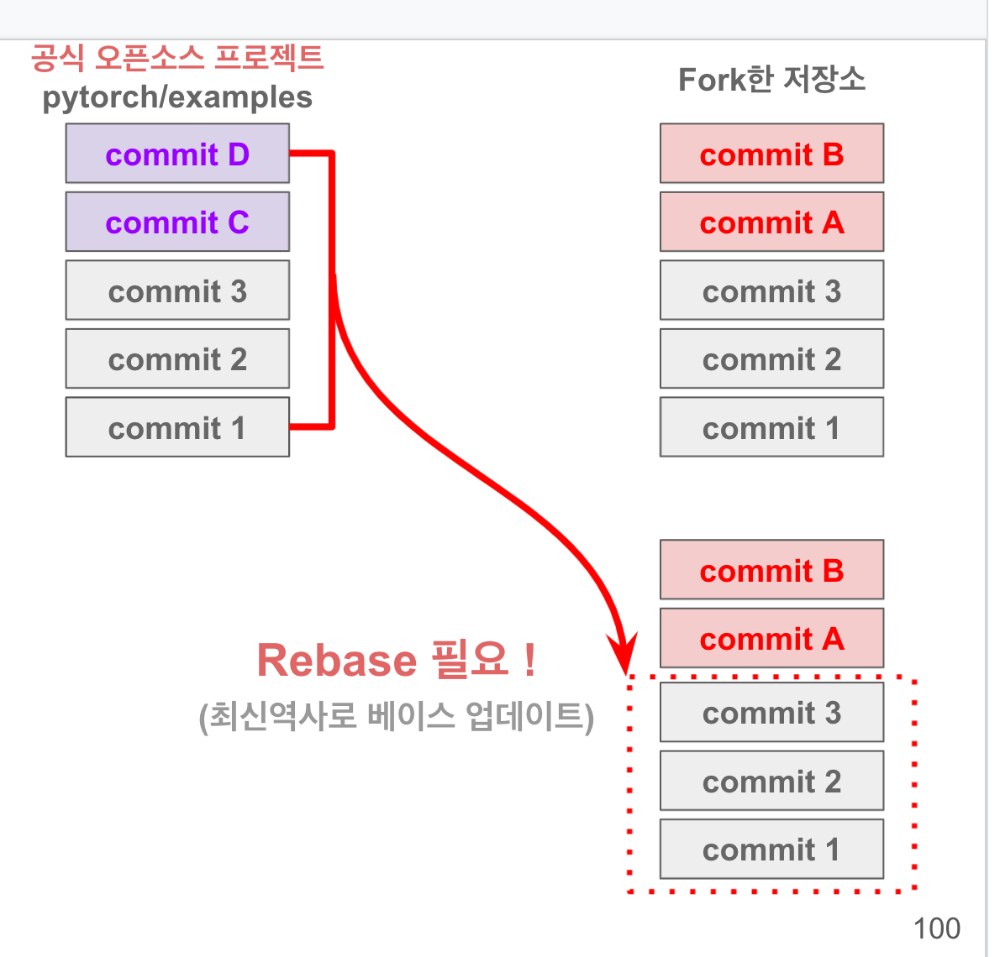
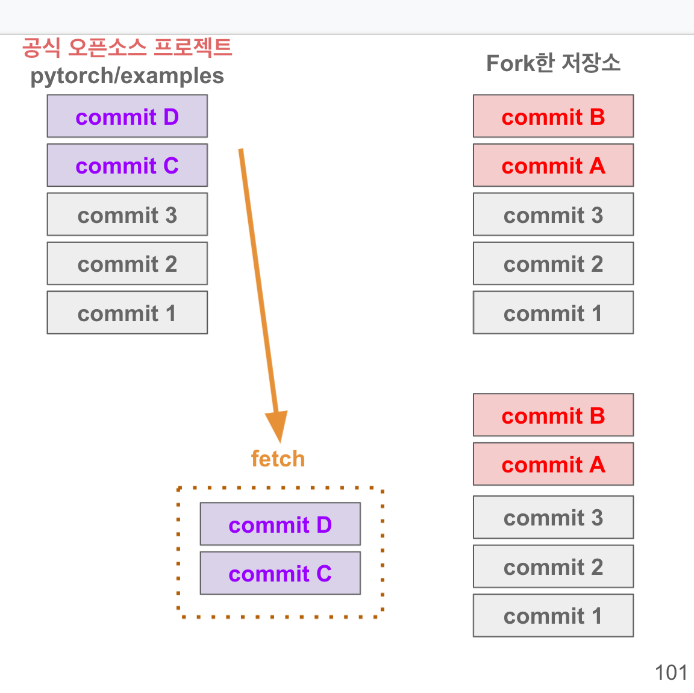
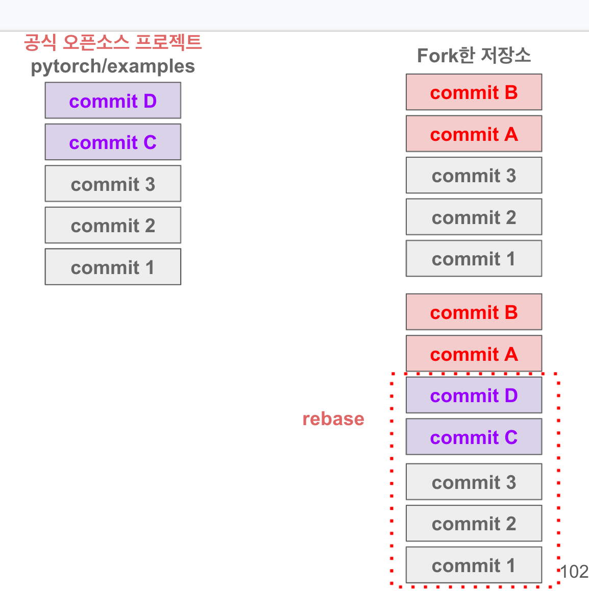
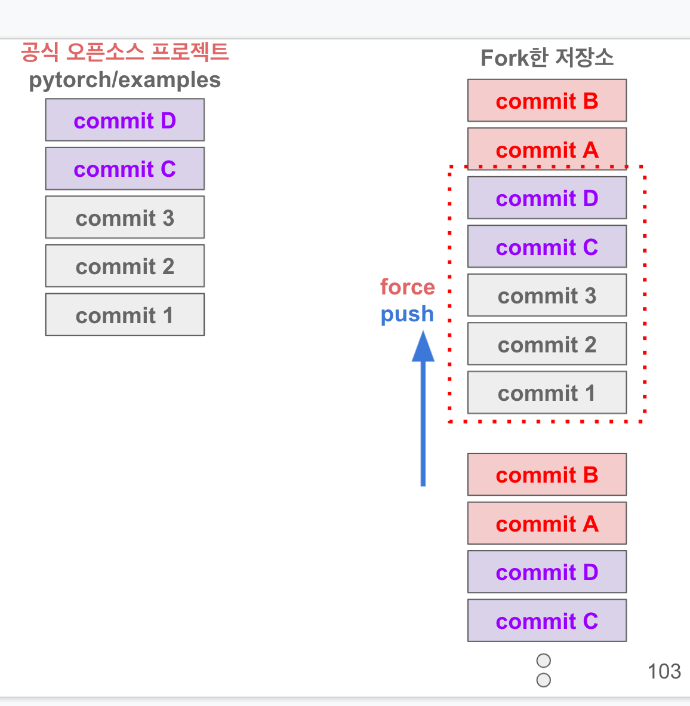
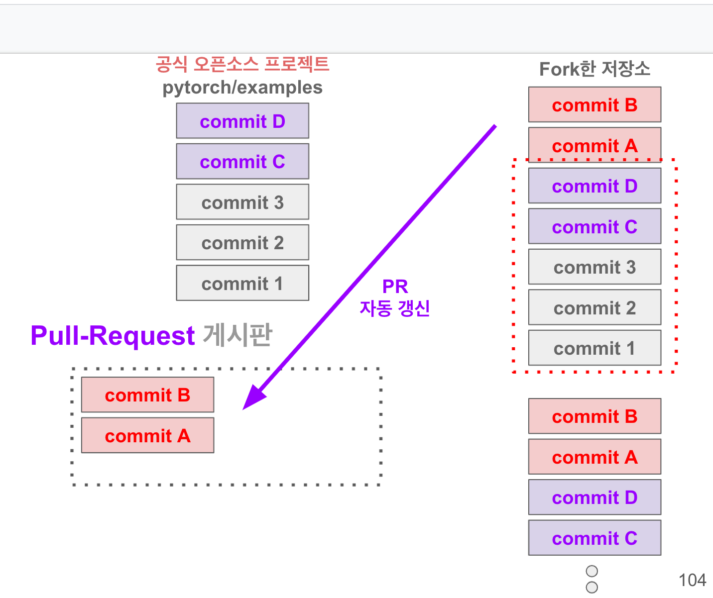

# Git 기초 교육

## 1. 개발자가 오픈소스를 읽는 방법

### 1.1 커밋 관찰

-   기존 프로젝트 클론 & fork 해놓은 상황
-   nl 명령 : line number명시

```shell
$git shortlog -sn | nl # 커밋 순위표시

$git shortlog -h | grep summary # shortlog의 s옵션 -> summary옵션에 대한 설명
$git shortlog -h | grep number # shortlog의 n옵션 -> number옵션에 대한 설명
```

```shell
$git shortlog -h | grep summary
    -s, --summary         커밋 설명을 생략하고, 커밋 수만 표시합니다
❯ git shortlog -h | grep number
    -n, --numbered        작성자별 커밋 수에 따라 정렬합니다
```

#### 1.1.1 전체 소스파일수정 파일 내역(commit) 개수 확인

```shell
$git log --oneline | wc -;
# wc -l 명령 -> 파일의 라인 수 측정
```

-   전체 소스파일 커밋 내역

```shell
e815dc9 jekyll 환경설정, css & js include폴더로 이동, post레이아웃 설정중
7086771 Add: jekyll build, sidebar arrow animation JS추가
6ca5601 Add : sidebar 토글 구현
# 내 블로그 수정 내역 중 일부 출력
```

-   특정 커밋의 해시값을 입력하여 해당 커밋만 확인할 수도 있음

```shell
$git show e815dc9
commit e815dc98668f0395d8f83486c80582b797d8bc7d
Author: Parkjju <rudwns3927@gmail.com>
Date:   Tue Jun 29 21:36:23 2021 +0900

    jekyll 환경설정, css & js include폴더로 이동, post레이아웃 설정중

diff --git a/_config.yml b/_config.yml
new file mode 100644
index 0000000..54c6f77
--- /dev/null
+++ b/_config.yml
@@ -0,0 +1,151 @@
```

#### 1.1.2 특정 커밋 중에 수정한 파일들 정보 확인하기

```shell
$git show e815dc9 | grep "diff --git"
diff --git a/_config.yml b/_config.yml
diff --git a/_drafts/first-draft.md b/_drafts/first-draft.md
diff --git a/CSS/main.css b/_includes/CSS/main.css
diff --git a/_includes/CSS/post.css b/_includes/CSS/post.css
diff --git a/CSS/reset.css b/_includes/CSS/reset.css
diff --git a/CSS/style.css b/_includes/CSS/style.css
diff --git a/_includes/CSS/variable.css b/_includes/CSS/variable.css
diff --git a/js/sidebar-click-event.js b/_includes/js/sidebar-click-event.js
diff --git a/_layouts/default.html b/_layouts/default.html
diff --git a/_layouts/post.html b/_layouts/post.html
diff --git a/_posts/2021-06-01-1.md b/_posts/2021-06-01-1.md
diff --git a/all.css b/all.css
diff --git a/all.js b/all.js
diff --git a/assets/CSS/main.css b/assets/CSS/main.css
diff --git a/assets/CSS/post.css b/assets/CSS/post.css
diff --git a/assets/CSS/reset.css b/assets/CSS/reset.css
diff --git a/assets/CSS/style.css b/assets/CSS/style.css
diff --git a/CSS/variable.css b/assets/CSS/variable.css
diff --git a/assets/js/sidebar-click-event.js b/assets/js/sidebar-click-event.js
diff --git a/index.html b/index.html

$git show e815dc9 | grep "diff --git" | wc -l
20
```

-   내 한 커밋에 저렇게 많은 파일들이 수정되었고, **커밋 시 한 커밋의 크기를 너무 크게 만들면 리뷰 및 discussion 하기에 힘들다**

#### 1.1.3 Merge commit

-   Merge commit은 따로 의미가 있지 않고, Merge가 진행되었음을 알리는 커밋이다.
-   사실상 의미가 없기때문에 오픈소스 프로젝트에서 커밋 내역을 순위정렬 할 때 해당 커밋은 제외하고 이해하자

```shell
$git log --oneline --no-merges

# 예제
root@goorm:/workspace/pytorch/examples/mnist(master)# git log --oneline --no-merges
08f6dd5 PR test
f1a28b1 PR test
8e1edd9 PR test
5f6d671 PR test
#....

```

#### 1.1.4 전체 소스파일 커밋내역을 자세히 보기

```shell
$git log -p
```

-   특정 소스파일 기준으로 (상대경로로 이동) 수정내역 리스트 확인
-   명령어 입력 전에 해당 소스파일로 디렉토리 경로를 이동해야함.

```shell
$git log --oneline head.html
025291d migrating All
fb2a2e7 post.html CSS - font, title size, line-height. 마크다운 migration 진행 및 jekyll previous, next기능 추가하기
e52b00b syntax color 추가 및 배포용 레포 분리
```

#### 1.1.5 특정 날짜 기준 커밋내역 리스트

```shell
$git log --oneline --after=2021-07-01 --before=2021-07-10
6715d7c migration 완료, 마크다운 문서 수정하기
025291d migrating All
fb2a2e7 post.html CSS - font, title size, line-height. 마크다운 migration 진행 및 jekyll previous, next기능 추가하기
2527ced reset.css 주석처리, code format, post 요소에 CSS추가하기
e52b00b syntax color 추가 및 배포용 레포 분리
95f5cca template 상속 정리 및 include완료, collapse id값 처리 필요
f66a98e Fix: sidebar font-size
bba2151 포스팅 페이지 메인 바 z index추가
```

-   각종 커밋 리스트 옵션들을 합쳐가며 실습 해보기 !!

```shell
$git log --oneline -p --after=2020-06-01 --before=2020-06-30 --no-merges
```

#### 1.1.6 옛날것부터 커밋내역 보기

```shell
# 최초커밋 확인 시 주로 사용
$git log --reverse
commit 6ca56018e493634ef92f674123e0033e09574d29
Author: Parkjju <rudwns3927@gmail.com>
Date:   Sun Jun 27 21:34:11 2021 +0900

    Add : sidebar 토글 구현
```

```shell
$git log --online --reverse _includes/ # _includes폴더의 --oneline옵션으로 최초커밋부터 나열 후 확인
e815dc9 jekyll 환경설정, css & js include폴더로 이동, post레이아웃 설정중
3ed0e8f Todo : 디렉토리 구조 구체화, 필요없는 파일 처리 및 import 정리, 페이지 넘겼을시 애니메이션 유지, 아티클 레이아웃 & 코드블록 등 각종 CSS 추가하기
bba2151 포스팅 페이지 메인 바 z index추가
```

### 1.2 git 설정

#### 1.2.1 초기설정

```shell
# 깃헙 계정 캐싱데이터 삭제 (공용컴퓨터나, 다른 계정과 설정 충돌 방지)
$git config --global --unset credential.helper
$git config --system --unset credential.helper

# 초기설정
$git config --global user.email "email"
$git config --global user.name "name"
```

#### 1.2.2 git 편집기 설정

-   nano편집기 설치

```shell
$git config --global core.editor nano
$sudo apt install -y nano
$git config --list
```

## 2. 개발작업에 참여해보기

### 2.1 브랜치

-   마스터 브랜치에서 직접 작업하는 것을 지양하자!!

-   branch 이름 -> 어떤 작업을 하고 있는 지 한눈에 알수있게 생성

### 2.2 브랜치 생성

-   작업할 소스파일 폴더로 이동한 뒤 `git checkout -b branchName`으로 브랜치 생성과 동시에 브랜치 전환을 진행

```shell
root@goorm:/workspace/pytorch# cd /workspace/pytorch/examples/
root@goorm:/workspace/pytorch/examples# git checkout -b fix-mnist
새로 만든 'fix-mnist' 브랜치로 전환합니다
```

### 2.3 브랜치 삭제

```shell
$git checkout master
$git branch -D fix-mnist
```

#### 2.3.1 편집기로 작업 진행하기

```bash
root@goorm:/workspace/pytorch/examples# nano mnist/main.py
root@goorm:/workspace/pytorch/examples# git diff
diff --git a/mnist/main.py b/mnist/main.py
index 7d7899d..1bee55c 100644
--- a/mnist/main.py
+++ b/mnist/main.py
@@ -77,7 +77,7 @@ def main():
     parser.add_argument('--test-batch-size', type=int, default=1000, metavar='N',
                         help='input batch size for testing (default: 1000)')
     parser.add_argument('--epochs', type=int, default=14, metavar='N',
-                        help='number of epochs to train (default: 10)')
+                        help='number of epochs to train (default: 14)')
     parser.add_argument('--lr', type=float, default=1.0, metavar='LR',
                         help='learning rate (default: 1.0)')
     parser.add_argument('--gamma', type=float, default=0.7, metavar='M',
```

1. `nano directory/file.txt` 편집기로 파일을 오픈한다.
2. `git diff`로 파일 수정내역을 확인한다.
3. 애드/커밋 진행하기

### 2.4 pull request

-   Merge되기 직전의 커밋상태라고 보면 됨.
-   깃헙 forked project 레포지토리로 이동
-   메인화면에서 브랜치를 전환하고, 컨트리뷰트 클릭으로 open pull request를 클릭.
-   직접 풀리퀘를 만들어도되고, 생성한 브랜치 체크아웃 상태에서 커밋푸시해도 됨.
    <figure>
    
    <figcaption> 브랜치 전환 </figcaption>
    </figure>

## 3. git 기본 명령어들

### 3.1 git stash & pop

-   내용에 대해 임시적으로 테스트 하고싶은 경우. (저장에 대한 자유도가 필요할때)

1. nano file.txt - 파일 수정 후 Modified상태로 전환
2. `git stash` - 커밋된것처럼 임시 저장됨.
3. `git stash pop` - Modified상태로 다시 되돌려놓음

### 3.2 git checkout -- file.txt

-   작업중이던 파일을 가장 최신 커밋 버전으로 바꾼다.

```shell
root@goorm:/workspace/pytorch/examples# git status
현재 브랜치 fix-mnist
커밋하도록 정하지 않은 변경 사항:
  (무엇을 커밋할지 바꾸려면 "git add <파일>..."을 사용하십시오)
  (작업 폴더의 변경 사항을 버리려면 "git checkout -- <파일>..."을 사용하십시오)

        수정함:        mnist/main.py

커밋할 변경 사항을 추가하지 않았습니다 ("git add" 및/또는 "git commit -a"를
사용하십시오)
# 변경되어있는 상태
root@goorm:/workspace/pytorch/examples# git checkout -- mnist/main.py # 파일의 버전을 최신 커밋으로 변경
root@goorm:/workspace/pytorch/examples# git status # 초기상태
현재 브랜치 fix-mnist
커밋할 사항 없음, 작업 폴더 깨끗함
```

```text
- 카톡 내용 발췌

1. stash를 사용하는 이유, 그리고 어떨 때 add를 사용해야 하나요?
오픈소스에서 개발하게 되면, 여러 개의 branch를 왔다 갔다 하면서 작업할 일이 많습니다.
add 를 하게 되면, 모든 현재 branch에 커밋을 할 수 있는 "잠재적 위험성"이 존재하는 staging area 에 변경 내역이 올라가게 됩니다.
특히 현업자들도 branch를 왔다갔다 하는 상황에서 add를 잘못했다가 다른 branch에 들어갈 내용이 "실수로" commit 과 함께 올라가는 경우가 있습니다.
이런 상황을 미연에 방지할 수 있는게 stash 명령어 입니다.
stash는 해당 명령어를 입력할 때 기준의 현재 브랜치에 작업내역이 저장되기 때문에 add 로 인한 잘못된 변경 내역이 반영될 수 있는 여지를 없애줍니다.
개인적으로 add는 변경 내역에 대해 작업자 스스로 소스 검증이 되었다고 판단할 때 사용하는 편입니다.
```

### 3.3 git reset & commit 삭제

-   add상태 파일 취소하기 (unstage)

```shell
$git reset
```

-   `git reset --hard HEAD~1`, HEAD~숫자를 통해 삭제할 커밋의 수를 결정할 수 있다.

```shell
root@goorm:/workspace/pytorch/examples# git reset --hard HEAD~1
HEAD의 현재 위치는 e28636e입니다 added missing non-linearity
root@goorm:/workspace/pytorch/examples# git log --oneline -1
e28636e (HEAD -> fix-mnist, origin/fix-mnist, master) added missing non-linearity
```

### 3.4 git license

-   `git commit -sm "sign"`
-   커밋의 sm옵션으로 라이센스 사용 지침에 서명을 한다는 의미.
-   최근 - CLA를 이용

```shell
root@goorm:/workspace/pytorch/examples# git show
commit 0b9eb0f82ec58e9fa10172e15ab443b9b6275bc1 (HEAD -> fix-mnist)
Author: Parkjju <rudwns3927@gmail.com>
Date:   Sat Jul 31 07:21:38 2021 +0000

    Add import request

    Signed-off-by: Parkjju <rudwns3927@gmail.com>
```

### 3.5 git commit 수정하기

-   커밋했지만, 해당 커밋을 수정하기 위해 추가 커밋을 진행하는 것은 비효율적.
-   최신 커밋을 수정하고싶으면, 커밋에 --amend옵션을 통해 커밋을 추가 생성하지 않고 수정을 진행한다.
-   커밋 메세지의 수정이 아니라, 내역을 수정함.

```shell
root@goorm:/workspace/pytorch/examples# git commit --amend
현재 브랜치 fix-mnist
변경 사항 없음
최초의 커밋을 바꾸려고 하지만, 그렇게 하면 커밋이 비어 있게 됩니다.
--allow-empty 옵션과 같이 이 명령을 반복할 수도 있고, "git reset HEAD"
명령으로 커밋을 완전히 제거할 수도 있습니다.

root@goorm:/workspace/pytorch/examples# git log --oneline -1
0b9eb0f (HEAD -> fix-mnist) Add import request
```

-   커밋 아이디가 변경된다.

## 2. Git 고급교육

### 2.1 Rebase

<figure>






</figure>

-   내가 커밋하기 이전 쌓여있던 베이스 커밋들이 A,B,C였는데, 작업 완료 후 커밋을 하려고 보니 다른 사람의 커밋이 먼저 Merge가 되어있는 상황
-   다른 사람의 커밋을 취소? 안됨. Rebase를 통해 최신화를 해야한다. (꼭 Rebase를 사용해야하는가? -> pull이나 fetch + merge도 상관없다.)
-   Rebase 명령을 사용하면 기존 커밋 아이디의 변경이 이루어질 수도 있다. 따라서 필수적인 경우는 아님.
-   fetch vs pull -> fetch + merge === pull

#### 2.1.1 Rebase 흐름

1. 공식 오픈소스 프로젝트의 커밋이 1,2,3
2. fork 프로젝트의 커밋이 1,2,3
3. 작업완료 및 커밋 후 머지를 하려 보니 오픈소스에 갑자기 1,2,3,A,B가 생성되어있음. 내가 추가할 커밋은 C,D
4. Fork프로젝트의 커밋은 현재 1,2,3,C,D이므로 A,B를 가져와서 붙여줘야함
5. 공식 오픈소스 프로젝트의 새 커밋 A,B를 fetch로 임시저장한다.
6. Fork프로젝트의 C,D커밋을 되감기 해준다.(rewind) - 잠시 떼어놓음.
7. fetch해놓은 A,B커밋을 fork프로젝트에 붙인다.
8. rewind 커밋 C,D를 A,B에 붙인다.
9. 최종 커밋순서 - 1,2,3,A,B,C,D 이고, 공식 오픈소스 프로젝트 순서 - 1,2,3,A,B
10. 확인 후 공식 오픈소스 프로젝트의 머지를 기다린다. 1,2,3,A,B,C,D

-   rebase취소 - `git rebase --abort`

#### 2.1.2 code

```shell
$git rebase -i --root
```

-   위의 명령어를 입력하면

```shell
pick 73e7acf Add README file
pick 864cf0f Add knapsack problem PDF
pick f9b87bb packing knapsack: Basic code solving this question
pick 91f2d24 packing knapsack: Change basic code
pick 3102e80 packing knapsack: Rename packing_knapsack to pack_knapsack
pick 1863ec4 packing knapsack: Input & Output
pick 4c744f0 packing knapsack: Add test script
pick b2218e5 packing knapsack: Add test script generator
```

-   편집기로 진입하여 어떤 커밋을 수정할지 고르게됨
-   README추가 커밋 이후의 커밋을 rewind를 진행하려면, `864cf0f`커밋의 pick을 **edit**으로 수정한다.

-   rebase 명령어 입력 후 log oneline 확인해보면 README 커밋 이후로 모두 빠져있는 것을 확인할 수 있다.

```shell
baggyeongjun-ui-MacBook-Pro:git-training parkgyeongjun$ git log --oneline
864cf0f (HEAD) Add knapsack problem PDF
73e7acf Add README file
```

-   git status 입력해보면, rebase진행중이라고 뜬다.

```shell
baggyeongjun-ui-MacBook-Pro:git-training parkgyeongjun$ git status
대화형 리베이스 진행 중. 갈 위치는 f5c3b43
최근 완료한 명령 (2개 명령 완료):
   pick 73e7acf Add README file
   edit 864cf0f Add knapsack problem PDF
다음에 할 명령 (10개 명령 남음):
   pick f9b87bb packing knapsack: Basic code solving this question
   pick 91f2d24 packing knapsack: Change basic code
  (보고 편집하려면 "git rebase --edit-todo"를 사용하십시오)
'master' 브랜치를 'f5c3b43' 위로 리베이스하는 중 커밋을 편집하는 중입니다.
  (현재 커밋을 수정하려면 "git commit --amend"을 사용하십시오)
  (변경 사항에 만족할 때 "git rebase --continue"를 사용하십시오)
```

-   `git rebase --continue`로 rewind했던 커밋들을 다시 최신으로 붙여준다

```bash
baggyeongjun-ui-MacBook-Pro:git-training parkgyeongjun$ git rebase --continue
Successfully rebased and updated refs/heads/master.

baggyeongjun-ui-MacBook-Pro:git-training parkgyeongjun$ git log --oneline
2504a40 (HEAD -> master, origin/master, origin/HEAD) Add v3 PDF
32b69ec New version git-training
18de302 test git-pull-request
f3be23d packing knapsack: Implement code to solve this question
b2218e5 packing knapsack: Add test script generator
4c744f0 packing knapsack: Add test script
1863ec4 packing knapsack: Input & Output
3102e80 packing knapsack: Rename packing_knapsack to pack_knapsack
91f2d24 packing knapsack: Change basic code
f9b87bb packing knapsack: Basic code solving this question
864cf0f Add knapsack problem PDF
73e7acf Add README file
```

#### 2.1.3 실습 1 - rebase기초

-   기존 커밋

```shell
2504a40 (HEAD -> master, origin/master, origin/HEAD) Add v3 PDF
32b69ec New version git-training
18de302 test git-pull-request
f3be23d packing knapsack: Implement code to solve this question
b2218e5 packing knapsack: Add test script generator
4c744f0 packing knapsack: Add test script
1863ec4 packing knapsack: Input & Output
3102e80 packing knapsack: Rename packing_knapsack to pack_knapsack
91f2d24 packing knapsack: Change basic code
f9b87bb packing knapsack: Basic code solving this question
864cf0f Add knapsack problem PDF
73e7acf Add README file
```

-   `864cf0f` 커밋 이후로 임의 커밋 생성 후 끼워넣기
-   rebase로 `f9b87bb`커밋부터 rewind (pick -> edit수정작업)
-   끼워넣고 `git rebase --continue`

#### 2.1.4 실습 2 - commit 합치기

1. 합칠 커밋 이후의 커밋들을 rewind해놓기.
2. `git reset --soft HEAD~1`로 커밋 취소
    - a. --soft옵션은 파일 변경내역은 그대로 두고 커밋만 취소한다.
    - b. --hard옵션은 파일 변경내역까지 모두 취소한다.
3. `git commit --amend` 취소한 커밋 이전의 커밋으로 합친다. (커밋 메세지의 변경과 함께 파일 변경내역을 합친다.)
4. `git rebase --continue`로 rewind했던 커밋들 합쳐준다.

```shell
# 1. rewind
f9b87bb packing knapsack: Basic code solving this question
baggyeongjun-ui-MacBook-Pro:git-training parkgyeongjun$ git rebase -i --root
492b204...  test: hello_2 + hello_3 위치에서 멈췄습니다
You can amend the commit now, with

  git commit --amend

Once you are satisfied with your changes, run

  git rebase --continue

# 2. rewind 확인
baggyeongjun-ui-MacBook-Pro:git-training parkgyeongjun$ git log --oneline
492b204 (HEAD) test: hello_2 + hello_3
d427f05 test: add hello_1.c
f9b87bb packing knapsack: Basic code solving this question
864cf0f Add knapsack problem PDF
73e7acf Add README file

# 3. soft 커밋 삭제 후 확인
baggyeongjun-ui-MacBook-Pro:git-training parkgyeongjun$ git reset --soft HEAD~1
baggyeongjun-ui-MacBook-Pro:git-training parkgyeongjun$ git status
대화형 리베이스 진행 중. 갈 위치는 07dce53
최근 완료한 명령 (5개 명령 완료):
   pick d427f05 test: add hello_1.c
   edit 492b204 test: hello_2 + hello_3
  (자세한 정보는 .git/rebase-merge/done 파일 참고)
다음에 할 명령 (9개 명령 남음):
   pick 2f80a56 packing knapsack: Change basic code
   pick 8a0fcd0 packing knapsack: Rename packing_knapsack to pack_knapsack
  (보고 편집하려면 "git rebase --edit-todo"를 사용하십시오)
'master' 브랜치를 '07dce53' 위로 리베이스하는 중 커밋을 편집하는 중입니다.
  (현재 커밋을 수정하려면 "git commit --amend"을 사용하십시오)
  (변경 사항에 만족할 때 "git rebase --continue"를 사용하십시오)

커밋할 변경 사항:
  (use "git restore --staged <file>..." to unstage)
        새 파일:       hello_2.c
        새 파일:       hello_3.c

# 4. commit amend 후 rebase continue
baggyeongjun-ui-MacBook-Pro:git-training parkgyeongjun$ git commit --amend
[HEAD 분리됨 92f712e] test: add hello_1.c + hello_2.c + hello_3.c
 Date: Sun Aug 1 13:45:08 2021 +0900
 3 files changed, 0 insertions(+), 0 deletions(-)
 create mode 100644 hello_1.c
 create mode 100644 hello_2.c
 create mode 100644 hello_3.c
baggyeongjun-ui-MacBook-Pro:git-training parkgyeongjun$ git log --oneline
92f712e (HEAD) test: add hello_1.c + hello_2.c + hello_3.c
f9b87bb packing knapsack: Basic code solving this question
864cf0f Add knapsack problem PDF
73e7acf Add README file
baggyeongjun-ui-MacBook-Pro:git-training parkgyeongjun$ git rebase --continue
Successfully rebased and updated refs/heads/master.
baggyeongjun-ui-MacBook-Pro:git-training parkgyeongjun$ git log --oneline
96d19a3 (HEAD -> master) Add v3 PDF
b75a4f0 New version git-training
9135f54 test git-pull-request
059c9ba packing knapsack: Implement code to solve this question
9c1fabd packing knapsack: Add test script generator
3a11865 packing knapsack: Add test script
d87de99 packing knapsack: Input & Output
17faa67 packing knapsack: Rename packing_knapsack to pack_knapsack
cdfad93 packing knapsack: Change basic code
92f712e test: add hello_1.c + hello_2.c + hello_3.c
f9b87bb packing knapsack: Basic code solving this question
864cf0f Add knapsack problem PDF
```
