## 회고

2023년을 돌아보며 회고를 작성해본다.

## 창업팀

2022년 7월에 감사하게도 지인을 통해 서울대학교 영양생리약리 연구실에서 창업을 준비하시는 교수님 팀에 웹 프론트엔드 개발자로 합류하게 되었다. 합류 이후에 알게 된 사실이지만 디자인은 물론 기획도 상당히 부실한 상태였어서 디자인과 기획부터 디벨롭하느라 약 두달 정도는 많이 바빴다.

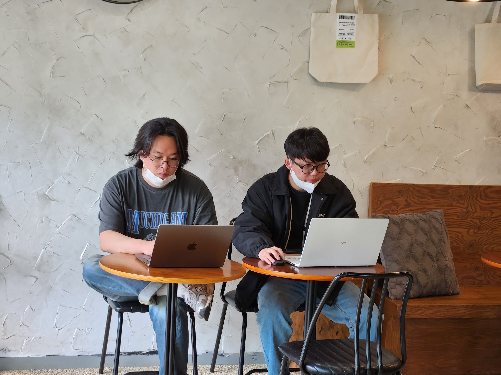

(위 사진이 너무 돼지같이 나와서,, 지금은 저때 기준으로 10키로 정도 감량한 상태)

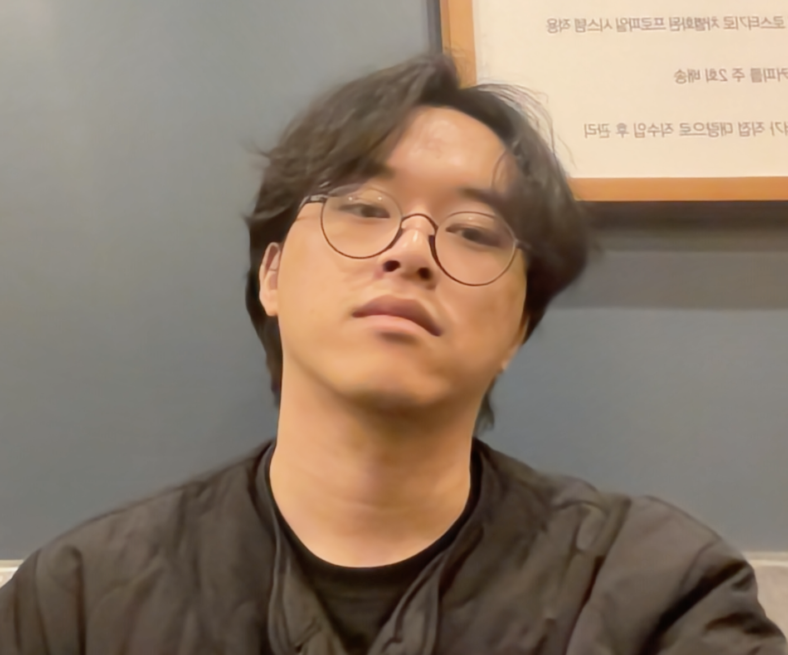

2022년 10월 19일부터 해서 2박 3일 일정으로 교수님께서 준비하시는 창업 아이템 관련하여 발표하실 학회에 함께 참석했었다. 대학원생이 된 느낌이었어서 색다르고 좋았는데, 21일 기점으로 최종 배포를 목표로 했어서 마무리 작업을 진행하느라 마지막 날은 잠을 한숨도 못잤다.

말 그대로 한숨도 못잤다.. 마지막날 학회일정 마치고 저녁 회식이 끝난 8시 즈음부터 다음날 오전 7시까지 개발했었다. 드래그 앤 드롭 컴포넌트 개발 과정에서 로직이 완전 꼬여서 고생했던 기억이 있다.

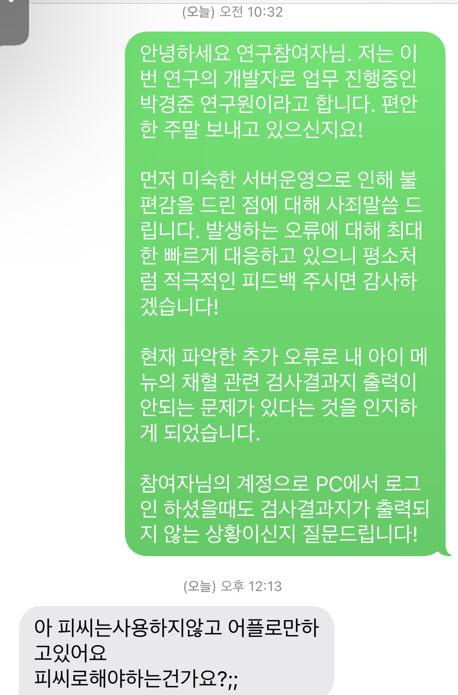
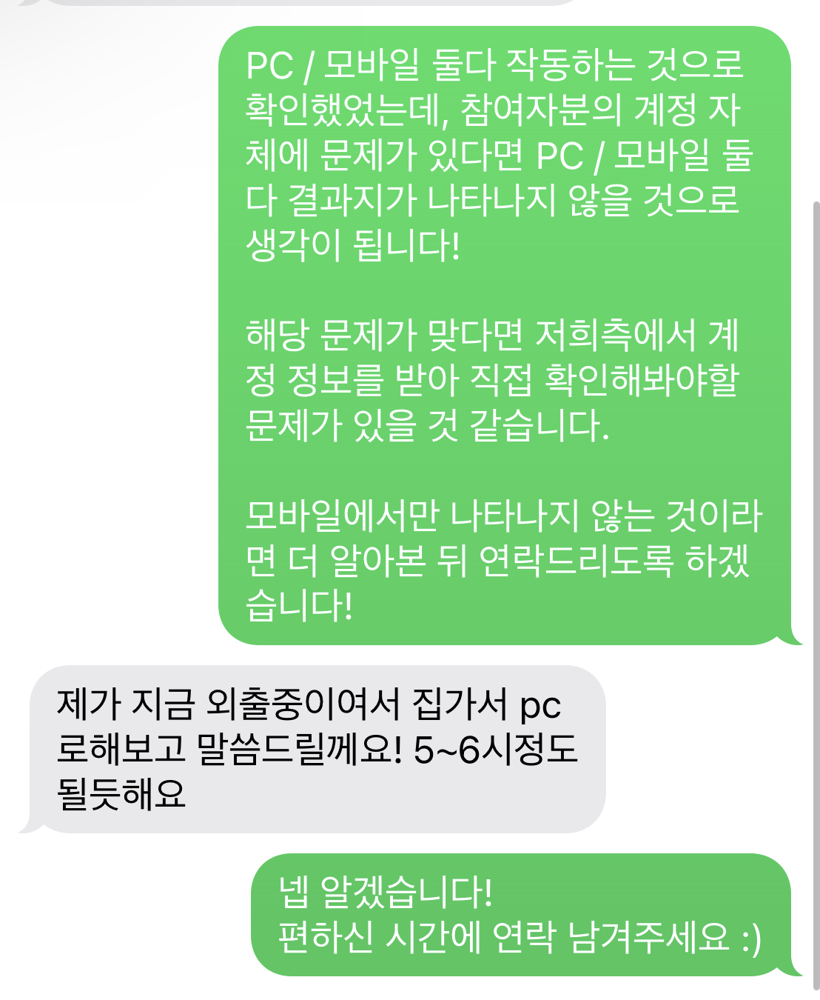

배포부터 완료하고 부랴부랴 제주공항에서 김포로 넘어왔는데 아니나 다를까 심각한 버그가 터져서 공항 바닥에서 급하게 버그픽스 후 배포를 진행했었다.

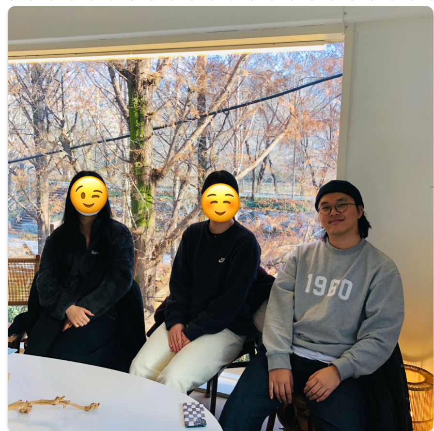

서울대라는 네임밸류에 걸맞는 교수님 인맥들과 종종 식사자리를 갖게 되었는데, 정말 훌륭하신 분들이 많았다. 의료기기 스타트업에서 꽤나 성공하신 대표님과 식사자리를 가지기도 했다. 주변 동료나 대표가 어느 정도의 그릇이냐에 따라 나에게 떨어지는 콩고물의 맛도 꽤 괜찮아질 수 있다는걸 많이 느꼈었다. 만나뵙는 것 자체가 어려운 분들을 매주마다 거의 만났으니 ..

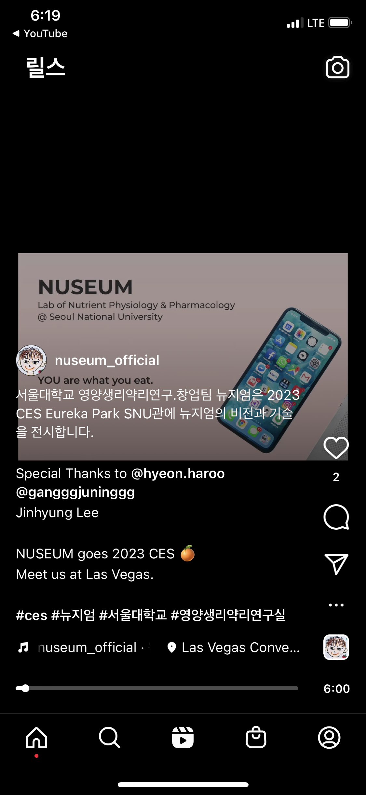

12월 말에 팀 송년회를 마치고 교수님은 CES2023 행사 참여를 위해 미국으로 넘어가셨다. 이때 교수님과 시차가 12시간 가깝게 차이나는 상황에 같이 업무를 진행하느라 쉽지 않았다. CES 참석때 홍보영상을 제작해야 해서 영상편집도 맡았었다. 😭

이쯤 되어 퇴사를 거의 확실하게 결심했던 것 같다. 학교 졸업도 문제였고 팀 인원 부족으로 개발 외적인 부분에 기여가 시작되어 개발자로서 성장하는 데에 한계를 크게 느꼈었다.

위에 잠깐 언급했듯 내 그릇에 맞지 않게 너무 대단한 사람들 앞에서 내가 손수 만든 결과물로 뭔가 증명해야만 했던 것도 크게 부담이었다. 22년 말부터 23년 초 3월까지는 정말 심각한 스트레스였다. 이유없이 심장이 뛰고 긴장되는 공황증상이 아마 이때쯤부터 시작되었던 것 같다.

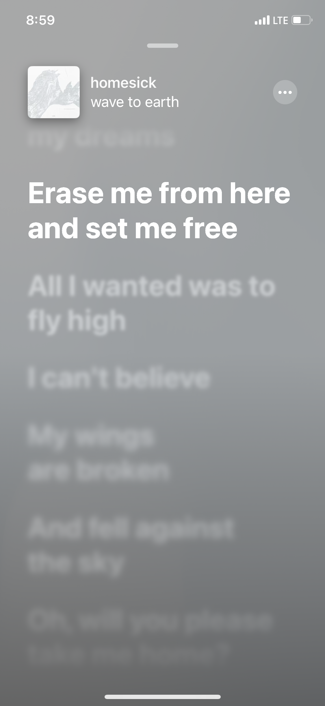

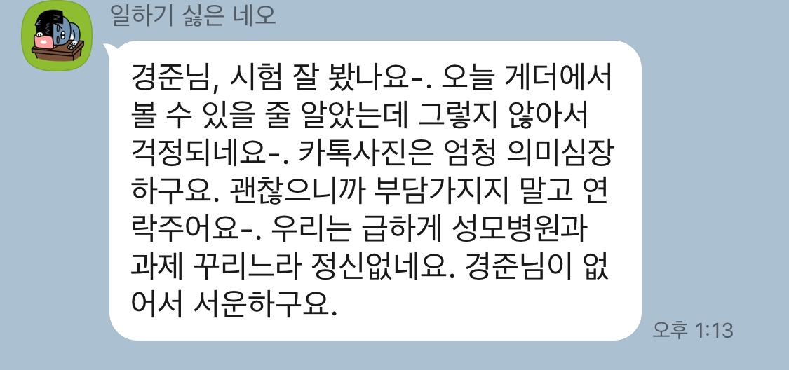

이맘때쯤 내가 정말 좋아하는 웨이브 투 어스라는 밴드가 정규앨범을 내서 캡처 후에 카톡 배경사진으로 올려두었는데, 공교롭게도 당시 퇴사하고 싶었던 내 심정을 대변하고 있어서 웃겼다 🫠 (교수님 보라는 듯한 저격성의 의도는 전혀 없었다,,)

## iOS 개발

서울대 창업팀 퇴사는 23년 5월쯤이었다. 당시 나름 타입스크립트를 제외하고 바닐라 JS로 리액트부터 상태관리 라이브러리인 Redux까지 빠르게 습득해서 배포까지 진행했는데, 왜인지 모르게 개발하면 할수록 프론트엔드 세계에 정이 떨어졌었다.

당시 내가 느끼기엔 프론트엔드가 진입장벽이 낮아서 사람들이 자꾸 은연중에 무시하는 뉘앙스가 있었다. 예컨대.. 지인들이 프론트엔드가 아닌 백엔드를 결정하게 된 이유들 들어보면 10의 8은 CSS가 **귀찮다는** 것이었다.

시간만 투자하면 개발 가능할 것이라는 그 생각이 너무 열받았다 🫠 그렇다고 내가 나서서 뭐라 하기도 좀 그랬던게 어느정도는 맞는 말이었던 것 같았다. 🥲

창업팀에서 받은 월급으로 22년 10월에 인프런의 앨런 iOS 온라인 부트캠프를 신청했다. 100만원 정도 되는 가격이었는데 하루정도 잠깐 고민은 있었지만 웹 프론트엔드를 앞으로 더 재밌게 할 자신이 없어서 부트캠프 신청에 주저함이 크게 없었던 것 같다.

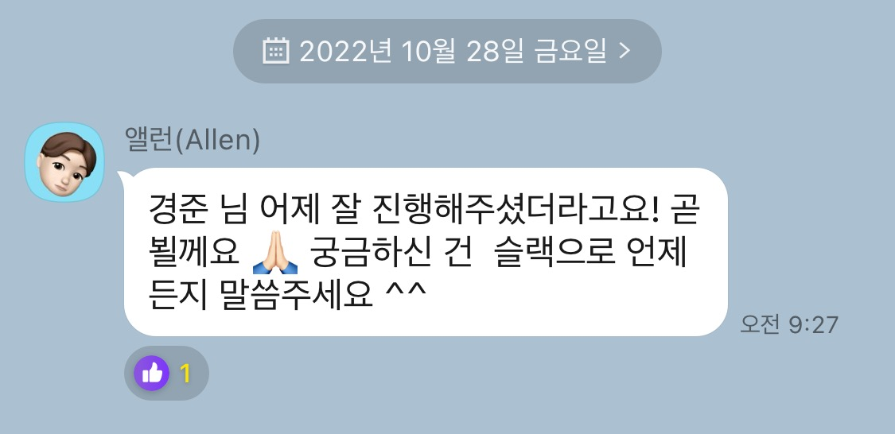

부트캠프 강의 완강은 아마 1월 전후로 해서 다 끝냈던 것 같고, 강의 완강 시점부터 목표를 큼직하게 설정했다.

1. 스토리보드 + UIKit으로 시계 앱 클론코딩 하기
2. 동아리 들어가서 iOS 프로젝트 진행하기 & 앱 배포 경험
3. DND에서 더 큼직한 iOS 프로젝트 진행하기

부트캠프 완료 시점에 바로 애플 개발자 계정 라이선스 129,000원짜리를 구입해서 앱 배포를 준비했다. 3월에 개강해서 감사하게도 동아리 UMC 4기 iOS 파트로 합류하게 되어 프로젝트도 진행하게 되었다.

## UMC

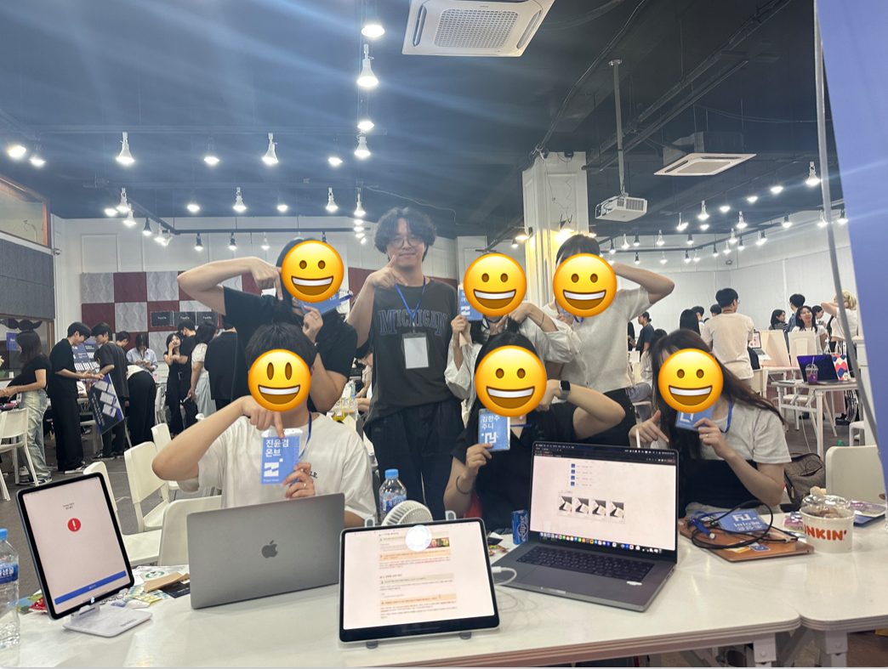

UMC는 학기중에 세션과 더불어 파트별로 스터디를 진행하고 1학기가 종강한 이후에 PM들에게 개발자가 컨택하여 프로젝트를 진행하는 방식이다.

온라인 부트캠프도 수료하기도 했던 터라 단순 흥미로 iOS에 입문한 다른 학생들보다는 그래도 실력을 갖추고 있었어서 좋은 프로젝트 아이템에 함께 합류했는데 문제는 PM분의 로직이 너무 어려웠다.

최근 AI 자동생성 이미지가 너무 많아져서 앱 내에서 촬영한 이미지에 대해 실제 촬영된 이미지라는 것을 보장해주는 것이 테마였는데 잠깐 설명하자면 ..

1. 서비스 가입과 동시에 발급되는 토큰값을 SHA256으로 암호화 -> 고정된 문자열 길이로 헥사 문자열 생성 (64)
2. 해당 문자열을 이진수로 바꾼다
3. 이진수로 바뀐 문자열 길이만큼 이미지의 각 픽셀을 순회하며 RGB의 R값을 이진수로 바꾼 뒤, 마지막 이진수 비트값을 문자열 이진수 비트값과 동기화하여 이미지를 오염시킨다.
4. 오염된 이미지는 서비스에서 보장하는 정품 이미지!

내 생각에 아이템 자체는 너무 멋진데 시대를 정말 앞서서 아무도 못알아먹은게 아쉬웠다 😇

위 프로젝트는 TrothCam이라는 이름으로 배포되었는데 현재는 서버를 닫은 상태로 정상적인 동작은 하고 있지 않다. [앱스토어 링크](https://apps.apple.com/kr/app/trothcam/id6458392903)

## DND

DND에서 진행한 마일스톤 프로젝트는 현재 배포중이다. [앱스토어 링크](https://apps.apple.com/kr/app/milestone/id6465692785)

UMC 활동은 8월에 마무리 되었는데 당시 더 큼직한 프로젝트를 진행하고 싶어서 DND의 iOS 파트로도 동시에 지원했었다. 같이 활동했던 은수님도 처음엔 프로젝트 완수를 목표로 해서 MVC + UIKit으로만 개발 계획을 잡았었는데, 운영진분의 권유로 MVVM + RxSwift로 결정했었다.

iOS 학습을 본격적으로 시작한지 반년이 이제 막 지나는 시점이었어서 굉장히 무모했다고 볼 수도 있겠지만, 운영진분의 레퍼런스 프로젝트 제공과 더불어 2달의 짧은 프로젝트 완수 기간이 겹치다 보니 어떻게든 해낼 수 밖에 없었다.

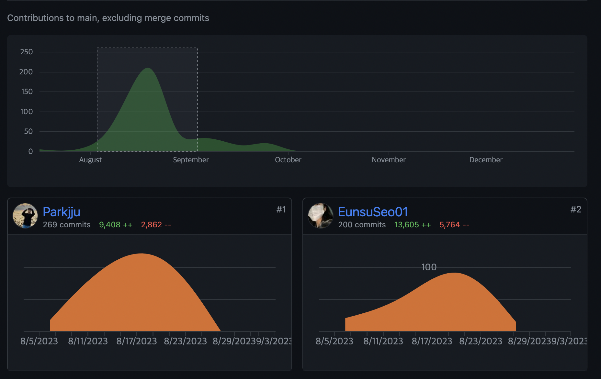

Kxcoding의 16시간 분량인 RxSwift 강의 수강을 2주 안으로 컷하고, 프로젝트에 바로 착수해야 했다. 진짜 한달 안팎으로 270개 커밋 날리면서, PR리뷰도 서로 해주면서 미친듯이 개발했다.

