한국외대가 SW 중심대학으로 선정되며 기획된 Hufs Missing Semester라는 프로그램의 발표를 이번에 맡게 되었습니다. MacOS 터미널 사용법과 개발환경 세팅, 비주얼 스튜디오 코드의 유용한 익스텐션 소개 등 기초적인 부분에 대해 발표를 진행하게 됩니다. 발표 준비 과정에서 필요한 지식들을 정리하고 추후 한 시간 가량의 발표를 마무리 지은 뒤 후기 내용은 새롭게 추가하도록 하겠습니다 :)

## Reference

1. [MAC 개발환경 세팅 velog](https://velog.io/@haje/macOS-%EA%B0%9C%EB%B0%9C%ED%99%98%EA%B2%BD-%EA%B5%AC%EC%84%B1%ED%95%98%EA%B8%B0)

## 시스템 설정

1. 파인더 설정
   파인더 최초 실행 시 버벅임을 줄이기 위해 루트 폴더 설정을 자신의 이름으로 된 유저 폴더로 지정합니다.
   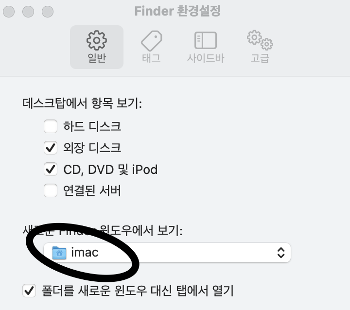

2. 원화 대신 백틱 입력하기
   [ss64 페이지 참조](https://ss64.com/osx/syntax-keybindings.html)

> If they are not already in place - just create the file & directory.

`~/Library/KeyBindings/DefaultKeyBinding.dict` 위치에 해당 파일을 생성합니다. 만약 라이브러리 폴더에 `KeyBindings` 폴더가 없거나 파일이 존재하지 않으면 새로 생성하면 됩니다.

:::tip
맥은 우클릭으로 빈 파일 생성하는 기능이 없기 때문에 텍스트 편집기를 통해 빈 파일 생성 후 확장자를 변경하던 터미널을 통해 생성하던 해야합니다.
:::

파일 생성 뒤 해당 파일에 다음 코드를 삽입합니다.

```text
{
    "₩" = ("insertText:", "`");
}
```

저장 후 재부팅하면 한글 상태에서도 백틱이 입력됩니다.

:::tip
모든 과정을 자동화 해둔 쉘 스크립트가 있습니다. [링크](https://gist.github.com/redism/43bc51cab62269fa97a220a7bb5e1103)

```sh
curl -sSL https://gist.githubusercontent.com/redism/43bc51cab62269fa97a220a7bb5e1103/raw/0d55b37b60e0e0bd3d0d7f53995de0a722f9820c/kr_won_to_backquote.sh | sh
```

다음 코드를 실행하면 자동으로 모든 과정이 진행되고 재부팅 시 한글 상태에서도 백틱 입력이 됩니다.

:::

## Homebrew 설치

홈브루(Homebrew)는 맥 OS의 패키지 매니저입니다. 윈도우에서 깃, 파이썬, mySQL등 여러 프로그래밍 언어나 어플리케이션을 설치할 때 수동으로 설치하는 경우가 대부분이지만 맥에서 홈브루 패키지 매니저를 사용하면 터미널 상에서 편리하게 설치할 수가 있게 됩니다. 오픈소스에 대한 접근까지도 쉽게 이루어집니다.

홈브루 설치 명령어는 다음과 같습니다.

```sh
/bin/bash -c "$(curl -fsSL https://raw.githubusercontent.com/Homebrew/install/master/install.sh)"
```

:::tip 패키지 매니저란?

패키지 매니저는 컴퓨터 OS를 위해 일정한 방식으로 컴퓨터 프로그램의 설치, 업그레이드, 구성, 제거 과정을 자동화하는 소프트웨어 도구들의 모임입니다. 소프트웨어에 대한 수동 설치 및 수동 업데이트 필요성을 근절하기 위해 설계되었습니다.

:::

일반적으로 저희가 맥으로 어플리케이션을 다운로드 받을 때 겪게되는 과정들을 (웹사이트로 가서 `dmg`파일을 받고 어플리케이션 위치를 앱으로 직접 이동시켜주는 등) 자동화시켜준다고 생각하시면 됩니다.

이후 여러 소프트웨어 설치 시 홈브루 매니저를 이용하기 위해서는 `brew` 키워드를 붙여 사용하면 됩니다.

## git 설치

버전관리 시스템인 git을 설치합니다.

```sh
brew install git git-lfs

git config --global user.name "Your name"
git config --global user.email "you@your.com"
```

`git-lfs`는 깃헙에서 다루지 못하는 대용량 파일을 다룰 수 있게 해주는 오픈소스 소프트웨어입니다.
사용법은 [다음의 링크](https://wellbell.tistory.com/247)를 참조해주세요.

## Cask 설치

cask는 홈브루 확장입니다. 비주얼 스튜디오 코드 익스텐션과 비슷한 개념이라고 생각하시면 될 것 같습니다. 기존 홈브루에서는 없는 기능인 Mac전용 GUI 프로그램 설치를 지원합니다.

cask 설치 명령어는 다음과 같습니다.

```sh
brew install cask
```

cask를 설치한 뒤 [cask에서 설치를 지원하는 프로그램 목록](https://formulae.brew.sh/cask/)을 보고 프로그램을 설치해주시면 됩니다. cask를 활용한 프로그램 설치 명령어는 다음과 같습니다.

```sh
brew install --cask 설치할 프로그램명
```

실제로 cask를 통해 `firefox` 앱을 설치해보았습니다.
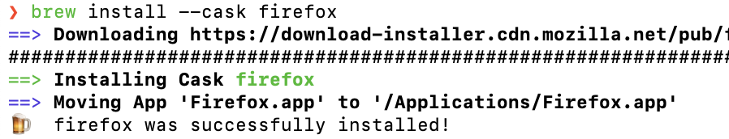
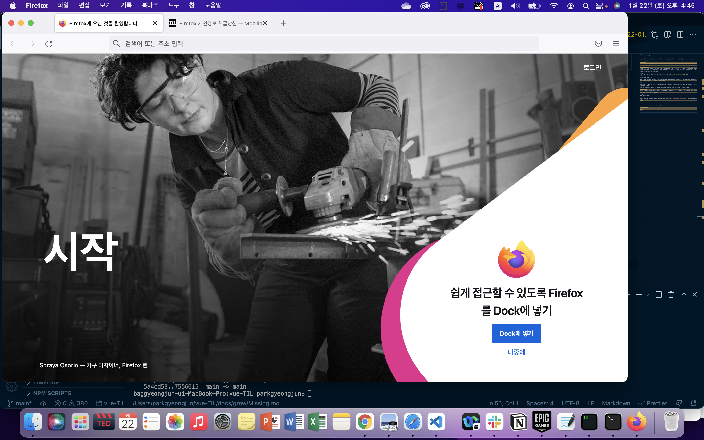

정상적으로 구동되는 모습을 볼 수 있습니다.

## ITerm2 설치

우아한 개발환경 구축을 위해 필수적이라고 할 수 있는 ITerm2를 설치합니다.

```sh
brew install --cask iterm2
```

ITerm2의 인기있는 테마로는 [snazzy](https://github.com/sindresorhus/iterm2-snazzy/)와 [Smyck-color-Scheme](https://github.com/hukl/Smyck-Color-Scheme/)이 있습니다. 저는 `snazzy` 테마를 적용해보겠습니다. 테마 적용 방법은 다음과 같습니다.

1. 깃헙 레포지토리로 이동하여 클론하거나, 파일을 직접 다운받는다.
2. 다운로드 받은 폴더 내에 `.itemcolors` 확장자 파일을 실행합니다.
3. ITerm2가 자동으로 테마를 인식하여 임포트를 진행합니다.

<figure>

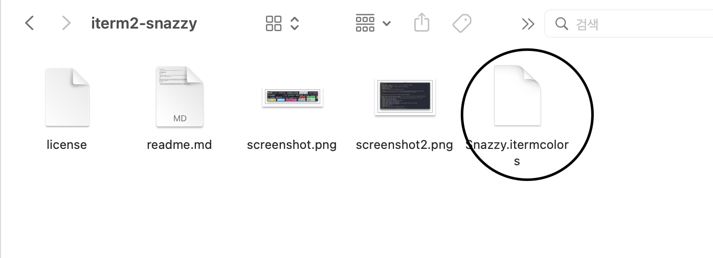

<figcaption>itemcolor 확장자의 파일을 클릭하여 실행합니다.</figcaption>

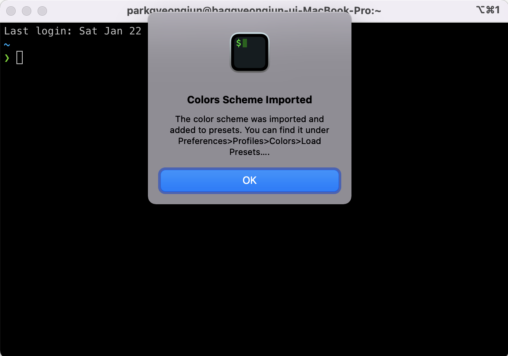

<figcaption>ITerm2에서 자동 인식하여 컬러 프리셋을 자동 임포트합니다.</figcaption>

</figure>

임포트한 컬러 프리셋을 불러옵니다.

1. ITerm2 실행
2. Command + , (Comma) -> 설정메뉴 (ITerm2 - Preference)
3. Profiles 탭 - colors - 우측 하단의 Color Preset 드롭다운 메뉴에서 임포트된 Snazzy 체크

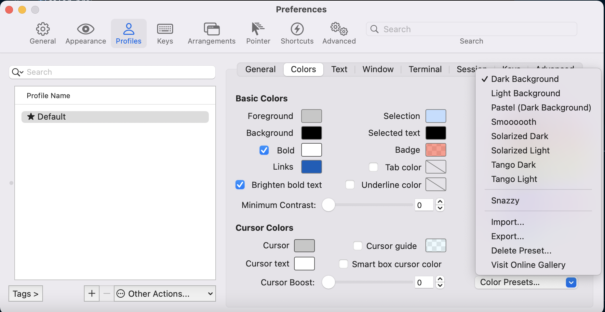

## oh-my-zsh 설치

oh-my-zsh 설치에 앞서서 zsh 설치를 진행합니다.

맥은 기본 터미널 세팅이 `bash`, 배시 쉘로 설정되어 있습니다. 기본 설정된 쉘 스크립트가 무엇인지 확인하기 위해서는 `echo $0` 명령어를 입력하면 됩니다.

```sh
bash-3.2$ echo $0
bash
```

배시 쉘을 `zsh`로 변경하기 위해서는 `zsh` 명령어만 입력하면 됩니다.

```sh
bash-3.2$ zsh
❯ echo $0
zsh
```

zsh 설치가 되어 있지 않았다면 `No such file or directory` 경고가 나타납니다. 홈브루를 통해 설치할 수 있습니다.

```sh
❯ brew install zsh
Running `brew update --preinstall`...
==> Auto-updated Homebrew!
Updated 1 tap (homebrew/core).
==> Updated Formulae
Updated 3 formulae.

Warning: zsh 5.8_1 is already installed and up-to-date.
To reinstall 5.8_1, run:
  brew reinstall zsh
```

이미 설치가 되어 있었기 때문에 `already installed..`경고가 나타납니다.

:::details zsh vs bash

zsh와 bash에는 어떤 차이가 있는 지 알아봅니다.

1. `cd` + Tab 키 입력 시 디렉토리 표기가 숨김 폴더를 포함하는 지 여부에서 차이가 존재합니다.

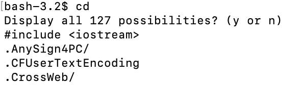
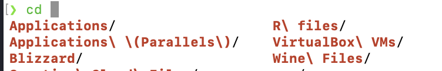

배시 쉘은 숨김 폴더 표기를 선택할 수 있는 반면 zsh은 일반 폴더를 표기하는 것으로 끝납니다.

2. 절대경로를 통해 홈 디렉토리로 이동하는 방법에 차이가 존재합니다.
   배시 쉘은 직접 입력하여 이동해야 하는 반면, zsh는 홈 디렉토리 경로가 `/home/ubuntu`라고 가정했을 때 `cd /h/u`를 입력한 뒤 탭 키를 입력하면 절대경로를 자동완성 해줍니다.
   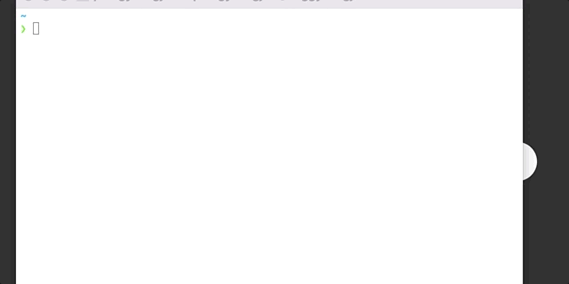

3. 디렉토리 이동과 디렉토리 위치 변경이 zsh에서는 더 편리합니다.

2번에서 소개드렸던 자동완성 기능이 홈 디렉토리 뿐만 아니라 전체 디렉토리에 적용됩니다. 다만 디렉토리 첫 글자와 중복되는 디렉토리들이 몇 가지 존재하게 될텐데, 이러한 경우 탭 키를 여러번 눌러서 다른 디렉토리를 선택할 수 있습니다.
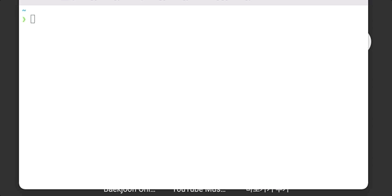

zsh상에서 디렉토리 위치 변경이 편리한 점은 현재 내가 속한 디렉토리의 위치와 동등한 위치의 디렉토리로의 위치변경이 쉽습니다. 잠시 디렉토리 구조를 보면,

```text
Users - parkgyeongjun - vue-TIL
                     |- gitWork
```

`parkgyeongjun` 디렉토리 하위에는 `vue-TIL`, `gitWork` 디렉토리가 존재합니다. `cd /u/p/g` 자동완성 기능을 통해 `gitWork` 디렉토리로 이동한 뒤 배시 상에서 `vue-TIL`로 이동하기 위해서는 `cd ..`, `cd vue-TIL` 명령어를 입력해야하지만 zsh에서는 `cd (현재 디렉토리명) (이동할 디렉토리명)`을 입력하면 됩니다.

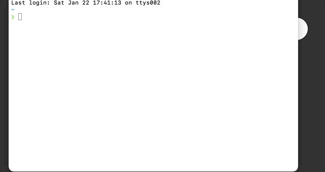

:::

기본적으로 zsh이 더 편리한 기능을 더 많이 갖고 있습니다. 이제 설치하게 될 **oh-my-zsh**은 바로 zsh 환경설정을 다루는 프레임워크이며 다양한 테마와 플러그인들을 가지고 있습니다.

oh-my-zsh 설치 명령어는 다음과 같습니다.

```sh
# zsh --version을 통해 zsh 설치 여부를 먼저 확인한 뒤 설치를 진행합니다.
# git도 설치되어 있어야 합니다.
sh -c "$(curl -fsSL https://raw.githubusercontent.com/ohmyzsh/ohmyzsh/master/tools/install.sh)"
```
