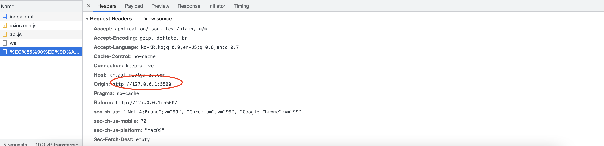

## Jun.gg

우연한 기회로 자바스크립트 강의를 촬영하게 되어 강의 말미에 완성해볼 최종 프로젝트 주제를 생각해보던 가운데 OP.GG 롤 전적검색 사이트를 클론해보면.. 재밌을 것 같아 시작하게 됩니다. 간단한 프로젝트 진행 현황을 공유하고 발생했던 이슈들에 대해 정리합니다. 

## 프로젝트 세팅

백엔드를 통해 DB관리는 하지 않지만, 이후 서술할 CORS이슈로 인해 `node.js` 서버 구축을 어느정도 해야했습니다.

`babel`관련 패키지, `express`서버와 `morgan`을 통해 미들웨어를 관리합니다.

```json
{
  "name": "Jun.gg",
  "version": "1.0.0",
  "main": "index.js",
  "repository": "https://github.com/Parkjju/Jun.gg.git",
  "author": "Parkjju <rudwns3927@gmail.com>",
  "license": "MIT",
  "scripts": {
    "dev": "nodemon --exec babel-node src/server.js"
  },
  "devDependencies": {
    "@babel/core": "^7.17.8",
    "@babel/node": "^7.16.8",
    "@babel/preset-env": "^7.16.11",
    "@babel/compat-data": "^7.17.7",
    "nodemon": "^2.0.15"
  },
  "dependencies": {
    "express": "^4.17.3",
    "morgan": "^1.10.0"
  }
}
```

`package.json`입니다. `nodemon`을 통해 라이브 서버를 돌리게 됩니다.

`babel-node`로 `node.js`에서 인식하지 못하는 최신 자바스크립트 문법을 자동 컴파일해주는 스크립트입니다. `src/server.js`에는 서버를 돌리는 자바스크립트 파일 경로를 명시하였습니다.

각종 설치 패키지들은 위와 같이 설치하면 되는데, `@babel/compat-data`패키지까지 설치해야 에러가 발생하지 않습니다. 관련 [이슈 깃헙 링크를](https://github.com/laravel-mix/laravel-mix/issues/2383) 첨부합니다.

## ejs

보통 pug와 같은 템플릿 엔진을 설정해야 정상적으로 돌아가는데, 프로젝트 규모 자체가 크지도 않고 애셋 파일을 강의에 제공 시 노드에 대한 내용이 깊어지면 안되기 때문에 **정적 파일만을 렌더링 하고 싶었습니다.**

찾아보니 `ejs` 템플릿 엔진을 통해 각종 html과 같은 정적 파일을 렌더링 할수 있다고 합니다.

## CORS 

라이엇 API 테스트를 위해 라이엇 개발자 사이트에 들어가 키 발급 후 테스트를 진행하였습니다. 추후 CORS조사 후 정리할 예정이지만, 간단히 이슈 원인에 대해 나누면 **라이엇은 클라이언트 단의 CORS 요청을 막아둔 상태였습니다.** 크롬 브라우저에서 에러가 발생하여 어쩔 수 없이 로컬서버를 통해 통신하는 방법밖에 없었습니다. 그런데..?

## API 키의 누락

CORS 에러가 계속 발생하기에 공부해가는 과정에서 `ACAO`라고 불리는 헤더, 즉 `Access-Control-Allow-Origin` 정의에 따라 브라우저가 CORS를 일으킨다는 것을 알게 됩니다. 저의 블로그 브라우저 페이지에서 `fetch API`를 통해 API통신을 시도하면 어김없이 에러가 났었는데, 처음에는 라이엇 측에서 요구하는 ACAO가 저의 오리진과 맞지 않아서 그러는 것이라고 생각했습니다. 하지만 `preflight` 요청에대한 응답에 표기된 ACAO는 `*`로 모든 오리진에 대해 AJAX요청을 허용하고 있었습니다.

아뿔싸..! 이번에 알게되었던 문제는 **쿼리 스트링에 라이엇으로부터 발급받은 API키를 쿼리 스트링에 넣고 있지 않았다는 사실입니다.** 

HTML 스크립트 태그에 axios 설치 태그를 넣어두고, 다음 코드를 실행해보았습니다.

```javascript
const riotURL = "https://kr.api.riotgames.com";
const api = "/lol/summoner/v4/summoners/by-name/";
const userName = encodeURI("롤 닉네임");
const apiKey = "라이엇에서 발급받은 API 키";

axios.get(`${riotURL}${api}${userName}?api_key=${apiKey}`).then((response) => {
  console.log(response.data);
});
```




결과값이 잘 출력되네요. CORS관련된 이슈는 ACAO가 설정된 API를 직접 더 찾아봐야할 것 같습니다.


## Reference