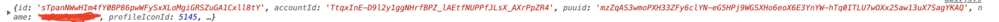

## Jun.gg

우연한 기회로 자바스크립트 강의를 촬영하게 되어 강의 말미에 완성해볼 최종 프로젝트 주제를 생각해보던 가운데 OP.GG 롤 전적검색 사이트를 클론해보면.. 재밌을 것 같아 시작하게 됩니다. 간단한 프로젝트 진행 현황을 공유하고 발생했던 이슈들에 대해 정리합니다.

## 프로젝트 세팅

백엔드를 통해 DB관리는 하지 않지만, 이후 서술할 CORS이슈로 인해 `node.js` 서버 구축을 어느정도 해야했습니다.

`babel`관련 패키지, `express`서버와 `morgan`을 통해 미들웨어를 관리합니다.

```json
{
  "name": "Jun.gg",
  "version": "1.0.0",
  "main": "index.js",
  "repository": "https://github.com/Parkjju/Jun.gg.git",
  "author": "Parkjju <rudwns3927@gmail.com>",
  "license": "MIT",
  "scripts": {
    "dev": "nodemon --exec babel-node src/server.js"
  },
  "devDependencies": {
    "@babel/core": "^7.17.8",
    "@babel/node": "^7.16.8",
    "@babel/preset-env": "^7.16.11",
    "@babel/compat-data": "^7.17.7",
    "nodemon": "^2.0.15"
  },
  "dependencies": {
    "express": "^4.17.3",
    "morgan": "^1.10.0"
  }
}
```

`package.json`입니다. `nodemon`을 통해 라이브 서버를 돌리게 됩니다.

`babel-node`로 `node.js`에서 인식하지 못하는 최신 자바스크립트 문법을 자동 컴파일해주는 스크립트입니다. `src/server.js`에는 서버를 돌리는 자바스크립트 파일 경로를 명시하였습니다.

각종 설치 패키지들은 위와 같이 설치하면 되는데, `@babel/compat-data`패키지까지 설치해야 에러가 발생하지 않습니다. 관련 [이슈 깃헙 링크를](https://github.com/laravel-mix/laravel-mix/issues/2383) 첨부합니다.

## ejs

보통 pug와 같은 템플릿 엔진을 설정해야 정상적으로 돌아가는데, 프로젝트 규모 자체가 크지도 않고 애셋 파일을 강의에 제공 시 노드에 대한 내용이 깊어지면 안되기 때문에 **정적 파일만을 렌더링 하고 싶었습니다.**

찾아보니 `ejs` 템플릿 엔진을 통해 각종 html과 같은 정적 파일을 렌더링 할수 있다고 합니다.

## CORS

라이엇 API 테스트를 위해 라이엇 개발자 사이트에 들어가 키 발급 후 테스트를 진행하였습니다. 추후 CORS조사 후 정리할 예정이지만, 간단히 이슈 원인에 대해 나누면 **라이엇은 클라이언트 단의 CORS 요청을 막아둔 상태였습니다.** 크롬 브라우저에서 에러가 발생하여 어쩔 수 없이 로컬서버를 통해 통신하는 방법밖에 없었습니다. 그런데..?

## API 키의 누락

CORS 에러가 계속 발생하기에 공부해가는 과정에서 `ACAO`라고 불리는 헤더, 즉 `Access-Control-Allow-Origin` 정의에 따라 브라우저가 CORS를 일으킨다는 것을 알게 됩니다. 저의 블로그 브라우저 페이지에서 `fetch API`를 통해 API통신을 시도하면 어김없이 에러가 났었는데, 처음에는 라이엇 측에서 요구하는 ACAO가 저의 오리진과 맞지 않아서 그러는 것이라고 생각했습니다. 하지만 `preflight` 요청에대한 응답에 표기된 ACAO는 `*`로 모든 오리진에 대해 AJAX요청을 허용하고 있었습니다.

아뿔싸..! 이번에 알게되었던 문제는 **쿼리 스트링에 라이엇으로부터 발급받은 API키를 쿼리 스트링에 넣고 있지 않았다는 사실입니다.**

HTML 스크립트 태그에 axios 설치 태그를 넣어두고, 다음 코드를 실행해보았습니다.

```javascript
const riotURL = 'https://kr.api.riotgames.com';
const api = '/lol/summoner/v4/summoners/by-name/';
const userName = encodeURI('롤 닉네임');
const apiKey = '라이엇에서 발급받은 API 키';

axios.get(`${riotURL}${api}${userName}?api_key=${apiKey}`).then((response) => {
  console.log(response.data);
});
```




결과값이 잘 출력되네요. CORS관련된 이슈는 ACAO가 설정된 API를 직접 더 찾아봐야할 것 같습니다.

## JS redirect

대략적인 프로젝트 방향성은 다음과 같습니다.

1. 폼 입력 제출이벤트에 preventDefault를 걸어둔다.
2. 데이터 fetch 후 로컬 스토리지에 저장한다.
3. 결과창으로 리다이렉트 하여 fetch한 데이터를 렌더링해준다.

액시오스를 통해 데이터는 정상적으로 주고받아지며, 폼 제출시 `preventDefault` 메서드는 **인풋태그가 아닌 폼 태그에 걸어둬야 합니다.** 

riotAPI를 통해 계정 정보를 받아오는 데에는 `axios` 라이브러리를 사용하였으며 위에 서술하였듯 ACAO가 `*`로 설정되어 있기 때문에 preflight 요청을 하지 않고 심플 리퀘스트를 진행하여도 무방합니다.

또 다른 페이지로 리다이렉트 하여 전적 검색에 대한 결과 페이지를 보여줘야 합니다. 페이지 리다이렉트는 `window.location` 객체의 `href`속성을 사용하면 됩니다. `location`객체는 여러가지 프로퍼티를 가지고 있는데 그 중 `host`프로퍼티를 사용하면 호스트 이름 값을 출력할 수 있습니다. 따라서 `window.location.href = window.host + 'result.html'`로 코드를 작성하면 URL구성이 `포트넘버/result.html`로 됩니다.

:::warning 프라이빗 API키 관리
코드 애셋 중 `riot api-key`를 깃헙에 공유하면 안되는데, `.gitignore`에 api key를 JSON형태로 저장한 후 해당 객체를 전역적으로 관리하는 방법이 있습니다. 

```json
data='{"key": "발급받은 API키"}'
```

JSON 객체를 변수에 담아 전역적으로 관리하려면 **반드시 한 줄로 코드를 입력해야 인식하게 됩니다.** secret이라는 이름으로 작성한 `secret.json`파일을 **html 헤드 태그에 먼저 로딩시켜** 이후 로드될 자바스크립트 파일들에서 전역적으로 접근할 수 있게 해주는 것이 포인트입니다.

html 하단에 API를 처리하는 스크립트 태그를 src속성으로 자바스크립트 파일과 연결합니다.
```js
// API 처리를 위한 자바스크립트 파일.js
const apiKey = JSON.parse(data).key;
```

헤드 태그에 JSON파일이 로드되어 있기 때문에 `data`라는 이름의 JSON객체로 전역적 관리가 이루어집니다. `secret.json`에서 모두 문자열로 저장되어 있기 때문에 꼭 `JSON.parse()` 메서드에 통과시켜줘야 JSON객체로 변환되어 JSON 프로퍼티가 인식되게 됩니다.
:::

## 배열 데이터로 API요청하기
사용자 티어 표시까지는 완료 했는데, 매치 정보를 표기하는 데에서 막혔다. 최근전적 20전을 불러오는 API를 통해 배열 데이터를 받아온 후 변수에 저장하고, 각 배열 원소마다 접근하여 최근 20전 각각 매치에 대한 자세한 정보를 표기하려고 하는데 **비동기 처리 시 불러온 API 데이터의 순서가 뒤죽박죽인 상태이다.** (API request rate limit에 대한 이슈도 있었지만 `setTimeout` 설정과 함께 해결되었다.)

```javascript
axios.get(`${matchAPI}`).then((response) => {
    const matchData = response.data;
    console.log(matchData);
    matchData.map((perMatch) => {
        const perMatchAPI = `https://asia.api.riotgames.com/lol/match/v5/matches/${perMatch}?api_key=${apiKey}`;

        setTimeout(fetchMatchData, 1000, `${perMatchAPI}`);
    });
});

async function fetchMatchData(api) {
    await axios.get(`${api}`).then((response) => {
        console.log(response.data);
    });
}
```

대략 위와 같은 코드로 각 매치 각 아이디 데이터를 추출하여 새로운 api에 요청을 보내는 코드이다. 결과 반환 자체는 잘 되는데, 배열 `matchData`의 순서에 따라서 출력되지 않는다. 액시오스 체이닝 문법을 활용하면 되긴 하는데 코드 작성 효율이 너무 떨어지기 때문에 좋은 방법이 없을까 고민된다.

구글링 중 찾아낸 방법은 액시오스의 `all`, `spread` 메서드를 활용하는 방법이었다.

`all` 메서드를 활용하게 되는 상황은 현재 처한 문제처럼 **한 번에 네트워크 요청을 보낼 때에 사용하게 된다.** `spread` 메서드는 `all` 메서드에 따라오는 메서드이다.

`for`루프를 돌며 **루프마다 `get`요청을 각각 보내는 것이 아니라, `fulfilled`된 프라미스 객체 배열을 받아 `spread` 메서드를 통해 한 번에 모아보기 라고 생각하면 된다.**

```javascript
    for (let i = 0; i < matchData.length; i++) {
        setTimeout(() => {
            perMatchAPI.push(
                axios.get(
                    `https://asia.api.riotgames.com/lol/match/v5/matches/${matchData[i]}?api_key=${apiKey}`
                )
            );
        }, 400);
    }

    setTimeout(() => {
        axios.all(perMatchAPI).then(
            axios.spread((...response) => {
                for (let i = 0; i < response.length; i++) {
                    console.log(response[i].data);
                }
            })
        );
    }, 8000);
```
최근전적 20전 매치 ID를 AJAX통신을 통해 `matchData`로 가져온 상태인 것은 동일하다. 이후 for루프를 돌며 배열 객체에 `axios.get`을 푸시한다. `axios`는 ES6 프라미스 기반으로, `axios.get`결과에 따라 `fulfilled`된 프라미스 객체가 반환되거나 `reject`된 프라미스 객체가 반환된다. API에 문제가 없었다면 `perMatchAPI`라는 배열 객체에는 응답에 대한 처리를 기다리는 프라미스 객체 20개가 대기하고 있게 된다.

대기중인 20개의 프라미스 객체 처리를 위해 `axios.all`메서드를 사용한다. 파라미터로 `perMatchAPI`를 전달하고, `then` 메서드를 호출한다.

:::tip API Call rate limit
예시 코드 중간중간 `setTimeout`을 삽입해놓은 이유는 **API 호출 제한 횟수 때문이다.** 
:::

이후 `axios.spread` 메서드를 호출하게 되는데, 원래 같으면 다음 코드를 사용하게 된다.
```javascript
axios.spread((response1, response2, response3) => {
  console.log(response1.data);
  console.log(response2.data);
  console.log(response3.data);
});
```

`axios.all`에 전달된 프라미스 배열 객체의 원소 수만큼 응답이 반환되는데 이를 `spread` 메서드에서 한꺼번에 처리하게 되는 것이다. 

배열 객체 각 원소 모두 처리함에 있어서 직접 접근하는 방법도 중요하지만 ES6의 구조분해 할당 문법을 통해 반복문으로 처리할 수 있다.
```javascript
axios.spread((...response) => { // ...response가 구조분해 할당 문법이다.
  for(let i=0; i< response.length; i++){
    console.log(response[i].data);
  }
})
```

**병렬적(concurrent)인** 비동기 처리에 있어서 요청에 대한 응답 순서가 보장되지 않는 점을 **배열 인덱스를 통한 처리로 순서를 부여하게 되는 것이다.**

## Game constants
라이엇 API에는 게임 상수(Game constants)라는 것을 취급한다. 각종 데이터 요청을 통해 받은 응답들을 살펴보는 도중 **매치데이터 큐의 타입을 분류해야하는 문제가 생겼다.** 가져온 매치 데이터가 솔로랭크인지 자유랭크인지 일반인지 칼바람 나락인지 등 라이엇에서 취급하는 다양한 매치 데이터에 따라 텍스트를 다르게 렌더링해야 했다. 

하지만 요청을 통해 받은 API 결과물을 보면 `gameMode`라는 프로퍼티가 **ARAM이 아니면 CLASSIC으로만 분류되고 있었다.** 구글링을 해보니 ARAM은 무작위 총력전(전부 미드에 모여서 싸우는거)을 통칭하는 명칭이었고 CLASSIC은 일반, 랭크, 자유랭크 등 협곡에서 일반적으로 이루어지는 게임 타입을 묶어 분류하는 명칭이었다. 

[라이엇 API문서를](https://developer.riotgames.com/apis#match-v5) 살펴보면 매치 데이터의 응답 프로퍼티인 `infoDto.gameMode` 등에 대해 디스크립션을 **Refer to the Game Constants documentation.** 라고 달아둔 것을 확인할 수 있다. API DOCS에 들어가보니 네비게이션에 `Game Constants`라고 나와있는 것이 아닌가! 이렇게 뭔가 맞아떨어질 때 정말 짜릿하다. 

무튼 `Game Constants`를 참조하면 각종 JSON파일을 fetch할 수 있게끔 API를 정리해뒀는데, 여기서 `queueId`에 따라 `CLASSIC` 분류 내에서도 자유랭크, 솔로랭크, 일반게임을 디테일하게 분류할 수 있게 된다. `queues.json` [API를 참조](https://static.developer.riotgames.com/docs/lol/queues.json)하자.


