# 2021 오픈소스 컨트리뷰션 후기

드디어 작성하는 2021 오픈소스 컨트리뷰션 후기.. 미루고 미루다가 어림잡아 반년이 지난 지금에 와서 후기를 작성해봅니다.

## 합격후기

지금까지도 당최 이해가 되지 않는 부분이 바로 오픈소스 컨트리뷰션 행사에 합격했다는 것입니다. 깃을 활용한 개발을 시작한지 1년도 채 안된 시점에 멘토님들께서 저의 어떤 부분을 좋게 봐주셨을까 아직도 의문이 많이 남네요. 합격 이유를 여쭤보고 마무리하지 못해 조금은 아쉽지만, 어쨌든 처음 진행했던 오픈소스 기여 활동을 허심탄회하게 공유해보려고 합니다.

당시 행사 공고가 뜨고 그나마 제가 신청이라도 해볼 수 있는 프로젝트가 어떤 것일까 물색해보던 중에, 요구하는 기술스택이 **자바스크립트, Vue.js로** 다른 프로젝트와 비교하여 상대적으로 범주기 넓지 않았던 **Cracking Vue.js를** 확인할 수 있었습니다.

프로젝트 계획서에 적힌 내용으로 **지식에 대한 문서화가** 주된 활동으로 되어 있었는데 20년 1월경에 시행되었던 **GDSC Hufs, 한국외대 DSC** 동아리 주관 잔디왕 김훕스 행사를 통해 마크다운으로 지식을 문서화하는 데에 흥미가 있었던 저는 그 동안 착실히 잔디를 심어오고 있었습니다.

오픈소스 컨트리뷰션 행사 공고가 뜨기 직전에는 실제로 제가 **Jekyll** 정적사이트 생성기를 이용하여 블로그를 제작하기도 했었습니다. [milooy - 진유림님](http://milooy.github.io/TIL/) TIL블로그를 레퍼런스 (사실상 카피수준) 하여 제작했었습니다. [Parkjju's TIL](https://parkjju.github.io/) 지킬에서 직접 제공하는 부분(프로젝트 구조나 페이지 상속 등)을 제외한 화면 단 컨텐츠적인 부분들을 하나하나 직접 만들어보고, 검색기능 또한 지킬과 관련된 라이브러리를 직접 서치 및 적용하였습니다. 단어 입력시 연관된 게시글들이 표시될 수 있도록 하는 기능들이 있더라구요. [Jekyll-Simple-Search](https://jamesu.dev/posts/2021/01/03/adding-search-page-on-jekyll/) 라이브러리였을 겁니다.

어쨌던 나름 고생 끝에 만들어진 TIL 페이지와 함께 제 깃헙주소를 첨부해드리고 난 며칠 뒤에 Cracking Vue.js 프로젝트 멘티로 선정되었다는 메일을 받게 됩니다. :)

## 깃헙 교육

협업을 위해 사용하는 버전컨트롤 시스템은 여러가지가 있지만, 오픈소스 컨트리뷰션(이하 OSS)에서는 깃(Git)을 사용하였습니다. 다행히 깃 자체를 다루는 데에는 크게 어려움이 없는 상태여서 괜찮았다.. 라고 생각할 때가 큰 문제였습니다. 협업에 깃을 적용해서 사용해본 적이 전무했던 터라 실무적인 부분 + 오픈소스 기여 문화에 필요한 깃 스킬들을 배우느라 꽤나 진땀뺐던 시간들이었습니다.

Add-Commit-Push만 하는데에도 오픈소스 문화에서 커밋 메세지를 잘 작성하는 방법이나 태그 구분 등 여러가지를 배울 수 있었고 고급 교육으로 넘어가서는 `git rebase`, `Pull request`, `merge` 등 처음 배우는 부분들도 많았습니다.

중간에 PR 날리는 실습이 있었는데, 실제로 Cracking Vue.js 프로젝트에 함께하게 될 팀원 몇분과 조별로 묶여서 실습을 진행했습니다. [깃헙 Organization](https://github.com/Parkjju/practice-git) 을 활용하여 진행했습니다.

깃헙 교육을 받긴 했지만, 나중에 실제 저의 커밋을 원본 프로젝트에 반영하기 위해 머지(Merge)할 때 유용한 깃 지식을 더 알게됩니다.

## 프로젝트 시작

온라인 발대식을 시작으로 OSS 행사가 시작됩니다.

게더타운에서 몇백명이 한 곳에(한 서버) 모여 진행했는데 생각보다 현장감이 좋았습니다. 워낙 큰 규모의 사람이 몰리고 이에 따른 리퀘스트가 많아지다보니 오류도 많이 발생하고,, 이러다보니 더 현장감이 좋았던 것 같습니다.

공식적인 행사(보물찾기, 연사 등)를 모두 마무리 짓고 팀원끼리 모여 각자 소개하는 시간을 가졌습니다.

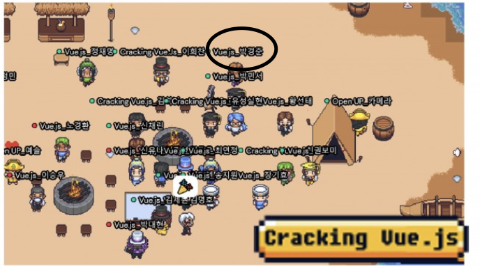

각자 어떤 일을 해왔고 어떻게 살고 있는지 소개하는 시간을 가졌는데 총 20명의 멘티 중 13명이 현직자, 7명이 학생이었습니다. 사실 문닫고 마지막에 들어왔다고 생각드는게 모두 너무 대단한 일들을 각자의 자리에서 하고 계셨던 분들이라.. 이때부터 제 스스로가 많이 쭈글해졌습니다.

어찌됐던 시작한 프로젝트! 잘 진행해보겠다고 절치부심 하여 시작하게 됩니다. (사실 프로젝트 진행 기간동안 여러번의 절치부심이 이루어집니다)

## 첫 이슈 등록

MBTI가 ISFJ인 저는 누구보다도 먼저 이슈를 등록하게 될 지 상상조차 못했습니다. 프로젝트 첫 온라인 모임에서 깃헙 이슈 등록과 PR 날리는 법, 머지 하는법까지 알려주셨는데 프로젝트 팀원 한분께서 간단한 작업에 대해 이슈를 올리시고 PR을 해볼 사람을 구하고 있었습니다.

모든게 10분 남짓되는 짦은 시간에서 이루어졌었는데 선착순으로 PR할 사람을 받는 상황이었어서 정말 미칠뻔했습니다.. 즉흥을 극도로 싫어하는 제 입장에서 어떻게 할 수 있었을까 아직도 눈앞이 새까매지네요.

<figure style="display:flex; align-itmes:center;">

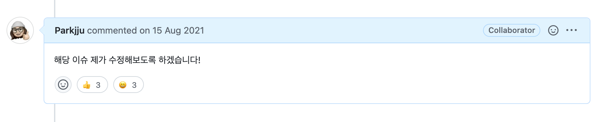
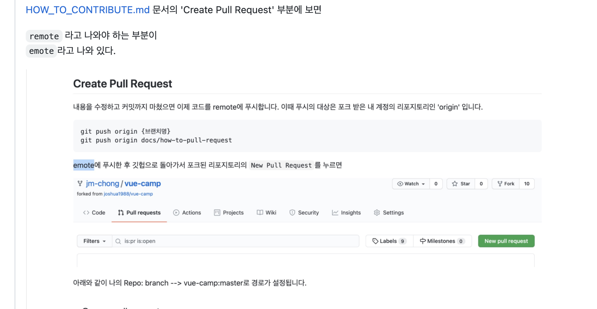

<figcaption>PR 날먹(?)하기</figcaption>

</figure>

후다닥 이슈를 챙긴 뒤 PR까지 날려봤습니다.

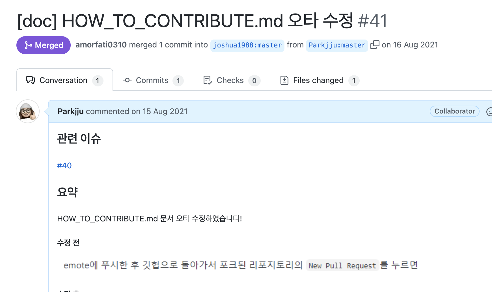

PR 머지는 멘토님께서 대신 해주셨고, 첫 PR을 통해 오픈소스에 직접 기여했다는 것에 대해 멘티님들과 멘토님들이 축하해주셨습니다.

:::tip 오픈소스 문화
멘토님들께서 OSS 기간동안 내내 강조하셨던 것은 바로 기여라는 문화를 어렵게 생각하지 말라는 것이었습니다. 흥미가 있는 오픈소스의 명세서 오타를 수정하는 간단한 작업 조차도 매우 중요한 오픈소스 기여 방식이라고 하셨습니다. 오픈소스 기여를 너무 어렵게 생각하지 마세요!
:::

## 기술문서 작성과 리뷰

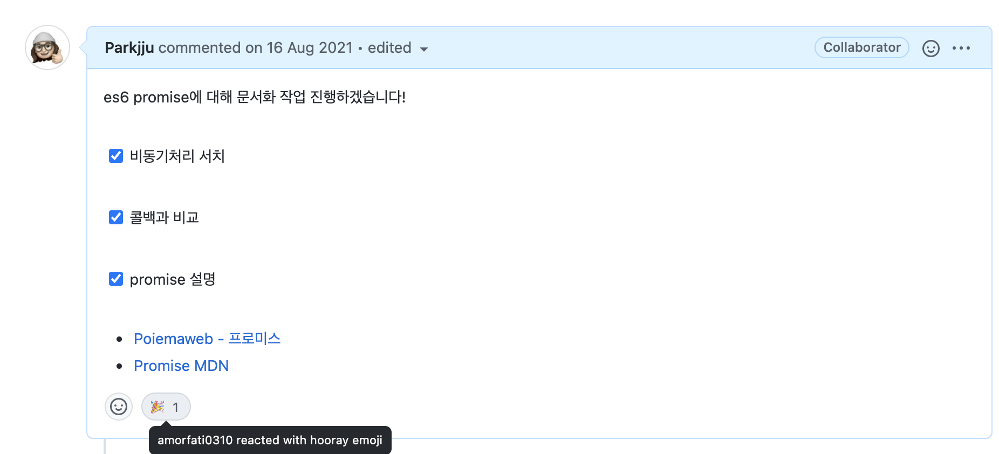

날먹(?) PR이 머지된 이후 몇주 동안 기여 주제에 대해 서치하는 시간을 가졌습니다. 아까도 언급했듯 ISFJ 특성상 모든걸 계획하고 실행에 차질이 0%이다 싶을 때 행동으로 옮기기 때문에 실제 기여까지 시간이 좀 소요되었습니다.

**자바스크립트 프라미스(Promise)라는** 주제를 문서화 하기로 결정하여 약 1주일간 기술과 관련된 자료들을 서칭하기 시작합니다.

포이마웹, [mdn 공식자료에](https://developer.mozilla.org/ko/docs/Web/JavaScript/Reference/Global_Objects/Promise) 더해 다양한 영문서와 [Javascript Info를](https://javascript.info/promise-basics) 참조해가며 문서를 작성했습니다.

총 30개의 리뷰가 달리고 멘토 세분, 다른 멘티님께 [리뷰를](https://github.com/joshua1988/vue-camp/pull/60) 받았습니다.

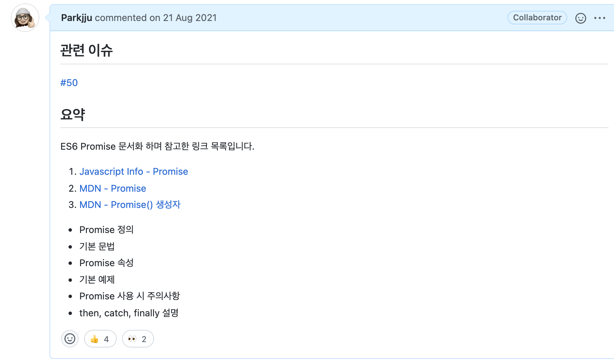

문서 퇴고 시 확인하지 못했던 오타부터 시작해서 글 전체 골자에 대한 피드백까지 문서 전체를 아우르는 피드백을 받았습니다.

<figure>

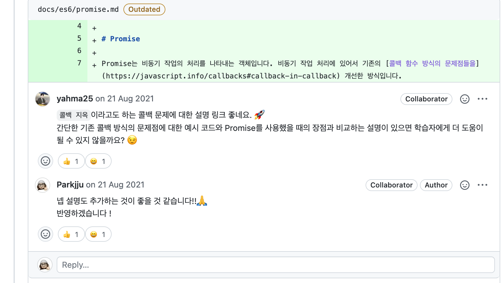
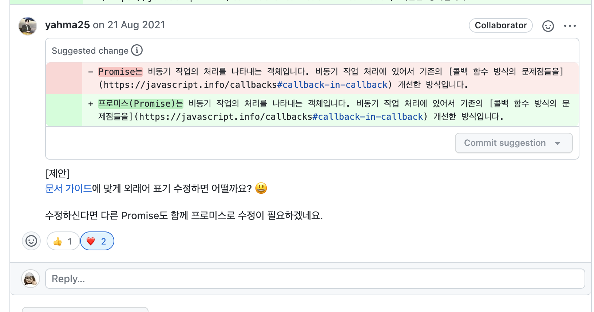

<figcaption>활발한 리뷰들</figcaption>

</figure>

다른 멘티님께서 리뷰받는 문서를 보니 수정사항에 대해 반영한 커밋사항을 링크로 첨부하는 것이 좋아보여 나도 따라하게 되었다.

:::tip 첫 번째 배움
코드리뷰에 대한 수정사항을 반영했으면, 리뷰어가 직접 수정사항을 찾아갈 필요 없게끔 코멘트 내에 커밋 링크를 달아주자.

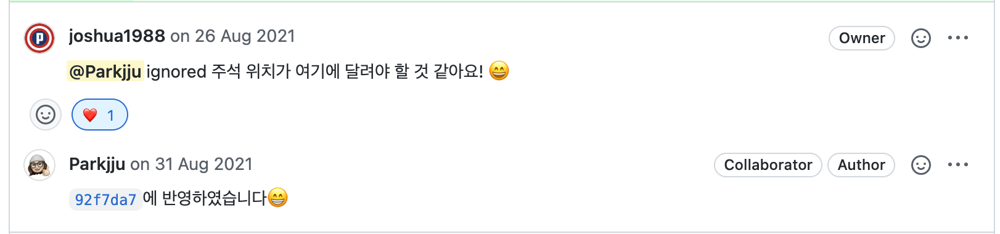
:::

다양한 리뷰에 대해 수정사항을 처리하고 드디어 머지할 기회가 찾아오게됩니다.

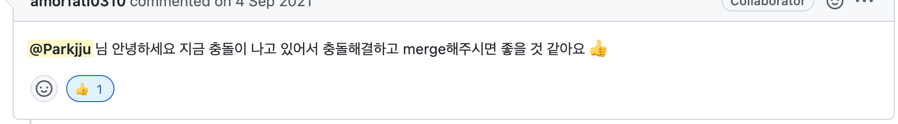

## 첫 번째 대위기

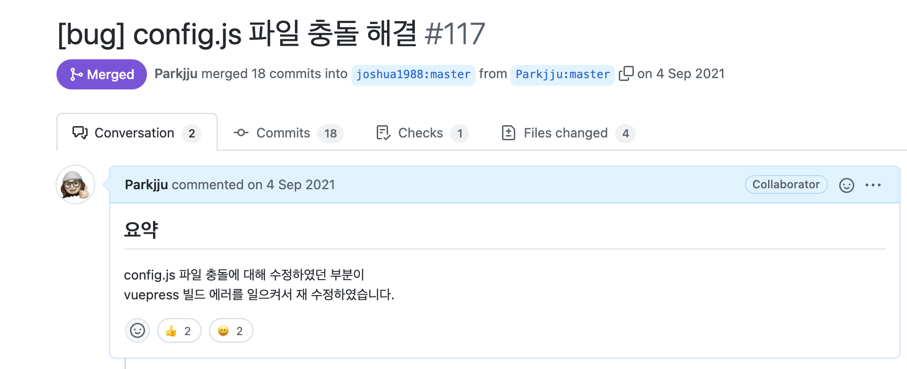
이제 드디어 머지할 차례가 되었다. 단순히 내가 작성한 기술문서만 add-commit-push하면 될 줄 알았지만, 내가 PR로 커밋을 메인브랜치에 올려놓은 상태에서 다른 PR들이 올라오면서 내 커밋 이후 다른 커밋들이 메인브랜치에 반영 되어있는 상태가 만들어졌다.

:::warning 협업시 브랜치
사실, 애초에 새로운 문서작업을 위한 브랜치를 파놓고 작업을 진행했어야 했다. 그것이 버전 컨트롤을 더 안전하게 쓰는 방식이기 때문이다.나는 이 사실을 모르고 메인 브랜치에 프라미스 문서 작성을 하고 있었고 이 부분은 이후 고치게 되었다.
:::

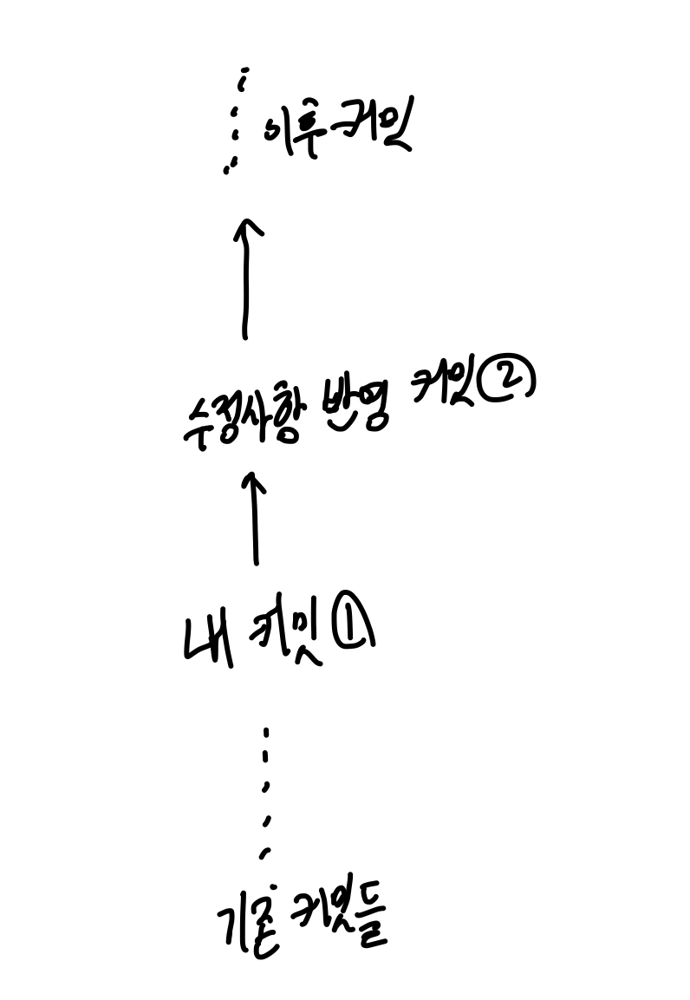

내가 원했던 상황은 위와 같은 상황이었지만, 프로젝트를 나만 진행하는 것이 아니니 다음과 같은 상황이 발생했다.

쉽게 말해 PR올린 시점 이후로 다른 멘티분들께서 작업하신 내용이 **머지되어 오리지널 프로젝트에 변경사항이 생긴 것이다.** 내가 PR을 올리는 A 상태였던 코드가 PR을 올린 이후 B상태 코드로 변경된 것이다. A상태였던 코드에서 A + 추가 코드로만 이루어진 변경사항이라면 머지시에 충돌이 발생하지 않는다.

깃헙은 친절하게도 충돌 해결을 위해 UI를 제공해준다. [Github Docs를 참고하면 충돌 발생시 어떤 화면이 나오는지 확인할 수 있다.](https://docs.github.com/es/enterprise-cloud@latest/pull-requests/collaborating-with-pull-requests/addressing-merge-conflicts/resolving-a-merge-conflict-on-github)

`<<<, >>>`같은 표시로 감싸져 있는 코드가 충돌을 일으킨 것인데 나는 이때 깃헙의 배려를 너무 과대평가해버렸다.

:::warning 두 번째 배움
git에서 충돌이 발생했을 때 깃헙은 **머지하려는 코드와 현재 상태의 코드를 나누어서 보여준다.** 새롭게 추가하거나 변경한 코드를 머지하고 싶어도 꼭 **두 코드를 직접 비교를 해봐야한다.** 협업과 관련된 사항이기 때문에 실제로 반영되기 직전의 작업은 신중을 기해야한다.
:::

:::tip 세 번째 배움
협업, 즉 같은 코드와 같은 파일을 가지고 작업하는 데에 있어서 인덴트(들여쓰기)같은 코딩 저장양식이 일관되어야 한다. 자동저장시 현재 내가 로컬환경에서 설정해놓은 형식으로 코드가 자동변환 되어버리기 때문에 쓸데없는 변경사항이 너무 많이생겨 리뷰하기가 어려워진다.
:::

Cracking vue.js는 깃헙 액션을 통해 자동 빌드와 배포가 이루어지는 형식인데 내가 잘못 머지한 파일로 인해 깃헙 액션에서 빌드 에러를 일으키게 되어 잠시 사이트가 다운된 문제가 발생했었다.... (충격)

빠르게 멘토님께 도움을 요청드려 금방 해결하긴 했지만 정말 무서운 순간이었다..

## 두 번째 PR과 작은 실수

위기를 잘 넘기고 다음 PR거리를 찾는 도중 다른 멘티님께서 기여할만한 주제를 추천해주셨다. 바로 뷰프레스 플러그인을 설치하는 것이다. Cracking vue.js사이트는 뷰를 공부하는 많은 사람들이 참고하는 사이트임에도, 코드블럭 카피기능이 추가되어 있지 않은 상황이었다.

플러그인 설치 후 짧은 피드백이 있었다.

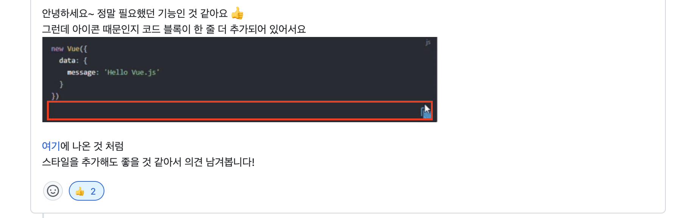

`.styl` 이라는 파일확장자 내에 CSS를 수정하는 것으로 작업을 처리할 수 있었다.

:::tip 네 번째 배움
코드에 EOF를 챙기는 습관을 들이자.

[EOF 코드리뷰](https://github.com/joshua1988/vue-camp/pull/84/commits/9b6acd2e388f6c84d888af06dfbff02b10993a32)
:::

작업 커밋들을 반영할 때 fork 레포지토리에 `force-push`를 했더니 **리뷰중이던 PR이 닫혀버리는 문제가 발생했었다.** 작업 브랜치에 대한 피드백을 반영하기 위해 작업 내용을 복사하여 새로운 브랜치에 커밋하고, 기존 메인브랜치 내용을 삭제했더니 이러한 문제가 발생했었다.

큰 문제가 되진 않았었지만 **코드리뷰를 중시하는, 또 활발히 리뷰중인 PR에 대해서 이런 일이 다시 발생하지 않도록 조심해야겠다고 생각했다.**

## 마치며

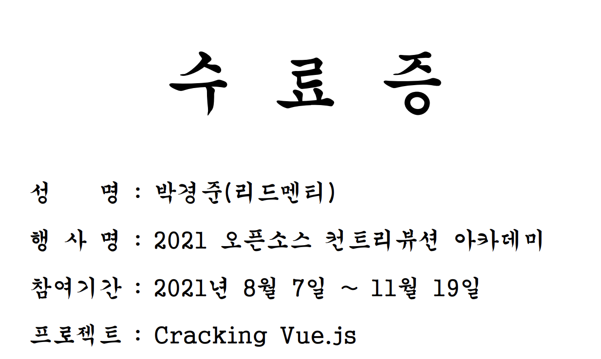

4달이나 되는 긴 시간동안 오픈소스에 기여하는 시간을 가졌다. 솔직히 정말 힘든 시간이었다. 아무도 나에게 뭐라하지 않고 오히려 자유로운 분위기 속에 편한 컨트리뷰션을 장려했는데, 스스로에 대한 자격지심으로 인해 나를 네달동안 지치게 했다. 프로젝트를 마치며 멘토님들께는 죄송하단 한마디도 못할 정도로 부끄러운 순간들이 너무 많았다.

지금 생각해보면 아쉬움이 참 많이 남는 시간들이었지만 (더 잘할수 있었기에) 또 배우기도 많이 배운 시간들이었다. 단순히 기술적인 부분에서 성장한 부분도 있었겠지만 더 크게 성장한 부분은 **협업에 대한 능력**, **소통하는 능력이다.** 내가 일으킨 문제는 내가 발벗고 나서서 적극적으로 해결해야하며 협업을 진행할때에는 누구보다도 신중해야한다는 것.

너무 아무것도 모르는 병아리 상태로 OSS행사에 참여했던 것이 오히려 패착이 되었던 것 같다. 적당한 패기도 좋지만 누군가에게 피해를 주지 않기 위해서는 기본 소양을 갖추는 것이 **나에게도, 남에게도** 바람직한 일이라고 생각한다.(남에게 강요는 하지않을 것)

2021 오픈소스 컨트리뷰션을 마치며, 프로젝트에 함께해주신 장기효님, 정재명님, 이희찬님, 다른 멘티분들께 감사하다는 말씀 올립니다 :)

인프런의 캡틴판교 Vue.js강의 많이 사랑해주세요!
