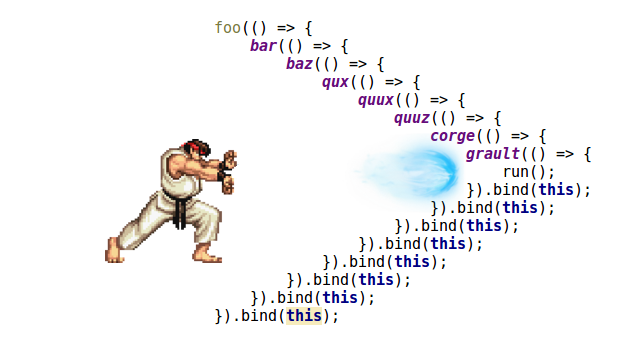

## 비동기 처리

비동기 처리에는 다양한 방법이 존재한다. 콜백함수, 프라미스, 제너레이터, 어싱크 어웨트 등의 것들이 그 예시가 된다.

[Cracking Vue.js - 프라미스에 대한 글을 참조하자.](https://joshua1988.github.io/vue-camp/es6+/promise.html#%E1%84%91%E1%85%B3%E1%84%85%E1%85%A1%E1%84%86%E1%85%B5%E1%84%89%E1%85%B3%E1%84%85%E1%85%B3%E1%86%AF-%E1%84%89%E1%85%A1%E1%84%8B%E1%85%AD%E1%86%BC%E1%84%92%E1%85%A2%E1%84%8B%E1%85%A3-%E1%84%92%E1%85%A1%E1%84%82%E1%85%B3%E1%86%AB-%E1%84%8B%E1%85%B5%E1%84%8B%E1%85%B2) (내가 작성함 😉)

일련의 값들을 비동기적인 코드로 설정된 상태로 곱하여 최종 값을 산출하는 코드를 콜백 함수, 프라미스, 제너레이터로 구현해본다.

## 1. 콜백 함수

```js
setTimeout(
  (x) => {
    let result = x;

    console.log(result);

    setTimeout(
      (x) => {
        result *= x;

        console.log(result);

        setTimeout(
          (x) => {
            result *= x;
            console.log(result);
          },
          1000,
          30
        );
      },
      1000,
      20
    );
  },
  1000,
  10
);
// 콜 백 지 옥
```

A 함수를 실행하는 흐름 속에 B 함수를 실행하고, 그 속에서 C 함수를 실행하고 ... 이런 흐름이 중첩되는 것이 콜백 지옥이다.

<figure>



<figcaption>

출처: https://adrianalonso.es/desarrollo-web/apis/trabajando-con-promises-pagination-promise-chain/

</figcaption>

</figure>

## 2. 프라미스

1. `new Promise()`를 호출한다. 호출하면 **대기(pending)**상태가 된다.
2. 대기상태가 되면 **콜백 함수를 선언할 수 있고** 인자로 `resolve`, `reject`를 받는다. 즉 `Promise(resolve, reject)`의 형태를 갖는 것이다.
3. 콜백함수 내에서 처리한 뒤 `resolve` 메서드를 호출하면 **이행(Fulfilled)상태이다.**
4. 성공 시 `.then()`이 리턴값을 받아서 계속해서 처리를 수행한다.

```js
new Promise((resolve, reject) => {
  setTimeout(
    (x) => {
      let result = x;
      console.log(x);

      resolve(result); // resolve 메서드의 인자값이 then 메서드로 전달된다.
    },
    1000,
    10
  );
}).then((result) => {
  return new Promise((resolve, reject) => {
    setTimeout(
      (x) => {
        console.log(x);
        result *= x;
        console.log(result);

        resolve(result);
      },
      1000,
      20
    );
  });
});
```

**코드를 직접 짜보자**

## 3. 제너레이터

위의 예시들처럼 값을 순차적으로 받아 곱셈 처리를 제너레이터로 구현하려면 어떻게 해야할까?

1. `calculator`함수는 단순 곱셈만 처리하지 않는다. (next메서드를 통해 제너레이터 함수를 재호출해야한다.)
2. 제너레이터 함수 외부로부터 내부로 데이터를 전달할 때에는 명시적인 값으로 전달해야 한다. `next(10)...`

`calculator` 구현 전에 다음의 코드를 보고 콘솔상에 출력되는 결과를 예측해보자.

```js
function* testGenerator() {
  const a = yield 1;
  console.log(a);
}

const iter = testGenerator();
iter.next();
iter.next();
```

:::details 해설

첫 번째 `iter.next()`는 제너레이터 함수를 처음 호출하여 함수 처음부터 코드를 쭉 읽는다. 읽어 가다가 첫 `yield`를 만나 함수 외부로 제어권을 양도한다. 따라서 이후의 코드는 무시된다.

두 번째 `iter.next()`는 `next()`메서드의 인자로 값이 전달되지 않았으므로 제너레이터 내부의 `a` 변수에는 어떠한 값도 저장되지 않는 `undefined` 상태가 된다. 이후 `console.log`를 만나 `undefined`를 출력하게 된다.

:::

이제 제너레이터로 위의 순차적 곱을 구현해보자. **외부 데이터인 calculator함수 결과를 next메서드에 명시적으로 전달해줘야 하는 것이 중요하다.**

```js
const iter = testGenerator(); // global 스코프

function calculator(a, b) {
  setTimeout(() => {
    iter.next(a * b);
  }, 1000);
}

function* testGenerator() {
  const a = yield calculator(1, 10);
  console.log(a);

  const b = yield calculator(a, 20);
  console.log(b);

  const c = yield calculator(b, 30);
  console.log(c);
}

// 출력 시작
iter.next(); //호출시 나머지 값들은 자동 실행
```
