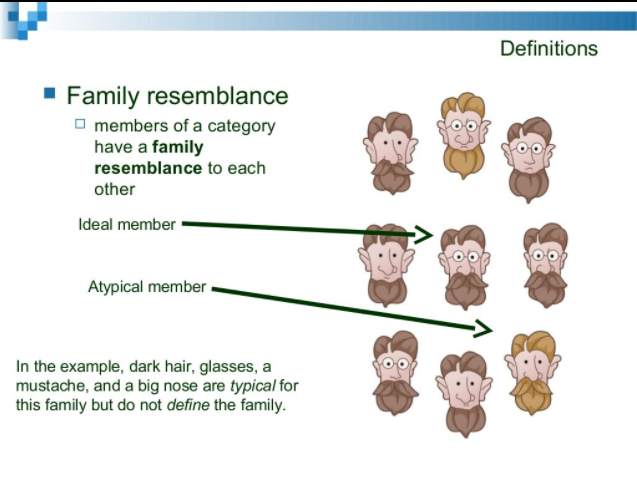
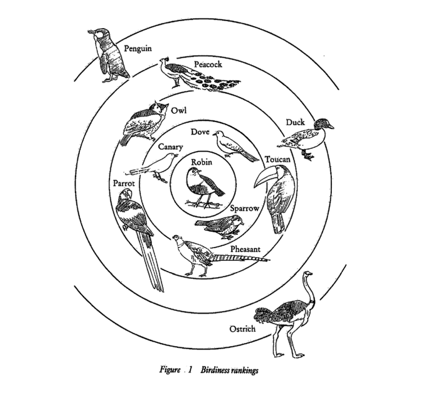

**임성묵님의 "자바스크립트는 왜 프로토타입을 선택했을까?" 아티클 요약본입니다.**

[자바스크립트는 왜 프로토타입을 선택했을까?](https://medium.com/@limsungmook/%EC%9E%90%EB%B0%94%EC%8A%A4%ED%81%AC%EB%A6%BD%ED%8A%B8%EB%8A%94-%EC%99%9C-%ED%94%84%EB%A1%9C%ED%86%A0%ED%83%80%EC%9E%85%EC%9D%84-%EC%84%A0%ED%83%9D%ED%96%88%EC%9D%84%EA%B9%8C-997f985adb42)

## 플라톤과 클래스 기반 언어

서양 철학사를 논할 때에는 단연 **플라톤을 빼먹을 수 없다.** 플라톤 철학으로부터 기인하여 서양철학은 **이분법적인 사고를** 바탕으로 하게 되는데

1. 영혼/육체
2. 추상적/구체적

위와 같이 생각해볼 수 있다.

두 관계를 규정해보면 바로 본질-실체 관계로 정리할 수 있다. 플라톤이 생각하길 모든 실체는 결국 본질을 가지며, 예를 들어 바퀴달린 의자나 흔들의자나 세계 각국의 의자라고 하는 것들은 **의자라는** 본질을 갖고 이에 대한 특성을 공유하고 있다고 할 수 있다.

**클래스 기반 언어에서의 클래스는 바로 본질을 의미한다.**

클래스를 기반으로 생성된 인스턴스들은 모두 본질의 특성을 똑같이 공유하고 있다.

## 프로토타입(Prototype)

19세기의 저명한 철학자 비트겐슈타인은 본질에 대한 논의를 정면으로 반박하고 나선다. 바로 **어떠한 실체는 공유 속성으로 설명되지 않는다는 것이다.**

게임이라는 본질이 있을 때 이로부터 파생되는 실체의 몇가지를 살펴보면 플라톤 이론 기반으로는 설명되지 않는 반례들이 몇가지 존재한다.

1. 확률형 게임 - 숙련도의 여부가 속성으로 여겨지는 일반적인 게임과 다르다.
2. 플레이어가 없는 게임 - 플레이어가 존재해야하는 일반적인 게임과 다르다.
3. 승리/패배 개념이 없는 게임

위와 같은 예시들은 승/패가 존재하며, 플레이어가 있어야 하며, 숙련도가 중요하다고 여겨지는 일반적인 게임과 속성을 공유하지 않는다.

클래스 기반 언어의 가장 큰 문제점은 **확장성에 있다.** 속성을 미리 정의하여 이를 공유하는 인스턴스를 파생적으로 만들어내다 보니 다른 속성을 갖는 인스턴스는 **완전히 다른 개체가 되어버린다는 것이다.** 단어를 규정하고, 이에 맞춰서 결과를 찍어내는 것이 클래스 기반 언어의 장점이다 단점이 된다.

## 의미사용이론

클래스를 기반으로 했을 때 **단어가 있고, 그 후에 의미가 있다면**

프로토타입을 기반으로 했을 때에는 **사용이 있고, 그 후에 단어의 의미가 있다.**

임성묵님의 예시로, 누군가 벽돌! 이라고 외쳤을 때 이는 다음과 같은 의미들을 지닐 수 있다.

1. 벽돌을 가져다 달라고 했을 때
2. 떨어지는 벽돌을 조심하라고 했을 때
3. 빈 틈을 벽돌로 채우라 했을 때

등등 같은 개체를 다양한 의미로 사용하게 되는 것, 이것이 바로 의미사용이론이다. **단어란 맥락(Context)이 중요하다.**

## 가족 유사성

개체를 분류(Classification)함에 있어서 플라톤의 제자인 아리스토텔레스는 같은 집단에 속하는 개체들은 **속성을 공유한다는 것이** 분류 기준이고

비트겐슈타인은 **가족 유사성에 따라** 가족이 모두 똑같은 특성을 공유할 필요는 없지만 **어떤 전형적인 특징을 통해** 같은 범주에 속한다고 판단하게 된다.

<figure>



<figcaption>출처 : https://www.slideshare.net/vcmlab/cog5-lecppt-chapter08 </figcaption>

</figure>

## Rosch의 프로토타입 이론

로쉬(Rosch)는 개체들의 속성을 나열하는 실험을 통해 개체들 중 공유하는 특성을 가장 많이 갖는 전형적인 개체, 즉 **원형을** 골라내는 실험을 하게 된다.

<figure>



<figcaption>출처 :  https://laurabecker.gitlab.io/classes/as/08-semantics.pdf </figcaption>

</figure>

위의 그림처럼 정가운데에 존재하는 참새로부터 비전형적인 특성을 갖는 개체르 뻗어져 나가는 구조가 프로토타입 기반 구조이다.

객체가 **선험적인 정의로부터** 구분되는 것이 아니라 **원형과의 유사성으로** 구분되는 것이다.

또한 프로토타입으로 선정된 특정 개체는 **의미 사용에 따라, 실행 맥락(context)에 따라 갖는 의미가 달라질 수 있다.** 이에 대한 가벼운 예시로써 어떤 아이가 생각하는 펭귄은 참새라는 프로토타입에 대해 비전형적인 개체이지만 조류학자가 바라보는 펭귄은 참새라는 프로토타입에 합치되는 개체로 평가될 수 있다.

## 프로토타입 기반 객체지향 프로그래밍

프로토타입 기반 OOP의 특징은 다음과 같다.

1. 개별 개체 수준에서 메서드와 변수가 정의된다.
2. 객체 생성은 일반적으로 복사를 통해 이루어진다.
3. 선험적인 분류를 줄이고 반복적 프로그래밍을 장려
4. 유사성을 활용한다.
5. 설계는 맥락에 의해(Context) 평가된다. (설계 -> 쓰임새를 의미)

## 예제코드 분석

`예제코드 또한 임성묵님의 코드를 그대로 복사하였습니다.`

```js
function 참새() {
    this.날개갯수 = 2;
    this.날수있나 = true;
}
const 참새1 = new 참새();

console.log('참새의 날개 갯수 : ', 참새1.날개갯수); // 2
```

참새라는 프로토타입을 정의하고 이로부터 참새1 개체를 생성하였다.

```js
function 닭() {
    this.벼슬 = true;
}
닭.prototype = 참새1; // reference(오른쪽이 인스턴스인 점 주목)
const 닭1 = new 닭();
console.log('닭1 날개 : ', 닭1.날개갯수, ', 날수있나? ', 닭1.날수있나); // 2, true
닭1.날수있나 = false;
console.log('다시 물어본다. 닭1은 날 수 있나? :', 닭1.날수있나); // false
```

참새1이라는 개체의 프로토타입을 참조하여 닭1이라는 개체를 생성하는데 닭1은 **닭이라는 또 하나의 비 전형적 프로토타입 속성을 갖는다 - 벼슬**

`프로토타입에 대한 이어지는 이야기로 스코프와 this로 추후 정리합니다.`
