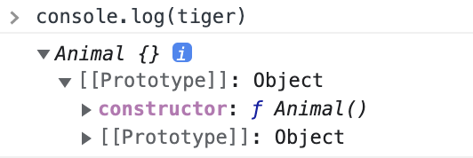

## 자바스크립트 프로토타입(Prototype)

기본적인 개념은 [자바스크립트 프로토타입 철학에 대한 글](./prototype.md)을 참조하자. 자바스크립트는 객체의 원형(프로토타입)을 가지고 새로운 객체를 생성해가는 프로그래밍 방식이다. 객체의 원형인 프로토타입을 이용하여 **객체의 확장, 재사용, 상속 등을 구현해나간다.**

프로토타입 객체는 `new`연산자에 의해 생성된 객체이며 공유 프로퍼티, 메서드 등을 제공하기 위해 사용된다.

```js
const fruit = { name: 'apple' };
console.log(fruit.name); // apple

// 속성 추가
fruit.expiration = '20241231';
console.log(fruit.expiration); // 20241231

// 속성이 있는지 없는지 체크하는 메서드
console.log(fruit.hasOwnProperty('expiration')); // true
console.log(fruit.hasOwnProperty('country')); // false
```

`expiration`이라는 프로퍼티를 추가한 것은 맞지만 애초에 `fruit`객체를 생성할 때 `hasOwnProperty`라는 메서드를 정의한 적이 없다. 그럼에도 `true`,`false`가 정상적으로 출력된다는 것은 `fruit` 객체가 `hasOwnProperty` 메서드를 사용할 권한이 있다는 것이다.

```js
console.log(fruit); // [[prototype]]: Object라는 것이 함께 출력된다. __proto__라고도 표기된다.
```

위 코드를 실제로 출력하여 확인해보면 `__proto__`라는 것이 출력되고, `fruit`이 아닌 빈 객체를 정의하여 `console.log()`에 전달해도 똑같이 `__proto__`가 함께 출력된다.

:::tip hasOwnProperty() 메서드를 객체에서 직접 정의한다면?

```js
const fruit2 = {
    name: 'apple',
    expiration: '20241231',
    hasOwnProperty: function () {
        console.log('Hello');
    },
};

fruit2.hasOwnProperty(); // Hello
```

직접 정의시 새롭게 정의한 메서드를 출력하게 된다.

:::

## 자바스크립트 함수의 내부와 객체간의 관계 (1)

함수가 만들어지고 수행이 되면 내부에서는

1. 함수 자신과 이름이 같은(Animal 함수라고 가정) **프로토타입 객체가 생성된다.** (Animal 프로토타입 객체가 생성)
2. Animal 함수 멤버로 `prototype` 프로퍼티가 생성되며 다른 곳에 생성된 **Animal 프로토타입 객체를 참조한다. (가리킨다)**
3. Animal 함수로 생성된 프로토타입 객체는 이후 `new`와 생성자 함수로 생성되는 모든 객체의 프로토타입(원형)이 된다.

:::tip 함수 생성시 프로토타입 객체가 따라오는 이유?
이론적으로 함수를 정의하고 해당 함수에 새로운 메서드를 또 다시 추가할 수 있다. 예를 들어 Animal 함수를 정의한 뒤 `run()` 메서드를 정의해보자. Animal로부터 여러 객체가 생성될 때 해당 객체들은 모두 각각 `run()` 메서드를 지니고 있어야한다. 이는 곧 메모리낭비의 문제를 갖게 된다.

이러한 문제를 해결하기 위해 함수 생성에 프로토타입 객체 생성이 함께 이루어지는 것이다. 함수 내부의 추가적인 메서드를 프로토타입 객체로 빼서 관리하게 된다. 프로토타입 객체로 메서드를 빼기 위해서는 **프로토타입 속성을 통해서만 가능하다.**

또한 함수를 통해 생성된 프로토타입 객체는 **contructor프로퍼티를 가지며** 이 프로퍼티는 **자신을 생성한 함수를 다시 가리킨다.(참조)**

`Animal function().prototype --> Animal prototype Object`
`Animal prototype Object.constructor --> Animal function()`
:::

```js
function Animal() {}
let tiger = new Animal();
let lion = new Animal();

console.log(tiger); // Animal {} [[prototype]]: Object, Animal 프로토타입 객체가 생성되었다.
console.log(lion); // Animal {} [[prototype]]: Object, Animal 프로토타입 객체가 생성되었다.
// tiger와 lion의 프로토타입 객체를 보면 constructor 프로퍼티가 Animal함수를 가리키는것을 볼 수 있다.
```



사진에서 Animal~`[[prototype]]: Object` 까지는 Animal 프로토타입 객체이고 펼친 뒤 나타나는 `constructor`는 Animal 함수를 가리키며, 펼쳐진 `[[prototype]]: Object`는 최상위 오브젝트(프로토타입)를 가리킨다.

위와 같이 Animal함수와 `new` 연산자르 통해 생성된 tiger, lion 객체는 자동적으로 `__proto__` 속성을 갖는다. 이 속성은 특정 대상을 가리키는데 그 대상은 **객체가 만들어질 수 있도록 해준 원형(프로토타입)이다.**

```js
console.log(tiger.__proto__); // {constructor: f} > f Animal()
console.log(lion.__proto__); // {constructor: f} > f Animal()
```

## 자바스크립트 함수의 내부와 객체간의 관계 (2)

위의 Animal 예시를 계속해서 사용해보자. Animal 함수로부터 생성된 Animal 프로토타입 객체에 **멤버 하나를 추가하면** Animal 함수로 생성된 객체들은 이 멤버를 공유하기 때문에 모두가 사용할 수 있게 된다.

프로토타입 객체에 멤버를 추가하는 방법은 다음과 같다.

```js
function Animal() {}
Animal.prototype.Run = function () {
    return '후다닥';
};

let tiger = new Animal();
console.log(tiger.Run()); // 후다닥
```

새로운 멤버를 프로토타입 객체의 생성자인 함수가 아닌 프로토타입 객체에 추가함으로써 새롭게 생성되는 객체들은 **멤버 선택 권한에서 자유권을 얻게 된다.**

tiger 객체를 예시로 들어, tiger객체가 프로토타입 객체로부터 멤버를 선택할지 말지에 대해 자유롭다는 것은 **tiger객체 내에 메소드가 정의되어 있지 않을 때 프로토타입 객체에 해당 메소드가 정의되어 있는 지 재탐색을 진행하는 행위를 의미한다.** 이를 **프로토타입 체이닝이라고** 한다.

tiger, lion 객체 내에 메서드를 직접 정의하려면 다음과 같이 한다.

```js
tiger.Run = function () {
    return '타이거 후다닥';
};

console.log(tiger.Run()); // tiger에 정의된 Run 호출, 타이거 후다닥
console.log(lion.Run()); // 프로토타입 체이닝에 따른 프로토타입 메서드 호출, 후다닥
```

## 자바스크립트 함수의 내부와 객체간의 관계 (3)

멤버 함수가 아닌 프로퍼티를 추가해보자.

```js
function Animal() {}

let tiger = new Animal();
let lion = new Animal();

console.log(tiger.Leg); // 4
console.log(lion.Leg); // undefined, 메서드 체이닝을 해도 lion 객체에는 Leg프로퍼티가 없다.

Animal.prototype.Leg = 2;

tiger.Leg = 4;

console.log(tiger.Leg); // 4
console.log(lion.Leg); // 2
```

:::tip 정리

1. 어떤 함수의 프로토타입 객체는 \*\*객체 생성을 위한 부모격의 원형이 되는 객체이다.
2. 이 프로토타입으로 생성된 객체들은 모두 프로토타입 객체의 멤버들에 접근이 가능하고 사용 가능하다. (생성된 객체간에 모두 공유한다.)
3. 새롭게 생성된 객체에서 원형의 메서드를 다시 재정의하여 사용되면 재정의된 메서드가 우선순위를 가진다.
4. 멤버 추가, 수정, 삭제는 `function.prototype`이라는 프로토타입 프로퍼티를 통해 처리한다.
5. 멤버를 읽어오기 위해서는 객체명 또는 `prototype` 속성을 통해 접근이 가능하다. (`Animal.prototype.run()`, `tiger.run()`)

:::

## 객체 생성시 생성자 안에서 메서드를 정의하면 안되는 이유

```js
function Calculate(first, last) {
    this.first = first;
    this.last = last;
    this.Plus = function () {
        return this.first + this.last;
    };
}

let Calculator = new Calculate(100, 20);
console.log(Calculator.Plus());
```

:::warning 생성자 함수에 메서드를 정의하면 안되는 이유
Calculate 함수는 new연산자와 함께 사용될 때 프로토타입 객체를 생성한다. 이 원형을 부모로 삼는 객체를 생성한다고 가정할 때 이 객체들은 **부모인 Calculate 프로토타입 객체의 멤버를 참조하게 된다.** 그런데 이때 `Calculate`에 이미 선언되어 있는 **Plus** 메서드가 객체 생성 시 해당 객체에 미리 포함되어 생성되므로 **Calculate 프로토타입 객체를 참조하는 방식이 아니게 되어 메모리 부하가 발생하게 된다.**

이 문제를 해결하기 위해서는 위에서 함수 내에 메서드를 정의하지 말고 `prototype` 프로퍼티를 통해 접근하도록 한다.
:::

`Calculator`에서 `this`는 객체 자신을 가리키므로 `Calculator`의 프로퍼티 `first, last`가 된다. 실제로 `Calculator` 객체를 출력해보면 `Calculate {first: 100, last: 20, Plus: ƒ}`과 같은 형태로 출력된다.

그렇다면 위 코드를 올바른 방식으로 고치기 위해서는 어떻게 해야할까?

```js
function Calculate(a, b) {
    this.a = a;
    this.b = b;
}

Calculate.prototype.Plus = function () {
    return this.a + this.b;
};

let Calculator = new Calculate(1, 2);

console.log(Calculator.Plus()); // 3
```

이 역시 `Plus`메서드를 `prototype` 프로퍼티를 이용하여 `Calculate` 프로토타입 객체의 멤버로 추가시키는 방식을 활용한다.

## 프로토타입 상속 (1)

상속이 필요한 가장 큰 이유는 **재사용에 있다.** 이미 부모쪽에서 정의된 프로퍼티와 메서드를 그대로 물려받아 재사용할 수 있고, 새로운 기능을 추가하여 기존의 기능에서 더 확장할 수도 있다.

프로토타입 체인을 **상속 관점에서 다시 정의해보자.** `__proto__`는 상속을 해준 부모(프로토타입)을 가리킨다.(참조한다.) 이 말은 자식 객체가 `__proto__`가 가리키는 부모 객체의 멤버(프로퍼티, 메서드)를 사용할 수 있다. 이 말은 **자식 객체가 부모 객체로부터 멤버를 상속받았다는 것을 의미한다.**

프로토타입 상속과 관련된 예제로 다음의 상황을 생각해보자. `object1`과 `object2`라는 이름의 객체가 각각 존재한다. 서로 연관이 없는 채로 `__proto__` 속성을 확인해보면 각각 객체는 `Object` 프로토타입을 가리킨다. 그렇다면 각 객체의 부모를, 프로토타입을 바꿀 수 있는가? 답은 **바꿀 수 있다.**

```js
let object1 = {
    name: '홍길동',
    age: 20,
    sayHi: function () {
        console.log('Hi~' + this.name);
    },
};

let object2 = {
    name: '이순신',
};

console.log(object2.__proto__); // Object 프로토타입에 대한 정보들 표시
```

`object2`의 프로토타입을 변경해본 뒤 출력 결과를 관찰해보자.

```js
object2.__proto__ = object1;

object2.sayHi(); // Hi~이순신
```

`object2`가 `object1`으로부터 `sayHi`메서드를 상속 받은 뒤 출력하는 결과는 `this`로 인해 **이순신으로 출력되는 것을 확인할 수 있다.**

프로토타입 철학에 대한 글에서 보았듯 **자바스크립트 this의 맥락이 object1에서 sayHi의 실행주체인 object2로 변경된 것이다.**

## 프로토타입 상속 (2)

빈 객체 생성 후에 객체를 상속해보자.

```js
let object1 = {
    name: '홍길동',
    age: 20,
    sayHi: function () {
        console.log('Hi~' + this.name);
    },
};

let EmptyObject = {};
EmptyObject.__proto__ = object1;
EmptyObject.sayHi(); // 뭐가 출력될까? 예상해보자. 힌트 : 프로토타입 체인
```

:::tip 정리
자바스크립트는 자신에게 없는 특성(속성, 메서드)을 **proto**가 가리키는 프로토타입(부모)에서 가져온다. 이때, 맨 하위 자식 객체에서부터 순차적으로 연결되어 있는 원형을 찾아간다. --> 프로토타입 체인

`__proto__` 속성이 가리키는 프로토타입이 자신에게 상속을 해준 부모이다.

이와 같이 자바스크립트는 프로토타입 체인을 이용하여 객체 특성을 다른 객체로 전파한다. --> 프로토타입 상속

**프로토타입 상속으로 구현하는 객체지향 언어를** 프로토타입 기반의 객체지향 언어라고 한다.
:::

## 객체의 프로토타입 출력

객체의 프로토타입을 얻는 방법은 `__proto__`를 통해 얻거나, `Object.getPrototypeOf(객체)` 메서드를 통해 얻을 수 있다. `__proto__` 프로퍼티는 구식 브라우저 버전에는 지원하지 않는 경우가 가끔 있으니 유의하자. `Object`는 객체를 추상화하여 표현한 것이 아니라 문자 그대로 `Object` 프로토타입을 의미한다.

```js
function emptyFunction() {}

let object = new emptyFunction();

console.log(object.__proto__); // f, emptyFunction
Object.getPrototypeOf(object); // f, emptyFunction
```

## new 연산자의 내부 동작

`new`연산자는 내부적으로 **빈 객체를 생성한 뒤**, **같은 이름의 프로토타입 객체를 새로운 객체의 프로토타입으로 설정한다.**

코드를 살펴보기 전에 글로써 정리를 해보면 다음과 같은 과정으로 정리해볼 수 있겠다.

1. `Animal` 함수가 존재한다. `Animal`함수는 생성과 동시에 `prototype`이라는 프로퍼티에서 확인할 수 있듯 같은 이름의 `Animal`프로토타입 객체를 하나 생성하게 된다.
2. `new Animal()` 을 통해 객체를 생성하고 할당하면 해당 변수는 `Animal`함수 생성 시 함께 생성되었던 `Animal` 프로토타입 객체를 원형으로 삼고 참조하게 된다.

```js
function A() {}
console.log(A.prototype); // 함수 A와 이름이 동일한 프로토타입 객체가 하나 생성된다.

let object = new A();
console.log(object.__proto__); // {constructor: ƒ}, f A()
console.log(A.prototype); // {constructor: ƒ}, f A()
```

```js
function Calculator(a, b) {
    this.a = a;
    this.b = b;
}

Calculator.prototype.plus = function () {
    return this.a + this.b;
};

let plusResult = new Calculator(1, 2);
plusResult.plus(); // 3
```

위 코드의 동작을 요약해보자.

1. `Calculator` 함수를 선언한다. 선언과 동시에 `Calculator` 프로토타입 객체가 생성된다.
2. `Calculator.prototype.plus`를 통해 `Calculator` 프로토타입 객체에 `plus` 메서드를 새로 정의한다.
3. `plusResult` 객체 선언 후 `new` 연자를 통해 `Calculator` 객체를 생성 및 할당한다.
4. `plusResult` 객체를 출력해보면 `a,b`라는 프로퍼티에 1,2값이 저장되어 있음을 확인할 수 있다. 이에 대한 동작을 더 자세히 들여다보자.
    - plusResult는 빈 객체로 생성된 이후에 `Calculator` 프로토타입 객체를 가리키게 된다. 이때 생성된 `Calculator` 프로토타입 객체에는 a,b라는 이름의 프로퍼티가 각각 1과 2라는 값으로 초기화 되어있는 상태이다. 헷갈리면, 변수에 객체 할당없이 `new Calculator(1,2)`만 찍어보자. 이후 `plusResult` 객체는 각각 1,2로 초기화된 프로퍼티 a,b를 갖는 `Calculator`프로토타입 객체를 `__proto__`를 통해 가리키게 된다.

```js
let plusResult = new Calculator(1, 2);
console.log(plusResult.__proto__); // {plus: ƒ, constructor: ƒ}
console.log(Calculator.prototype); // {plus: ƒ, constructor: ƒ}
```

new 연산자와 `Calculator`의 내부 동작을 다른 코드로 분석해보자.

```js
const TestingObjectWithPrototype = {};
TestingObjectWithPrototype.__proto__ = Calculator.prototype; // Calculator 프로토타입 객체가 TestingObjectWithPrototype의 프로토타입이 된다.

const TestingObjectWithNew = {};
TestingObjectWithNew = new Calculator(1, 2); // Calculator(1,2)의 프로토타입 객체가 TesitngObjectWithNew의 프로토타입이 된다.
```
