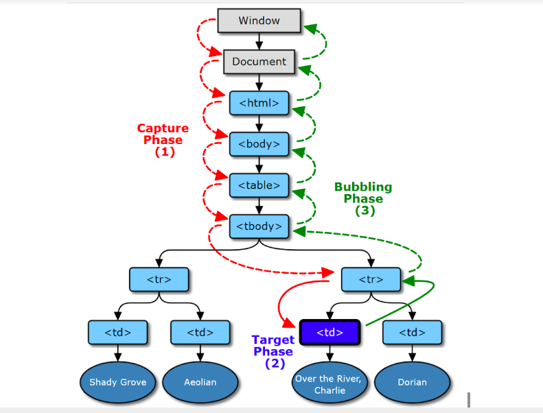

이벤트 이야기에 앞서 다른 이야기를 해볼까 한다.

## 브라우저-웹 아키텍쳐

> “How is JavaScript asynchronous and single-threaded ?” The short answer is that JavaScript language is single-threaded and the asynchronous behaviour is not part of the JavaScript language itself, rather they are built on top of the core JavaScript language in the browser (or the programming environment) and accessed through the browser APIs. (출처 - [medium, Javascript Event Loop Explained](https://medium.com/front-end-weekly/javascript-event-loop-explained-4cd26af121d4))

(직역)자바스크립트는 어떻게 비동기적이면서 싱글-스레드 기반일 수 있을까? 이에 대한 답은 바로 비동기와 싱글-스레드라는 것들이 자바스크립트 언어 자체의 특성이 아니라 **브라우저 및 프로그래밍 환경에서의 자바스크립트 언어가 쌓아 올린 결과물이며 브라우저 API를 통해 접근할 수 있다.**

그렇다면 자바스크립트는 **애초에 비동기적이지 않거나 싱글 스레드 기반 언어가 아니라는 것일까?**

<figure>
  
  <figcaption>출처 - https://medium.com/front-end-weekly/javascript-event-loop-explained-4cd26af121d4</figcaption>
</figure>

위 이미지는 브라우저 구성요소를 나타낸다.

1. 힙 : 객체들은 힙에 할당되며, 이들은 객체 실제 데이터가 차지하는 메모리를 가리키는 이름이다.
2. 스택 : 자바스크립트가 싱글 스레드 기반 언어라는 것을 증명하는 셈이다. 함수 호출이 `frame`의 스택을 기반으로 이루어진다. (Operation System - Memory management 개념 중 하나)
3. 브라우저 / 웹 API : 웹 브라우저에 내장되어 있고 브라우저 및 컴퓨터에 데이터를 나타내거나, 복잡한 작업을 할 때에 사용된다. 자바스크립트 기반으로 구축되었으며 우리 개발자들의 자바스크립트 코드 사용에 초능력(`extra superpowers`)를 제공해준다!
4. 콜백 큐(이벤트 큐) : 각종 비동기 코드가 푸시(저장, pushed to)되는 공간이다. 실행을 기다리게 된다.
5. 이벤트 루프 : 메인 스택에 실행될 프레임(함수)가 있는지 없는지를 `countinously`하게 체크한다. 실행될 프레임이 없으면 **콜백 큐를 체크한다.** 콜백 큐에 실행될 코드가 있으면 이를 메인 스택으로 가져온다.
6. 잡 큐(Job queue) : 이미지에는 없지만 ES6에 프라미스가 도입되며 생긴 개념이다. 프라미스의 `.then()` 인자로 전달되는 콜백 함수 방식에서 사용된다. `then` 방식을 `thenable`이라고도 표현한다. `then`메서드의 콜백은 잡 큐에 추가되며 프라미스가 리턴되거나 `resolve`되면 실행된다.

웹 API의 경우 한 예시로 위치정보를 얻는 API 사용 시 저수준(lower-level)작업을 특정 하드웨어와 커뮤니케이션을 통해 처리해야할 텐데 이러한 것들이 **웹 API라는 것을 통해 추상화된 것이다.**

## 브라우저-웹 아키텍쳐 (코드)

다음 코드를 보고 출력 결과를 예상해보자.

```javascript
function func1() {
    console.log('function 1');
    func2();
}

function func2() {
    setTimeout(function () {
        console.log('function 2');
    }, 0);

    func3();
}

function func3() {
    console.log('function 3');
}

func1();
```

예상되는 위 코드의 출력 결과는 다음과 같다.

1. `function 1`
2. `function 2` - `setTimeout`의 대기 시간이 0이므로 곧바로 출력된다.
3. `function 3`

하지만, 실제 출력 결과는 다음과 같다.

1. `function 1`
2. `function 3`
3. `function 2`

위와 같은 출력 결과가 나타나는 이유를 분석해보자.

## 비동기 코드의 실행

1. `func1`함수가 호출되며 콜 스택에 추가된다
2. `console.log('function 1')`이 콜 스택에 추가된 후, 콘솔에 결과를 출력한 뒤 스택에서 제거된다.
3. `func2`를 호출한다. 콜 스택에 추가된다.
4. `setTimeout` 함수가 콜 스택에 추가된다. 이 함수는 웹 API를 사용하기 때문에 컨트롤을 외부로 넘기고 콜 스택에 추가된 프레임을 제거한다.
5. `func3` 함수를 호출한다. 콜 스택에 추가된다. 백그라운드에서 `setTimeout`과 관련된 API 작업이 브라우저에서 처리되고 있다. (타이머 인자값이 0이기 때문에 사실은 외부로 전달과 동시에 끝난 작업이지만, 비동기적인 양상을 더 과장하여 설명한 것)
6. `console.log('function 3')`가 콜 스택에 추가된 후 콘솔에 결과를 출력하고 다시 제거된다. 그 동안 `setTimeout` API는 콜백 큐에 `console.log('function 2')`를 추가해놓는다.
7. `console.log('function 3')`가 스택에서 제거된 후 차례로 `func2`, `func1` 함수가 스택에서 제거된다.
8. 모든 함수가 콜 스택에서 제거된 후에야 콜백 큐의 코드가 실행되어, `console.log('function 2')`가 최종적으로 출력된다.

여기서 중요한 점은 **콜백 큐의 코드가 호출 스택의 함수들이 모두 실행 완료된 후에야 실행된다는 것이다.**

`setTimeout`함수의 지연 시간에 대한 인자값이 **콜백이 실행되는 정확한 지연 시간을 뜻하는 것이 아니라, 콜백이 실행되기 위한 최소 지연 대기 시간을 의미하는 것이다.**

> So the delay parameter in setTimeout(function, delayTime) does not stand for the precise time delay after which the function is executed. It stands for the minimum wait time after which at some point in time the function will be executed.

<figure>
  
  <figcaption>비동기 코드 처리 흐름</figcaption>
</figure>

콜 스택이 완전히 텅 빌때까지 콜백 큐의 함수가 스택에 추가되지 않는 것은 다음의 코드를 통해 확인할 수 있다.

```javascript
function funcA() {
    console.log('A');

    funcC();
}

function funcB() {
    setTimeout(() => {
        console.log('B');
    }, 0);
}

function funcC() {
    console.log('C');
}

funcB();
funcA();
```

이러한 현상은 DOM이벤트 핸들러에도 동일하게 적용된다. `addEventListener` 함수의 인자로 콜백 함수가 전달되기 때문이다. 이벤트에 따른 콜백 함수가 콜백 큐에 등록된 후 스택이 비어있을 때 콜백 큐에서 스택으로 해당 함수가 이동한다.

## 이벤트 핸들러 내부의 this

이제부터 이벤트 이야기를 시작해보겠다.

### 인라인 이벤트 핸들러

인라인 이벤트 핸들러는 html 요소에 인라인 형식으로 콜백함수를 등록하는 방식이다. **관심사의 분리 원칙에 따라 이 방식은 사용하지 말아야 할 방식이다.**

```html
<button onclick="foo()">Click me!</button>
```

인라인 이벤트 핸들러 방식에서의 `this`는 전역객체 `window` 를 가리킨다.

<button onclick="foo()">Click me!</button>

<script>
  function foo(){
    alert(this);
  }
</script>

### 프로퍼티 방식 이벤트 핸들러

분리된 스크립트 태그에 이벤트 감지 코드를 작성한다. `GlobalEventHandlers`의 `onclick` 등의 코드를 기반으로 한다. 프로퍼티 방식 이벤트 핸들러에서 `this`는 이벤트와 바인딩된 HTML요소를 가리킨다.

아래 코드를 콘솔창에 입력해본 뒤 현재 페이지 사이드바 메뉴 TIL을 클릭해보자.

```javascript
const myElem = document.querySelector('.sidebar-heading');

myElem.onclick = function (e) {
    console.log(this); // <button>...</button>
    console.log(e.currentTarget); // <button>...</button>
    console.log(this == e.currentTarget); // true
};
```

### addEventListener 이벤트 핸들러

`addEventListener` 메서드는 다음의 형태를 갖는다.

```javascript
EventTarget.addEventListener('이벤트 타입', 콜백함수, 캡쳐링 여부);
```

콜백 함수는 인라인 형식으로 작성해도 된다. 캡쳐링 및 버블링을 지원하며 이에 대해서는 후술한다. 참고로, 세 번째 파라미터 캡쳐링 여부는 디폴트 값으로 `false`가 전달된다.

`addEventListener` 메서드에서의 `this`는 이벤트 리스너에 바인딩된 요소를 가리킨다. 아래 코드를 콘솔 창에 입력한 뒤 현재 페이지 TIL메뉴를 클릭해보자.

```javascript
const myElem = document.querySelector('.sidebar-heading');

myElem.addEventListener('click', function (e) {
    console.log(this);
    console.log(e.currentTarget);
    console.log(this == e.currentTarget);
});
```

## 이벤트 전파

<figure>
  
  <figcaption>Figure 1: Copyright © 2016 World Wide Web Consortium, (MIT, ERCIM, Keio, Beihang)</figcaption>
</figure>

자바스크립트의 이벤트는 특정 기능을 발동시키거나 특정 행동을 유발할 수 있는 `occurrences`(발생)라고 정의할 수 있다.

이벤트의 전파는 **이벤트가 DOM트리를 어떻게 다니는 지에 대해 나타낸다.**

### 이벤트 캡쳐링과 버블링

버블링과 캡쳐링은 이벤트 전파의 단계이다. 버블링은 **이벤트가 이벤트 타겟으로부터 루트까지 이동하는 것을 나타낸다.** 반면 캡쳐링은 **이벤트가 루트로부터 이벤트 타겟까지 이동하는 것을 나타낸다.**

:::warning
버블링과 캡쳐링을 이벤트 전파의 단계로 표현한 이유가 무엇일까? 바로 두 메커니즘은 따로 이루어지는 것이 아니라 **캡쳐링으로 시작하여 버블링으로 끝나기 때문이다.** 후술할 내용들을 계속해서 읽어보자.
:::

이벤트 타겟은 특정 이벤트가 발동(트리거)된 DOM노드이다. 루트는 **이벤트 타겟의 최상위 부모이다.** 일반적으로 `document`를 가리키게 된다.

위에서 언급했듯 `addEventListener` 메서드는 세 번째 파라미터로 캡쳐링 여부를 전달하게 된다. (캡쳐링은 일반적으로 사용되지 않는 이벤트 전파 방식이다.)

버블링은 이벤트 발동 후 루트로부터 타겟까지 내려오며 **동일한 타입의 이벤트를 트리거 조건으로 갖는 이벤트 핸들러 모두를 발동시킨다.**

```html
<body>
    <p>P Tag</p>
    <button>button tag</button>
    <div>
        Div Tag

        <p>
            P Tag

            <button>Button Tag</button>
        </p>
    </div>

    <script>
        const p = document.querySelector('p');
        const button = document.querySelector('button');
        const div = document.querySelector('div');

        p.addEventListener('click', () => {
            console.log('P');
        });
        button.addEventListener('click', () => {
            console.log('button');
        });

        div.addEventListener('click', () => {
            console.log('div');
        });
    </script>
</body>
```

외부 에디터를 통해 위 코드를 작성 및 실행한 뒤 버튼을 클릭하면 콘솔 창에 div, P, button 문자열이 모두 출력되는 것을 확인할 수 있을 것이다. 버블링이 이루어진 것이다.

캡쳐링 흐름을 알아보자.

```html
<body>
    <p>P Tag</p>
    <button>button tag</button>
    <div>
        Div Tag

        <p>
            P Tag

            <button>Button Tag</button>
        </p>
    </div>

    <script>
        const p = document.querySelector('p');
        const button = document.querySelector('button');
        const div = document.querySelector('div');

        p.addEventListener(
            'click',
            () => {
                console.log('P');
            },
            true
        ); // 캡쳐링

        button.addEventListener('click', () => {
            console.log('button');
        }); // 버블링

        div.addEventListener('click', () => {
            console.log('div');
        }); // 버블링
    </script>
</body>
```

**캡쳐링으로 시작해 버블링으로 끝난다는 대원칙에 따라** 위 코드의 흐름을 분석해보자.

1. 클릭 이벤트 트리거 후 루트(document)로부터 이벤트 캡쳐링을 시작한다.
2. `div`태그에 클릭 이벤트 핸들러가 등록되어 있지만 **버블링이기 때문에** 넘어간다.
3. `p` 태그에 등록된 이벤트 리스너가 **캡쳐링이므로** 이벤트 핸들러를 실행한다.
4. `button`태그는 이벤트 트리거의 타겟이므로 이벤트 핸들러를 실행한다.
5. 캡쳐링이 끝났고, 버블링이 이후 진행된다.
6. `p` 태그는 이벤트 트리거가 캡쳐링으로 이미 완료되었다.
7. `div`태그의 이벤트 리스너가 버블링으로 등록되었으므로 이벤트 핸들러를 실행한다.
8. 이후 `document`까지 버블링이 계속해서 진행된다.

## stopPropagation 1

이벤트 전파를 멈추기 위해서는 `event.stopPropagation()` 메서드를 사용하면 된다.

```html
<body>
    <div id="container">
        <button id="button">click me!</button>
    </div>

    <script>
        function first() {
            event.stopPropagation(); // 버블링 중에 이벤트 전파 중단
            console.log(1);
        }
        function second() {
            console.log(2);
        }
        var button = document.getElementById('button');
        var container = document.getElementById('container');
        button.addEventListener('click', first);
        container.addEventListener('click', second);
    </script>
</body>
```

원래라면 버블링으로 인해 출력결과가 1,2가 나와야할 것이 `stopPropagation`으로 인해 1만 콘솔에 출력되게 된다.

```html
<body>
    <div id="container">
        <button id="button">click me!</button>
    </div>

    <script>
        function first() {
            console.log(1);
        }
        function second() {
            event.stopPropagation(); // 캡쳐링 중에 이벤트 전파 중단
            console.log(2);
        }
        var button = document.getElementById('button');
        var container = document.getElementById('container');
        button.addEventListener('click', first);
        container.addEventListener('click', second, true); // 캡쳐링 true
    </script>
</body>
```

위 코드는 캡쳐링 도중에 이벤트 전파가 중단되어 출력결과가 2만 나타나게 된다.

## stopPropagation 2

```html
<body>
    <div id="container">
        <button id="button">click me!</button>
    </div>

    <script>
        function first() {
            console.log(1);
        }
        function second() {
            console.log(2);
        }
        function third() {
            console.log(3);
        }
        var button = document.getElementById('button');
        var container = document.getElementById('container');
        button.addEventListener('click', first);
        button.addEventListener('click', second);
        container.addEventListener('click', third);
    </script>
</body>
```

`addEventListener`방식의 이벤트 핸들러는 한 요소에 여러 이벤트를 등록할 수 있다. 위와 같이 동일한 버튼 요소에 `first`, `second` 이벤트 트리거에 대한 콜백을 등록한 시나리오를 생각해보자.

버튼 클릭 후 출력 결과는 이벤트 버블링으로 인해 1,2,3이 될 것이다.

```html
<body>
    <div id="container">
        <button id="button">click me!</button>
    </div>

    <script>
        function first() {
            event.stopPropagation();
            console.log(1);
        }
        function second() {
            console.log(2);
        }
        function third() {
            console.log(3);
        }
        var button = document.getElementById('button');
        var container = document.getElementById('container');
        button.addEventListener('click', first);
        button.addEventListener('click', second);
        container.addEventListener('click', third);
    </script>
</body>
```

위와 같이 `first` 이벤트핸들러 콜백함수에 stopPropagation 메서드를 삽입하면 버튼요소로부터 버블링이 중단되어 1,2만 출력된다. 그렇다면 `first` 콜백함수가 등록된 이벤트 핸들러가 트리거되자마자 이벤트 전파를 중단할 수도 있을까? 바로 `event.stopImmediatePropagation()` 메서드를 사용하면 된다.

```html
<body>
    <div id="container">
        <button id="button">click me!</button>
    </div>

    <script>
        function first() {
            console.log(1);
        }
        function second() {
            event.stopImmediatePropagation();
            console.log(2);
        }
        function third() {
            console.log(3);
        }
        var button = document.getElementById('button');
        var container = document.getElementById('container');
        button.addEventListener('click', first);
        button.addEventListener('click', second);
        container.addEventListener('click', third);
    </script>
</body>
```

위 코드의 출력결과로 1,2가 나타나게 된다.

:::tip
참고로, 같은 요소에 등록된 이벤트 리스너라도 그 순서에 따라 이벤트 전파 여부가 달라진다. 위에서 `stopImmediatePropagation()`메서드를 first 콜백함수로 이동하면 출력결과가 1만 나타나게 된다.
:::

## 이벤트 위임

중복되는 하위 요소들에 대해 모두 같은 이벤트를 적용시키고 싶으면 어떻게 해야할까? 매번 이벤트 리스너를 등록하는 것은 하드코딩이어서 **요소가 동적으로 추가될 경우 이벤트를 감지하지 못한다.**

이벤트 위임은 전체 자식 요소에 각각 이벤트 핸들러를 바인딩하지 않고 **하나의 부모 요소에 이벤트 핸들러를 바인딩하는 방법이다.** 특별한 코드가 있는 것은 아니고, 이벤트 코드 작성에 대한 방법론이라고 생각하면 된다.

```html
<body>
    <div id="container">
        <li class="list-1">Hello!</li>
        <li class="list-2">Hello!</li>
        <li class="list-3">Hello!</li>
        <li class="list-4">Hello!</li>
        <li class="list-5">Hello!</li>
        <li class="list-6">Hello!</li>
    </div>

    <script>
        const container = document.querySelector('#container');

        container.addEventListener('click', () => {
            console.log(event.target.className + ' occured Event!');
        });
    </script>
</body>
```

자식 요소 `li`태그로부터 이벤트가 트리거 되어 전역객체부터 이벤트 타겟까지 캡쳐링 후, 버블링되어가는 과정에서 `container`에 버블링 이벤트 핸들러가 등록되어 있어서 이벤트 핸들러 콜백을 실행하게 된다.

이벤트 객체의 프로퍼티를 통해 **이벤트를 실제 발생시킨 요소에 접근할 수 있게 된다.**

:::tip event.target vs event.currentTarget
`event.target`은 이벤트를 실제 트리거 한 요소를 나타내고, `event.currentTarget`은 이벤트 핸들러가 부착된 요소를 나타낸다.

위의 이벤트 위임 예제코드를 바탕으로 구분해보면 `li`태그 클릭 시 `event.target`은 클릭된 `li`태그를 나타내고, `event.currentTarget`은 이벤트 트리거 후 버블링 되어 이벤트 핸들러를 실행하게 된 `container`를 나타낸다.
:::

## Reference

1. [Medium - Javascript Event Loop Explained](https://medium.com/front-end-weekly/javascript-event-loop-explained-4cd26af121d4)
2. [Poimeweb - Event](https://poiemaweb.com/js-event#reference)
3. [DEV - If Javascript is single threaded, How is it asynchronous?](https://dev.to/bbarbour/if-javascript-is-single-threaded-how-is-it-asynchronous-56gd)
4. [Medium - Understanding event loop, call stack, event & job queue in javascript](https://medium.com/@Rahulx1/understanding-event-loop-call-stack-event-job-queue-in-javascript-63dcd2c71ecd)
5. [loginradius - JavaScript Events: Bubbling, Capturing, and Propagation](https://www.loginradius.com/blog/async/javascript-events-bubbling-capturing-and-propagation/)
