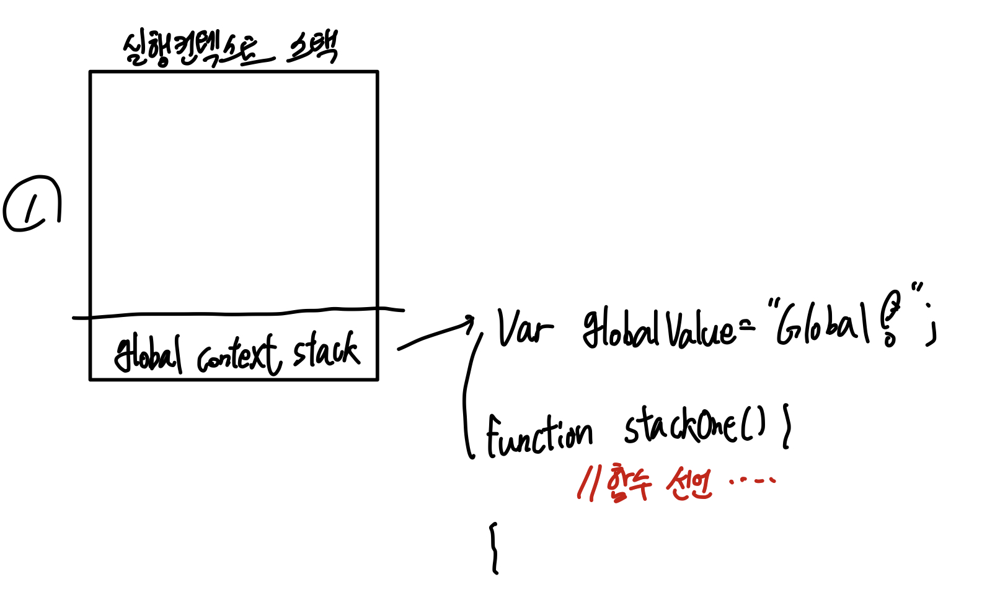
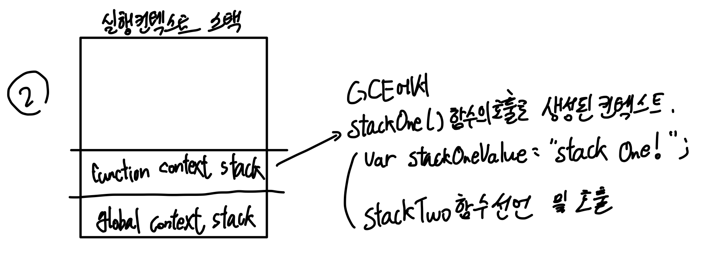
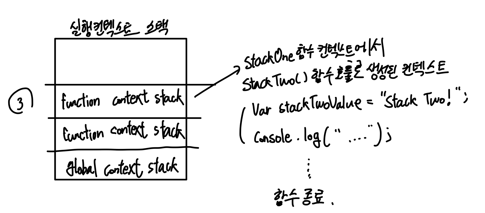

## 실행 컨텍스트

> Execution context (EC) is defined as the environment in which the JavaScript code is executed. By environment, I mean the value of this, variables, objects, and functions JavaScript code has access to at a particular time. - 출처: [medium - Execution context, Scope chain and JavaScript internals](https://medium.com/@happymishra66/execution-context-in-javascript-319dd72e8e2c)

(직역)자바스크립트의 실행 컨텍스트(EC)는 자바스크립트 코드가 실행되는 환경을 의미한다. 여기서 환경이라 함은, 자바스크립트의 변수, `this`, 객체, 함수의 특정 시간(particular time)에 접근할 수 있는 값을 의미한다.

> ECMAScript 스펙에 따르면 실행 컨텍스트를 실행 가능한 코드를 형상화하고 구분하는 추상적인 개념이라고 정의한다. 좀 더 쉽게 말하자면 실행 컨텍스트는 실행 가능한 코드가 실행되기 위해 필요한 환경 이라고 말할 수 있겠다. - 출처: [Poimeweb - Execution Context](https://poiemaweb.com/js-execution-context)

우선 이론적인 부분을 쭉 알아보자. 실행 컨텍스트의 타입은 세 가지로 나눠진다.

1. 전역 실행 컨텍스트
2. 함수 실행 컨텍스트
3. eval 실행 컨텍스트 - `eval` 함수 내의 실행 컨텍스트이다.

### 전역 실행 컨텍스트(GEC)

전역 실행 컨텍스트는 디폴트 실행 컨텍스트이다. 브라우저에 파일이 로드될 때에 자바스크립트 코드 실행이 시작되는 시점의 컨텍스트이다. 함수, 객체에 정의되어 있지 않은 코드는 모두 전역 컨텍스트에 속한다. 자바스크립트는 **싱글 스레드 언어이기 때문에** 전역 실행 컨텍스트는 오직 하나이다.

### 함수 실행 컨텍스트(FEC)

함수 실행 컨텍스트는 자바스크립트 엔진이 함수 호출을 발견할 때마다 생성되는 컨텍스트이다. 함수마다 실행 컨텍스트를 갖기 때문에 JS 프로그램 통틀어 하나 이상의 FEC이 존재한다. 함수 실행 컨텍스트 내의 코드는 전역 실행 컨텍스트 코드에 접근할 수 있지만, 그 반대는 적용되지 않는다.

별도의 바인딩 작업이 없을 시, 함수 실행 컨텍스트에서의 `this`는 `strict mode`에서 `undefined`를 참조하고 `non-strict mode`에서는 `window`를 참조한다.

### 실행 컨텍스트 스택(ECS)

실행 컨텍스트는 스택 자료구조를 따른다. 따라서 LIFO(Last-in-First-out)규칙을 따른다. 자바스크립트 파일 로드 후 코드가 실행되면 먼저 전역 실행 컨텍스트가 스택에 쌓인다. 이후 자바스크립트 엔진이 함수를 만날 때마다 함수 실행 컨텍스트를 스택에 쌓는다. 자바스크립트 엔진은 스택에 가장 마지막에 쌓인 함수를 실행하며, 해당 함수의 실행이 종료되면 스택의 `pop`으로 함수 실행 컨텍스트 하나를 제거한다.

몇 가지 함수의 중첩을 통해 실행 컨텍스트가 쌓이는 과정을 알아보자.

```javascript
// global scope
var globalValue = "Global!";

function stackOne(){
  var stackOneValue = "Stack One!";
  
  function stackTwo(){
    var stackTwoValue = "Stack Two!";
    
    console.log("GEC : ", globalValue);
    console.log("FEC one : ", stackOneValue);
    console.log("FEC two : ", stackTwoValue);
  }
  
  stackTwo();
}

stackOne();

console.log("End");
```

<figure>



</figure>

실행 컨텍스트 스택의 흐름은 다음과 같다.

1. 전역 실행 컨텍스트가 스택에 쌓인다. 전역 변수 `globalValue`와 `stackOne`함수의 선언이 이루어진다.
2. 전역 실행 컨텍스트에서 `stackOne`함수의 호출부를 만나 그 즉시 함수 실행 컨텍스트가 스택에 하나 쌓인다. 해당 컨텍스트에 `stackOneValue` 지역변수와 `stackTwo`함수 선언이 이루어진다.
3. `stackOne` 컨텍스트에서 `stackTwo`함수 호출부를 만나 `stackTwo` 함수 실행 컨텍스트가 스택에 쌓인다. 지역변수 `stackTwoValue` 선언과 `console.log`함수들을 실행한다.
4. `stackTwo`함수 내부를 전부 실행한 뒤 `stackTwo` 함수 실행 컨텍스트는 스택에서 `pop out`된다.
5. `stackTwo` 함수 컨텍스트가 스택에서 제거된 후 `stackOne` 함수 나머지가 실행된다. 위 코드에서는 별다른 코드가 없기 때문에 그 즉시 종료된다.
6. `stackOne`함수 종료 후 해당 함수 실행 컨텍스트가 스택에서 제거된다. 최종적으로 `console.log("End")` 코드가 실행된다.

:::warning
전역 실행 컨텍스트는 브라우저를 닫거나 웹 사이트에서 나갈 때까지 유지된다.
:::

## 실행 컨텍스트의 생성

실행 컨텍스트는 다음 두 단계를 통해 이루어진다.

1. 생성 단계(Creation phase)
2. 실행 단계(Execution phase)

### 생성 단계 (Creation phase)

생성 단계에 자바스크립트 엔진은 다음 작업들을 처리한다.

1. **활성 객체 또는 변수 객체를 생성한다.** : 활성 객체는 함수, 내부 함수, 변수의 선언부 정보를 담는다. `__proto__` 프로퍼티를 갖지 않는 특별한 객체이다.
2. **스코프 체인을 생성한다.** : 현재 함수 내에 존재하는 변수 객체들의 스코프체인을 초기화한다. 이는 글로벌 컨텍스트에 있는 변수 객체들도 동일하게 적용되는 작업이다.
3. **this 참조값을 정의한다.** : 스코프 체인 초기화 후에 `this` 참조값을 정의한다.

함수 호출 후 본격적인 코드의 실행 전, 자바스크립트 엔진은 `executionContextObj`(실행 컨텍스트 객체)를 생성한다. 스택에 쌓이는 실행 컨텍스트를 나타내는 객체를 나타낸다.

```javascript
//출처 - https://medium.com/@happymishra66/execution-context-in-javascript-319dd72e8e2c
function funA (a, b) {
  var c = 3;
  
  var d = 2;
  
  d = function() {
    return a - b;
  }
}


funA(3, 2);
```

```javascript
executionContextObj = {
  variableObject: {}, // 컨텍스트 내부의 변수들, 객체들, 내부함수들
  scopeChain: [], // 컨텍스트 내부 변수들의 스코프체인
  this // 컨텍스트의 this
}
```

`executionContextObj`의 `variableObject`, 즉 변수 객체는 다음의 프로퍼티들을 갖는다.

```javascript
variableObject = {
  argumentObject: {
    0: a,
    1: b,
    length: 2
  },
  a: 3,
  b: 2,
  c: undefined,
  d: undefined
}
```

변수 객체 (Variable Object/VO)는 자바스크립트 엔진에 의해 다음의 프로퍼티들로 구성된다.

1. `ArgumentObject` : 인자 정보들을 모아두는 객체이다. `length`프로퍼티를 갖는다.(인자의 개수)
2. 함수 내의 활성 객체, 변수 객체를 프로퍼티로 생성하고 이들을 `undefined`로 초기화한다. 인자들도 함수 내에서는 변수취급이기 때문에 VO의 프로퍼티로 생성된다.
3. 현재 함수 실행중에 자바스크립트 엔진이 또 다른 함수 선언부를 만나게 되면 함수의 이름을 새 프로퍼티로 현재 VO에 추가한다. 함수 정의는 **힙 메모리에 저장되며, 실행 컨텍스트 스택에 저장되지 않는다.** 함수이름 프로퍼티는 힙 메모리에 저장되어 있는 함수 선언부를 참조한다. `undefined`로 초기화 되어있다가 함수 선언부를 만나면 위의 작업을 처리한다.

:::warning 변수 선언부 주의점
`var`, `let`, `const`등의 키워드를 통해 선언하지 않은 변수들에 대해 자바스크립트 엔진은 생성 단계에서 이들을 무시하게 된다. 생성 단계를 통해 VO 프로퍼티를 모두 추가한 뒤, 실행 단계에서 현재 컨텍스트의 코드를 쭉 다시 스캔하게 되는데 이때 키워드를 통한 선언이 이루어지지 않은 변수들에 대해 이때 프로퍼티 추가와 더불어 값 초기화가 한번에 이루어진다.
:::

### 실행 단계(Execution phase)

실행 단계에서는 자바스크립트 엔진이 함수를 쭉 읽고 VO의 변수 값들을 업데이트한다. 함수의 인자를 제외한 나머지 지역 변수들은 현재 `undefined`상태로 초기화 되어 있다.

```javascript
variableObject = {
  argumentObject: {
    0: a,
    1: b,
    length: 2
  },
  a: 3,
  b: 2,
  c: 3,
  d: undefined
}
```

`d` 프로퍼티는 이후 힙 메모리에 저장되어 있는 `function() {return a - b;}` 함수를 참조하게 된다.

## VO/AO 분석

전역 컨텍스트냐, 함수 컨텍스트냐에 따라 실행 컨텍스트의 VO가 가리키는 대상은 달라진다. 전역 컨텍스트일때의 VO는 전역 객체(Global Object, GO - window객체)를 가리키고, 함수 컨텍스트일때의 VO는 활성 객체 (Activation Object, AO)를 가리킨다.

```javascript
a = 1;

var b = 2;

cFunc = function(e) {
  var c = 10;
  var d = 15;
  
  a = 3
  
  function dFunc() {
    var f = 5;
  }
  
  dFunc();
}

cFunc(10);
```

위 코드를 보고 전역 컨텍스트부터 VO의 내부 프로퍼티 구성이 어떻게 이루어지는지 분석해보자.

```javascript
executionContextObj = {
  variableObject: {}, 
  scopeChain: [],
  this
}
```

위와 같은 형태로 표현하자.

### 1. 전역 컨텍스트

1. **line 1** - 변수 선언이 아니므로 자바스크립트 엔진은 생성 단계에서 별 다른 작업 없이 넘어간다.
2. **line 3** - 변수 `b`를 `variableObject`프로퍼티로 추가하고 `undefined`로 초기화한다.
3. **line 5** - 변수 `cFunc`는 함수 선언부를 만나게 된다. 함수 정의부는 힙 메모리에 저장되며, `cFunc`는 힙 메모리의 함수 정의부를 참조한다.
4. **line 18** - `cFunc(10)` 함수 호출은 생성 단계에서 작업으로 처리하지 않는다.

생성단계 이후의 실행 컨텍스트 결과물은 다음과 같다.

```javascript
globalExecutionContextObj = {
  variableObject: {
    argumentObject: {
      length: 0
    },
    b: undefined,
    cFunc: pointer to cFunc definition
  },
  scopeChain: [global execution context variable object],
  this: value of this
} 
```

이후 실행 단계에서의 처리는 다음과 같은 단계로 이루어진다.

1. **line 1** - `a=1`을 보고 글로벌 실행 컨텍스트 객체의 VO 내에 `a` 프로퍼티가 있는 지 확인한다. 현재 없는 상태이기 때문에 `a`프로퍼티와 값 1을 함께 추가한다.
2. **line 3** - `var b=2;`를 보고 VO 프로퍼티 `b` 값을 2로 업데이트한다.
3. **line 18** - 함수 선언 부는 무시하여 넘어가고, `cFunc(10);` 코드를 통해 함수를 호출한다.
4. `cFunc` 함수 컨텍스트 객체를 새로 생성한다.

여기까지 **글로벌 실행 컨텍스트 객체는** 다음과 같은 결과를 갖는다.

```javascript
globalExecutionContextObj = {
  variableObject: {
    argumentObject: {
      length: 0
    },
    b: 2,
    cFunc: pointer to cFunc definition,
    a: 1
  },
  scopeChain: [global execution context variable object],
  this: value of this
} 
```

### 2. cFunc 함수 실행 컨텍스트

`cFunc`함수 호출 후 생성된 실행 컨텍스트 객체의 생성 단계부터 보자.

1. **line 5** - `cFunc`함수는 인자 `e`를 받는다. 따라서 AO의 `argumentObj`의 프로퍼티로 `e`를 추가한다. 그에 따른 `length` 프로퍼티의 값도 변경된다.
2. **line 6,7** - `c`, `d` 변수 선언을 인식하여 프로퍼티에 추가, `undefined`로 초기화해둔다.
3. **line 9,11,15** - 컨텍스트 생성 단계에서는 건너뛴다.

```javascript
cFuncExecutionContextObj = {
  activationObj: { //variableObject와 동일
    // 함수 실행 컨텍스트이므로 VO가 아닌 AO로 표기
    argumentObject: {
      0: e,
      length: 1
    },
    e: 10,
    c: undefined,
    d: undefined,
  },
  scopeChain: [cFunc variable object, Global exection context variable object],
  this: value of this
}
```

전체 코드 스캔 후, 더 이상 추가할 프로퍼티가 없으면 실행 단계에 돌입한다.

1. **line 6,7** - `c`, `d` 변수 값을 각각 10,15로 초기화한다.
2. **line 9** - `a`는 암묵적 전역 규칙에 따라 글로벌 객체의 프로퍼티로 추가된다. 이미 글로벌 객체 프로퍼티로 `a`가 존재하면 값을 업데이트 한다.
3. **line 11** - `dFunc`함수 역시 컨텍스트 프로퍼티에 없으므로 함수 정의부는 힙 메모리에 저장하고 `dFunc` 프로퍼티의 값으로 함수 정의부를 참조하는 포인터를 둔다.
4. **line 15** - `dFunc`함수 호출과 함께 새로운 함수 실행 컨텍스트가 생성된다.

실행단계를 마친 함수 실행 컨텍스트 객체 형태는 다음과 같다.

```javascript
cFuncExecutionContextObj = {
  activationObj: { //variableObject와 동일
    // 함수 실행 컨텍스트이므로 VO가 아닌 AO로 표기
    argumentObject: {
      0: e,
      length: 1
    },
    e: 10,
    c: 10,
    d: 15,
    dFunc: pointer to dFunc definition
  },
  scopeChain: [cFunc variable object, Global exection context variable object],
  this: value of this
}
```

### 3. dFunc 함수 실행 컨텍스트

`dFunc`함수 호출 후 생성된 실행 컨텍스트 객체의 생성 단계부터 보자.

1. **line 12** - 변수 f의 선언을 보고 AO 프로퍼티에 추가한다.

```javascript
dFuncExecutionContextObj = {
  activationObj: {
    argumentObject: {
      length: 0
    },
    f: undefined
  },
  scopeChain: [...],
  this: value of this
}
```

실행 단계 이후의 객체 최종 결과물은 다음과 같다.

```javascript
dFuncExecutionContextObj = {
  activation: {
    argumentObject: {
      length: 0
    },
    f: 5,
  },
  scopeChain: [...],
  this: value of this
}
```

## Scope chain 프로퍼티

> Scope chain also consists of the current function execution object.

스코프 체인은 현재의 함수 실행 컨텍스트의 VO로 이루어진다. 작업중인 함수 실행 컨텍스트 기준으로 생각해보자. 현재 함수 실행 컨텍스트가 생성단계에 있을 때에 만들어진 스코프 체인은 **중첩된 내부 함수를 아직 호출하지 않았기 때문에 새로운 함수 실행 컨텍스트를 스택에 쌓지 않은 상태이다.** 따라서 스코프 체인은 현재 실행 컨텍스트, 자신을 호출한 호출자 함수 실행컨텍스트, 이후 쭉 거슬러 올라가 글로벌 실행 컨텍스트까지 도달하게 되는 것이다.

```javascript
a = 1;

var b = 2;

cFunc = function(e) {
  var c = 10;
  var d = 15;
  
  a = 3
  
  function dFunc() {
    var f = 5;
  }
  
  dFunc();
}

cFunc(10);
```

위 코드를 다시 봐보자. `cFunc`함수 기준 실행 컨텍스트 스코프 체인은 어떻게 구성되겠는가?

```text
scopeChain = [cFunc execution context VO, global execution context VO]
```

자바스크립트 엔진은 변수 접근 시 스코프 체인을 확인하여 변수를 찾게 된다. 글로벌 스코프의 `b` 변수를 `dFunc`함수 내에서 출력하기 위해 스코프 체인을 참고하여 `dFunc exectution context VO`, `cFunc execution context VO`, `global execution context VO`를 차례로 순회한다.

`cFunc`함수 실행 컨텍스트 기준으로 스코프체인은 `cFunc execution context VO`, `global exeuction VO`밖에 없기 때문에 `dFunc`함수 내의 변수에는 접근할 수 없게 되는 것이다.

## Reference

1. [Poimeweb - Execution Context](https://poiemaweb.com/js-execution-context)
2. [Medium - Execution context, Scope chain and JavaScript internals](https://medium.com/@happymishra66/execution-context-in-javascript-319dd72e8e2c)
3. [stackoverflow - Activation and variable object in javascript?](https://stackoverflow.com/questions/6337344/activation-and-variable-object-in-javascript)