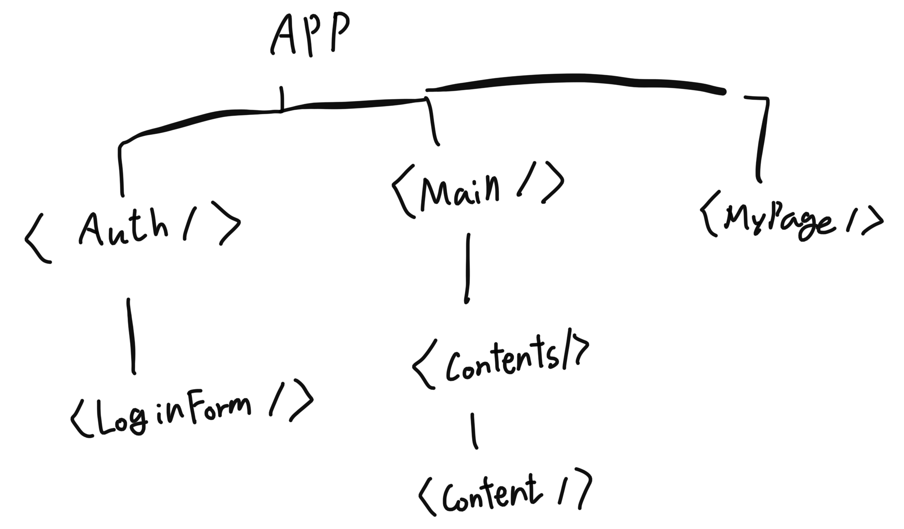

## Props Drilling

Props drilling 문제 해결을 위한 리액트 자체 API로 컨텍스트 API가 있습니다.

프롭스 드릴링 문제에 대한 이해를 위해 예시 컴포넌트 구조를 살펴보겠습니다.



위와 같은 컴포넌트들이 있다고 할때, `LoginForm` 컴포넌트에서 발생한 로그인 이벤트를 통해 액세스 토큰을 서버로부터 발급받았다고 가정하겠습니다.

다른 컴포넌트에 접근할때 이 액세스 토큰의 여부에 따라 화면 렌더링이 달라진다고 할때, 액세스 토큰 데이터를 전달하기 위해 Login 컴포넌트 -> Auth -> App -> Main -> Contents -> Content로 프롭스들이 전달되어야 합니다.

생성된 데이터에 대해 멀리 있는 컴포넌트가 접근하여 해당 데이터를 가져와 활용해야 하는 상황에 발생하는 문제인 것입니다.

전역 상태를 관리함에 있어서 가장 주요한 점은 **부모 컴포넌트로부터 프롭스를 전달받지 않는다는 것입니다.**

## Context 생성

src 폴더 아래에 통상 store라는 이름으로 폴더를 생성합니다. 지금부터 할 일은 서로 직접적으로 연결되지 않은 컴포넌트에 대해 프롭스를 직접 전달하기 위한 작업입니다.

먼저 생성한 store 폴더 내에 컨텍스트 객체를 생성합니다. 사용자 인증에 대한 프롭스를 위해 `AuthContext`라는 파일을 정의하고, 익스포트 해줍니다.

```
src
|---store
    |---AuthContext.js
|---App.js
```

위의 `AuthContext.js` 파일에서 컨텍스트를 생성하는 코드를 작성합니다. 컨텍스트 생성을 위해서는 `React.createContext()` 메서드를 호출합니다. 객체 생성시 상태값을 메서드 파라미터에 전달합니다.

사용자 로그인 상태여부를 묻는 `isLoggedIn` 속성을 객체에 추가하여 파라미터로 전달하겠습니다.

```js
import React from 'react';

const AuthContext = React.createContext({
    isLoggedIn: false,
});

export default AuthContext;
```

## Context 공급

컨텍스트 객체 생성 후 익스포트를 했으면 이를 활용할 컴포넌트에서 호출해야 합니다.

위의 App 컴포넌트의 아래에 위치한 하위 컴포넌트들이 모두 컨텍스트 상태값을 활용한다고 가정하겠습니다.

컨텍스트 객체는 그 자체로 **컴포넌트가 되지 않기 때문에,** 반드시 객체의 `Provider`를 통해 컨텍스트 프로바이더 컴포넌트를 호출해야합니다.

```javascript
import AuthContext from '../store/AuthContext';
const App = () => {
    return (
        <React.Fragment>
            <AuthContext.Provider>
                <MyPage />
            </AuthContext.Provider>
        </React.Fragment>
    );
};
```

:::tip
컨텍스트 프로바이더 컴포넌트는 리액트 프래그먼트로써의 역할도 할 수 있습니다.
:::

## Context 리스닝

컨텍스트의 데이터를 가져오고 싶다면 컨텍스트의 컨슈머 컴포넌트로 데이터를 활용할 자식 컴포넌트들을 감싸줍니다.위의 예시에서는 `MyPage`에서 컨슈머 컴포넌트를 호출하면 됩니다.

```js
import AuthContext from '../store/AuthContext';

const MyPage = () => {
    return (
        <AuthContext.Consumer>
            {(context) => {
                return <MyComponents>....</MyComponents>;
            }}
        </AuthContext.Consumer>
    );
};
```

컨텍스트 프로바이더 컴포넌트는 원래 디폴트값을 지정하여 사용하지 않습니다.

프로바이더에 `value` 프롭스를 전달하면 해당 프롭스의 값을 컨슈머 컴포넌트의 `context` 인자로 접근할 수 있습니다.

```javascript
import AuthContext from '../store/AuthContext';
const App = () => {
    return (
        <React.Fragment>
            <AuthContext.Provider value={{ isLoggedIn: false }}>
                <MyPage />
            </AuthContext.Provider>
        </React.Fragment>
    );
};
```

이때 `value` 프롭스에 하드코딩 형태로 고정된 값을 전달하는 것이 아니라 로그인에 따라 달라지는 값으로 컴포넌트 내에 상태값 관리 로직을 부여하면 더 어플리케이션답게 동작하게 됩니다.

## useContext Hook

컨텍스트 컨슈머 컴포넌트로 자식 컴포넌트를 감싸고 `context`인자로 화면 렌더링을 결정하는 방식 대신 `useContext`훅을 사용하면 코드가 훨씬 간단해집니다.

useState훅처럼 useContext훅의 반환값은 컨텍스트 객체에서 관리되는 상태값이 됩니다.

```javascript
import AuthContext from '../store/AuthContext';

const MyPage = () => {
    const context = useContext(AuthContext);
    return (
            <MyComponents>
                {context.isLoggedIn ....}
            </MyComponents>;
    );
};
```

:::tip 컨텍스트 동적 상태값
컨텍스트의 값을 동적으로 관리하기 위해서는 함수를 컨텍스트의 객체에 전달하면 됩니다. 이후 컴포넌트에서 클릭과 같은 이벤트 함수를 등록하여 해당 컨텍스트 함수를 호출할 수 있도록 합니다.
:::

컨텍스트는 맥락이라는 사전적 의미를 갖는 것에서 알 수 있듯, 컨텍스트에 감싸인 컴포넌트는 해당 맥락 안에서만 작동하게 된다는 점에서 프롭스 방식보다 기능적 자유도는 떨어지게 됩니다.

## 컨텍스트 관리 팁

컨텍스트 프로바이더를 자식 컴포넌트 단에 직접 렌더링하는 방식 대신 컨텍스트 정의 파일 내에 컨텍스트 프로바이더 컴포넌트를 생성하여 익스포트 하는 방식이 코드상으로 깔끔하게 관리될 수 있습니다.

애초에 전역상태가 필요했던 시나리오로 다시 돌아가서 그림을 살펴보겠습니다.

컨텍스트가 필요했던 이유는 서로 직접적 연관이 없는 두 컴포넌트에 프롭스를 서로 주고받기 위함이었습니다. 이때 컨텍스트를 사용하면 프롭스를 제공하는 측에서 프로바이더 컴포넌트를, 제공받는 측에서 컨슈머 컴포넌트를 렌더링하여 한 컨텍스트 내에서 프롭스를 주고받을 수 있게 됩니다.

이때 프로바이더를 렌더링할 컴포넌트에서 로그인 또는 로그아웃과 같이 사용자 인증 관련 상태값을 다룬다고 한다면 단순 상태값을 useState로 저장하는 것에서 끝나는 게 아니라 **상태값을 동적으로 변화시켜주는 핸들러 함수도 관리하게 됩니다.**

이러한 핸들러 함수들을 프로바이더 컴포넌트 내에서 관리하게 됨으로써 컨텍스트 프로바이더의 `value` 프롭스에 핸들러, 상태값들을 전달할 수 있게 됩니다.

이렇게 되면 관심사의 분리라는 원칙 하에 컴포넌트가 더 기능별로 깔끔히 쪼개질 수 있게 됩니다.

```javascript
// AuthContext.js
const AuthContext = React.createContext({
    isLoggedIn: false,
    onLogout: () => {},
    onLogout: () => {},
});

const AuthContextProvider = () => {
    const [isLoggedIn, setIsLoggedIn] = useState(false);

    const logoutHandler = () => {
        setIsLoggedIn(false);
    };

    const loginHandler = () => {
        setIsLoggedIn(true);
    };

    return (
        <AuthContext.Provider
            value={{
                isLoggedIn: isLoggedIn,
                onLogin: loginHandler,
                onLogout: logoutHandler,
            }}
        />
    );
};
```

:::tip 비주얼 스튜디오 코드 자동완성 활용하기
`React.createContext`를 통해 컨텍스트 객체를 정의할 때에 객체 프로퍼티에 앞으로 컨텍스트 프로바이더에서 `value` 프롭스에 전달할 객체 타입들을 더미 형태로 정의해두면 비주얼 스튜디오 코드의 자동완성 기능을 잘 사용할 수 있게 됩니다.

예를 들어 컨텍스트 프로바이더 컴포넌트에 `value` 프롭스로 isLoggedIn, onLogin 두 객체 프로퍼티를 전달한다고 하면 컨텍스트 객체 정의 시에 다음과 같이 코드를 작성합니다.

```javascript
const AuthContext = React.createContext({
    isLoggedIn: false, // 디폴트 값
    onLogin: () => {},
});
```

`value` 프롭스에서 `onLogin` 객체 프로퍼티가 재정의되어 자식 컴포넌트로 전달되기 때문에 자동완성 기능을 활용하기 위한 작은 팁이라고 보시면 됩니다.
:::

## Context Limitation

컨텍스트는 확장성이 떨어집니다. 아토믹하게 정의한 버튼 컴포넌트에 프롭스 형태가 아닌 로그인 / 로그아웃이라는 컨텍스트 하에 컴포넌트를 정의하게 되면 해당 기능에 갇히게 됩니다.

또한 빈번한 (빠른 속도로) 호출되는 기능을 위한 컴포넌트 제작에도 적합하지 않습니다. 이를 위한 도구로 리덕스를 사용하게 됩니다.
