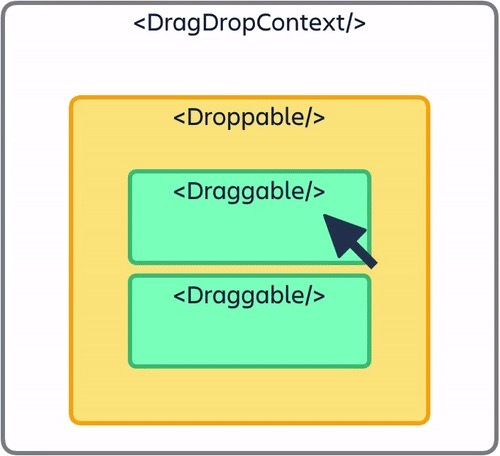

리액트에서는 DND(Drag-and-Drop) 애니메이션 구현을 해주는 라이브러리가 있다.

```sh
npm install react-beautiful-dnd
```

리액트 버전 18로 업그레이드 되면서 위 명령어로는 작동하지 않는데, 다음 옵션을 붙여 실행해야한다.

```sh
npm install react-beautiful-dnd --legacy-peer-deps
```

뒤에 붙은 `peer-deps`는 peer dependencies 패키지들에 대해 버전이 맞지 않아도 그냥 무시하고 설치하라는 옵션이다. devDependencies와는 다르게 패키지 내에서 **필수적으로 요구하지 않는 수준이기 때문에** 무시하고 설치해도 된다고 한다. 자세한 내용은 [다음 아티클을](https://blog.bitsrc.io/understanding-peer-dependencies-in-javascript-dbdb4ab5a7be) 참조하자.

:::tip react-dnd
react-beautiful-dnd는 좀 더 간단한 수준의 드래그 앤 드랍 구현에 사용된다면 `react-dnd`는 더 자유도 높게 커스터마이징 기능들을 제공한다. `react-dnd` 구현 관련 아티클은 [다음의 링크](https://velog.io/@dowon938/react-dnd-%EC%9D%B4%EC%9A%A9%ED%95%98%EC%97%AC-drag-drop-%EA%B5%AC%ED%98%84%ED%95%98%EA%B8%B0)를 참조하자.
:::

## React-beautiful-dnd



`react-beautiful-dnd`의 큰 구조는 다음과 같다.

1. `DragDropContext` 컴포넌트가 DND 동작이 이루어지는 전체 컴포넌트를 감싼다.
2. `Droppable` 컴포넌트는 DND가 이루어지는 작은 요소들을 감싸는 한 단위이다.
3. `Draggable` 컴포넌트는 실질적으로 DND 동작이 이루어지는 각 요소 단위이다.

가장 윗단에 위치한 `DragDropContext`에는 DND액션이 끝났을 때 실행될 함수를 전달해야 한다.

아래의 `Wrapper`, `Boards`, `Board`, `Card` 컴포넌트 각각은 투두리스트를 이루는 컴포넌트 요소들이다.

1. Wrapper : 가장 바깥쪽을 감싸는 컴포넌트
2. Boards : 투두리스트들 카테고리들 전체가 모여있는 큰 판이라고 생각하자.
3. Board : 투두리스트 카테고리 각각의 단위를 나타낸다.
4. Card : 각 보드에 들어갈 투두리스트 목록 하나하나를 나타낸다.

```javascript
import styled from "styled-components";
import {DragDropContext} from "react-beautiful-dnd";

const Wrapper = styled.div`
  display: flex;
  max-width: 480px;
  width: 100%;
  margin: 0 auto;
  justify-content: center;
  align-items: center;
  height: 100vh;
`;

const Boards = styled.div`
  display: grid;
  width: 100%;
  grid-template-columns: repeat(1, 1fr);
`;

const Board = styled.div`
  padding: 20px 10px;
  padding-top: 30px;
  background-color: ${(props) => props.theme.boardColor};
  border-radius: 5px;
  min-height: 200px;
`;

const Card = styled.div`
  border-radius: 5px;
  margin-bottom: 5px;
  padding: 10px 10px;
  background-color: ${(props) => props.theme.cardColor};
`;

function App(){
  
  const onDragEnd = () => {
    // 추후 정의
  }
  
  return (
    <DragDropContext onDragEnd={onDragEnd}>
    	<Wrapper>
    		<Boards>
    		</Boards>
    	</Wrapper>
    </DragDropContext>
  )
}
```

이후 한 `Boards`에 여러개의 `Board`들이 등록된다. 한 Board는 react-beautiful-dnd 컴포넌트들 중 `Droppable`컴포넌트와 1대1 매칭될 수 있다. 

각 Droppable 컴포넌트에는 ID가 등록되어야 한다.

Droppable컴포넌트 안에 여러 개의 Draggable 컴포넌트가 등록되는데 이때 Draggable 컴포넌트가 투두 리스트의 각 리스트 항목들을 의미한다. 배열 데이터를 받아와 map 메서드로 각 리스트를 부착해주면 된다.

:::warning magic 인자
`Droppable`과 `Draggable`컴포넌트는 단순 노드를 부착하는 것이 아니라 **함수 호출을 통해 그 요소들을 구성하게 된다.** 이때 함수 호출 시 인자를 꼭 전달해야 하는데, 이 인자가 바로 `magic`이다. 참고로, magic은 공식 문서에서 `provided`라고 적혀있다.

`Droppable`의 magic과 `Draggable`의 magic은 각각 그 프로퍼티 구성이 다르다.

cmd + 클릭으로 Droppable 함수의 타입 정의 파일로 이동하면 magic의 타입을 DroppableProvided에서 확인할 수 있다.

```javascript
export interface DroppableProvided {
    innerRef: (element: HTMLElement | null) => any;
    placeholder?: React.ReactElement<HTMLElement> | null | undefined;
    droppableProps: DroppableProvidedProps;
}
```

Droppable 매직은 `innerRef`, `placeholder`, `droppableProps`로 구성된다. 

innerRef는 부모 컴포넌트에서 자식 컴포넌트에 DND 액션을 직접적으로 작동시키기 위해 필요한 요소라고 생각하면 된다. ref에 대해서는 [공식 문서를](https://ko.reactjs.org/docs/refs-and-the-dom.html) 참조하자. 

placeholder는 DND가 이루어진 투두 리스트 목록 하나가 드래그 되는 동안 비워진 자리를 빈 HTML요소로 채워주는 역할을 해준다.

`droppableProps`는 Droppable 역할을 할 실질적인 컴포넌트에(이번 예시에서는 Board 컴포넌트를 의미한다.) 필요한 프롭스들이 저장되어 있다. 

:::

Droppable 컴포넌트에는 각각 droppableId값이 부여되어야 한다.

```javascript
import {DragDropContext, Droppable} from "react-beautiful-dnd";

function App(){
  
  const onDragEnd = () => {
    // 추후 정의
  }
  
  return (
    <DragDropContext onDragEnd={onDragEnd}>
    	<Wrapper>
    		<Boards>
    			<Droppable droppableId="TODO">
                  {(magic) => {
                    <Board ref={magic.innerRef} {...magic.droppableProps}>
                    </Board>
                  }}
                </Droppable>  
    		</Boards>
    	</Wrapper>
    </DragDropContext>
  )
}
```

Draggable역시 Droppable과 마찬가지로 magic인자를 전달하기 위해 컴포넌트 내부에서 함수를 호출해야한다. Draggable은 리스트 각 요소를 모두 표현해야 하므로 배열의 map메서드를 활용해야한다.

map 메서드에서 표현되는 각 Draggable은 map메서드의 key값과 draggableId값이 동일해야한다. 또한 source에서 destination으로 이동할 때의 각 Draggable요소들의 인덱스를 표현해야하므로 `index` 프로퍼티도 필수적이다. index값은 map에서 기본적으로 제공하는 `map(item, index)`를 사용하면 된다. (배열 인덱스)

```javascript
import {DragDropContext, Droppable, Draggable} from "react-beautiful-dnd";

// 투두리스트에 등록할 더미데이터
const todos = ['Study Python', 'Eat', 'Study JavaScript'];

function App(){
  
  const onDragEnd = () => {
    // 추후 정의
  }
  
  return (
    <DragDropContext onDragEnd={onDragEnd}>
    	<Wrapper>
    		<Boards>
    			<Droppable id="TODO">
                  {(magic) => {
                    <Board ref={magic.innerRef} {...magic.droppableProps}>
                      {todos.map((todo, index) => {
                        <Draggable key={todo} draggableId={todo} index={index}>
                          {(magic) => {
                            <Card ref={magic.innerRef} {...magic.draggableProps} {...magic.dragHandleProps}>
                              {todo}
                            </Card>
                          }}
                        </Draggable>
                      }}
                      {magic.placeholder}
                    </Board>
                  }}
                </Droppable>  
    		</Boards>
    	</Wrapper>
    </DragDropContext>
  )
}
```

`Draggable`과 1대1 매칭되는 컴포넌트인 Card에는 마찬가지로 `magic.innerRef`와 `...magic.draggableProps`를 전달해야하며 추가적으로 `...magic.dragHandleProps`을 전달해야한다. `dragHandleProps`는 Card 전체를 드래그 감지 대상으로 보지 않고 Card의 특정 부분을 잡아 끌 수 있도록 선택하게 해주는 프로퍼티 등이 있다.

위에서 설명했던 magic.placeholder는 `Droppable` 컴포넌트와 1대1 매칭되는 컴포넌트 (위의 예시에서는 Board) 끝에 전달해주면 된다.

## onDragEnd 정의
전체적인 DND 컴포넌트 구조는 익혔으니 실제 드래그 후 데이터 변경에 대한 로직을 구성해야한다. 컴포넌트 구조만 옳게 짜면 애니메이션 자체는 동작하게 된다.

```javascript
const todos = ['Study Python', 'Eat', 'Study JavaScript'];

function App(){
  
  const onDragEnd = () => {
    // 추후 정의
  }
  
  return (// .... 컴포넌트들);
}
```

`onDragEnd`는 DragDropContext 컴포넌트에 전달했는데, 함수 호출 시 인자가 자동으로 전달된다. 타입 정의로 이동해보면 다음과 같이 DragDropContext 컴포넌트의 프롭스 타입들이 정의되어 있다.

```javascript
export interface DragDropContextProps {
    onBeforeCapture?(before: BeforeCapture): void;
    onBeforeDragStart?(initial: DragStart): void;
    onDragStart?(initial: DragStart, provided: ResponderProvided): void;
    onDragUpdate?(initial: DragUpdate, provided: ResponderProvided): void;
    onDragEnd(result: DropResult, provided: ResponderProvided): void;
    children: React.ReactNode | null;
    dragHandleUsageInstructions?: string | undefined;
    nonce?: string | undefined;
    enableDefaultSensors?: boolean | undefined;
    sensors?: Sensor[] | undefined;
}
```

다양한 프롭스 타입들이 있지만 이 중 가져와서 사용할 타입은 `onDragEnd`함수에 대한 타입이다. 인자 타입이 `result`와 `provided`로 나뉘어 정의되어 있는데 실제로 사용하게 될 인자 타입은 `DropResult`라는 타입으로 정의되어 있다.

`DropResult`타입은 또 다른 타입을 extends한 상태로, 해당 타입은 또 다른 타입을 extends하는 방식으로 거슬러 올라가게 된다.

onDragEnd 에서 사용할 인자는 로직 구현을 먼저 생각해보면 골라낼 수 있다. 로직은 다음과 같은 흐름으로 이루어진다.
1. 특정 Draggable 요소가 선택된다. 이 요소는 source, 출발 지점 인덱스를 갖고 있다.
2. 원하는 위치까지 드래그 되어 해당위치에 안착된다. 이 지점은 destination이라는 객체 안에 인덱스 값을 갖고 있다.
3. 위 예시 코드에서의 `draggableId`에는 투두 리스트 각 항목 데이터를 지닌다. (study python, eat, study JavaScript 중 하나) `draggableId`를 onDragEnd에 전달함으로써 교체를 위한 데이터를 얻어낼 수 있다.
4. 드래그만 하고 위치 변경이 이루어지지 않을 경우 destination이 없을 수도 있다. 이에 대한 예외처리가 필요하다.

더미 데이터가 아닌 실제 투두 데이터를 Recoil atom으로 관리하는 코드를 작성해보자.

:::warning Mutation
자바스크립트와 리액트를 다룰 때에는 반드시 Mutation을 주의해야한다. 즉 원천 데이터가 변하지 않도록 데이터 복사 이후 해당 복사 데이터를 바꿔주는 코드를 작성하자.
:::

```javascript
import {useRecoilState} from "recoil";
import {todoState} from "./atoms";

function App(){
  const [toDos, setTodos] = useRecoilState(todoState);
  
  const onDragEnd = ({draggableId, source, destination}) => {
    if(!destination) return;
    
    setTodos((oldTodos) => {
      // Mutation를 방지한 코드
      const copyTodos = [...oldTodos];
      
      // 출발 지점에서 투두 하나 꺼내기
      copyTodos.splice(source.index, 1);
      
      // 도착 지점에 끼워넣기
      copyTodos.splice(destination?.index, 0, draggableId);
      
      return copyTodos;
      
    })
    
  }
  
  return (// .... 컴포넌트들
  );
}
```

## 성능 최적화
로직 구현과 기본 구조에 대해 이해가 되었으니 더 나아가 성능적인 측면을 알아볼 때가 되었다. 리액트 컴포넌트의 리렌더링 기준들 중 하나로 상태값이 변하는 경우가 있다.

현재 위의 투두 리스트는 투두 목록을 전역 상태로써 관리하고 있다. 컴포넌트 렌더링 후 드래그-앤-드랍 액션이 이루어져 배열 원소끼리의 위치가 변경될 때마다 전역상태에 변동이 생겨 컴포넌트의 리렌더링이 이루어지고 있는 것이다.

성능 최적화를 위한 목표는 바로 **바꾸고자 하는 요소 둘 사이의 위치가 바뀐 뒤 Drop 액션까지 감지 되었을 때 index 변화가 감지된 Draggable 컴포넌트들에 대해서만 리렌더링이 이루어져야 하는 것이다.** map에 전달된 모든 Draggable 컴포넌트가 리렌더링 될 필요가 없다.

이때 사용하는 것이 **리액트의 memo 함수이다.** 리액트의 memo는 기본적으로 prop이 바뀌지 않으면 컴포넌트를 렌더링 하지 말라고 선언하는 함수이다. state가 아닌 prop이다.

React.memo함수를 사용하기 위해서 Draggable 컴포넌트를 먼저 분리해보자.

```javascript
function App() {
  const [toDos, setToDos] = useRecoilState(toDoState);

  const onDragEnd = ({ draggableId, destination, source }: DropResult) => {
    if (!destination) return;
    setToDos((oldToDos) => {
      const copy = [...oldToDos];
      copy.splice(source.index, 1);
      copy.splice(destination?.index, 0, draggableId);
      return copy;
    });
  };
  return (
    <DragDropContext onDragEnd={onDragEnd}>
      <Wrapper>
        <Boards>
          <Droppable droppableId='ONE'>
            {(magic) => (
              <Board {...magic.droppableProps} ref={magic.innerRef}>
                {toDos.map((toDo, index) => (
                  // DraggableCard 컴포넌트로 분리
                  <DraggableCard key={toDo} index={index} item={toDo} />
                ))}
                {magic.placeholder}
              </Board>
            )}
          </Droppable>
        </Boards>
      </Wrapper>
    </DragDropContext>
  );
}

export default App;
```

`DraggableCard`로 분리하며, 이 컴포넌트 안에는 `Draggable`로 감싸진 Card컴포넌트가 있다.

:::warning 타입스크립트 프롭스
타입스크립트 기반에서는 프롭스를 받기 위해 먼저 인터페이스를 정의하고 구조분해 형태로 각 프롭스에 대한 타입을 선언해야한다.
:::
```javascript
// DraggableCard.tsx
import { Draggable } from 'react-beautiful-dnd';
import styled from 'styled-components';

interface IProps{
  index:number;
  item:string;
}

function DraggableCard({index, item}: IProps){
    // 컴포넌트 리렌더링 상태를 지켜본다.
    console.log(item," has rendered");
    return (
    <Draggable draggableId={item} index={index}>
      {(magic) => (
        <Card
          {...magic.dragHandleProps}
          {...magic.draggableProps}
          ref={magic.innerRef}
        >
          {item}
        </Card>
      )}
    </Draggable>
  );
}

export default DraggableCard;
```

일반적인 형태로 DraggableCard 컴포넌트를 익스포트 하면 각 DraggableCard 컴포넌트를 드래그-앤-드랍할 때에 투두 리스트 state가 변경되어 모든 DraggableCard 컴포넌트가 리렌더링 된다.

이때 `export default Draggable`이 아닌 `export default React.memo(DraggableCard)`를 하게 되면 `DraggableCard` 컴포넌트가 state변화에 리렌더링되는 것이 기본적인 원칙으로 작동하지만, 전달받은 프롭스의 값에 변화가 없다면 리렌더링을 막게 된다. 

```javascript
// DraggableCard.tsx
import React from 'react';
import { Draggable } from 'react-beautiful-dnd';
import styled from 'styled-components';

interface IProps{
  index:number;
  item:string;
}

function DraggableCard({index, item}: IProps){
    // 컴포넌트 리렌더링 상태를 지켜본다.
    console.log(item," has rendered");
    return (
    <Draggable draggableId={item} index={index}>
      {(magic) => (
        <Card
          {...magic.dragHandleProps}
          {...magic.draggableProps}
          ref={magic.innerRef}
        >
          {item}
        </Card>
      )}
    </Draggable>
  );
}

// !!!!!!!
export default React.memo(DraggableCard);
```

`DraggableCard`를 리액트 memo에 전달하게 되면 리렌더링 양상이 다음과 같이 변한다.
1. `[a,b,c,d]`의 순서로 투두 리스트 데이터가 저장되어 있다고 가정하자.
2. b->a로 투두 리스트 순서를 변경한다. 
3. 이에 따라 App컴포넌트에서 상태 변화를 감지하여 리 렌더링을 진행한다.
4. App -> DragDropContext -> Wrapper -> Boards -> Droppable -> Board -> DraggableCard 순으로 리 렌더링 대상을 찾아 나간다. 
5. 이때 DraggableCard에 전달된 프롭스인 `index`와 `item`의 변화가 투두 state의 a,b에만 이루어졌으므로 두 DraggableCard컴포넌트에 대해서만 리렌더링이 이루어진다.

로직을 다시 생각해보면, **위치가 바뀌는 두 투두 목록에 대해서만 props에 전달된 인덱스가 달라지는 것이 아니라는 것을 다시 한 번 상기하자!** `[a,b,c,d]` 투두 리스트에서 c->a로 이동하면 `[c,a,b,d]` 순서로 재배열 되는데, 이때 d의 프롭스만 변화가 없으므로 `c,a,b` 세 DraggableCard컴포넌트에 대해서만 리렌더링이 이루어지는 것이다.

:::warning React.memo()
리액트 컴포넌트 메모이제이션은 남용해서는 안된다. 자칫하면 쓰기 전 보다 성능을 더 악화시킬 수 있다. [다음의 글을](https://ui.toast.com/weekly-pick/ko_20190731) 참조하자.
:::

## 보드 간 이동
투두리스트 제작에는 같은 카테고리별 목록 순서의 변경 이외에 카테고리 별 이동 로직 구현도 필요하다.

큰 로직은 **source에서 destination으로 투두 리스트를 이동시키는데, source는 지우고 destination의 인덱스에 splice를 한다.** 로 정리할 수 있다.

먼저 해야할 것은 아톰으로 관리할 전역 투두 상태를 타입으로 정의해야하는 것이다.

```javascript
export const toDoState = atom({
  key: "toDo",
  default:{
    "To Do": ["밥먹기", "빨래하기"],
    Doing: ["파이썬 공부하기", "코테 준비하기"],
    Done: ["TIL작성하기", "잠자기"]
  }
})
```

현재 관리중인 투두 상태는 위와 같다. 한 보드만 관리할때의 상태는 배열로 관리되어 타입에 대한 변동 가능성이 존재하지 않았다. `string[]`타입으로 선언되어 있으면 `string`형 원소로 이루어진 `Array`타입만 가능했던 것이다.

하지만 위의 타입은 객체 키값과 이에 매핑되는 값에 대해 객체에 추가되는 데이터에 따라 타입이 달라질 수 있다. 예를 들어, 위의 세 키값 To Do, Doing, Done은 문자열에 이에 매핑되는 값이 `string[]` 타입으로 되어 있지만, 이후 객체에 추가되는 타입이 `number`형 키값에 `string`형 밸류가 의도치 않게 추가될 수 있다는 것이다.

이때 `atom` 함수에 제네릭을 선언하여 앞으로 추가될 여지가 있는 데이터들에 대해 타입을 재 선언 해주어야 한다.

```javascript
// 인터페이스 정의
// key : value 한 쌍에 대한 타입을 정의한다.
interface ITodoState{
  [key: string] : string[];
}

// 제네릭 선언
export const toDoState = atom<ITodoState>({
  key: "toDo",
  default:{
    "To Do": ["밥먹기", "빨래하기"],
    Doing: ["파이썬 공부하기", "코테 준비하기"],
    Done: ["TIL작성하기", "잠자기"]
  }
})
```

먼저 Board 컴포넌트를 map 메서드로 각각 다른 카테고리를 가지고 관리하기 위해 외부로 분리한다.

```javascript
function App() {
  const [toDos, setToDos] = useRecoilState(toDoState);
  
  return (
    <DragDropContext onDragEnd={onDragEnd}>
      <Wrapper>
        <Boards>
          {Object.keys(toDos).map((boardId) => (
            <Board boardId={boardId} key={boardId} toDos={toDos[boardId]} />
          ))}
        </Boards>
      </Wrapper>
    </DragDropContext>
  );
}

export default App;
```

`boardId`라는 이름으로 프로퍼티를 새로 정의하여 이 값을 가지고 droppableId를 관리하고, 자식으로 내려가 Draggable을 관리하게 된다.

중요한건 Boards컴포넌트 아래에서 각 보드들을 map으로 접근하기 위한 코드이다.

아톰에서 관리하는 toDoState는 더 이상 string형 배열이 아닌 키 값이 string이고 이에 매핑되는 값이 string형 배열인 객체 타입을 갖는다. useRecoilState으로 가져온 상태값은 배열이 아닌 객체가 되며, 각 객체를 순회하기 위해서는 `Object.keys()`메서드를 활용한다. 

`Object.keys()`메서드는 객체에 대해 키값들을 배열 형태로 반환해준다. 키값 배열에 map을 활용하여 `toDos` 배열 각 객체 프로퍼티 값 (투두리스트 카테고리 별 배열항목)을 프롭스로 전달해준다.

컴포넌트 렌더링 로직이 위와 같이 구성되었으며, 중요한건 투두리스트 항목 이동에 대한 로직이다.

이 역시 큰 로직인 source에서 destination으로 이동한다는 것을 기준으로 로직을 구성하면 된다.

`source`와 `destination`은 단순 값이 아닌 객체인데, 각각 `droppableId`와 `index`를 갖는다. 

보드 간 이동 로직 구현을 위한 차이점은 **destination의 droppableId와 source의 droppableId의 차이 여부에 달려있다.** 두 값이 같을 경우 한 보드에서 투두 리스트 이동이 이루어지는 것이고 다를 경우 다른 보드 간 투두 항목 이동이 이루어지는 것이다.

```javascript
const onDragEnd = (info: DragResult) => {
  const {destination, source, draggableId} = info;
  
  // 같은 보드에서 이동
  if(destination?.droppableId === source.droppableId){
     setTodos((allBoards) => {
    	// destination.droppableId로 인덱싱해도 됨.
    	const copyBoard = [...allBoards[source.droppableId]];
    	copyBoard.splice(source.index, 1);
    	copyBoard.splice(destination.index, 0, draggableId);
    	
    	return {
          ...allBoards,
          // 객체 키 값에 접근한다.
          [source.droppableId]: copyBoard
        }
     })
  } else {
    // 서로 다른 보드간 이동
    setToDos((allBoards) => {
      // typescript기반 예외처리
      if(!destination) return {...allBoards};
      
      const sourceCopyBoard = [...allBoards[source.droppableId]];
      const destinationCopyBoard = [...allBoards[destination.droppableId]];
      
      sourceCopyBoard.splice(source.index, 1);
      destinationCopyBoard.splice(destination.index, 0, draggableId);
      
      return {
        ...allBoards,
        [source.droppableId] : sourceCopyBoard,
        [destination.droppableId] : destinationCopyBoard
      }
    }
  }
}
```

## snapshot
Droppable과 Draggable은 함수에 대한 인자로 magic(`provided`)을 갖는데,이 외에 `snapshot`이라는 인자도 가진다. 

```javascript
export interface DroppableProps {
    droppableId: DroppableId;
    type?: TypeId | undefined;
    mode?: DroppableMode | undefined;
    isDropDisabled?: boolean | undefined;
    isCombineEnabled?: boolean | undefined;
    direction?: Direction | undefined;
    ignoreContainerClipping?: boolean | undefined;
    renderClone?: DraggableChildrenFn | undefined;
    getContainerForClone?: (() => React.ReactElement<HTMLElement>) | undefined;
    children(provided: DroppableProvided, snapshot: DroppableStateSnapshot): React.ReactElement<HTMLElement>;
}
```

`Droppable` 컴포넌트의 타입 정의를 다시 보면 타입중 `children`에 해당하는 것이 있다. `Droppable`컴포넌트 아래에서 함수를 전달하는 것을 위에서 확인하였다. 이때 전달되는 인자가 magic이었는데, 타입을 확인해보면 `DroppableStateSnapshot` 타입으로 정의된 snapshot 인자가 있다.

snapshot 인자 타입은 다음과 같다.
```javascript
export interface DroppableStateSnapshot {
    isDraggingOver: boolean;
    draggingOverWith?: DraggableId | undefined;
    draggingFromThisWith?: DraggableId | undefined;
    isUsingPlaceholder: boolean;
}
```

isDraggingOver는 드래그 된 투두 항목이 특정 Droppable영역에 오버 되었을 때 true를 반환해주는 불리언 값이고, draggingFromThisWith는 투두 항목이 기존 Droppable 영역에서 벗어났을 때의 Draggable 아이디를 받는다.

```javascript
function Board({ toDos, boardId }: IProps) {
  return (
    <Wrapper>
      <Title>{boardId}</Title>
      <Droppable droppableId={boardId}>
        {(magic, snapshot) => (
          <div
            isDraggingOver={snapshot.isDraggingOver}
            isDraggingFromThis={Boolean(snapshot.draggingFromThisWith)}
            {...magic.droppableProps}
            ref={magic.innerRef}
          >
            {toDos.map((toDo, index) => (
              <DraggableCard key={toDo} index={index} item={toDo} />
            ))}
            {magic.placeholder}
          </div>
        )}
      </Droppable>
    </Wrapper>
  );
}
```

위 코드는 Droppable영역에 대해 snapshot을 적용하는 것이고 Draggable에 대한 snapshot도 커스텀할 수 있다.

## ref
ref(Reference)는 리액트 코드를 통해 HTML요소를 지정하고 가져올 수 있는 방법이다. 

리액트의 `useRef`훅을 사용한다. ref 지정으로 변수와 HTML요소를 연결하는 것은 document.querySelector 메서드를 활용하는 것과 동일한 방식이다.

```javascript
function Component(){
  const inputRef = useRef<HTMLInputElement>(null);
  const onClick = () => {
    inputRef.current.focus();
  }
  return (
    <input ref={inputRef} placeholder="focus me"/>
    <button onClick={onClick}>Click me</button>
  )
}
```

1. inputRef 변수를 선언하고, `useRef`훅을 호출하며 null로 초기화한다. 이때 제네릭은 reference할 HTML요소로 선언한다.
2. reference대상 HTML 요소를 ref 프로퍼티 값으로 전달한다. null로 초기화 되었던 inputRef가 위 input요소를 가리키게 된다.
3. 버튼 클릭 시 input을 가리키고 있는 inputRef가 해당 요소를 포커싱하는 함수가 실행된다.