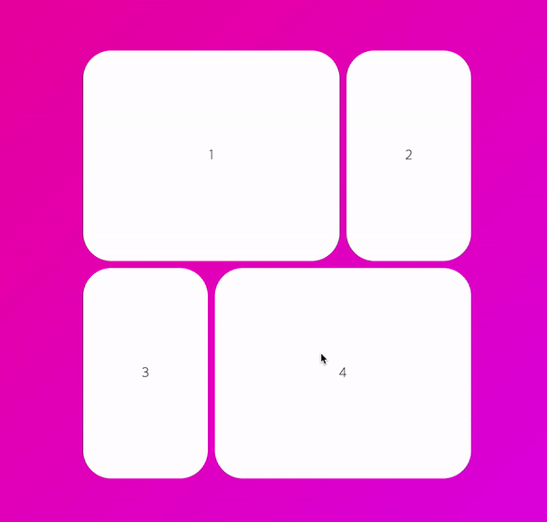

## Animated presence

아래 코드는 박스 컴포넌트가 있고 그 밑의 버튼을 클릭하게 될 시 박스를 토글하는 컴포넌트를 나타냅니다.

```javascript
function App() {
    const [isClick, setIsClick] = useState(false);
    const onClick = () => {
        setIsClick(!isClick);
    };
    return (
        <Wrapper>
            {isClick ? <Box /> : null}
            <button onClick={onClick}>Click me!</button>
        </Wrapper>
    );
}
```

리액트의 기본적인 방식으로는 **컴포넌트 토글에 대한 애니메이션을 구현할 수 없습니다.** 상태값 변화에 따라 그 즉시 컴포넌트 토글 여부가 결정되기 때문입니다.

이때 사용하는 것이 바로 프레이머 모션의 `AnimatePresence` 컴포넌트 입니다.

`AnimatePresence` 컴포넌트는 내부에 **조건문이 존재해야 합니다.** 조건문에 따라 토글되는 컴포넌트가 있을 때에만 사용합니다. 또한 `AnimatePresence` 컴포넌트는 조건문 안에 들어있으면 안되며 항상 `visible` 상태여야 합니다.

```javascript
import { AnimatePresence } from 'framer-motion';

function App() {
    const [isClick, setIsClick] = useState(false);
    const onClick = () => {
        setIsClick(!isClick);
    };
    return (
        <Wrapper>
            <AnimatePresence>{isClick ? <Box /> : null}</AnimatePresence>
            <button onClick={onClick}>Click me!</button>
        </Wrapper>
    );
}
```

위와 같이 컴포넌트 구조를 구성했으면 토글 대상 컴포넌트에 애니메이션을 부여하면 됩니다. `variants`를 이용하거나 직접 애니메이션을 인라인 형태로 작성해도 됩니다.

모션 엘리먼트의 `initial`과 `animate`프로퍼티는 평소처럼 작성하면 되지만 컴포넌트가 사라질 때에 대한 애니메이션 정의를 위해서는 추가적으로 `exit`이라는 프로퍼티에 대해 애니메이션을 정의해야합니다.

```javascript
function App() {
    const [isClick, setIsClick] = useState(false);
    const onClick = () => {
        setIsClick(!isClick);
    };
    return (
        <Wrapper>
            <AnimatePresence>
                {isClick ? (
                    <Box
                        variants={boxVariants}
                        initial='initial'
                        animate='visible'
                        // exit!!
                        exit='leaving'
                    />
                ) : null}
            </AnimatePresence>
            <button onClick={onClick}>Click me!</button>
        </Wrapper>
    );
}
```

:::warning
exit에 대한 애니메이션 발동을 위해서는 `AnimatedPresence` 내의 컴포넌트가 모두 사라져야합니다.

토글되어 나타날 때는 `animate` 애니메이션이 작동하지만 토글되어 다시 사라질 때에 내부에 다른 요소가 남아있다면 exit 프로퍼티에 대한 조건이 만족되지 못한 것입니다.
:::

## AnimatePresence 응용

`AnimatePresence` 컴포넌트를 응용하면 슬라이더 컴포넌트도 구현할 수 있게 됩니다.

배열 메서드 `map` 내부에서 조건문에 따라 컴포넌트 렌더링 여부를 결정하고 외부 버튼과 상태값으로 상호작용 하여 다음 요소로 넘기는 로직입니다.

```javascript
function App() {
    const [visible, setvisible] = useState(1);
    const nextIndex = () => {
        setvisible((prev) => (prev === 10 ? 1 : prev + 1));
    };
    const prevIndex = () => {
        setvisible((prev) => (prev === 1 ? 10 : prev - 1));
    };

    return (
        <Wrapper>
            <AnimatePresence>
                {[1, 2, 3, 4, 5, 6, 7, 8, 9, 10].map((i) =>
                    i === visible ? (
                        <Box
                            variants={boxVariants}
                            exit='leaving'
                            initial='initial'
                            animate='visible'
                            key={i}
                        >
                            {i}
                        </Box>
                    ) : null
                )}
            </AnimatePresence>
            <button onClick={nextIndex}>Next</button>
            <button onClick={prevIndex}>Prev</button>
        </Wrapper>
    );
}
```

`Next` 버튼을 클릭하면 다음 배열 요소로 넘어가고 `Prev` 버튼을 클릭하면 이전 배열 요소로 넘어갑니다. 하지만 위의 코드만 놓고 보면 Next냐 Prev냐에 따라 컴포넌트 요소가 날라오는 방향 설정은 되어 있지 않습니다.

`AnimatePresence` 컴포넌트는 `custom` 프롭스를 제공합니다.

각 애니메이션 컴포넌트에 대해 동적 variants를 다르게 적용할 때 사용할 수 있는 사용자 지정 데이터입니다.

```javascript
const variants = {
visible: (custom) => ({
opacity: 1,
transition: { delay: custom * 0.2 }
})
}

< motion.div custom={0} animate="visible" variants={variants} />
< motion.div custom={1} animate="visible" variants={variants} />
< motion.div custom={2} animate="visible" variants={variants} />
```

슬라이더 방향 결정을 위해서는 불리언 값을 상태값으로 설정하여 버튼 클릭시 방향을 반대로 전환하도록 로직을 구성하면 됩니다.

:::tip exitBeforeEnter
`AnimatePresence` 컴포넌트는 `exitBeforeEnter` 프롭스를 또한 제공합니다.

이전 요소에 대해 exit동작이 완전이 끝난 후에 다음 요소를 나타내주는 역할을 합니다.

```javascript
<AnimatePresence exitBeforeEnter>
    <motion.div key={currentItem} exit={{ opacity: 0 }} />
</AnimatePresence>
```

:::

## layout animation

모션 엘리먼트의 `layout` 프롭스는 활용 가능성이 매우 많은 프로퍼티입니다. [다음의 링크](https://www.framer.com/docs/animate-shared-layout/#syncing-layout-animations)에 접속하여 코드 샌드박스로 작성된 예제 코드를 실행해보세요!

`layout` 프롭스는 리액트 상태값으로 인해 컴포넌트 포지션이 동떨어진 상태가 될때 사용하면 자동으로 부드러운 애니메이션 효과를 부여해줍니다.

```javascript
function App() {
    const [clicked, setClicked] = useState(false);

    return (
        <Wrapper onClick={toggleClicked}>
            <Box style={{ justifyContent: clicked ? 'flex-start' : 'center' }}>
                <Circle layout />
            </Box>
        </Wrapper>
    );
}
```

`Wrapper` 클릭에 따라 `Circle`컴포넌트 배치가 바뀌는 상황입니다. 다른 CSS 코드 없이 위의 코드를 사용하게 되면 뚝뚝 끊기며 `Circle` 컴포넌트의 위치가 바뀌게 되지만 `layout` 프롭스를 통해 위치가 부드럽게 바뀌게 되는 것입니다.

### layoutId - 기초

layout 프롭스에서 출발하는 개념으로 `layoutId` 프롭스 값이 동일한 여러 컴포넌트에 대해 한 컴포넌트가 DOM 트리에서 삭제되거나 다른곳에 추가되면 해당 요소에 대해 애니메이션을 부드럽게 제공합니다.

```javascript
function App() {
    const [clicked, setClicked] = useState(false);
    const toggleClicked = () => {
        setClicked((prev) => !prev);
    };
    return (
        <Wrapper onClick={toggleClicked}>
            <Box>{!clicked ? <Circle layoutId='circle' /> : null}</Box>
            <Box>{clicked ? <Circle layoutId='circle' /> : null}</Box>
        </Wrapper>
    );
}
```

위 코드에서 두 `Box` 컴포넌트가 있는데 박스 안에 있는 `Circle` 컴포넌트는 레이아웃 아이디 프롭스 값이 동일한 상태입니다.

반대에 위치한 `Circle` 컴포넌트 하나가 삭제되면 그 반대편에 있던 `Circle` 컴포넌트가 자리를 대신해서 채우는 애니메이션을 보이게 됩니다.

### layoutId - 심화

`layoutId`를 통해 [다음 링크](https://www.framer.com/motion/)의 카드 오픈 애니메이션을 구현합니다.

기본적인 로직 흐름은 다음과 같습니다.

1. Wrapper 내에 그리드 박스를 만들고, 이 안에 Box 컴포넌트를 배열 `map` 메서드를 통해 나열합니다. 이때 배열은 박스에 들어갈 문자열 값입니다. `layoutId` 프롭스 값으로 사용할 것이기 때문에 반드시 문자열 형태로 배열 원소를 작성합니다.
2. 그리드 박스 밖에 `AnimatePresence` 컴포넌트를 활용하여 전체 카드를 덮어쓸 `Overlay` 컴포넌트를 생성합니다.
3. `Overlay` 컴포넌트와 클릭된 박스의 `layoutId`를 동일하도록 상태값을 조절하여 그리드 안의 Box하나를 클릭하면 `Overlay`가 해당 박스를 표현하고, 다시 외부를 클릭하면 제자리로 돌아오도록 애니메이션을 구현합니다.

```javascript
function App() {
    const [clicked, setClicked] = useState(false);
    const [boxId, setBoxId] = useState('');
    const toggleClicked = () => {
        setClicked((prev) => !prev);
    };

    return (
        <Wrapper onClick={toggleClicked}>
            <Grid>
                {['1', '2', '3', '4'].map((item) => (
                    <Box
                        onClick={() => setBoxId(item)}
                        key={item}
                        layoutId={item}
                    >
                        {item}
                    </Box>
                ))}
            </Grid>
            <AnimatePresence>
                {clicked ? (
                    <Overlay
                        variants={overlayVariants}
                        initial='initial'
                        animate='visible'
                        exit='exit'
                        layoutId='overlay'
                    >
                        <Box
                            layoutId={boxId}
                            style={{ width: '400px', height: '200px' }}
                        >
                            {boxId}
                        </Box>
                    </Overlay>
                ) : null}
            </AnimatePresence>
        </Wrapper>
    );
}
```


