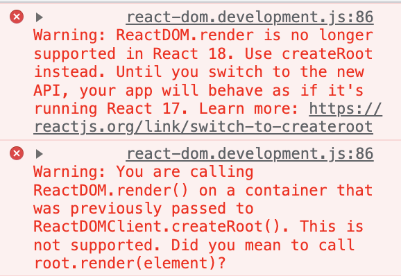

리액트 18이 안정적인 버전으로 배포가 이루어지면서 현재 배우고 있는 리액트 기술과 다른 점들을 정리해보고자 한다. (꾸준히 추가 예정)

## ReactDOM.render

React 17 기준으로 CRA 프로젝트 생성 후 `ReactDOM.render`를 사용하면 최신 버전 API로 교체하라는 경고가 뜬다.



CRA프로젝트의 `index.js` 코드는 다음과 같다.

```javascript
import React from 'react';
import App from './App';
import ReactDOM from 'react-dom';

// 루트 컨테이너를 반드시 렌더링 해야한다.
ReactDOM.render(
  <React.StrictMode>
    <App />
  </React.StrictMode>,
  document.getElementById('root')
);
```

[React 18 Github문서](https://github.com/reactwg/react-18/discussions/5#discussion-3385584)를 참조하면 `ReactDOMClient`의 `createRoot` 함수를 사용하라고 권고한다.

```javascript
import React from 'react';
import App from './App';
import * as ReactDOMClient from 'react-dom/client';

// root 컨테이너를 받아온다.
const container = document.getElementById('root'); // root노드 받아오기
const root = ReactDOMClient.createRoot(container); // createRoot에 전달

// 받아온 root 컨테이너를 렌더링한다.
root.render(
  <React.StrictMode>
    <App />
  </React.StrictMode>
);
```

두 API의 차이점이 무엇일까?

1. 레거시 API에서는 index에 `root` 컨테이너를 생성하여 `ReactDOM.render`에 전달하고 있었다. **루트 컨테이너에 실질적인 변화가 없더라도 반드시 렌더링을 진행하고 있는 것이다.** 반면 React18 `createRoot`의 경우 루트 컨테이너를 **필요에 따라 생성하여 렌더링을 선택적으로 진행할 수 있게 된다.** 루트 컨테이너를 받아오느냐 마느냐 차이인 것이다.
2. `hydrate` 메서드를 삭제하고 `createRoot`의 옵션으로 대체한다.
3. 렌더 콜백 또한 `render`와 분리된다.

:::tip hydrate method
`hydrate`메서드는 SSR 방식의 리액트 어플리케이션에 이용된다. CSR은 리액트.js의 모든 파일들이 로딩된 후에 인터랙션이 적용되기 때문에 (fetch Data등) **HTML파일과 같은 정적 애셋 파일들이 텅 비어있는 채로 시간이 조금 소요된다.**

반면 SSR은 서버로부터 정적 애셋 파일들을 받아와 렌더링 후 \*\*인터랙션은 차후에 반영되기 때문에 사용자 입장에서 좀 더 접근성이 좋다고 볼 수 있다.

리액트에서는 SSR을 `hydrate` 메서드로 구현할 수 있으며, `ReactDOM.render` 메서드와 동일하게 사용하면 됐었다.

참고로, SSR 구현을 위해서는 백엔드 단에서 `res.send` 메서드를 통해 HTML을 프론트에 보내주는 작업을 처리해야한다.
:::

```javascript
import * as ReactDOM from 'react-dom';
import App from 'App';

// server codes..

const container = document.getElementById('app');

// Render with hydration.
ReactDOM.hydrate(<App tab='home' />, container);
```

```javascript
import * as ReactDOM from 'react-dom';
import App from 'App';

const container = document.getElementById('app');

const root = ReactDOMClient.hydrateRoot(container, <App />);
```

`hydrateRoot` 메서드는 **Initial JSX**, 즉 SSR에서 보내주는 HTML요소를 두 번째 파라미터로 전달하게 된다.

렌더 콜백의 경우 다음 코드를 보자.

```javascript
import * as ReactDOMClient from 'react-dom/client';

function App() {
  return (
    <div>
      <h1>Hello World</h1>
    </div>
  );
}

const rootElement = document.getElementById('root');

// 루트 등록과 콜백 전달이 렌더 메서드에 함께 이루어진다.
ReactDOMClient.render(<App />, rootElement, () => console.log('renderered'));
```

위 코드를 아래와 같이 분리한다.

```javascript
import * as ReactDOMClient from 'react-dom/client';

function App() {
  return (
    <div>
      <h1>Hello World</h1>
    </div>
  );
}

const rootElement = document.getElementById('root');

const root = ReactDOMClient.createRoot(rootElement);
root.render(<App callback={() => console.log('Rendered!')} />);
```

위와 같이 분리하는 이유는 **콜백 함수의 호출 타이밍과 SSR을 통한 이니셜 HTML 전달 타이밍이 딱 맞아떨어지지 않을 경우가 있었기 때문이라고 한다.** (경험해본 바는 없습니다😅)

## Reference

1. [Understanding Hydration in React applications(SSR)](https://blog.saeloun.com/2021/12/16/hydration.html)
