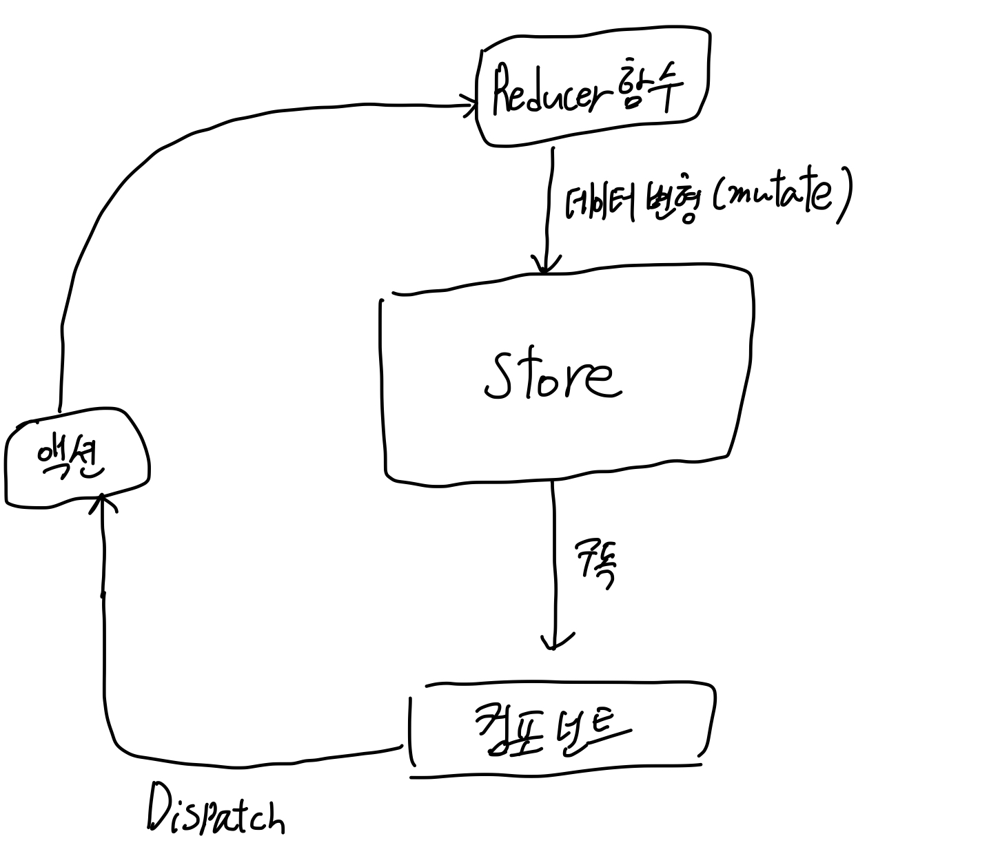

## 개요

리액트의 Context API는 크로스-컴포넌트 통신과 앱 전역에서 사용되는 상태값을 활용할 수 있게 해주었습니다.

하지만 컴포넌트의 데이터가 빈번하게 바뀌는 것을 표현하기 위해 컨텍스트 API가 사용된다거나 한 컴포넌트가 다양한 컨텍스트를 불러오는 로직을 갖는다면 중첩 컨텍스트 프로바이더 구조가 너무 복잡한 형태로 바뀌게 됩니다.

이러한 문제점들을 해결하기 위해 또 다른 전역상태 관리 라이브러리인 리덕스가 등장하게 됩니다.

## 작동방식

리덕스의 핵심은 **하나의 저장소에 전체 어플리케이션 모든 상태를 저장한다는 것입니다.**

중앙저장소는 컴포넌트를 구독하고 UI 변경사항을 감지하여 달라진 데이터를 뿌려줍니다.

컴포넌트에서 달라지는 데이터를 관리하는 주체는 컴포넌트가 아닌 **리듀서함수 내에서 이루어집니다.** (useReducer와는 다른 개념)

이때 컴포넌트와 리듀서 함수는 **디스패치 함수로 연결됩니다.** 컴포넌트로부터 액션이 감지되고 이는 리듀서 함수로의 디스패치를 전달할 트리거 조건이 됩니다.



## 구조 파악

CRA 리액트 앱 생성에 앞서 리덕스의 전체적인 구조를 파악합니다. 빈 폴더 아래 node.js 프로젝트로 초기화를 먼저 진행합니다. (`npm init -y`)

이후 리덕스를 설치합니다. (`npm install redux`)

```javascript
const redux = require('redux');

// deprecated
const store = redux.createStore();
// or redux.legacy_createStore()
```

리덕스의 `createStore` 메서드는 현재 deprecated되었다고 표시되지만 문제없이 작동됩니다. 취소선을 보고싶지 않다면 `redux.legacy_createStore()`로 코드를 작성합니다.

리듀서 함수는 기존 state와 디스패치를 통해 전달된 액션을 파라미터로 받습니다. 이후 리턴값으로 새로운 상태값을 가진 객체를 내보냅니다.

리듀서 함수는 동일한 입력에 대해 동일한 값만 내보내는 **순수함수이어야 합니다.** (사이드이펙트가 없어야함. HTTP리퀘스트 등)

대략적인 흐름은 다음과 같습니다.

1. 리덕스 객체 불러오기
2. 리덕스 객체로부터 저장소 생성 메서드 호출, 이때 파라미터로 리듀서 함수를 전달하고 리듀서 함수는 counter상태값을 1 증가시키는 로직을 갖는다.
3. subscriber 함수를 정의한다. 리듀서함수 호출을 통해 달라진 데이터를 subscriber함수에서 받아 처리하는 역할을 한다.
4. 저장소 객체의 subscribe메서드 호출과 함께 파라미터로 3번에서 정의한 `subscriber`함수를 전달한다.
5. 저장소 객체의 dispatch 메서드를 호출하고, 파라미터에는 액션을 자바스크립트 객체로 정의하여 전달한다.

:::warning default 상태값
리듀서함수 정의시에 상태값의 업데이트 형태를 정의한 뒤 이를 객체로 리턴하게 되는데, `legacy_createStore` 메서드에 리듀서함수를 파라미터로 전달할 때에 이 리듀서가 한번 호출되기 때문에 초기 파라미터로 전달된 상태값 `state`가 undefined 입니다.

따라서 디폴트값을 객체 형태에 맞게 전달해야합니다.
:::

```javascript
// 리덕스 객체 불러오기
const redux = require('redux');

// 리듀서함수 정의
const counterReducer = (state = { counter: 0 }, action) => {
    return {
        counter: state.counter + 1,
    };
};

// 저장소 객체 생성
const store = redux.legacy_createStore(counterReducer);

// 초기 상태값 호출
console.log(store.getState());

// 구독함수 정의
const counterSubscriber = () => {
    const latestState = store.getState();
    console.log(latestState);
};

// subscribe메서드 정의 및 구독함수 파라미터로 전달
store.subscribe(counterSubscriber);

// 디스패치를 통해 리듀서 함수 트리거
// 액션 객체에 대한 타입을 정의한다.
store.dispatch({ type: 'increment' });
```

저장소의 dispatch메서드에 전달할 액션 객체는 `type` 속성을 갖는데, 이는 반드시 고유해야합니다.

위의 코드에서 리듀서 함수는 액션 타입에 따른 분기가 이루어지지 않고 있습니다. 저장소 생성과 함께 전달될때 리듀서함수가 파라미터로 전달, 상태값 초기화가 이루어지게 되는데 초기 상태값은 0이 되길 원함에도 불구하고 액션 타입에 따른 분기가 이루어지지 않기 때문에 초기값도 1로 출력되게 됩니다.

이때 action파라미터의 type속성을 통해 이러한 문제를 해결할 수 있습니다.

```javascript
const counterReducer = (state = { counter: 0 }, action) => {
    if (action.type === 'increment') {
        return {
            counter: state.counter + 1,
        };
    }
    if (action.type === 'decrement') {
        return {
            counter: state.counter - 1,
        };
    }
    return state;
};
```

액션의 타입에 따라 상태값 변경 로직을 구분해두고 이에 모두 해당하지 않는다면 초기 상태값이라고 인식하여 디폴트값으로 전달된 상태값을 그대로 리턴하면 됩니다.

## Redux with React

먼저 패키지 둘을 설치합니다.

```sh
npx create-react-app 프로젝트
yarn add redux react-redux
```

`react-redux`는 리액트용 리덕스입니다. 리액트 컴포넌트에서 저장소로 디스패치를 하고 스토어를 컴포넌트에 구독시키는 등의 작업을 할 수 있습니다.

먼저 통상 리덕스 코드 작성은 `store`라는 폴더 아래에 작성합니다. 위의 예시에서처럼 카운트값을 리덕스로 관리하는 코드를 작성하면 다음과 같습니다.

```javascript
// store/index.js
import { legacy_createStore } from 'redux';

const counterReducer = (state, action) => {
    switch (action.type) {
        case 'increment':
            return {
                counter: state.counter + 1,
            };
        case 'decrement':
            return {
                counter: state.counter - 1,
            };
        default:
            return {
                state,
            };
    }
};

const store = legacy_createStore(counterReducer);

// store export
export default store;
```

리듀서 생성 및 저장소 생성 코드까지는 동일하지만 리액트 컴포넌트와 저장소를 연결하기 위해서는 프로바이더 컴포넌트를 사용해야합니다. 이에 앞서 저장소를 익스포트해줍니다.

리덕스 저장소에 접근할 컴포넌트들은 프로바이더 컴포넌트 안에 감싸져 있어야 합니다. 리액트 앱의 엔트리포인트인 App 컴포넌트를 프로바이더로 감싼다면 다음과 같습니다.

```javascript
// index.js
import ReactDOM from "react-dom/client";
// Provider 컴포넌트 임포트
import { Provider } from "react-redux";

// store 임포트
import { store } from "./store";

const root = ReactDOM.createRoot(
  document.getElementById("root") as HTMLElement
);
root.render(
  <Provider store={store}>
    <Product />
  </Provider>
);
```

프로바이더 컴포넌트는 `store`프롭스를 가지며 이 프롭스에는 생성한 저장소를 전달하면 됩니다.

## 구독 설정

리덕스 저장소를 컴포넌트에 구독시키기 위해서는 `react-redux`의 훅인 `useSelector` 훅을 사용합니다.

`useSelector`의 파라미터는 상태값 반환 함수입니다. 이 함수는 인자로 `state`를 받으며 상태값 객체 프로퍼티에 접근하여 반환함으로써 이 상태값을 활용하는 컴포넌트를 저장소가 자동으로 구독하게 됩니다.

예를 들어 `counter`라는 상태값 업데이트 로직을 리듀서 함수에 정의하였고 리듀서의 `state`객체 파라미터의 속성으로 `counter`가 전달되고 있는 위의 예시를 보면 `useSelector`훅에 전달할 함수를 어떻게 정의해야할까요?

```javascript
import { useSelector } from 'react-redux';

const Component = () => {
    // 상태값 저장소로부터 가져오기
    const counter = useSelector((state) => state.counter);

    return (
        <div>
            <span>{counter}</span>
        </div>
    );
};
```

위와 같이 `useSelector`훅을 통해 저장소는 컴포넌트에 `counter`상태값을 뿌려주게 됩니다. 추후 정의할 컴포넌트의 액션 디스패치 로직을 통해서 counter상태값이 변경되면 `useSelector` 훅을 통해 현재 저장소에 구독되어 있는 `Component`라는 이름의 컴포넌트를 업데이트하게 됩니다.

## 컴포넌트에서 스토어로 dispatch 보내기

컴포넌트에서 스토어로 액션 디스패치를 보내기 위해서는 `useDispatch` 훅을 사용합니다.

`useDispatch` 훅의 반환값은 디스패치 함수입니다. 앞서 작성했던 디스패치 예시 코드에서처럼 액션에 대한 타입을 `useDispatch` 훅의 반환값 디스패치 함수의 파라미터로 전달합니다.

```javascript
import { useSelector, useDispatch } from 'react-redux';

const Component = () => {
    const counter = useSelector((state) => state.counter);

    // dispatch함수 생성
    const dispatch = useDispatch();

    const incrementHandler = () => {
        dispatch({ type: 'increment' });
    };

    const decrementHandler = () => {
        dispatch({ type: 'decrement' });
    };

    return (
        <div>
            <span>{counter}</span>
            <button onClick={incrementHandler}>Increment</button>
            <button onClick={decrementHandler}>Decrement</button>
        </div>
    );
};
```

컴포넌트의 `onClick`등의 이벤트를 통해 액션을 디스패치합니다.

위의 카운터 예제를 확장성있는 구조로 개선하기 위해서 리덕스에서는 디스패치할 액션 객체에 `type`속성 외에 사용자 정의 속성을 자유롭게 담아 보낼 수 있습니다.

1값만 증감시키는게 아니라 아무 값이나 증감시키기 위해 `increase`라는 타입을 리듀서 함수에 전달하고 해당 로직을 작성하면 다음과 같게 됩니다.

```javascript
const counterReducer = (state = { counter: 0 }, action) => {
    // ...
    if (aciont.type === 'increase') {
        return {
            // 액션 객체에 amount라는 속성을 새로 정의하여 디스패치
            counter: state.counter + action.amount,
        };
    }
    // ...
};
```

```javascript
import { useSelector, useDispatch } from 'react-redux';

const Component = () => {
    const counter = useSelector((state) => state.counter);

    // dispatch함수 생성
    const dispatch = useDispatch();

    const incrementHandler = () => {
        dispatch({ type: 'increment' });
    };

    // 5라는 값으로 하드코딩하는 것이 아니라 추후 사용자 입력으로 개선 가능
    // 컴포넌트 상태값으로 관리하면 됨
    const increaseHandler = () => {
        dispatch({ type: 'increase', amount: 5 });
    };

    const decrementHandler = () => {
        dispatch({ type: 'decrement' });
    };

    return (
        <div>
            <span>{counter}</span>
            <button onClick={incrementHandler}>Increment</button>
            <button onClick={decrementHandler}>Decrement</button>
            <button onClick={increaseHandler}>Increase 5</button>
        </div>
    );
};
```

:::warning redux immutable
자바스크립트에서 뮤테이션에 대한 중요성을 강조하는 글들이 많습니다. 리덕스에서도 마찬가지입니다. 상태값 관리 로직에 대해 사이드이펙트를 완전히 제거하기 위해 리듀서 함수에서는 반드시 **상태값 객체에 직접 접근하지 않아야 합니다.**
:::

## 리덕스 toolkit

리덕스를 활용하여 앱을 제작하다보면 크기가 커지면서 각종 상태값들이 전부 한 곳에 모이게 됩니다. 이때 액션의 타입별로 분기해야할 로직들이 너무 많아지고, 각 액션 타입에 대해 불변성을 지키기 위해 객체 복사를 위한 속성들의 수도 너무 많아지게 됩니다. 또한 액션의 타입이 다양해짐에 따라 개발자에게 혼동을 줄 여지도 커지게 됩니다.

이러한 문제점들을 해결해주는 써드파티 라이브러리가 바로 리덕스 툴킷입니다.

```sh
yarn add @reduxjs/toolkit
```

리덕스 툴킷은 리덕스라이브러리를 포함하기 때문에 중복으로 둘 다 저장할 필요가 없습니다. 따라서 리덕스 툴킷을 설치하였으면 기존의 리덕스는 삭제합니다.

```sh
yarn remove redux
```

리덕스에서 리듀서함수를 정의할 때에 액션 타입에 따른 분기를 직접 if문으로 처리했어야 했습니다. 리덕스 툴킷에서는 이를 **슬라이스라는 기능을 통해** 자동으로 처리해줍니다.

`createSlice` 메서드를 사용하여 슬라이스를 정의합니다. 메서드 파라미터로는 객체를 전달하며 해당 객체는 세 가지의 프로퍼티를 갖습니다.

1. `name` - 슬라이스의 id값입니다.
2. `initialState` - 슬라이스에서 관리할 상태값들의 초기 값입니다.
3. `reducers` - 상태값과 연관된 리듀서들을 정의합니다.

`createSlice`메서드에 전달된 리듀서들은 기존 리덕스 라이브러리에서 액션 타입에 따른 분기의 처리가 필요 없어집니다. 따라서 리듀서 함수 정의 시 파라미터로 액션 타입 분기를 위한 목적이라면 `action` 파라미터를 받지 않아도 됩니다.

액션 객체의 페이로드 데이터를 가지고 상태값을 업데이트 할 때에만 액션객체를 활용하면 됩니다.

```javascript
import { createSlice } from '@redux/toolkit';

const counterSlice = createSlice({
    name: 'counter',
    initialState,
    reducers: {
        // action payload 활용 예시
        increase(state, action) {
            state.counter = state.counter + action.amount;
        },
        // payload가 없을때는 굳이 액션 객체를 받지 않는다.
        toggleCounter(state) {
            state.showCounter = !state.showCounter;
        },
    },
});
```
