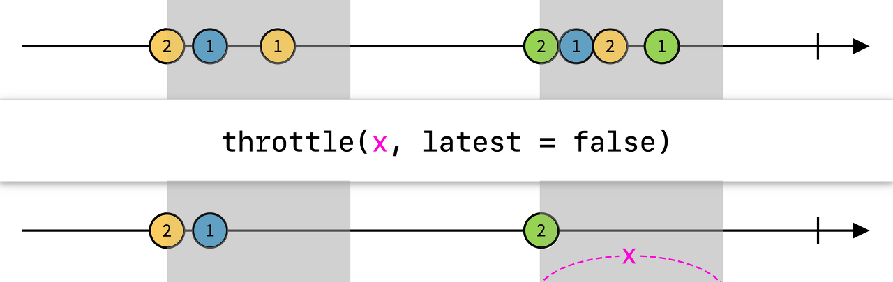

## ignoreElements

`ignoreElements`연산자는 `next` 이벤트를 필터링하고 `error`와 `completed` 이벤트만 전달한다. 작업의 성공 실패 여부에만 관심이 있을때 사용한다.

```swift
Observable.from(fruits)
    .ignoreElements()
    .subscribe{ print($0) }
    .disposed(by: disposeBag)
```

`fruits`의 각 요소에 대해 이벤트를 방출하지만 `next`이벤트가 무시된다.

## elementAt

이름 그대로 특정 인덱스의 요소하나만 이벤트로 방출한다. 나머지 요소들은 모두 무시된다.

```swift
let fruits = ["🍏", "🍎", "🍋", "🍓", "🍇"]

Observable.from(fruits)
    .element(at: 1) // 사과만 이벤트로 방출
    .subscribe{ print($0) }
    .disposed(by: disposeBag)
```

## filter

```swift
Observable.from(numbers)
    .filter{ $0.isMultiple(of: 2) }
    .subscribe{ print($0) }
    .disposed(by: disposeBag)
```

필터 연산자 조건이 `true`로 반환되는 요소만 이벤트로 방출한다.

## skip, skipWhile, skipUntil, skipDuration

특정 요소를 무시하는 연산자이다.

1. `skip`: 파라미터에 전달된 정수의 갯수만큼 이벤트 방출 대상에서 제외한다.
2. `skipWhile`: 파라미터에 클로저를 받고, 클로저에서 `false`가 되는 이후의 모든 대상들을 이벤트로 방출한다.
3. `skipUntil`: 옵저버블을 파라미터로 받고 해당 옵저버블에서 `next` 이벤트가 전달되기까지 원본 옵저버블에서 방출되는 이벤트들을 모두 무시한다.
4. `skipDuration`: 파라미터에 전달된 시간동안 옵저버블로부터 방출되는 이벤트를 무시하며, 이후 시간이 되면 이벤트 방출을 시작한다.

```swift
// skip
Observable.from(numbers)
    .skip(3) // numbers배열의 갯수 3개를 무시함
    .subscribe{ print($0) }
    .disposed(by: disposeBag)
```

```swift
// skip while
Observable.from(numbers)
    .skip{ !$0.isMultiple(of: 2) } // 짝수를 만나면 해당 요소부터 나머지를 모두 방출
    .subscribe{ print($0) }
    .disposed(by: disposeBag)
```

```swift
// skip until
let subject = PublishSubject<Int>()
let trigger = PublishSubject<Int>()

subject.skip(until: trigger) // 트리거 옵저버블을 파라미터에 전달
    .subscribe{ print($0) }
    .disposed(by: disposeBag)

subject.onNext(1) // 트리거 옵저버블의 next가 전달되지 않았으므로 무시
trigger.onNext(2) // 트리거 next 전달
subject.onNext(3) // 옵저버블에서 구독자에게 3을 next로 방출
```

```swift
// skip duration
let o = Observable<Int>.interval(.seconds(1), scheduler: MainScheduler.instance)

// 10초동안만 진행
o.take(10)
    .skip(.seconds(3), scheduler: MainScheduler.instance) // 3초동안 무시
    .subscribe { print($0) }
    .disposed(by: disposeBag)
```

## take, takeWhile, takeUntil, takeLast

1. `take`: 파라미터에 전달된 정수 갯수만큼 이벤트를 방출한다.
2. `take(while:behavior:)`: while 파라미터에 전달된 클로저가 false를 리턴하기 전까지 이벤트를 방출한다.
    - `behavior` 파라미터값이 `exclusive`인 경우 클로저가 `false`를 리턴했을때 마지막으로 전달된 요소를 무시하고, `inclusive`일때는 해당 요소를 방출한다.
3. `take(until: ObservableType)`: 트리거 옵저버블을 파라미터로 받는다. 트리거에서 `next` 이벤트가 전달되기 전까지 원본 옵저버블에서 이벤트를 계속해서 방출한다.
4. `take(until: predicate 클로저, behavior)`: predicate 클로저를 파라미터로 받는다. 클로저에서 true가 리턴되면 원본 옵저버블을 종료한다. `behavior`는 `take while`연산자와 동일하다.
5. `takeLast(count: Int)`: 옵저버블의 마지막 count개의 이벤트를 버퍼에 저장하고 있다가 `onCompleted` 이벤트가 전달되면 버퍼 이벤트들을 방출한다.
    - 에러 전달시에는 버퍼 이벤트들을 전달하지 않는다.
6. `take(for:scheduler:)`: for에는 `RxTimeInterval`값을 전달한다. 전달된 시간 동안 이벤트를 방출한다.

```swift
// take
Observable.from(numbers)
    .take(5) // 6,7,8,9,10 방출
    .subscribe{ print($0) }
    .disposed(by: disposeBag)
```

```swift
// take(while: )
Observable.from(numbers)
    .take(while: { !$0.isMultiple(of: 2)} , behavior: .inclusive) // 1, 2 방출
    .subscribe{ print($0) }
    .disposed(by: disposeBag)
```

```swift
// take(until:)
let subject = PublishSubject<Int>()
let trigger = PublishSubject<Int>()

subject.take(until: trigger)
    .subscribe{ print($0) }
    .disposed(by: disposeBag)

subject.onNext(1) // next(1)
subject.onNext(2) // next(2)
trigger.onNext(0) // next(0) & subject completed

subject.onNext(3) // 무시
```

```swift
// take until - predicate 클로저 파라미터
subject.take(until: { $0 > 5 })
    .subscribe{ print($0) }
    .disposed(by: disposeBag)

subject.onNext(1)
subject.onNext(2)
subject.onNext(6)
```

```swift
// take last
subject.takeLast(2)
    .subscribe{ print($0) }
    .disposed(by: disposeBag)

(1...10).forEach{ subject.onNext($0) } // 9, 10 버퍼에 저장
subject.onNext(11) // 10, 11로 버퍼 업데이트

subject.onCompleted() // 10, 11 방출
```

```swift
// take for
// 1초마다 이벤트 방출
let o = Observable<Int>.interval(.seconds(1), scheduler: MainScheduler.instance)

// 3초동안 이벤트 방출하고 complete
o.take(for: .seconds(3), scheduler: MainScheduler.instance)
    .subscribe { print($0) }
    .disposed(by: disposeBag)
```

## single

`single`연산자는 **이벤트 방출이 반드시 하나만 이루어져야 onCompleted** 이벤트를 전달한다.

`predicate` 클로저를 `single`연산자의 파라미터로 전달할 수도 있다.

```swift
Observable.just(1)
    .single() // onCompleted 정상적으로 전달
    .subscribe{ print($0) }
    .disposed(by: disposeBag)

Observable.from(numbers)
    .single() // onError - (Sequence contains more than one element.)
    .subscribe{ print($0) }
    .disposed(by: disposeBag)

Observable.from(numbers)
    .single{ $0 == 3 } // predicate 클로저 정의
    .subscribe{ print($0) }
    .disposed(by: disposeBag)
```

:::tip single 연산자 종료시점

`single`연산자는 원본 옵저버블이 종료되는 시점에 싱글 여부를 판단한다.

```swift
let subject = PublishSubject<Int>()
subject.single()
    .subscribe{ print($0) }
    .disposed(by: disposeBag)

subject.onNext(1) // next(1)만 있을때 onCompleted면 정상 종료
subject.onCompleted()
```

```swift
subject.onNext(2) // next(1), next(2) 방출했을때 onCompleted 전달하면 Error발생
```

`onNext`이벤트를 얼마나 더 받을지 모르는 상황이기 때문에 이벤트가 더 전달되었다고 해서, 혹은 predicate가 true로 리턴되는 대상을 전달하자마자 원본 옵저버블을 종료시키지 않는다.

```swift
let subject = PublishSubject<Int>()
subject.single{ $0 == 3 }
    .subscribe{ print($0) }
    .disposed(by: disposeBag)

subject.onNext(3)
subject.onNext(3)
subject.onCompleted() // error발생
```

:::

## distinctUntilChanged

이전 요소와 비교연산자를 통해 비교하여 다른 경우에만 이벤트로 방출한다.

```swift
let numbers = [1, 1, 3, 2, 2, 3, 1, 5, 5, 7, 7, 7]

Observable.from(numbers)
    .distinctUntilChanged()
    .subscribe{ print($0) } // 1 3 2 3 1 5 7
    .disposed(by: disposeBag)
```

`Equatable` 프로토콜이 채택되지 않은 타입들에 대해 동일성 검증 로직을 직접 구성하려는 경우 `comparer` 파라미터에 클로저를 전달한다.

```swift
let tuples = [(1, "하나"), (1, "일"), (2, "one")]

Observable.from(tuples)
    .distinctUntilChanged{ $0.0 == $1.0 } // 튜블 0번째값을 기준으로 동일성 판단
    .subscribe{ print($0) } // next((1, "하나")), next((2, "one"))
    .disposed(by: disposeBag)
```

튜플과 같이 여러 값이 한 곳에 모여있는 경우 직접 동일성 로직을 구성해도 되지만, `keySelector` 클로저를 파라미터로 받을 수도 있다.

위의 예시에서 `$0.0`을 클로저로 작성하면 자동으로 클로저의 0번째 값들만 서로 비교하여 동일성을 판단하게 되는 것이다.

이때 `keySelector`는 `Equatable` 프로토콜을 채택한 타입이어야 한다.

```swift
let tuples = [(1, "하나"), (1, "일"), (2, "one")]

Observable.from(tuples)
    .distinctUntilChanged{ $0.0 } // keySelector 클로저
    .subscribe{ print($0) } // next((1, "하나")), next((2, "one"))
    .disposed(by: disposeBag)
```

`at` 파라미터에는 `key-path expression`을 사용하여 인스턴스 속성을 기준으로 동일성 로직을 구성할 수도 있다. 클로저를 통해 파라미터 `$0`에 직접 접근할 필요 없이 속성에 바로 접근하는 방식이다.

```swift
let persons = [
    Person(name: "Sam", age: 12),
    Person(name: "Sam", age: 13),
    Person(name: "Tim", age: 56)
]

Observable.from(persons)
    .distinctUntilChanged(at: \.name)
    .subscribe{ print($0) }
    .disposed(by: disposeBag)
```

위의 튜플 코드또한 아래와 같이 수정할 수 있다.

```swift
let tuples = [(1, "하나"), (1, "일"), (2, "one")]

Observable.from(tuples)
    .distinctUntilChanged(at: \.0)
    .subscribe{ print($0) }
    .disposed(by: disposeBag)
```

## debounce, throttle

디바운스와 스로틀은 반응형 화면 구현시 매우 중요한 기법이다.

```swift
let buttonTap = Observable<String>.create { observer in
   DispatchQueue.global().async {
      for i in 1...10 {
         observer.onNext("Tap \(i)")
         Thread.sleep(forTimeInterval: 0.3)
      }

      Thread.sleep(forTimeInterval: 1)

      for i in 11...20 {
         observer.onNext("Tap \(i)")
         Thread.sleep(forTimeInterval: 0.3)
      }

      observer.onCompleted()
   }

   return Disposables.create {

   }
}
```

위와 같이 짧은 시간에 반복되는 이벤트가 있다고 가정해본다. 0.3초마다 문자열을 이벤트로 방출하다가, 10개의 이벤트를 방출한 뒤 1초의 텀을 갖고 다시 10개의 이벤트를 방출하는 코드이다.

디바운스를 적용한 코드는 아래와 같다.

```swift
buttonTap
    .debounce(.milliseconds(1000), scheduler: MainScheduler.instance)
    .subscribe { print($0) }
    .disposed(by: disposeBag)
```

파라미터에 전달된 시간 값동안 이벤트가 전달되지 않으면 마지막 이벤트를 방출한다. **시간 간격 내에 이벤트가 방출되면 이벤트가 전달되지 않는 동안 시간을 체크하는 타이머가 초기화된다.**

텍스트필드 입력을 통해 매 입력마다 데이터베이스 조회를 요청하는 API가 있다고 할때 디바운스 기법이 적용된다. 빠르게 입력한 뒤 0.5초정도를 디바운스 연산자 파라미터로 설정한 경우, 사용자가 입력을 멈춘 뒤에 API요청이 가도록 설계하는 것이다.

아래는 스로틀 기법이 적용된 코드이다.

```swift
buttonTap
    .throttle(.milliseconds(1000), scheduler: MainScheduler.instance)
    .subscribe{ print($0) }
    .disposed(by: disposeBag)
```

스로틀은 한 버튼 탭에 대해 빠른 입력으로 인한 중복을 방지하기 위해 사용한다. 전달된 타이머 간격이 지날때까지 이벤트를 무시하다가, 타이머가 끝나면 이벤트를 방출한 뒤 타이머를 초기화한다.

`latest`파라미터가 `true`로 설정된 경우 주기 내에 발생한 마지막 이벤트를 함께 전달하며, `false`인 경우 주기에 맞지 않은 이벤트가 있을때 굳이 방출하지 않는다.

<figure style="display:flex; align-items:center; flex-direction:column">

<figcaption style="font-size:1rem; color:grey; font-weight:bold; margin-top:0.8rem; margin-bottom:1rem;">출처: https://opendoorlife.tistory.com/19</figcaption>

## Reference

1. [(Swift) 이름은 모르지만 어쨌든 "\." 에 대한 포스팅 (feat. KeyPath)](https://80000coding.oopy.io/2c9f09c6-8162-4336-b8fe-a2d2d721f5ae)
2. [RxSwift :: 중복 클릭 방지를 위한 Throttle vs Debounce 차이와 개념, 사용법 알아보기 (iOS 개발)](https://opendoorlife.tistory.com/19)
