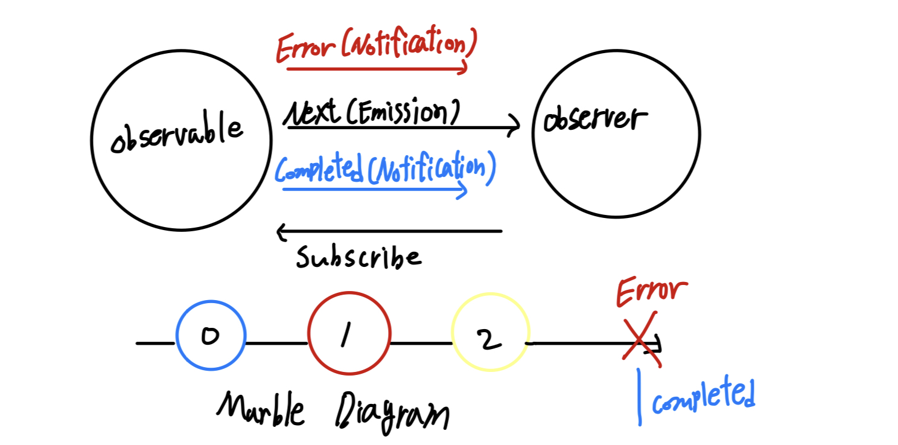

## 반응형 vs 명령형

명령형 프로그래밍은 명령어 작성에 순서가 중요하게 작용한다. 이전에 작성했던 내용들을 기반으로 코드가 동작하고, 변경사항을 감지하는 것을 직접적으로 핸들링하지 않으면 알지 못한다.

```swift
var a = 1
var b = 2
print(a + b) // 3

a += 2 // print(a + b) ? ?
```

`a+b`의 결과값을 한번 출력한 이후 시점에 a가 변경되면 a+b를 출력하는 코드는 이를 알지 못한다.

```swift
let disposeBag = DisposeBag()
let a = BehaviorSubject(value: 1)
let b = BehaviorSubject(value: 2)

Observable.combineLatest(a, b) { $0 + $1 }
    .subscribe(onNext: { print($0) })
    .disposed(by: disposeBag)

// a의 초기값 1에서 12로 변경된 이후, 자동으로 12 + 2를 실행하게 된다.
a.onNext(12)
```

## 용어 정의

옵저버블은 옵저버에게 이벤트를 넘긴다. 옵저버는 옵저버블을 감시하며 이벤트를 받고 이러한 옵저버에서 옵저버블로의 연결을 구독(Subscribe)이라고 한다.

옵저버블에서 옵저버로 넘기는 이벤트는 `Next`를 통해 이루어지며, 이를 방출, 혹은 `Emission`이라고 표현한다.

옵저버블의 라이프사이클 마지막에는 에러 여부에 따라 `Error`, `Completed` 둘중 하나의 이벤트가 전달된다. 동일하게 옵저버블에서 옵저버로 이벤트가 전달되는 것이지만, 이를 방출이라고 표현하지 않고 `Notification`이라고 표현한다.



옵저버블 라이프사이클을 도식화 한 그림을 마블 다이어그램이라고 한다.

## 옵저버블 정의

:::tip 연산자

RxSwift에서는 `create`와 같이 rx에서 사용되는 메서드들을 연산자라고 통칭한다.

:::

옵저버블을 정의하는 방법은 두가지가 있다. `create`연산자를 사용하거나, `from` 연산자를 사용하면 된다.

```swift
// on 메서드의 next파라미터를 사용하거나
// onNext를 사용하거나
Observable<Int>.create { observer -> Disposable in
    observer.on(.next(0))
    observer.onNext(1)

    observer.onCompleted()

    // 마지막에 Disposable 리턴
    return Disposables.create()
}
```

```swift
Observable.from([0, 1])
```

옵저버블 생성 후 내부에 정의된 두 정수 0과 1이 방출되는 시점은 **옵저버가 해당 옵저버블을 구독하는 시점이다.**

## 옵저버

옵저버로 옵저버블을 구독하는 방법은 옵저버블 객체의 `subscribe`메서드 클로저를 작성하면 된다. 위에서 생성한 옵저버블을 `o1`이라는 변수에 담았다고 하면,

```swift
o1.subscribe{
    print($0)
    if let elem = $0.element {
        print(elem)
    }
}
```

위와 같이 클로저를 작성할 수 있으며 옵저버블의 방출 대상 정수값을 빼오려면 클로저 파라미터의 `element`에 접근하면 된다.

위의 예시외에 `func subscribe(onNext: ((Int) -> Void)? = nil, onError: ((Error) -> Void)? = nil, onCompleted: (() -> Void)? = nil, onDisposed: (() -> Void)? = nil) -> Disposable` 형태로 옵저버블 내에서 처리된 이벤트를 각각의 클로저로 구독할 수 있는 방법도 있다.

각 클로저는 `nil`이 기본 타입이므로 옵저버블에서 처리하지 않은 이벤트는 전달하지 않아도 된다.

```swift
o1.subscribe(onNext: { elem in
    print("elem: \(elem)")
}, onCompleted: ...)
```

**옵저버는 두개 이상의 이벤트를 동시에 처리하지 않는다.**

## Infallible

`InFallible`은 옵저버블이다. 기존 옵저버블과 다르게 에러 이벤트를 옵저버에 방출하지 않는다. 생성 방법은 기존 옵저버블과 동일하다.

```swift
let infallible = Infallible<String>.create { observer in
    observer(.next("HI"))

    return Disposables.create()
}
```

옵저버에 방출할 이벤트를 전달하는 방식은 `onNext`와 같은 메서드가 아닌 `Infallible`내에 정의된 열거형만 가능하다.

```swift
public enum InfallibleEvent<Element> {
    /// Next element is produced.
    case next(Element)

    /// Sequence completed successfully.
    case completed
}
```

## Disposable

```swift
Observable.from([1,2,3])
    .subscribe(onNext: { elem in
        print("Next", elem)
    }, onError: { error in
        print("Error", error)
    }, onCompleted: {
        print("Completed")
    }, onDisposed: {
        print("Disposed")
    })
```

정수 1,2,3을 방출하는 옵저버블이 있고, 이를 구독하여 `onNext` - `onError` - `onCompleted` - `onDisposed` 이벤트에 대한 동작을 정의했을때 이들이 각각 `onNext`, `onCompleted`, `onDisposed` 순서로 호출되는 것을 볼 수 있다.

`onDisposed` 이벤트는 **옵저버블 리소스가 모두 해제될때 호출하게 된다.** `onCompleted`, `onError`와 같이 이벤트 방출이 끝나는 시점에 자동으로 리소스가 해제되며 소멸자 함수를 커스텀 하는 것과 유사하게 `onDisposed`에 대한 동작을 직접 정의하는 방식이다.

자동으로 리소스가 해제되는 것이 일반적이지만, 공식문서에서는 이들 리소스를 직접 해제하고 권유한다.

옵저버블 `from`는 `Disposable`을 리턴한다. `create`는 클로저의 리턴형이 `Disposable`이다. 이들을 `Subscription Disposable`이라고 한다.

옵저버블이 리턴하는 `Disposable`을 변수에 저장한 뒤 `dispose()`메서드를 호출하여 명시적으로 리소스를 해제해준다.

```swift
let subscription1 = Observable.from([1,2,3])
    .subscribe(onNext: { elem in
        print("Next", elem)
    })
    // ....

subscription1.dispose()
```

직접 `Disposable`을 디스포즈 해주거나, `DisposeBag` 객체를 생성하여 디스포즈해주는 방법도 있다. 옵저버블의 `disposed(by: DisposeBag)` 메서드를 호출하면 된다.

```swift
var bag = DisposeBag()
Observable.from([1,2,3])
    .subscribe(onNext: { elem in
        print("Next", elem)
    }, onError: { error in
        print("Error", error)
    }, onCompleted: {
        print("Completed")
    }, onDisposed: {
        print("Disposed")
    }).disposed(by: bag)
```

디스포저블 백에 추가된 디스포저블은 디스포저블 백이 메모리에서 해제되는 시점에 한번에 해제된다.

디스포저블 백을 해제하기 위해서는 변수를 옵셔널로 선언하여 `nil`을 할당하거나 **다른 새로운 디스포저블 백 인스턴스를 생성하면 된다.** 디스포저블 백에서는 `disposed`와 같은 메서드를 제공하지 않는다.

:::warning 이벤트 취소하기

타이머와 같이 무한대로 호출되는 이벤트를 중간에 취소해야 하는 경우 `dispose`를 통해 해제를 하는 방식을 취하면 `onCompleted`가 호출되지 않는다. 따라서 `take`와 같은 다른 연산자를 사용해야 한다.

:::

## 연산자

`RxSwift`에서 연산자는 새로운 옵저버블을 리턴한다. 따라서 연속적으로 연산자들을 호출할 수 있게 된다.

연산자들은 `subscribe` 호출 이전에 모두 작성하는 것이 당연하다. 데이터 조작의 마지막 상태를 구독자에게 전달해야 하기 때문이다.

```swift
Observable.from([1, 2, 3, 4, 5, 6, 7, 8, 9, 10])
    .filter { $0.isMultiple(of: 2) }
    .take(5)
    .subscribe { print($0) }
    .disposed(by: bag)
```

`take`는 방출 원소의 갯수를 지정한다. 위의 경우 0번째부터 4번째까지의 요소들을 취하는 것을 의미한다.

필터를 통해 짝수만 추출하면 `[2,4,6,8,10]`으로 옵저버블 방출 대상이 결정되며 여기서 5개를 취하면 그대로 `[2,4,6,8,10]`이 방출되는 것이다.
