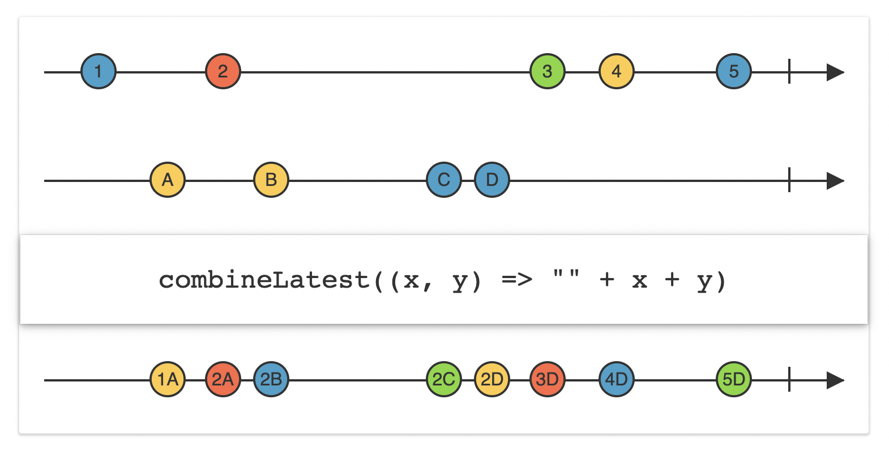

## startWith

`startWith`는 가변 파라미터를 받는다. 전달된 요소들을 이벤트 앞에 삽입한다.

```swift
let numbers = [1, 2, 3, 4, 5]

Observable.from(numbers)
    .startWith(0)
    .startWith(-2, -1)
    .subscribe{ print($0) } // -2 -1 0 1 2 3 4 5
    .disposed(by: bag)
```

## concat

```swift
let fruits = Observable.from(["🍏", "🍎", "🥝", "🍑", "🍋", "🍉"])
let animals = Observable.from(["🐶", "🐱", "🐹", "🐼", "🐯", "🐵"])

Observable.concat([fruits, animals])
    .subscribe{ print($0) }
    .disposed(by: bag)
```

`concat` 파라미터의 배열 내에 옵저버블을 넣으면 순서대로 합친 뒤 구독자에게 데이터를 전달한다.

위의 형태는 `ObservableType`의 타입 메서드를 호출한 것이고, 옵저버블 인스턴스 내에도 `concat` 메서드가 존재한다.

```swift
fruits.concat(animals) // fruit 옵저버블 뒤에 animals 옵저버블을 concat
    .subscribe{ print($0) }
    .disposed(by: bag)
```

**`concat`은 앞에 붙인 옵저버블이 이벤트 방출이 모두 끝나 `onCompleted`가 호출되면 나머지 뒤의 옵저버블 이벤트들을 방출하는 방식으로 동작한다.**

## merge

`concat`과 다르게 `merge` 연산자는 요소들을 묶어 한 옵저버블로 리턴한다.

병합 후 부분 옵저버블에 `next` 이벤트를 전달하면 병합 이후의 순서에 삽입된다.

```swift
let oddNumbers = BehaviorSubject(value: 1)
let evenNumbers = BehaviorSubject(value: 2)
let negativeNumbers = BehaviorSubject(value: -1)

let source = Observable.of(oddNumbers, evenNumbers)

source
    .merge()
    .subscribe{ print($0) } // 1 2가 먼저 next로 전달
    .disposed(by: bag)

oddNumbers.onNext(3) // 병합된 1 2 이후 3이 삽입
```

병합되는 두 옵저버블 모두 `onCompleted` 되어야 병합된 전체 옵저버블에서 `onCompleted`가 호출된다.

병합대상 중 하나라도 에러가 방출되면 그 즉시 전체 옵저버블도 에러를 구독자에게 방출하며 종료된다.

병합 최대 갯수는 `merge(maxConcurrent: Int)` 파라미터를 전달하여 지정 가능하다.

## combineLatest



옵저버블을 병합하여 `result Observable`에 값을 담아 이벤트를 방출하는데, 두 옵저버블이 모두 이벤트를 방출하기 시작한 시점부터 각 옵저버블의 가장 최근 이벤트와 결합하여 리절트 옵저버블에 요소를 담는다.

```swift
let greetings = PublishSubject<String>()
let languages = PublishSubject<String>()

Observable.combineLatest(greetings, languages){ lhs, rhs -> String in
    return "\(lhs) \(rhs)"
}
.subscribe{ print($0) } // Hi America , 안녕 America, 하이 America, 하이 코리아
.disposed(by: bag)

greetings.onNext("HI")
languages.onNext("America")

greetings.onNext("안녕")
greetings.onNext("하이")
languages.onNext("코리아")
```

`combineLatest`도 부분 옵저버블 둘다 `onCompleted`가 전달되어야 구독자에게 `onCompleted`가 방출된다.

만약 부분 옵저버블이 종료되었다면 마지막에 방출된 이벤트 요소를 계속해서 사용하게 된다.

부분 옵저버블에서 에러를 방출하는 경우 그 즉시 구독자에게 에러를 전달한다.

## zip

`combineLatest`는 가장 최근에 전달된 이벤트를 유지한다면, `zip`은 인덱스가 일치하는 짝끼리 결합하여 result 옵저버블에 전달한다. 결합할 짝이 없는 대상들은 이벤트로 방출되지 않는다.

이렇게 소스 옵저버블들이 방출하는 요소들의 인덱스를 맞춰 이벤트를 방출하는 것을 `Indexed Sequencing`이라고 한다.

result 옵저버블에 결합된 이들을 방출하는 시점은 둘이 결합되는 시점이므로, 더 늦게 등장한 상대 짝 이벤트의 시점이 된다.

```swift
Observable.zip(numbers, strings){ lhs, rhs -> String in
    return "\(lhs) \(rhs)"
}
.subscribe{ print($0) } // next(1 A)만 방출되고 종료된다.
.disposed(by: bag)

numbers.onNext(1)
strings.onNext("A")

numbers.onNext(2)
numbers.onNext(3)
```

zip 연산자도 마찬가지로 소스 옵저버블 모두 `onCompleted` 이벤트를 전달해야 구독자에게 `onCompleted`가 방출되고, 하나라도 에러가 발생하면 구독자에게 즉시 에러를 전달한다.

## withLatestFrom

`triggerObservable.withLatestFrom(dataObservable)` 형태로 호출한다. `withLatestFrom` 연산자를 호출하는 옵저버블을 트리거 옵저버블, 파라미터에 전달되는 옵저버블을 데이터 옵저버블이라고 한다.

트리거 옵저버블에서 `next` 이벤트를 방출하면 데이터 옵저버블의 가장 최신 이벤트를 방출한다.

```swift

let trigger = PublishSubject<Void>()
let data = PublishSubject<String>()

trigger.withLatestFrom(data)
    .subscribe{ print($0) }
    .disposed(by: bag)

data.onNext("HI")  // 여기까지 실행하면 이벤트 방출하지 않음

trigger.onNext(()) // 여기까지 실행하면 데이터 옵저버블의 HI를 방출
trigger.onNext(()) // 데이터 옵저버블의 가장 최신 이벤트인 HI를 다시 방출
```

데이터 옵저버블이 `onCompleted`되어도 트리거 옵저버블의 이벤트 방출에 따라 데이터 옵저버블의 마지막 이벤트는 계속해서 방출된다.

반면 데이터 옵저버블에서 에러를 방출하는 경우 트리거 옵저버블의 이벤트 방출시 구독자에게 에러를 방출한다.

트리거 옵저버블이 `onCompleted`되면 데이터 옵저버블의 완료 여부와 상관없이 `onCompleted`가 구독자에게 방출된다.

## sample

`dataObservable.sample(triggerObservable)`형태로 사용한다. 트리거 옵저버블에 next이벤트 전달시 데이터 옵저버블의 최신 이벤트를 방출하는 것은 동일하다.

하지만 한번 방출한 이벤트를 재사용하지 않는다.

```swift
let trigger = PublishSubject<Void>()
let data = PublishSubject<String>()

data.sample(trigger)
    .subscribe{ print($0) }
    .disposed(by: bag)

data.onNext("HI")
trigger.onNext(()) // next(HI)
trigger.onNext(()) // 아무 이벤트도 방출되지 않음

data.onNext("HI 2")
trigger.onNext(()) // next(HI 2)

data.onCompleted()
trigger.onNext() // completed
```

샘플 연산자의 데이터 옵저버블이 `onCompleted()`를 방출한 뒤 트리거 옵저버블에서 `next` 이벤트를 방출하면 구독자에게 바로 `onCompleted`를 방출한다.

withLatestFrom에서는 데이터 옵저버블이 완료되었어도 트리거 옵저버블의 이벤트를 방출하면 데이터 옵저버블의 마지막 이벤트를 전달한다.

데이터 옵저버블에서 에러를 방출하면 트리거 옵저버블의 이벤트 방출 여부와 상관없이 구독자에게 에러를 방출한다.

## switchLatest

껐다 켜는 스위치를 생각하면 된다. 주로 옵저버블을 리턴하는 옵저버블에 대해 특정 옵저버블을 선택하여 대상에 대해서만 최신 이벤트를 받고자 할때 사용한다.

```swift
let a = PublishSubject<String>()
let b = PublishSubject<String>()

let source = PublishSubject<Observable<String>>()

source
    .subscribe{ print($0) }
    .disposed(by: bag)
```

위의 코드를 보면 `Observable<String>`을 이벤트 타입으로 받는 퍼블리시 서브젝트가 있다.

이때 `switchLatest`를 source 서브젝트 연산에 추가하면 다음과 같다.

```swift
source
    .switchLatest()
    .subscribe{ print($0) }
    .disposed(by: bag)

source.onNext(a)

a.onNext("A event") // next(A event)
```

소스의 넥스트 이벤트로 최신 이벤트를 받을 옵저버블을 전달한다. 이후 전달된 옵저버블에 이벤트를 전달하면 소스 옵저버블에서 구독자에게 해당 이벤트를 방출한다.

소스의 넥스트 이벤트 내에 최신 옵저버블을 파라미터로 전달하여 지정하면 된다.

지정된 최신 옵저버블의 `onCompleted`여부에 상관 없이 **소스 옵저버블에서 onCompleted를 방출해야 소스 옵저버블이 종료된다.**

**에러의 경우 최신 옵저버블에서 에러를 방출해도 소스 옵저버블이 에러를 구독자에게 방출한다.** 최신 옵저버블로 지정되지 않은 옵저버블에서 에러를 방출해도 소스는 이를 무시한다.

## reduce

`scan` 연산자는 `accumulator`파라미터에 전달된 클로저의 연산 과정 모두를 이벤트로 방출한다.

그에 반해 `reduce` 연산자는 최종 결과 하나만 방출한다.

```swift
let o = Observable.range(start: 1, count: 5)

o.reduce(0, accumulator: +)
    .subscribe{ print($0) }
    .disposed(by: bag)
```

위의 코드는 1부터 5까지의 누적합 최종 15값을 이벤트로 방출하는 코드이다.

## Conditional Operator - amb

`amb` 연산자는 비교 대상 옵저버블 중 먼저 이벤트가 방출되는 옵저버블의 이벤트만 구독자에게 방출한다. 방출이 더 늦어진 옵저버블은 넥스트 이벤트 뿐만 아니라 `onCompleted`, `onError`도 무시된다.

```swift
let a = PublishSubject<String>()
let b = PublishSubject<String>()

a.amb(b)
    .subscribe{ print($0) }
    .disposed(by: bag)

a.onNext("A") // a 옵저버블에 이벤트가 먼저 방출
b.onNext("B") // 무시
b.onCompleted() // 무시
```

여러 옵저버블들을 한번에 비교하기 위해서는 `Observable.amb(Sequence)`형태의 타입 메서드를 사용한다.

```swift
let a = PublishSubject<String>()
let b = PublishSubject<String>()
let c = PublishSubject<String>()

Observable.amb([a,b,c])
    .subscribe{ print($0) }
    .disposed(by: bag)

b.onNext("B") // B 옵저버블에서 가장 먼저 이벤트 방출
a.onNext("A")
c.onNext("C")

b.onCompleted() // completed 구독자에게 방출
```
