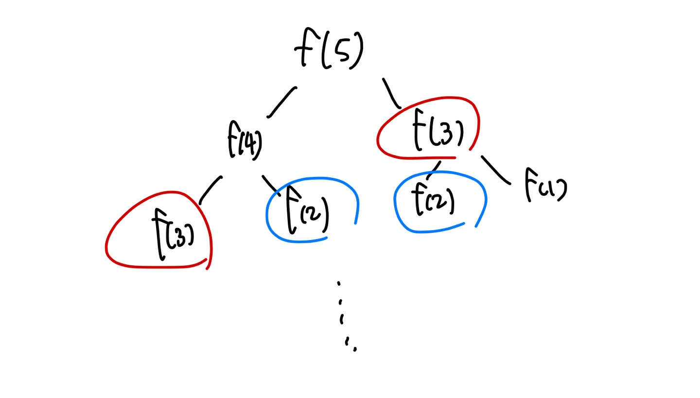

# 동적계획법을 사용하는 이유

알고리즘 풀이를 분할정복 관점으로 접근할 때 관점은 두 가지가 존재한다.

1. 일반적인 재귀적 풀이로 접근할 것인가
2. 동적계획법 풀이로 접근할 것인가

같은 분할정복이어도 수행시간과 메모리 측면에서 동적계획법이 우월한 경우가 많다.



이는 재귀적으로 호출한 경우인데 `f(3)`과 `f(2)`가 중복되게 호출되는 문제를 확인할 수 있다.

재귀호출의 문제점 해결을 위해 동적계획법을 활용하면 다음과 같다.

```python
def dp(n):
    F = [0,1]
    for i in range(2, n+1):
        F.append(F[i-1] + F[i-2])
    return F

a = dp(3)
print(a[-1])
```

재귀호출과 가장 큰 차이점은 **데이터를 테이블에 저장하는가**이다. 동적계획법의 테이블은 필요한 데이터를 상수시간에 출력할 수 있다는 것이 가장 큰 장점이다.

:::tip
[Time complexity of recursive Fibonacci Program](https://www.geeksforgeeks.org/time-complexity-recursive-fibonacci-program/)에 따르면
재귀호출 피보나치 수열의 시간복잡도는 약 O(1.6^n)이고

동적계획법 피보나치 수열의 시간복잡도는 약 O(n)시간이다.
:::

## DP 예제 1 - 계단오르기

```text
계단은 1칸 또는 2칸씩만 오를 수 있다. 1층부터 n층까지 오르는 데에 발생하는 경우의 수는?
```

DP도 분할정복이라는 알고리즘 해결방법이 기본적으로 깔려있기 때문에 **바닥조건**설정이 가장 우선시 된다.

바닥조건은 `A[1]=1`, `A[2]=1`이며 1층에 있을 때와 2층으로 오르는 경우의 수가 바닥조건이 된다. (2층으로 오르는 데에는 계단 한칸만 필요하므로 `A[2]=1`이 된다.)

이를 바탕으로 점화식을 세우면 `A[n] = A[n-1] + A[n-2]`가 된다.
(n층까지 오르는 경우의 수는 n-1층까지의 경우의 수 + n-2까지의 경우의 수)

**피보나치 수열과 같은 알고리즘이므로 코드 구현은 위를 참조**
