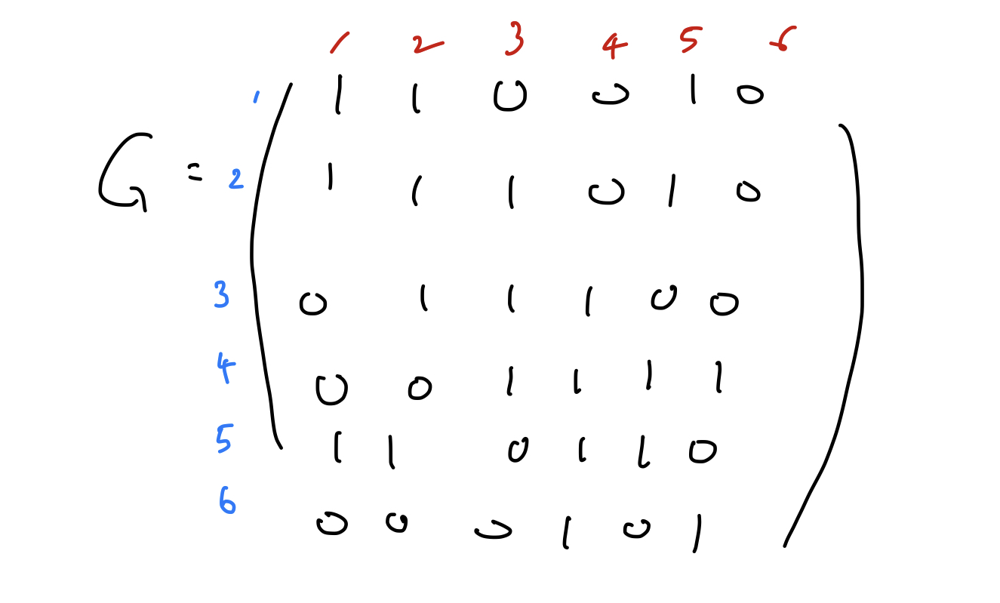
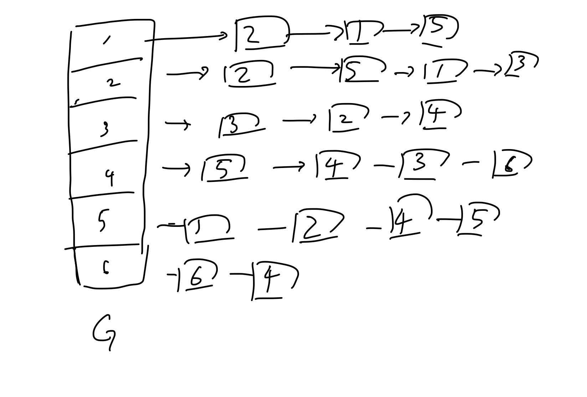

## Graph 자료구조

통상 `G = (V, E)`로 표현하며 V는 정점(Vertex) E는 (Edge set)을 의미한다. 엣지는 링크로도 불린다.

## 그래프 용어


1. 각 동그라미 -> Vertex, 정점이라고 한다. 또는 노드라고도 불린다.
2. 각 정점을 잇는 선분을 엣지(Edge)라고 한다.
3. 분지수 (degree) -> 특정 노드에서 뻗어져 나갈 수 있는 엣지의 수. 4의 분지수는 3
4. 인접하다 (adjacent) -> 에지 (4,5)에서 노드 (4), 노드 (5)는 인접하다.
5. 인접하다 (incident) -> 에지 (4,5)는 노드 (4), 노드(5)와 인접하다.
6. 경로(path) : 3-2-5 특정 노드에서 특정 노드까지 가는 동안 거치는 노드들 (단 지나가는 동안 **중복되는 노드는 존재하면 안된다.**)
7. 사이클(cycle) : 특정 노드에서 시작하여 다시 제자리로 돌아오게 되는 경로
8. 무방향 그래프 (undirected graph) : 위의 예시 그래프는 엣지의 방향성이 없다.
9. 방향 그래프 (directed graph)

:::tip
트리는 사이클이 없는 그래프이다.

사이클이 없다는 것은 특정 노드에서 특정 노드로 이동하는 경로가
단 하나만 존재한다는 것을 의미한다.
:::

## 인접성의 표현 1) 인접행렬



무방향 그래프를 가정하여 인접행렬을 위와 같이 표현한다.
n X n 행렬의 \[a,b\] 원소가 1이면 a-b 엣지가 존재하는 것이다.

인접행렬은 n X n으로 표현해야하므로 정보가 없는 엣지를 표현할 때에 메모리의 낭비가 심해지는 문제가 존재한다.

```python
class Graph:
    def __init__(self, size):
        self.adjMatrix = [[0 for _ in range(size)] for _ in range(size)]
        self.size = size

    def insertEdge(self, v1, v2):
        self.adjMatrix[v1][v2] = 1
# in case of undirected graph
        self.adjMatrix[v2][v1] = 1

    def printGraph(self):
        for i in range(self.size):
            for j in self.adjMatrix[i]:
                print(j, end = ' ')
            print()
```

## 인접성의 표현 2) 인접 리스트



각 연결리스트에서 메모리의 낭비 없이 엣지를 표현할 수 있게 된다.

### 노드로 표현

```python
class Node:
    def __init__(self, vertex):
        self.vertex = vertex
        self.link = None

class Graph:
    def __init__(self, size):
        self.adjList = [None]*size
        self.size = size

    def insertEdge(self, v1, v2):
        newNode = Node(v2)
        newNode.link = self.adjList[v1]
        self.adjList[v1] = newNode
  # in case of undirected graph

        newNode = Node(v1)
        newNode.link = self.adjList[v2]
        self.adjList[v2] = newNode

    def printGraph(self):
        for v in range(self.size):
            print(v, end = ': ')
            current = self.adjList[v]
            while current is not None:
                print(current.vertex, end = ' ')
                current = current.link
            print()

```

### 리스트 내의 리스트로 표현

```python
class Graph:
    def __init__(self, size):
        self.adjList = [[] for _ in range(size)]
        self.size = size

    def insertEdge(self, v1, v2):
        self.adjList[v1].append(v2)
  # in case of undirected graph
        self.adjList[v2].append(v1)
    def printGraph(self):
        for v in range(self.size):
            print(v, end = ': ')
            for x in self.adjList[v]:
                print(x, end = ' ')
            print()
```

## 그래프 순회 (Graph Traversal)

트리 자료구조에서 각 노드를 탐색하는 방법은(순회) 총 세가지로 `inorder, preorder, postorder`가 있다.

그래프 자료구조도 트리 자료구조의 순회 방식과 유사하지만 엣지의 개수가 더 많아 사이클을 형성하는 경우가 많으므로 이러한 측면에서 순회 방식이 달라지게 된다. 바로 **DFS, BFS** 라는 방식으로 나뉜다.

### DFS(Depth First Search)
