## 그래프 위상 정렬

### DAG

DAG는 사이클이 없는 방향 그래프를 의미한다.

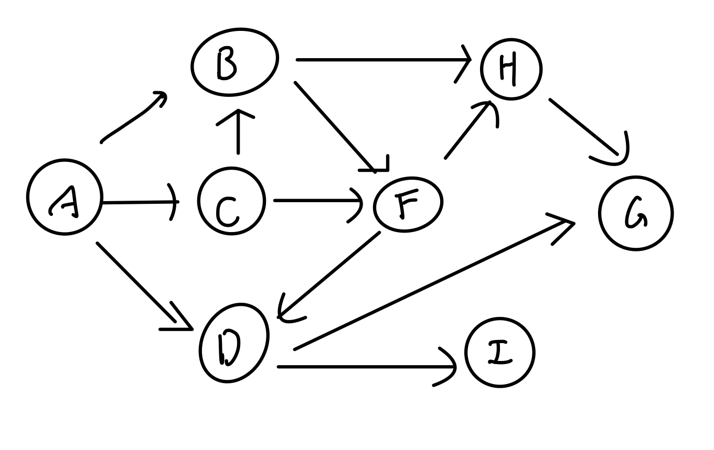

위 DAG 그래프를 차례로 순회할때 정렬되는 노드를 표현하면

```text
A
|-- C --|
|       |-- B -- F-- D -- I -- G
|                |-- H (H 먼저 완료 후)
```

DAG 순회의 가장 중심이 될 규칙은 **자신을 가리키는 노드들이 모두 인접한 노드의 순회를 끝마친 상태여야 한다는 것**이다.

규칙에 따라 DAG를 순회하다 보면 동일한 위상을 갖는 **H,D** 노드를 볼 수 있는데, 이로 인해 DAG 순회의 결과 노드집합은 여러 경우를 가질 수 있다.

(A -> C -> B -> F -> **D -> H** -> I -> G)

(A -> C -> B -> F -> **H -> D** -> I -> G)

이러한 정렬 방법을 **위상 정렬(topological sorting)** 이라고 한다.

DFS 기반으로 **pre/post** 변수를 통해 그래프 순회를 하고 **post**값이 내림차순으로 정렬 되도록 노드를 나열하면 된다.

### Weighted DAG

가중치가 있는 DAG에서 최장경로를 구하는 문제가 있다. DAG 순회 방식을 채택한 뒤, 정점 v에서 w까지 가는 동안 각 인접 노드를 순회할 때 가중치가 가장 크게 잡히는 경로부터 순회하면 된다.

```python
algorithm findLongestPath(인접 리스트, 노드 수 n, 정점 w, 정점 t, 최장경로 저장 배열 arr){
    정점 w = "visited"
    if(정점 w == 정점 t){
        return 최장 경로 길이는 0
    }

    while(노드의 인접리스트가 없을 때까지){
        정점 v 선언, v = w로 초기화 (w부터 인접한 노드들을 재귀적으로 v를 통해 순회할 예정)
        if(v is not visited){
            # 재귀호출, w -> v까지 가는 동안의 최장경로
            findLongestPath(인접 리스트, n, v, t, 최장경로 저장 배열 arr)

            # 현재 노드인 w까지의 최장경로와 w에서 v까지의 최장 경로 길이를 비교
            arr[w] = max(arr[w], arr[v] + v.weight)
        } else { // w 인접노드인 v가 방문노드
            # v가 이미 방문한 노드이므로 해당 노드까지의 최장경로 비용이 저장되어 있음
            arr[w] = max(arr[w], arr[v] + v.weight)
        }

        v = w의 또 다른 인접노드
    }
}
```

Weighted DAG의 최종 수행시간은 O(n+m)이 된다.

## Bellman Ford 알고리즘

Bellman Ford 알고리즘은 그래프 최단 경로 알고리즘 중 하나이다.

아래 그래프를 고려하자.

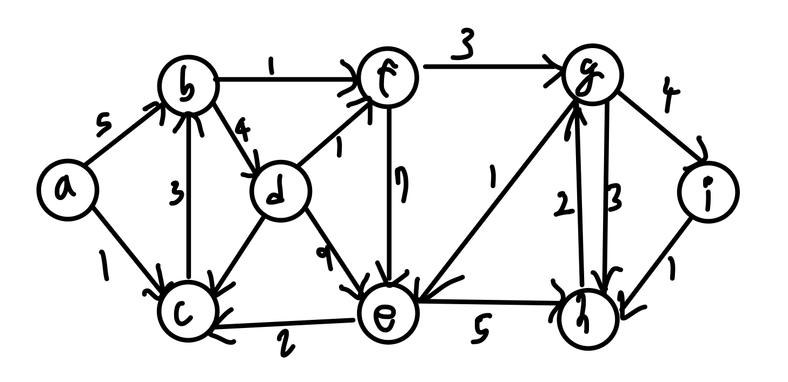

단순 노드의 개수로 최단 경로를 구하면

**(a -> b -> f -> g -> i)** 또는

**(a -> c -> e -> h -> u)** 가 된다.

하지만 각 엣지마다 가중치가 부여되어 있기 때문에 이를 고려하여 최단 경로를 구하면

**(a -> c -> b -> f -> g -> i)** 로 길이가 12가 된다.

이를 재귀적으로 생각하면 **(a->i)** 로 가는 최단 경로는 **(a -> g)** 까지의 최단 경로 + **(g->i)** 까지의 엣지 가중치 값이다.

이를 정리하여 `dist[v] = s(source)에서 v로 가는 최단 경로의 길이` 로 정의할 수 있다.

또한 목적지 v에 인접하면서 v를 가리키는 노드들이 존재한다면

`dist[v] = min(dist[u1] + w(u1,v), dist[u2] + w(u2, v), dist[u3] + w(u3, v))` 로 정의할 수 있다.

또한, 최종적으로 u1, u2, u3 등 목적지 직전 인접 노드까지 최단경로를 모두 계산한 값이 목적지 노드에서의 계산된 최단 경로의 길이보다 작다면 이를 인접 노드까지의 최단 경로 값으로 새롭게 초기화한다. 이를 **릴랙스 relax(u, v)** 라고 표현한다.

```python
if dist[v] > dist[u] + w(u, v):
    dist[v] = dist[u] + w(u, v) # relax!!
```

초기에 각 노드의 계산된 최단 경로 길이값을 `math.inf`로 초기화한 뒤에 최단경로를 계산하며 각각 릴랙스처리 해주면 된다.

다음은 위 최단경로 알고리즘의 예시이다.

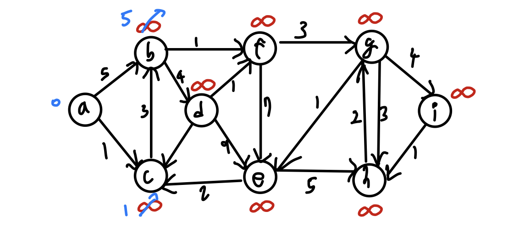

노드 b와 노드 c가 각각 5, 1값으로 초기화 되었다.

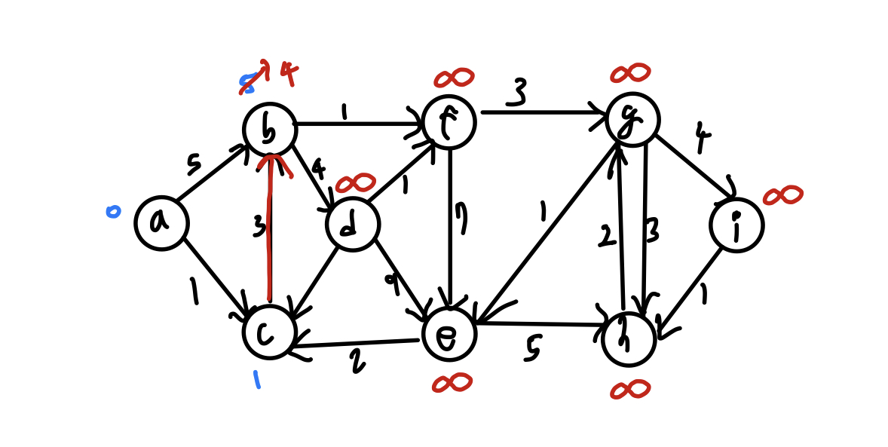

**(a -> c -> b)** 경로의 가중치 계산 값에 따라 현재 b가 갖는 가중치 값인 5보다 **(a -> c -> b)** 경로의 가중치 값이 더 작으므로 4라는 값으로 새롭게 초기화 된다.

최단경로를 계산하기 위해 거치는 노드는 소스 노드(Source)와 목적지 노드 (V)를 제외하여 총 **n-2** 개를 넘지 않는다.

:::tip
가령 소스노드 S로부터 목적지 노드 V까지의 최단 경로를 계산하는 상황을 고려해보자. S부터 V까지 전체 노드의 개수는 n개일 때
**S를 제외한 n-1개의 노드가 릴랙스 되어야 하므로** n-1 라운드를 마련하여 루프를 돌린다.

최단경로 계산이 되지 않은 무작위 노드들은 `math.inf` 끼리 연산이 되므로 릴랙스에 의미가 없다.

또한 각 라운드마다 모든 엣지에 대해 릴랙스 해주어야 한다. 이를 n-1 라운드 동안 진행한다.
:::

```python
for i in range(n-1): # n-1 round
    for each edge(u, v) in G:
        if dist[v] > dist[u] + w(u,v):
            dist[v] = dist[u] + w(u,v) # relax(u, v)
```

위의 이중루프가 **Bellman-Ford 알고리즘** 이며, 총 수행시간은 O(n X E) (E는 전체 엣지 수)이고 엣지는 최대 n의 제곱만큼 생성될 수 있으므로
O(n³)이 된다.

## Dijkstra 알고리즘


위의 벨만 포드 알고리즘은 수행시간이 너무 느리다. 이에 비해 더 빠른 **다익스트라(Dijkstra) 알고리즘** 을 알아본다.

먼저 슈도 코드를 살펴보면

```python
Q = min_heap with dist[v] # 최소 힙

while Q != ∅ : # 힙에 원소가 없을 때까지
    u = Q.deleteMin()
    for each u->v: # u에 인접한 모든 노드들에 대해
        relax(u, v)
        Q.decreaseKey(v, dist[v]) # heapify Up - O(logn)
```

위 알고리즘에 따라 노드를 순회하면

<figure style="display:flex; align-items:center; flex-direction:column">
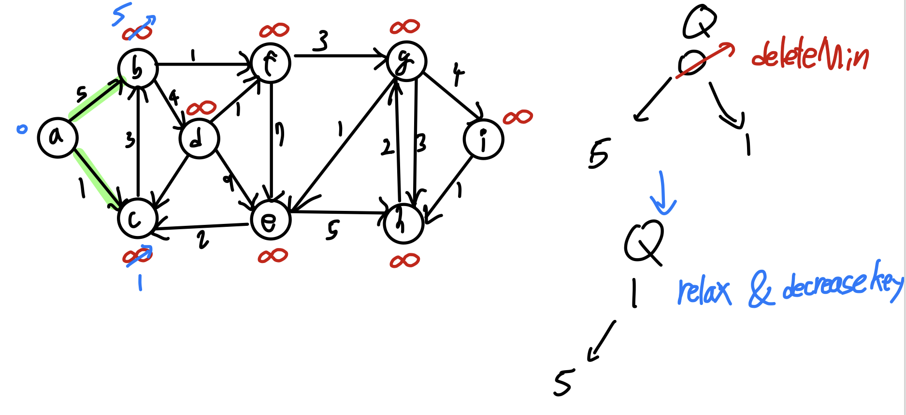
<figcaption style="font-size:1rem; color:grey; font-weight:bold; margin-top:0.8rem; margin-bottom:1rem;">1</figcaption>

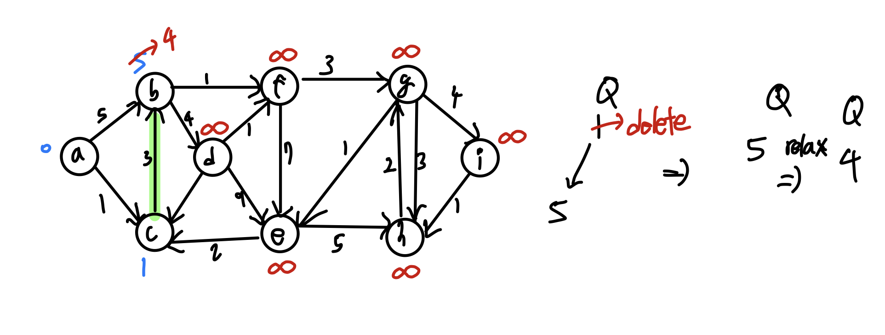
<figcaption style="font-size:1rem; color:grey; font-weight:bold; margin-top:0.8rem; margin-bottom:1rem;">2</figcaption>
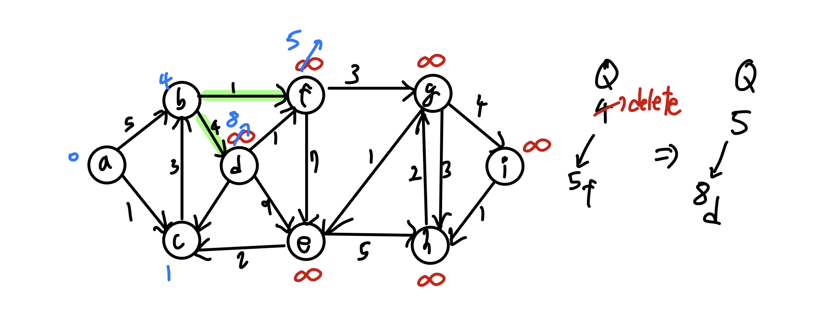
<figcaption style="font-size:1rem; color:grey; font-weight:bold; margin-top:0.8rem; margin-bottom:1rem;">3</figcaption>
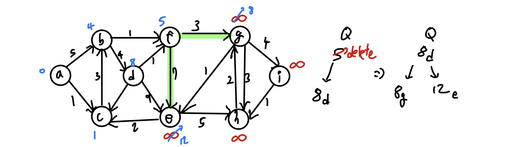
<figcaption style="font-size:1rem; color:grey; font-weight:bold; margin-top:0.8rem; margin-bottom:1rem;">4</figcaption>
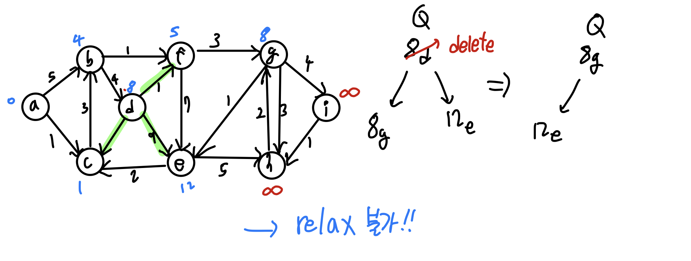
<figcaption style="font-size:1rem; color:grey; font-weight:bold; margin-top:0.8rem; margin-bottom:1rem;">5</figcaption>
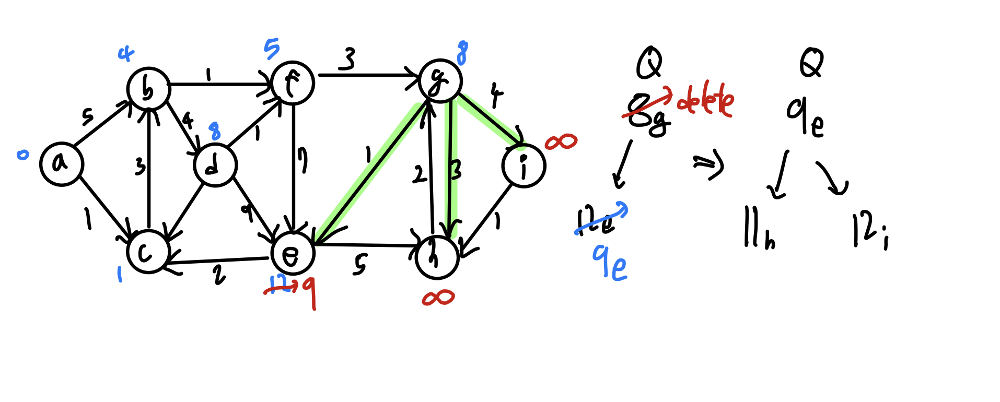
<figcaption style="font-size:1rem; color:grey; font-weight:bold; margin-top:0.8rem; margin-bottom:1rem;">6</figcaption>
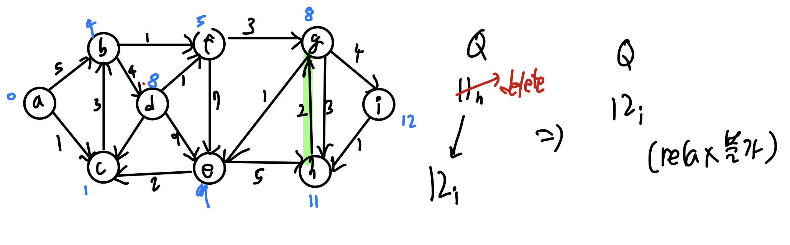
<figcaption style="font-size:1rem; color:grey; font-weight:bold; margin-top:0.8rem; margin-bottom:1rem;">7</figcaption>
</figure>

최소 힙 자료구조는 [다음을 참조한다.](https://www.geeksforgeeks.org/min-heap-in-python/)

수행시간의 경우 각 노드가 모두 **최소 힙에 한 번의 삽입과 한 번의 삭제가 이루어지므로 O(nlogn)** 시간이 소요되고

각 에지가 모두 릴랙스 후 `heapify up`연산을 진행하므로 **O(E x logn) = O(n²logn)** 시간이 소요된다.

따라서 총 소요시간은 **O(n²logn)** 가 된다.

### Dijkstra 구현 코드

```python
s = 0 # s is source node
dist = [0,∞,∞,.....,∞,∞]
parent = [None, None,.......,None] # parent를 통해 최단경로를 구성한다!
min_heap Q  = all nodes v with key dist[v]

while Q is not empty:
    u = Q.deleteMin()
    for each edge u->v:
        relax(u,v) # relax 하면서 parent에 데이터를 추가한다.
        Q.decreaseKey(v, dist[v]) in Q
    return dist, parent
```

**parent** 리스트가 바로 그래프 무작위 노드에서 노드로의 최단경로를 표현해둔 데이터이다.
