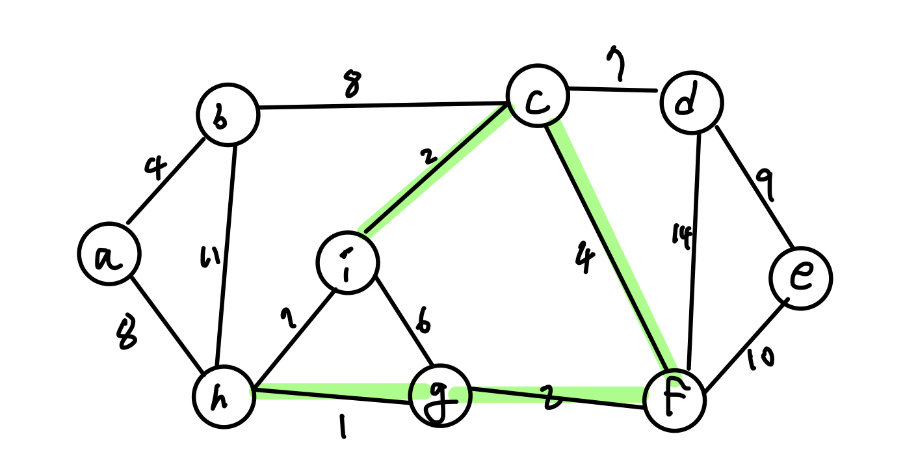

## 최소신장트리 알고리즘

최소신장트리(MST, Minimum Spanning Tree)는 그래프가 입력으로 주어지면 해당 그래프에 포함되어 있는 신장 트리의 비용이 최소인 그래프를 구하는 알고리즘이다.

:::tip 신장트리란?
신장트리(Spanning tree)란 **그래프의 부분 그래프로서** 주어진 그래프의 **모든 정점** 과 간선의 부분 집합으로 구성되는 트리이다. 각 노드는 적어도 하나의 간선에 연결되어 있어야 하며 **그래프에 사이클이 형성되면 안된다.**
:::

### MST 성질

1. 트리의 성질
   - n개의 노드는 n-1개의 간선을 갖는다.
   - 에지가 삭제되면 2개의 부트리로 분할된다.
   - 새로운 간선을 삽입하면 간선을 포함하는 사이클이 생성된다.
2. **Cut Property** : **Prim algorithm**
   - 컷에서 최소 비용 간선을 포함하는 MST는 최소 하나 이상 존재한다.

:::tip Cut이란?
그래프 내에 몇 개의 간선들을 모은 부분 집합을 의미한다. 컷에 해당하는 간선을 지우면 2개 이상의 부그래프로 나눠진다.

특정 기준에 따라 컷을 선정한 뒤 컷의 간선 모두를 그래프에서 제거한 뒤에 컷의 간선 하나씩 비용을 대입하며 최소 비용을 찾아보는 식으로 MST를 구성한다.
:::

각 노드에서 뻗어 나가는 간선들을 확인하여 컷을 선정한 뒤 컷들 중 가장 작은 비용을 갖는 간선을 찾아 MST를 조사한다.

부분 MST를 만든 뒤에 컷을 선정할 때에는 MST기준으로 인접한 간선을 모두 지나는 부드러운 곡선을 그려보면 된다.

3. **Cycle Property** : **Kruskal algorithm**
   - 임의의 사이클의 최대 비용에지를 포함한 MST는 없다.
   - 컷 프로퍼티와 반대로 생각하면 된다.

:::tip 사이클 프로퍼티 증명 (귀류법)
귀류법을 통해 최대비용 간선 e를 갖는 MST가 존재한다 라고 가정한다.

사이클 프로퍼티의 경우 두 간선 e, e'을 포함하는 그래프의 부분 사이클이 있고 간선 e의 비용이 간선 e'보다 크며 두 간선 중 하나만 삭제되어도 그래프가 신장트리로 나누어지는 상황을 생각해볼 때

이때 간선 e를 삭제하면 간선 e'로 이어지는 **MST** 가 만들어지게 되는데 이는 사이클 프로퍼티의 결론을 부정한 간선 e를 갖는 MST가 존재한다는 가정에 모순된다.
:::

다음은 크루스칼 알고리즘을 이용하여 MST를 찾는 과정이다.

<figure style="display:flex; align-items:center; flex-direction:column">

<figcaption style="font-size:1rem; color:grey; font-weight:bold; margin-top:0.8rem; margin-bottom:1rem;">1</figcaption>

<figcaption style="font-size:1rem; color:grey; font-weight:bold; margin-top:0.8rem; margin-bottom:1rem;">2</figcaption>

<figcaption style="font-size:1rem; color:grey; font-weight:bold; margin-top:0.8rem; margin-bottom:1rem;">3</figcaption>

<figcaption style="font-size:1rem; color:grey; font-weight:bold; margin-top:0.8rem; margin-bottom:1rem;">4, 이때 a-b를 잇는 간선도 추가해야함!</figcaption>

<figcaption style="font-size:1rem; color:grey; font-weight:bold; margin-top:0.8rem; margin-bottom:1rem;">5</figcaption>

<figcaption style="font-size:1rem; color:grey; font-weight:bold; margin-top:0.8rem; margin-bottom:1rem;">6</figcaption>

<figcaption style="font-size:1rem; color:grey; font-weight:bold; margin-top:0.8rem; margin-bottom:1rem;">7</figcaption>

<figcaption style="font-size:1rem; color:grey; font-weight:bold; margin-top:0.8rem; margin-bottom:1rem;">8</figcaption>
</figure>
