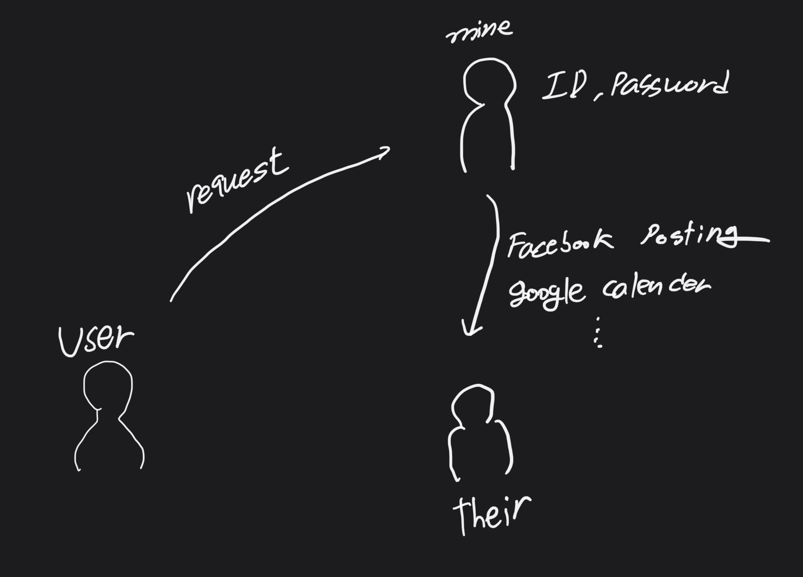
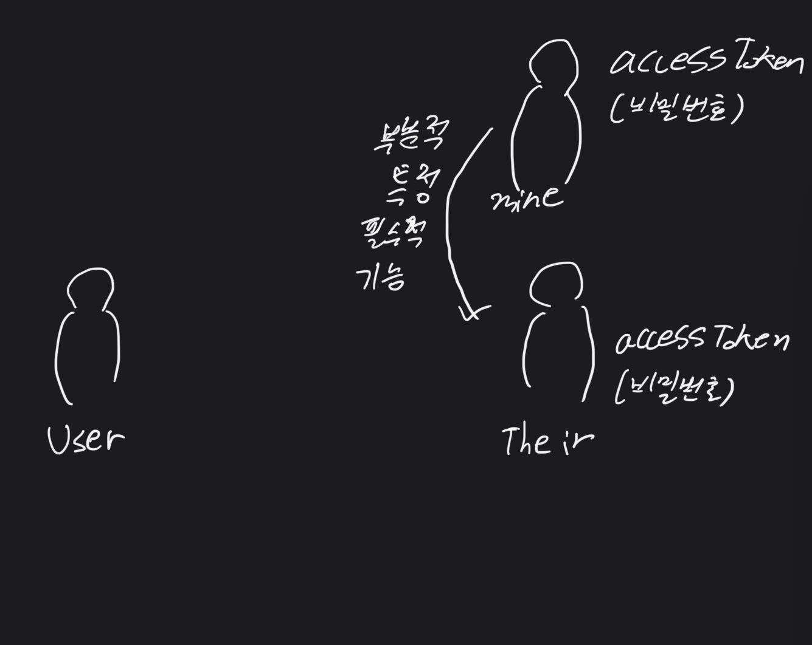

## OAuth2

서비스의 구성을 세 측면으로 나눌 수 있다.

사용자가 나의 서비스에 특정 기능을 요청하고 나의 서비스에서 **제 3자의 서비스에 요청을 전달하여** 사용자 대신 페이스북 포스팅, 구글 캘린더 등의 기능을 자동으로 제공해준다. 이 과정에서 나의 서비스에는 사용자의 ID, password같은 제 3자 서비스 로그인 정보를 받게 되는데, 이는 사용자 입장에서 신뢰하기가 쉽지 않다. 사용자 입장 뿐만 아니라 서비스의 제공자와 써드파티 입장에서도 신뢰에 관한 문제는 부담이 크다.

이러한 신뢰성에 대한 걱정을 덜기 위해 OAuth를 사용한다. OAuth를 사용하면 흐름이 다음과 같아진다.

써드파티 서비스에서 액세스토큰(accessToken)이라는 일종의 **비밀번호**를 발급해주고 나의 서비스에서 필요로 하는 기능까지 특정하여 액세스 토큰을 넘겨준다. 받은 액세스 토큰을 바탕으로 써드파티 서비스를 사용자에게 제공할 수 있게 된다.

OAuth가 사용되는 일반적인 예시로 회원가입이 있다. 회원가입시 OAuth를 활용하면 회원 개인정보를 직접 관리하지 않아도 된다는 큰 장점이 있다.

## 역할

OAuth의 주체는 세 가지가 있다. 위의 예시에서의 Their는 **리소스 서버(Resource Server)**, User를 **리소스 오너(Resource Owner)**, Mine을 **클라이언트(Client)**라고 한다.

추가적으로 **어서라이즈 서버(Authorization Server)**가 있는데, 사용자 인증 기능을 위한 주체로 구분되어 있지만 리소스 서버와 결이 같으므로 한 번에 표현하기로 강의에서 진행하였다.

## 등록

클라이언트가 리소스 서버를 이용하기 위해서는 리소스 서버의 승인을 사전에 받아놓아야 하며 이를 **등록이라고 한다.** 등록하는 방법은 모두 다르지만 공통적으로 클라이언트 아이디, 클라이언트 시크릿, `Authorized redirect URls`(Authorized 코드를 부여하는 사이트)를 받는다.

1. Facebook Develop -> create app ..
2. Google Cloud Platform -> Select a project -> new project , 프로젝트 선택 후 메뉴의 API & service -> Credentials로 OAuth client ID 생성

## 인증 - 리소스 오너의 승인

OAuth를 등록한 뒤에는 리소스 서버 단에서 클라이언트 아이디, 클라이언트 시크릿, 리다이렉트 URL을 갖게되고 클라이언트 역시 클라이언트 아이디, 클라이언트 시크릿을 갖고 있다. 리다이렉트 URL에 해당하는 페이지는 클라이언트가 구현해놓고 준비해놓은 상태여야 한다.

리소스 서버의 전체 기능 중 A,B에 해당하는 기능만 필요하다면 A,B 기능만을 위한 인증을 받아야 한다.

시나리오 하나를 가정해보면

1. 리소스 오너가 클라이언트에게 기능을 요청한다.
2. 해당 기능은 리소스 서버에게 요청이 필요한 기능이다.
3. 이에 따라 클라이언트는 리소스 오너에게 인증을 요청한다.

인증 URL의 형식은 다음과 같다. `https://resource.server/?client_id=1&scope=B C&redirect_uri=https://client/callback`

이후 리소스 오너가 받은 요청을 처리하여 리소스 서버에게 요청을 보내면 로그인 여부를 판단하여 리소스 오너에게 로그인 화면을 보내주고, 성공 시 접속 시도를 하는 클라이언트 아이디와 리다이렉트 url의 비교를 하여 진위 여부를 판단한다.

정상적으로 처리되면 이후 사용자가 요청한 기능(스코프)을 제공할 것이라는 화면을 리소스 오너에게 보내어 승인 여부를 물은 뒤 승인을 받으면 리소스 서버가 응답을 받아 유저 아이디와 스코프 등 사용자 정보를 저장한다.

## 인증 - 리소스 서버의 승인

리소스 오너로부터 승인을 받은 상태이고 리소스 서버의 승인을 받을 차례이다. 하지만 바로 액세스 토큰을 발행해주는 것이 아니라 `authorization code`를 리소스 서버가 리소스 오너에게 전달한다. `Location: https://client/callback&code=3`의 형식을 띠고 code파라미터 값이 `authorization code`값에 해당한다.

전달된 주소로 리소스 오너가 접속하게 되면 **클라이언트의 인식 없이** 은밀하게 해당 주소로 클라이언트에게 접속을 한다. 접속 후에는 클라이언트도 `authorization code`를 알게 된다.

이후 클라이언트는 리소스 오너를 통해 리소스 서버에 접속하는 것이 아니라 리소스 서버에 **직접 접속한다.** `https://resource.server/token?grant_type=authorization_code&code=3&redirect_uri=https://client/callback&client_id=1&client_secret=2`라는 형식의 주소를 통해 접속하게 된다. (더 다양한 옵션도 존재) 가장 중요한 것은 `authorization code`와 `client secret`을 결합한 정보를 통해 리소스 서버에 접속을 한다는 것이다.

접속 요청을 받은 리소스 서버는 클라이언트 아이디, 시크릿, `authorization code`, 리다이렉트 URI 등 모든 것이 일치할 때에 다음 단계로 진행하게 되는데 이 단계가 바로 **액세스 토큰이 발급되는 것이다.**

## 액세스 토큰 발급

`authorization code`는 클라이언트로부터 전달받은 데이터와 일치했을 때 재인증 문제 방지를 위해 삭제한다.

액세스 토큰을 발급한 뒤 해당 값을 클라이언트에게 응답하고 클라이언트는 서비스 내부적으로 액세스 토큰을 저장한다. 이후로는 클라이언트가 액세스 토큰으로 리소스 서버에 요청을 할 때마다 가장 처음에 리소스 서버에 전달되었던 유저 정보와 스코프 등 다양한 옵션에 해당하는 정보들을 클라이언트에게 기능을 허용하게 된다.

## API호출

1. [google calender API](https://developers.google.com/calendar/api/v3/reference)사이트에 접속한다.
2. URls relative to...부분의 주소를 후 브라우저 주소창에 붙여넣어둔다.
3. 이후 필요한 API 주소를 붙여넣으면 해당 API의 기능을 나열한 페이지가 나타난다. [API 예시](https://www.googleapis.com/calendar/v3/calendars/calendarId/acl)

액세스토큰을 구하는 방법은 각 어플리케이션마다 다르게 나타나기 때문에 공부해야됨!
