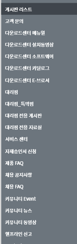
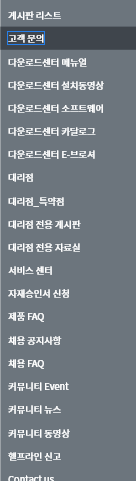
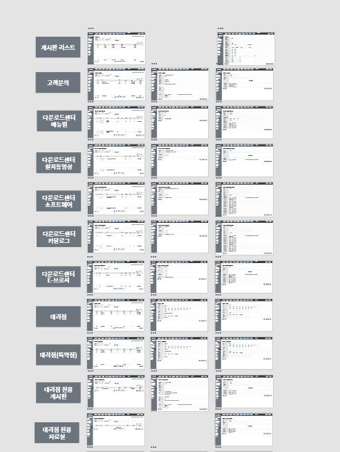
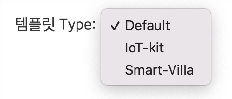
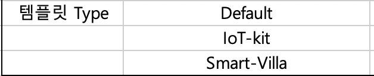
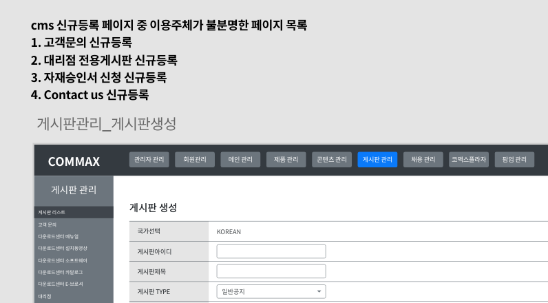

매일 성장할 수 있는 기회를 찾고 씨앗을 심자.

## 220103

애드업에서 진행중인 프로젝트 중 하나로 코맥스 사이트가 있다. 코맥스 cms(관리자) 사이트의 이전으로 인해 기획 단계부터 진행중인 프로젝트이다.

1. 코맥스 IA와 코맥스 cms사이트의 게시판 관리 파트를 비교하여 xd파일 수정 작업을 진행하였음.
   - IA 순서에 맞게끔 xd 기획서 전체 재배열 진행
   - 각 기획서 페이지마다 사이드바 포커싱 이동 작업 진행
2. [shutterstock에서](https://www.shutterstock.com/ko/explore/korea-stock-images-0814?kw=shutterstock&c3apidt=p67361398787&gclid=Cj0KCQiA_c-OBhDFARIsAIFg3exOJwj7iuXhlK0bzVqftdiKw4nXDo6VpJHzH2gAb7-v99gdFEyV9fwaAtC7EALw_wcB&gclsrc=aw.ds) 거래처의 기획 의도에 맞는 영상 소스 서치





## 220104

1. 코맥스 cms페이지 xd파일 수정 작업 진행
2. cms페이지 드랍다운 데이터 마이그레이션을 위해 추출 및 액셀 저장
   - 드랍다운 셀렉트 박스에서 데이터를 추출하기 위해 기존 cms에 정의된 DOM id값을 이용하였다.

```js
a = document.getElementById("ID값");
textArr = [];
for (i = 0; i < a.childNodes[1].childElementCount; i++) {
  textArr.push(a.childNodes[1].childNodes[2 * i + 1].text);
}

console.log(...textArr);
```

**console.log로 출력시 배열 앞에 ...을 붙이면 배열 형태가 아닌 문자열 형태로 출력해준다.**

다음과 같이 드랍다운 형태로 저장된 데이터를 추출하는 작업이다.



:::tip 오늘의 씨앗
수기로 작업하던 부분을 직접 자동화하여 귀찮은 작업을 단순화시켰다는 점에서 성장할 수 있었다. (추출할 데이터가 부분적으로 나뉘어 총 1000라인 정도 됐었음.)
:::

## 220105

1. 코맥스 cms 게시판관리 페이지 xd 기획서 수정 (기존 작성 파일의 신규등록 폼과 이를 바탕으로 한 상세페이지 폼이 상이하여 이를 주된 수정사항으로 처리)



:::tip 오늘의 씨앗
질문 잘하는 법 - 주어진 업무의 전체적인 틀을 파악한 뒤에 공통적으로 나타나는 문제점을 한 번에 파악하여 포괄적인 질문을 드리면 사수님의 업무 효율에 방해가 되지 않는 선에서 나의 업무를 잘 마무리 할 수 있게 된다.

질문에 대한 답변을 들을 때 매직아이와 함께 꼭 메모장에 수기로 메모하기.

협업관계에 있는 사람에게 자료를 전달할 때에는 귀찮아도 가독성 좋게 코멘트 달아두기.
:::
