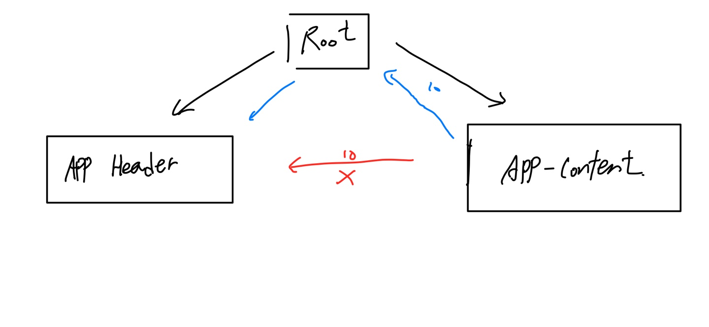
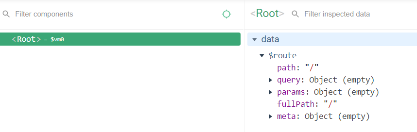
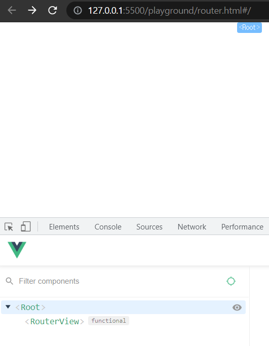
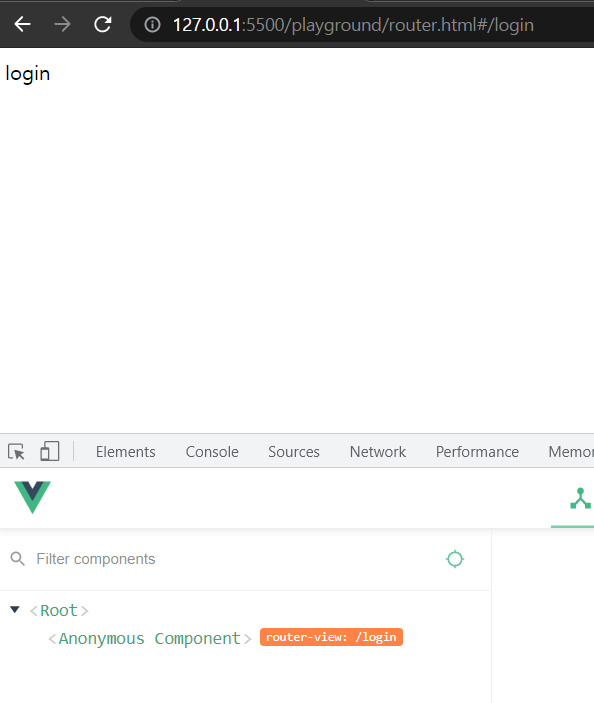
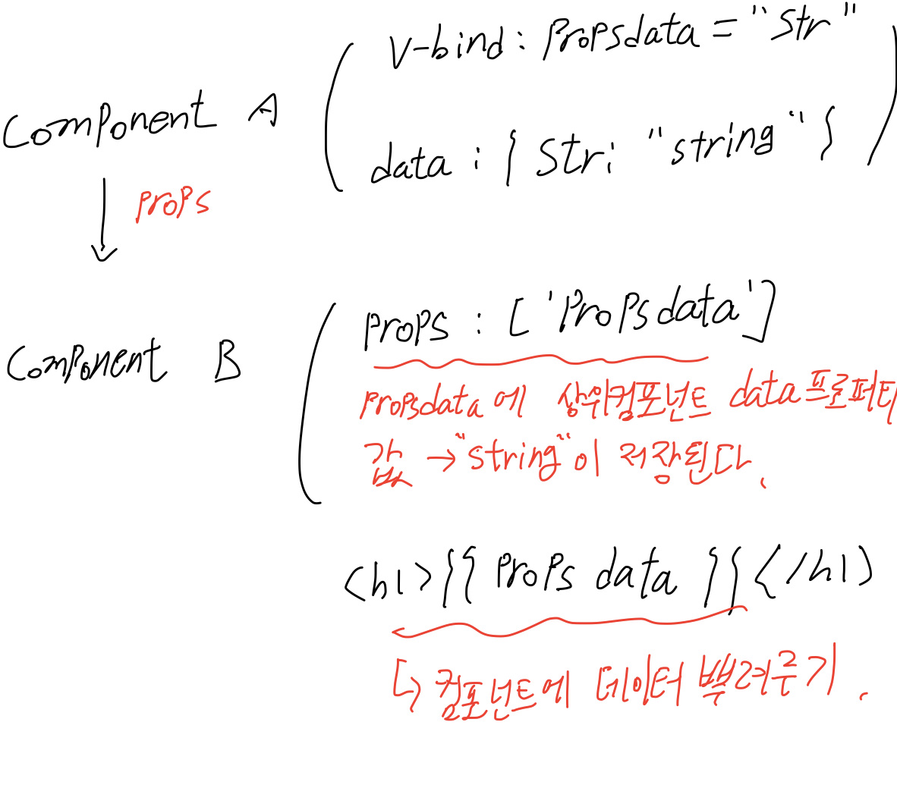
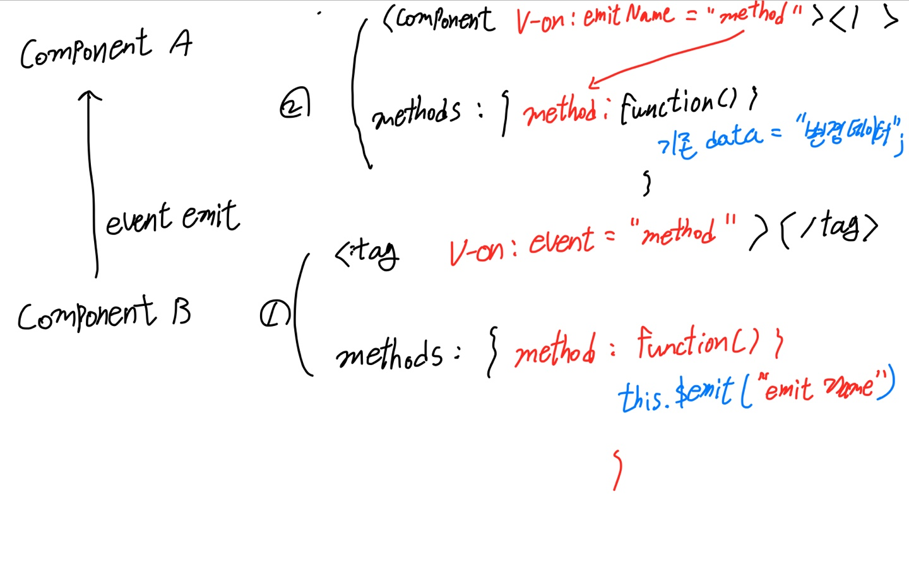

## 1. Vue js 소개

### 1.1 MVVM 모델에서의 vue

Vue란? MVVM패턴의 뷰모델 레이어에 해당하는 화면단 라이브러리
html요소에서 사용자에게 이벤트를 받음 (DOM Listener) -> Model로 넘어가 자바스크립트 상에서 조작 -> DataBindings를 통해 view에 반영

### 1.2 기존 웹 개발 방식 (HTML js만 이용)

```html
<div id="app"></div>

<script>
  // console.log(div);
  var div = document.querySelector("#app");
  var str = "hello world";
  div.innerHTML = str;
  str = "hello world!!!";
  div.innerHTML = str;
</script>
```

id app을 가진 div태그를 받아서 문자열을 수정하고 싶을때 기존 웹 개발 방식에서는 **문자열 수정 코드를 한번 더 기입 해줘야했다.** -> 위의 예시 코드에서 `str = "hello world!!!";`로 str값을 수정해도, `div.innerHTML`로 DOM에 대한 값을 한번 더 수정해줘야함.

### 1.3 Reactivity 구현

Reactivity는 vue의 핵심 기능!
Reactivity의 구현은 Object객체의 defineProperty() 메소드를 이용한다.

```html
<body>
  <div id="app"></div>

  <script>
    var div = document.querySelector("#app");
    var viewModel = {};

    // Object.defineProperty('대상 객체', '객체의 속성', {
    //     정의할 내용
    // })
    Object.defineProperty(viewModel, "str", {
      // 속성에 접근했을 때의 동작을 정의
      get: function() {
        console.log("접근");
      },
      // 속성에 값을 할당했을 때의 동작을 정의
      set: function(newValue) {
        console.log("할당", newValue);
        div.innerHTML = newValue;
      },
    });
  </script>
</body>
```

Object.defineProperty()는 객체의 기본 속성을 **재 정의한다.**

a. 객체의 할당, 접근이라는 기본 속성을 재 정의하기 위해 get, set을 이용한다.
b. get은 접근, set은 할당

`Object.defineProperty(viewModel, "str", {})` -> viewModel 객체의 str속성에 접근할 {} 행동으로 객체 속성을 재 정의

### 1.4 Reactivity 코드 라이브러리화 하기

코드의 라이브러리화를 위해 즉시 실행 함수 표현을 이용한다.
[즉시 실행 함수 표현(IIFE, Immediately Invoked Function Expression)](https://developer.mozilla.org/ko/docs/Glossary/IIFE)

```js
(function() {
  statements;
})();
```

`(function (){})` -> 익명 함수 (Anonymous Function)

1. IIFE 내부에서 선언하는 변수를 통해 전역 범위에서의 불필요한 변수 선언을 없앤다.
2. IIFE 내부로 다른 변수들이 접근하는 것을 막아준다.
   `...();` -> 즉시 실행 함수를 생성하는 괄호

```js
(function() {
  var Name = "Barry";
})();
Name;
// throws "uncaught ReferenceError : Name is not defined
```

```js
var result = (function() {
  var name = "barry";
  return name;
})();
result; //barry
// barry를 return하는 IIFE가 변수에 저장되는 것이 아니라, 함수 실행 결과만 저장된다.
```

```html
<script>
  var div = document.querySelector("#app");
  var viewModel = {};
  // IIFE에 함수들 집어넣기
  (function() {
    // init함수 추가
    function init() {
      Object.defineProperty(viewModel, "str", {
        get: function() {
          console.log("접근");
        },
        set: function(newValue) {
          console.log("할당", newValue);
          render(newValue);
        },
      });
    }
    // render함수 추가
    function render(value) {
      div.innerHTML = value;
    }
    // init실행
    init();
  })();
</script>
```

## 2. 인스턴스

### 2.1 인스턴스 소개

인스턴스란 뷰로 개발할 때 필수로 생성해야하는 코드 (객체지향 언어에서 클래스 내의 함수 및 변수)

```js
new Vue();

var vm = new Vue();
console.log(vm);
// vm을 로그로 찍어서 인스턴스 내에 속성과 API를 확인해볼 수 있다.
```

#### 2.1.1 생성자 함수 만들기

암묵적인 합의 내용 -> 함수의 이름 첫 글자를 대문자로 한다.

```js
function Person(name, job) {
  this.name = name;
  this.job = job;
}
new Person("josh", "doctor");
var p = Person("josh", "developer"); // 객체 생성 및 저장
```

모든 객체는 자신의 prototype으로부터 constructor 속성을 상속한다.

:::tip
프로토타입(prototype)이란?
Javascript는 프로토타입 기반 언어이다. (클래스가 ECMA6에 와서 문법적으로 추가되었지만, 여전히 프로토타입 기반)
JS의 모든 객체는 자신의 부모 역할을 담당하는 객체와 연결되어있는데,
이러한 부모 객체를 프로토타입(Prototype) 객체 또는 프로토타입이라고 한다.

자식 관계에 있는 객체가 부모 객체의 프로퍼티 또는 메소드를 상속받아 사용할 수 있게 됨.
:::

:::tip vue를 생성자 함수 형태로 저장하는 이유?
객체 사용시 매번 함수를 정의하는 것이 아니라, 인스턴스로 저장되어 있는 함수를 불러다가 사용하기 위해
:::

```js
function Vue() {
  this.logText = function() {
    console.log("hello");
  };
}
var vm = new Vue();
vm.logText(); // hello
```

[Cracking Vue.js 인스턴스 라이프사이클 다이어그램 & 사이프사이클 훅](https://joshua1988.github.io/vue-camp/vue/life-cycle.html)

## 3. 컴포넌트

뷰 컴포넌트 -> 화면을 영역별로 나누어 관리한다.
컴포넌트의 적용을 통해 재사용성을 확대
컴포넌트 생성시 각 컴포넌트간에 관계가 생긴다.
인스턴스 생성시 기본적으로 루트 컴포넌트가 된다.

- 컴포넌트 등록하기

```html
<body>
  <div id="app">
    <app-header></app-header>
  </div>

  <script src="https://cdn.jsdelivr.net/npm/vue/dist/vue.js"></script>
  <script>
    //전역 컴포넌트
    Vue.component("app-header", {
      template: "<h1>Header</h1>",
    });
    new Vue({
      el: "#app",
    });
  </script>
</body>
```

`Vue.component('컴포넌트 이름', { statements... 컴포넌트 내용})`
위 코드에서 컴포넌트로 app-header를 생성한 뒤, 해당 컴포넌트는 `<h1>Header</h1>`라는 역할을 하도록 만들었다.
이후 html상에 일반 태그를 이용하는 것 처럼 `<app-header></app-header>` 사용하면 컴포넌트가 적용된다. (chrome inspect에서 확인하기)
위 코드는 **전역 컴포넌트임.**

### 3.1 지역 컴포넌트 등록

서비스 개발 시 가장 자주 사용하게 됨.
Vue 인스턴스 생성시 `components` 속성으로 지역 컴포넌트를 등록한다. (전역컴포넌트와 구조가 동일)

```html
<script>
  // 전역 컴포넌트 등록 방식
  Vue.component("app-header", {
    template: "<h1>Header</h1>",
  });
  // 전역 컴포넌트 등록 방식
  Vue.component("app-content", {
    template: "<div>content</div>",
  });

  // 지역 컴포넌트 등록 방식
  new Vue({
    el: "#app",
    components: {
      // '컴포넌트 이름 : 컴포넌트 내용'
      "app-footer": {
        template: "<footer>footer</footer>",
      },
    },
  });
</script>
```

**전역 컴포넌트와 지역 컴포넌트의 차이점?**

SPA 프레임워크로써, 한 페이지에 다양한 기능을 가진 앱들 (component들)을 만들기 위해 지역 컴포넌트를 이용하는 것이고, 전역컴포넌트를 이용하는 경우는 라이브러리화 하여 전역적 범위에서 서비스가 이용해야하는 기능 또는 플러그인들을 정의할 때 사용한다.

### 3.2 컴포넌트와 인스턴스의 관계

```html
<script>
  new Vue({
    el: "#app",
    components: {
      // '컴포넌트 이름 : 컴포넌트 내용'
      "app-footer": {
        template: "<footer>footer</footer>",
      },
    },
  });

  new Vue({
    el: "#app2",
    components: {
      "app-footer": {
        template: "<h1>hello</h1>",
      },
    },
  });
</script>
```

위와같이 인스턴스를 두개 생성하였을 때, `#app` 인스턴스에서 이용중인 지역 컴포넌트 app-footer를 `#app2` 인스턴스에서 이용하는 것은 불가능하다. 새로운 인스턴스(#app2)를 생성하여 `#app2`의 지역 컴포넌트를 따로 생성해줘야함.

### 3.3 컴포넌트 통신 방식

뷰 컴포넌트는 각각 고유한 데이터 유효 범위를 갖는다.
컴포넌트들을 생성하면 각 컴포넌트는 서로 관계가 만들어진다.
컴포넌트의 관계를 활용하려면 규칙을 정확히 알아야한다. 이 규칙이 바로 컴포넌트 통신 방식이다.
[Cracking Vue.js Component communication](https://joshua1988.github.io/vue-camp/vue/components-communication.html)
상위에서 하위 컴포넌트로 데이터 이동 -> props속성을 이용
하위에서 상위 컴포넌트로 데이터 이동 -> 이벤트 발생이라는 데이터 전달 방식 이용

:::tip 컴포넌트 통신 규칙이 필요한 이유

컴포넌트 간에 통신이 시작되면서, 데이터의 입력으로 다양한 컴포넌트들이 유기적으로 값에 변화를 주게 된다. 이러한 상황에서 컴포넌트 통신 규칙이 중요하다.
:::

1. MVC 패턴에서의 문제점 -> n방향 컴포넌트들은 데이터 전달중에 발생한 버그를 추적하는 데에 어려움이 존재한다.
2. Vue 컴포넌트 통신 방식이라는 규칙을 통해, 데이터를 부모객체로부터 자식 객체라는 단방향 흐름으로 확정짓게 되면 데이터 전달 중에 발생한 버그를 추적하는 데에 어려움이 적어진다. (자식 객체에서 올라가는 데이터 -> Event, 부모 객체에서 자식으로 -> Props)

### 3.4 Props 속성

```html
<body>
  <div id="app">
    <app-header v-bind:propsdata="message"></app-header>
  </div>
</body>
<script>
  var appHeader = {
    template: "<h1>header</h1>",
    props: ["propsdata"],
  };
  new Vue({
    el: "#app",
    components: {
      "app-header": appHeader,
    },
    data: {
      message: "hi",
    },
  });
</script>
```

1. Vue 인스턴스를 message속성과 함께 생성한다. (인스턴스는 루트 컴포넌트가 된다)
2. 자식 컴포넌트를 생성하여 props 속성을 추가한다.
3. html상에서 props 문법을 적용한다. `<compName v-bind:props속성의 이름 = "상위 컴포넌트의 data 이름"></compName>`
4. inspect해보면, 자식 컴포넌트에 상위 컴포넌트의 데이터가 들어있는 것을 확인할 수 있다.

:::tip Props 속성의 특징
상-하위 컴포넌트 데이터 전달 중에 Reactivity가 그대로 구현된다. (하위 컴포넌트에서 props로 데이터를 받고 있는 상황에서, 상위 컴포넌트의 데이터를 변경하면 변경사항이 바로 반영됨.)
:::

### 3.5 Event emit

```html
<body>
  <div id="app">
    <app-Header></app-Header>
  </div>
  <script>
    var appHeader = {
      template: '<button v-on:click="passEvent">Click me</button>',
      methods: {
        passEvent: function() {
          this.$emit("pass");
        },
      },
    };
    new Vue({
      el: "#app",
      components: {
        "app-header": appHeader,
      },
    });
  </script>
</body>
```

1. 인스턴스를 생성하고, 자식 컴포넌트도 생성한다.
2. 자식 컴포넌트의 템플릿에 `v-on:click: methodName`을 준다.
   - `<button v-on:click="methodName"></button>`
3. 자식 컴포넌트의 템플릿에 전달할 메소드를 정의한다.

```js
methods:{
    methodName: function(){
        alert("event received!");
    }
}
```

v-on:click을 통해 하위 컴포넌트에서 이벤트를 pass라는 이름으로 발생시킨다. `this.$emit("pass")`
상위 컴포넌트 입장에서 하위 컴포넌트가 발생시킨 이벤트를 잡아주는 작업을 추가로 진행해야한다. `v-on:하위 컴포넌트에서 발생한 이벤트 이름 = "상위 컴포넌트의 메서드 이름"`

```html
<script>
  // 루트 컴포넌트
  new Vue({
    el: "#app",
    components: {
      "app-header": appHeader,
    },
    methods: {
      logText: function() {
        console.log("hi");
      },
    },
  });
</script>
```

### 3.6 뷰 컴포넌트에서의 this

```js
var obj = {
  num: 10,
  getNumber: function() {
    console.log(this.num);
  },
};
```

```js
new Vue() = {
  methods: {
    getNumber: function() {
      console.log(this.num);
    },
  },
  el: "",
  data: {
    num: 10,
  },
};
```

첫 번째 예제코드 -> pure js기반. this로 객체의 속성 하나를 불러오고 있음.
두 번째 예제코드 -> vue 인스턴스를 생성하여 this로 data값을 출력하고있음.
`this.data.num`이 아니라, `this.num`만 하면 된다.

## 4. 컴포넌트 통신 방법 응용

### 4.1 같은 컴포넌트 레벨 간의 통신 방법

간단한 트리 구조를 생각하면 된다.


트리 구조라고 생각했을 때, 같은 레벨의 노드끼리 횡적으로 연결된 상태가 아니기 때문에 **부모 노드를 거쳐 형제 노드로 데이터를 전달해야한다.**
따라서, 상위로 넘어갈 때 event를 발생시키고, 부모노드에서 자식 노드로 내려갈 때 props 프로퍼티를 이용한다.

```html
<body>
  <div id="app">
    <app-header v-bind:propsdata="num"></app-header>
    <app-content v-on:pass="deliverNum"></app-content>
  </div>
</body>
<script>
  var appHeader = {
    props: ["propsdata"],
    template: "<div>header</div>",
  };
  var appContent = {
    template: "<div>content<button v-on:click='passNum'>pass</button></div>",
    methods: {
      passNum: function() {
        this.$emit("pass", 10);
      },
    },
  };
  new Vue({
    el: "#app",
    components: {
      "app-header": appHeader,
      "app-content": appContent,
    },
    data: {
      num: 0,
    },
    methods: {
      deliverNum: function(value) {
        this.num = value;
      },
    },
  });
</script>
```

### 4.2 컴포넌트 통신 흐름 정리 (같은 레벨의 컴포넌트)

1. app-header 컴포넌트에서 app-Content 컴포넌트로 데이터를 보낸다고 가정
2. app-header 컴포넌트에서 상위 컴포넌트인 인스턴스로 데이터를 먼저 보낸다.
   a. app-header 컴포넌트에 `this.$emit('전달하는 이벤트 명', data)`로 methods 프로퍼티 추가
   - b. html의 컴포넌트에 v-on 추가 `<app-header v-on:"상위 컴포넌트로 전달할 이벤트 명"="상위 컴포넌트에서 받을 메소드 명"></app-header>`
   - c. 상위 컴포넌트에서 methods 프로퍼티를 추가한다. `methods: {상위 컴포넌트에서 받을 메소드 명 function...}`
3. app-content 컴포넌트에서 props프로퍼티로 데이터 받기
   d. html 컴포넌트중 데이터를 내려받을 컴포넌트에 `<app-content v-bind:propsdata="component methods "></app-content>`추가. (v-bind:내려받을 데이터 props프로퍼티 이름 = "상위 컴포넌트에서 데이터를 전달할 메소드 이름")

## 5. 라우터

### 5.1 뷰 라우터 소개와 설치

뷰 라우터란? SPA를 구현하거나, 페이지 간 이동하는 기능을 구현할 때 이용하는 라이브러리

설치

1. Vue CDN, Vue Router CDN 등록
2. Vue 인스턴스와 Vue Router 인스턴스 두개 생성

```html
<script>
  new VueRouter({});
  new Vue({
    el: "#app",
  });
</script>
```

### 5.2 뷰 라우터 인스턴스 연결 및 초기 상태

```html
<script>
  var router = new VueRouter({});
  new Vue({
    el: "#app",
    router: router,
  });
</script>
```

뷰 라우터 인스턴스 생성 후 변수에 할당
Vue인스턴스의 router 프로퍼티에 주입



```html
<script>
  var LoginComponent = {
    template: "<div>login</div>",
  };
  var MainComponent = {
    template: "<div>main</div>",
  };
  var router = new VueRouter({
    // 페이지의 라우팅 정보
    routes: [
      {
        // 페이지의 url
        path: "/login",
        //해당 url에서 표시될 컴포넌트
        component: LoginComponent,
      },
      {
        path: "/main",
        component: MainComponent,
      },
    ],
  });

  new Vue({
    el: "#app",
    router: router,
  });
</script>
```

routes 프로퍼티 이용하기

1. routes프로퍼티에는 페이지 당 객체 하나가 할당된다.
2. 객체 내에 정의하는 프로퍼티로 path, component 등이 있다.
3. path는 페이지의 url을 의미하고, component는 해당 url에서 표시될 컴포넌트를 의미한다.

### 5.3 라우터가 표시되는 영역 및 router-view 태그 설명

```html
<body>
  <div id="app">
    <router-view></router-view>
  </div>
  <script src="https://cdn.jsdelivr.net/npm/vue/dist/vue.js"></script>
  <script src="https://unpkg.com/vue-router/dist/vue-router.js"></script>
  <script>
    var LoginComponent = {
      template: "<div>login</div>",
    };
    var MainComponent = {
      template: "<div>main</div>",
    };
    var router = new VueRouter({
      // 페이지의 라우팅 정보
      routes: [
        {
          // 페이지의 url
          path: "/login",
          //해당 url에서 표시될 컴포넌트
          component: LoginComponent,
        },
        {
          path: "/main",
          component: MainComponent,
        },
      ],
    });

    new Vue({
      el: "#app",
      router: router,
    });
  </script>
</body>
```

1. html상에 라우터 컴포넌트가 표시될 영역에 `<router-view></router-view>` 태그로 감싼다.
2. 이후 라우터 프로퍼티에 정의한 객체의 path프로퍼티에 따라 url을 수정하면 해당 컴포넌트 객체 (페이지)에 맞는 템플릿이 표시된다.




### 5.4 링크를 이용한 페이지 이동 및 router-link 태그 설명

url을 통한 페이지의 이동이 아니라, 링크를 통해 이동하는 방법에 대해 설명

```html
<body>
  <div id="app">
    <div>
      <router-link to="/login">Login</router-link>
      <router-link to="/main">Main</router-link>
    </div>
    <router-view></router-view>
  </div>
  <script src="https://cdn.jsdelivr.net/npm/vue/dist/vue.js"></script>
  <script src="https://unpkg.com/vue-router/dist/vue-router.js"></script>
  <script>
    var LoginComponent = {
      template: "<div>login</div>",
    };
    var MainComponent = {
      template: "<div>main</div>",
    };
    var router = new VueRouter({
      mode: "history",
      // 페이지의 라우팅 정보
      routes: [
        {
          // 페이지의 url
          path: "/login",
          //해당 url에서 표시될 컴포넌트
          component: LoginComponent,
        },
        {
          path: "/main",
          component: MainComponent,
        },
      ],
    });

    new Vue({
      el: "#app",
      router: router,
    });
  </script>
</body>
```

mode:history 프로퍼티로 깔끔한 url을 만들 수 있다.

html상에서 이동할 라우터 컴포넌트에 `<router-link to="/routerLink"></router-link>`를 추가해준다.
router-link to="pathName"
위의 코드가 잘 작동하기 위해서는, **path가 등록되어 있는 라우터 인스턴스가 Vue인스턴스에 router프로퍼티로 연결되어있어야한다**
router인스턴스 내에서 routes 프로퍼티의 페이지 객체에 기입하는 component는 **components가 아니라, component이다. (페이지마다 뿌려지는 컴포넌트는 하나이기 때문)**

## 6. 액시오스

### 6.1 Ajax

비동기 웹 어플리케이션 제작을 위해 사용하는 웹 개발 기법이다. (Asynchronous JavaScript and XML)

1. 표현 정보를 위한 HTML과 CSS
2. 동적인 화면 출력 및 표시 정보와의 상호작용을 위한 DOM JS
3. 웹 서버와 비동기적으로 데이터를 교환하고 조작하기 위한 XML, XSLT, XMLHttpRequest

새로운 웹 페이지를 가공하여 전달하는 것이 아니라, 필요한 데이터만 전달 및 가공후 로드

### 6.2 axios소개

Vue에서 공식적으로 라이브러리 관리를 하지는 않지만, axios Http통신 라이브러리가 vue 커뮤니티 상에서 가장 널리 사용된다.

자바스크립트 비동기 처리 패턴

1. callback
2. promise
3. promise + generator
4. async & await

### 6.3 axios 실습

```html
<script src="https://cdn.jsdelivr.net/npm/vue/dist/vue.js"></script>
<!-axios 오픈소스 CDN -->
<script src="https://unpkg.com/axios/dist/axios.min.js"></script>
<script>
  new Vue({
    el: "#app",
    data: {
      users: [],
    },
    methods: {
      getData: function() {
        var vm = this;
        axios
          .get("https://jsonplaceholder.typicode.com/users/")
          .then(function(response) {
            console.log(response.data);
            vm.users = response.data;
          })
          .catch(function(error) {
            console.log(error);
          });
      },
    },
  });
</script>
```

[jsonplaceholder : 데이터 통신 및 기능구현 테스트 위한 샘플 사이트](https://jsonplaceholder.typicode.com/)

## 7. 템플릿 문법

뷰에서 화면을 조작할 수 있는 문법

### 7.1 데이터 바인딩

데이터 바인딩은 뷰 인스턴스에서 정의한 속성들을 표시하는 방법

```html
<div>Hello {{ message }} !</div>
```

디렉티브 : (v-가 붙는 문법들) 뷰로 화면을 조작하는데 편의를 제공하는 문법

```html
<body>
  <div id="app">
    <p v-bind:class="name"></p>
  </div>

  <script src="https://cdn.jsdelivr.net/npm/vue/dist/vue.js"></script>
  <script>
    new Vue({
      el: "#app",
      data: {
        name: "text-blue",
      },
    });
  </script>
</body>
```

데이터 바인딩을 통해 id값은 물론 클래스까지 바인딩 할 수 있다.
`v-bind:id = "프로퍼티 값 이름"`, `v-bind:class = "프로퍼티 값 이름"`

### 7.2 computed 속성

```html
<body>
  <div id="app">
    <p>{{num}}</p>
    <p>{{doubleNum}}</p>
    {{str}}
  </div>

  <script src="https://cdn.jsdelivr.net/npm/vue/dist/vue.js"></script>
  <script>
    new Vue({
      el: "#app",
      data: {
        str: "hi~!",
        num: 10,
      },
      computed: {
        doubleNum: function() {
          return this.num * 2;
        },
      },
    });
  </script>
</body>
```

1. 뷰 인스턴스의 data 속성에 num을 정의한다.
2. data속성에 doubleNum이라는 값으로 기존 data프로퍼티의 값을 조작하면 에러가 발생
3. **computed 프로퍼티를 새로 생성하여** 해당 프로퍼티의 값으로 함수를 할당한다.

### 7.3 methods속성과 v-on 디렉티브를 이용한 키보드,마우스 이벤트 처리

1. 뷰 인스턴스 생성
2. methods 프로퍼티 methods할당
3. 컴포넌트에 `v-on:methodName` 지정해주면 methods 프로퍼티의 함수가 실행된다

```html
<div id="app">
  <button v-on:click="logText">Click me</button>
  <input type="text" v-on:keyup="logText" />
</div>

<script src="https://cdn.jsdelivr.net/npm/vue/dist/vue.js"></script>
<script>
  new Vue({
    el: "#app",
    methods: {
      logText: function() {
        console.log("clicked");
      },
    },
  });
</script>
```

`v-on:event이름 = "methodsName"`

`v-on:event이름.Modifier = "MethodsName` -> modifier(이벤트의 특정 상황)

### 7.4 watch속성

데이터 속성 중 특정 값에 변화를 줄때 특정 로직을 실행하기 위해 사용하는 속성.

```html
<script>
  new Vue({
    el: "#app",
    data: {
      num: 10,
    },
    watch: {
      num: function() {
        this.logText();
      },
    },
    methods: {
      addNum: function() {
        this.num = this.num + 1;
      },
      logText: function() {
        console.log("changed");
      },
    },
  });
</script>
```

1. data 속성에 num을 할당
2. watch속성 정의 -> 값의 변화를 지켜볼 데이터 선택 (num을 선택하였음)
3. watch하다가 값의 변화가 일어날 때 수행할 메소드 선택 (this.method로 선택해야함!)

computed vs watch

1. 두 프로퍼티 모두 값의 변화를 실시간으로 추적한다.
2. computed는 단순 값의 계산 로직구현에 적합하다
3. watch는 이보다 더 무거운 로직 구현에 적합하다(데이터 요청 등)

데이터 변화에 대한 로직 구현은 웬만하면 computed속성으로 하는 것이 좋다.

[computed vs watch property](https://vuejs.org/v2/guide/computed.html#ad)

```html
<!-using watch -->
<script>
  var vm = new Vue({
    el: "#demo",
    data: {
      firstName: "Foo",
      lastName: "Bar",
      fullName: "Foo Bar",
    },
    watch: {
      firstName: function(val) {
        this.fullName = val + " " + this.lastName;
      },
      lastName: function(val) {
        this.fullName = this.firstName + " " + val;
      },
    },
  });
</script>
<script>
  // using computed
  var vm = new Vue({
    el: "#demo",
    data: {
      firstName: "Foo",
      lastName: "Bar",
    },
    computed: {
      fullName: function() {
        return this.firstName + " " + this.lastName;
      },
    },
  });
</script>
```

watch속성을 너무 자주 이용하게 되면 변화가 이루어질 데이터 모두에게 함수를 할당시켜야 하기 때문에 코드가 너저분해진다.

### 7.5 computed 속성을 이용한 클래스 코드 작성 팁

```html
<div id="app">
  <p v-bind:class="{ warning: isError }">Hello</p>
</div>
<script>
  new Vue({
    el: "#app",
    data: {
      isError: true,
    },
  });
</script>
```

1. bind 디렉티브를 통해 인스턴스의 data프로퍼티 값을 가져온다.
2. data에서 가져온 값은 isError로 Boolean 값이다.
3. `v-bind:class="{ className: Boolean }"` -> Boolean True or False 여부에 따라서, v-bind 디렉티브를 준 컴포넌트에 클래스가 할당될지 안될지 결정된다.

데이터 바인딩 시 직접 클래스에 코드를 기입해도 되지만, 이는 깔끔하지 못한 코드이다. -> **computed속성을 이용**

1. computed속성에 데이터 바인딩시 작동시킬 메소드를 만든다. -> Boolean값에 따라 뿌려주는 클래스가 다르다는 로직 -> 메소드에서 삼항연산자를 이용
2. 컴포넌트에 클래스로 computed의 메소드를 전달.

```html
<div id="app">
  <p v-bind:class="errorTextColor">Hello</p>
</div>

<script src="https://cdn.jsdelivr.net/npm/vue/dist/vue.js"></script>
<script>
  new Vue({
    el: "#app",
    data: {
      isError: true,
    },
    computed: {
      errorTextColor: function() {
        return this.isError ? "warning" : null;
      },
    },
  });
</script>
```

## 8. Vue cli

vue CLI 설치 이전, npm과 node 설치 및 설정을 진행한다.(vscode 개발환경 구축)
[node 환경변수 설정](https://www.daleseo.com/js-node-process-env/)
설치 후 무조건 껐다 켜기!!
[cli.vuejs](https://cli.vuejs.org/guide/installation.html) -> vue CLI 설치 공식 사이트

1. Vue CLI 설치
2. `vue create directoryName` 뷰 프로젝트 생성
3. 일단은 Default로 설정 후 설치 진행
4. 생성된 프로젝트 폴더로 들어간 뒤 `npm run serve` -> 로컬 서버에서 서비스 구현

### 8.1 CLI로 생성한 프로젝트 폴더 구조 확인 및 main.js파일 설명

`npm run serve`로 실행되는 기본적인 파일

1. public폴더의 index.html
2. src 폴더의 `main.js` -> 그 동안 실습시간에 만들었던 script태그의 뷰 인스턴스들이 저장된다.

### 8.2 싱글 파일 컴포넌트

1. vue 확장자로 파일 하나 생성
2. vue 앱 내에서 `vue`를 입력하면 자동완성 기능으로 기본 구조를 잡아준다.

```js
<template>
  <div>header</div>
</template>

<script>
export default {
  methods: {
    addNum: function() {
      // ...
    },
  },
};
</script>

<style></style>
```

html, js, css를 한 파일에서 관리하겠다는 것이 싱글파일 컴포넌트이다.

- 기존 html파일 내에서 template프로퍼티를 뷰 인스턴스에 추가하기 위해 객체를 하나 생성하여 할당하였는데, 더 이상 그렇게 하지 않아도 됨.
  a. 싱글 파일 컴포넌트에서 template태그 안에 컴포넌트를 만든다.
  b. 싱글 파일 컴포넌트의 script태그에서 js문법을 제외하고 각종 뷰 인스턴스 프로퍼티를 정의한다.
  c. css정의

### 8.3 App.vue

```js
<template>
  <div id="app">
    
    <HelloWorld msg="Welcome to Your Vue.js App" />
  </div>
</template>

<script>
import HelloWorld from "./components/HelloWorld.vue";

export default {
  name: "App",
  components: {
    HelloWorld,
  },
};
</script>
```

template

1. `<HelloWorld msg="Welcome to Your Vue.js App/"/>` === `<hello-world></hello-world>` === `<HelloWorld></HelloWorld>`
   script

2. `components: { HelloWorld }` === `components: {'hello-world': Helloworld}`

export default 내에 인스턴스 옵션 속성 또는 컴포넌트 옵션 속성을 넣어준다고 생각하면 됨!

```js
<script>
export default {
  name: "HelloWorld",
  props: {
    msg: String,
  },
};
</script>
```

components폴더의 HelloWorld.vue -> `props: ['msg']`라고 기존에 정의해왔던 것에 String이라는 타입을 붙여준 것

## 9. 싱글 파일 컴포넌트

싱글 파일 컴포넌트에는 루트 템플릿이 하나만 있어야 한다. 템플릿 내에 루트로 형제 컴포넌트가 존재하면 안됨

:::tip
[vue/no-multiple-template-root]
The template root requires exactly one element.eslint-plugin-vue
:::

vue 최신 문법에 따라, export default 내에서는 객체 리터럴을 직접 생성하여 할당하면 안된다. 재사용성 확대를 위해 프로퍼티에 함수 생성 및 객체를 리턴해야한다.

```js
<script>
export default {
  data: function() {
    return {
      str: "hi",
    };
  },
};
</script>
```

### 9.1 싱글 파일 컴포넌트 체계에서 컴포넌트 등록하기

일반적으로 vue프로젝트 생성 후 새로 생성하는 컴포넌트는 components폴더 아래에 Pascal-case로 파일명을 작성하여 생성한다.
스타일 가이드에서는 컴포넌트 이름이 기존 html태그의 이름과 중복되지 않도록 하기 위해 최소한 두 단어 이상으로 만들기를 권고하고있다.

components폴더에 컴포넌트 생성 및 App.vue에 등록하기

1. components 생성
2. App.vue에서 script태그에 생성한 컴포넌트.vue파일을 import해준다.
3. export default에서 components 프로퍼티 정의 후 컴포넌트 등록을 진행한다. `components: {'component-name': import한 컴포넌트 이름}`

```js
<template>
  <div>
    <app-header></app-header>
  </div>
</template>

<script>
// App.vue
import AppHeader from "./components/AppHeader.vue";
export default {
  data: function() {
    return {
      str: "hihihi",
    };
  },
  components: {
    "app-header": AppHeader,
  },
};
</script>
```

`./components/AppHeader.vue`라는 파일을 추적하여 AppHeader라는 변수에 저장한다고 생각하면 됨!

### 9.2 싱글 파일 컴포넌트에서 props 속성 사용하는 방법

1. 생성한 하위 컴포넌트에서 props속성 정의
2. methods 속성에 상위 컴포넌트로 보낼 메소드를 정의 (\$emit 이용!)
3. 하위 컴포넌트 템플릿에서 이벤트를 받아서 상위 컴포넌트로 보낸다.

```js
<template>
  <header>
    <h1>{{ propsdata }}</h1>
    <button v-on:click="sendEvent">send</button>
  </header>
</template>

<script>
export default {
  props: ["propsdata"],
  methods: {
    sendEvent: function() {
      this.$emit("renew");
    },
  },
};
</script>
```

1. App.vue에서 데이터를 받는 상황 -> 데이터 받는 태그에 `v-on:emit에 전달한 이벤트 이름="상위 컴포넌트에서 데이터 받을 메소드 이름"`
2. 메소드 정의 후 이벤트 처리

### 9.3 props & event emit 정리



