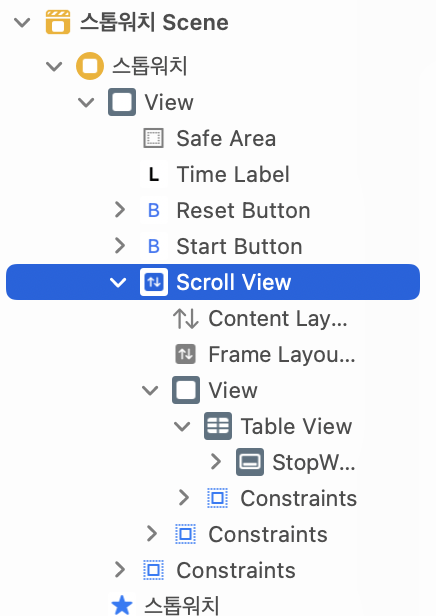

해당 문서는 [다음 링크의 문서를](https://fluffy.es/scrollview-storyboard-xcode-11/) 정리한 내용입니다.

## 스크롤뷰

오토레이아웃을 다룰 때에는 너비, 높이, 위치에 대한 정보가 갖춰져 있는지에 대해 항상 명확하게 해두어야 한다. 조금이라도 시스템적으로 오토레이아웃이 애매한 상황이 발생하면 xcode상에 ambiguous 오류가 발생하게 된다. (오토레이아웃 빨간선)

그러한 점에서 신경이 상당히 쓰이는 요소가 바로 스크롤뷰이다. 어떤 점에서 그렇게 될 수 밖에 없는지 스크롤뷰를 직접 만들어가며 알아보자.

스크롤뷰는 내부 컨텐츠를 지칭하길 `scrollable content`라고 한다. 스크롤 뷰 내에 포진될 컨텐츠들에 대해 너비-높이-위치에 대한 정보가 명확하기 정해져 있지 않으면 모호한 오토레이아웃이 되는 것이다.

## 레이아웃 설정

xcode 11버전 이후로 인터페이스 빌더에 프레임 레이아웃 가이드(frame layout guide)와 컨텐츠 레이아웃 가이드 (content layout guide)라는 개념이 등장하게 되었다. 스크롤 뷰 내의 컨텐츠 UI를 더 쉽게 디자인하기 위한 개념이며, 디폴트로 해당 설정은 enable 되어있다.

스크롤뷰에 필요한 제약조건은 아래와 같다.

1. 수퍼뷰를 기준으로 하는 스크롤뷰 자체 레이아웃
2. 스크롤 뷰 내부의 scrollable 컨텐츠에 대한 레이아웃

스크롤뷰를 생성했을때 UI 스트럭쳐에 컨텐츠 레이아웃 가이드, 프레임 레이아웃 가이드가 자동적으로 생성되어 있는 것을 볼 수 있다.

1. 프레임 레이아웃 가이드 - 스크롤뷰 자체의 너비, 높이, 포지션에 대한 정보를 담고있다.
2. 컨텐츠 레이아웃 가이드 - 스크롤뷰 내부에 있는 스크롤러블 컨텐츠들에 대한 오토레이아웃 정보를 담고있다.

## 스크롤뷰 제작

스크롤뷰를 생성하고 오토레이아웃을 잡는 과정은 아래와 같다.

1. 스크롤뷰를 라이브러리에서 가져온 뒤 수퍼뷰에 대해 원하는 대로 제약조건을 설정한다. (ambiguous하지 않도록)
2. `UIView` 요소를 스크롤뷰 내부에 삽입한다. 이때 해당 요소의 제약조건은 스크롤뷰 기준으로 top, leading, trailing, bottom anchor 모두 0으로 설정한다. (필수는 아님. 취향에 따라)
3. 삽입했던 View를 UI 스트럭처에서 Control + 드래그로 스크롤뷰의 컨텐츠 레이아웃 가이드와 연결한다. View를 컨텐츠 레이아웃 가이드의 top, leading, trailing, bottom을 맞춘다.
4. 이때 각 anchor의 constant값은 0으로 설정해준다. (필수는 아님)

스크롤러블 컨텐츠가 스크롤뷰의 상하좌우에 딱 붙게 해두었지만 ambiguous 오토레이아웃 오류가 사라지지 않을 것이다. 스크롤 뷰 입장에서는 내부 컨텐츠가 가로로 스크롤이 이루어지는지, 세로로 스크롤이 이루어지는지 모르기 때문이다.

이때 사용되는 것이 스크롤뷰의 프레임 레이아웃 가이드이다.

1. 삽입했던 View를 컨트롤 + 드래그로 스크롤뷰의 컨텐츠 레이아웃 가이드에 연결한다.
2. 세로스크롤을 원한다면 equal width를 선택하고, 가로스크롤을 원한다면 equal height를 선택한다.
3. equal width 제약조건에 대한 multiplier값을 1로 설정해야한다.
4. 너비가 고정된 이후로는 스크롤러블 컨텐츠의 가변적인 값이 View의 heightAnchor값만 남게 된다.
5. 뷰 높이값을 원하는대로 설정하면 스크롤 뷰의 오토레이아웃 설정이 끝난다.

## Reference

1. [How to use scroll view in Interface Builder / Storyboard (Xcode 11)](https://fluffy.es/scrollview-storyboard-xcode-11/)
