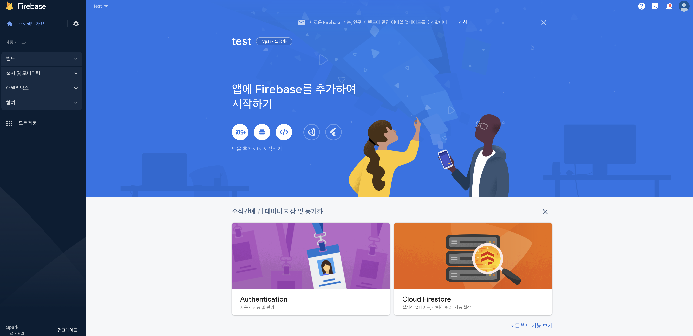
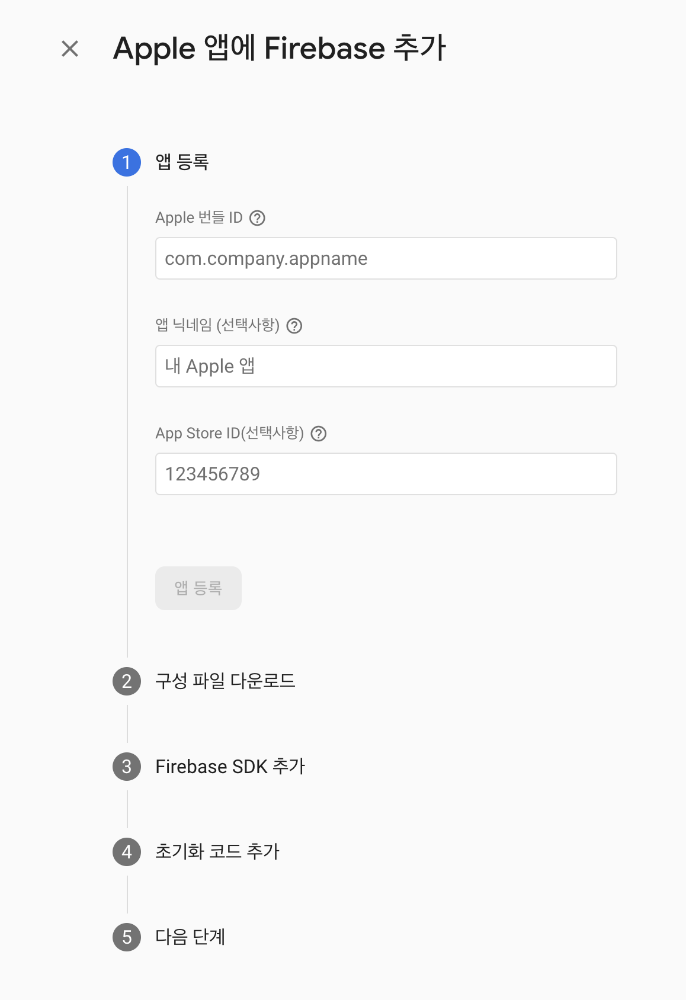
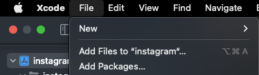
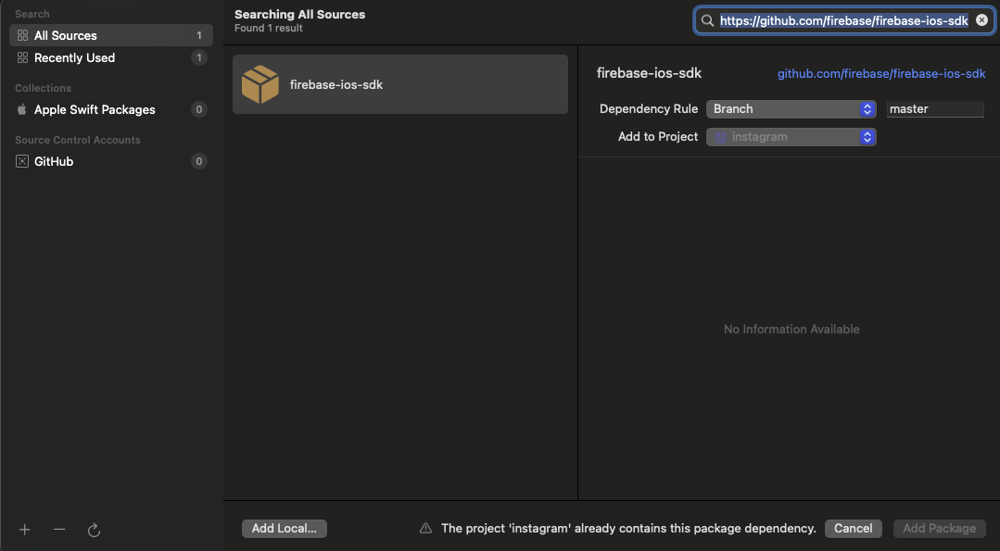
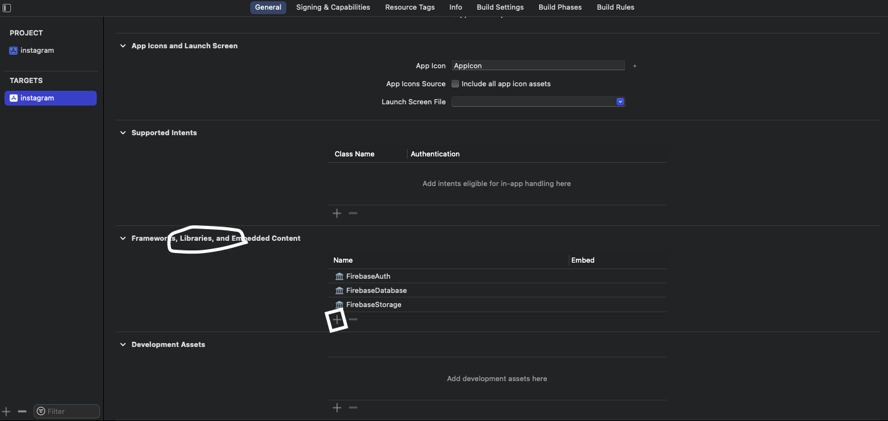

## 기본 설정

파이어베이스 홈페이지에 접속한 뒤 로그인을 하고 프로젝트를 생성한다. 해당 프로젝트의 대시보드에 접속하면 다음과 같은 화면이 나타난다.



위의 화면에서 중앙의 `앱에 Firebase를 추가하여 시작하기` 부분의 `iOS` 아이콘을 클릭한다.



`Apple 번들 ID` 칸에 앱 아이디를 입력한다. `xcode` 좌측 파일 목록 중 프로젝트를 클릭한 뒤 `TARGETS - General - Identify`속성에 `Bundle Identifier` 속성의 값을 그대로 입력하면 된다.

번들 ID값을 입력하면 `GoogleService-info.plist` 파일을 다운로드 받을 수 있다. 해당 파일을 설치하여 xcode 루트 프로젝트에 저장한다.

:::tip API 키 공유

[다음 문서](https://stackoverflow.com/questions/44937175/firebase-should-i-add-googleservice-info-plist-to-gitignore)에 따르면 파이어베이스에서 제공하는 `GoogleService-Info.plist` 파일은 깃헙과 같은 사이트에 업로드 되어도 괜찮다고 한다. 오히려 프로젝트 빌드 과정에서 대상 프로젝트 위치를 알려주는 용도이기 때문에 `.gitignore`에 파일 리스트로 추가하면 안된다고 한다.

:::

이후 `Firebase SDK`를 설치한다. `cocoapods` 또는 `Swift Package Manager`를 사용하면 된다.





xcode에서 제공하는 SPM을 사용하면 쉽게 설치가 가능하다. 파이어베이스 문서에서 제공하는 `firebase-ios-sdk` 깃헙 링크를 복사하여 SPM 검색창에 붙여넣으면 설치 가능하다.

:::warning 라이브러리 추가

파이어베이스 SDK가 설치된 뒤에 사용할 라이브러리까지 선택해야한다. 만약 라이브러리 설치 단계를 건너뛰어 코드가 작동하지 않는다면 파일 메뉴중 프로젝트 파일 선택 - `Frameworks, Libraries, and Embedded Content` - 플러스 버튼을 클릭하여 설치된 SDK 내부 라이브러리 목록을 선택하여 설치한다.



:::

라이브러리 설치까지 되었으면 `AppDelegate.swift` 파일에서 파이어베이스 설정 초기화 코드를 추가한다. 예시 코드가 나와있으니 그대로 작성하면 된다.

`AppDelegate.swift` 파일에서 `FirebaseCore`를 임포트 한 뒤, `AppDelegate` 클래스 내부 메서드 중 `didFinishLaunchingWithOptions` 안에 `FirebaseApp.configure()` 메서드만 호출해주면 된다.

## 사용자 인증 기능 추가

프로젝트 홈에서 `Authentication` 메뉴를 클릭한다. `Sign-in method` 탭에 활성화할 로그인 방법을 추가한 뒤 활성화 한다.

이메일 / 비밀번호 방법으로 로그인을 구현하려면 해당 방법을 활성화 하면 된다. 계정 생성을 위한 코드는 아래와 같다.

```swift
// Firebase 임포트
import Firebase

@objc func handleSignUp(){
    guard let email = emailTextField.text else { return }
    guard let password = passwordTextField.text else { return }

    // Firebase 코드
    Auth.auth().createUser(withEmail: email, password: password){(user, error) in

        if let error = error {
            print(error.localizedDescription)
        }

        print("created user: \(user)")
    }
    print(email)
}
```

파이어베이스의 `Auth.auth().createUser` 메서드를 통해 회원가입을 처리한다. 클로저에 유저와 에러를 파라미터로 받을 수 있다.

## Reference

1. [Firebase: Should I add GoogleService-Info.plist to .gitignore?](https://stackoverflow.com/questions/44937175/firebase-should-i-add-googleservice-info-plist-to-gitignore)
