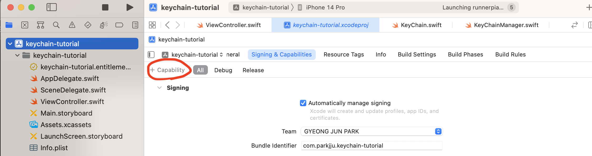

## 로그인 모달 제작

애플에서는 iOS 사용자들의 일관된 경험 제공을 위해 애플 로그인 버튼을 자체적으로 제공하고 있다. 해당 요소 사용을 위해서는 `AuthenticationServices`를 임포트한다. 이후 아래와 같이 함수들을 정의한다.

```swift
import UIKit
import AuthenticationServices

class ViewController: UIViewController {

    override func viewDidLoad() {
        super.viewDidLoad()

        setupProviderLoginView()
    }

    func setupProviderLoginView() {
        let authorizationButton = ASAuthorizationAppleIDButton()
        authorizationButton.addTarget(self, action: #selector(handleAuthorizationAppleIDButtonPress), for: .touchUpInside)

        // 오토레이아웃 설정 및 버튼 부착
        self.view.addSubview(authorizationButton)
        view.translatesAutoresizingMaskIntoConstraints = false
        authorizationButton.translatesAutoresizingMaskIntoConstraints = false
        authorizationButton.centerXAnchor.constraint(equalTo: self.view.centerXAnchor).isActive = true
        authorizationButton.centerYAnchor.constraint(equalTo: self.view.centerYAnchor).isActive = true
    }

    @objc func handleAuthorizationAppleIDButtonPress(){
        let appleIDProvider = ASAuthorizationAppleIDProvider()
        let request = appleIDProvider.createRequest()
        request.requestedScopes = [.fullName, .email]

        let authorizationController = ASAuthorizationController(authorizationRequests: [request])
        authorizationController.delegate = self
        authorizationController.presentationContextProvider = self
        authorizationController.performRequests()
    }
}
```

위 코드는 공식 문서에 모두 나와있는 내용들이다.

1. 애플에서 제공하는 `ASAuthorizationAppleIDButton` 버튼 인스턴스를 생성하여 뷰에 부착한다.
2. 해당 버튼에 대해 이벤트 핸들러를 부착한다.
3. 이벤트 핸들러에서 `ASAuthorizationAppleIDProvider` 인스턴스를 생성한다. 이 인스턴스는 사용자 정보에 대한 요청을 만들어준다. (`createRequest`로 요청에 대한 인스턴스를 생성한다.)
4. 사용자 정보 중 어떤 부분을 가져올지 `requestedScopes`속성으로 선택한다.
5. `ASAuthorizationController`를 위에서 생성한 요청 인스턴스와 함께 생성한다.
6. `ASAuthorizationController`에 대한 델리게이트 2개를 설정해줘야 하는데, `delegate`와 `presentationContextProvider`를 위임할 컨트롤러로 등록해둔다.
7. `performRequest`로 요청을 보낸다.

## 로그인 모달 띄우기

`handleAuthorizationAppleIDButtonPress` 핸들러 내에서 델리게이트를 두개 설정하고, 해당 프로토콜도 채택해야한다.

1. `authorizationController.presentationContextProvider` : `ASAuthorizationControllerPresentationContextProviding` - 모달 노출과 관련된 동작을 정의한다.
2. `authorizationController.delegate` : `ASAuthorizationControllerDelegate` - 데이터 통신 및 키체인 데이터 저장과 관련된 로직을 정의 및 수행한다.

모달 노출과 관련된 코드는 간단하다. 아래와 같이 작성해주면 된다.

```swift
extension ViewController: ASAuthorizationControllerPresentationContextProviding{
    func presentationAnchor(for controller: ASAuthorizationController) -> ASPresentationAnchor {
        return self.view.window!
    }
}
```

:::warning 테스트시 주의

로그인 뷰 관련 테스트시 주의할 사항 두가지가 있다.

1. 시뮬레이터상에서 본인 iCloud 계정으로 로그인되어 있을 것
2. xcode Capability에 sign in with apple이 추가되어 있을 것.

capability 관련 설정을 해두지 않으면 domain error가 발생한다.



위의 사진에 나와 있는 Capability를 추가하여 `Sign In With Apple`을 추가한 뒤 테스트를 진행하면 된다.

:::

## 키체인 CRUD - Create

키체인은 민감한 개인정보를 암호화된 형태로 저장할 수 있게 해주는 저장소이다. 우리가 관리할 개인정보를 키체인 아이템으로 만들어 저장소에 추가하는 방식이다. 코어데이터와 유사한 형태로 우리가 조작하고자 하는 키체인 아이템에 대해 CRUD 각각의 로직들을 구현해주어야 한다.

키체인 아이템 추가를 위한 함수를 구현해야 한다. `SecItemAdd`라고 명명했을때, 해당 함수의 첫번째 파라미터는 `query`이다. 쿼리의 타입은 `CFDictionary`이다.

두 번째 파라미터는 `UnsafeMutablePointer<CFTypeRef>?`이며 생성된 데이터를 포함한다. 우리가 POST요청을 보낸 뒤 데이터가 서버에 잘 적재되었는지 확인할때 서버로부터 응답 타입으로 POST보냈던 데이터 그대로 받는 경우를 생각하면 된다.

위의 복잡해보이는 파라미터 함수는 생성된 데이터를 조회할 수 있는 형태로, 실은 데이터 조회 관련 로직에서 더 의미 있게 사용되지만 `SetItemAdd`에서도 데이터 적재가 잘 되었는지 확인하는 용도로 사용할 수 있다는 것이다.

위의 함수는 `OSStatus`를 리턴한다.

:::tip OSStatus

`OSStatus`는 키체인 API에서 등장하며 쿼리 상태값을 나타낸다. `0` 또는 `errSecSuccess`를 리턴한 경우 이슈 없이 성공적인 쿼리가 이루어진 것을 나타낸다.

:::

키체인 아이템 생성을 위한 코드는 아래와 같다.

```swift
let keychainItemQuery = [
    kSecValueData: "gyeongjun".data(using: utf8)!,
    kSecClass: kSecClassGenericPassword
] as CFDictionary

let status = SecItemAdd(keychainItemQuery, nil)
print("Operation finished with status: \(status)")
```

위 코드에서는 `status`가 Swift로 브릿지되지 않았기 때문에 0값을 리턴 받을 것이고, 기존에 예상되는 결과인 `errSecSuccess`라는 `enum` 케이스를 리턴받지 않을 것이다.

각 `kSecClass` 어트리뷰트에 대한 값에 대해 요구하는 키값들이 다르다. 예컨대 `kSecClassInternetPassword` 클래스를 `kSecClass`로 지정할 경우 `kSecAttrServer`와 `kSecAttrAccount`라는 키값을 새롭게 지정해야한다.

클래스별로 요구하는 키값들이 다르므로, 때마다 서치하여 추가하는 것이 좋아보인다. 참고로 `kSecClassInternetPassword`의 경우 `kSecAttrServer`는 웹사이트 도메인을, `kSecAttrAccount`는 유저네임을 가리킨다.

### 키체인 파라미터

`SecItemAdd`함수의 두번째 파라미터는 `newly-added`대상을 가져올 수 있다. `result`를 가리키는데, 이는 키체인에 성공적으로 추가된 대상을 응답 결과로 가져올 수 있다는 것을 의미한다. 위에서 짧게 언급했듯 POST API에 대한 응답 결과를 생각하면 된다.

`UnsafeMutablePointer`타입은 메모리에 적재된 특정 타입의 인스턴스에 접근할때 사용한다고 한다.

메모리 상의 데이터에 대해 타입을 명시적으로 지정하는데, 이는 쿼리를 통해 이루어진다. 쿼리는 `kSecReturn`이라는 접두사를 가진다. **해당 쿼리는 역시 키체인 아이템 생성시 지정해주면 된다.** 키값과 함께 불리언을 지정하면 된다.

아래 속성들에 대한 내용들은 키체인 아이템 생성시 `true`로 설정되었을 때를 가정한다.

1. `kSecReturnRef`: 쿼리 내에서 `kSecClass`에 지정된 값을 기준으로 `result`가 `SecKeychainItem`, `SecKey`, `SecCertificate`, `SecIdentify`, `CFData`중 하나를 가리킨다고 한다.
2. `kSecReturnPersistentRef`: `result`가 `CFData`를 포함하며 이는 아이폰 내의 저장소에 영구적으로 저장된다고 한다.
3. `kSecReturnData`: `result`가 키체인 아이템에 포함된 `sensitive data`들을 반환해준다. `sensitive data`는 쿼리 내에 `kSecValueData` 키값이 포함되어 있는 경우 해당 값을 리턴해준다.
4. `kSecReturnAttributes`: 키체인 아이템 생성시 만들었던 `CFDictionary`내의 모든 속성값들을 리턴해준다.

`UnsafeMutablePointer<Pointee>` 타입은 `Pointee` 타입이 필요한데, 키체인 아이템의 경우 `CFTypeRef`가 사용된다. 하지만 이는 스위프트에서 사용되기에는 적절하지 않으며, 타입 캐스팅은 `AnyObject`로 하여 사용하면 된다.

```swift
// var ref: AnyObject?

let keychainItem = [
    kSecValueData: "Pullip2020".data(using: .utf8)!,
    kSecAttrAccount: "andyibanez",
    kSecAttrServer: "pullipstyle.com",
    kSecClass: kSecClassInternetPassword,
    kSecReturnAttributes: true
] as CFDictionary

let status = SecItemAdd(keychainItem, &ref)
let result = ref as! NSDictionary

print("operation status: \(status)")
print("returned attributes: ")

result.forEach { val in
    print("KEY: \(val.key)")
    print("value: \(val.value)")
}
```

위의 예시 코드에는 `ref` 주소값을 가져오고 있는데, 해당 변수는 저장속성으로 추가해두면 된다. 클래스 내의 저장속성으로 생성하며, 타입은 `AnyObject?`로 지정하면 된다.

출력하면 아래와 같은 형태를 볼 수 있다.

```swift
operation status: 0
returned attributes:
KEY: acct
value: andyibanez1
KEY: atyp
value:
KEY: sha1
value: {length = 20, bytes = 0x87ba87ebdc143b81cc98cfc35664a8f0ce11559a}
KEY: path
value:
KEY: sdmn
value:
KEY: pdmn
value: ak
KEY: srvr
value: pullipstyle1.com
KEY: sync
value: 0
KEY: cdat
value: 2023-07-04 07:04:17 +0000
KEY: ptcl
value: 0
KEY: mdat
value: 2023-07-04 07:04:17 +0000
KEY: agrp
value: 5JQS3FU5R6.com.parkjju.keychain-tutorial
KEY: port
value: 0
```

위의 값들을 직접 사용하지 않으며, `&ref`에 저장된 딕셔너리 키값을 기준으로 밸류값을 얻어내어 사용하게 된다.

`CFDictionary` 쿼리 생성시 사용했던 키값들을 그대로 사용하면 된다.

```swift
print(result[kSecAttrServer])
// Optional(pullipstyle.com)
```

:::warning 테스트시

키체인아이템 생성 테스트시 쿼리를 한번 보내면 특정 저장소에 저장되기 때문에, 중복으로 인한 에러가 발생하게 된다.

위의 경우 `kSecAttrServer`가 동일하면 동일한 도메인 서버에 동일한 계정을 추가할때 에러가 발생하기 때문에 도메인을 바꿔주거나 유저네임을 바꾸면 문제없이 테스트가 가능하다.

:::

위의 키체인 아이템 예시에 따라 키값을 세팅해두는 경우 `result`가 기본적으로 패스워드를 `utf8`로 인코딩한 데이터가 된다. 따라서 애초에 `CFDictionary`생성시 등록한 패스워드 문자열값을 가져오기 위해서는 `String`으로 타입캐스팅이 필요하다.

또한, 리턴값을 패스워드로 받고싶기 때문에 기존 예시에 등록된 `kSecReturnAttributes` 키값을 사용하는 것이 아니라 `kSecReturnData`를 사용한다. 해당 키값은 위의 설명에 따르면 `sensitive data`를 리턴받을때 사용하기 때문에 패스워드를 리턴받는 목적에 부합한다고 볼 수 있다.

```swift
let keychainItem = [
    kSecValueData: "Pullip2021".data(using: .utf8)!,
    kSecAttrAccount: "andyibanez4",
    kSecAttrServer: "pullipstyle1.com",
    kSecClass: kSecClassInternetPassword,
    kSecReturnData: true
] as CFDictionary

SecItemAdd(keychainItem, &ref)
let result = ref as! Data
let password = String(data: result, encoding: .utf8)
print("password: \(password)")
```

키값에 `kSecReturnData`를 지정하면 리턴되는 데이터가 패스워드이기 때문에, `NSDictionary` 딕셔너리를 통해 다른 일반적인 데이터 접근에 한계가 생긴다.

다행히도 `kSecReturnData`와 `kSecReturnAttributes`를 둘다 지정할 수 있기 때문에 다른 데이터들에 대한 접근과 더불어 패스워드 역시 딕셔너리로 접근 가능하게 된다.

```swift
let keychainItem = [
    kSecValueData: "Pullip2021".data(using: .utf8)!,
    kSecAttrAccount: "andyibanez6",
    kSecAttrServer: "pullipstyle1.com",
    kSecClass: kSecClassInternetPassword,

    // 키값추가!
    kSecReturnData: true,
    kSecReturnAttributes: true
] as CFDictionary

SecItemAdd(keychainItem, &ref)
let result = ref as! NSDictionary

// 패스워드 디코딩
let password = String(data: result[kSecValueData] as! Data, encoding: .utf8)

// 패스워드 출력과 나머지 딕셔너리 키값중 유저네임 출력
print("password: \(password)")
print("username: \(result[kSecAttrAccount])")
```

## 키체인 CRUD - Read

키체인으로부터 아이템을 리턴받고자 쿼리를 작성할때는 `SecItemCopyMatching` 함수를 작성한다. 함수 작성 흐름은 `SetItemAdd`와 동일하다.

1. `CFDictionary`에 쿼리를 작성한다.
2. 함수 호출시 두번째 파라미터에 리턴값을 저장하도록 `AnyObject` 포인터를 전달해둔다.

각종 조회 API에서 동일하듯, 조회 대상이 한개일수도 여러개일수도 있다. 이는 쿼리 내에서 키값에 `kSecMatchLimit`을 통해 지정해줄 수 있다.

키값을 1로 지정하는 경우 1개만, 그 이상일 경우 `CFDictionary`의 `CFArray`타입으로 리턴받는다.

물론 이는 조회결과가 존재하는 경우이며 없는 경우 `nil`을 리턴받게 된다.

```swift
let keychainItem = [
    kSecAttrServer: "pullipstyle1.com",
    kSecClass: kSecClassInternetPassword,
    kSecReturnData: true,
    kSecReturnAttributes: true,
    // 리턴받을 데이터 갯수 결정
    kSecMatchLimit: 10
] as CFDictionary

SecItemCopyMatching(keychainItem, &ref)
let arr = ref as! [NSDictionary]

arr.forEach { dict in
    let username = dict[kSecAttrAccount] ?? ""
    let passwordData = dict[kSecValueData] as! Data
    let password = String(data: passwordData, encoding: .utf8)!
    print("username: \(username)")
    print("password: \(password)")
}
```

키체인 아이템에 `kSecAttrAccount`를 새롭게 지정하면 쿼리에 매치되는 데이터들만 더 명시적으로 선택하여 가져올 수 있다.

## 키체인 CRUD - Update

키체인 아이템 업데이트를 위해서는 `SecItemUpdate` 함수를 사용한다. 위의 `SecItemCopyMatching`와는 다르게 업데이트 대상 필드와 어떤 값으로 변경해야 할 지에 대해 명시해야 한다. 업데이트 대상 필드는 딕셔너리 형태로 작성하며 동일하게 `CFDictionary`로 타입캐스팅하면 된다.

`SecItemUpdate`함수는 첫 번째 파라미터로 쿼리, 두 번째 파라미터로 업데이트 대상 딕셔너리를 받는다.

```swift
let updateQuery = [
    kSecAttrServer: "pullipstyle1.com",
    kSecAttrAccount: "andyibanez1",
    kSecClass: kSecClassInternetPassword
] as CFDictionary

let updateField = [
    kSecValueData: "newPassword!!".data(using: .utf8)!
] as CFDictionary

let status = SecItemUpdate(updateQuery, updateField)
print("update completed.. \(status)")
```

**불필요한 데이터 변경을 방지하기 위해 `update` 쿼리는 반드시 구체적으로 명시해줘야 한다.**

## 키체인 CRUD - Delete

키체인 아이템 삭제를 위해서는 쿼리만 작성하면 된다.

```swift
let deleteQuery = [
    kSecAttrServer: "pullipstyle1.com",
    kSecAttrAccount: "andyibanez1",
    kSecClass: kSecClassInternetPassword
] as CFDictionary

let status = SecItemDelete(deleteQuery)
print("delete completed with status: \(status)")
```

삭제 완료시 0값이 리턴된다.

## Reference

1. [Sign in with apple - Apple document](https://developer.apple.com/documentation/sign_in_with_apple/implementing_user_authentication_with_sign_in_with_apple)
2. [Using the iOS Keychain in Swift](https://www.andyibanez.com/posts/using-ios-keychain-swift/)
